### 5.4.4、`SpringCache`

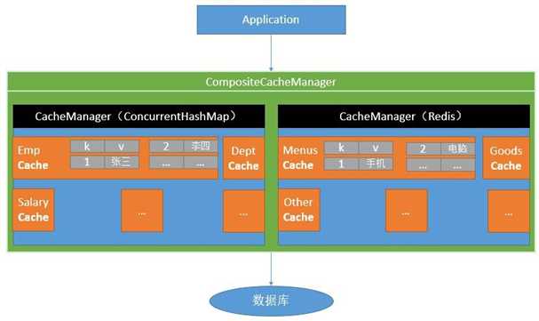

官方文档： https://docs.spring.io/spring-framework/docs/current/reference/html/integration.html#cache

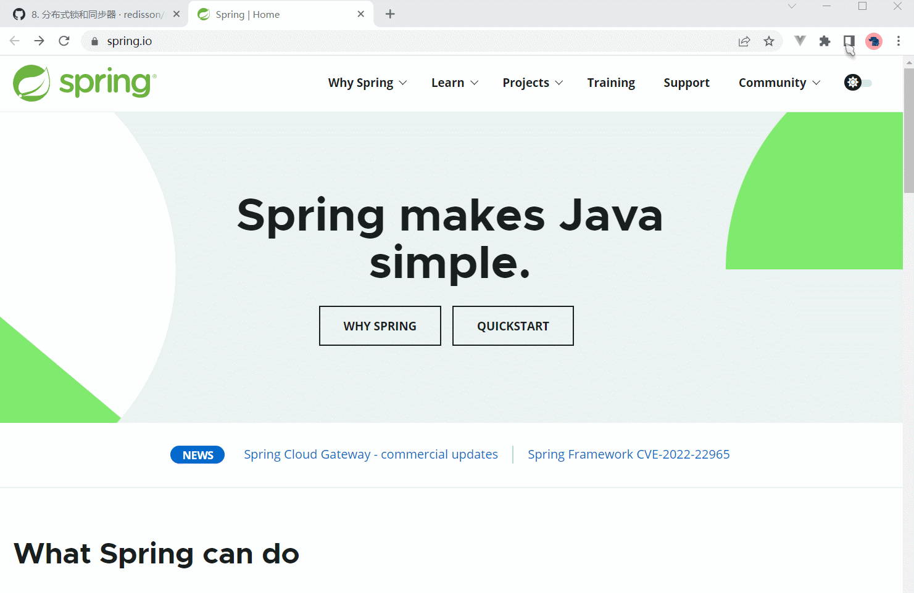

#### 1、`SpringCache`组成

##### 1、`CacheManager`

双击`Shift`，在搜索框中搜索`CacheManager`，可以看到`org.springframework.cache.CacheManager`类有`getCache`和`getCacheNames`两个方法

```java
/*
 * Copyright 2002-2019 the original author or authors.
 *
 * Licensed under the Apache License, Version 2.0 (the "License");
 * you may not use this file except in compliance with the License.
 * You may obtain a copy of the License at
 *
 *      https://www.apache.org/licenses/LICENSE-2.0
 *
 * Unless required by applicable law or agreed to in writing, software
 * distributed under the License is distributed on an "AS IS" BASIS,
 * WITHOUT WARRANTIES OR CONDITIONS OF ANY KIND, either express or implied.
 * See the License for the specific language governing permissions and
 * limitations under the License.
 */

package org.springframework.cache;

import java.util.Collection;

import org.springframework.lang.Nullable;

/**
 * Spring's central cache manager SPI.
 *
 * <p>Allows for retrieving named {@link Cache} regions.
 *
 * @author Costin Leau
 * @author Sam Brannen
 * @since 3.1
 */
public interface CacheManager {

   /**
    * Get the cache associated with the given name.
    * <p>Note that the cache may be lazily created at runtime if the
    * native provider supports it.
    * @param name the cache identifier (must not be {@code null})
    * @return the associated cache, or {@code null} if such a cache
    * does not exist or could be not created
    */
   @Nullable
   Cache getCache(String name);

   /**
    * Get a collection of the cache names known by this manager.
    * @return the names of all caches known by the cache manager
    */
   Collection<String> getCacheNames();

}
```

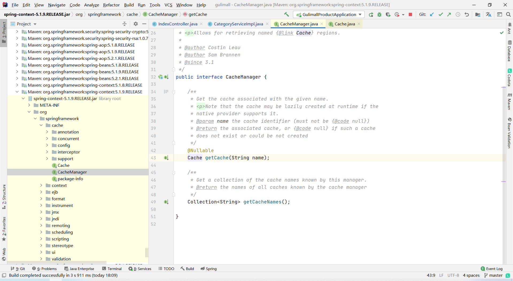

##### 2、`Cache`

点击`Cache`类里面，可以看到在`org.springframework.cache.Cache`类里面定义的有缓存的`增删查改`等方法

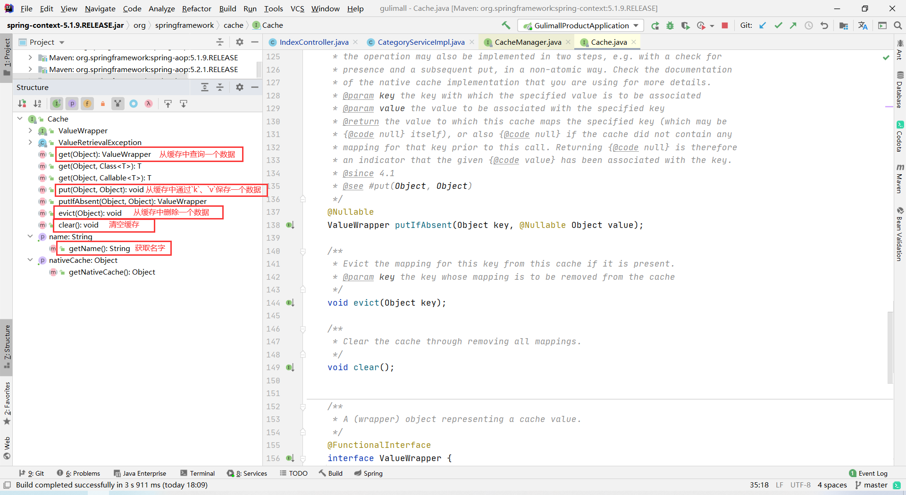

##### 3、`ConcurrentMapCacheManager`

在`CacheManager`类里，按`ctrl+H`快捷键，可以看到`Spring`支持非常多的缓存管理器，打开`ConcurrentMapCacheManager`类

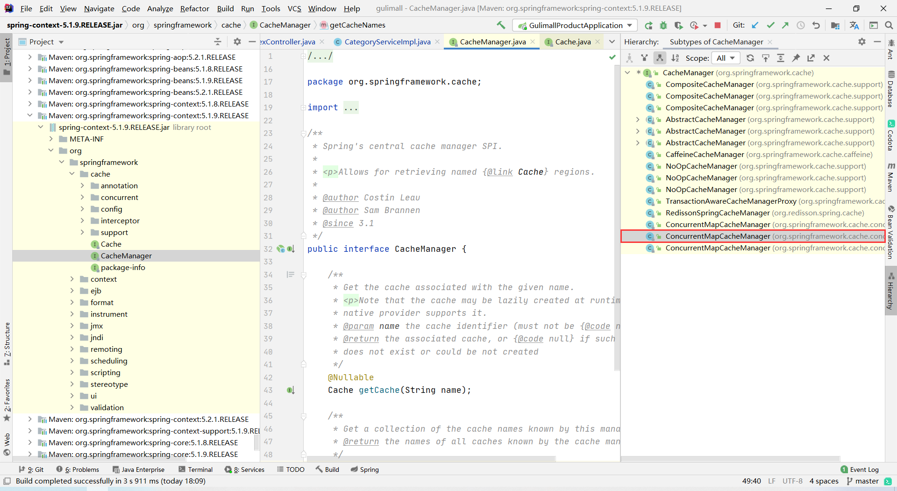

在`org.springframework.cache.concurrent.ConcurrentMapCacheManager`类的构造器里可以输入需要管理的缓存的名字

该构造方法会调用本类的`setCacheNames`方法，并把传进来的不定长的`cacheNames`转为`List`

```java
/**
 * Construct a static ConcurrentMapCacheManager,
 * managing caches for the specified cache names only.
 */
public ConcurrentMapCacheManager(String... cacheNames) {
   setCacheNames(Arrays.asList(cacheNames));
}


/**
 * Specify the set of cache names for this CacheManager's 'static' mode.
 * <p>The number of caches and their names will be fixed after a call to this method,
 * with no creation of further cache regions at runtime.
 * <p>Calling this with a {@code null} collection argument resets the
 * mode to 'dynamic', allowing for further creation of caches again.
 */
public void setCacheNames(@Nullable Collection<String> cacheNames) {
   if (cacheNames != null) {
      for (String name : cacheNames) {
         this.cacheMap.put(name, createConcurrentMapCache(name));
      }
      this.dynamic = false;
   }
   else {
      this.dynamic = true;
   }
}
```

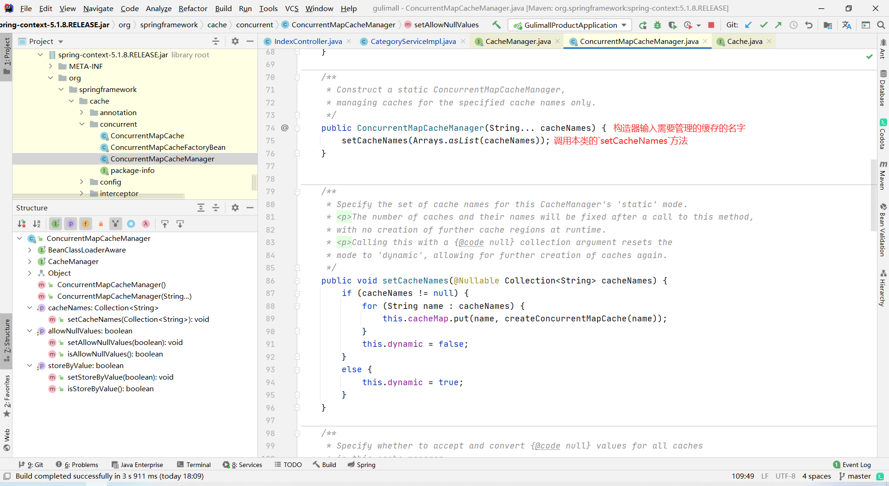

在`setCacheNames`方法里会遍历传进来的`cacheNames`，并把这些`name`作为`k`、调用`createConcurrentMapCache(name)`方法的返回值作为`v`放入本类的`cacheMap`属性里，本类的`cacheMap`对象其实就是`ConcurrentHashMap`类型

```java
private final ConcurrentMap<String, Cache> cacheMap = new ConcurrentHashMap<>(16);
```

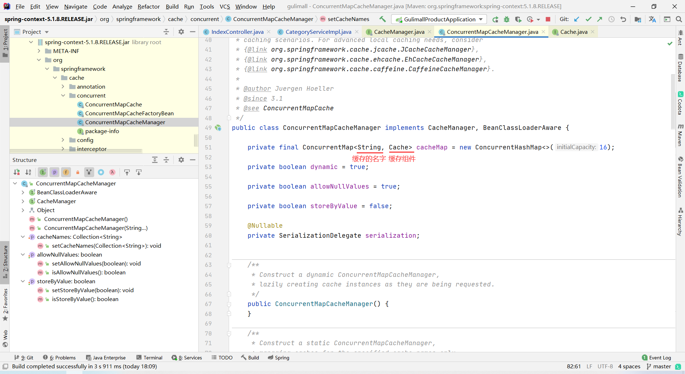

`createConcurrentMapCache(name)`方法的返回的形式参数为`org.springframework.cache.Cache`，实际参数为`org.springframework.cache.concurrent.ConcurrentMapCache`，而`ConcurrentMapCache`继承`org.springframework.cache.support.AbstractValueAdaptingCache`，`AbstractValueAdaptingCache`实现`org.springframework.cache.Cache`

```java
public class ConcurrentMapCache extends AbstractValueAdaptingCache
public abstract class AbstractValueAdaptingCache implements Cache
```

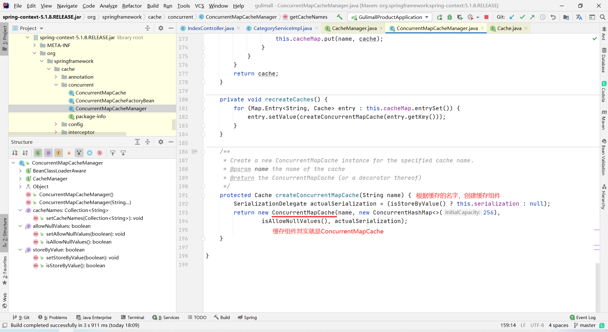

##### 4、`ConcurrentMapCache`

点进`ConcurrentMapCache`里面，可以看到`org.springframework.cache.concurrent.ConcurrentMapCache`类里有类型为`ConcurrentMap<Object, Object>`的`store`属性，该属性用于存储数据

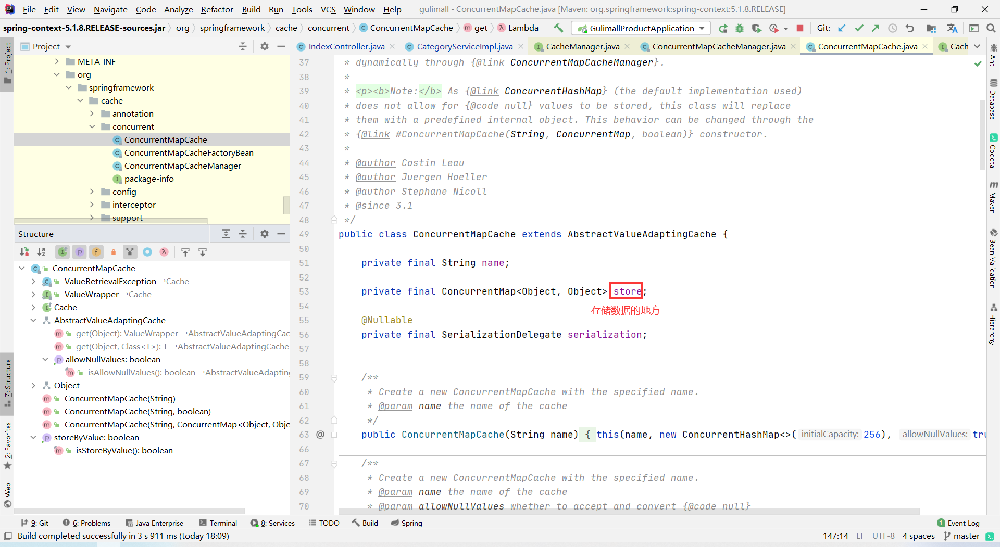

往下看，可以看到都是从`store`中获取数据的


#### 2、引入`SpringCache`

##### 1、导入依赖

在`gulimall-product`模块的`pom.xml`里引入`SpringCache`

```xml
<dependency>
    <groupId>org.springframework.boot</groupId>
    <artifactId>spring-boot-starter-cache</artifactId>
</dependency>
```

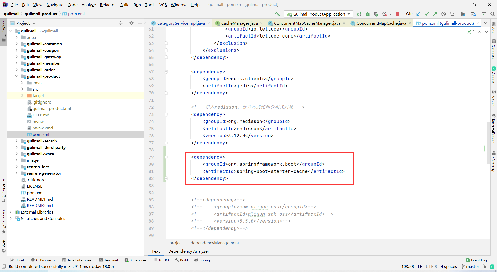

##### 2、`CacheAutoConfiguration`

缓存的自动配置类是`org.springframework.boot.autoconfigure.cache.CacheAutoConfiguration`类，在`CacheAutoConfiguration`类里，缓存的所有属性都在`CacheProperties`类里封装着

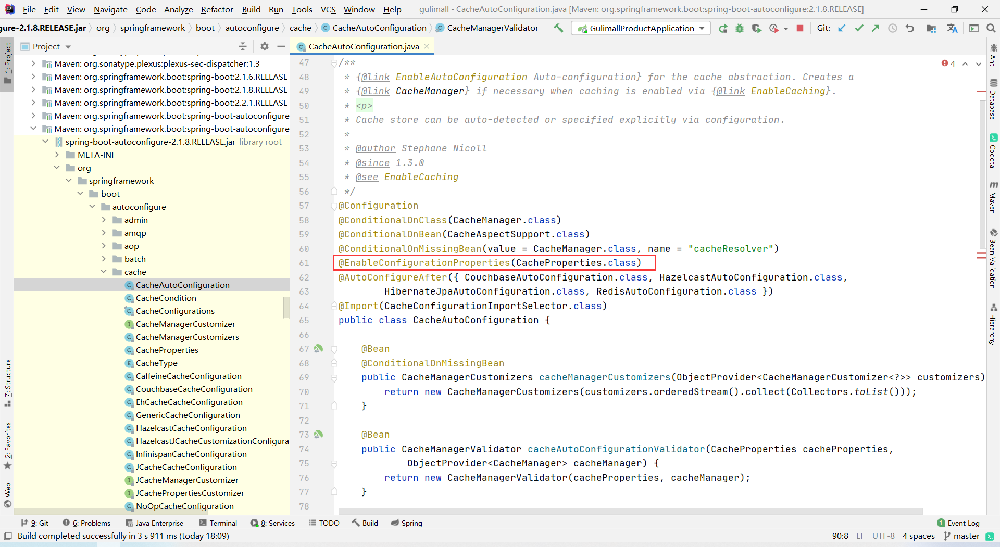

##### 3、`CacheProperties`

在`org.springframework.boot.autoconfigure.cache.CacheProperties`类里的属性，在配置文件中都以`spring.cache`开始

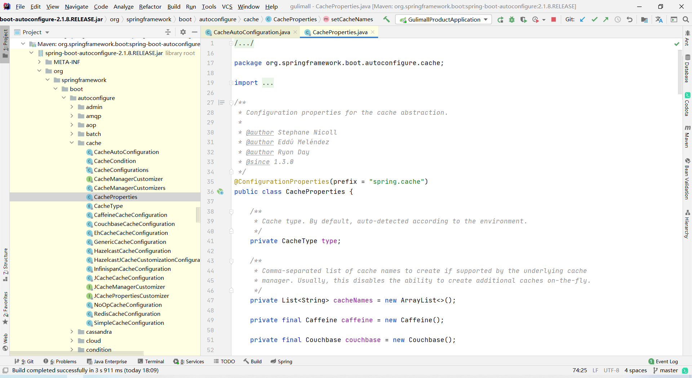

##### 4、切换到`CacheAutoConfiguration`

返回`CacheAutoConfiguration`类，其内部的`CacheConfigurationImportSelector`选择器里面又导了很多配置

```java
/**
 * {@link ImportSelector} to add {@link CacheType} configuration classes.
 */
static class CacheConfigurationImportSelector implements ImportSelector {

   @Override
   public String[] selectImports(AnnotationMetadata importingClassMetadata) {
      CacheType[] types = CacheType.values();
      String[] imports = new String[types.length];
      for (int i = 0; i < types.length; i++) {
         imports[i] = CacheConfigurations.getConfigurationClass(types[i]);
      }
      return imports;
   }

}
```

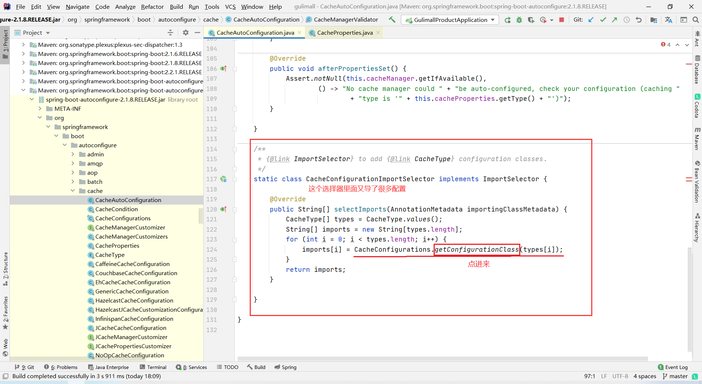

##### 5、`CacheConfigurations`

在`org.springframework.boot.autoconfigure.cache.CacheConfigurations`类的`getConfigurationClass`方法里，按照缓存的类型进行映射

```java
public static String getConfigurationClass(CacheType cacheType) {
   Class<?> configurationClass = MAPPINGS.get(cacheType);
   Assert.state(configurationClass != null, () -> "Unknown cache type " + cacheType);
   return configurationClass.getName();
}
```

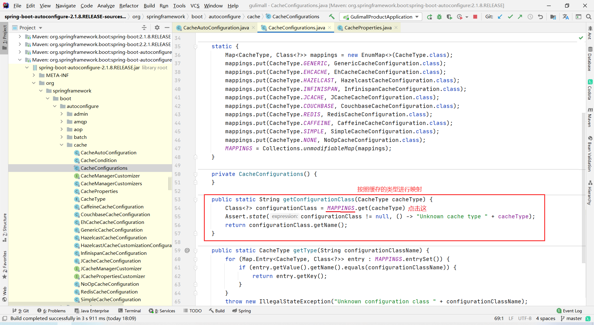

如果使用的是`redis`，就使用RedisCacheConfiguration配置类

```java
private static final Map<CacheType, Class<?>> MAPPINGS;

static {
   Map<CacheType, Class<?>> mappings = new EnumMap<>(CacheType.class);
   mappings.put(CacheType.GENERIC, GenericCacheConfiguration.class);
   mappings.put(CacheType.EHCACHE, EhCacheCacheConfiguration.class);
   mappings.put(CacheType.HAZELCAST, HazelcastCacheConfiguration.class);
   mappings.put(CacheType.INFINISPAN, InfinispanCacheConfiguration.class);
   mappings.put(CacheType.JCACHE, JCacheCacheConfiguration.class);
   mappings.put(CacheType.COUCHBASE, CouchbaseCacheConfiguration.class);
   mappings.put(CacheType.REDIS, RedisCacheConfiguration.class);
   mappings.put(CacheType.CAFFEINE, CaffeineCacheConfiguration.class);
   mappings.put(CacheType.SIMPLE, SimpleCacheConfiguration.class);
   mappings.put(CacheType.NONE, NoOpCacheConfiguration.class);
   MAPPINGS = Collections.unmodifiableMap(mappings);
}
```

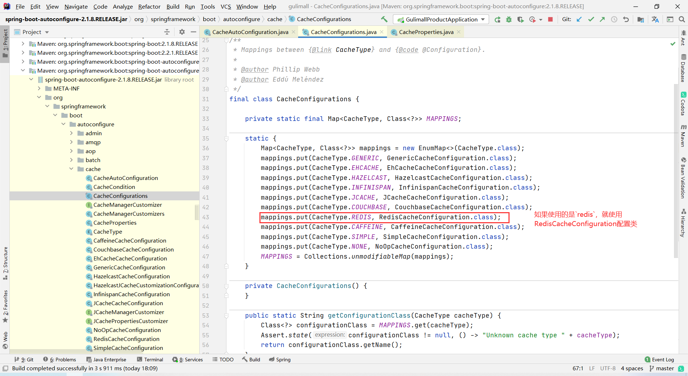

##### 6、`RedisCacheConfiguration`

在`org.springframework.boot.autoconfigure.cache.RedisCacheConfiguration`类里，配置了缓存管理器

```java
@Bean
public RedisCacheManager cacheManager(RedisConnectionFactory redisConnectionFactory,
      ResourceLoader resourceLoader) {
   RedisCacheManagerBuilder builder = RedisCacheManager.builder(redisConnectionFactory)
         .cacheDefaults(determineConfiguration(resourceLoader.getClassLoader()));
   List<String> cacheNames = this.cacheProperties.getCacheNames();
   if (!cacheNames.isEmpty()) {
      builder.initialCacheNames(new LinkedHashSet<>(cacheNames));
   }
   return this.customizerInvoker.customize(builder.build());
}
```

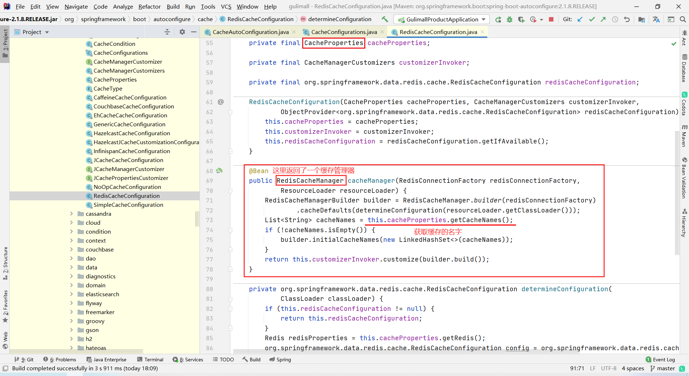

##### 7、`CacheProperties`

在`org.springframework.boot.autoconfigure.cache.CacheProperties`类里如果配置了`spring.cache.cacheNames`，就可以获取到这些缓存的名字

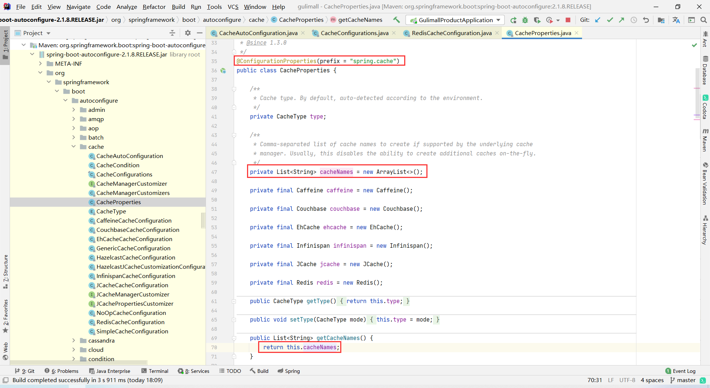

##### 8、切换到`RedisCacheConfiguration`

切换到`RedisCacheConfiguration`类，在`cacheManager`方法获取到缓存的名字后，在`builder.initialCacheNames(new LinkedHashSet<>(cacheNames));`初始化缓存

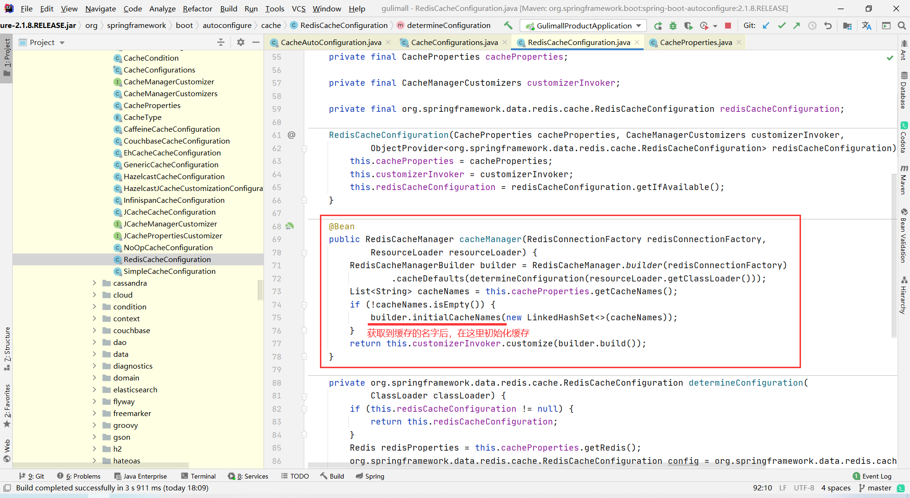

##### 9、`RedisCacheManager`

在`org.springframework.data.redis.cache.RedisCacheManager`类的`initialCacheNames`方法里

遍历`cacheNames`，使用默认缓存配置，把它们放到`cacheConfigMap`里面，并初始化缓存配置

```java
/**
 * Append a {@link Set} of cache names to be pre initialized with current {@link RedisCacheConfiguration}.
 * <strong>NOTE:</strong> This calls depends on {@link #cacheDefaults(RedisCacheConfiguration)} using whatever
 * default {@link RedisCacheConfiguration} is present at the time of invoking this method.
 *
 * @param cacheNames must not be {@literal null}.
 * @return this {@link RedisCacheManagerBuilder}.
 */
public RedisCacheManagerBuilder initialCacheNames(Set<String> cacheNames) {

   Assert.notNull(cacheNames, "CacheNames must not be null!");

   Map<String, RedisCacheConfiguration> cacheConfigMap = new LinkedHashMap<>(cacheNames.size());
   //遍历`cacheNames`，使用默认缓存配置，把它们放到`cacheConfigMap`里面
   cacheNames.forEach(it -> cacheConfigMap.put(it, defaultCacheConfiguration));
   //初始化缓存配置
   return withInitialCacheConfigurations(cacheConfigMap);
}
```

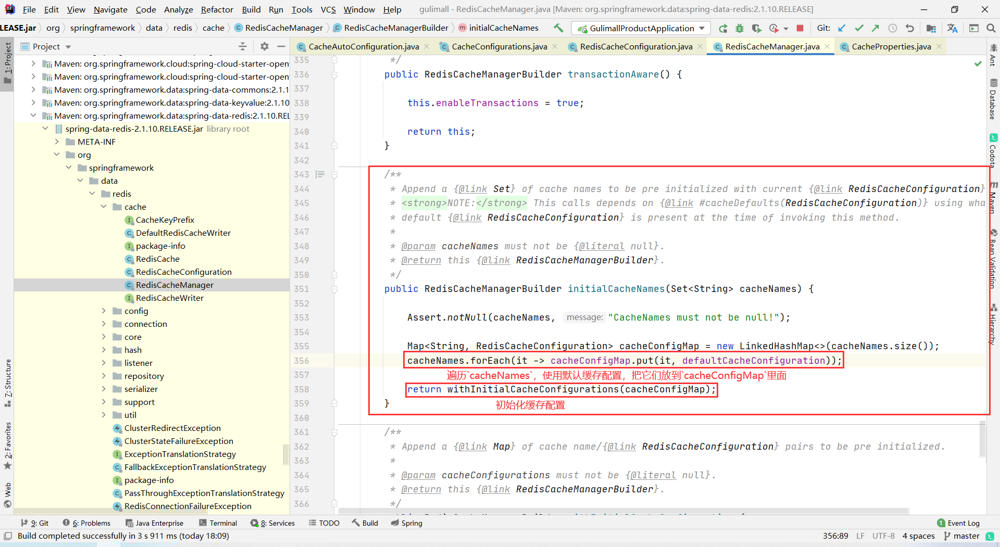

`withInitialCacheConfigurations(cacheConfigMap)`方法会把类型为`Map<String, RedisCacheConfiguration>`的`cacheConfigMap`放到同样类型的`initialCaches`里面

```java
private final Map<String, RedisCacheConfiguration> initialCaches = new LinkedHashMap<>();

/**
 * Append a {@link Map} of cache name/{@link RedisCacheConfiguration} pairs to be pre initialized.
 *
 * @param cacheConfigurations must not be {@literal null}.
 * @return this {@link RedisCacheManagerBuilder}.
 */
public RedisCacheManagerBuilder withInitialCacheConfigurations(
      Map<String, RedisCacheConfiguration> cacheConfigurations) {

   Assert.notNull(cacheConfigurations, "CacheConfigurations must not be null!");
   cacheConfigurations.forEach((cacheName, configuration) -> Assert.notNull(configuration,
         String.format("RedisCacheConfiguration for cache %s must not be null!", cacheName)));

   this.initialCaches.putAll(cacheConfigurations);

   return this;
}
```

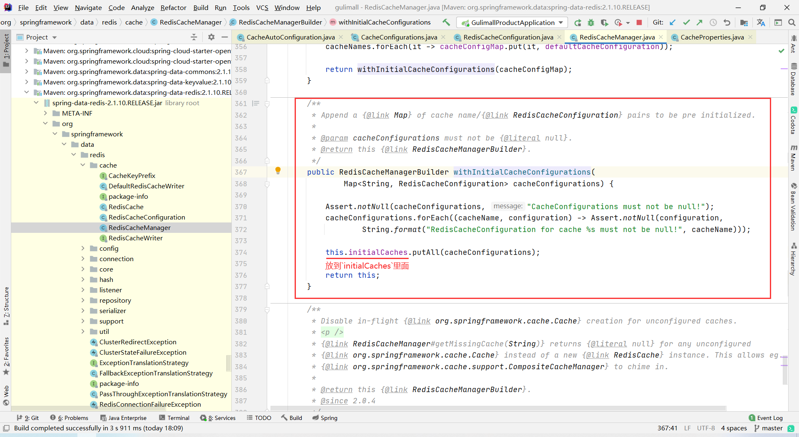

`initialCaches`属性的类型为`Map<String, RedisCacheConfiguration>`，其中`String`存放了缓存的名字，`RedisCacheConfiguration`存放了`RedisCacheConfiguration.defaultCacheConfig()`方法返回的默认的`RedisCacheConfiguration`

```java
private final Map<String, RedisCacheConfiguration> initialCaches = new LinkedHashMap<>();
```

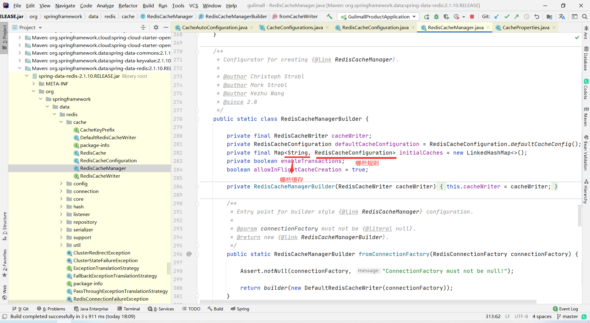

##### 10、切换到`RedisCacheConfiguration`

切换到`RedisCacheConfiguration`，在`cacheManager`方法里调用了`determineConfiguration`方法，`determineConfiguration`方法里如果`ioc`容器中不存在`RedisCacheConfiguration`则会进行默认配置

```java
@Bean
public RedisCacheManager cacheManager(RedisConnectionFactory redisConnectionFactory,
      ResourceLoader resourceLoader) {
   RedisCacheManagerBuilder builder = RedisCacheManager.builder(redisConnectionFactory)
         .cacheDefaults(determineConfiguration(resourceLoader.getClassLoader()));
   List<String> cacheNames = this.cacheProperties.getCacheNames();
   if (!cacheNames.isEmpty()) {
      builder.initialCacheNames(new LinkedHashSet<>(cacheNames));
   }
   return this.customizerInvoker.customize(builder.build());
}

private org.springframework.data.redis.cache.RedisCacheConfiguration determineConfiguration(
      ClassLoader classLoader) {
   if (this.redisCacheConfiguration != null) {
      return this.redisCacheConfiguration;
   }
   Redis redisProperties = this.cacheProperties.getRedis();
   org.springframework.data.redis.cache.RedisCacheConfiguration config = org.springframework.data.redis.cache.RedisCacheConfiguration
         .defaultCacheConfig();
   config = config.serializeValuesWith(
         SerializationPair.fromSerializer(new JdkSerializationRedisSerializer(classLoader))); //序列化机制
   if (redisProperties.getTimeToLive() != null) { //过期时间
      config = config.entryTtl(redisProperties.getTimeToLive());
   }
   if (redisProperties.getKeyPrefix() != null) { //前缀
      config = config.prefixKeysWith(redisProperties.getKeyPrefix());
   }
   if (!redisProperties.isCacheNullValues()) { //要不要缓存空数据
      config = config.disableCachingNullValues();
   }
   if (!redisProperties.isUseKeyPrefix()) { //是否使用缓存的前缀
      config = config.disableKeyPrefix();
   }
   return config;
}
```

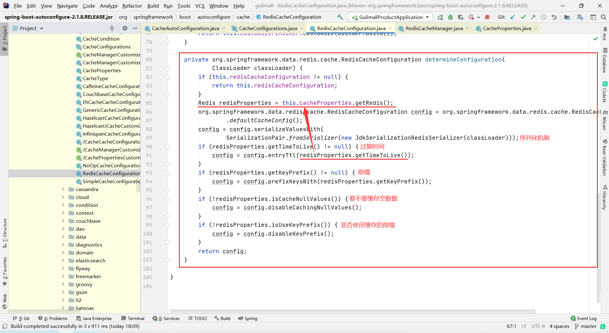

#### 3、添加配置

在`gulimall-product`模块的`src/main/resources`目录下新建`application.properties`配置文件，在该配置文件内添加配置

```properties
#缓存的类型
spring.cache.type=redis

#缓存的名字
#如果配置了缓存的名字，则只能使用这些名字
#系统中用到哪些缓存了，帮你创建出来
#spring.cache.cache-names=qq,qqq
```

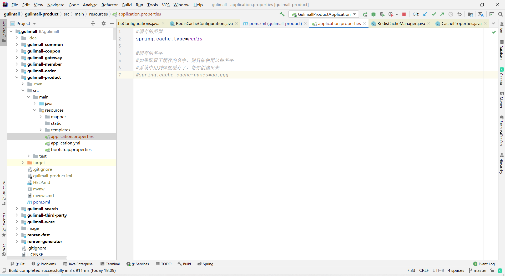

在`org.springframework.boot.autoconfigure.cache.CacheProperties`类的`cacheNames`字段上有一段注释

如果底层缓存管理器支持，要创建的缓存名称的逗号分隔列表。 通常，这会禁用动态创建附加缓存的能力。

```java
/**
 * Comma-separated list of cache names to create if supported by the underlying cache
 * manager. Usually, this disables the ability to create additional caches on-the-fly.
 */
private List<String> cacheNames = new ArrayList<>();
```

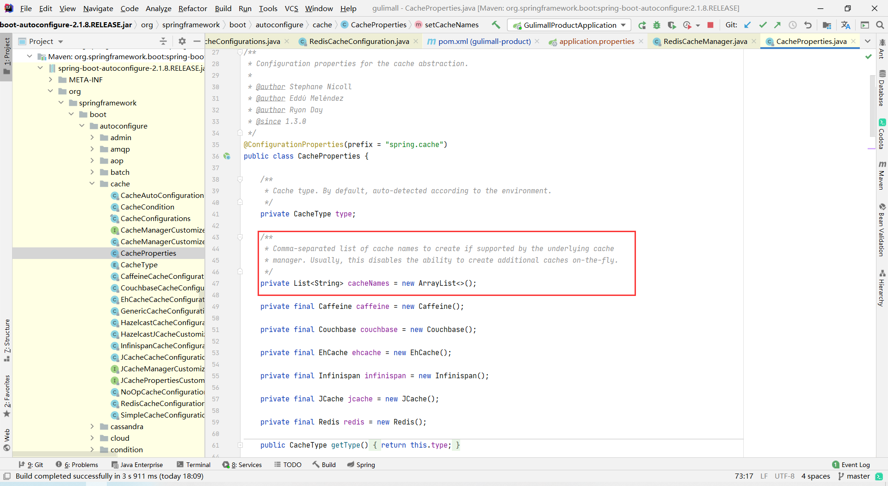

#### 4、常用注解(1)

For caching declaration, Spring’s caching abstraction provides a set of Java annotations:

- `@Cacheable`: Triggers cache population.  触发缓存填充 (触发将数据保存到缓存的操作)
- `@CacheEvict`: Triggers cache eviction.  触发缓存驱逐 (触发将数据从缓存删除的操作)
- `@CachePut`: Updates the cache without interfering with the method execution. 在不干扰方法执行的情况下更新缓存 (不影响方法执行更新缓存)
- `@Caching`: Regroups multiple cache operations to be applied on a method. 重新组合多个缓存操作以应用于一个方法 (组合以上多个操作)
- `@CacheConfig`: Shares some common cache-related settings at class-level. 在类级别共享一些常见的缓存相关设置 (在类级别共享缓存的相同配置)

##### 1、`@EnableCaching`开启缓存功能

在`gulimall-product`模块的`com.atguigu.gulimall.product.GulimallProductApplication`启动类上添加`@EnableCaching`注解

```java
@EnableCaching
@EnableFeignClients(basePackages = "com.atguigu.gulimall.product.feign")
@EnableDiscoveryClient
@MapperScan("com.atguigu.gulimall.product.dao")
@SpringBootApplication
public class GulimallProductApplication {
    public static void main(String[] args) {
        SpringApplication.run(GulimallProductApplication.class,args);
    }
}
```

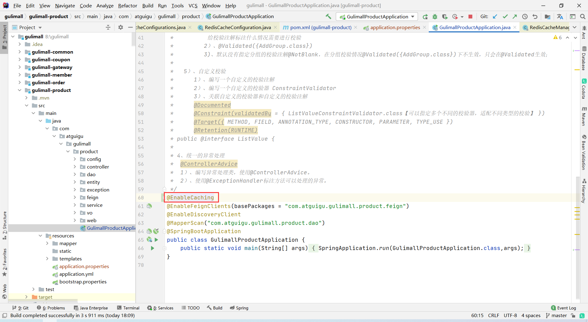

##### 2、`@Cacheable`添加缓存

修改`gulimall-product`模块的`com.atguigu.gulimall.product.service.impl.CategoryServiceImpl`类的`getLevel1Categories`方法。添加`@Cacheable`注解，代表当前方法的结果需要缓存，如果缓存中有，方法不用调用。如果缓存中没有，会调用方法，最后将方法的结果放入缓存。`value = {"category"}`，指定放到名为`category`的分区下

```java
//每一个需要缓存的数据我们都来指定要放到那个名字的缓存。[ 缓存的分区(按照业务类型分)]
//代表当前方法的结果需要缓存，如果缓存中有，方法不用调用。如果缓存中没有，会调用方法，最后将方法的结果放入缓存
@Cacheable({"category"})
@Override
public List<CategoryEntity> getLevel1Categories() {
    System.out.println("getLevel1Categories...");
    LambdaQueryWrapper<CategoryEntity> lambdaQueryWrapper = new LambdaQueryWrapper<>();
    lambdaQueryWrapper.eq(CategoryEntity::getParentCid, 0);
    lambdaQueryWrapper.select(CategoryEntity::getCatId, CategoryEntity::getName);
    //long start = System.currentTimeMillis();
    List<CategoryEntity> categoryEntities = this.baseMapper.selectList(lambdaQueryWrapper);
    //long end = System.currentTimeMillis();
    //System.out.println("消耗时间："+(end-start));
    return categoryEntities;
}
```

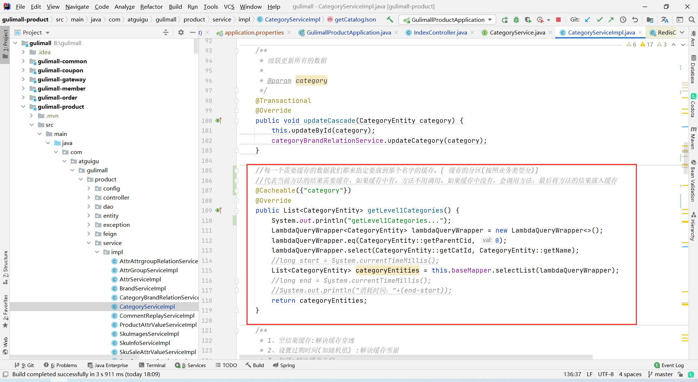

##### 3、测试

如果缓存中没有数据，会调用方法，最后将方法的结果放入缓存。如果缓存中有，方法不用调用，直接返回数据

可以看到已经自动缓存数据了，但是`key`不是我们指定的，过期时间也为`-1`(永不过期)、数据的格式也不为`JSON`

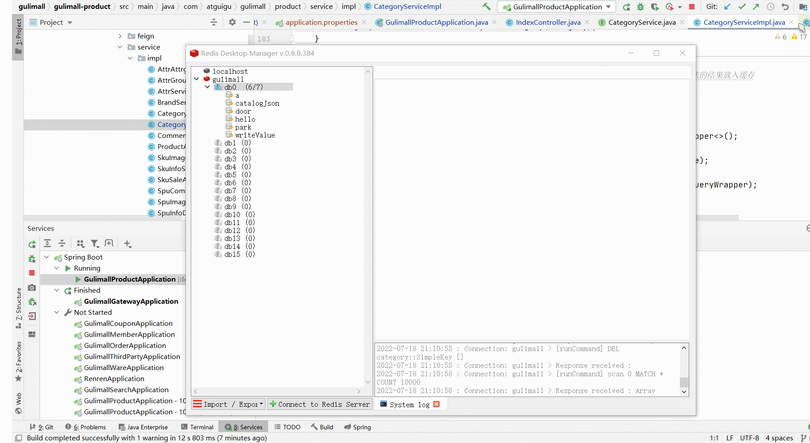

##### 4、`@Cacheable`可选参数

在`org.springframework.cache.annotation.Cacheable`注解接口里

`value`起了个别名叫`cacheNames`

`cacheNames`起了个别名叫`value`

```java
package org.springframework.cache.annotation;

import java.lang.annotation.Documented;
import java.lang.annotation.ElementType;
import java.lang.annotation.Inherited;
import java.lang.annotation.Retention;
import java.lang.annotation.RetentionPolicy;
import java.lang.annotation.Target;
import java.util.concurrent.Callable;

import org.springframework.core.annotation.AliasFor;

@Target({ElementType.TYPE, ElementType.METHOD})
@Retention(RetentionPolicy.RUNTIME)
@Inherited
@Documented
public @interface Cacheable {

  /**
   * Alias for {@link #cacheNames}.
   */
  @AliasFor("cacheNames")
  String[] value() default {};

  /**
   * Names of the caches in which method invocation results are stored.
   * <p>Names may be used to determine the target cache (or caches), matching
   * the qualifier value or bean name of a specific bean definition.
   * @since 4.2
   * @see #value
   * @see CacheConfig#cacheNames
   */
  @AliasFor("value")
  String[] cacheNames() default {};

  String key() default "";

  String keyGenerator() default "";

  String cacheManager() default "";

  String cacheResolver() default "";

  String condition() default "";

  String unless() default "";

  boolean sync() default false;

}
```

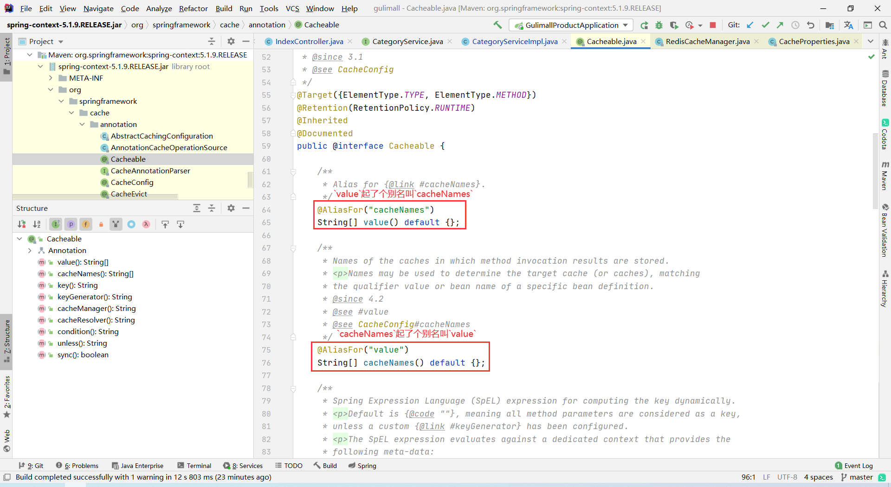

其他参数代表如下意思：

```java
//指定k值是什么(支持SpringEL)(如果不是EL表达式，需要加上单引号)
String key() default "";
//k的生成器
String keyGenerator() default "";
//指定使用哪个缓存管理器
String cacheManager() default "";
//缓存用的条件(把哪些数据放到缓存里面，可以接收一个表达式)
String condition() default "";
//除了指定的情况外，其他情况都向缓存中保存数据
String unless() default "";
//设置是否使用同步方式(如果是同步方式，unless就不可用)
boolean sync() default false;
```

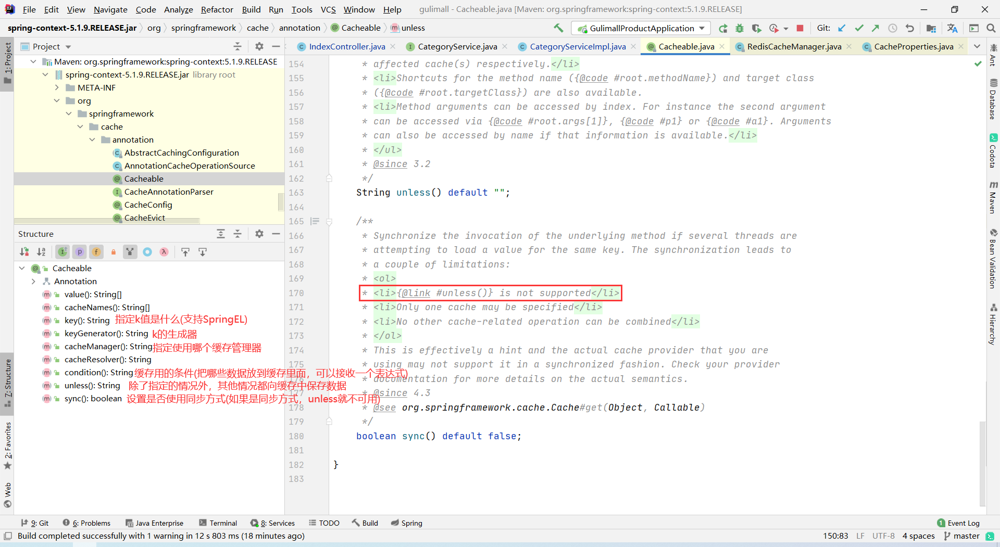

官方文档： https://docs.spring.io/spring-framework/docs/current/reference/html/integration.html#cache

支持的EL表达式

| Name          | Location           | Description                                                  | Example                                                      |
| :------------ | :----------------- | :----------------------------------------------------------- | :----------------------------------------------------------- |
| `methodName`  | Root object        | The name of the method being invoked                         | `#root.methodName`                                           |
| `method`      | Root object        | The method being invoked                                     | `#root.method.name`                                          |
| `target`      | Root object        | The target object being invoked                              | `#root.target`                                               |
| `targetClass` | Root object        | The class of the target being invoked                        | `#root.targetClass`                                          |
| `args`        | Root object        | The arguments (as array) used for invoking the target        | `#root.args[0]`                                              |
| `caches`      | Root object        | Collection of caches against which the current method is run | `#root.caches[0].name`                                       |
| Argument name | Evaluation context | Name of any of the method arguments. If the names are not available (perhaps due to having no debug information), the argument names are also available under the `#a<#arg>` where `#arg` stands for the argument index (starting from `0`). | `#iban` or `#a0` (you can also use `#p0` or `#p<#arg>` notation as an alias). |
| `result`      | Evaluation context | The result of the method call (the value to be cached). Only available in `unless` expressions, `cache put` expressions (to compute the `key`), or `cache evict` expressions (when `beforeInvocation` is `false`). For supported wrappers (such as `Optional`), `#result` refers to the actual object, not the wrapper. | `#result`                                                    |

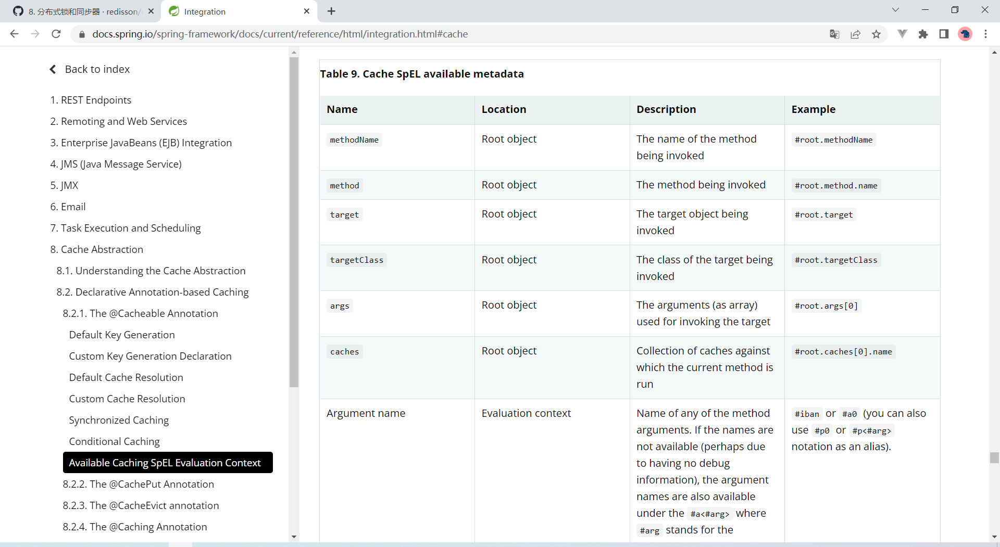

#### 5、需求

##### 1、指定`key`

可以在`key`的值的字符串里加上`'`单引号(`key = "'xxx'"`)，指明不使用`SpEL`

```java
/**
 * 1、每一个需要缓存的数据我们都来指定要放到那个名字的缓存。[ 缓存的分区(按照业务类型分)]
 * 2、@Cacheable({"category"})
 *   代表当前方法的结果需要缓存，如果缓存中有，方法不用调用。
 *   如果缓存中没有，会调用方法，最后将方法的结果放入缓存
 * 3、默认行为
 *   1)、如果缓存中有，方法不用调用。
 *   2)、key默认自动生成;缓存的名字::SimpleKey []( 自主生成的key值)
 *   3)、缓存的value的值。默认使用jdk序列化机制，将序列化后的数据存到redis
 * 4)、默认ttl时间-1; .
 * 自定义:
 *   1)、指定生成的缓存使用的key:
 *     key属性指定，接受一个SpEL
 *     SpEL的详细https ://docs.spring. io/spring/docs/5.1.12. REL EASE/spring-framework-re.
 *   2)、指定缓存的数据的存活时间:配置文件中 修改ttL
 *   3)、将数据保存为json格式
 **/

@Cacheable(value = {"category"}, key = "'level1Categories'")
@Override
public List<CategoryEntity> getLevel1Categories() {
    System.out.println("getLevel1Categories...");
    LambdaQueryWrapper<CategoryEntity> lambdaQueryWrapper = new LambdaQueryWrapper<>();
    lambdaQueryWrapper.eq(CategoryEntity::getParentCid, 0);
    lambdaQueryWrapper.select(CategoryEntity::getCatId, CategoryEntity::getName);
    //long start = System.currentTimeMillis();
    List<CategoryEntity> categoryEntities = this.baseMapper.selectList(lambdaQueryWrapper);
    //long end = System.currentTimeMillis();
    //System.out.println("消耗时间："+(end-start));
    return categoryEntities;
}
```

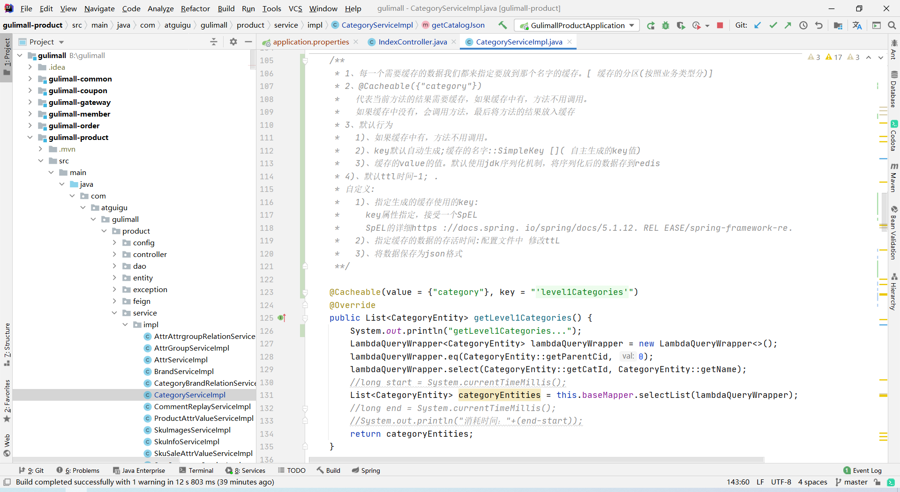

##### 2、指定过期时间

在`gulimall-product`模块的`src/main/resources/application.properties`类里添加`key`为`spring.cache.redis.time-to-live`的属性可以指定缓存的过期时间(以`ms`(毫秒)为单位)

```java
spring.cache.redis.time-to-live=3600000
```

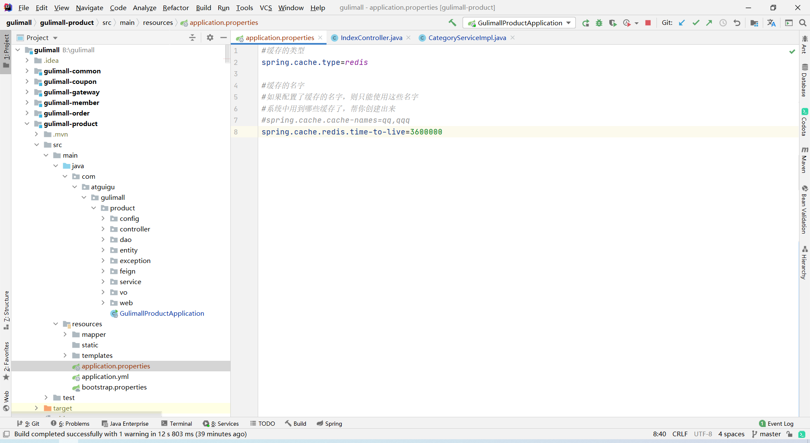

##### 3、使用`JSON`存储

使用`JSON`存储，不可以直接通过配置文件或参数的方式指定，需要自定义`RedisCacheConfiguration`

#### 6、自定义`RedisCacheConfiguration`

##### 1、`RedisCacheConfiguration`

查看`org.springframework.boot.autoconfigure.cache.RedisCacheConfiguration`类，`Redis缓存管理器`调用了`确定配置`的方法，用于确定使用什么配置

```java
@Bean
public RedisCacheManager cacheManager(RedisConnectionFactory redisConnectionFactory,
      ResourceLoader resourceLoader) {
   RedisCacheManagerBuilder builder = RedisCacheManager.builder(redisConnectionFactory)
         .cacheDefaults(determineConfiguration(resourceLoader.getClassLoader()));
   List<String> cacheNames = this.cacheProperties.getCacheNames();
   if (!cacheNames.isEmpty()) {
      builder.initialCacheNames(new LinkedHashSet<>(cacheNames));
   }
   return this.customizerInvoker.customize(builder.build());
}
```

而`确定配置`的方法里，判断如果本类的`redis缓存配置`存在，就使用存在的缓存配置

如果不存在就是使用默认的缓存配置

如果`ioc`容器中存在`redis缓存配置`，就赋值到本类的`redis缓存配置`属性里

```java
private org.springframework.data.redis.cache.RedisCacheConfiguration determineConfiguration(
      ClassLoader classLoader) {
   if (this.redisCacheConfiguration != null) {
      return this.redisCacheConfiguration;
   }
   Redis redisProperties = this.cacheProperties.getRedis();
   org.springframework.data.redis.cache.RedisCacheConfiguration config = org.springframework.data.redis.cache.RedisCacheConfiguration
         .defaultCacheConfig();
   config = config.serializeValuesWith(
         SerializationPair.fromSerializer(new JdkSerializationRedisSerializer(classLoader)));
   if (redisProperties.getTimeToLive() != null) {
      config = config.entryTtl(redisProperties.getTimeToLive());
   }
   if (redisProperties.getKeyPrefix() != null) {
      config = config.prefixKeysWith(redisProperties.getKeyPrefix());
   }
   if (!redisProperties.isCacheNullValues()) {
      config = config.disableCachingNullValues();
   }
   if (!redisProperties.isUseKeyPrefix()) {
      config = config.disableKeyPrefix();
   }
   return config;
}
```


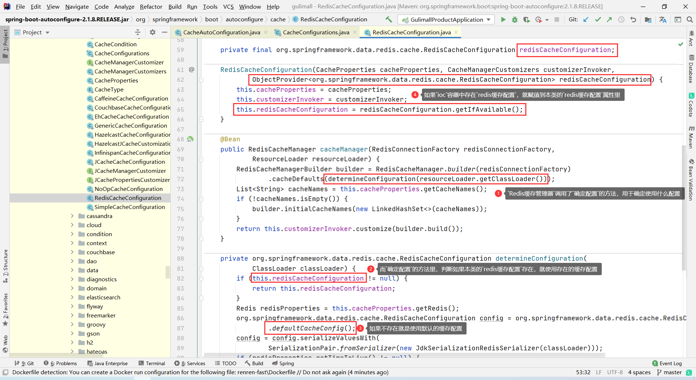

完整代码：

```java
/*
 * Copyright 2012-2019 the original author or authors.
 *
 * Licensed under the Apache License, Version 2.0 (the "License");
 * you may not use this file except in compliance with the License.
 * You may obtain a copy of the License at
 *
 *      https://www.apache.org/licenses/LICENSE-2.0
 *
 * Unless required by applicable law or agreed to in writing, software
 * distributed under the License is distributed on an "AS IS" BASIS,
 * WITHOUT WARRANTIES OR CONDITIONS OF ANY KIND, either express or implied.
 * See the License for the specific language governing permissions and
 * limitations under the License.
 */

package org.springframework.boot.autoconfigure.cache;

import java.util.LinkedHashSet;
import java.util.List;

import org.springframework.beans.factory.ObjectProvider;
import org.springframework.boot.autoconfigure.AutoConfigureAfter;
import org.springframework.boot.autoconfigure.cache.CacheProperties.Redis;
import org.springframework.boot.autoconfigure.condition.ConditionalOnBean;
import org.springframework.boot.autoconfigure.condition.ConditionalOnClass;
import org.springframework.boot.autoconfigure.condition.ConditionalOnMissingBean;
import org.springframework.boot.autoconfigure.data.redis.RedisAutoConfiguration;
import org.springframework.cache.CacheManager;
import org.springframework.context.annotation.Bean;
import org.springframework.context.annotation.Conditional;
import org.springframework.context.annotation.Configuration;
import org.springframework.core.io.ResourceLoader;
import org.springframework.data.redis.cache.RedisCacheManager;
import org.springframework.data.redis.cache.RedisCacheManager.RedisCacheManagerBuilder;
import org.springframework.data.redis.connection.RedisConnectionFactory;
import org.springframework.data.redis.serializer.JdkSerializationRedisSerializer;
import org.springframework.data.redis.serializer.RedisSerializationContext.SerializationPair;

/**
 * Redis cache configuration.
 *
 * @author Stephane Nicoll
 * @author Mark Paluch
 * @author Ryon Day
 */
@Configuration
@ConditionalOnClass(RedisConnectionFactory.class)
@AutoConfigureAfter(RedisAutoConfiguration.class)
@ConditionalOnBean(RedisConnectionFactory.class)
@ConditionalOnMissingBean(CacheManager.class)
@Conditional(CacheCondition.class)
class RedisCacheConfiguration {

   private final CacheProperties cacheProperties;

   private final CacheManagerCustomizers customizerInvoker;

   private final org.springframework.data.redis.cache.RedisCacheConfiguration redisCacheConfiguration;

   RedisCacheConfiguration(CacheProperties cacheProperties, CacheManagerCustomizers customizerInvoker,
         ObjectProvider<org.springframework.data.redis.cache.RedisCacheConfiguration> redisCacheConfiguration) {
      this.cacheProperties = cacheProperties;
      this.customizerInvoker = customizerInvoker;
      this.redisCacheConfiguration = redisCacheConfiguration.getIfAvailable();
   }

   @Bean
   public RedisCacheManager cacheManager(RedisConnectionFactory redisConnectionFactory,
         ResourceLoader resourceLoader) {
      RedisCacheManagerBuilder builder = RedisCacheManager.builder(redisConnectionFactory)
            .cacheDefaults(determineConfiguration(resourceLoader.getClassLoader()));
      List<String> cacheNames = this.cacheProperties.getCacheNames();
      if (!cacheNames.isEmpty()) {
         builder.initialCacheNames(new LinkedHashSet<>(cacheNames));
      }
      return this.customizerInvoker.customize(builder.build());
   }

   private org.springframework.data.redis.cache.RedisCacheConfiguration determineConfiguration(
         ClassLoader classLoader) {
      if (this.redisCacheConfiguration != null) {
         return this.redisCacheConfiguration;
      }
      Redis redisProperties = this.cacheProperties.getRedis();
      org.springframework.data.redis.cache.RedisCacheConfiguration config = org.springframework.data.redis.cache.RedisCacheConfiguration
            .defaultCacheConfig();
      config = config.serializeValuesWith(
            SerializationPair.fromSerializer(new JdkSerializationRedisSerializer(classLoader)));
      if (redisProperties.getTimeToLive() != null) {
         config = config.entryTtl(redisProperties.getTimeToLive());
      }
      if (redisProperties.getKeyPrefix() != null) {
         config = config.prefixKeysWith(redisProperties.getKeyPrefix());
      }
      if (!redisProperties.isCacheNullValues()) {
         config = config.disableCachingNullValues();
      }
      if (!redisProperties.isUseKeyPrefix()) {
         config = config.disableKeyPrefix();
      }
      return config;
   }

}
```

##### 2、`RedisCacheConfiguration`

点击

```java
private final org.springframework.data.redis.cache.RedisCacheConfiguration redisCacheConfiguration;
```

里的`RedisCacheConfiguration`，即可看到`org.springframework.data.redis.cache.RedisCacheConfiguration`的`RedisCacheConfiguration`

这里就有`keySerializationPair`(键序列化对)和`valueSerializationPair`(值序列化对)

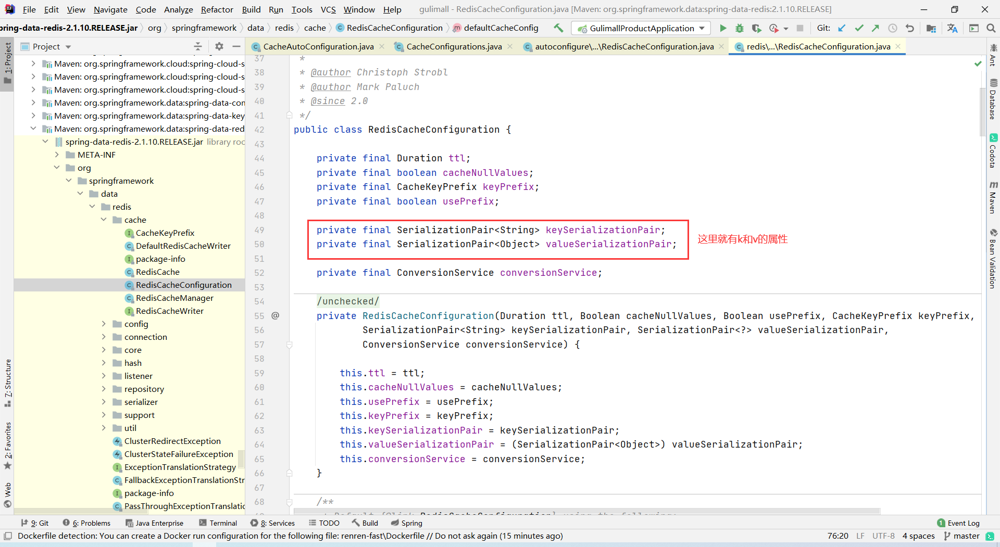

在`defaultCacheConfig`方法的文档注释里可以看到，`key`使用了`StringRedisSerializer`来序列化，`value`使用`JdkSerializationRedisSerializer`来序列化

```java
/**
 * Default {@link RedisCacheConfiguration} using the following:
 * <dl>
 * <dt>key expiration</dt>
 * <dd>eternal</dd>
 * <dt>cache null values</dt>
 * <dd>yes</dd>
 * <dt>prefix cache keys</dt>
 * <dd>yes</dd>
 * <dt>default prefix</dt>
 * <dd>[the actual cache name]</dd>
 * <dt>key serializer</dt>
 * <dd>{@link org.springframework.data.redis.serializer.StringRedisSerializer}</dd>
 * <dt>value serializer</dt>
 * <dd>{@link org.springframework.data.redis.serializer.JdkSerializationRedisSerializer}</dd>
 * <dt>conversion service</dt>
 * <dd>{@link DefaultFormattingConversionService} with {@link #registerDefaultConverters(ConverterRegistry) default}
 * cache key converters</dd>
 * </dl>
 *
 * @return new {@link RedisCacheConfiguration}.
 */
public static RedisCacheConfiguration defaultCacheConfig() {
   return defaultCacheConfig(null);
}
```

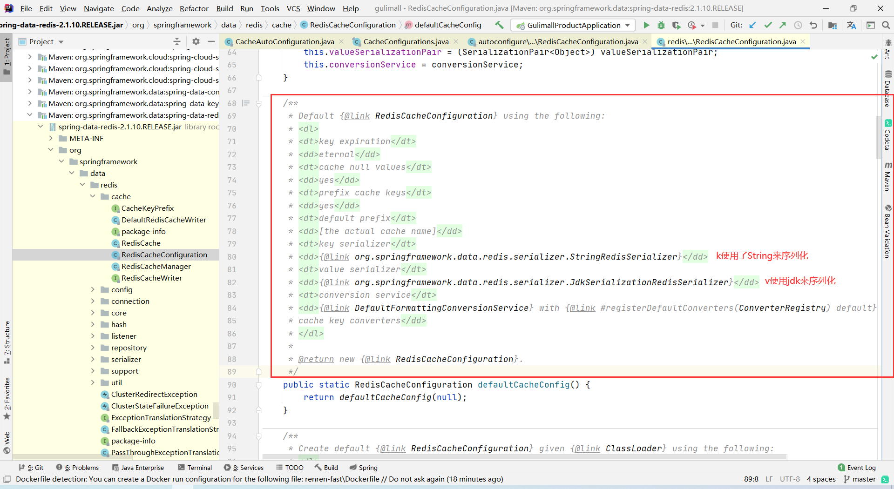

完整代码：

```java
/*
 * Copyright 2017-2019 the original author or authors.
 *
 * Licensed under the Apache License, Version 2.0 (the "License");
 * you may not use this file except in compliance with the License.
 * You may obtain a copy of the License at
 *
 *      https://www.apache.org/licenses/LICENSE-2.0
 *
 * Unless required by applicable law or agreed to in writing, software
 * distributed under the License is distributed on an "AS IS" BASIS,
 * WITHOUT WARRANTIES OR CONDITIONS OF ANY KIND, either express or implied.
 * See the License for the specific language governing permissions and
 * limitations under the License.
 */
package org.springframework.data.redis.cache;

import java.nio.charset.StandardCharsets;
import java.time.Duration;
import java.util.Optional;

import org.springframework.cache.Cache;
import org.springframework.cache.interceptor.SimpleKey;
import org.springframework.core.convert.ConversionService;
import org.springframework.core.convert.converter.ConverterRegistry;
import org.springframework.data.redis.serializer.RedisSerializationContext.SerializationPair;
import org.springframework.data.redis.serializer.RedisSerializer;
import org.springframework.format.support.DefaultFormattingConversionService;
import org.springframework.lang.Nullable;
import org.springframework.util.Assert;

/**
 * Immutable {@link RedisCacheConfiguration} helps customizing {@link RedisCache} behaviour such as caching
 * {@literal null} values, cache key prefixes and binary serialization. <br />
 * Start with {@link RedisCacheConfiguration#defaultCacheConfig()} and customize {@link RedisCache} behaviour from there
 * on.
 *
 * @author Christoph Strobl
 * @author Mark Paluch
 * @since 2.0
 */
public class RedisCacheConfiguration {

   private final Duration ttl;
   private final boolean cacheNullValues;
   private final CacheKeyPrefix keyPrefix;
   private final boolean usePrefix;

   private final SerializationPair<String> keySerializationPair;
   private final SerializationPair<Object> valueSerializationPair;

   private final ConversionService conversionService;

   @SuppressWarnings("unchecked")
   private RedisCacheConfiguration(Duration ttl, Boolean cacheNullValues, Boolean usePrefix, CacheKeyPrefix keyPrefix,
         SerializationPair<String> keySerializationPair, SerializationPair<?> valueSerializationPair,
         ConversionService conversionService) {

      this.ttl = ttl;
      this.cacheNullValues = cacheNullValues;
      this.usePrefix = usePrefix;
      this.keyPrefix = keyPrefix;
      this.keySerializationPair = keySerializationPair;
      this.valueSerializationPair = (SerializationPair<Object>) valueSerializationPair;
      this.conversionService = conversionService;
   }

   /**
    * Default {@link RedisCacheConfiguration} using the following:
    * <dl>
    * <dt>key expiration</dt>
    * <dd>eternal</dd>
    * <dt>cache null values</dt>
    * <dd>yes</dd>
    * <dt>prefix cache keys</dt>
    * <dd>yes</dd>
    * <dt>default prefix</dt>
    * <dd>[the actual cache name]</dd>
    * <dt>key serializer</dt>
    * <dd>{@link org.springframework.data.redis.serializer.StringRedisSerializer}</dd>
    * <dt>value serializer</dt>
    * <dd>{@link org.springframework.data.redis.serializer.JdkSerializationRedisSerializer}</dd>
    * <dt>conversion service</dt>
    * <dd>{@link DefaultFormattingConversionService} with {@link #registerDefaultConverters(ConverterRegistry) default}
    * cache key converters</dd>
    * </dl>
    *
    * @return new {@link RedisCacheConfiguration}.
    */
   public static RedisCacheConfiguration defaultCacheConfig() {
      return defaultCacheConfig(null);
   }

   /**
    * Create default {@link RedisCacheConfiguration} given {@link ClassLoader} using the following:
    * <dl>
    * <dt>key expiration</dt>
    * <dd>eternal</dd>
    * <dt>cache null values</dt>
    * <dd>yes</dd>
    * <dt>prefix cache keys</dt>
    * <dd>yes</dd>
    * <dt>default prefix</dt>
    * <dd>[the actual cache name]</dd>
    * <dt>key serializer</dt>
    * <dd>{@link org.springframework.data.redis.serializer.StringRedisSerializer}</dd>
    * <dt>value serializer</dt>
    * <dd>{@link org.springframework.data.redis.serializer.JdkSerializationRedisSerializer}</dd>
    * <dt>conversion service</dt>
    * <dd>{@link DefaultFormattingConversionService} with {@link #registerDefaultConverters(ConverterRegistry) default}
    * cache key converters</dd>
    * </dl>
    *
    * @param classLoader the {@link ClassLoader} used for deserialization by the
    *          {@link org.springframework.data.redis.serializer.JdkSerializationRedisSerializer}.
    * @return new {@link RedisCacheConfiguration}.
    * @since 2.1
    */
   public static RedisCacheConfiguration defaultCacheConfig(@Nullable ClassLoader classLoader) {

      DefaultFormattingConversionService conversionService = new DefaultFormattingConversionService();

      registerDefaultConverters(conversionService);

      return new RedisCacheConfiguration(Duration.ZERO, true, true, CacheKeyPrefix.simple(),
            SerializationPair.fromSerializer(RedisSerializer.string()),
            SerializationPair.fromSerializer(RedisSerializer.java(classLoader)), conversionService);
   }

   /**
    * Set the ttl to apply for cache entries. Use {@link Duration#ZERO} to declare an eternal cache.
    *
    * @param ttl must not be {@literal null}.
    * @return new {@link RedisCacheConfiguration}.
    */
   public RedisCacheConfiguration entryTtl(Duration ttl) {

      Assert.notNull(ttl, "TTL duration must not be null!");

      return new RedisCacheConfiguration(ttl, cacheNullValues, usePrefix, keyPrefix, keySerializationPair,
            valueSerializationPair, conversionService);
   }

   /**
    * Use the given prefix instead of the default one.
    *
    * @param prefix must not be {@literal null}.
    * @return new {@link RedisCacheConfiguration}.
    */
   public RedisCacheConfiguration prefixKeysWith(String prefix) {

      Assert.notNull(prefix, "Prefix must not be null!");

      return computePrefixWith((cacheName) -> prefix);
   }

   /**
    * Use the given {@link CacheKeyPrefix} to compute the prefix for the actual Redis {@literal key} on the
    * {@literal cache name}.
    *
    * @param cacheKeyPrefix must not be {@literal null}.
    * @return new {@link RedisCacheConfiguration}.
    * @since 2.0.4
    */
   public RedisCacheConfiguration computePrefixWith(CacheKeyPrefix cacheKeyPrefix) {

      Assert.notNull(cacheKeyPrefix, "Function for computing prefix must not be null!");

      return new RedisCacheConfiguration(ttl, cacheNullValues, true, cacheKeyPrefix, keySerializationPair,
            valueSerializationPair, conversionService);
   }

   /**
    * Disable caching {@literal null} values. <br />
    * <strong>NOTE</strong> any {@link org.springframework.cache.Cache#put(Object, Object)} operation involving
    * {@literal null} value will error. Nothing will be written to Redis, nothing will be removed. An already existing
    * key will still be there afterwards with the very same value as before.
    *
    * @return new {@link RedisCacheConfiguration}.
    */
   public RedisCacheConfiguration disableCachingNullValues() {
      return new RedisCacheConfiguration(ttl, false, usePrefix, keyPrefix, keySerializationPair, valueSerializationPair,
            conversionService);
   }

   /**
    * Disable using cache key prefixes. <br />
    * <strong>NOTE</strong>: {@link Cache#clear()} might result in unintended removal of {@literal key}s in Redis. Make
    * sure to use a dedicated Redis instance when disabling prefixes.
    *
    * @return new {@link RedisCacheConfiguration}.
    */
   public RedisCacheConfiguration disableKeyPrefix() {

      return new RedisCacheConfiguration(ttl, cacheNullValues, false, keyPrefix, keySerializationPair,
            valueSerializationPair, conversionService);
   }

   /**
    * Define the {@link ConversionService} used for cache key to {@link String} conversion.
    *
    * @param conversionService must not be {@literal null}.
    * @return new {@link RedisCacheConfiguration}.
    */
   public RedisCacheConfiguration withConversionService(ConversionService conversionService) {

      Assert.notNull(conversionService, "ConversionService must not be null!");

      return new RedisCacheConfiguration(ttl, cacheNullValues, usePrefix, keyPrefix, keySerializationPair,
            valueSerializationPair, conversionService);
   }

   /**
    * Define the {@link SerializationPair} used for de-/serializing cache keys.
    *
    * @param keySerializationPair must not be {@literal null}.
    * @return new {@link RedisCacheConfiguration}.
    */
   public RedisCacheConfiguration serializeKeysWith(SerializationPair<String> keySerializationPair) {

      Assert.notNull(keySerializationPair, "KeySerializationPair must not be null!");

      return new RedisCacheConfiguration(ttl, cacheNullValues, usePrefix, keyPrefix, keySerializationPair,
            valueSerializationPair, conversionService);
   }

   /**
    * Define the {@link SerializationPair} used for de-/serializing cache values.
    *
    * @param valueSerializationPair must not be {@literal null}.
    * @return new {@link RedisCacheConfiguration}.
    */
   public RedisCacheConfiguration serializeValuesWith(SerializationPair<?> valueSerializationPair) {

      Assert.notNull(valueSerializationPair, "ValueSerializationPair must not be null!");

      return new RedisCacheConfiguration(ttl, cacheNullValues, usePrefix, keyPrefix, keySerializationPair,
            valueSerializationPair, conversionService);
   }

   /**
    * @return never {@literal null}.
    * @deprecated since 2.0.4. Please use {@link #getKeyPrefixFor(String)}.
    */
   @Deprecated
   public Optional<String> getKeyPrefix() {
      return usePrefix() ? Optional.of(keyPrefix.compute("")) : Optional.empty();
   }

   /**
    * Get the computed {@literal key} prefix for a given {@literal cacheName}.
    *
    * @return never {@literal null}.
    * @since 2.0.4
    */
   public String getKeyPrefixFor(String cacheName) {

      Assert.notNull(cacheName, "Cache name must not be null!");

      return keyPrefix.compute(cacheName);
   }

   /**
    * @return {@literal true} if cache keys need to be prefixed with the {@link #getKeyPrefixFor(String)} if present or
    *         the default which resolves to {@link Cache#getName()}.
    */
   public boolean usePrefix() {
      return usePrefix;
   }

   /**
    * @return {@literal true} if caching {@literal null} is allowed.
    */
   public boolean getAllowCacheNullValues() {
      return cacheNullValues;
   }

   /**
    * @return never {@literal null}.
    */
   public SerializationPair<String> getKeySerializationPair() {
      return keySerializationPair;
   }

   /**
    * @return never {@literal null}.
    */
   public SerializationPair<Object> getValueSerializationPair() {
      return valueSerializationPair;
   }

   /**
    * @return The expiration time (ttl) for cache entries. Never {@literal null}.
    */
   public Duration getTtl() {
      return ttl;
   }

   /**
    * @return The {@link ConversionService} used for cache key to {@link String} conversion. Never {@literal null}.
    */
   public ConversionService getConversionService() {
      return conversionService;
   }

   /**
    * Registers default cache key converters. The following converters get registered:
    * <ul>
    * <li>{@link String} to {@link byte byte[]} using UTF-8 encoding.</li>
    * <li>{@link SimpleKey} to {@link String}</li>
    *
    * @param registry must not be {@literal null}.
    */
   public static void registerDefaultConverters(ConverterRegistry registry) {

      Assert.notNull(registry, "ConverterRegistry must not be null!");

      registry.addConverter(String.class, byte[].class, source -> source.getBytes(StandardCharsets.UTF_8));
      registry.addConverter(SimpleKey.class, String.class, SimpleKey::toString);
   }
}
```

##### 3、编写`MyRedisCacheConfig`类

可以参考`org.springframework.boot.autoconfigure.cache.RedisCacheConfiguration`类的`determineConfiguration`方法的写法，编写`org.springframework.data.redis.cache.RedisCacheConfiguration`类型的`Bean`

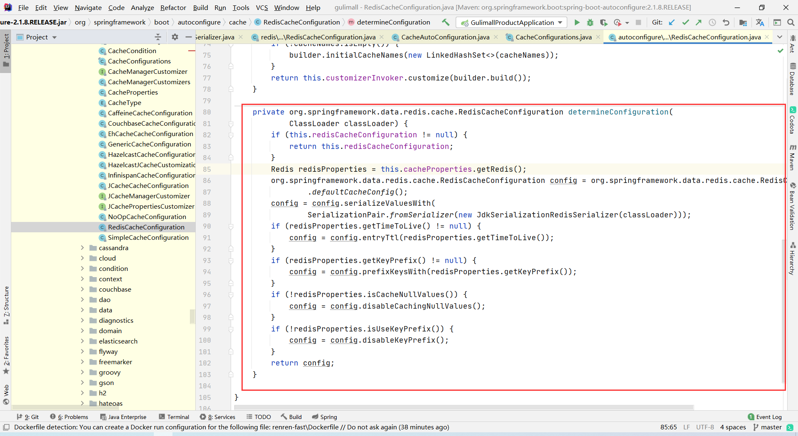

删掉`gulimall-product`模块的`com.atguigu.gulimall.product.GulimallProductApplication`启动类的`@EnableCaching`注解

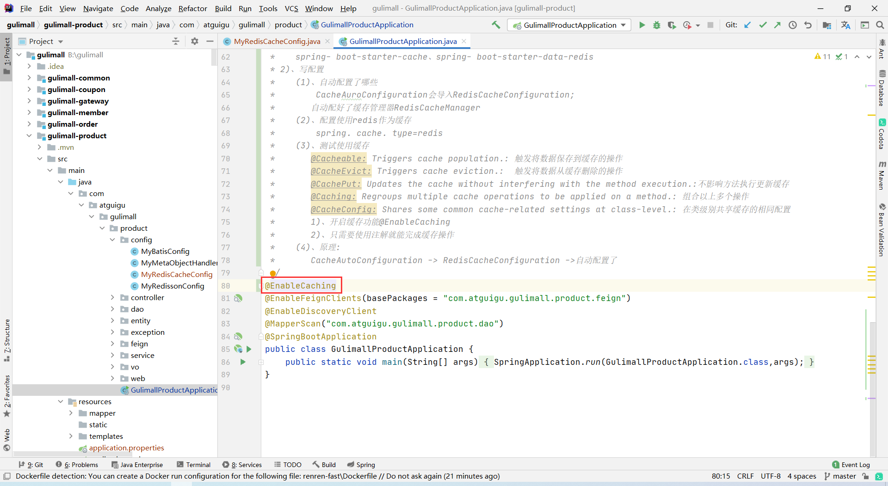

在`gulimall-product`模块的`com.atguigu.gulimall.product.config`包下新建`MyRedisCacheConfig`配置类，在该配置类里编写类型为`org.springframework.data.redis.cache.RedisCacheConfiguration`的`Bean` **(不要导错包了)**

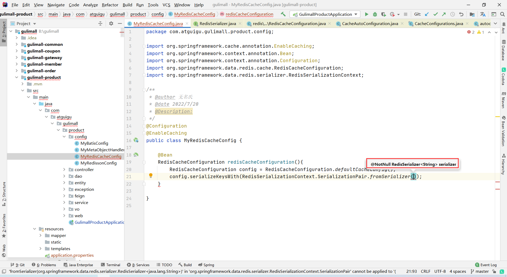

~~进入`org.springframework.data.redis.serializer.RedisSerializer`，然后按`ctrl+H`查看其子类，可以看到有`String`类型和`Json`类型的序列化方式，`spring`框架提供的`org.springframework.data.redis.serializer.StringRedisSerializer` ，阿里提供的`com.alibaba.fastjson.support.spring.FastJsonRedisSerializer`，阿里提供的`com.alibaba.fastjson.support.spring.GenericFastJsonRedisSerializer`~~ 带了`Generic`的可以兼容任意类型，因此需要选择带`Generic`的

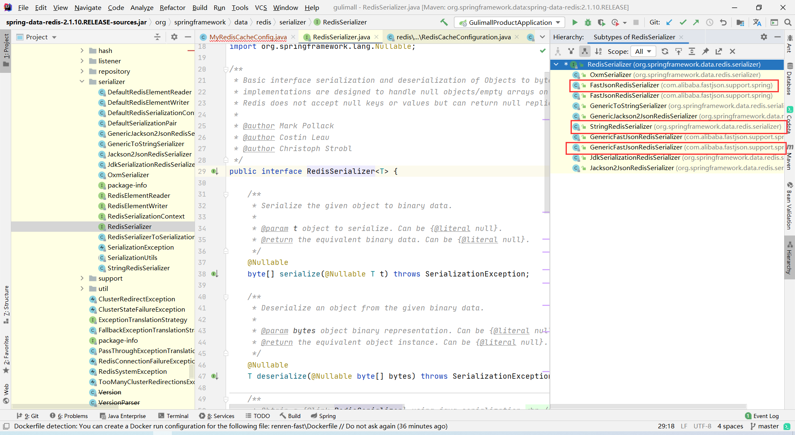

完整代码：

```java
package com.atguigu.gulimall.product.config;

import org.springframework.cache.annotation.EnableCaching;
import org.springframework.context.annotation.Bean;
import org.springframework.context.annotation.Configuration;
import org.springframework.data.redis.cache.RedisCacheConfiguration;
import org.springframework.data.redis.serializer.GenericJackson2JsonRedisSerializer;
import org.springframework.data.redis.serializer.RedisSerializationContext;
import org.springframework.data.redis.serializer.RedisSerializer;
import org.springframework.data.redis.serializer.StringRedisSerializer;

/**
 * @author 无名氏
 * @date 2022/7/20
 * @Description:
 */
@Configuration
@EnableCaching
public class MyRedisCacheConfig {

    @Bean
    RedisCacheConfiguration redisCacheConfiguration(){
        RedisCacheConfiguration config = RedisCacheConfiguration.defaultCacheConfig();
        config.serializeKeysWith(RedisSerializationContext.SerializationPair.fromSerializer(new StringRedisSerializer()));
        config.serializeValuesWith(RedisSerializationContext.SerializationPair.fromSerializer(new GenericJackson2JsonRedisSerializer()))
    }

}
```


##### 4、测试

删掉以前的在`redis`里的`category（1）`数据，刷新 http://localhost:10000/ 页面，在新生成的`category（1）`可以看到，数据并没有变为`JSON`格式

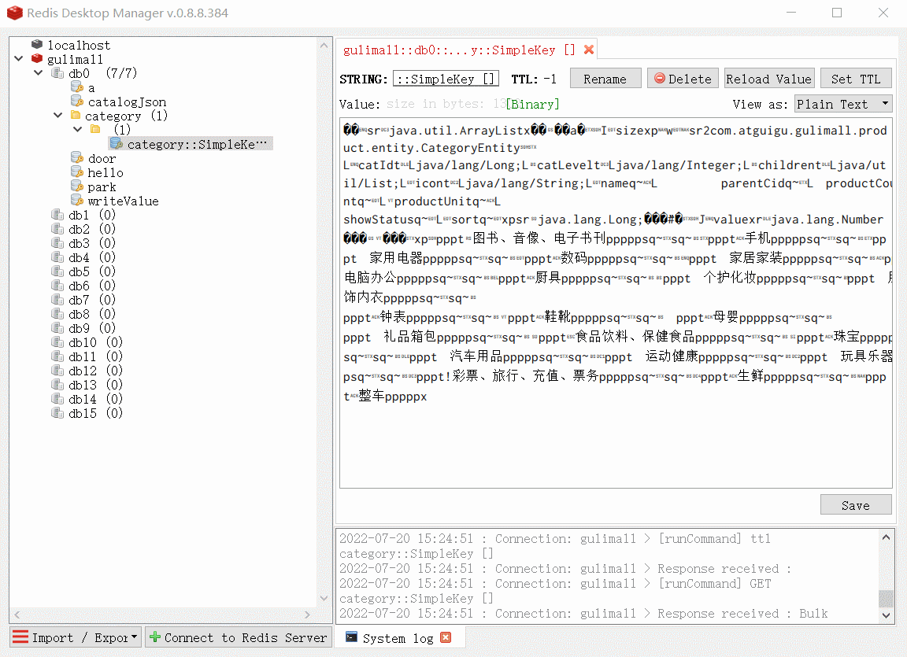

##### 5、修改`redisCacheConfiguration`方法

重新修改`gulimall-product`模块的`com.atguigu.gulimall.product.config.MyRedisCacheConfig`类的`redisCacheConfiguration`方法

每一步设置都会返回一个新的`RedisCacheConfiguration`，因此应该覆盖老的`config`。(参照`org.springframework.boot.autoconfigure.cache.RedisCacheConfiguration`类的`determineConfiguration`方法的做法)

```java
package com.atguigu.gulimall.product.config;

import org.springframework.cache.annotation.EnableCaching;
import org.springframework.context.annotation.Bean;
import org.springframework.context.annotation.Configuration;
import org.springframework.data.redis.cache.RedisCacheConfiguration;
import org.springframework.data.redis.serializer.GenericJackson2JsonRedisSerializer;
import org.springframework.data.redis.serializer.RedisSerializationContext;
import org.springframework.data.redis.serializer.StringRedisSerializer;

/**
 * @author 无名氏
 * @date 2022/7/20
 * @Description:
 */
@Configuration
@EnableCaching
public class MyRedisCacheConfig {

    @Bean
    RedisCacheConfiguration redisCacheConfiguration(){
        RedisCacheConfiguration config = RedisCacheConfiguration.defaultCacheConfig();
        config = config.serializeKeysWith(RedisSerializationContext.SerializationPair.fromSerializer(new StringRedisSerializer()));
        config = config.serializeValuesWith(RedisSerializationContext.SerializationPair.fromSerializer(new GenericJackson2JsonRedisSerializer()));

        return config;
    }

}
```

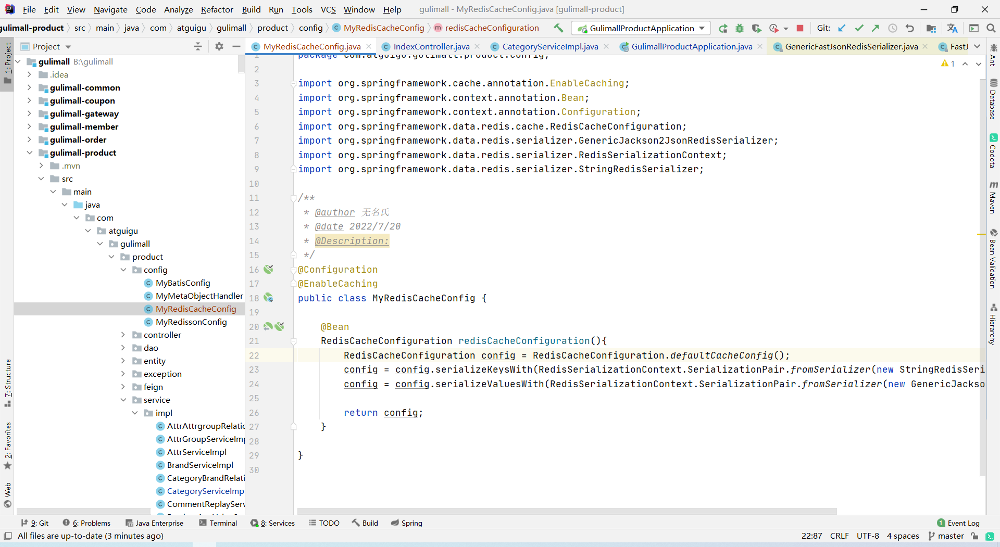

##### 6、再次测试

删掉以前的在`redis`里的`category（1）`数据，刷新 http://localhost:10000/ 页面，在新生成的`category（1）`可以看到，这次成功返回了`JSON`数据，但是`TTL`为`-1`

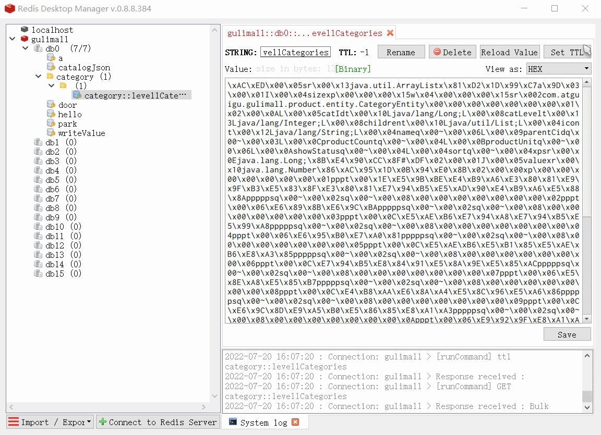

##### :pencil: `JSON`序列化

进入`org.springframework.data.redis.serializer.RedisSerializer`，然后按`ctrl+H`查看其子类，可以看到有`String`类型和`Json`类型的序列化方式，`spring`框架提供的`org.springframework.data.redis.serializer.StringRedisSerializer` ，`spring`框架提供的`org.springframework.data.redis.serializer.GenericJackson2JsonRedisSerializer`，阿里提供的`com.alibaba.fastjson.support.spring.GenericFastJsonRedisSerializer`，带了`Generic`的可以兼容任意类型，因此需要选择带`Generic`的

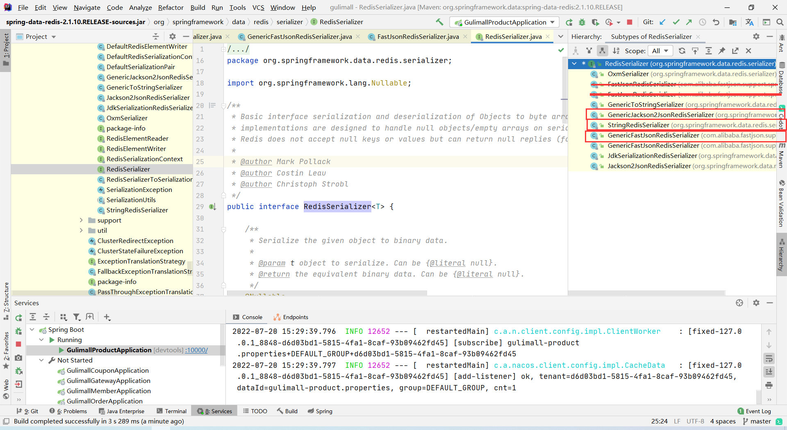

#### 7、读取`yml`数据

##### 1、查看如何把不能修改的类注入容器

之所以`ttl`为`-1`，是因为`org.springframework.boot.autoconfigure.cache.RedisCacheConfiguration`类的`determineConfiguration`方法，首先会判断`org.springframework.data.redis.cache.RedisCacheConfiguration`是否存在，如果存在，则直接返回，根本不会走下面的逻辑，因此可以直接复制后面序列化后的代码

```java
private org.springframework.data.redis.cache.RedisCacheConfiguration determineConfiguration(
      ClassLoader classLoader) {
   if (this.redisCacheConfiguration != null) {
      return this.redisCacheConfiguration;
   }
   Redis redisProperties = this.cacheProperties.getRedis();
   org.springframework.data.redis.cache.RedisCacheConfiguration config = org.springframework.data.redis.cache.RedisCacheConfiguration
         .defaultCacheConfig();
   config = config.serializeValuesWith(
         SerializationPair.fromSerializer(new JdkSerializationRedisSerializer(classLoader)));
   if (redisProperties.getTimeToLive() != null) {
      config = config.entryTtl(redisProperties.getTimeToLive());
   }
   if (redisProperties.getKeyPrefix() != null) {
      config = config.prefixKeysWith(redisProperties.getKeyPrefix());
   }
   if (!redisProperties.isCacheNullValues()) {
      config = config.disableCachingNullValues();
   }
   if (!redisProperties.isUseKeyPrefix()) {
      config = config.disableKeyPrefix();
   }
   return config;
}
```

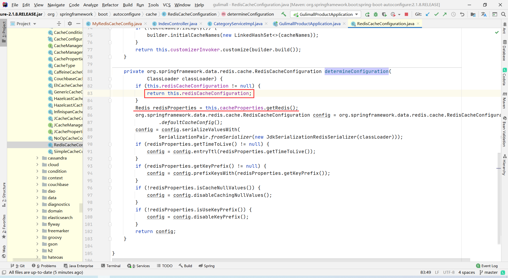

~~由于`org.springframework.boot.autoconfigure.cache.CacheProperties`类没有放入`ioc`容器中，因此我们不能直接获取~~

其实注入进去了，`@ConfigurationProperties(prefix = "spring.redis")`注解指明当前`RedisProperties`类与配置文件的`spring.redis`绑定，但不会把该`RedisProperties`类注入到`ioc`容器，可以在本类(`RedisProperties`类)使用`@Component`注解把该类放入到`ioc`容器中，但是如果在不能修改源码的情况下，还可以使用`@EnableConfigurationProperties(RedisProperties.class)`注解，把`RedisProperties`类放入到`ioc`容器中

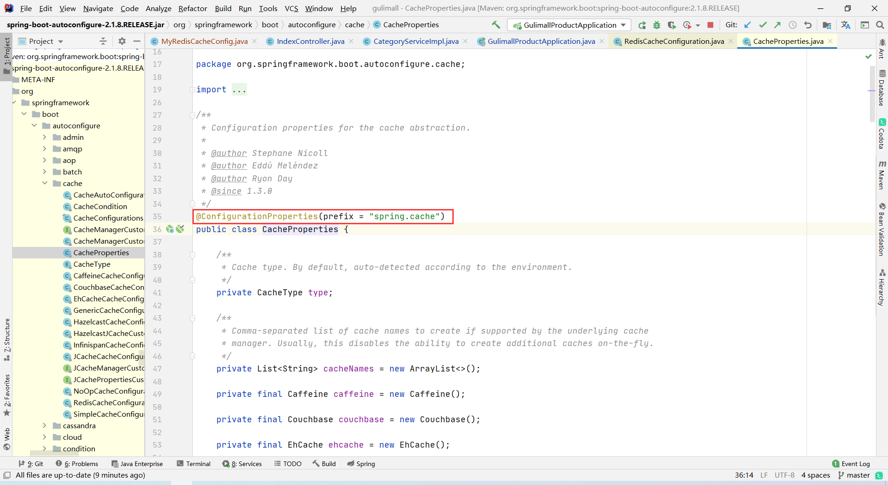

可以看到`org.springframework.boot.autoconfigure.data.redis`包的`RedisAutoConfiguration`类，使用`@EnableConfigurationProperties(RedisProperties.class)`绑定了本包下的`RedisProperties`类，该注解(`@EnableConfigurationProperties(RedisProperties.class)`注解)会把`RedisProperties`类放到`ioc`容器中

(如果只使用`@EnableConfigurationProperties`注解，不指明具体的类，则不会把`RedisProperties`类放到`ioc`容器中)

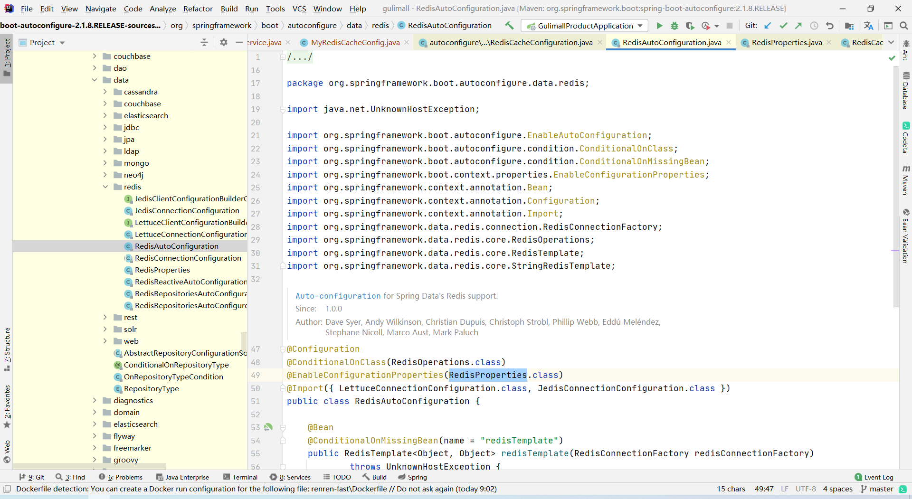

因此,可以参照`org.springframework.boot.autoconfigure.cache.RedisCacheConfiguration`类的写法

```java
@Configuration
@ConditionalOnClass(RedisConnectionFactory.class)
@AutoConfigureAfter(RedisAutoConfiguration.class)
@ConditionalOnBean(RedisConnectionFactory.class)
@ConditionalOnMissingBean(CacheManager.class)
@Conditional(CacheCondition.class)
class RedisCacheConfiguration {

   private final CacheProperties cacheProperties;

   private final CacheManagerCustomizers customizerInvoker;

   private final org.springframework.data.redis.cache.RedisCacheConfiguration redisCacheConfiguration;

   RedisCacheConfiguration(CacheProperties cacheProperties, CacheManagerCustomizers customizerInvoker,
         ObjectProvider<org.springframework.data.redis.cache.RedisCacheConfiguration> redisCacheConfiguration) {
      this.cacheProperties = cacheProperties;
      this.customizerInvoker = customizerInvoker;
      this.redisCacheConfiguration = redisCacheConfiguration.getIfAvailable();
   }
```

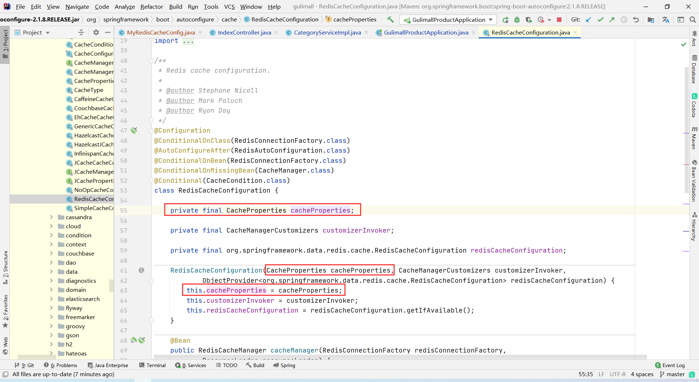

##### 2、修改`MyRedisCacheConfig`类

用传参的方式使用`CacheProperties`（但是这种方式好像需要`CacheProperties`类在容器吧:disappointed_relieved:(亲测必须在容器内)，老师讲的好像有问题，如果`CacheProperties`没在容器，不能通过这种方式，这样能成功的原因是`CacheProperties`类在`ioc`容器里，而老师讲的是不在`ioc`容器中该怎么做)

```java
package com.atguigu.gulimall.product.config;

import org.springframework.boot.autoconfigure.cache.CacheProperties;
import org.springframework.cache.annotation.EnableCaching;
import org.springframework.context.annotation.Bean;
import org.springframework.context.annotation.Configuration;
import org.springframework.data.redis.cache.RedisCacheConfiguration;
import org.springframework.data.redis.serializer.GenericJackson2JsonRedisSerializer;
import org.springframework.data.redis.serializer.RedisSerializationContext;
import org.springframework.data.redis.serializer.StringRedisSerializer;

/**
 * @author 无名氏
 * @date 2022/7/20
 * @Description:
 */
@Configuration
@EnableCaching
public class MyRedisCacheConfig {

    @Bean
    RedisCacheConfiguration redisCacheConfiguration(CacheProperties cacheProperties){
        RedisCacheConfiguration config = RedisCacheConfiguration.defaultCacheConfig();
        config = config.serializeKeysWith(RedisSerializationContext.SerializationPair.fromSerializer(new StringRedisSerializer()));
        config = config.serializeValuesWith(RedisSerializationContext.SerializationPair.fromSerializer(new GenericJackson2JsonRedisSerializer()));

        CacheProperties.Redis redisProperties = cacheProperties.getRedis();
        if (redisProperties.getTimeToLive() != null) {
            config = config.entryTtl(redisProperties.getTimeToLive());
        }
        if (redisProperties.getKeyPrefix() != null) {
            config = config.prefixKeysWith(redisProperties.getKeyPrefix());
        }
        if (!redisProperties.isCacheNullValues()) {
            config = config.disableCachingNullValues();
        }
        if (!redisProperties.isUseKeyPrefix()) {
            config = config.disableKeyPrefix();
        }
        return config;
    }

}
```

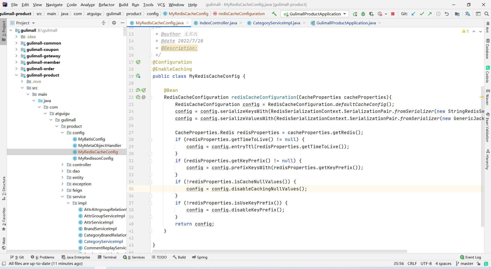

如果`CacheProperties`不在`ioc`容器，这才是正确的做法(当然最好不要直接通过`@Autowired`注入，最好通过传参的方式注入)

或者可以学习`org.springframework.boot.autoconfigure.cache.CacheAutoConfiguration`类的做法在类上加上`@EnableConfigurationProperties(CacheProperties.class)`注解(我试了以下，不加``@EnableConfigurationProperties(CacheProperties.class)`注解`，直接注入也可以用)

```java
package com.atguigu.gulimall.product.config;

import org.springframework.beans.factory.annotation.Autowired;
import org.springframework.boot.autoconfigure.cache.CacheProperties;
import org.springframework.boot.context.properties.EnableConfigurationProperties;
import org.springframework.cache.annotation.EnableCaching;
import org.springframework.context.annotation.Bean;
import org.springframework.context.annotation.Configuration;
import org.springframework.data.redis.cache.RedisCacheConfiguration;
import org.springframework.data.redis.serializer.GenericJackson2JsonRedisSerializer;
import org.springframework.data.redis.serializer.RedisSerializationContext;
import org.springframework.data.redis.serializer.StringRedisSerializer;

/**
 * @author 无名氏
 * @date 2022/7/20
 * @Description:
 */
@EnableConfigurationProperties(CacheProperties.class)
@Configuration
@EnableCaching
public class MyRedisCacheConfig {

    @Autowired
    CacheProperties cacheProperties;

    @Bean
    RedisCacheConfiguration redisCacheConfiguration(){
        RedisCacheConfiguration config = RedisCacheConfiguration.defaultCacheConfig();
        config = config.serializeKeysWith(RedisSerializationContext.SerializationPair.fromSerializer(new StringRedisSerializer()));
        config = config.serializeValuesWith(RedisSerializationContext.SerializationPair.fromSerializer(new GenericJackson2JsonRedisSerializer()));

        CacheProperties.Redis redisProperties = cacheProperties.getRedis();
        if (redisProperties.getTimeToLive() != null) {
            config = config.entryTtl(redisProperties.getTimeToLive());
        }
        if (redisProperties.getKeyPrefix() != null) {
            config = config.prefixKeysWith(redisProperties.getKeyPrefix());
        }
        if (!redisProperties.isCacheNullValues()) {
            config = config.disableCachingNullValues();
        }
        if (!redisProperties.isUseKeyPrefix()) {
            config = config.disableKeyPrefix();
        }
        return config;
    }

}
```

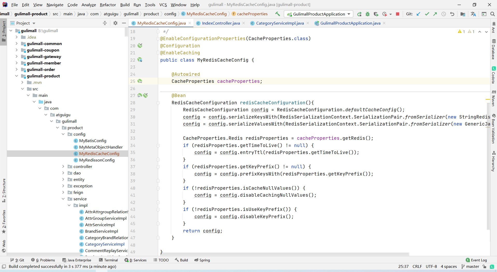

##### 3、测试

删掉以前的在`redis`里的`category（1）`数据，刷新 http://localhost:10000/ 页面，在新生成的`category（1）`可以看到，这次成功返回了`JSON`数据，`ttl`也是指定的过期时间了

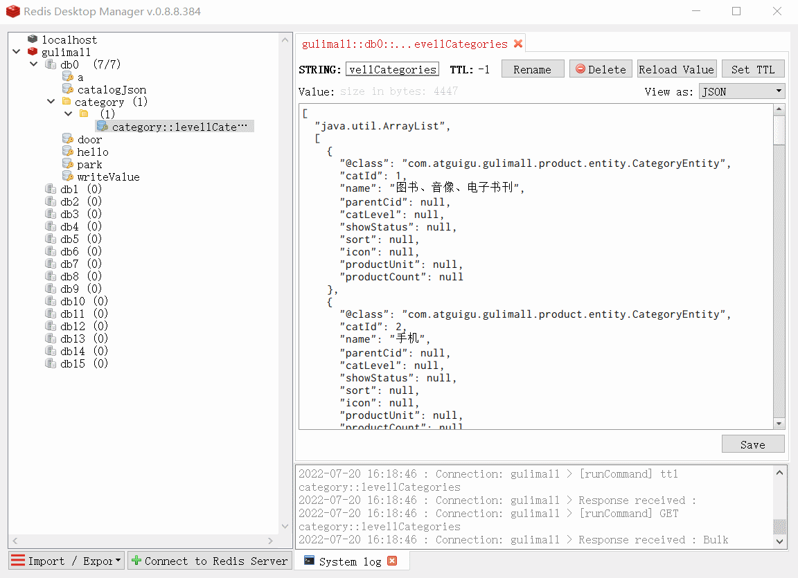

数据的格式：


##### `EnableConfigurationProperties`参考文档

`EnableConfigurationProperties`注解参考文档： https://docs.spring.io/spring-boot/docs/current/api/org/springframework/boot/context/properties/EnableConfigurationProperties.html

> **Annotation Type EnableConfigurationProperties**
>
> ------
>
> ```java
> @Target(value=TYPE)
> @Retention(value=RUNTIME)
> @Documented
> @Import(value=org.springframework.boot.context.properties.EnableConfigurationPropertiesRegistrar.class)
> public @interface EnableConfigurationProperties
> ```
>
> Enable support for [`@ConfigurationProperties`](https://docs.spring.io/spring-boot/docs/current/api/org/springframework/boot/context/properties/ConfigurationProperties.html) annotated beans. `@ConfigurationProperties` beans can be registered in the standard way (for example using [`@Bean`](https://docs.spring.io/spring-framework/docs/5.3.22/javadoc-api/org/springframework/context/annotation/Bean.html?is-external=true) methods) or, for convenience, can be specified directly on this annotation.

详细使用说明： https://docs.spring.io/spring-boot/docs/2.1.3.RELEASE/reference/html/boot-features-external-config.html#boot-features-external-config-typesafe-configuration-properties

```java
package com.example;

import java.net.InetAddress;
import java.util.ArrayList;
import java.util.Collections;
import java.util.List;

import org.springframework.boot.context.properties.ConfigurationProperties;

@ConfigurationProperties("acme")
public class AcmeProperties {

  private boolean enabled;

  private InetAddress remoteAddress;

  private final Security security = new Security();

  public boolean isEnabled() { ... }

  public void setEnabled(boolean enabled) { ... }

  public InetAddress getRemoteAddress() { ... }

  public void setRemoteAddress(InetAddress remoteAddress) { ... }

  public Security getSecurity() { ... }

  public static class Security {

    private String username;

    private String password;

    private List<String> roles = new ArrayList<>(Collections.singleton("USER"));

    public String getUsername() { ... }

    public void setUsername(String username) { ... }

    public String getPassword() { ... }

    public void setPassword(String password) { ... }

    public List<String> getRoles() { ... }

    public void setRoles(List<String> roles) { ... }

  }
}
```

The preceding POJO defines the following properties:

- `acme.enabled`, with a value of `false` by default.
- `acme.remote-address`, with a type that can be coerced from `String`.
- `acme.security.username`, with a nested "security" object whose name is determined by the name of the property. In particular, the return type is not used at all there and could have been `SecurityProperties`.
- `acme.security.password`.
- `acme.security.roles`, with a collection of `String`.

You also need to list the properties classes to register in the `@EnableConfigurationProperties` annotation, as shown in the following example:

```java
@Configuration
@EnableConfigurationProperties(AcmeProperties.class)
public class MyConfiguration {
}
```

------

Even if the preceding configuration creates a regular bean for `AcmeProperties`, we recommend that `@ConfigurationProperties` only deal with the environment and, in particular, does not inject other beans from the context. Having said that, the `@EnableConfigurationProperties` annotation is *also* automatically applied to your project so that any *existing* bean annotated with `@ConfigurationProperties` is configured from the `Environment`. You could shortcut `MyConfiguration` by making sure `AcmeProperties` is already a bean, as shown in the following example:

```java
@Component
@ConfigurationProperties(prefix="acme")
public class AcmeProperties {

  // ... see the preceding example

}
```

This style of configuration works particularly well with the `SpringApplication` external YAML configuration, as shown in the following example:

```yaml
# application.yml

acme:
  remote-address: 192.168.1.1
  security:
    username: admin
    roles:
      - USER
      - ADMIN

# additional configuration as required
```

To work with `@ConfigurationProperties` beans, you can inject them in the same way as any other bean, as shown in the following example:

```java
@Service
public class MyService {

  private final AcmeProperties properties;

  @Autowired
  public MyService(AcmeProperties properties) {
      this.properties = properties;
  }

  //...

  @PostConstruct
  public void openConnection() {
    Server server = new Server(this.properties.getRemoteAddress());
    // ...
  }

}
```

#### 8、可选配置

##### 1、`cache-null-value`是否缓存空值

在`gulimall-product`模块的`src/main/resources/application.properties`配置文件中，配置`spring.cache.redis.cache-null-values=true`，设置缓存空值

```properties
#缓存的类型
spring.cache.type=redis

#缓存的名字
#如果配置了缓存的名字，则只能使用这些名字
#系统中用到哪些缓存了，帮你创建出来
#spring.cache.cache-names=qq,qqq
spring.cache.redis.time-to-live=3600000
#如果指定了前缀就用我们指定的前缀，如果没有就默认使用缓存的名字作为前缀
spring.cache.redis.key-prefix=CACHE_
#是否开启前缀
spring.cache.redis.use-key-prefix=true
#是否缓存空值，防止缓存穿透
spring.cache.redis.cache-null-values=true
```


将`gulimall-product`模块的`com.atguigu.gulimall.product.service.impl.CategoryServiceImpl`类的`getLevel1Categories`方法的返回值设置为`null`


删掉以前的在`redis`里的`category（1）`数据，刷新 http://localhost:10000/ 页面，在新生成的`category（1）`可以看到，空值也缓存了


##### 2、`use-key-prefix`是否开启前缀

在`gulimall-product`模块的`src/main/resources/application.properties`配置文件中，配置`spring.cache.redis.use-key-prefix=false`，设置不使用前缀

```properties
#缓存的类型
spring.cache.type=redis

#缓存的名字
#如果配置了缓存的名字，则只能使用这些名字
#系统中用到哪些缓存了，帮你创建出来
#spring.cache.cache-names=qq,qqq
spring.cache.redis.time-to-live=3600000
#如果指定了前缀就用我们指定的前缀，如果没有就默认使用缓存的名字作为前缀
spring.cache.redis.key-prefix=CACHE_
#是否开启前缀
spring.cache.redis.use-key-prefix=false
#是否缓存空值，防止缓存穿透
spring.cache.redis.cache-null-values=true
```


删掉以前的在`redis`里的`category（1）`数据，刷新 http://localhost:10000/ 页面，在新生成的`category（1）`可以看到，直接把注解里设置的`key`作为`redis`里面的`key`而不加`自定义前缀`或`默认前缀`了


##### 3、测试完后，修改为最初配置

在`gulimall-product`模块的`src/main/resources/application.properties`配置文件中，修改为最初配置

```properties
#缓存的类型
spring.cache.type=redis

#缓存的名字
#如果配置了缓存的名字，则只能使用这些名字
#系统中用到哪些缓存了，帮你创建出来
#spring.cache.cache-names=qq,qqq
#以`ms`(毫秒)为单位
spring.cache.redis.time-to-live=3600000
#如果指定了前缀就用我们指定的前缀，如果没有就默认使用缓存的名字作为前缀
#spring.cache.redis.key-prefix=CACHE_
#是否开启前缀
spring.cache.redis.use-key-prefix=true
#是否缓存空值，防止缓存穿透
spring.cache.redis.cache-null-values=true
```


将`gulimall-product`模块的`com.atguigu.gulimall.product.service.impl.CategoryServiceImpl`类的`getLevel1Categories`方法的返回值设置为`categoryEntities`


#### 9、常用注解(2)

##### 1、`@CacheEvict`

在`gulimall-product`模块的`com.atguigu.gulimall.product.service.impl.CategoryServiceImpl`类里的`updateCascade`方法上添加`@CacheEvict(value = {"category"}, key = "'level1Categories'")`注解，表示使用`失效模式`（即删除指定的数据）


使用`npm run dev`启动前端项目，账号密码都是`admin`。

启动后台的`GulimallGatewayApplication`服务、`GulimallProductApplication`服务、`RenrenApplication`服务

删除`redis`里`key`为`level1Categories`的数据，刷新`http://localhost:10000/`页面，可以看到在`redis`里已经有`key`为`CACHE_level1Categories`的数据了

访问`http://localhost:8001/`网址，打开后台页面，在`商品系统/分类维护`，修改`手机`的`图标`信息，可以看到在`redis`里`key`为`CACHE_level1Categories`的数据已经被删除了


##### 2、重写`getCatalogJson`方法

将`gulimall-product`模块的`com.atguigu.gulimall.product.service.impl.CategoryServiceImpl`类的`getCatalogJson`方法重命名为`getCatalogJson2`，然后重新写一个`getCatalogJson`方法，添加`@Cacheable(value = "category",key = "#root.methodName")`注解，指定`key`为方法名

```java
@Cacheable(value = "category",key = "#root.methodName")
@Override
public Map<String, List<Catelog2Vo>> getCatalogJson() {
    System.out.println("查询了数据库......");
    //一次查询所有
    List<CategoryEntity> categoryEntities = this.baseMapper.selectList(null);
    //1、查出所有一级分类
    List<CategoryEntity> level1Categories = this.getLevel1Categories();
    Map<String, List<Catelog2Vo>> result = level1Categories.stream().collect(Collectors.toMap(k -> k.getCatId().toString(), l1 -> {
        //2、该一级分类的所有二级分类
        List<CategoryEntity> category2Entities = getCategoryEntities(categoryEntities, l1);
        List<Catelog2Vo> catelog2VoList = null;
        if (category2Entities != null) {
            catelog2VoList = category2Entities.stream().map(l2 -> {
                Catelog2Vo catelog2Vo = new Catelog2Vo();
                catelog2Vo.setCatalog1Id(l1.getCatId().toString());
                catelog2Vo.setId(l2.getCatId().toString());
                catelog2Vo.setName(l2.getName());
                //3、当前二级分类的所有三级分类
                List<CategoryEntity> category3Entities = getCategoryEntities(categoryEntities, l2);
                List<Catelog2Vo.Catelog3Vo> catelog3VoList = null;
                if (category3Entities != null) {
                    catelog3VoList = category3Entities.stream().map(l3 -> {
                        Catelog2Vo.Catelog3Vo catelog3Vo = new Catelog2Vo.Catelog3Vo();
                        catelog3Vo.setId(l3.getCatId().toString());
                        catelog3Vo.setName(l3.getName());
                        catelog3Vo.setCatalog2Id(l2.getCatId().toString());
                        return catelog3Vo;
                    }).collect(Collectors.toList());
                }
                catelog2Vo.setCatalog3List(catelog3VoList);
                return catelog2Vo;
            }).collect(Collectors.toList());
        }
        return catelog2VoList;
    }));
    return result;
}
```


删除`redis`里`key`为`CACHE_level1Categories`的数据，由于商城首页会调用`getCatalogJson`方法，因此可以刷新`http://gulimall.com/`页面，可以看到在`redis`里已经有`key`为`CACHE_getCatalogJson`的数据了


##### 3、批量删除数据

**方法一：**

在`gulimall-product`模块的`com.atguigu.gulimall.product.service.impl.CategoryServiceImpl`类的`updateCascade`上添加如下注解，执行两个删除语句

```java
/**
 * 级联更新所有的数据
 *@CacheEvict: 失效模式
 * @param category
 */
@Caching(evict = {
        @CacheEvict(value = {"category"}, key = "'level1Categories'"),
        @CacheEvict(value = {"category"}, key = "'getCatalogJson'")
}
)
@Transactional
@Override
public void updateCascade(CategoryEntity category) {
    this.updateById(category);
    categoryBrandRelationService.updateCategory(category);
}
```


删除`redis`里`key`为`CACHE_level1Categories`和`catalogJson`的数据，由于商城首页会调用`getCatalogJson`和`getLevel1Categories`方法，因此可以刷新`http://gulimall.com/`页面，可以看到在`redis`里已经有`key`为`CACHE_getCatalogJson`和`CACHE_level1Categories`的数据了，，在`商品系统/分类维护`，修改`手机`的`图标`信息，可以看到在`redis`里`key`为`CACHE_getCatalogJson`和`CACHE_level1Categories`的数据已经被删除了


**方法二：**

`@CacheEvict`注解的`allEntries = true`属性可以把该分区的所有数据都删除，这样也可以达到批量删除数据的目的

```java
/**
 * 级联更新所有的数据
 *@CacheEvict: 失效模式
 * @Caching: 批量操作
 * @CacheEvict(value = {"category"},allEntries = true) 删除该分区的所有数据
 * @param category
 */
//@Caching(evict = {
//        @CacheEvict(value = {"category"}, key = "'level1Categories'"),
//        @CacheEvict(value = {"category"}, key = "'getCatalogJson'")
//})
@CacheEvict(value = {"category"},allEntries = true)
@Transactional
@Override
public void updateCascade(CategoryEntity category) {
    this.updateById(category);
    categoryBrandRelationService.updateCategory(category);
}
```


##### 4、不指定`key-prefix`

把`spring.cache.redis.key-prefix=CACHE_`注释掉

```properties
#缓存的类型
spring.cache.type=redis

#缓存的名字
#如果配置了缓存的名字，则只能使用这些名字
#系统中用到哪些缓存了，帮你创建出来
#spring.cache.cache-names=qq,qqq
spring.cache.redis.time-to-live=3600000
#如果指定了前缀就用我们指定的前缀，如果没有就默认使用缓存的名字作为前缀
#spring.cache.redis.key-prefix=CACHE_
#是否开启前缀
spring.cache.redis.use-key-prefix=true
#是否缓存空值，防止缓存穿透
spring.cache.redis.cache-null-values=true
```


重新刷新`http://gulimall.com/`页面，可以看到不指定前缀后，会生成名为`分区名`的文件夹，在该文件夹内存放该分区的数据，这样显得更有层级关系


##### 5、双写模式

如果想使用双写模式，可以使用`@CachePut`注解，由于该方法没有返回值，所以用不了双写模式，这里就不演示了，大概结构如下

`@CachePut(value = {"category"}, key = "'level1Categories'")`

```java
@CachePut(value = {"category"}, key = "'level1Categories'")
@Transactional
@Override
public Object updateCascade(CategoryEntity category) {
    this.updateById(category);
    return categoryBrandRelationService.updateCategory(category);
}
```


#### 10  172

4、Spring-Cache的不 足;
1)、读模式:
缓存穿透:查询一个null数据。解决:缓存空数据; `spring.cache.redis.cache-null-values=true`
缓存击穿:大量并发进来同时查询一一个正好过期的数据。解决:加锁; ? `@Cacheable(value = {"category"}, key = "'level1Categories'",sync = true)` 只有`@Cacheable`注解可以加锁
缓存雪崩:大量的key同时过期。解决:加随机时间。（加随机时间有可能弄巧成拙，本来是2s、1s时间过期，加随机时间变为`2s+2s=4s`、`1s+3s=4s`时间过期） `spring.cache.redis.time-to-live=3600000`

2)、写模式: (缓存与数据库一 致)
1)、读写加锁。
2)、引入Canal,感知到MySQL的更新去更新数据库
3)、读多写多，直接去数据库查询就行

总结:
常规数据(读多写少，即时性，- 致性要求不高的数据) ;完全可以使用Spring-Cache(只要缓存的数据有过期时间就足够了):
特殊数据:特殊设计

## 5.5、商城业务-检索服务

### 5.5.1、初始化

#### 1、添加配置

##### 1、引入依赖

在`gulimall-search`模块的`pom.xml`文件里引入`thymeleaf`依赖和`devtools`依赖

```xml
<!--引入thymeleaf-->
<dependency>
   <groupId>org.springframework.boot</groupId>
   <artifactId>spring-boot-starter-thymeleaf</artifactId>
</dependency>
<!--引入devtools-->
<dependency>
   <groupId>org.springframework.boot</groupId>
   <artifactId>spring-boot-devtools</artifactId>
   <optional>true</optional>
</dependency>
```


##### 2、关闭缓存

在`gulimall-search`模块的`src/main/resources/application.properties`配置文件里配置关闭缓存


##### 3、导入`index.html`

在资料里的`2.分布式高级篇（微服务架构篇\资料源码\代码\html\搜索页`文件夹下，复制`index.html`文件，粘贴到`gulimall-search`模块的`src/main/resources/templates`目录下


##### 4、导入静态资源到`nginx`

在资料里的`D:\尚硅谷\谷粒商城\2.分布式高级篇（微服务架构篇）\资料源码\代码\html\搜索页`文件夹下，复制所有文件夹(除`index.html`)，在虚拟机的`/mydata/nginx/html/static/`目录下，新建`search`文件夹。 粘贴到虚拟机里的 `/mydata/nginx/html/static/search`目录下


##### 5、修改`index.html`

修改`gulimall-search`模块的`src/main/resources/templates/index.html`文件，使所有静态文件都访问`nigix`

```html
<!doctype html>
<html lang="en" xmlns:th="http://www.thymeleaf.org">
<head>
    <meta charset="UTF-8">
    <meta name="viewport"
          content="width=device-width, user-scalable=no, initial-scale=1.0, maximum-scale=1.0, minimum-scale=1.0">
    <meta http-equiv="X-UA-Compatible" content="ie=edge">
    <link rel="stylesheet" href="/static/search/css/index.css">
    <link rel="stylesheet" type="text/css" href="/static/search/font/iconfont.css">
    <!--<script src="/static/search/./js/jquery-3.2.1.min.js"></script>-->
    <script src="/static/search/js/jquery-1.12.4.js"></script>
    <title>Document</title>
</head>
<body>
<!--头部-->
<div class="header_head">
    <div class="header_head_box">
        <b class="header_head_p">
            <div style="overflow: hidden">
                <a href="#" class="header_head_p_a1" style="width:73px;">
                    谷粒商城首页
                </a>
                <a href="#" class="header_head_p_a">
                    <!---->
                    北京</a>
            </div>
            <div class="header_head_p_cs">
                <a href="#" style="background: #C81623;color: #fff;">北京</a>
                <a href="#">上海</a>
                <a href="#">天津</a>
                <a href="#">重庆</a>
                <a href="#">河北</a>
                <a href="#">山西</a>
                <a href="#">河南</a>
                <a href="#">辽宁</a>
                <a href="#">吉林</a>
                <a href="#">黑龙江</a>
                <a href="#">内蒙古</a>
                <a href="#">江苏</a>
                <a href="#">山东</a>
                <a href="#">安徽</a>
                <a href="#">浙江</a>
                <a href="#">福建</a>
                <a href="#">湖北</a>
                <a href="#">湖南</a>
                <a href="#">广东</a>
                <a href="#">广西</a>
                <a href="#">江西</a>
                <a href="#">四川</a>
                <a href="#">海南</a>
                <a href="#">贵州</a>
                <a href="#">云南</a>
                <a href="#">西藏</a>
                <a href="#">陕西</a>
                <a href="#">甘肃</a>
                <a href="#">青海</a>
                <a href="#">宁夏</a>
                <a href="#">新疆</a>
                <a href="#">港澳</a>
                <a href="#">台湾</a>
                <a href="#">钓鱼岛</a>
                <a href="#">海外</a>
            </div>
        </b>
        <ul>
            <li>
                <a href="#" class="li_2">你好，请登录</a>
            </li>
            <li>
                <a href="#">免费注册</a>
            </li>
            <span>|</span>
            <li>
                <a href="#">我的订单</a>
            </li>
            <span>|</span>
            <li class="header_wdjd" style="width:80px;">
                <a href="#">我的谷粒商城</a>
                
                <!--<b class="glyphicon glyphicon-menu-down"></b>-->
                <div class="header_wdjd_txt">
                    <ul>
                        <li>
                            <a href="#">待处理订单</a>
                        </li>
                        <li>
                            <a href="#">消息</a>
                        </li>
                        <li>
                            <a href="#">返修退换货</a>
                        </li>
                        <li>
                            <a href="#">我的回答</a>
                        </li>
                        <li>
                            <a href="#">降价商品</a>
                        </li>
                        <li>
                            <a href="#">我的关注</a>
                        </li>
                    </ul>
                    <ul>
                        <li>
                            <a href="#">我的京豆</a>
                        </li>
                        <li>
                            <a href="#">我的优惠券</a>
                        </li>
                        <li>
                            <a href="#">我的白条</a>
                        </li>
                        <li>
                            <a href="#">我的理财</a>
                        </li>
                    </ul>
                </div>
            </li>
            <span>|</span>
            <li>
                <a href="#">谷粒商城会员</a>
            </li>
            <span>|</span>
            <li>
                <a href="#">企业采购</a>
            </li>
            <span>|</span>
            <li class="header_wdjd1">
                <a href="#">客户服务</a>
                
                <!--<b class="glyphicon glyphicon-menu-down"></b>-->
                <div class="header_wdjd_txt">
                    <ul>
                        <p style="width:100%;">客户</p>
                        <li>
                            <a href="#">帮助中心</a>
                        </li>
                        <li>
                            <a href="#">售后服务</a>
                        </li>
                        <li>
                            <a href="#">在线客服</a>
                        </li>
                        <li>
                            <a href="#">意见建议</a>
                        </li>
                        <li>
                            <a href="#">电话客服</a>
                        </li>
                        <li>
                            <a href="#">客服邮箱</a>
                        </li>
                        <li>
                            <a href="#">金融资讯</a>
                        </li>
                        <li>
                            <a href="#">售全球客服</a>
                        </li>
                    </ul>
                    <ul>
                        <p style="width:100%;">商户</p>
                        <li>
                            <a href="#">合作招商</a>
                        </li>
                        <li>
                            <a href="#">学习中心</a>
                        </li>
                        <li>
                            <a href="#">商家后台</a>
                        </li>
                        <li>
                            <a href="#">京麦工作台</a>
                        </li>
                        <li>
                            <a href="#">商家帮助</a>
                        </li>
                        <li>
                            <a href="#">规则平台</a>
                        </li>
                    </ul>
                </div>
            </li>
            <span>|</span>
            <li class="header_wzdh">
                <a href="#">网站导航</a>
                
                <!--<b class="glyphicon glyphicon-menu-down"></b>-->
                <div class="header_wzdh_txt">
                    <ul style="width: 25%;">
                        <p style="width:100%;">特色主题</p>
                        <li>
                            <a href="#">谷粒商城试用</a>
                        </li>
                        <li>
                            <a href="#">谷粒商城金融</a>
                        </li>
                        <li>
                            <a href="#">全球售</a>
                        </li>
                        <li>
                            <a href="#">国际站</a>
                        </li>
                        <li>
                            <a href="#">谷粒商城会员</a>
                        </li>
                        <li>
                            <a href="#">谷粒商城预售</a>
                        </li>
                        <li>
                            <a href="#">买什么</a>
                        </li>
                        <li>
                            <a href="#">俄语站</a>
                        </li>
                        <li>
                            <a href="#">装机大师</a>
                        </li>
                        <li>
                            <a href="#">0元评测</a>
                        </li>
                        <li>
                            <a href="#">定期送</a>
                        </li>
                        <li>
                            <a href="#">港澳售</a>
                        </li>
                        <li>
                            <a href="#">优惠券</a>
                        </li>
                        <li>
                            <a href="#">秒杀</a>
                        </li>
                        <li>
                            <a href="#">闪购</a>
                        </li>
                        <li>
                            <a href="#">印尼站</a>
                        </li>
                        <li>
                            <a href="#">谷粒商城金融科技</a>
                        </li>
                        <li>
                            <a href="#">In货推荐</a>
                        </li>
                        <li>
                            <a href="#">陪伴计划</a>
                        </li>
                        <li>
                            <a href="#">出海招商</a>
                        </li>
                    </ul>
                    <ul style="width: 20%;">
                        <p style="width:100%;">行业频道</p>
                        <li>
                            <a href="#">手机</a>
                        </li>
                        <li>
                            <a href="#">智能数码</a>
                        </li>
                        <li>
                            <a href="#">玩3c</a>
                        </li>
                        <li>
                            <a href="#">电脑办公</a>
                        </li>
                        <li>
                            <a href="#">家用电器</a>
                        </li>
                        <li>
                            <a href="#">谷粒商城智能</a>
                        </li>
                        <li>
                            <a href="#">服装城</a>
                        </li>
                        <li>
                            <a href="#">美妆馆</a>
                        </li>
                        <li>
                            <a href="#">家装城</a>
                        </li>
                        <li>
                            <a href="#">母婴</a>
                        </li>
                        <li>
                            <a href="#">食品</a>
                        </li>
                        <li>
                            <a href="#">运动户外</a>
                        </li>
                        <li>
                            <a href="#">农资频道</a>
                        </li>
                        <li>
                            <a href="#">整车</a>
                        </li>
                        <li>
                            <a href="#">图书</a>
                        </li>
                    </ul>
                    <ul style="width: 21%;">
                        <p style="width:100%;">生活服务</p>
                        <li>
                            <a href="#">白条</a>
                        </li>
                        <li>
                            <a href="#">谷粒商城金融App</a>
                        </li>
                        <li>
                            <a href="#">谷粒商城小金库</a>
                        </li>
                        <li>
                            <a href="#">理财</a>
                        </li>
                        <li>
                            <a href="#">智能家电</a>
                        </li>
                        <li>
                            <a href="#">话费</a>
                        </li>
                        <li>
                            <a href="#">水电煤</a>
                        </li>
                        <li>
                            <a href="#">彩票</a>
                        </li>
                        <li>
                            <a href="#">旅行</a>
                        </li>
                        <li>
                            <a href="#">机票酒店</a>
                        </li>
                        <li>
                            <a href="#">电影票</a>
                        </li>
                        <li>
                            <a href="#">谷粒商城到家</a>
                        </li>
                        <li>
                            <a href="#">谷粒商城众测</a>
                        </li>
                        <li>
                            <a href="#">游戏</a>
                        </li>
                    </ul>
                    <ul style="width: 23%; border-right: 0;">
                        <p style="width:100%;">更多精选</p>
                        <li>
                            <a href="#">合作招商</a>
                        </li>
                        <li>
                            <a href="#">谷粒商城通信</a>
                        </li>
                        <li>
                            <a href="#">谷粒商城E卡</a>
                        </li>
                        <li>
                            <a href="#">企业采购</a>
                        </li>
                        <li>
                            <a href="#">服务市场</a>
                        </li>
                        <li>
                            <a href="#">办公生活馆</a>
                        </li>
                        <li>
                            <a href="#">乡村招募</a>
                        </li>
                        <li>
                            <a href="#">校园加盟</a>
                        </li>
                        <li>
                            <a href="#">京友帮</a>
                        </li>
                        <li>
                            <a href="#">谷粒商城社区</a>
                        </li>
                        <li>
                            <a href="#">智能社区</a>
                        </li>
                        <li>
                            <a href="#">游戏社区</a>
                        </li>
                        <li>
                            <a href="#">知识产权维权</a>
                        </li>
                    </ul>
                </div>
            </li>
            <span>|</span>
            <li class="header_sjjd">
                <a href="#">手机谷粒商城</a>
                <div class="header_sjjd_div">
                    
                </div>
            </li>
        </ul>
    </div>
</div>

<!--搜索导航-->
<div class="header_sous">
    <div class="logo">
        <a href="#"></a>
    </div>
    <div class="header_form">
        <input type="text" placeholder="手机" />
        <a href="#">搜索</a>
    </div>
    <div class="header_ico">
        <div class="header_gw">
            <span><a href="#">我的购物车</a></span>
            
            <span>0</span>
        </div>
        <div class="header_ko">
            <p>购物车中还没有商品，赶紧选购吧！</p>
        </div>
    </div>
    <div class="header_form_nav">
        <ul>
            <li>
                <a href="#">谷粒商城之家</a>
            </li>
            <li>
                <a href="#">谷粒商城专卖店</a>
            </li>
            <li>
                <a href="#">平板</a>
            </li>
            <li>
                <a href="#">电脑</a>
            </li>
            <li>
                <a href="#">ipad</a>
            </li>
        </ul>
    </div>
    <nav>
        <ul>
            <li class="nav_li1">
                <a href="#">全部商品分类</a>
            </li>
            <li class="nav_li">
                <a href="#">服装城</a>
            </li>
            <li class="nav_li">
                <a href="#">没装馆</a>
            </li>
            <li class="nav_li">
                <a href="#">超市</a>
            </li>
            <li class="nav_li">
                <a href="#">生鲜</a>
            </li>
        </ul>
        <div class="spacer">|</div>
        <ul>
            <li class="nav_li">
                <a href="#">全球购</a>
            </li>
            <li class="nav_li">
                <a href="#">闪购</a>
            </li>
            <li class="nav_li">
                <a href="#">拍卖</a>
            </li>
        </ul>
        <div class="spacer">|</div>
        <ul>
            <li class="nav_li">
                <a href="#">金融</a>
            </li>
        </ul>

    </nav>
    <div class="header_main_left">
        <ul>
            <li>
                <a href="#" class="header_main_left_a"><b>家用电器</b></a>
            </li>
            <li class="header_li2">
                <a href="#" class="header_main_left_a"><b>手机</b> / <b>运营商</b> / <b>数码</b></a>
                <div class="header_main_left_main">
                    <div class="header_sj">
                        <a href="#" class="header_sj_a">玩3c</a>
                        <a href="#" class="header_sj_a">手机频道</a>
                        <a href="#" class="header_sj_a">网上营业厅</a>
                        <a href="#" class="header_sj_a">配件选购中心</a>
                        <a href="#" class="header_sj_a">企业购</a>
                        <a href="#" class="header_sj_a">以旧换新</a>
                    </div>
                    <ol class="header_ol">
                        <a href="#" style="color: #111;" class="aaa">手机通讯 ></a>
                        <li>
                            <a href="#" style="color: #999;">手机</a>
                            <a href="#" style="color: #999;">对讲机</a>
                            <a href="#" style="color: #999;">手机维修</a>
                            <a href="#" style="color: #999;">以旧换新</a>
                        </li>
                        <a href="#" style="color: #111;" class="aaa">运营商 ></a>
                        <li>
                            <a href="#" style="color: #999;">合约机</a>
                            <a href="#" style="color: #999;">固话宽带</a>
                            <a href="#" style="color: #999;">办套餐</a>
                            <a href="#" style="color: #999;">从话费/流量</a>
                            <a href="#" style="color: #999;">中国电信</a>
                            <a href="#" style="color: #999;">中国移动</a>
                            <a href="#" style="color: #999;">中国联通</a>
                            <a href="#" style="color: #999;">谷粒商城通信</a>
                            <a href="#" style="color: #999;">170选号</a>
                        </li>
                        <a href="#" style="color: #111;" class="aaa">手机配件 ></a>
                        <li style="height: 60px;">

                            <a href="#" style="color: #999;">手机壳</a>
                            <a href="#" style="color: #999;">贴膜</a>
                            <a href="#" style="color: #999;">手机储存卡</a>
                            <a href="#" style="color: #999;">数据线</a>
                            <a href="#" style="color: #999;">存电器</a>
                            <a href="#" style="color: #999;">手机耳机</a>
                            <a href="#" style="color: #999;">创业配件</a>
                            <a href="#" style="color: #999;">手机饰品</a>
                            <a href="#" style="color: #999;">手机电池</a>
                            <a href="#" style="color: #999;">苹果周边</a>
                            <a href="#" style="color: #999;">移动电源</a>
                            <a href="#" style="color: #999;">蓝牙耳机</a>
                            <a href="#" style="color: #999;">手机支架</a>
                            <a href="#" style="color: #999;">车载配件</a>
                            <a href="#" style="color: #999;">拍照配件</a>

                        </li>
                        <a href="#" style="color: #111;" class="aaa">摄影摄像 ></a>
                        <li style="height: 60px;">

                            <a href="#" style="color: #999;">数码相机</a>
                            <a href="#" style="color: #999;">单电/微单相机</a>
                            <a href="#" style="color: #999;">单反相机</a>
                            <a href="#" style="color: #999;">拍立得</a>
                            <a href="#" style="color: #999;">运动相机</a>
                            <a href="#" style="color: #999;">摄像机</a>
                            <a href="#" style="color: #999;">镜头</a>
                            <a href="#" style="color: #999;">户外器材</a>
                            <a href="#" style="color: #999;">影棚器材</a>
                            <a href="#" style="color: #999;">冲印服务</a>
                            <a href="#" style="color: #999;">数码相框</a>
                        </li>
                        <a href="#" style="color: #111;" class="aaa">数码配件 ></a>
                        <li style="height: 60px;">

                            <a href="#" style="color: #999;">三脚架/云台</a>
                            <a href="#" style="color: #999;">相机包</a>
                            <a href="#" style="color: #999;">滤镜</a>
                            <a href="#" style="color: #999;">散光灯/手柄</a>
                            <a href="#" style="color: #999;">相机清洁</a>
                            <a href="#" style="color: #999;">机身附件</a>
                            <a href="#" style="color: #999;">镜头附件</a>
                            <a href="#" style="color: #999;">读卡器</a>
                            <a href="#" style="color: #999;">支架</a>
                            <a href="#" style="color: #999;">电池/存电器</a>

                        </li>
                        <a href="#" style="color: #111;" class="aaa">影音娱乐 ></a>
                        <li>

                            <a href="#" style="color: #999;">耳机/耳麦</a>
                            <a href="#" style="color: #999;">音箱/音响</a>
                            <a href="#" style="color: #999;">智能音箱</a>
                            <a href="#" style="color: #999;">便携/无线音箱</a>
                            <a href="#" style="color: #999;">收音机</a>
                            <a href="#" style="color: #999;">麦克风</a>
                            <a href="#" style="color: #999;">MP3/MP4</a>
                            <a href="#" style="color: #999;">专业音频</a>
                        </li>
                        <a href="#" style="color: #111;" class="aaa">智能设备 ></a>
                        <li style="height: 60px;">

                            <a href="#" style="color: #999;">智能手环</a>
                            <a href="#" style="color: #999;">智能手表</a>
                            <a href="#" style="color: #999;">智能眼镜</a>
                            <a href="#" style="color: #999;">智能机器人</a>
                            <a href="#" style="color: #999;">运动跟踪器</a>
                            <a href="#" style="color: #999;">健康监测</a>
                            <a href="#" style="color: #999;">智能配饰</a>
                            <a href="#" style="color: #999;">智能家居</a>
                            <a href="#" style="color: #999;">体感车</a>
                            <a href="#" style="color: #999;">无人机</a>
                            <a href="#" style="color: #999;">其他配件</a>
                        </li>
                        <a href="#" style="color: #111;" class="aaa">电子教育 ></a>
                        <li>
                            <a href="#" style="color: #999;">学生平板</a>
                            <a href="#" style="color: #999;">点读机</a>
                            <a href="#" style="color: #999;">早教益智</a>
                            <a href="#" style="color: #999;">录音笔</a>
                            <a href="#" style="color: #999;">电纸书</a>
                            <a href="#" style="color: #999;">电子词典</a>
                            <a href="#" style="color: #999;">复读机</a>
                        </li>
                    </ol>
                    <div class="header_r">
                        <div class="header_r_tu">
                            <a href="#"></a>
                            <a href="#"></a>
                            <a href="#"></a>
                            <a href="#"></a>
                            <a href="#"></a>
                            <a href="#"></a>
                            <a href="#"></a>
                            <a href="#"></a>
                        </div>
                        <div class="header_r_tu1">
                            <a href="#"></a>
                            <a href="#"></a>
                        </div>
                    </div>
                </div>
            </li>
            <li>
                <a href="#" class="header_main_left_a"><b>电脑</b> / <b>办公</b></a>
            </li>
            <li>
                <a href="#" class="header_main_left_a"><b>家居</b> / <b>家具</b> / <b>家装</b> / <b>厨具</b></a>
            </li>
            <li>
                <a href="#" class="header_main_left_a"><b>男装</b> / <b>女装</b> / <b>童装</b> / <b>内衣</b></a>
            </li>
            <li>
                <a href="#" class="header_main_left_a"><b>美妆个护 </b>/ <b>宠物</b></a>
            </li>
            <li>
                <a href="#" class="header_main_left_a"><b>女鞋</b> / <b>箱包</b> / <b>钟表</b> / <b>珠宝</b></a>
            </li>
            <li>
                <a href="#" class="header_main_left_a"><b>男鞋</b> / <b>运动</b> / <b>户外</b></a>
            </li>
            <li>
                <a href="#" class="header_main_left_a"><b>汽车</b> / <b>汽车用品</b></a>
            </li>
            <li>
                <a href="#" class="header_main_left_a"><b>母婴</b> / <b>玩具乐器</b></a>
            </li>
            <li>
                <a href="#" class="header_main_left_a"><b>食品</b> / <b>酒类</b> / <b>生鲜</b> / <b>特产</b></a>
            </li>
            <li>
                <a href="#" class="header_main_left_a"><b>礼品鲜花</b> / <b>农资绿植</b></a>
            </li>
            <li>
                <a href="#" class="header_main_left_a"><b>医药保健</b> / <b>计生情趣</b></a>
            </li>
            <li>
                <a href="#" class="header_main_left_a"><b>图书</b> / <b>音箱</b>/ <b>电子书</b></a>
            </li>
            <li>
                <a href="#" class="header_main_left_a"><b>机票</b> / <b>酒店</b> / <b>旅游</b> / <b>生活</b></a>
            </li>
            <li>
                <a href="#" class="header_main_left_a"><b>理财</b> / <b>众筹</b> / <b>白条</b> / <b>保险</b></a>
            </li>
        </ul>

    </div>
</div>

<hr style="border: 1px solid red;margin-top: -7px;">

<!--热卖促销-->
<div class="JD_temai">
    <div class="JD_main">
        <div class="JD_left">
            <div class="hd">
                热卖推荐
            </div>
            <div class="bd mc">
                <ul class="mc">
                    <li>
                        <a href="#" class="mc_a"></a>
                        <div class="mc_div">
                            <a href="#" class="mc_div_a1">
                                <em>华为 HUAWEI nova 2S 全面屏四摄 6GB +64GB 曜石黑 移动联通电信4G手机 双卡双待</em>
                            </a>
                            <p>
                                <strong>
                                    <em class="number J-p-5963064">￥2999.00</em>
                                </strong>
                            </p>
                            <a href="#" class="mc_div_a2">立即抢购</a>
                        </div>
                    </li>
                    <li>
                        <a href="#" class="mc_a"></a>
                        <div class="mc_div">
                            <a href="#" class="mc_div_a1">
                                <em>【预约版】华为 HUAWEI 畅享7S 全面屏双摄 4GB +64GB 黑色 移动联通电信4G手机 双卡双待</em>
                            </a>
                            <p>
                                <strong>
                                    <em class="number J-p-5963064">￥1699.00</em>
                                </strong>
                            </p>
                            <a href="#" class="mc_div_a2">立即抢购</a>
                        </div>
                    </li>
                    <li style="margin-right: 0">
                        <a href="#" class="mc_a"></a>
                        <div class="mc_div">
                            <a href="#" class="mc_div_a1">
                                <em>华为 HUAWEI nova 2S 全面屏四摄 6GB +64GB 曜石黑 移动联通电信4G手机 双卡双待</em>
                            </a>
                            <p>
                                <strong>
                                    <em class="number J-p-5963064">￥2999.00</em>
                                </strong>
                            </p>
                            <a href="#" class="mc_div_a2">立即抢购</a>
                        </div>
                    </li>
                </ul>
            </div>
        </div>
        <div class="JD_right">
            <div class="hd"> 促销活动</div>
            <div class="bd">
                <ul>
                    <li> . <a href="#">红米千元全面屏手机上市</a></li>
                    <li> . <a href="#">锤子坚果Pro2火爆预约中</a></li>
                    <li> . <a href="#">大牌新品 疯狂抢购</a></li>
                    <li> . <a href="#">X20 vivo蓝新色上市</a></li>
                    <li> . <a href="#">荣耀畅玩7X新品上市</a></li>
                </ul>
            </div>
        </div>
    </div>
</div>

<!--手机-->
<div class="JD_ipone">
    <div class="JD_ipone_bar">
        <div class="JD_ipone_one a">
            <a href="#">手机</a>
        </div>
        <i></i>
        <div class="JD_ipone_one b">
            <a href="#" class="qqq">手机通讯录 </a>
            <div>
                <a href="#">手机通讯</a>
                <a href="#">运营商</a>
                <a href="#">手机配件</a>
                <a href="#">手机服务</a>
            </div>
        </div>
        <i></i>
        <div class="JD_ipone_one c">
            <a href="#" class="qqq">手机 </a>
            <div>
                <a href="#">手机</a>
                <a href="#">老人机</a>
                <a href="#">对讲机</a>
                <a href="#">女性手机</a>
                <a href="#">超续航手机</a>
                <a href="#">全面屏手机</a>
                <a href="#">拍照手机</a>
                <a href="#">游戏手机</a>
            </div>
        </div>
        <i></i>
    </div>
</div>

<!--商品筛选和排序-->
<div class="JD_banner w">
    <div class="JD_nav">
        <div class="JD_selector">
            <!--手机商品筛选-->
            <div class="title">
                <h3><b>手机</b><em>商品筛选</em></h3>
                <div class="st-ext">共&nbsp;<span>10135</span>个商品 </div>
            </div>
            <div class="JD_nav_logo">
                <!--品牌-->
                <div class="JD_nav_wrap">
                    <div class="sl_key">
                        <span>品牌：</span>
                    </div>
                    <div class="sl_value">
                        <div class="sl_value_logo">
                            <ul>
                                <li>
                                    <a href="#">
                                        
                                        <div>
                                            华为(HUAWEI)
                                        </div>
                                    </a>
                                </li>
                                <li>
                                    <a href="#">
                                        
                                        <div>
                                            小米(MI)
                                        </div>
                                    </a>
                                </li>
                                <li>
                                    <a href="#">
                                        
                                        <div>
                                            Apple
                                        </div>
                                    </a>
                                </li>
                                <li><a href="#">
                                    <div>
                                        魅族(MEIZU)
                                    </div>
                                </a></li>
                                <li><a href="#">
                                    <div>
                                        三星(SAMSUNG)
                                    </div>
                                </a></li>
                                <li><a href="#">
                                    <div>
                                        360
                                    </div>
                                </a></li>
                                <li><a href="#">
                                    <div>
                                        oppo
                                    </div>
                                </a></li>
                                <li><a href="#">
                                    <div>
                                        vivo
                                    </div>
                                </a></li>
                                <li><a href="#">
                                    <div>
                                        一加
                                    </div>
                                </a></li>
                                <li><a href="#">
                                    <div>
                                        诺基亚（NOKIA）
                                    </div>
                                </a></li>
                                <li><a href="#">
                                    <div>
                                        锤子(smartisan)
                                    </div>
                                </a></li>
                                <li><a href="#">
                                    <div>
                                        金立(Gionee)
                                    </div>
                                </a></li>
                                <li><a href="#">
                                    <div>
                                        酷派(Coolpad)
                                    </div>
                                </a></li>
                                <li><a href="#">
                                    <div>
                                        努比亚(nubia)
                                    </div>
                                </a></li>
                                <li><a href="#">
                                    <div>
                                        中兴(ZTE)
                                    </div>
                                </a></li>
                                <li><a href="#">
                                    <div>
                                        美图(meitu)
                                    </div>
                                </a></li>
                            </ul>
                        </div>
                    </div>
                    <div class="sl_ext">
                        <a href="#">
                            更多
                            <i style='background: url("/static/search/image/search.ele.png")no-repeat 3px 7px'></i>
                            <b style='background: url("/static/search/image/search.ele.png")no-repeat 3px -44px'></b>
                        </a>
                        <a href="#">
                            多选
                            <i>+</i>
                            <span>+</span>
                        </a>
                    </div>
                </div>
                <!--价格-->
                <div class="JD_pre">
                    <div class="sl_key">
                        <span>价格：</span>
                    </div>
                    <div class="sl_value">
                        <ul>
                            <li><a href="#">0-499</a></li>
                            <li><a href="#">500-999</a></li>
                            <li><a href="#">1000-1699</a></li>
                            <li><a href="#">1700-2799</a></li>
                            <li><a href="#">2800-4499</a></li>
                            <li><a href="#">4500-11999</a></li>
                            <li><a href="#">12000以上</a></li>
                            <li class="sl_value_li">
                                <input type="text">
                                <p>-</p>
                                <input type="text">
                                <a href="#">确定</a>
                            </li>
                        </ul>
                    </div>
                </div>
                <!--系统-->
                <div class="JD_pre">
                    <div class="sl_key">
                        <span>系统：</span>
                    </div>
                    <div class="sl_value">
                        <ul>
                            <li><a href="#">0-安卓（Android）</a></li>
                            <li><a href="#">苹果（IOS）</a></li>
                            <li><a href="#">微软（WindowsPhone）</a></li>
                            <li><a href="#">基础功能机系统 </a></li>
                            <li><a href="#">其他</a></li>
                        </ul>
                    </div>
                </div>
                <!--屏幕尺寸-->
                <div class="JD_pre">
                    <div class="sl_key">
                        <span>屏幕尺寸：</span>
                    </div>
                    <div class="sl_value">
                        <ul>
                            <li><a href="#">5.56英寸及以上</a></li>
                            <li><a href="#">5.5-5.1英寸</a></li>
                            <li><a href="#">5.0-4.6英寸</a></li>
                            <li><a href="#">4.5-3.1英寸</a></li>
                            <li><a href="#">3.0英寸以下</a></li>
                        </ul>
                    </div>
                </div>
                <!--热点-->
                <div class="JD_pre">
                    <div class="sl_key">
                        <span>热点：</span>
                    </div>
                    <div class="sl_value">
                        <ul>
                            <li><a href="#">以旧换新</a></li>
                            <li><a href="#">功能机</a></li>
                            <li><a href="#">儿童手机</a></li>
                            <li><a href="#">合约机</a></li>
                            <li><a href="#">全面屏</a></li>
                            <li><a href="#">直板键盘</a></li>
                            <li><a href="#">翻盖</a></li>
                            <li><a href="#">商务手机</a></li>
                            <li><a href="#">安全手机</a></li>
                            <li><a href="#">键盘手机</a></li>
                        </ul>
                    </div>
                    <div class="sl_ext">
                        <a href="#" class="sl_ext_show">
                            更多
                            <i style='background: url("/static/search/image/search.ele.png")no-repeat 3px 7px'></i>
                            <b style='background: url("/static/search/image/search.ele.png")no-repeat 3px -44px'></b>
                        </a>
                        <a href="#">
                            多选
                            <i>+</i>
                            <span>+</span>
                        </a>
                    </div>
                </div>
                <!--机身颜色-->
                <div class="JD_pre">
                    <div class="sl_key">
                        <span>机身颜色：</span>
                    </div>
                    <div class="sl_value">
                        <ul>
                            <li><a href="#">白色</a></li>
                            <li><a href="#">黑色</a></li>
                            <li><a href="#">灰色</a></li>
                            <li><a href="#">金色</a></li>
                            <li><a href="#">银色</a></li>
                            <li><a href="#">红色</a></li>
                            <li><a href="#">蓝色</a></li>
                            <li><a href="#">粉色</a></li>
                            <li><a href="#">黄的</a></li>
                            <li><a href="#">蓝色</a></li>
                        </ul>
                    </div>
                    <div class="sl_ext">
                        <a href="#"></a>
                        <a href="#">
                            多选
                            <i>+</i>
                            <span>+</span>
                        </a>
                    </div>
                </div>
                <!--机身内存-->
                <div class="JD_pre" style="border: 0">
                    <div class="sl_key">
                        <span>机身内存：</span>
                    </div>
                    <div class="sl_value">
                        <ul>
                            <li><a href="#">16G</a></li>
                            <li><a href="#">8G</a></li>
                            <li><a href="#">256G</a></li>
                            <li><a href="#">128G</a></li>
                            <li><a href="#">64G</a></li>
                            <li><a href="#">32G</a></li>
                            <li><a href="#">8G以下</a></li>
                            <li><a href="#">支持内存卡</a></li>
                        </ul>
                    </div>
                    <div class="sl_ext">
                        <a href="#"></a>
                        <a href="#">
                            多选
                            <i>+</i>
                            <span>+</span>
                        </a>
                    </div>
                </div>
            </div>
            <div class="JD_show">
                <a href="#">
                    <span>
                        更多选项（ CPU核数、网络、机身颜色 等）
                    </span>
                </a>
            </div>
        </div>
        <!--排序-->
        <div class="JD_banner_main">
            <!--商品精选-->
            <div class="JD_con_left">
                <div class="JD_con_left_bar">
                    <div class="JD_con_one">
                        <div class="mt">
                            <h3>商品精选</h3>
                            <span>广告</span>
                        </div>
                        <div class="mc">
                            <ul>
                                <li>
                                    <a href="#" title="vivo X9s 全网通 4GB+64GB 磨砂黑 移动联通电信4G手机 双卡双待"></a>
                                    <a href="#" title="【预约版】华为 HUAWEI 畅享7S 全面屏双摄 4GB +64GB 黑色 移动联通电信4G手机 双卡双待">
                                        <em>华为 HUAWEI nova 2S 全面屏四摄 6GB +64GB 曜石黑 移动联通电信4G手机 双卡双待</em>
                                    </a>
                                    <div class="mc_price">
                                        <strong class="price">
                                            <span class="J-p-5963064">￥2999.00</span>
                                        </strong>
                                        <span class="mc-ico" title="购买本商品送赠品">
                                            <i class="goods-icons">赠品</i>
                                        </span>
                                    </div>
                                    <div class="mc_rev">
                                        已有
                                        <a href="#" class="number">12466</a>
                                        人评价
                                    </div>
                                </li>
                                <li>
                                    <a href="#" title="vivo X9s 全网通 4GB+64GB 磨砂黑 移动联通电信4G手机 双卡双待"></a>
                                    <a href="#" title="【预约版】华为 HUAWEI 畅享7S 全面屏双摄 4GB +64GB 黑色 移动联通电信4G手机 双卡双待">
                                        <em>华为 HUAWEI nova 2S 全面屏四摄 6GB +64GB 曜石黑 移动联通电信4G手机 双卡双待</em>
                                    </a>
                                    <div class="mc_price">
                                        <strong class="price">
                                            <span class="J-p-5963064">￥2999.00</span>
                                        </strong>
                                        <span class="mc-ico" title="购买本商品送赠品">
                                            <i class="goods-icons">赠品</i>
                                        </span>
                                    </div>
                                    <div class="mc_rev">
                                        已有
                                        <a href="#" class="number">12466</a>
                                        人评价
                                    </div>
                                </li>
                                <li>
                                    <a href="#" title="vivo X9s 全网通 4GB+64GB 磨砂黑 移动联通电信4G手机 双卡双待"></a>
                                    <a href="#" title="【预约版】华为 HUAWEI 畅享7S 全面屏双摄 4GB +64GB 黑色 移动联通电信4G手机 双卡双待">
                                        <em>诺基亚 7 (Nokia 7) 4GB+64GB 黑色 全网通 双卡双待 移动联通电信4G手机</em>
                                    </a>
                                    <div class="mc_price">
                                        <strong class="price">
                                            <span class="J-p-5963064">￥1799.00</span>
                                        </strong>
                                        <span class="mc-ico" title="购买本商品送赠品">
                                            <i class="goods-icons">赠品</i>
                                        </span>
                                    </div>
                                    <div class="mc_rev">
                                        已有
                                        <a href="#" class="number">15600</a>
                                        人评价
                                    </div>
                                </li>
                                <li>
                                    <a href="#" title="vivo X9s 全网通 4GB+64GB 磨砂黑 移动联通电信4G手机 双卡双待"></a>
                                    <a href="#" title="【预约版】华为 HUAWEI 畅享7S 全面屏双摄 4GB +64GB 黑色 移动联通电信4G手机 双卡双待">
                                        <em>vivo Xplay6 全网通 6GB+64GB 磨砂黑 移动联通电信4G手机 双卡双待</em>
                                    </a>
                                    <div class="mc_price">
                                        <strong class="price">
                                            <span class="J-p-5963064">￥3498.00</span>
                                        </strong>
                                        <span class="mc-ico" title="购买本商品送赠品">
                                            <i class="goods-icons">赠品</i>
                                        </span>
                                    </div>
                                    <div class="mc_rev">
                                        已有
                                        <a href="#" class="number">5369</a>
                                        人评价
                                    </div>
                                </li>
                            </ul>
                        </div>
                    </div>
                    <div class="JD_con_one">
                        <div class="mt">
                            <h3>达人选购</h3>
                        </div>
                        <div class="mc">
                            <ul>
                                <li>
                                    <a href="#" title="vivo X9s 全网通 4GB+64GB 磨砂黑 移动联通电信4G手机 双卡双待"></a>
                                    <a href="#">
                                        <em>华为 HUAWEI nova 2S 全面屏四摄 6GB +64GB 曜石黑 移动联通电信4G手机 双卡双待</em>
                                    </a>
                                    <div class="mc_price">
                                        <strong class="price">
                                            <span class="J-p-5963064">￥2999.00</span>
                                        </strong>
                                    </div>
                                </li>
                                <li>
                                    <a href="#" title="vivo X9s 全网通 4GB+64GB 磨砂黑 移动联通电信4G手机 双卡双待"></a>
                                    <a href="#">
                                        <em>华为 HUAWEI nova 2S 全面屏四摄 6GB +64GB 曜石黑 移动联通电信4G手机 双卡双待</em>
                                    </a>
                                    <div class="mc_price">
                                        <strong class="price">
                                            <span class="J-p-5963064">￥2999.00</span>
                                        </strong>
                                    </div>
                                </li>
                                <li>
                                    <a href="#" title="vivo X9s 全网通 4GB+64GB 磨砂黑 移动联通电信4G手机 双卡双待"></a>
                                    <a href="#">
                                        <em>诺基亚 7 (Nokia 7) 4GB+64GB 黑色 全网通 双卡双待 移动联通电信4G手机</em>
                                    </a>
                                    <div class="mc_price">
                                        <strong class="price">
                                            <span class="J-p-5963064">￥1799.00</span>
                                        </strong>
                                    </div>
                                </li>
                                <li>
                                    <a href="#" title="vivo X9s 全网通 4GB+64GB 磨砂黑 移动联通电信4G手机 双卡双待"></a>
                                    <a href="#">
                                        <em>vivo Xplay6 全网通 6GB+64GB 磨砂黑 移动联通电信4G手机 双卡双待</em>
                                    </a>
                                    <div class="mc_price">
                                        <strong class="price">
                                            <span class="J-p-5963064">￥3498.00</span>
                                        </strong>
                                    </div>
                                </li>
                            </ul>
                        </div>
                    </div>
                    <div class="JD_con_one" style="border:none;">
                        <div class="mt">
                            <h3>商品精选</h3>
                            <span>广告</span>
                        </div>
                        <div class="mc">
                            <ul>
                                <li>
                                    <a href="#"></a>
                                </li>
                                <li>
                                    <a href="#"></a>
                                </li>
                            </ul>
                        </div>
                    </div>
                </div>
            </div>
            <!--综合排序-->
            <div class="JD_con_right">
                <div class="filter">
                    <!--综合排序-->
                    <div class="filter_top">
                        <div class="filter_top_left">
                            <a href="#">综合排序</a>
                            <a href="#">销量</a>
                            <a href="#">价格</a>
                            <a href="#">评论分</a>
                            <a href="#">上架时间</a>
                        </div>
                        <div class="filter_top_right">
                            <span class="fp-text">
                               <b>1</b><em>/</em><i>169</i>
                           </span>
                            <a href="#" class="prev"><</a>
                            <a href="#" class="next"> > </a>
                        </div>
                    </div>
                    <!--收货地址-->
                    <div class="filter_bottom">
                        <div class="filter_bottom_left">
                            <div class="fs-cell">收货地</div>
                            <div class="dizhi">
                                <div class="dizhi_show">
                                    <em>北京朝阳区三环以内</em>
                                    <b></b>
                                </div>
                            </div>
                            <div class="dizhi_con">
                                <ul id="tab">
                                    <li id="tab1" value="1">北京 </li>
                                    <li id="tab2" value="2">朝阳 </li>
                                    <li id="tab3" value="3">三环以内 </li>
                                </ul>
                                <div id="container">
                                    <div id="content1" style="z-index: 1;">
                                        <a href="#">北京</a>
                                        <a href="#">上海</a>
                                        <a href="#">天津</a>
                                        <a href="#">重庆</a>
                                        <a href="#">河北</a>
                                        <a href="#">山西</a>
                                        <a href="#">河南</a>
                                        <a href="#">辽宁</a>
                                        <a href="#">吉林</a>
                                        <a href="#">黑龙江</a>
                                        <a href="#">内蒙古</a>
                                        <a href="#">江苏</a>
                                        <a href="#">山东</a>
                                        <a href="#">安徽</a>
                                        <a href="#">浙江</a>
                                        <a href="#">福建</a>
                                        <a href="#">湖北</a>
                                        <a href="#">湖南</a>
                                        <a href="#">广东</a>
                                        <a href="#">广西</a>
                                        <a href="#">江西</a>
                                        <a href="#">四川</a>
                                        <a href="#">海南</a>
                                        <a href="#">贵州</a>
                                        <a href="#">云南</a>
                                        <a href="#">西藏</a>
                                        <a href="#">陕西</a>
                                        <a href="#">甘肃</a>
                                        <a href="#">青海</a>
                                        <a href="#">宁夏</a>
                                        <a href="#">新疆</a>
                                        <a href="#">港澳</a>
                                        <a href="#">台湾</a>
                                        <a href="#">钓鱼岛</a>
                                        <a href="#">海外</a>

                                    </div>
                                    <div id="content2">
                                        <a href="#">朝阳区</a>
                                        <a href="#">海淀区</a>
                                        <a href="#">西城区</a>
                                        <a href="#">东城区</a>
                                        <a href="#">大兴区</a>
                                        <a href="#">丰台区</a>
                                        <a href="#">昌平区</a>
                                        <a href="#">顺义区</a>

                                    </div>
                                    <div id="content3">
                                        <a href="#">三环以内</a>
                                        <a href="#">管庄</a>
                                        <a href="#">北苑</a>
                                        <a href="#">定福庄</a>
                                        <a href="#">三环到四环之间</a>
                                        <a href="#">四环到五环之间</a>
                                        <a href="#">五环到六环之间</a>
                                    </div>
                                </div>
                            </div>
                        </div>
                        <div class="filter_bottom_right">
                            <ul>
                                <li>
                                    <a href="#">
                                        <i></i>
                                        谷粒商城配送
                                    </a>
                                </li>
                                <li>
                                    <a href="#">
                                        <i></i>
                                        京尊达                                    </a>
                                </li>
                                <li>
                                    <a href="#">
                                        <i></i>
                                        货到付款
                                    </a>
                                </li>
                                <li>
                                    <a href="#">
                                        <i></i>
                                        仅显示有货
                                    </a>
                                </li>
                                <li>
                                    <a href="#">
                                        <i></i>
                                        可配送全球
                                    </a>
                                </li>
                            </ul>
                        </div>

                    </div>
                    <!--排序内容-->
                    <div class="rig_tab">
                        <div>
                            <div class="ico">
                                <i class="iconfont icon-weiguanzhu"></i>
                                <a href="#">关注</a>
                            </div>
                            <p class="da">
                                <a href="#" title="购买AppleCare+，获得原厂2年整机保修(含电池)，和多达2次意外损坏的保修服务。购买勾选：保障服务、原厂保2年。">
                                    
                                </a>
                            </p>
                            <ul class="tab_im">
                                <li><a href="#" title="黑色">
                                    </a></li>
                                <li><a href="#" title="粉色">
                                    </a></li>
                                <li><a href="#" title="粉色">
                                    </a></li>
                                <li><a href="#" title="红色">
                                    </a></li>
                                <li><a href="#" title="黑色">
                                    </a></li>
                                <li><a href="#" title="白色">
                                    </a></li>
                            </ul>
                            <p class="tab_R">
                                <span>¥5199.00</span>
                                <span>¥5199.00</span>
                                <span>¥5199.00</span>
                                <span>¥6388.00</span>
                                <span>¥5199.00</span>
                                <span>¥5199.00</span>
                            </p>
                            <p class="tab_JE">
                                <a href="#" title="购买AppleCare+，获得原厂2年整机保修(含电池)，和多达2次意外损坏的保修服务。购买勾选：保障服务、原厂保2年。">
                                    Apple iPhone 7 Plus (A1661) 32G 黑色 移动联通电信4G手机
                                </a>
                                <a href="#" title="购买AppleCare+，获得原厂2年整机保修(含电池)，和多达2次意外损坏的保修服务。购买勾选：保障服务、原厂保2年。">
                                    Apple iPhone 7 Plus (A1661) 32G 玫瑰金色 移动联通电信4G手机
                                </a>
                                <a href="#" title="购买AppleCare+，获得原厂2年整机保修(含电池)，和多达2次意外损坏的保修服务。购买勾选：保障服务、原厂保2年。">
                                    Apple iPhone 7 Plus (A1661) 32G 金色 移动联通电信4G手机
                                </a>
                                <a href="#" title="购买AppleCare+，获得原厂2年整机保修(含电池)，和多达2次意外损坏的保修服务。购买勾选：保障服务、原厂保2年。">
                                    Apple iPhone 7 Plus 128G 红色特别版 移动联通电信4G手机
                                </a>
                                <a href="#" title="购买AppleCare+，获得原厂2年整机保修(含电池)，和多达2次意外损坏的保修服务。购买勾选：保障服务、原厂保2年。">
                                    Apple iPhone 7 Plus (A1661) 32G 亮黑色 移动联通电信4G手机
                                </a>
                                <a href="#" title="购买AppleCare+，获得原厂2年整机保修(含电池)，和多达2次意外损坏的保修服务。购买勾选：保障服务、原厂保2年。">
                                    Apple iPhone 7 Plus (A1661) 32G 银色 移动联通电信4G手机
                                </a></p>
                            <p class="tab_PI">已有<span>11万+</span>热门评价
                                <a href="#">二手有售</a>
                            </p>
                            <p class="tab_CP"><a href="#" title="谷粒商城Apple产品专营店">谷粒商城Apple产品...</a>
                                <a href='#' title="联系供应商进行咨询">
                                    
                                </a>
                            </p>
                            <div class="tab_FO">
                                <div class="FO_one">
                                    <p>自营
                                        <span>谷粒商城自营,品质保证</span>
                                    </p>
                                    <p>满赠
                                        <span>该商品参加满赠活动</span>
                                    </p>
                                </div>
                            </div>
                        </div>
                        <div>
                            <div class="ico">
                                <i class="iconfont icon-weiguanzhu"></i>
                                <a href="#">关注</a>
                            </div>
                            <p class="da">
                                <a href="#" title="购买AppleCare+，获得原厂2年整机保修(含电池)，和多达2次意外损坏的保修服务。购买勾选：保障服务、原厂保2年。">
                                    
                                </a>
                            </p>
                            <ul class="tab_im">
                                <li><a href="#" title="蓝色">
                                    </a></li>
                                <li><a href="#" title="白色">
                                    </a></li>
                                <li><a href="#" title="粉色">
                                    </a></li>
                                <li><a href="#" title="粉色">
                                    </a></li>

                            </ul>
                            <p class="tab_R">
                                <span>¥1699.00</span>
                                <span>¥1699.00</span>
                                <span>¥1699.00</span>
                                <span>¥1688.00</span>
                            </p>
                            <p class="tab_JE">
                                <a href="#" title="购买AppleCare+，获得原厂2年整机保修(含电池)，和多达2次意外损坏的保修服务。购买勾选：保障服务、原厂保2年。">
                                    荣耀8 4GB+64GB 全网通4G手机 魅海蓝
                                </a>
                                <a href="#" title="购买AppleCare+，获得原厂2年整机保修(含电池)，和多达2次意外损坏的保修服务。购买勾选：保障服务、原厂保2年。">
                                    荣耀8 4GB+64GB 全网通4G手机 珠光白
                                </a>
                                <a href="#" title="购买AppleCare+，获得原厂2年整机保修(含电池)，和多达2次意外损坏的保修服务。购买勾选：保障服务、原厂保2年。">
                                    荣耀8 4GB+64GB 全网通4G手机 樱语粉
                                </a>
                                <a href="#" title="购买AppleCare+，获得原厂2年整机保修(含电池)，和多达2次意外损坏的保修服务。购买勾选：保障服务、原厂保2年。">
                                    荣耀8 4GB+64GB 全网通4G手机 流光金
                                </a>
                            </p>
                            <p class="tab_PI">已有<span>8万+</span>热门评价
                                <a href="#">二手有售</a>
                            </p>
                            <p class="tab_CP"><a href="#" title="谷粒商城Apple产品专营店">谷粒商城Apple产品...</a>
                                <a href='#' title="联系供应商进行咨询">
                                    
                                </a>
                            </p>
                            <div class="tab_FO">
                                <div class="FO_one">
                                    <p>自营
                                        <span>谷粒商城自营,品质保证</span>
                                    </p>
                                    <p>满赠
                                        <span>该商品参加满赠活动</span>
                                    </p>
                                </div>
                            </div>
                        </div>
                        <div>
                            <div class="ico">
                                <i class="iconfont icon-weiguanzhu"></i>
                                <a href="#">关注</a>
                            </div>
                            <p class="da">
                                <a href="#" title="购买AppleCare+，获得原厂2年整机保修(含电池)，和多达2次意外损坏的保修服务。购买勾选：保障服务、原厂保2年。">
                                    
                                </a>
                            </p>
                            <ul class="tab_im">
                                <li><a href="#" title="粉色">
                                    </a></li>
                                <li><a href="#" title="粉色">
                                    </a></li>
                                <li><a href="#" title="白色">
                                    </a></li>

                            </ul>
                            <p class="tab_R">
                                <span>¥999.00</span>
                                <span>¥1099.00</span>
                                <span>¥1099.00</span>
                            </p>
                            <p class="tab_JE">
                                <a href="#" title="购买AppleCare+，获得原厂2年整机保修(含电池)，和多达2次意外损坏的保修服务。购买勾选：保障服务、原厂保2年。">
                                    荣耀 畅玩6X 4GB 32GB 全网通4G手机 高配版 冰河银
                                </a>
                                <a href="#" title="购买AppleCare+，获得原厂2年整机保修(含电池)，和多达2次意外损坏的保修服务。购买勾选：保障服务、原厂保2年。">
                                    荣耀 畅玩6X 4GB 32GB 全网通4G手机 高配版 铂光金
                                </a>
                                <a href="#" title="购买AppleCare+，获得原厂2年整机保修(含电池)，和多达2次意外损坏的保修服务。购买勾选：保障服务、原厂保2年。">
                                    荣耀 畅玩6X 4GB 32GB 全网通4G手机 高配版 玫瑰金
                                </a>
                            </p>
                            <p class="tab_PI">已有<span>15万+</span>热门评价
                                <a href="#">二手有售</a>
                            </p>
                            <p class="tab_CP"><a href="#" title="谷粒商城Apple产品专营店">谷粒商城Apple产品...</a>
                                <a href='#' title="联系供应商进行咨询">
                                    
                                </a>
                            </p>
                            <div class="tab_FO">
                                <div class="FO_one">
                                    <p>自营
                                        <span>谷粒商城自营,品质保证</span>
                                    </p>
                                    <p>满赠
                                        <span>该商品参加满赠活动</span>
                                    </p>
                                </div>
                            </div>
                        </div>
                        <div>
                            <div class="ico">
                                <i class="iconfont icon-weiguanzhu"></i>
                                <a href="#">关注</a>
                            </div>
                            <p class="da">
                                <a href="#" title="购买AppleCare+，获得原厂2年整机保修(含电池)，和多达2次意外损坏的保修服务。购买勾选：保障服务、原厂保2年。">
                                    
                                </a>
                            </p>
                            <ul class="tab_im">
                                <li><a href="#" title="金色">
                                    </a></li>

                            </ul>
                            <p class="tab_R">
                                <span>¥1699.00</span>
                            </p>
                            <p class="tab_JE"><a href="#" title="购买AppleCare+，获得原厂2年整机保修(含电池)，和多达2次意外损坏的保修服务。购买勾选：保障服务、原厂保2年。">
                                Apple iPhone X (A1865) 256GB 深空灰色 移动联通电信4G手机                </a></p>
                            <p class="tab_PI">已有<span>52万+</span>热门评价
                                <a href="#">二手有售</a>
                            </p>
                            <p class="tab_CP"><a href="#" title="谷粒商城Apple产品专营店">谷粒商城Apple产品...</a>
                                <a href='#' title="联系供应商进行咨询">
                                    
                                </a>
                            </p>
                            <div class="tab_FO">
                                <div class="FO_one">
                                    <p>自营
                                        <span>谷粒商城自营,品质保证</span>
                                    </p>
                                    <p>满赠
                                        <span>该商品参加满赠活动</span>
                                    </p>
                                </div>
                            </div>
                        </div>
                    </div>
                    <div class="rig_tab">
                        <div>
                            <div class="ico">
                                <i class="iconfont icon-weiguanzhu"></i>
                                <a href="#">关注</a>
                            </div>
                            <p class="da">
                                <a href="#" title="购买AppleCare+，获得原厂2年整机保修(含电池)，和多达2次意外损坏的保修服务。购买勾选：保障服务、原厂保2年。">
                                    
                                </a>
                            </p>
                            <ul class="tab_im">
                                <li><a href="#" title="黑色">
                                    </a></li>
                                <li><a href="#" title="粉色">
                                    </a></li>
                                <li><a href="#" title="粉色">
                                    </a></li>
                                <li><a href="#" title="红色">
                                    </a></li>
                                <li><a href="#" title="黑色">
                                    </a></li>
                                <li><a href="#" title="白色">
                                    </a></li>
                            </ul>
                            <p class="tab_R">
                                <span>¥5199.00</span>
                                <span>¥5199.00</span>
                                <span>¥5199.00</span>
                                <span>¥6388.00</span>
                                <span>¥5199.00</span>
                                <span>¥5199.00</span>
                            </p>
                            <p class="tab_JE">
                                <a href="#" title="购买AppleCare+，获得原厂2年整机保修(含电池)，和多达2次意外损坏的保修服务。购买勾选：保障服务、原厂保2年。">
                                    Apple iPhone 7 Plus (A1661) 32G 黑色 移动联通电信4G手机
                                </a>
                                <a href="#" title="购买AppleCare+，获得原厂2年整机保修(含电池)，和多达2次意外损坏的保修服务。购买勾选：保障服务、原厂保2年。">
                                    Apple iPhone 7 Plus (A1661) 32G 玫瑰金色 移动联通电信4G手机
                                </a>
                                <a href="#" title="购买AppleCare+，获得原厂2年整机保修(含电池)，和多达2次意外损坏的保修服务。购买勾选：保障服务、原厂保2年。">
                                    Apple iPhone 7 Plus (A1661) 32G 金色 移动联通电信4G手机
                                </a>
                                <a href="#" title="购买AppleCare+，获得原厂2年整机保修(含电池)，和多达2次意外损坏的保修服务。购买勾选：保障服务、原厂保2年。">
                                    Apple iPhone 7 Plus 128G 红色特别版 移动联通电信4G手机
                                </a>
                                <a href="#" title="购买AppleCare+，获得原厂2年整机保修(含电池)，和多达2次意外损坏的保修服务。购买勾选：保障服务、原厂保2年。">
                                    Apple iPhone 7 Plus (A1661) 32G 亮黑色 移动联通电信4G手机
                                </a>
                                <a href="#" title="购买AppleCare+，获得原厂2年整机保修(含电池)，和多达2次意外损坏的保修服务。购买勾选：保障服务、原厂保2年。">
                                    Apple iPhone 7 Plus (A1661) 32G 银色 移动联通电信4G手机
                                </a></p>
                            <p class="tab_PI">已有<span>11万+</span>热门评价
                                <a href="#">二手有售</a>
                            </p>
                            <p class="tab_CP"><a href="#" title="谷粒商城Apple产品专营店">谷粒商城Apple产品...</a>
                                <a href='#' title="联系供应商进行咨询">
                                    
                                </a>
                            </p>
                            <div class="tab_FO">
                                <div class="FO_one">
                                    <p>自营
                                        <span>谷粒商城自营,品质保证</span>
                                    </p>
                                    <p>满赠
                                        <span>该商品参加满赠活动</span>
                                    </p>
                                </div>
                            </div>
                        </div>
                        <div>
                            <div class="ico">
                                <i class="iconfont icon-weiguanzhu"></i>
                                <a href="#">关注</a>
                            </div>
                            <p class="da">
                                <a href="#" title="购买AppleCare+，获得原厂2年整机保修(含电池)，和多达2次意外损坏的保修服务。购买勾选：保障服务、原厂保2年。">
                                    
                                </a>
                            </p>
                            <ul class="tab_im">
                                <li><a href="#" title="蓝色">
                                    </a></li>
                                <li><a href="#" title="白色">
                                    </a></li>
                                <li><a href="#" title="粉色">
                                    </a></li>
                                <li><a href="#" title="粉色">
                                    </a></li>

                            </ul>
                            <p class="tab_R">
                                <span>¥1699.00</span>
                                <span>¥1699.00</span>
                                <span>¥1699.00</span>
                                <span>¥1688.00</span>
                            </p>
                            <p class="tab_JE">
                                <a href="#" title="购买AppleCare+，获得原厂2年整机保修(含电池)，和多达2次意外损坏的保修服务。购买勾选：保障服务、原厂保2年。">
                                    荣耀8 4GB+64GB 全网通4G手机 魅海蓝
                                </a>
                                <a href="#" title="购买AppleCare+，获得原厂2年整机保修(含电池)，和多达2次意外损坏的保修服务。购买勾选：保障服务、原厂保2年。">
                                    荣耀8 4GB+64GB 全网通4G手机 珠光白
                                </a>
                                <a href="#" title="购买AppleCare+，获得原厂2年整机保修(含电池)，和多达2次意外损坏的保修服务。购买勾选：保障服务、原厂保2年。">
                                    荣耀8 4GB+64GB 全网通4G手机 樱语粉
                                </a>
                                <a href="#" title="购买AppleCare+，获得原厂2年整机保修(含电池)，和多达2次意外损坏的保修服务。购买勾选：保障服务、原厂保2年。">
                                    荣耀8 4GB+64GB 全网通4G手机 流光金
                                </a>
                            </p>
                            <p class="tab_PI">已有<span>8万+</span>热门评价
                                <a href="#">二手有售</a>
                            </p>
                            <p class="tab_CP"><a href="#" title="谷粒商城Apple产品专营店">谷粒商城Apple产品...</a>
                                <a href='#' title="联系供应商进行咨询">
                                    
                                </a>
                            </p>
                            <div class="tab_FO">
                                <div class="FO_one">
                                    <p>自营
                                        <span>谷粒商城自营,品质保证</span>
                                    </p>
                                    <p>满赠
                                        <span>该商品参加满赠活动</span>
                                    </p>
                                </div>
                            </div>
                        </div>
                        <div>
                            <div class="ico">
                                <i class="iconfont icon-weiguanzhu"></i>
                                <a href="#">关注</a>
                            </div>
                            <p class="da">
                                <a href="#" title="购买AppleCare+，获得原厂2年整机保修(含电池)，和多达2次意外损坏的保修服务。购买勾选：保障服务、原厂保2年。">
                                    
                                </a>
                            </p>
                            <ul class="tab_im">
                                <li><a href="#" title="粉色">
                                    </a></li>
                                <li><a href="#" title="粉色">
                                    </a></li>
                                <li><a href="#" title="白色">
                                    </a></li>

                            </ul>
                            <p class="tab_R">
                                <span>¥999.00</span>
                                <span>¥1099.00</span>
                                <span>¥1099.00</span>
                            </p>
                            <p class="tab_JE">
                                <a href="#" title="购买AppleCare+，获得原厂2年整机保修(含电池)，和多达2次意外损坏的保修服务。购买勾选：保障服务、原厂保2年。">
                                    荣耀 畅玩6X 4GB 32GB 全网通4G手机 高配版 冰河银
                                </a>
                                <a href="#" title="购买AppleCare+，获得原厂2年整机保修(含电池)，和多达2次意外损坏的保修服务。购买勾选：保障服务、原厂保2年。">
                                    荣耀 畅玩6X 4GB 32GB 全网通4G手机 高配版 铂光金
                                </a>
                                <a href="#" title="购买AppleCare+，获得原厂2年整机保修(含电池)，和多达2次意外损坏的保修服务。购买勾选：保障服务、原厂保2年。">
                                    荣耀 畅玩6X 4GB 32GB 全网通4G手机 高配版 玫瑰金
                                </a>
                            </p>
                            <p class="tab_PI">已有<span>15万+</span>热门评价
                                <a href="#">二手有售</a>
                            </p>
                            <p class="tab_CP"><a href="#" title="谷粒商城Apple产品专营店">谷粒商城Apple产品...</a>
                                <a href='#' title="联系供应商进行咨询">
                                    
                                </a>
                            </p>
                            <div class="tab_FO">
                                <div class="FO_one">
                                    <p>自营
                                        <span>谷粒商城自营,品质保证</span>
                                    </p>
                                    <p>满赠
                                        <span>该商品参加满赠活动</span>
                                    </p>
                                </div>
                            </div>
                        </div>
                        <div>
                            <div class="ico">
                                <i class="iconfont icon-weiguanzhu"></i>
                                <a href="#">关注</a>
                            </div>
                            <p class="da">
                                <a href="#" title="购买AppleCare+，获得原厂2年整机保修(含电池)，和多达2次意外损坏的保修服务。购买勾选：保障服务、原厂保2年。">
                                    
                                </a>
                            </p>
                            <ul class="tab_im">
                                <li><a href="#" title="金色">
                                    </a></li>

                            </ul>
                            <p class="tab_R">
                                <span>¥1699.00</span>
                            </p>
                            <p class="tab_JE"><a href="#" title="购买AppleCare+，获得原厂2年整机保修(含电池)，和多达2次意外损坏的保修服务。购买勾选：保障服务、原厂保2年。">
                                Apple iPhone X (A1865) 256GB 深空灰色 移动联通电信4G手机                </a></p>
                            <p class="tab_PI">已有<span>52万+</span>热门评价
                                <a href="#">二手有售</a>
                            </p>
                            <p class="tab_CP"><a href="#" title="谷粒商城Apple产品专营店">谷粒商城Apple产品...</a>
                                <a href='#' title="联系供应商进行咨询">
                                    
                                </a>
                            </p>
                            <div class="tab_FO">
                                <div class="FO_one">
                                    <p>自营
                                        <span>谷粒商城自营,品质保证</span>
                                    </p>
                                    <p>满赠
                                        <span>该商品参加满赠活动</span>
                                    </p>
                                </div>
                            </div>
                        </div>
                    </div>
                    <div class="rig_tab">
                        <div>
                            <div class="ico">
                                <i class="iconfont icon-weiguanzhu"></i>
                                <a href="#">关注</a>
                            </div>
                            <p class="da">
                                <a href="#" title="购买AppleCare+，获得原厂2年整机保修(含电池)，和多达2次意外损坏的保修服务。购买勾选：保障服务、原厂保2年。">
                                    
                                </a>
                            </p>
                            <ul class="tab_im">
                                <li><a href="#" title="黑色">
                                    </a></li>
                                <li><a href="#" title="粉色">
                                    </a></li>
                                <li><a href="#" title="粉色">
                                    </a></li>
                                <li><a href="#" title="红色">
                                    </a></li>
                                <li><a href="#" title="黑色">
                                    </a></li>
                                <li><a href="#" title="白色">
                                    </a></li>
                            </ul>
                            <p class="tab_R">
                                <span>¥5199.00</span>
                                <span>¥5199.00</span>
                                <span>¥5199.00</span>
                                <span>¥6388.00</span>
                                <span>¥5199.00</span>
                                <span>¥5199.00</span>
                            </p>
                            <p class="tab_JE">
                                <a href="#" title="购买AppleCare+，获得原厂2年整机保修(含电池)，和多达2次意外损坏的保修服务。购买勾选：保障服务、原厂保2年。">
                                    Apple iPhone 7 Plus (A1661) 32G 黑色 移动联通电信4G手机
                                </a>
                                <a href="#" title="购买AppleCare+，获得原厂2年整机保修(含电池)，和多达2次意外损坏的保修服务。购买勾选：保障服务、原厂保2年。">
                                    Apple iPhone 7 Plus (A1661) 32G 玫瑰金色 移动联通电信4G手机
                                </a>
                                <a href="#" title="购买AppleCare+，获得原厂2年整机保修(含电池)，和多达2次意外损坏的保修服务。购买勾选：保障服务、原厂保2年。">
                                    Apple iPhone 7 Plus (A1661) 32G 金色 移动联通电信4G手机
                                </a>
                                <a href="#" title="购买AppleCare+，获得原厂2年整机保修(含电池)，和多达2次意外损坏的保修服务。购买勾选：保障服务、原厂保2年。">
                                    Apple iPhone 7 Plus 128G 红色特别版 移动联通电信4G手机
                                </a>
                                <a href="#" title="购买AppleCare+，获得原厂2年整机保修(含电池)，和多达2次意外损坏的保修服务。购买勾选：保障服务、原厂保2年。">
                                    Apple iPhone 7 Plus (A1661) 32G 亮黑色 移动联通电信4G手机
                                </a>
                                <a href="#" title="购买AppleCare+，获得原厂2年整机保修(含电池)，和多达2次意外损坏的保修服务。购买勾选：保障服务、原厂保2年。">
                                    Apple iPhone 7 Plus (A1661) 32G 银色 移动联通电信4G手机
                                </a></p>
                            <p class="tab_PI">已有<span>11万+</span>热门评价
                                <a href="#">二手有售</a>
                            </p>
                            <p class="tab_CP"><a href="#" title="谷粒商城Apple产品专营店">谷粒商城Apple产品...</a>
                                <a href='#' title="联系供应商进行咨询">
                                    
                                </a>
                            </p>
                            <div class="tab_FO">
                                <div class="FO_one">
                                    <p>自营
                                        <span>谷粒商城自营,品质保证</span>
                                    </p>
                                    <p>满赠
                                        <span>该商品参加满赠活动</span>
                                    </p>
                                </div>
                            </div>
                        </div>
                        <div>
                            <div class="ico">
                                <i class="iconfont icon-weiguanzhu"></i>
                                <a href="#">关注</a>
                            </div>
                            <p class="da">
                                <a href="#" title="购买AppleCare+，获得原厂2年整机保修(含电池)，和多达2次意外损坏的保修服务。购买勾选：保障服务、原厂保2年。">
                                    
                                </a>
                            </p>
                            <ul class="tab_im">
                                <li><a href="#" title="蓝色">
                                    </a></li>
                                <li><a href="#" title="白色">
                                    </a></li>
                                <li><a href="#" title="粉色">
                                    </a></li>
                                <li><a href="#" title="粉色">
                                    </a></li>

                            </ul>
                            <p class="tab_R">
                                <span>¥1699.00</span>
                                <span>¥1699.00</span>
                                <span>¥1699.00</span>
                                <span>¥1688.00</span>
                            </p>
                            <p class="tab_JE">
                                <a href="#" title="购买AppleCare+，获得原厂2年整机保修(含电池)，和多达2次意外损坏的保修服务。购买勾选：保障服务、原厂保2年。">
                                    荣耀8 4GB+64GB 全网通4G手机 魅海蓝
                                </a>
                                <a href="#" title="购买AppleCare+，获得原厂2年整机保修(含电池)，和多达2次意外损坏的保修服务。购买勾选：保障服务、原厂保2年。">
                                    荣耀8 4GB+64GB 全网通4G手机 珠光白
                                </a>
                                <a href="#" title="购买AppleCare+，获得原厂2年整机保修(含电池)，和多达2次意外损坏的保修服务。购买勾选：保障服务、原厂保2年。">
                                    荣耀8 4GB+64GB 全网通4G手机 樱语粉
                                </a>
                                <a href="#" title="购买AppleCare+，获得原厂2年整机保修(含电池)，和多达2次意外损坏的保修服务。购买勾选：保障服务、原厂保2年。">
                                    荣耀8 4GB+64GB 全网通4G手机 流光金
                                </a>
                            </p>
                            <p class="tab_PI">已有<span>8万+</span>热门评价
                                <a href="#">二手有售</a>
                            </p>
                            <p class="tab_CP"><a href="#" title="谷粒商城Apple产品专营店">谷粒商城Apple产品...</a>
                                <a href='#' title="联系供应商进行咨询">
                                    
                                </a>
                            </p>
                            <div class="tab_FO">
                                <div class="FO_one">
                                    <p>自营
                                        <span>谷粒商城自营,品质保证</span>
                                    </p>
                                    <p>满赠
                                        <span>该商品参加满赠活动</span>
                                    </p>
                                </div>
                            </div>
                        </div>
                        <div>
                            <div class="ico">
                                <i class="iconfont icon-weiguanzhu"></i>
                                <a href="#">关注</a>
                            </div>
                            <p class="da">
                                <a href="#" title="购买AppleCare+，获得原厂2年整机保修(含电池)，和多达2次意外损坏的保修服务。购买勾选：保障服务、原厂保2年。">
                                    
                                </a>
                            </p>
                            <ul class="tab_im">
                                <li><a href="#" title="粉色">
                                    </a></li>
                                <li><a href="#" title="粉色">
                                    </a></li>
                                <li><a href="#" title="白色">
                                    </a></li>

                            </ul>
                            <p class="tab_R">
                                <span>¥999.00</span>
                                <span>¥1099.00</span>
                                <span>¥1099.00</span>
                            </p>
                            <p class="tab_JE">
                                <a href="#" title="购买AppleCare+，获得原厂2年整机保修(含电池)，和多达2次意外损坏的保修服务。购买勾选：保障服务、原厂保2年。">
                                    荣耀 畅玩6X 4GB 32GB 全网通4G手机 高配版 冰河银
                                </a>
                                <a href="#" title="购买AppleCare+，获得原厂2年整机保修(含电池)，和多达2次意外损坏的保修服务。购买勾选：保障服务、原厂保2年。">
                                    荣耀 畅玩6X 4GB 32GB 全网通4G手机 高配版 铂光金
                                </a>
                                <a href="#" title="购买AppleCare+，获得原厂2年整机保修(含电池)，和多达2次意外损坏的保修服务。购买勾选：保障服务、原厂保2年。">
                                    荣耀 畅玩6X 4GB 32GB 全网通4G手机 高配版 玫瑰金
                                </a>
                            </p>
                            <p class="tab_PI">已有<span>15万+</span>热门评价
                                <a href="#">二手有售</a>
                            </p>
                            <p class="tab_CP"><a href="#" title="谷粒商城Apple产品专营店">谷粒商城Apple产品...</a>
                                <a href='#' title="联系供应商进行咨询">
                                    
                                </a>
                            </p>
                            <div class="tab_FO">
                                <div class="FO_one">
                                    <p>自营
                                        <span>谷粒商城自营,品质保证</span>
                                    </p>
                                    <p>满赠
                                        <span>该商品参加满赠活动</span>
                                    </p>
                                </div>
                            </div>
                        </div>
                        <div>
                            <div class="ico">
                                <i class="iconfont icon-weiguanzhu"></i>
                                <a href="#">关注</a>
                            </div>
                            <p class="da">
                                <a href="#" title="购买AppleCare+，获得原厂2年整机保修(含电池)，和多达2次意外损坏的保修服务。购买勾选：保障服务、原厂保2年。">
                                    
                                </a>
                            </p>
                            <ul class="tab_im">
                                <li><a href="#" title="金色">
                                    </a></li>

                            </ul>
                            <p class="tab_R">
                                <span>¥1699.00</span>
                            </p>
                            <p class="tab_JE"><a href="#" title="购买AppleCare+，获得原厂2年整机保修(含电池)，和多达2次意外损坏的保修服务。购买勾选：保障服务、原厂保2年。">
                                Apple iPhone X (A1865) 256GB 深空灰色 移动联通电信4G手机                </a></p>
                            <p class="tab_PI">已有<span>52万+</span>热门评价
                                <a href="#">二手有售</a>
                            </p>
                            <p class="tab_CP"><a href="#" title="谷粒商城Apple产品专营店">谷粒商城Apple产品...</a>
                                <a href='#' title="联系供应商进行咨询">
                                    
                                </a>
                            </p>
                            <div class="tab_FO">
                                <div class="FO_one">
                                    <p>自营
                                        <span>谷粒商城自营,品质保证</span>
                                    </p>
                                    <p>满赠
                                        <span>该商品参加满赠活动</span>
                                    </p>
                                </div>
                            </div>
                        </div>
                    </div>
                    <div class="rig_tab">
                        <div>
                            <div class="ico">
                                <i class="iconfont icon-weiguanzhu"></i>
                                <a href="#">关注</a>
                            </div>
                            <p class="da">
                                <a href="#" title="购买AppleCare+，获得原厂2年整机保修(含电池)，和多达2次意外损坏的保修服务。购买勾选：保障服务、原厂保2年。">
                                    
                                </a>
                            </p>
                            <ul class="tab_im">
                                <li><a href="#" title="黑色">
                                    </a></li>
                                <li><a href="#" title="粉色">
                                    </a></li>
                                <li><a href="#" title="粉色">
                                    </a></li>
                                <li><a href="#" title="红色">
                                    </a></li>
                                <li><a href="#" title="黑色">
                                    </a></li>
                                <li><a href="#" title="白色">
                                    </a></li>
                            </ul>
                            <p class="tab_R">
                                <span>¥5199.00</span>
                                <span>¥5199.00</span>
                                <span>¥5199.00</span>
                                <span>¥6388.00</span>
                                <span>¥5199.00</span>
                                <span>¥5199.00</span>
                            </p>
                            <p class="tab_JE">
                                <a href="#" title="购买AppleCare+，获得原厂2年整机保修(含电池)，和多达2次意外损坏的保修服务。购买勾选：保障服务、原厂保2年。">
                                    Apple iPhone 7 Plus (A1661) 32G 黑色 移动联通电信4G手机
                                </a>
                                <a href="#" title="购买AppleCare+，获得原厂2年整机保修(含电池)，和多达2次意外损坏的保修服务。购买勾选：保障服务、原厂保2年。">
                                    Apple iPhone 7 Plus (A1661) 32G 玫瑰金色 移动联通电信4G手机
                                </a>
                                <a href="#" title="购买AppleCare+，获得原厂2年整机保修(含电池)，和多达2次意外损坏的保修服务。购买勾选：保障服务、原厂保2年。">
                                    Apple iPhone 7 Plus (A1661) 32G 金色 移动联通电信4G手机
                                </a>
                                <a href="#" title="购买AppleCare+，获得原厂2年整机保修(含电池)，和多达2次意外损坏的保修服务。购买勾选：保障服务、原厂保2年。">
                                    Apple iPhone 7 Plus 128G 红色特别版 移动联通电信4G手机
                                </a>
                                <a href="#" title="购买AppleCare+，获得原厂2年整机保修(含电池)，和多达2次意外损坏的保修服务。购买勾选：保障服务、原厂保2年。">
                                    Apple iPhone 7 Plus (A1661) 32G 亮黑色 移动联通电信4G手机
                                </a>
                                <a href="#" title="购买AppleCare+，获得原厂2年整机保修(含电池)，和多达2次意外损坏的保修服务。购买勾选：保障服务、原厂保2年。">
                                    Apple iPhone 7 Plus (A1661) 32G 银色 移动联通电信4G手机
                                </a></p>
                            <p class="tab_PI">已有<span>11万+</span>热门评价
                                <a href="#">二手有售</a>
                            </p>
                            <p class="tab_CP"><a href="#" title="谷粒商城Apple产品专营店">谷粒商城Apple产品...</a>
                                <a href='#' title="联系供应商进行咨询">
                                    
                                </a>
                            </p>
                            <div class="tab_FO">
                                <div class="FO_one">
                                    <p>自营
                                        <span>谷粒商城自营,品质保证</span>
                                    </p>
                                    <p>满赠
                                        <span>该商品参加满赠活动</span>
                                    </p>
                                </div>
                            </div>
                        </div>
                        <div>
                            <div class="ico">
                                <i class="iconfont icon-weiguanzhu"></i>
                                <a href="#">关注</a>
                            </div>
                            <p class="da">
                                <a href="#" title="购买AppleCare+，获得原厂2年整机保修(含电池)，和多达2次意外损坏的保修服务。购买勾选：保障服务、原厂保2年。">
                                    
                                </a>
                            </p>
                            <ul class="tab_im">
                                <li><a href="#" title="蓝色">
                                    </a></li>
                                <li><a href="#" title="白色">
                                    </a></li>
                                <li><a href="#" title="粉色">
                                    </a></li>
                                <li><a href="#" title="粉色">
                                    </a></li>

                            </ul>
                            <p class="tab_R">
                                <span>¥1699.00</span>
                                <span>¥1699.00</span>
                                <span>¥1699.00</span>
                                <span>¥1688.00</span>
                            </p>
                            <p class="tab_JE">
                                <a href="#" title="购买AppleCare+，获得原厂2年整机保修(含电池)，和多达2次意外损坏的保修服务。购买勾选：保障服务、原厂保2年。">
                                    荣耀8 4GB+64GB 全网通4G手机 魅海蓝
                                </a>
                                <a href="#" title="购买AppleCare+，获得原厂2年整机保修(含电池)，和多达2次意外损坏的保修服务。购买勾选：保障服务、原厂保2年。">
                                    荣耀8 4GB+64GB 全网通4G手机 珠光白
                                </a>
                                <a href="#" title="购买AppleCare+，获得原厂2年整机保修(含电池)，和多达2次意外损坏的保修服务。购买勾选：保障服务、原厂保2年。">
                                    荣耀8 4GB+64GB 全网通4G手机 樱语粉
                                </a>
                                <a href="#" title="购买AppleCare+，获得原厂2年整机保修(含电池)，和多达2次意外损坏的保修服务。购买勾选：保障服务、原厂保2年。">
                                    荣耀8 4GB+64GB 全网通4G手机 流光金
                                </a>
                            </p>
                            <p class="tab_PI">已有<span>8万+</span>热门评价
                                <a href="#">二手有售</a>
                            </p>
                            <p class="tab_CP"><a href="#" title="谷粒商城Apple产品专营店">谷粒商城Apple产品...</a>
                                <a href='#' title="联系供应商进行咨询">
                                    
                                </a>
                            </p>
                            <div class="tab_FO">
                                <div class="FO_one">
                                    <p>自营
                                        <span>谷粒商城自营,品质保证</span>
                                    </p>
                                    <p>满赠
                                        <span>该商品参加满赠活动</span>
                                    </p>
                                </div>
                            </div>
                        </div>
                        <div>
                            <div class="ico">
                                <i class="iconfont icon-weiguanzhu"></i>
                                <a href="#">关注</a>
                            </div>
                            <p class="da">
                                <a href="#" title="购买AppleCare+，获得原厂2年整机保修(含电池)，和多达2次意外损坏的保修服务。购买勾选：保障服务、原厂保2年。">
                                    
                                </a>
                            </p>
                            <ul class="tab_im">
                                <li><a href="#" title="粉色">
                                    </a></li>
                                <li><a href="#" title="粉色">
                                    </a></li>
                                <li><a href="#" title="白色">
                                    </a></li>

                            </ul>
                            <p class="tab_R">
                                <span>¥999.00</span>
                                <span>¥1099.00</span>
                                <span>¥1099.00</span>
                            </p>
                            <p class="tab_JE">
                                <a href="#" title="购买AppleCare+，获得原厂2年整机保修(含电池)，和多达2次意外损坏的保修服务。购买勾选：保障服务、原厂保2年。">
                                    荣耀 畅玩6X 4GB 32GB 全网通4G手机 高配版 冰河银
                                </a>
                                <a href="#" title="购买AppleCare+，获得原厂2年整机保修(含电池)，和多达2次意外损坏的保修服务。购买勾选：保障服务、原厂保2年。">
                                    荣耀 畅玩6X 4GB 32GB 全网通4G手机 高配版 铂光金
                                </a>
                                <a href="#" title="购买AppleCare+，获得原厂2年整机保修(含电池)，和多达2次意外损坏的保修服务。购买勾选：保障服务、原厂保2年。">
                                    荣耀 畅玩6X 4GB 32GB 全网通4G手机 高配版 玫瑰金
                                </a>
                            </p>
                            <p class="tab_PI">已有<span>15万+</span>热门评价
                                <a href="#">二手有售</a>
                            </p>
                            <p class="tab_CP"><a href="#" title="谷粒商城Apple产品专营店">谷粒商城Apple产品...</a>
                                <a href='#' title="联系供应商进行咨询">
                                    
                                </a>
                            </p>
                            <div class="tab_FO">
                                <div class="FO_one">
                                    <p>自营
                                        <span>谷粒商城自营,品质保证</span>
                                    </p>
                                    <p>满赠
                                        <span>该商品参加满赠活动</span>
                                    </p>
                                </div>
                            </div>
                        </div>
                        <div>
                            <div class="ico">
                                <i class="iconfont icon-weiguanzhu"></i>
                                <a href="#">关注</a>
                            </div>
                            <p class="da">
                                <a href="#" title="购买AppleCare+，获得原厂2年整机保修(含电池)，和多达2次意外损坏的保修服务。购买勾选：保障服务、原厂保2年。">
                                    
                                </a>
                            </p>
                            <ul class="tab_im">
                                <li><a href="#" title="金色">
                                    </a></li>

                            </ul>
                            <p class="tab_R">
                                <span>¥1699.00</span>
                            </p>
                            <p class="tab_JE"><a href="#" title="购买AppleCare+，获得原厂2年整机保修(含电池)，和多达2次意外损坏的保修服务。购买勾选：保障服务、原厂保2年。">
                                Apple iPhone X (A1865) 256GB 深空灰色 移动联通电信4G手机                </a></p>
                            <p class="tab_PI">已有<span>52万+</span>热门评价
                                <a href="#">二手有售</a>
                            </p>
                            <p class="tab_CP"><a href="#" title="谷粒商城Apple产品专营店">谷粒商城Apple产品...</a>
                                <a href='#' title="联系供应商进行咨询">
                                    
                                </a>
                            </p>
                            <div class="tab_FO">
                                <div class="FO_one">
                                    <p>自营
                                        <span>谷粒商城自营,品质保证</span>
                                    </p>
                                    <p>满赠
                                        <span>该商品参加满赠活动</span>
                                    </p>
                                </div>
                            </div>
                        </div>
                    </div>
                    <div class="rig_tab">
                        <div>
                            <div class="ico">
                                <i class="iconfont icon-weiguanzhu"></i>
                                <a href="#">关注</a>
                            </div>
                            <p class="da">
                                <a href="#" title="购买AppleCare+，获得原厂2年整机保修(含电池)，和多达2次意外损坏的保修服务。购买勾选：保障服务、原厂保2年。">
                                    
                                </a>
                            </p>
                            <ul class="tab_im">
                                <li><a href="#" title="黑色">
                                    </a></li>
                                <li><a href="#" title="粉色">
                                    </a></li>
                                <li><a href="#" title="粉色">
                                    </a></li>
                                <li><a href="#" title="红色">
                                    </a></li>
                                <li><a href="#" title="黑色">
                                    </a></li>
                                <li><a href="#" title="白色">
                                    </a></li>
                            </ul>
                            <p class="tab_R">
                                <span>¥5199.00</span>
                                <span>¥5199.00</span>
                                <span>¥5199.00</span>
                                <span>¥6388.00</span>
                                <span>¥5199.00</span>
                                <span>¥5199.00</span>
                            </p>
                            <p class="tab_JE">
                                <a href="#" title="购买AppleCare+，获得原厂2年整机保修(含电池)，和多达2次意外损坏的保修服务。购买勾选：保障服务、原厂保2年。">
                                    Apple iPhone 7 Plus (A1661) 32G 黑色 移动联通电信4G手机
                                </a>
                                <a href="#" title="购买AppleCare+，获得原厂2年整机保修(含电池)，和多达2次意外损坏的保修服务。购买勾选：保障服务、原厂保2年。">
                                    Apple iPhone 7 Plus (A1661) 32G 玫瑰金色 移动联通电信4G手机
                                </a>
                                <a href="#" title="购买AppleCare+，获得原厂2年整机保修(含电池)，和多达2次意外损坏的保修服务。购买勾选：保障服务、原厂保2年。">
                                    Apple iPhone 7 Plus (A1661) 32G 金色 移动联通电信4G手机
                                </a>
                                <a href="#" title="购买AppleCare+，获得原厂2年整机保修(含电池)，和多达2次意外损坏的保修服务。购买勾选：保障服务、原厂保2年。">
                                    Apple iPhone 7 Plus 128G 红色特别版 移动联通电信4G手机
                                </a>
                                <a href="#" title="购买AppleCare+，获得原厂2年整机保修(含电池)，和多达2次意外损坏的保修服务。购买勾选：保障服务、原厂保2年。">
                                    Apple iPhone 7 Plus (A1661) 32G 亮黑色 移动联通电信4G手机
                                </a>
                                <a href="#" title="购买AppleCare+，获得原厂2年整机保修(含电池)，和多达2次意外损坏的保修服务。购买勾选：保障服务、原厂保2年。">
                                    Apple iPhone 7 Plus (A1661) 32G 银色 移动联通电信4G手机
                                </a></p>
                            <p class="tab_PI">已有<span>11万+</span>热门评价
                                <a href="#">二手有售</a>
                            </p>
                            <p class="tab_CP"><a href="#" title="谷粒商城Apple产品专营店">谷粒商城Apple产品...</a>
                                <a href='#' title="联系供应商进行咨询">
                                    
                                </a>
                            </p>
                            <div class="tab_FO">
                                <div class="FO_one">
                                    <p>自营
                                        <span>谷粒商城自营,品质保证</span>
                                    </p>
                                    <p>满赠
                                        <span>该商品参加满赠活动</span>
                                    </p>
                                </div>
                            </div>
                        </div>
                        <div>
                            <div class="ico">
                                <i class="iconfont icon-weiguanzhu"></i>
                                <a href="#">关注</a>
                            </div>
                            <p class="da">
                                <a href="#" title="购买AppleCare+，获得原厂2年整机保修(含电池)，和多达2次意外损坏的保修服务。购买勾选：保障服务、原厂保2年。">
                                    
                                </a>
                            </p>
                            <ul class="tab_im">
                                <li><a href="#" title="蓝色">
                                    </a></li>
                                <li><a href="#" title="白色">
                                    </a></li>
                                <li><a href="#" title="粉色">
                                    </a></li>
                                <li><a href="#" title="粉色">
                                    </a></li>

                            </ul>
                            <p class="tab_R">
                                <span>¥1699.00</span>
                                <span>¥1699.00</span>
                                <span>¥1699.00</span>
                                <span>¥1688.00</span>
                            </p>
                            <p class="tab_JE">
                                <a href="#" title="购买AppleCare+，获得原厂2年整机保修(含电池)，和多达2次意外损坏的保修服务。购买勾选：保障服务、原厂保2年。">
                                    荣耀8 4GB+64GB 全网通4G手机 魅海蓝
                                </a>
                                <a href="#" title="购买AppleCare+，获得原厂2年整机保修(含电池)，和多达2次意外损坏的保修服务。购买勾选：保障服务、原厂保2年。">
                                    荣耀8 4GB+64GB 全网通4G手机 珠光白
                                </a>
                                <a href="#" title="购买AppleCare+，获得原厂2年整机保修(含电池)，和多达2次意外损坏的保修服务。购买勾选：保障服务、原厂保2年。">
                                    荣耀8 4GB+64GB 全网通4G手机 樱语粉
                                </a>
                                <a href="#" title="购买AppleCare+，获得原厂2年整机保修(含电池)，和多达2次意外损坏的保修服务。购买勾选：保障服务、原厂保2年。">
                                    荣耀8 4GB+64GB 全网通4G手机 流光金
                                </a>
                            </p>
                            <p class="tab_PI">已有<span>8万+</span>热门评价
                                <a href="#">二手有售</a>
                            </p>
                            <p class="tab_CP"><a href="#" title="谷粒商城Apple产品专营店">谷粒商城Apple产品...</a>
                                <a href='#' title="联系供应商进行咨询">
                                    
                                </a>
                            </p>
                            <div class="tab_FO">
                                <div class="FO_one">
                                    <p>自营
                                        <span>谷粒商城自营,品质保证</span>
                                    </p>
                                    <p>满赠
                                        <span>该商品参加满赠活动</span>
                                    </p>
                                </div>
                            </div>
                        </div>
                        <div>
                            <div class="ico">
                                <i class="iconfont icon-weiguanzhu"></i>
                                <a href="#">关注</a>
                            </div>
                            <p class="da">
                                <a href="#" title="购买AppleCare+，获得原厂2年整机保修(含电池)，和多达2次意外损坏的保修服务。购买勾选：保障服务、原厂保2年。">
                                    
                                </a>
                            </p>
                            <ul class="tab_im">
                                <li><a href="#" title="粉色">
                                    </a></li>
                                <li><a href="#" title="粉色">
                                    </a></li>
                                <li><a href="#" title="白色">
                                    </a></li>

                            </ul>
                            <p class="tab_R">
                                <span>¥999.00</span>
                                <span>¥1099.00</span>
                                <span>¥1099.00</span>
                            </p>
                            <p class="tab_JE">
                                <a href="#" title="购买AppleCare+，获得原厂2年整机保修(含电池)，和多达2次意外损坏的保修服务。购买勾选：保障服务、原厂保2年。">
                                    荣耀 畅玩6X 4GB 32GB 全网通4G手机 高配版 冰河银
                                </a>
                                <a href="#" title="购买AppleCare+，获得原厂2年整机保修(含电池)，和多达2次意外损坏的保修服务。购买勾选：保障服务、原厂保2年。">
                                    荣耀 畅玩6X 4GB 32GB 全网通4G手机 高配版 铂光金
                                </a>
                                <a href="#" title="购买AppleCare+，获得原厂2年整机保修(含电池)，和多达2次意外损坏的保修服务。购买勾选：保障服务、原厂保2年。">
                                    荣耀 畅玩6X 4GB 32GB 全网通4G手机 高配版 玫瑰金
                                </a>
                            </p>
                            <p class="tab_PI">已有<span>15万+</span>热门评价
                                <a href="#">二手有售</a>
                            </p>
                            <p class="tab_CP"><a href="#" title="谷粒商城Apple产品专营店">谷粒商城Apple产品...</a>
                                <a href='#' title="联系供应商进行咨询">
                                    
                                </a>
                            </p>
                            <div class="tab_FO">
                                <div class="FO_one">
                                    <p>自营
                                        <span>谷粒商城自营,品质保证</span>
                                    </p>
                                    <p>满赠
                                        <span>该商品参加满赠活动</span>
                                    </p>
                                </div>
                            </div>
                        </div>
                        <div>
                            <div class="ico">
                                <i class="iconfont icon-weiguanzhu"></i>
                                <a href="#">关注</a>
                            </div>
                            <p class="da">
                                <a href="#" title="购买AppleCare+，获得原厂2年整机保修(含电池)，和多达2次意外损坏的保修服务。购买勾选：保障服务、原厂保2年。">
                                    
                                </a>
                            </p>
                            <ul class="tab_im">
                                <li><a href="#" title="金色">
                                    </a></li>

                            </ul>
                            <p class="tab_R">
                                <span>¥1699.00</span>
                            </p>
                            <p class="tab_JE"><a href="#" title="购买AppleCare+，获得原厂2年整机保修(含电池)，和多达2次意外损坏的保修服务。购买勾选：保障服务、原厂保2年。">
                                Apple iPhone X (A1865) 256GB 深空灰色 移动联通电信4G手机                </a></p>
                            <p class="tab_PI">已有<span>52万+</span>热门评价
                                <a href="#">二手有售</a>
                            </p>
                            <p class="tab_CP"><a href="#" title="谷粒商城Apple产品专营店">谷粒商城Apple产品...</a>
                                <a href='#' title="联系供应商进行咨询">
                                    
                                </a>
                            </p>
                            <div class="tab_FO">
                                <div class="FO_one">
                                    <p>自营
                                        <span>谷粒商城自营,品质保证</span>
                                    </p>
                                    <p>满赠
                                        <span>该商品参加满赠活动</span>
                                    </p>
                                </div>
                            </div>
                        </div>
                    </div>
                    <div class="rig_tab">
                        <div>
                            <div class="ico">
                                <i class="iconfont icon-weiguanzhu"></i>
                                <a href="#">关注</a>
                            </div>
                            <p class="da">
                                <a href="#" title="购买AppleCare+，获得原厂2年整机保修(含电池)，和多达2次意外损坏的保修服务。购买勾选：保障服务、原厂保2年。">
                                    
                                </a>
                            </p>
                            <ul class="tab_im">
                                <li><a href="#" title="黑色">
                                    </a></li>
                                <li><a href="#" title="粉色">
                                    </a></li>
                                <li><a href="#" title="粉色">
                                    </a></li>
                                <li><a href="#" title="红色">
                                    </a></li>
                                <li><a href="#" title="黑色">
                                    </a></li>
                                <li><a href="#" title="白色">
                                    </a></li>
                            </ul>
                            <p class="tab_R">
                                <span>¥5199.00</span>
                                <span>¥5199.00</span>
                                <span>¥5199.00</span>
                                <span>¥6388.00</span>
                                <span>¥5199.00</span>
                                <span>¥5199.00</span>
                            </p>
                            <p class="tab_JE">
                                <a href="#" title="购买AppleCare+，获得原厂2年整机保修(含电池)，和多达2次意外损坏的保修服务。购买勾选：保障服务、原厂保2年。">
                                    Apple iPhone 7 Plus (A1661) 32G 黑色 移动联通电信4G手机
                                </a>
                                <a href="#" title="购买AppleCare+，获得原厂2年整机保修(含电池)，和多达2次意外损坏的保修服务。购买勾选：保障服务、原厂保2年。">
                                    Apple iPhone 7 Plus (A1661) 32G 玫瑰金色 移动联通电信4G手机
                                </a>
                                <a href="#" title="购买AppleCare+，获得原厂2年整机保修(含电池)，和多达2次意外损坏的保修服务。购买勾选：保障服务、原厂保2年。">
                                    Apple iPhone 7 Plus (A1661) 32G 金色 移动联通电信4G手机
                                </a>
                                <a href="#" title="购买AppleCare+，获得原厂2年整机保修(含电池)，和多达2次意外损坏的保修服务。购买勾选：保障服务、原厂保2年。">
                                    Apple iPhone 7 Plus 128G 红色特别版 移动联通电信4G手机
                                </a>
                                <a href="#" title="购买AppleCare+，获得原厂2年整机保修(含电池)，和多达2次意外损坏的保修服务。购买勾选：保障服务、原厂保2年。">
                                    Apple iPhone 7 Plus (A1661) 32G 亮黑色 移动联通电信4G手机
                                </a>
                                <a href="#" title="购买AppleCare+，获得原厂2年整机保修(含电池)，和多达2次意外损坏的保修服务。购买勾选：保障服务、原厂保2年。">
                                    Apple iPhone 7 Plus (A1661) 32G 银色 移动联通电信4G手机
                                </a></p>
                            <p class="tab_PI">已有<span>11万+</span>热门评价
                                <a href="#">二手有售</a>
                            </p>
                            <p class="tab_CP"><a href="#" title="谷粒商城Apple产品专营店">谷粒商城Apple产品...</a>
                                <a href='#' title="联系供应商进行咨询">
                                    
                                </a>
                            </p>
                            <div class="tab_FO">
                                <div class="FO_one">
                                    <p>自营
                                        <span>谷粒商城自营,品质保证</span>
                                    </p>
                                    <p>满赠
                                        <span>该商品参加满赠活动</span>
                                    </p>
                                </div>
                            </div>
                        </div>
                        <div>
                            <div class="ico">
                                <i class="iconfont icon-weiguanzhu"></i>
                                <a href="#">关注</a>
                            </div>
                            <p class="da">
                                <a href="#" title="购买AppleCare+，获得原厂2年整机保修(含电池)，和多达2次意外损坏的保修服务。购买勾选：保障服务、原厂保2年。">
                                    
                                </a>
                            </p>
                            <ul class="tab_im">
                                <li><a href="#" title="蓝色">
                                    </a></li>
                                <li><a href="#" title="白色">
                                    </a></li>
                                <li><a href="#" title="粉色">
                                    </a></li>
                                <li><a href="#" title="粉色">
                                    </a></li>

                            </ul>
                            <p class="tab_R">
                                <span>¥1699.00</span>
                                <span>¥1699.00</span>
                                <span>¥1699.00</span>
                                <span>¥1688.00</span>
                            </p>
                            <p class="tab_JE">
                                <a href="#" title="购买AppleCare+，获得原厂2年整机保修(含电池)，和多达2次意外损坏的保修服务。购买勾选：保障服务、原厂保2年。">
                                    荣耀8 4GB+64GB 全网通4G手机 魅海蓝
                                </a>
                                <a href="#" title="购买AppleCare+，获得原厂2年整机保修(含电池)，和多达2次意外损坏的保修服务。购买勾选：保障服务、原厂保2年。">
                                    荣耀8 4GB+64GB 全网通4G手机 珠光白
                                </a>
                                <a href="#" title="购买AppleCare+，获得原厂2年整机保修(含电池)，和多达2次意外损坏的保修服务。购买勾选：保障服务、原厂保2年。">
                                    荣耀8 4GB+64GB 全网通4G手机 樱语粉
                                </a>
                                <a href="#" title="购买AppleCare+，获得原厂2年整机保修(含电池)，和多达2次意外损坏的保修服务。购买勾选：保障服务、原厂保2年。">
                                    荣耀8 4GB+64GB 全网通4G手机 流光金
                                </a>
                            </p>
                            <p class="tab_PI">已有<span>8万+</span>热门评价
                                <a href="#">二手有售</a>
                            </p>
                            <p class="tab_CP"><a href="#" title="谷粒商城Apple产品专营店">谷粒商城Apple产品...</a>
                                <a href='#' title="联系供应商进行咨询">
                                    
                                </a>
                            </p>
                            <div class="tab_FO">
                                <div class="FO_one">
                                    <p>自营
                                        <span>谷粒商城自营,品质保证</span>
                                    </p>
                                    <p>满赠
                                        <span>该商品参加满赠活动</span>
                                    </p>
                                </div>
                            </div>
                        </div>
                        <div>
                            <div class="ico">
                                <i class="iconfont icon-weiguanzhu"></i>
                                <a href="#">关注</a>
                            </div>
                            <p class="da">
                                <a href="#" title="购买AppleCare+，获得原厂2年整机保修(含电池)，和多达2次意外损坏的保修服务。购买勾选：保障服务、原厂保2年。">
                                    
                                </a>
                            </p>
                            <ul class="tab_im">
                                <li><a href="#" title="粉色">
                                    </a></li>
                                <li><a href="#" title="粉色">
                                    </a></li>
                                <li><a href="#" title="白色">
                                    </a></li>

                            </ul>
                            <p class="tab_R">
                                <span>¥999.00</span>
                                <span>¥1099.00</span>
                                <span>¥1099.00</span>
                            </p>
                            <p class="tab_JE">
                                <a href="#" title="购买AppleCare+，获得原厂2年整机保修(含电池)，和多达2次意外损坏的保修服务。购买勾选：保障服务、原厂保2年。">
                                    荣耀 畅玩6X 4GB 32GB 全网通4G手机 高配版 冰河银
                                </a>
                                <a href="#" title="购买AppleCare+，获得原厂2年整机保修(含电池)，和多达2次意外损坏的保修服务。购买勾选：保障服务、原厂保2年。">
                                    荣耀 畅玩6X 4GB 32GB 全网通4G手机 高配版 铂光金
                                </a>
                                <a href="#" title="购买AppleCare+，获得原厂2年整机保修(含电池)，和多达2次意外损坏的保修服务。购买勾选：保障服务、原厂保2年。">
                                    荣耀 畅玩6X 4GB 32GB 全网通4G手机 高配版 玫瑰金
                                </a>
                            </p>
                            <p class="tab_PI">已有<span>15万+</span>热门评价
                                <a href="#">二手有售</a>
                            </p>
                            <p class="tab_CP"><a href="#" title="谷粒商城Apple产品专营店">谷粒商城Apple产品...</a>
                                <a href='#' title="联系供应商进行咨询">
                                    
                                </a>
                            </p>
                            <div class="tab_FO">
                                <div class="FO_one">
                                    <p>自营
                                        <span>谷粒商城自营,品质保证</span>
                                    </p>
                                    <p>满赠
                                        <span>该商品参加满赠活动</span>
                                    </p>
                                </div>
                            </div>
                        </div>
                        <div>
                            <div class="ico">
                                <i class="iconfont icon-weiguanzhu"></i>
                                <a href="#">关注</a>
                            </div>
                            <p class="da">
                                <a href="#" title="购买AppleCare+，获得原厂2年整机保修(含电池)，和多达2次意外损坏的保修服务。购买勾选：保障服务、原厂保2年。">
                                    
                                </a>
                            </p>
                            <ul class="tab_im">
                                <li><a href="#" title="金色">
                                    </a></li>

                            </ul>
                            <p class="tab_R">
                                <span>¥1699.00</span>
                            </p>
                            <p class="tab_JE"><a href="#" title="购买AppleCare+，获得原厂2年整机保修(含电池)，和多达2次意外损坏的保修服务。购买勾选：保障服务、原厂保2年。">
                                Apple iPhone X (A1865) 256GB 深空灰色 移动联通电信4G手机                </a></p>
                            <p class="tab_PI">已有<span>52万+</span>热门评价
                                <a href="#">二手有售</a>
                            </p>
                            <p class="tab_CP"><a href="#" title="谷粒商城Apple产品专营店">谷粒商城Apple产品...</a>
                                <a href='#' title="联系供应商进行咨询">
                                    
                                </a>
                            </p>
                            <div class="tab_FO">
                                <div class="FO_one">
                                    <p>自营
                                        <span>谷粒商城自营,品质保证</span>
                                    </p>
                                    <p>满赠
                                        <span>该商品参加满赠活动</span>
                                    </p>
                                </div>
                            </div>
                        </div>
                    </div>
                    <div class="rig_tab">
                        <div>
                            <div class="ico">
                                <i class="iconfont icon-weiguanzhu"></i>
                                <a href="#">关注</a>
                            </div>
                            <p class="da">
                                <a href="#" title="购买AppleCare+，获得原厂2年整机保修(含电池)，和多达2次意外损坏的保修服务。购买勾选：保障服务、原厂保2年。">
                                    
                                </a>
                            </p>
                            <ul class="tab_im">
                                <li><a href="#" title="黑色">
                                    </a></li>
                                <li><a href="#" title="粉色">
                                    </a></li>
                                <li><a href="#" title="粉色">
                                    </a></li>
                                <li><a href="#" title="红色">
                                    </a></li>
                                <li><a href="#" title="黑色">
                                    </a></li>
                                <li><a href="#" title="白色">
                                    </a></li>
                            </ul>
                            <p class="tab_R">
                                <span>¥5199.00</span>
                                <span>¥5199.00</span>
                                <span>¥5199.00</span>
                                <span>¥6388.00</span>
                                <span>¥5199.00</span>
                                <span>¥5199.00</span>
                            </p>
                            <p class="tab_JE">
                                <a href="#" title="购买AppleCare+，获得原厂2年整机保修(含电池)，和多达2次意外损坏的保修服务。购买勾选：保障服务、原厂保2年。">
                                    Apple iPhone 7 Plus (A1661) 32G 黑色 移动联通电信4G手机
                                </a>
                                <a href="#" title="购买AppleCare+，获得原厂2年整机保修(含电池)，和多达2次意外损坏的保修服务。购买勾选：保障服务、原厂保2年。">
                                    Apple iPhone 7 Plus (A1661) 32G 玫瑰金色 移动联通电信4G手机
                                </a>
                                <a href="#" title="购买AppleCare+，获得原厂2年整机保修(含电池)，和多达2次意外损坏的保修服务。购买勾选：保障服务、原厂保2年。">
                                    Apple iPhone 7 Plus (A1661) 32G 金色 移动联通电信4G手机
                                </a>
                                <a href="#" title="购买AppleCare+，获得原厂2年整机保修(含电池)，和多达2次意外损坏的保修服务。购买勾选：保障服务、原厂保2年。">
                                    Apple iPhone 7 Plus 128G 红色特别版 移动联通电信4G手机
                                </a>
                                <a href="#" title="购买AppleCare+，获得原厂2年整机保修(含电池)，和多达2次意外损坏的保修服务。购买勾选：保障服务、原厂保2年。">
                                    Apple iPhone 7 Plus (A1661) 32G 亮黑色 移动联通电信4G手机
                                </a>
                                <a href="#" title="购买AppleCare+，获得原厂2年整机保修(含电池)，和多达2次意外损坏的保修服务。购买勾选：保障服务、原厂保2年。">
                                    Apple iPhone 7 Plus (A1661) 32G 银色 移动联通电信4G手机
                                </a></p>
                            <p class="tab_PI">已有<span>11万+</span>热门评价
                                <a href="#">二手有售</a>
                            </p>
                            <p class="tab_CP"><a href="#" title="谷粒商城Apple产品专营店">谷粒商城Apple产品...</a>
                                <a href='#' title="联系供应商进行咨询">
                                    
                                </a>
                            </p>
                            <div class="tab_FO">
                                <div class="FO_one">
                                    <p>自营
                                        <span>谷粒商城自营,品质保证</span>
                                    </p>
                                    <p>满赠
                                        <span>该商品参加满赠活动</span>
                                    </p>
                                </div>
                            </div>
                        </div>
                        <div>
                            <div class="ico">
                                <i class="iconfont icon-weiguanzhu"></i>
                                <a href="#">关注</a>
                            </div>
                            <p class="da">
                                <a href="#" title="购买AppleCare+，获得原厂2年整机保修(含电池)，和多达2次意外损坏的保修服务。购买勾选：保障服务、原厂保2年。">
                                    
                                </a>
                            </p>
                            <ul class="tab_im">
                                <li><a href="#" title="蓝色">
                                    </a></li>
                                <li><a href="#" title="白色">
                                    </a></li>
                                <li><a href="#" title="粉色">
                                    </a></li>
                                <li><a href="#" title="粉色">
                                    </a></li>

                            </ul>
                            <p class="tab_R">
                                <span>¥1699.00</span>
                                <span>¥1699.00</span>
                                <span>¥1699.00</span>
                                <span>¥1688.00</span>
                            </p>
                            <p class="tab_JE">
                                <a href="#" title="购买AppleCare+，获得原厂2年整机保修(含电池)，和多达2次意外损坏的保修服务。购买勾选：保障服务、原厂保2年。">
                                    荣耀8 4GB+64GB 全网通4G手机 魅海蓝
                                </a>
                                <a href="#" title="购买AppleCare+，获得原厂2年整机保修(含电池)，和多达2次意外损坏的保修服务。购买勾选：保障服务、原厂保2年。">
                                    荣耀8 4GB+64GB 全网通4G手机 珠光白
                                </a>
                                <a href="#" title="购买AppleCare+，获得原厂2年整机保修(含电池)，和多达2次意外损坏的保修服务。购买勾选：保障服务、原厂保2年。">
                                    荣耀8 4GB+64GB 全网通4G手机 樱语粉
                                </a>
                                <a href="#" title="购买AppleCare+，获得原厂2年整机保修(含电池)，和多达2次意外损坏的保修服务。购买勾选：保障服务、原厂保2年。">
                                    荣耀8 4GB+64GB 全网通4G手机 流光金
                                </a>
                            </p>
                            <p class="tab_PI">已有<span>8万+</span>热门评价
                                <a href="#">二手有售</a>
                            </p>
                            <p class="tab_CP"><a href="#" title="谷粒商城Apple产品专营店">谷粒商城Apple产品...</a>
                                <a href='#' title="联系供应商进行咨询">
                                    
                                </a>
                            </p>
                            <div class="tab_FO">
                                <div class="FO_one">
                                    <p>自营
                                        <span>谷粒商城自营,品质保证</span>
                                    </p>
                                    <p>满赠
                                        <span>该商品参加满赠活动</span>
                                    </p>
                                </div>
                            </div>
                        </div>
                        <div>
                            <div class="ico">
                                <i class="iconfont icon-weiguanzhu"></i>
                                <a href="#">关注</a>
                            </div>
                            <p class="da">
                                <a href="#" title="购买AppleCare+，获得原厂2年整机保修(含电池)，和多达2次意外损坏的保修服务。购买勾选：保障服务、原厂保2年。">
                                    
                                </a>
                            </p>
                            <ul class="tab_im">
                                <li><a href="#" title="粉色">
                                    </a></li>
                                <li><a href="#" title="粉色">
                                    </a></li>
                                <li><a href="#" title="白色">
                                    </a></li>

                            </ul>
                            <p class="tab_R">
                                <span>¥999.00</span>
                                <span>¥1099.00</span>
                                <span>¥1099.00</span>
                            </p>
                            <p class="tab_JE">
                                <a href="#" title="购买AppleCare+，获得原厂2年整机保修(含电池)，和多达2次意外损坏的保修服务。购买勾选：保障服务、原厂保2年。">
                                    荣耀 畅玩6X 4GB 32GB 全网通4G手机 高配版 冰河银
                                </a>
                                <a href="#" title="购买AppleCare+，获得原厂2年整机保修(含电池)，和多达2次意外损坏的保修服务。购买勾选：保障服务、原厂保2年。">
                                    荣耀 畅玩6X 4GB 32GB 全网通4G手机 高配版 铂光金
                                </a>
                                <a href="#" title="购买AppleCare+，获得原厂2年整机保修(含电池)，和多达2次意外损坏的保修服务。购买勾选：保障服务、原厂保2年。">
                                    荣耀 畅玩6X 4GB 32GB 全网通4G手机 高配版 玫瑰金
                                </a>
                            </p>
                            <p class="tab_PI">已有<span>15万+</span>热门评价
                                <a href="#">二手有售</a>
                            </p>
                            <p class="tab_CP"><a href="#" title="谷粒商城Apple产品专营店">谷粒商城Apple产品...</a>
                                <a href='#' title="联系供应商进行咨询">
                                    
                                </a>
                            </p>
                            <div class="tab_FO">
                                <div class="FO_one">
                                    <p>自营
                                        <span>谷粒商城自营,品质保证</span>
                                    </p>
                                    <p>满赠
                                        <span>该商品参加满赠活动</span>
                                    </p>
                                </div>
                            </div>
                        </div>
                        <div>
                            <div class="ico">
                                <i class="iconfont icon-weiguanzhu"></i>
                                <a href="#">关注</a>
                            </div>
                            <p class="da">
                                <a href="#" title="购买AppleCare+，获得原厂2年整机保修(含电池)，和多达2次意外损坏的保修服务。购买勾选：保障服务、原厂保2年。">
                                    
                                </a>
                            </p>
                            <ul class="tab_im">
                                <li><a href="#" title="金色">
                                    </a></li>

                            </ul>
                            <p class="tab_R">
                                <span>¥1699.00</span>
                            </p>
                            <p class="tab_JE"><a href="#" title="购买AppleCare+，获得原厂2年整机保修(含电池)，和多达2次意外损坏的保修服务。购买勾选：保障服务、原厂保2年。">
                                Apple iPhone X (A1865) 256GB 深空灰色 移动联通电信4G手机                </a></p>
                            <p class="tab_PI">已有<span>52万+</span>热门评价
                                <a href="#">二手有售</a>
                            </p>
                            <p class="tab_CP"><a href="#" title="谷粒商城Apple产品专营店">谷粒商城Apple产品...</a>
                                <a href='#' title="联系供应商进行咨询">
                                    
                                </a>
                            </p>
                            <div class="tab_FO">
                                <div class="FO_one">
                                    <p>自营
                                        <span>谷粒商城自营,品质保证</span>
                                    </p>
                                    <p>满赠
                                        <span>该商品参加满赠活动</span>
                                    </p>
                                </div>
                            </div>
                        </div>
                    </div>
                    <!--分页-->
                    <div class="filter_page">
                        <div class="page_wrap">
                            <span class="page_span1">
                                <a href="#">
                                    < 上一页
                                </a>
                                <a href="#" style="border: 0;color:#ee2222;background: #fff">1</a>
                                <a href="#">2</a>
                                <a href="#">3</a>
                                <a href="#" style="border: 0;font-size: 20px;color: #999;background: #fff">...</a>
                                <a href="#">169</a>
                                <a href="#">
                                    下一页 >
                                </a>
                            </span>
                            <span class="page_span2">
                                <em>共<b>169</b>页&nbsp;&nbsp;到第</em>
                                <input type="number" value="1">
                                <em>页</em>
                                <a href="#">确定</a>
                            </span>
                        </div>
                    </div>
                </div>
            </div>
        </div>
    </div>
</div>

<!--商品精选-->
<div class="JD_jx">
    <div class="JD_jx_title">
        <div class="mt">
            <strong class="mt-title">商品精选</strong>
            
        </div>
        <div class="mc">
            <ul>
                <li>
                    <div class="mc_img">
                        <a href="#" title="【预约版】华为 HUAWEI 畅享7S 全面屏双摄 4GB +64GB 黑色 移动联通电信4G手机 双卡双待">
                            
                        </a>
                    </div>
                    <div class="mc_name">
                        <a href="#" title="【预约版】华为 HUAWEI 畅享7S 全面屏双摄 4GB +64GB 黑色 移动联通电信4G手机 双卡双待">
                            <em>【预约版】华为 HUAWEI 畅享7S 全面屏双摄 4GB +64GB 黑色 移动联通电信4G手机 双卡双待</em>
                        </a>
                    </div>
                    <div class="mc_price">
                        <strong>
                            <span>￥1999.00</span>
                        </strong>
                        <span class="mc_ico" title="购买本商品送赠品">赠品</span>
                    </div>
                    <div class="mc_rev">
                        <a href="#">15930</a>
                        <span>人好评</span>
                    </div>
                </li>
                <li>
                    <div class="mc_img">
                        <a href="#" title="【预约版】华为 HUAWEI 畅享7S 全面屏双摄 4GB +64GB 黑色 移动联通电信4G手机 双卡双待">
                            
                        </a>
                    </div>
                    <div class="mc_name">
                        <a href="#" title="【预约版】华为 HUAWEI 畅享7S 全面屏双摄 4GB +64GB 黑色 移动联通电信4G手机 双卡双待">
                            <em>【预约版】华为 HUAWEI 畅享7S 全面屏双摄 4GB +64GB 黑色 移动联通电信4G手机 双卡双待</em>
                        </a>
                    </div>
                    <div class="mc_price">
                        <strong>
                            <span>￥1999.00</span>
                        </strong>
                        <span class="mc_ico" title="购买本商品送赠品">赠品</span>
                    </div>
                    <div class="mc_rev">
                        <a href="#">15930</a>
                        <span>人好评</span>
                    </div>
                </li>
                <li>
                    <div class="mc_img">
                        <a href="#" title="【预约版】华为 HUAWEI 畅享7S 全面屏双摄 4GB +64GB 黑色 移动联通电信4G手机 双卡双待">
                            
                        </a>
                    </div>
                    <div class="mc_name">
                        <a href="#" title="【预约版】华为 HUAWEI 畅享7S 全面屏双摄 4GB +64GB 黑色 移动联通电信4G手机 双卡双待">
                            <em>【预约版】华为 HUAWEI 畅享7S 全面屏双摄 4GB +64GB 黑色 移动联通电信4G手机 双卡双待</em>
                        </a>
                    </div>
                    <div class="mc_price">
                        <strong>
                            <span>￥1999.00</span>
                        </strong>
                        <span class="mc_ico" title="购买本商品送赠品">赠品</span>
                    </div>
                    <div class="mc_rev">
                        <a href="#">15930</a>
                        <span>人好评</span>
                    </div>
                </li>
                <li>
                    <div class="mc_img">
                        <a href="#" title="【预约版】华为 HUAWEI 畅享7S 全面屏双摄 4GB +64GB 黑色 移动联通电信4G手机 双卡双待">
                            
                        </a>
                    </div>
                    <div class="mc_name">
                        <a href="#" title="【预约版】华为 HUAWEI 畅享7S 全面屏双摄 4GB +64GB 黑色 移动联通电信4G手机 双卡双待">
                            <em>【预约版】华为 HUAWEI 畅享7S 全面屏双摄 4GB +64GB 黑色 移动联通电信4G手机 双卡双待</em>
                        </a>
                    </div>
                    <div class="mc_price">
                        <strong>
                            <span>￥1999.00</span>
                        </strong>
                        <span class="mc_ico" title="购买本商品送赠品">赠品</span>
                    </div>
                    <div class="mc_rev">
                        <a href="#">15930</a>
                        <span>人好评</span>
                    </div>
                </li>
                <li>
                    <div class="mc_img">
                        <a href="#" title="【预约版】华为 HUAWEI 畅享7S 全面屏双摄 4GB +64GB 黑色 移动联通电信4G手机 双卡双待">
                            
                        </a>
                    </div>
                    <div class="mc_name">
                        <a href="#" title="【预约版】华为 HUAWEI 畅享7S 全面屏双摄 4GB +64GB 黑色 移动联通电信4G手机 双卡双待">
                            <em>【预约版】华为 HUAWEI 畅享7S 全面屏双摄 4GB +64GB 黑色 移动联通电信4G手机 双卡双待</em>
                        </a>
                    </div>
                    <div class="mc_price">
                        <strong>
                            <span>￥1999.00</span>
                        </strong>
                        <span class="mc_ico" title="购买本商品送赠品">赠品</span>
                    </div>
                    <div class="mc_rev">
                        <a href="#">15930</a>
                        <span>人好评</span>
                    </div>
                </li>
            </ul>


        </div>
    </div>
</div>

<!--猜你喜欢-->
<div class="JD_cnxh">
    <div class="JD_jx_title">
        <div class="mt">
            <strong class="mt-title">猜你喜欢</strong>
            <a href="#">
                
                换一批
            </a>
        </div>
        <div class="mc">
            <ul>
                <li>
                    <div class="mc_img">
                        <a href="#" title="诺基亚 7 (Nokia 7) 4GB+64GB 黑色 全网通 双卡双待 移动联通电信4G手机">
                            
                        </a>
                    </div>
                    <div class="mc_name">
                        <a href="#" title="诺基亚 7 (Nokia 7) 4GB+64GB 黑色 全网通 双卡双待 移动联通电信4G手机">
                            <em>诺基亚 7 (Nokia 7) 4GB+64GB 黑色 全网通 双卡双待 移动联通电信4G手机</em>
                        </a>
                    </div>
                    <div class="mc_rev">
                        <a href="#">已有80万+人评价</a>
                    </div>
                    <div class="mc_price">
                        <strong>
                            <span>￥1999.00</span>
                        </strong>
                    </div>

                </li>
                <li>
                    <div class="mc_img">
                        <a href="#" title="诺基亚 7 (Nokia 7) 4GB+64GB 黑色 全网通 双卡双待 移动联通电信4G手机">
                            </a>
                    </div>
                    <div class="mc_name">
                        <a href="#" title="诺基亚 7 (Nokia 7) 4GB+64GB 黑色 全网通 双卡双待 移动联通电信4G手机">
                            <em>诺基亚 7 (Nokia 7) 4GB+64GB 黑色 全网通 双卡双待 移动联通电信4G手机</em>
                        </a>
                    </div>
                    <div class="mc_rev">
                        <a href="#">已有80万+人评价</a>
                    </div>
                    <div class="mc_price">
                        <strong>
                            <span>￥1999.00</span>
                        </strong>
                    </div>

                </li>
                <li>
                    <div class="mc_img">
                        <a href="#" title="诺基亚 7 (Nokia 7) 4GB+64GB 黑色 全网通 双卡双待 移动联通电信4G手机"></a>
                    </div>
                    <div class="mc_name">
                        <a href="#" title="诺基亚 7 (Nokia 7) 4GB+64GB 黑色 全网通 双卡双待 移动联通电信4G手机">
                            <em>诺基亚 7 (Nokia 7) 4GB+64GB 黑色 全网通 双卡双待 移动联通电信4G手机</em>
                        </a>
                    </div>
                    <div class="mc_rev">
                        <a href="#">已有80万+人评价</a>
                    </div>
                    <div class="mc_price">
                        <strong>
                            <span>￥1999.00</span>
                        </strong>
                    </div>

                </li>
                <li>
                    <div class="mc_img">
                        <a href="#" title="诺基亚 7 (Nokia 7) 4GB+64GB 黑色 全网通 双卡双待 移动联通电信4G手机"></a>
                    </div>
                    <div class="mc_name">
                        <a href="#" title="诺基亚 7 (Nokia 7) 4GB+64GB 黑色 全网通 双卡双待 移动联通电信4G手机">
                            <em>诺基亚 7 (Nokia 7) 4GB+64GB 黑色 全网通 双卡双待 移动联通电信4G手机</em>
                        </a>
                    </div>
                    <div class="mc_rev">
                        <a href="#">已有80万+人评价</a>
                    </div>
                    <div class="mc_price">
                        <strong>
                            <span>￥1999.00</span>
                        </strong>
                    </div>

                </li>
                <li>
                    <div class="mc_img">
                        <a href="#" title="诺基亚 7 (Nokia 7) 4GB+64GB 黑色 全网通 双卡双待 移动联通电信4G手机"></a>
                    </div>
                    <div class="mc_name">
                        <a href="#" title="诺基亚 7 (Nokia 7) 4GB+64GB 黑色 全网通 双卡双待 移动联通电信4G手机">
                            <em>诺基亚 7 (Nokia 7) 4GB+64GB 黑色 全网通 双卡双待 移动联通电信4G手机</em>
                        </a>
                    </div>
                    <div class="mc_rev">
                        <a href="#">已有80万+人评价</a>
                    </div>
                    <div class="mc_price">
                        <strong>
                            <span>￥1999.00</span>
                        </strong>
                    </div>

                </li>
                <li>
                    <div class="mc_img">
                        <a href="#" title="诺基亚 7 (Nokia 7) 4GB+64GB 黑色 全网通 双卡双待 移动联通电信4G手机"></a>
                    </div>
                    <div class="mc_name">
                        <a href="#" title="诺基亚 7 (Nokia 7) 4GB+64GB 黑色 全网通 双卡双待 移动联通电信4G手机">
                            <em>诺基亚 7 (Nokia 7) 4GB+64GB 黑色 全网通 双卡双待 移动联通电信4G手机</em>
                        </a>
                    </div>
                    <div class="mc_rev">
                        <a href="#">已有80万+人评价</a>
                    </div>
                    <div class="mc_price">
                        <strong>
                            <span>￥1999.00</span>
                        </strong>
                    </div>

                </li>
            </ul>


        </div>
    </div>
</div>

<!--我的足迹-->
<div class="JD_zuji">
    <div class="JD_jx_title">
        <div class="mt">
            <strong class="mt-title">我的足迹</strong>
            <a href="#">
                更多浏览记录
            </a>
        </div>
        <div class="mc">
            <ul>
                <li>
                    <div class="mc_img">
                        <a href="#" title="诺基亚 7 (Nokia 7) 4GB+64GB 黑色 全网通 双卡双待 移动联通电信4G手机">
                            
                        </a>
                    </div>
                    <div class="mc_price">
                        <strong>
                            <span>￥2998.00</span>
                        </strong>
                    </div>
                </li>
                <li>
                    <div class="mc_img">
                        <a href="#" title="诺基亚 7 (Nokia 7) 4GB+64GB 黑色 全网通 双卡双待 移动联通电信4G手机">
                            
                        </a>
                    </div>
                    <div class="mc_price">
                        <strong>
                            <span>￥88.00</span>
                        </strong>
                    </div>
                </li>
                <li>
                    <div class="mc_img">
                        <a href="#" title="诺基亚 7 (Nokia 7) 4GB+64GB 黑色 全网通 双卡双待 移动联通电信4G手机">
                            
                        </a>
                    </div>
                    <div class="mc_price">
                        <strong>
                            <span>￥199.00</span>
                        </strong>
                    </div>
                </li>
                <li>
                    <div class="mc_img">
                        <a href="#" title="诺基亚 7 (Nokia 7) 4GB+64GB 黑色 全网通 双卡双待 移动联通电信4G手机">
                            
                        </a>
                    </div>
                    <div class="mc_price">
                        <strong>
                            <span>￥799.00</span>
                        </strong>
                    </div>
                </li>
                <li>
                    <div class="mc_img">
                        <a href="#" title="诺基亚 7 (Nokia 7) 4GB+64GB 黑色 全网通 双卡双待 移动联通电信4G手机">
                            
                        </a>
                    </div>
                    <div class="mc_price">
                        <strong>
                            <span>￥599.00</span>
                        </strong>
                    </div>
                </li>
                <li>
                    <div class="mc_img">
                        <a href="#" title="诺基亚 7 (Nokia 7) 4GB+64GB 黑色 全网通 双卡双待 移动联通电信4G手机">
                            
                        </a>
                    </div>
                    <div class="mc_price">
                        <strong>
                            <span>￥699.00</span>
                        </strong>
                    </div>
                </li>
                <li>
                    <div class="mc_img">
                        <a href="#" title="诺基亚 7 (Nokia 7) 4GB+64GB 黑色 全网通 双卡双待 移动联通电信4G手机">
                            
                        </a>
                    </div>
                    <div class="mc_price">
                        <strong>
                            <span>￥715.00</span>
                        </strong>
                    </div>
                </li>
            </ul>


        </div>
    </div>
</div>

<div style="width: 1210px;margin: 0 auto;margin-bottom: 10px"></div>
<!--底部-->
<footer class="footer">
    <div class="footer_top">
        <ul>
            <li>
                <span></span>
                <h3>品类齐全，轻松购物</h3>
            </li>
            <li>
                <span></span>
                <h3>多仓直发，极速配发</h3>
            </li>
            <li>
                <span></span>
                <h3>正品行货，精致服务</h3>
            </li>
            <li>
                <span></span>
                <h3>天天低价，畅选无忧</h3>
            </li>
        </ul>
    </div>
    <div class="footer_center">
        <ol>
            <li>购物指南</li>
            <li><a href="#" style="color: rgb(114, 114, 114);">购物流程</a>
            </li>
            <li><a href="#" style="color: rgb(114, 114, 114);">会员介绍</a>
            </li>
            <li><a href="#">生活旅行</a>
            </li>
            <li><a href="#" style="color: rgb(114, 114, 114);">常见问题</a>
            </li>
            <li><a href="#">大家电</a>
            </li>
            <li><a href="#" style="color: rgb(114, 114, 114);">联系客服</a>
            </li>
        </ol>
        <ol>
            <li>配送方式</li>
            <li><a href="#" style="color: rgb(114, 114, 114);">上门自提</a>
            </li>
            <li><a href="#" style="color: rgb(114, 114, 114);">211限时达</a>
            </li>
            <li><a href="#" style="color: rgb(114, 114, 114);">配送服务查询</a>
            </li>
            <li><a href="#" style="color: rgb(114, 114, 114);">配送费收取标准</a>
            </li>
            <li><a href="#" style="color: rgb(114, 114, 114);">海外配送</a>
            </li>
        </ol>
        <ol>
            <li>支付方式</li>
            <li><a href="#" style="color: rgb(114, 114, 114);">货到付款</a>
            </li>
            <li><a href="#" style="color: rgb(114, 114, 114);">在线支付</a>
            </li>
            <li><a href="#" style="color: rgb(114, 114, 114);">分期付款</a>
            </li>
            <li><a href="#" style="color: rgb(114, 114, 114);">邮局汇款</a>
            </li>
            <li><a href="#" style="color: rgb(114, 114, 114);">公司转账</a>

            </li>
        </ol>
        <ol>
            <li>售后服务</li>
            <li><a href="#" style="color: rgb(114, 114, 114);">售后政策</a>
            </li>
            <li><a href="#" style="color: rgb(114, 114, 114);">价格保护</a>
            </li>
            <li><a href="#" style="color: rgb(114, 114, 114);">退款说明</a>
            </li>
            <li><a href="#" style="color: rgb(114, 114, 114);">返修/退换货</a>
            </li>
            <li><a href="#">取消订单</a>
            </li>
        </ol>
        <ol>
            <li>特色服务</li>
            <li><a href="#" style="color: rgb(114, 114, 114);">夺宝岛</a>
            </li>
            <li><a href="#">DIY装机</a>
            </li>
            <li><a href="#" style="color: rgb(114, 114, 114);">延保服务</a>
            </li>
            <li><a href="#" style="color: rgb(114, 114, 114);">谷粒商城E卡</a>
            </li>
            <li><a href="#" style="color: rgb(114, 114, 114);">谷粒商城通信</a>
            </li>
            <li><a href="#" style="color: rgb(114, 114, 114);">谷粒商城gulimall+</a>
            </li>
        </ol>
        <ol>
            <li>谷粒商城自营覆盖区域</li>
            <li>
                谷粒商城已向全国2661个区县提供自<br> 营配送服务，支持货到付款、
                <br> POS机刷卡和售后上门服务。
            </li>
            <li><a href="#" style="color: rgb(114, 114, 114);">查看详情&gt;</a>
            </li>
        </ol>
    </div>
    <div class="footer_foot">
        <p class="footer_p p1">
            <a href="#">关于我们</a>
            <span></span>
            <a href="#" style="color: rgb(114, 114, 114);">联系我们</a>
            <span></span>
            <a href="#">联系客服</a>
            <span></span>
            <a href="#" style="color: rgb(114, 114, 114);">合作招商</a>
            <span></span>
            <a href="#" style="color: rgb(114, 114, 114);">商家帮助</a>
            <span></span>
            <a href="#" style="color: rgb(114, 114, 114);">营销中心</a>
            <span></span>
            <a href="#" style="color: rgb(114, 114, 114);">手机谷粒商城</a>
            <span></span>
            <a href="#" style="color: rgb(114, 114, 114);">友情链接</a>
            <span></span>
            <a href="#" style="color: rgb(114, 114, 114);">销售联盟</a>
            <span></span>
            <a href="#" style="color: rgb(114, 114, 114);">谷粒商城社区</a>
            <span></span>
            <a href="#" style="color: rgb(114, 114, 114);">风险监测</a>
            <span></span>
            <a href="#">隐私政策</a>
            <span></span>
            <a href="#">谷粒商城公益</a>
            <span></span>
            <a href="#" style="color: rgb(114, 114, 114);">English Site</a>
            <span></span>
            <a href="#">media &amp; IR</a>
        </p>
        <p class="footer_p">
            <a href="#">京公网安备 11000002000088号</a>
            <span></span>
            <a href="#">京ICP证070359号</a>
            <span></span>
            <a href="#">互联网药品信息服务资格证编号(京)-经营性-2014-0008</a>
            <span></span>
            <a href="#">新出发京零 字第大120007号</a>
        </p>
        <p class="footer_p">
            <a href="#">互联网出版许可证编号新出网证(京)字150号</a>
            <span></span>
            <a href="#">出版物经营许可证</a>
            <span></span>
            <a href="#">网络文化经营许可证京网文[2014]2148-348号</a>
            <span></span>
            <a href="#">违法和不良信息举报电话：4006561155</a>
        </p>
        <p class="footer_p">
            <a href="#">Copyright © 2004 - 2017  谷粒商城JD.com 版权所有</a>
            <span></span>
            <a href="#">消费者维权热线：4006067733</a>
            <a href="#">经营证照</a>
        </p>
        <p class="footer_p">
            <a href="#">谷粒商城旗下网站:</a>
            <a href="#">谷粒商城支付</a>
            <span></span>
            <a href="#">谷粒商城云</a>
        </p>
        <ul>
            <li></li>
            <li></li>
            <li></li>
            <li></li>
            <li></li>
            <li></li>
        </ul>
    </div>
</footer>

<!--右侧侧边栏-->
<div class="header_bar">
    <div class="header_bar_box">
        <ul>
            <li>
                <a href="#"></a>
                <div class="div">
                    <a href="#">谷粒商城会员</a>
                </div>
            </li>
            <li>
                <a href="#"></a>
                <div class="div">
                    <a href="#">购物车</a>
                </div>
            </li>
            <li>
                <a href="#"></a>
                <div class="div">
                    <a href="#">我的关注</a>
                </div>
            </li>

            <li>
                <a href="#"></a>
                <div class="div">
                    <a href="#">我的足迹</a>
                </div>
            </li>
            <li>
                <a href="#"></a>
                <div class="div">
                    <a href="#">我的消息</a>
                </div>
            </li>
            <li>
                <a href="#"></a>
                <div class="div">
                    <a href="#">资讯JIMI</a>
                </div>
            </li>
        </ul>
        <ul>
            <li>
                <a href="#"></a>
                <div class="div">
                    <a href="#">顶部</a>
                </div>
            </li>
            <li>
                <a href="#"></a>
                <div class="div">
                    <a href="#">反馈</a>
                </div>
            </li>
        </ul>
    </div>
</div>

<script>
    $(".sl_ext a:nth-child(1)").hover(function(){
        $(this).children("b").stop(true).animate({top:"3px"},50);
        $(this).children("i").stop(true).animate({top:"-23px"},50)
    },function(){
        $(this).children("b").stop(true).animate({top:"24px"},50);
        $(this).children("i").stop(true).animate({top:"3px"},50)
    });
    $(".sl_ext a:nth-child(2)").hover(function(){
        $(this).children("span").stop(true).animate({top:"-1px"},100);
        $(this).children("i").stop(true).animate({top:"-14px"},100).css({display:"none"})
    },function(){
        $(this).children("span").stop(true).animate({top:"14px"},100);
        $(this).children("i").stop(true).animate({top:"-1px"},100).css({display:"block"})
    });
    $('.tab_im img').hover(function(){
        var a=$(this).prop('src');
        var index=$(this).parents('li').index();
        $(this).parents('li').css('border','2px solid red').siblings('li').css('border','1px solid #ccc');
        $(this).parents('ul').prev().find('img').prop('src',a);
        $(this).parents('ul').siblings('.tab_JE').find('a').eq(index).css('display','block').siblings('a').css('display','none');
        $(this).parents('ul').siblings('.tab_R').find('span').eq(index).css('display','block').siblings('span').css('display','none')
    });

    $(".JD_ipone_one").hover(function(){
        $(this).children("div").css({display:"block"})
    },function(){
        $(this).children("div").css({display:"none"})
    });

    $("#tab>li").click(function() {
        var i = $(this).index();
        $("#container>div").hide().eq(i).show()
    });
    $(".dizhi_show").hover(function(){
        $(".dizhi_con").css({display:"block"})
    },function(){
        $(".dizhi_con").css({display:"none"})
    });
    $(".dizhi_con").hover(function(){
        $(this).css({display:"block"})
    },function(){
        $(this).css({display:"none"})
    });
    //显示隐藏
    var $li = $(".JD_nav_logo>div:gt(3)").hide();
      $('.JD_show span').click(function(){
          if($li.is(':hidden')){
              $li.show();
              $(this).css({width:"86px"}).text('收起 ^');
          }else{
              $li.hide();
              $('.JD_show span').css({width:"291px"}).text('更多选项（ CPU核数、网络、机身颜色 等）');
          }
          return false;
      });


    $(".rig_tab>div").hover(function(){
        var i = $(this).index();
        $(this).find('.ico').css({display:'block'}).stop(true).animate({top:"190px"},300)
    },function(){
        var i = $(this).index();
        $(this).find('.ico').css({display:'none'}).stop(true).animate({top:"230px"})
    });

    $('.header_main_left>ul>li').hover(function() {
        $(this).css({
            background: "#f0f0f0"
        }).find('.header_main_left_main').stop(true).fadeIn(300)
    }, function() {
        $(this).css({
            background: "#fff"
        }).find(".header_main_left_a").css({
            color: "#000"
        });
        $(this).find('.header_main_left_main').stop(true).fadeOut(100)
    });
    $(".header_sj a").hover(function() {
        $(this).css({
            background: "#444"
        })
    }, function() {
        $(this).css({
            background: "#6e6568"
        })
    });


    $(".nav_li1 a").hover(function(){
        $(".header_main_left").stop(true).fadeIn()
    },function(){
        $(".header_main_left").stop(true).fadeOut()
    });
    $(".header_main_left").hover(function(){
        $(this).stop(true).fadeIn()
    },function(){
        $(this).stop(true).fadeOut()
    });


    //右侧侧边栏
    $(".header_bar_box ul li").hover(function() {
        $(this).css({
            background: "#7A6E6E"
        }).children(".div").css({
            display: "block"
        }).stop(true).animate({
            left: "-60px"
        }, 300)
    }, function() {
        $(this).css({
            background: "#7A6E6E"
        }).children(".div").css({
            display: "none"
        }).stop(true).animate({
            left: "0"
        }, 300)
    });


    //底部
    $(".footer_foot .p1 a").hover(function(){
        $(this).css("color","#D70B1C")
    },function(){
        $(this).css("color","#727272")
    });

    $(".footer .footer_center ol li a").hover(function(){
        $(this).css("color","#D70B1C")
    },function(){
        $(this).css("color","#727272")
    })
</script>
</body>
</html>
```


##### 6、访问检索页

启动`GulimallSearchApplication`服务，访问： http://localhost:12000/

可以看到可以获得数据，但没有访问到静态资源


#### 2、`首页`通过检索跳转到`检索页`

##### 1、在首页中检索

在首页中检索时，应该来到`search.gulimall.com`，但此时无法访问，是因为`search.gulimall.com`域名没有配置


##### 2、`Host`文件添加域名

在`SwitchHosts`工具里，编辑`本地方案/gulimall`，然后点击`对勾`，应用此方案

```properties
# gulimall
192.168.56.10 gulimall.com
192.168.56.10 search.gulimall.com
```


##### 3、再次测试

在首页中检索后，来到了`nginx`配置的默认首页，此时`http://search.gulimall.com/`域名下的`Host`为`search.gulimall.com`


#### 3、修改`search.gulimall.com`配置

##### 1、修改`gulimall.conf`文件

执行以下命令，修改`/mydata/nginx/conf/conf.d/gulimall.conf`文件，并重启`nginx`

```bash
cd /mydata/nginx
ls
cd conf/
ls
cd conf.d/
ls
vi gulimall.conf
docker restart nginx
docker ps
```


将`server_name  gulimall.com;`修改为`server_name  *.gulimall.com;` 


##### 2、访问到了首页

访问 http://search.gulimall.com/ ，可以看到来到了首页，而不是检索页


##### 3、修改`gateway`配置

在`gulimall-gateway`模块的`src/main/resources/application.yml`文件里，修改id为` gulimall_host_route`的配置，并添加id为` gulimall_search_route`的配置

然后重启`GulimallGatewayApplication`服务

```yaml
- id: gulimall_host_route
  uri: lb://gulimall-product
  predicates:
    - Host=gulimall.com

- id: gulimall_search_route
  uri: lb://gulimall-search
  predicates:
    - Host=search.gulimall.com
```


##### 4、访问的检索页

访问 http://search.gulimall.com/  ，这次来到了检索页


有几个文件没有找到不用管，本来就没有


#### 4、`Nginx转发效果`


#### 5、点击`logo`返回首页

##### 1、查看`logo`所在标签

在  http://search.gulimall.com/  页面里，打开控制台，定位到`logo`，复制`src="/static/search/./image/logo1.jpg"`


##### 2、修改该标签

在`gulimall-search`模块的`src/main/resources/templates/list.html`文件里搜索刚刚复制的内容

把该`a标签`的`href`修改为`"http://gulimall.com`，使其访问首页

```html
<a href="http://gulimall.com"></a>
```


##### 3、测试

重启`GulimallSearchApplication`服务，在  http://search.gulimall.com/  页面里，点击`logo`，可以看到跳转到了`nginx`的默认首页


##### 4、修改`nginx`配置

进入虚拟机的`/mydata/nginx/conf/conf.d/gulimall.conf`文件，修改配置，然后重启`nginx`

```bash
cd /mydata/nginx/conf/conf.d/
vi gulimall.conf
docker restart nginx
```

进入`gulimall.conf`后，把

```properties
server_name  *.gulimall.com;
```

修改为(`gulimall.com`和`*.gulimall.com;`中间有空格)

```properties
server_name  gulimall.com *.gulimall.com;
```


##### 5、再次测试


#### 6、点击`谷粒商城首页`返回首页

##### 1、查看`谷粒商城首页`所在标签

在  http://search.gulimall.com/  页面里，打开控制台，定位到`谷粒商城首页`，复制`谷粒商城首页`


##### 2、修改该标签

在`gulimall-search`模块的`src/main/resources/templates/list.html`文件里搜索刚刚复制的内容

把该`a标签`的`href`修改为`"http://gulimall.com`，使其访问首页

```html
<a href="http://gulimall.com" class="header_head_p_a1" style="width:73px;">
    谷粒商城首页
</a>
```


##### 3、测试


#### 7、`首页`通过分类跳转到`检索页`

##### 1、测试

在 http://gulimall.com/ 首页里，在左侧的导航栏里，鼠标悬浮到`手机`，在`手机通讯`里点击`手机`，可以看到来到了

http://search.gmall.com/list.html?catalog3Id=225 ，而不是 http://search.gulimall.com/list.html?catalog3Id=225


##### 2、修改`catalogLoader.js`

修改虚拟机里`/mydata/nginx/html/static/index/js`下的`catalogLoader.js`，搜索`gmall`，把`gmall`修改为`gulimall`，然后重启`nginx`


##### 3、再次测试

先清除浏览器的缓存，再在 http://gulimall.com/ 首页里，在左侧的导航栏里，鼠标悬浮到`手机`，在`手机通讯`里点击`手机`，可以看到来到了  http://search.gulimall.com/list.html?catalog3Id=225


#### 8、通过`list.html`访问检索页

##### 1、关闭`thymeleaf`缓存

在`gulimall-search`模块的`src/main/resources/application.yml`配置文件里，关闭`thymeleaf`缓存

```yaml
spring:
  thymeleaf:
    #关闭thymeleaf缓存
    cache: false
```


##### 2、`index.html`重命名为`list.html`

将`gulimall-search`模块的`src/main/resources/templates/index.html`重命名为`list.html`


##### 3、添加`listPage`方法

在`gulimall-search`模块的`com.atguigu.gulimall.search.controller.SearchController`类里添加`listPage`方法，跳转到`list.html`页面

```java
package com.atguigu.gulimall.search.controller;

import org.springframework.stereotype.Controller;
import org.springframework.web.bind.annotation.RequestMapping;

/**
 * @author 无名氏
 * @date 2022/7/22
 * @Description:
 */
@Controller
public class SearchController {

    @RequestMapping("/list.html")
    public String listPage(){
        return "list";
    }
}
```


##### 4、测试

在 http://gulimall.com/ 首页里，在左侧的导航栏里，鼠标悬浮到`手机`，在`手机通讯`里点击`手机`，可以看到来到了  http://search.gulimall.com/list.html?catalog3Id=225 并成功访问到页面


#### 9、`首页`通过检索跳转到了`search.html`

##### 1、检索跳转到了`search.html`

在 http://gulimall.com/ 里，通过搜索，跳转到了  http://search.gulimall.com/search.html?keyword=111 而不是 http://search.gulimall.com/list.html?keyword=111


##### 2、查找`搜索`所在标签

在 http://gulimall.com/ 里，打开控制台，找到`搜索`图标，复制`search()`


##### 3、修改跳转的路径

在`gulimall-search`模块的`src/main/resources/templates/list.html`页面里搜索刚刚复制的内容

修改`script`里的` window.location.href="http://search.gulimall.com/search.html?keyword="+keyword;`为以下内容

```html
<script type="text/javascript">
  function search() {
    var keyword=$("#searchText").val()
    window.location.href="http://search.gulimall.com/list.html?keyword="+keyword;
  }

</script>
```


##### 4、修改不生效

重启`gulimall-product`服务，在 http://gulimall.com/ 里，通过搜索，跳转到了  http://search.gulimall.com/search.html?keyword=111 而不是 http://search.gulimall.com/list.html?keyword=111 很明显配置没生效


##### 5、关闭`thymeleaf`缓存

在`gulimall-product`模块的`src/main/resources/application.yml`配置文件里，关闭`thymeleaf`缓存


##### 6、再次测试

重启`GulimallProductApplication`服务，在 http://gulimall.com/ 里，通过搜索，成功跳转到了 http://search.gulimall.com/list.html?keyword=111


在`gulimall-product`模块的`src/main/resources/templates/index.html`文件里。如果不行的话，可以在`a`标签里调`javascript`的代码

```html
<a href="javascript:search();" ></a>
```


### 5.5.2、编写检索数据代码

##### 1、新建`SearchParam`类

在`gulimall-search`模块里，在`com.atguigu.gulimall.search`包下新建`vo`文件夹，在`vo`文件夹下新建`SearchParam`类

用来获取`查询商品请求`的数据参数

```java
package com.atguigu.gulimall.search.vo;

import lombok.Data;

import java.util.List;

/**
 * @author 无名氏
 * @date 2022/7/22
 * @Description: 封装可能的所有的查询条件
 *  catalog3Id=225&keyword=小米&sort=saleCount_asc&hasStock=0/1
 */
@Data
public class SearchParam {

    /**
     * 页面传过来的全文匹配的关键字
     * keyword=小米
     */
    private String keyword;

    /**
     * 三级分类的id
     * catalog3Id=225
     */
    private Long catalog3Id;

    /**
     * 排序条件
     * 按照销量升序或降序     sort=saleCount_asc/desc
     * 按照sku价格升序或降序  sort=skuPrice_asc/desc
     * 按照热度评分升序或降序  sort=hotScore_asc/desc
     */
    private String sort;

    /**
     * 品牌的id(可以指定多个品牌)
     * brandId=1&brandId=2
     */
    private List<Long> brandId;

    /**
     * 是否有货(是否只显示有货)
     * hasStock=0/1
     */
    private Integer hasStock;

    /**
     * 价格区间
     * 价格在1~500之间  skuPrice=1_500
     * 价格不高于500    skuPrice=_500
     * 价格不低于1      skuPrice=1_
     */
    private String skuPrice;

    /**
     * 指定属性
     * attrs=1_安卓:其他&attrs=2_5寸:6寸
     *
     * 1号属性(系统)值为 `安卓`或`其他`
     * 2号属性(屏幕尺寸)值为 `5寸`或`6寸`
     */
    private List<String> attrs;

    /**
     * 页码
     */
    private Integer pageNum;

}
```


##### 2、新建`SearchResult`类

在`gulimall-search`模块的`com.atguigu.gulimall.search.vo`包下新建`SearchResult`类，用来封装`查询商品请求`所响应的数据

```java
package com.atguigu.gulimall.search.vo;

import com.atguigu.common.to.es.SkuEsModel;
import lombok.Data;

import java.util.List;

/**
 * @author 无名氏
 * @date 2022/7/22
 * @Description: 根据查询条件返回的结果
 */
@Data
public class SearchResult {

    /**
     * 查询到的所有商品信息
     */
    private List<SkuEsModel> products;

    /**
     * 当前页码
     */
    private Integer pageNum;

    /**
     * 总记录数
     */
    private Long total;

    /**
     * 总页码
     */
    private Integer totalPages;

    /**
     * 当前查询到的结果涉及到的所有品牌
     */
    private List<BrandVo> brands;

    /**
     * 当前查询到的结果涉及到的所有分类
     */
    private List<CatalogVo> catalogs;

    /**
     *  当前查询到的结果涉及到的所有属性
     */
    private List<AttrVo> attrs;

    /**
     * 品牌vo
     */
    @Data
    public static class BrandVo{
        /**
         * 品牌id
         */
        private Long brandId;
        /**
         * 品牌名
         */
        private String brandName;
        /**
         * 品牌图片
         */
        private String brandImg;
    }

    /**
     * 分类vo
     */
    @Data
    public static class CatalogVo{
        /**
         * 分类id
         */
        private Long catalogId;
        /**
         * 分类名
         */
        private String catalogName;

    }

    /**
     * 属性vo
     */
    @Data
    public static class AttrVo{
        /**
         * 属性的id
         */
        private Long attrId;
        /**
         * 属性名
         */
        private String attrName;
        /**
         * 属性值
         */
        private List<String> attrValue;

    }
}
```


##### 3、新建`MallSearchService`类

在`gulimall-search`模块里，在`com.atguigu.gulimall.search.service`包下新建`MallSearchService`接口

```java
package com.atguigu.gulimall.search.service;

import com.atguigu.gulimall.search.vo.SearchParam;
import com.atguigu.gulimall.search.vo.SearchResult;

/**
 * @author 无名氏
 * @date 2022/7/22
 * @Description:
 */
public interface MallSearchService {

    /**
     * 查询商品
     * @param searchParam 检索的参数
     * @return 根据检索的参数查询到的结果，包含页面需要的所有信息
     */
    public SearchResult search(SearchParam searchParam);
}
```


##### 4、修改`listPage`方法

修改`gulimall-search`模块的`com.atguigu.gulimall.search.controller.SearchController`类的`listPage`方法

```java
@Autowired
MallSearchService mallSearchService;

/**
 * 自动将页面提交过来的所有请求查询参数封装成指定的对象
 * @return
 */
@RequestMapping("/list.html")
public String listPage(SearchParam searchParam, Model model){

    SearchResult result = mallSearchService.search(searchParam);
    model.addAttribute("result",result);
    return "list";
}
```


### 5.5.3、测试请求`ES`格式

访问`kibana`： http://192.168.56.10:5601/

#### 1、`nested`嵌入式查询

`skuTitle`在`must`里，通过`skuTitle`来获取权重。其他在`filter`里，只做查询不设权重，以加快查询速度。

```json
GET product/_search
{
  "query": {
    "bool": {
      "must": [
        {
          "match": {
            "skuTitle": "华为"
          }
        }
      ],
      "filter": [
        {
          "term": {
            "catalogId": "225"
          }
        },
        {
          "terms": {
            "brandId": [
              "1",
              "2",
              "9"
            ]
          }
        },
        {
          "nested": {
            "path": "attrs",
            "query": {
              "bool": {
                "must": [
                  {
                    "term": {
                      "attrs.attrId": {
                        "value": "1"
                      }
                    }
                  },
                  {
                    "terms": {
                      "attrs.attrValue": [
                        "LIO-A00",
                        "A2100"
                      ]
                    }
                  }
                ]
              }
            }
          }
        },
        {
          "term": {
            "hasStock": {
              "value": "true"
            }
          }
        }
      ]
    }
  },
  "sort": [
    {
      "skuPrice": {
        "order": "desc"
      }
    }
  ]
}
```


其中如果想查`attrs`里的属性(如`attrs.attrId`)，则必须先写`nested`，并指定`path`，然后通过`query`来进行查询

```json
GET product/_search
{
  "query": {
    "bool": {
      "filter": {
        "nested": {
          "path": "attrs",
          "query": {
            "bool": {
              "must": [
                {
                  "term": {
                    "attrs.attrId": {
                      "value": "1"
                    }
                  }
                },
                {
                  "terms": {
                    "attrs.attrValue": [
                      "LIO-A00",
                      "A2100"
                    ]
                  }
                }
              ]
            }
          }
        }
      }
    }
  }
}
```


参考文档： https://www.elastic.co/guide/en/elasticsearch/reference/8.3/query-dsl-nested-query.html

> Nested query allows to query nested objects / docs (see [nested mapping](https://www.elastic.co/guide/en/elasticsearch/reference/0.90/mapping-nested-type.html)). The query is executed against the nested objects / docs as if they were indexed as separate docs (they are, internally) and resulting in the root parent doc (or parent nested mapping). Here is a sample mapping we will work with:
>
> ```js
> {
>     "type1" : {
>         "properties" : {
>             "obj1" : {
>                 "type" : "nested"
>             }
>         }
>     }
> }
> ```
>
> And here is a sample nested query usage:
>
> ```js
> {
>     "nested" : {
>         "path" : "obj1",
>         "score_mode" : "avg",
>         "query" : {
>             "bool" : {
>                 "must" : [
>                     {
>                         "match" : {"obj1.name" : "blue"}
>                     },
>                     {
>                         "range" : {"obj1.count" : {"gt" : 5}}
>                     }
>                 ]
>             }
>         }
>     }
> }
> ```
>
> The query `path` points to the nested object path, and the `query` (or `filter`) includes the query that will run on the nested docs matching the direct path, and joining with the root parent docs.
>
> The `score_mode` allows to set how inner children matching affects scoring of parent. It defaults to `avg`, but can be `total`, `max` and `none`.
>
> Multi level nesting is automatically supported, and detected, resulting in an inner nested query to automatically match the relevant nesting level (and not root) if it exists within another nested query.


#### 2、加入`range`查不出数据

在`filter`里加了个`range`就查不出数据了

```json
{
  "range": {
    "skuPrice": {
      "gte": 0,
      "lte": 6000
    }
  }
}
```


删掉`range`，再次查询可以发现，数据里少了`skuPrice`这个属性，这是因为在`Elasticsearch`里，最初设置的`skuPrice`的属性类型为`double`，而`SkuEsModel`类里的`skuPrice`属性的类型为`BigDecimal`，`Elasticsearch`不能兼容这两个数据类型，~~因此要在`Elasticsearch`里，设置的`skuPrice`的属性类型为`keyword`~~ (在`Elasticsearch`里，~~设置的`skuPrice`的属性类型为`keyword`也不行~~，设置的`skuPrice`的属性类型为`keyword`可以，我代码里没有设置`skuImg`和`skuPrice`所以不行))


完整查询：

```json
GET product/_search
{
  "query": {
    "bool": {
      "must": [
        {
          "match": {
            "skuTitle": "华为"
          }
        }
      ],
      "filter": [
        {
          "term": {
            "catalogId": "225"
          }
        },
        {
          "terms": {
            "brandId": [
              "1",
              "2",
              "9"
            ]
          }
        },
        {
          "nested": {
            "path": "attrs",
            "query": {
              "bool": {
                "must": [
                  {
                    "term": {
                      "attrs.attrId": {
                        "value": "1"
                      }
                    }
                  },
                  {
                    "terms": {
                      "attrs.attrValue": [
                        "LIO-A00",
                        "A2100"
                      ]
                    }
                  }
                ]
              }
            }
          }
        },
        {
          "term": {
            "hasStock": {
              "value": "true"
            }
          }
        },
        {
          "range": {
            "skuPrice": {
              "gte": 0,
              "lte": 6000
            }
          }
        }
      ]
    }
  },
  "sort": [
    {
      "skuPrice": {
        "order": "desc"
      }
    }
  ]
}
```

#### 3、数据迁移(不推荐)

**可以通过`数据迁移`(不推荐)，来增加`skuPrice`属性，但是后面还要修改数据，这次迁移后，还要再次迁移，可以先把`range`注释掉，最后再`数据迁移`**

##### 1、获取`product`映射

使用`GET product/_mapping`，获取`product`的映射信息，然后复制结果

```
GET product/_mapping
```


##### 2、向`product2`创建映射

然后输入`PUT product2`，并粘贴刚刚复制的结果，再删除`粘贴过来的结果`里的`"product" :{ }`右括号随便在最后删除一个就行了

然后点击`工具`图标，选择`Auto indent`格式化一下代码，再在里面修改映射信息

这里需要把`skuPrice`里的`"type" : "double"`修改为`"type": "keyword"`


完整代码：（`attrs`里面应该还有`"type" : "nested",`，最开始弄错了）

```json
PUT product
{
  "mappings": {
    "properties": {
      "attrs": {
        "type": "nested",
        "properties": {
          "attrId": {
            "type": "long"
          },
          "attrName": {
            "type": "keyword",
            "index": false,
            "doc_values": false
          },
          "attrValue": {
            "type": "keyword"
          }
        }
      },
      "brandId": {
        "type": "long"
      },
      "brandImg": {
        "type": "keyword",
        "index": false,
        "doc_values": false
      },
      "brandName": {
        "type": "keyword",
        "index": false,
        "doc_values": false
      },
      "catalogId": {
        "type": "long"
      },
      "catalogName": {
        "type": "keyword",
        "index": false,
        "doc_values": false
      },
      "hasStock": {
        "type": "boolean"
      },
      "hotScore": {
        "type": "long"
      },
      "saleCount": {
        "type": "long"
      },
      "skuId": {
        "type": "long"
      },
      "skuImg": {
        "type": "keyword",
        "index": false,
        "doc_values": false
      },
      "skuPrice": {
        "type": "keyword"
      },
      "skuTitle": {
        "type": "text",
        "analyzer": "ik_smart"
      },
      "spuId": {
        "type": "keyword"
      }
    }
  }
}
```

##### 3、写错后，可以通过`DELETE`删除

如果写错了可以使用`DELETE product2`删除，`product2`重新添加就行了

```
DELETE product2
```


##### 4、迁移数据

然后使用如下命令，进行数据迁移

```json
POST _reindex
{
  "source": {
    "index": "product"
  },
  "dest": {
    "index": "product2"
  }
}
```

`POST _reindex`为固定写法，`source`里的`index`里写老数据的索引，`dest`写想要迁移到的索引


##### 5、查询数据

使用`GET product2/_search`命令，查看数据，可以看到数据已经迁移过来了

```
GET product2/_search
```


##### 6、添加`skuPrice`属性

使用如下方式，可以把匹配到的数据里，添加`skuPrice`属性

```json
POST /product2/_update_by_query
{
  "query": {
     "match_all": {}
  },
  "script": {
    "inline": "ctx._source['skuPrice'] = '5000'"
  }
}
```


1.源生API

 在这里没有用官方提供的`bulk` API，而是用的另外一种方式。

```
POST /infomations/infomations/_update_by_query
JSON请求格式
{
    "query": {
        "match": {
            "status": "UP_SHELF"
        }
    },
    "script": {
        "inline": "ctx._source['status'] = 'DOWN_SHELF'"
    }
}
```


```
POST请求/索引/文档名/_update_by_query

主要看一下下面的script

ctx._source[字段名] = “值”;ctx._source[字段名] = “值”;
多个的话就用分号隔开。
```

2.JAVA API操作

```java
//集群模式，获取链接        
Client client = elasticsearchTemplate.getClient();        
UpdateByQueryRequestBuilder updateByQuery = UpdateByQueryAction.INSTANCE.newRequestBuilder(client);
String name = "修改数值";
updateByQuery.source("索引")         //查询要修改的结果集
.filter(QueryBuilders.termQuery("field", 412))         //修改操作 
.script(new Script( "ctx._source['field']='"+ name+"';ctx._source['field']='"+name+"'"));
//响应结果集        
BulkByScrollResponse response = updateByQuery.get();
long updated = response.getUpdated();
```

##### 7、查看数据

使用`GET product2/_search`命令，查看数据，可以看到已有`skuPrice`属性，并附上默认值了

```
GET product2/_search
```


##### 8、再迁移回`product`

再通过相同的方式，删掉`product`，再迁移过来

```
DELETE product
```


```
GET product2/_mapping
```


这里的`attrs`里面应该还有`"type" : "nested",`，这里没有，所以后面报错了


```
POST _reindex
{
  "source": {
    "index": "product2"
  },
  "dest": {
    "index": "product"
  }
}
```


##### 9、查询出错

然后执行查询，可以发现执行出错了


```
GET product/_mapping
```

这里的`attrs`里面应该还有`"type" : "nested",`


##### 10、重新映射

删掉`product`

```
DELETE product
```


重新映射

```json
PUT product
{
  "mappings": {
    "properties": {
      "attrs": {
        "type": "nested",
        "properties": {
          "attrId": {
            "type": "long"
          },
          "attrName": {
            "type": "keyword",
            "index": false,
            "doc_values": false
          },
          "attrValue": {
            "type": "keyword"
          }
        }
      },
      "brandId": {
        "type": "long"
      },
      "brandImg": {
        "type": "keyword",
        "index": false,
        "doc_values": false
      },
      "brandName": {
        "type": "keyword",
        "index": false,
        "doc_values": false
      },
      "catalogId": {
        "type": "long"
      },
      "catalogName": {
        "type": "keyword",
        "index": false,
        "doc_values": false
      },
      "hasStock": {
        "type": "boolean"
      },
      "hotScore": {
        "type": "long"
      },
      "saleCount": {
        "type": "long"
      },
      "skuId": {
        "type": "long"
      },
      "skuImg": {
        "type": "keyword",
        "index": false,
        "doc_values": false
      },
      "skuPrice": {
        "type": "keyword"
      },
      "skuTitle": {
        "type": "text",
        "analyzer": "ik_smart"
      },
      "spuId": {
        "type": "keyword"
      }
    }
  }
}
```


这次有`attrs`属性有`"type": "nested",`了


`skuPrice`的`type`也为`keyword`了


##### 11、重新上架

打开`Navicat`软件，点击`gulimall_pms`数据库，打开`pms_spu_info`表，修改`华为`和`IPhone`的`publish_status`为`0`


启动`Unnamed`，即启动`GulimallCouponApplication`、`GulimallGatewayApplication`、`GulimallMemberApplication`、`GulimallProductApplication`、`GulimallSearchApplication`、`GulimallThirdPartyApplication`、`GulimallWareApplication`、`RenrenApplication`，共8个服务(注意启动`nacos`)


然后启动后台的`vue`项目，用户名和密码都为`admin`，在`商品系统/商品维护/spu管理`里点击`华为`和`IPhone`右侧`操作`里的`上架`按钮


通过`kibana`查询数据，可以看到还是没有`skuPrice`属性

```
GET product/_search
```


使用如下方式，可以把匹配到的数据里，添加`skuPrice`属性

```json
POST /product/_update_by_query
{
  "query": {
     "match_all": {}
  },
  "script": {
    "inline": "ctx._source['skuPrice'] = '5000'"
  }
}
```


```
GET /product/_search
```


#### 4、高亮显示

添加分页从`0`开始，向后查询`5`个数据，并把匹配到的`skuTitle`颜色设置为红色

```json
"from": 0,
"size": 5,
"highlight": {
"fields": {"skuTitle": {}}, 
"pre_tags": "<b style='color:red'>",
"post_tags": "</b>"
}
```


完整查询语句：

```json
GET product/_search
{
  "query": {
    "bool": {
      "must": [
        {
          "match": {
            "skuTitle": "华为"
          }
        }
      ],
      "filter": [
        {
          "term": {
            "catalogId": "225"
          }
        },
        {
          "terms": {
            "brandId": [
              "1",
              "2",
              "9"
            ]
          }
        },
        {
          "nested": {
            "path": "attrs",
            "query": {
              "bool": {
                "must": [
                  {
                    "term": {
                      "attrs.attrId": {
                        "value": "1"
                      }
                    }
                  },
                  {
                    "terms": {
                      "attrs.attrValue": [
                        "LIO-A00",
                        "A2100"
                      ]
                    }
                  }
                ]
              }
            }
          }
        },
        {
          "term": {
            "hasStock": {
              "value": "true"
            }
          }
        },
        {
          "range": {
            "skuPrice": {
              "gte": 0,
              "lte": 6000
            }
          }
        }
      ]
    }
  },
  "sort": [
    {
      "skuPrice": {
        "order": "desc"
      }
    }
  ],
  "from": 0,
  "size": 5,
  "highlight": {
    "fields": {"skuTitle": {}}, 
    "pre_tags": "<b style='color:red'>",
    "post_tags": "</b>"
  }
}
```

#### 5、聚合查询

##### 1、子聚合报错

聚合后只能获取到`brandId`，想要获取`brandName`可以用到子聚合，子聚合可以根据上一步的聚合结果再次进行聚合

```json
GET product/_search
{
  "query": {
    "match_all": {}
  }
  , "aggs": {
    "brand_agg": {
      "terms": {
        "field": "brandId",
        "size": 10
      },
      "aggs": {
        "brand_name_agg": {
          "terms": {
            "field": "brandName",
            "size": 10
          }
        },
        "brand_img_agg":{
          "terms": {
            "field": "brandImg",
            "size": 10
          }
        }
      }
    },
    "catalog_agg": {
      "terms": {
        "field": "catalogId",
        "size": 10
      }
    }
  },
  "size": 0
}
```

但是通过子聚合报错了

```
"reason": "Can't load fielddata on [brandName] because fielddata is unsupported on fields of type [keyword]. Use doc values instead."
```


##### 2、原因

这是因为当时在创建映射时，对这些字段设置`"index" : false,`不进行查询，`"doc_values" : false`不进行聚合，从而节省内存。要想可以聚合只能进行数据迁移，然后再修改映射


#### 6、数据迁移

##### 1、获取`product`映射

使用`GET product/_mapping`，获取`product`的映射信息，然后复制结果

```
GET product/_mapping
```


##### 2、向`gulimall_product`创建映射

输入`PUT gulimall_product`，并粘贴刚刚复制的结果，再删除`粘贴过来的结果`里的`"product" :{ }`右括号随便在最后删除一个就行了

然后点击`工具`图标，选择`Auto indent`格式化一下代码，再在里面修改映射信息

这里需要把所有的`"index" : false,	"doc_values" : false`都删掉，然后点击执行

```json
PUT gulimall_product
{
  "mappings": {
    "properties": {
      "attrs": {
        "type": "nested",
        "properties": {
          "attrId": {
            "type": "long"
          },
          "attrName": {
            "type": "keyword"
          },
          "attrValue": {
            "type": "keyword"
          }
        }
      },
      "brandId": {
        "type": "long"
      },
      "brandImg": {
        "type": "keyword"
      },
      "brandName": {
        "type": "keyword"
      },
      "catalogId": {
        "type": "long"
      },
      "catalogName": {
        "type": "keyword"
      },
      "hasStock": {
        "type": "boolean"
      },
      "hotScore": {
        "type": "long"
      },
      "saleCount": {
        "type": "long"
      },
      "skuId": {
        "type": "long"
      },
      "skuImg": {
        "type": "keyword"
      },
      "skuPrice": {
        "type": "keyword"
      },
      "skuTitle": {
        "type": "text",
        "analyzer": "ik_smart"
      },
      "spuId": {
        "type": "keyword"
      }
    }
  }
}
```


##### 3、迁移数据

```json
POST _reindex
{
  "source": {
    "index": "product"
  },
  "dest": {
    "index": "gulimall_product"
  }
}
```


##### 4、查询数据

可以看到数据都迁移过来了

```
GET gulimall_product/_search
```


##### 5、修改常量

在`gulimall-search`模块的`com.atguigu.gulimall.search.constant.EsConstant`常量类里修改`PRODUCT_INDEX`字段，使用新的索引

```java
public static final String PRODUCT_INDEX = "gulimall_product";
```


##### 6、再次查询

再次使用`gulimall_product`查询，就可以查到数据了

```json
GET gulimall_product/_search
{
  "query": {
    "match_all": {}
  }
  , "aggs": {
    "brand_agg": {
      "terms": {
        "field": "brandId",
        "size": 10
      },
      "aggs": {
        "brand_name_agg": {
          "terms": {
            "field": "brandName",
            "size": 10
          }
        },
        "brand_img_agg":{
          "terms": {
            "field": "brandImg",
            "size": 10
          }
        }
      }
    },
    "catalog_agg": {
      "terms": {
        "field": "catalogId",
        "size": 10
      }
    }
  },
  "size": 0
}
```


#### 7、嵌入式聚合

使用如下查询回查询不到数据

```json
GET gulimall_product/_search
{
  "query": {
    "match_all": {}
  }
  , "aggs": {
    "brand_agg": {
      "terms": {
        "field": "brandId",
        "size": 10
      },
      "aggs": {
        "brand_name_agg": {
          "terms": {
            "field": "brandName",
            "size": 10
          }
        },
        "brand_img_agg":{
          "terms": {
            "field": "brandImg",
            "size": 10
          }
        }
      }
    },
    "catalog_agg": {
      "terms": {
        "field": "catalogId",
        "size": 10
      },
      "aggs": {
        "catalog_name_agg": {
          "terms": {
            "field": "catalogName",
            "size": 10
          }
        }
      }
    },
        "attr_agg":{
          "terms": {
            "field": "attrs.attrId",
            "size": 10
          }
        }
  },
  "size": 0
}
```


如果是嵌入式的属性，查询，聚合，分析都应该用嵌入式的，因此不能直接获取`attrs.attrId`的聚合结果

```json
GET gulimall_product/_search
{
  "query": {
    "match_all": {}
  },
  "aggs": {
    "brand_agg": {
      "terms": {
        "field": "brandId",
        "size": 10
      },
      "aggs": {
        "brand_name_agg": {
          "terms": {
            "field": "brandName",
            "size": 10
          }
        },
        "brand_img_agg": {
          "terms": {
            "field": "brandImg",
            "size": 10
          }
        }
      }
    },
    "catalog_agg": {
      "terms": {
        "field": "catalogId",
        "size": 10
      },
      "aggs": {
        "catalog_name_agg": {
          "terms": {
            "field": "catalogName",
            "size": 10
          }
        }
      }
    },
    "attr_agg": {
      "nested": {
        "path": "attrs"
      },
      "aggs": {
        "attr_id_agg": {
          "terms": {
            "field": "attrs.attrId",
            "size": 10
          }
        }
      }
    }
  },
  "size": 0
}
```


参考文档： https://www.elastic.co/guide/en/elasticsearch/reference/8.3/query-dsl-nested-query.html


**Nested aggregation**

> A special single bucket aggregation that enables aggregating nested documents.
>
> For example, lets say we have an index of products, and each product holds the list of resellers - each having its own price for the product. The mapping could look like:
>
> ```json
> PUT /products
> {
>   "mappings": {
>     "properties": {
>       "resellers": { 
>         "type": "nested",
>         "properties": {
>           "reseller": {
>             "type": "keyword"
>           },
>           "price": {
>             "type": "double"
>           }
>         }
>       }
>     }
>   }
> }
> ```
>
> The following request adds a product with two resellers:
>
> ```json
> PUT /products/_doc/0?refresh
> {
>   "name": "LED TV", 
>   "resellers": [
>     {
>       "reseller": "companyA",
>       "price": 350
>     },
>     {
>       "reseller": "companyB",
>       "price": 500
>     }
>   ]
> }
> ```
>
> The following request returns the minimum price a product can be purchased for:
>
> ```json
> GET /products/_search?size=0
> {
>   "query": {
>     "match": {
>       "name": "led tv"
>     }
>   },
>   "aggs": {
>     "resellers": {
>       "nested": {
>         "path": "resellers"
>       },
>       "aggs": {
>         "min_price": {
>           "min": {
>             "field": "resellers.price"
>           }
>         }
>       }
>     }
>   }
> }
> ```
>
> As you can see above, the nested aggregation requires the `path` of the nested documents within the top level documents. Then one can define any type of aggregation over these nested documents.

#### 8、完整查询

```json
GET gulimall_product/_search
{
  "query": {
    "bool": {
      "must": [
        {
          "match": {
            "skuTitle": "华为"
          }
        }
      ],
      "filter": [
        {
          "term": {
            "catalogId": "225"
          }
        },
        {
          "terms": {
            "brandId": [
              "1",
              "2",
              "9"
            ]
          }
        },
        {
          "nested": {
            "path": "attrs",
            "query": {
              "bool": {
                "must": [
                  {
                    "term": {
                      "attrs.attrId": {
                        "value": "1"
                      }
                    }
                  },
                  {
                    "terms": {
                      "attrs.attrValue": [
                        "LIO-A00",
                        "A2100"
                      ]
                    }
                  }
                ]
              }
            }
          }
        },
        {
          "term": {
            "hasStock": {
              "value": "true"
            }
          }
        },
        {
          "range": {
            "skuPrice": {
              "gte": 0,
              "lte": 6000
            }
          }
        }
      ]
    }
  },
  "sort": [
    {
      "skuPrice": {
        "order": "desc"
      }
    }
  ],
  "from": 0,
  "size": 5,
  "highlight": {
    "fields": {"skuTitle": {}}, 
    "pre_tags": "<b style='color:red'>",
    "post_tags": "</b>"
  },
  "aggs": {
    "brand_agg": {
      "terms": {
        "field": "brandId",
        "size": 10
      },
      "aggs": {
        "brand_name_agg": {
          "terms": {
            "field": "brandName",
            "size": 10
          }
        },
        "brand_img_agg":{
          "terms": {
            "field": "brandImg",
            "size": 10
          }
        }
      }
    },
    "catalog_agg": {
      "terms": {
        "field": "catalogId",
        "size": 10
      },
      "aggs": {
        "catalog_name_agg": {
          "terms": {
            "field": "catalogName",
            "size": 10
          }
        }
      }
    },
    "attr_agg":{
          "nested": {
            "path": "attrs"
          },
          "aggs": {
            "attr_id_agg":{
              "terms": {
                "field": "attrs.attrId",
                "size": 10
              },
              "aggs": {
                "attr_name_agg": {
                  "terms": {
                    "field": "attrs.attrName",
                    "size": 10
                  }
                },
                "attr_value_agg":{
                  "terms": {
                    "field": "attrs.attrValue",
                    "size": 10
                  }
                }
              }
          }
          }
        }
  }
  
}
```


### 5.5.4、`Java`发送请求给`ES`

#### 1、封装请求数据

##### 1、指定分页大小

在`gulimall-search`模块的`com.atguigu.gulimall.search.constant.EsConstant`类里，添加`PRODUCT_PAGE_SIZE`属性，用来指定分页的大小

```java
/**
 * 分页大小
 */
public static final Integer PRODUCT_PAGE_SIZE = 2;
```


##### 2、`模糊匹配`，`过滤`

在`gulimall-search`模块的`com.atguigu.gulimall.search.service.impl`包下，新建`ProductSaveServiceImpl`类，用来进行商品的检索

首先封装`模糊匹配，过滤`，可以把`IDEA`水平分割，在`IDEA`里的左边放`想发送的请求`，在`IDEA`里的右边放`要用代码实现的请求`，

每写一部分，把该部分`想发送的请求`的`JSON`展开，把其他部分的`JSON`折叠，这样可以一步一步实现对应功能


```java
package com.atguigu.gulimall.search.service.impl;

import com.atguigu.gulimall.search.constant.EsConstant;
import com.atguigu.gulimall.search.service.MallSearchService;
import com.atguigu.gulimall.search.vo.SearchParam;
import com.atguigu.gulimall.search.vo.SearchResult;
import org.apache.lucene.search.join.ScoreMode;
import org.elasticsearch.action.search.SearchRequest;
import org.elasticsearch.action.search.SearchResponse;
import org.elasticsearch.client.RequestOptions;
import org.elasticsearch.client.RestHighLevelClient;
import org.elasticsearch.index.query.BoolQueryBuilder;
import org.elasticsearch.index.query.NestedQueryBuilder;
import org.elasticsearch.index.query.QueryBuilders;
import org.elasticsearch.index.query.RangeQueryBuilder;
import org.elasticsearch.search.builder.SearchSourceBuilder;
import org.springframework.beans.factory.annotation.Autowired;
import org.springframework.stereotype.Service;
import org.springframework.util.CollectionUtils;
import org.springframework.util.StringUtils;

import java.io.IOException;
import java.util.List;

/**
 * @author 无名氏
 * @date 2022/7/24
 * @Description:
 */
@Service
public class MallSearchServiceImpl implements MallSearchService {

    @Autowired
    private RestHighLevelClient client;

    @Override
    public SearchResult search(SearchParam searchParam) {
        SearchResult result = null;

        //准备检索请求
        SearchRequest searchRequest = buildSearchRequest(searchParam);
        try {
            SearchResponse response = client.search(searchRequest, RequestOptions.DEFAULT);
            result = buildSearchResponse(response);
        } catch (IOException e) {
            e.printStackTrace();
        }
        return result;
    }


    /**
     * 构建检索请求
     * 模糊匹配，过滤(按照属性，分类，品牌，价格区间，库存)，排序，分页，高亮
     * @return
     * @param searchParam
     */
    private SearchRequest buildSearchRequest(SearchParam searchParam) {

        SearchSourceBuilder sourceBuilder = new SearchSourceBuilder();

        //模糊匹配，过滤
        BoolQueryBuilder boolQueryBuilder = boolSearch(searchParam);
        sourceBuilder.query(boolQueryBuilder);

        return new SearchRequest(new String[]{EsConstant.PRODUCT_INDEX},sourceBuilder);
    }

    /**
     *"bool": {
     *       "must": [{"match": {"skuTitle": "华为"}}],
     *       "filter": [{"term": {"catalogId": "225"}},{"terms": {"brandId": ["1","2","9"]}},
     *         {"nested": {"path": "attrs","query": {"bool": {"must": [{"term": {"attrs.attrId": {"value": "1"}}},
     *           {"terms": {"attrs.attrValue": ["LIO-A00","A2100"]}}]}}}},
     *         {"term": {"hasStock": {"value": "true"}}},{"range": {"skuPrice": {"gte": 0,"lte": 6000}}}]
     * }
     * @param searchParam
     * @return
     */
    private BoolQueryBuilder boolSearch(SearchParam searchParam) {
        BoolQueryBuilder boolQueryBuilder = QueryBuilders.boolQuery();
        if (StringUtils.hasText(searchParam.getKeyword())){
            //sku标题
            //"must": [{"match": {"skuTitle": "华为"}}],
            boolQueryBuilder.must(QueryBuilders.matchQuery("skuTitle",searchParam.getKeyword()));
        }
        //分类id
        //"filter": [{"term": {"catalogId": "225"}}]
        if (searchParam.getCatalog3Id()!=null){
            boolQueryBuilder.filter(QueryBuilders.termQuery("catalogId",searchParam.getCatalog3Id()));
        }
        //品牌id
        //"filter": [{"terms": {"brandId": ["1","2","9"]}}]
        if (!CollectionUtils.isEmpty(searchParam.getBrandId())){
            boolQueryBuilder.filter(QueryBuilders.termsQuery("brandId",searchParam.getBrandId()));
        }
        //按照属性进行查询
        //"filter": [{"nested": {"path": "attrs","query": {"bool": {"must": [{"term": {"attrs.attrId": {"value": "1"}}},
        //   {"terms": {"attrs.attrValue": ["LIO-A00","A2100"]}}]}}}},{"nested","path":.......}]
        if (!CollectionUtils.isEmpty(searchParam.getAttrs())){
            List<String> attrs = searchParam.getAttrs();
            //attrs=1_安卓:其他&attrs=2_5寸:6寸
            for (String attr : attrs) {
                //各属性是或的关系（一个attrId不可能即使1也是2），
                //nested放循环里是或的关系。放在外面就是与的关系
                BoolQueryBuilder nestedBoolQuery = QueryBuilders.boolQuery();
                //attrs=1_安卓:其他
                //s[0]=1   s[1]=安卓:其他
                String[] s = attr.split("_");
                // "1_安卓:其他" ==> [1,安卓:其他]  length=2
                // "_安卓:其他"  ==>  [,_安卓:其他]  length=2
                if (s.length==2 && !attr.startsWith("_")){
                    String attrId = s[0];
                    //安卓:其他
                    String[] attrValue = s[1].split(":");
                    //防止s[1] = :其他
                    if (StringUtils.hasText(attrValue[0])){
                        nestedBoolQuery.must(QueryBuilders.termQuery("attrs.attrId",attrId));
                        nestedBoolQuery.must(QueryBuilders.termsQuery("attrs.attrValue",attrValue));
                    }
                }
                //ScoreMode.None 不参与评分
                NestedQueryBuilder nestedQueryBuilder = QueryBuilders.nestedQuery("attrs",nestedBoolQuery, ScoreMode.None);
                boolQueryBuilder.filter(nestedQueryBuilder);
            }
        }
        //是否有库存
        //"filter": [{"term": {"hasStock": {"value": "true"}}}]
        boolean hasStock = searchParam.getHasStock()==null ||  searchParam.getHasStock()==1;
        boolQueryBuilder.filter(QueryBuilders.termQuery("hasStock",hasStock));
        //按照价格区间查询
        //"filter": [{"range": {"skuPrice": {"gte": 0,"lte": 6000}}}]
        if (StringUtils.hasText(searchParam.getSkuPrice())){
            RangeQueryBuilder skuPriceRange = QueryBuilders.rangeQuery("skuPrice");
            String skuPrice = searchParam.getSkuPrice();
            String[] s = skuPrice.split("_");
            //价格在1~500之间  skuPrice=1_500
            // "1_500" ==> [1, 500]  length=2
            if (s.length==2 && !skuPrice.startsWith("_")){
                skuPriceRange = skuPriceRange.gte(s[0]).lte(s[1]);
            }
            //价格不高于500    skuPrice=_500
            // "_500"  ==>  [, 500]  length=2
            else if (s.length==2 && skuPrice.startsWith("_")){
                skuPriceRange = skuPriceRange.lte(s[1]);
            }
            //价格不低于1      skuPrice=1_
            // "1_"    ==>  [1]      length=1
            else if (s.length==1 && skuPrice.endsWith("_")){
                skuPriceRange = skuPriceRange.gte(s[0]);
            }
            boolQueryBuilder.filter(skuPriceRange);
        }
        return boolQueryBuilder;
    }

    /**
     * 根据查询到的数据，构建返回结果
     * @param response
     * @return
     */
    private SearchResult buildSearchResponse(SearchResponse response) {
        return null;
    }
}
```

##### 3、`排序`、`分页`、`高亮`

在`gulimall-search`模块的`com.atguigu.gulimall.search.service.impl.ProductSaveServiceImpl`类里的`buildSearchRequest`方法里，添加如下代码，用来设置`排序`、`分页`、`高亮`等信息

```java
//排序
//sort=saleCount_asc/desc
String sort = searchParam.getSort();
if (StringUtils.hasText(sort)){
    String[] s = sort.split("_");
    if (s.length==2 && !sort.startsWith("_")){
        SortOrder sortOrder = "asc".equalsIgnoreCase(s[1]) ? SortOrder.ASC:SortOrder.DESC;
        //SortOrder sortOrder = SortOrder.fromString(s[1]);
        sourceBuilder.sort(s[0],sortOrder);
    }
}

//分页
Integer pageNum = searchParam.getPageNum();
if (pageNum==null || pageNum<=0){
    pageNum = 1;
}
int from = (pageNum-1) * EsConstant.PRODUCT_PAGE_SIZE;
sourceBuilder.from(from).size(EsConstant.PRODUCT_PAGE_SIZE);

//高亮
if (StringUtils.hasText(searchParam.getKeyword())) {
    HighlightBuilder highlightBuilder = new HighlightBuilder();
    highlightBuilder.field("skuTitle");
    highlightBuilder.preTags("<b style='color:red'>");
    highlightBuilder.postTags("</b>");
    sourceBuilder.highlighter(highlightBuilder);
}
```


##### 4、测试(1)

###### 1、输出`sourceBuilder`信息

在`gulimall-search`模块的`com.atguigu.gulimall.search.service.impl.ProductSaveServiceImpl`类里的`buildSearchRequest`方法返回前，输出`sourceBuilder`信息

```java
System.out.println(sourceBuilder.toString());
```


###### 2、发送请求

使用`Postman`发送如下请求，查看默认返回的商品信息

```
http://localhost:12000/list.html
```


###### 3、复制发送的请求

复制`GulimallSearchApplication`服务的控制台输出的请求信息

```json
{"from":0,"size":2,"query":{"bool":{"filter":[{"term":{"hasStock":{"value":true,"boost":1.0}}}],"adjust_pure_negative":true,"boost":1.0}}}
```


###### 4、查看请求

随便找一个`JSON`格式化工具，比如 [在线JSON校验格式化工具（Be JSON）](https://www.bejson.com/)  ，粘贴刚刚复制的请求，然后点击`格式化校验`

可以看到，此时的查询条件只有`hasStock`为`true`

```json
{
	"from": 0,
	"size": 2,
	"query": {
		"bool": {
			"filter": [{
				"term": {
					"hasStock": {
						"value": true,
						"boost": 1.0
					}
				}
			}],
			"adjust_pure_negative": true,
			"boost": 1.0
		}
	}
}
```


###### 5、在`kibana`中执行请求

在`kibana`中执行如下请求，然后查看返回的结果，可以看到，已经查询出所有`hasStock`为`true`的数据了

```json
GET gulimall_product/_search
{
	"from": 0,
	"size": 2,
	"query": {
		"bool": {
			"filter": [{
				"term": {
					"hasStock": {
						"value": true,
						"boost": 1.0
					}
				}
			}],
			"adjust_pure_negative": true,
			"boost": 1.0
		}
	}
}
```


##### 5、测试(2)

使用`Postman`发送如下请求，查看`skuTitle`为`华为`、`catalogId`为`225`的数据

```
http://localhost:12000/list.html?keyword=华为&catalog3Id=225
```


复制`GulimallSearchApplication`服务的控制台输出的请求信息

```json
{"from":0,"size":2,"query":{"bool":{"must":[{"match":{"skuTitle":{"query":"华为","operator":"OR","prefix_length":0,"max_expansions":50,"fuzzy_transpositions":true,"lenient":false,"zero_terms_query":"NONE","auto_generate_synonyms_phrase_query":true,"boost":1.0}}}],"filter":[{"term":{"catalogId":{"value":225,"boost":1.0}}},{"term":{"hasStock":{"value":true,"boost":1.0}}}],"adjust_pure_negative":true,"boost":1.0}},"highlight":{"pre_tags":["<b style='color:red'>"],"post_tags":["</b>"],"fields":{"skuTitle":{}}}}
```


在`kibana`中执行如下请求，然后查看返回的结果，可以看到，已经查询出所有`hasStock`为`true`、`skuTitle`为`华为`、`catalogId`为`225`的数据了

```json
GET gulimall_product/_search
{
  "from": 0,
  "size": 2,
  "query": {
    "bool": {
      "must": [
        {
          "match": {
            "skuTitle": {
              "query": "华为",
              "operator": "OR",
              "prefix_length": 0,
              "max_expansions": 50,
              "fuzzy_transpositions": true,
              "lenient": false,
              "zero_terms_query": "NONE",
              "auto_generate_synonyms_phrase_query": true,
              "boost": 1
            }
          }
        }
      ],
      "filter": [
        {
          "term": {
            "catalogId": {
              "value": 225,
              "boost": 1
            }
          }
        },
        {
          "term": {
            "hasStock": {
              "value": true,
              "boost": 1
            }
          }
        }
      ],
      "adjust_pure_negative": true,
      "boost": 1
    }
  },
  "highlight": {
    "pre_tags": [
      "<b style='color:red'>"
    ],
    "post_tags": [
      "</b>"
    ],
    "fields": {
      "skuTitle": {}
    }
  }
}
```


##### 6、测试(3)

使用`Postman`发送如下请求，查看`skuTitle`为`华为`、`catalogId`为`225`、`1`号`attrId`其属性值为`LIO-A00`或`A13` 的数据

```
http://localhost:12000/list.html?keyword=华为&catalog3Id=225&attrs=1_LIO-A00:A13
```


复制`GulimallSearchApplication`服务的控制台输出的请求信息

```json
{"from":0,"size":2,"query":{"bool":{"must":[{"match":{"skuTitle":{"query":"华为","operator":"OR","prefix_length":0,"max_expansions":50,"fuzzy_transpositions":true,"lenient":false,"zero_terms_query":"NONE","auto_generate_synonyms_phrase_query":true,"boost":1.0}}}],"filter":[{"term":{"catalogId":{"value":225,"boost":1.0}}},{"nested":{"query":{"bool":{"must":[{"term":{"attrs.attrId":{"value":"1","boost":1.0}}},{"terms":{"attrs.attrValue":["LIO-A00","A13"],"boost":1.0}}],"adjust_pure_negative":true,"boost":1.0}},"path":"attrs","ignore_unmapped":false,"score_mode":"none","boost":1.0}},{"term":{"hasStock":{"value":true,"boost":1.0}}}],"adjust_pure_negative":true,"boost":1.0}},"highlight":{"pre_tags":["<b style='color:red'>"],"post_tags":["</b>"],"fields":{"skuTitle":{}}}}
```


在`kibana`中执行如下请求，然后查看返回的结果，可以看到，已经查询出所有`hasStock`为`true`、`skuTitle`为`华为`、`catalogId`为`225`、`1`号`attrId`其属性值为`LIO-A00`或`A13` 的数据了

```json
GET gulimall_product/_search
{
  "from": 0,
  "size": 2,
  "query": {
    "bool": {
      "must": [
        {
          "match": {
            "skuTitle": {
              "query": "华为",
              "operator": "OR",
              "prefix_length": 0,
              "max_expansions": 50,
              "fuzzy_transpositions": true,
              "lenient": false,
              "zero_terms_query": "NONE",
              "auto_generate_synonyms_phrase_query": true,
              "boost": 1
            }
          }
        }
      ],
      "filter": [
        {
          "term": {
            "catalogId": {
              "value": 225,
              "boost": 1
            }
          }
        },
        {
          "nested": {
            "query": {
              "bool": {
                "must": [
                  {
                    "term": {
                      "attrs.attrId": {
                        "value": "1",
                        "boost": 1
                      }
                    }
                  },
                  {
                    "terms": {
                      "attrs.attrValue": [
                        "LIO-A00",
                        "A13"
                      ],
                      "boost": 1
                    }
                  }
                ],
                "adjust_pure_negative": true,
                "boost": 1
              }
            },
            "path": "attrs",
            "ignore_unmapped": false,
            "score_mode": "none",
            "boost": 1
          }
        },
        {
          "term": {
            "hasStock": {
              "value": true,
              "boost": 1
            }
          }
        }
      ],
      "adjust_pure_negative": true,
      "boost": 1
    }
  },
  "highlight": {
    "pre_tags": [
      "<b style='color:red'>"
    ],
    "post_tags": [
      "</b>"
    ],
    "fields": {
      "skuTitle": {}
    }
  }
}
```


##### 7、测试(4)

使用`Postman`发送如下请求，查看`skuTitle`为`华为`、`catalogId`为`225`、`1`号`attrId`其属性值为`LIO-A00`或`A13` 、`2`号`attrId`其属性值为`HUAWEI Kirin 970`的数据

```
http://localhost:12000/list.html?keyword=华为&catalog3Id=225&attrs=1_LIO-A00:A13&attrs=2_HUAWEI Kirin 970
```


复制`GulimallSearchApplication`服务的控制台输出的请求信息

```json
{"from":0,"size":2,"query":{"bool":{"must":[{"match":{"skuTitle":{"query":"华为","operator":"OR","prefix_length":0,"max_expansions":50,"fuzzy_transpositions":true,"lenient":false,"zero_terms_query":"NONE","auto_generate_synonyms_phrase_query":true,"boost":1.0}}}],"filter":[{"term":{"catalogId":{"value":225,"boost":1.0}}},{"nested":{"query":{"bool":{"must":[{"term":{"attrs.attrId":{"value":"1","boost":1.0}}},{"terms":{"attrs.attrValue":["LIO-A00","A13"],"boost":1.0}}],"adjust_pure_negative":true,"boost":1.0}},"path":"attrs","ignore_unmapped":false,"score_mode":"none","boost":1.0}},{"nested":{"query":{"bool":{"must":[{"term":{"attrs.attrId":{"value":"2","boost":1.0}}},{"terms":{"attrs.attrValue":["HUAWEI Kirin 970"],"boost":1.0}}],"adjust_pure_negative":true,"boost":1.0}},"path":"attrs","ignore_unmapped":false,"score_mode":"none","boost":1.0}},{"term":{"hasStock":{"value":true,"boost":1.0}}}],"adjust_pure_negative":true,"boost":1.0}},"highlight":{"pre_tags":["<b style='color:red'>"],"post_tags":["</b>"],"fields":{"skuTitle":{}}}}
```


在`kibana`中执行如下请求，然后查看返回的结果，可以看到，已经查询出所有`hasStock`为`true`、`skuTitle`为`华为`、`catalogId`为`225`、`1`号`attrId`其属性值为`LIO-A00`或`A13` 、`2`号`attrId`其属性值为`HUAWEI Kirin 970`的数据了，此时没有一条数据符合要求

```json
GET gulimall_product/_search
{
  "from": 0,
  "size": 2,
  "query": {
    "bool": {
      "must": [
        {
          "match": {
            "skuTitle": {
              "query": "华为",
              "operator": "OR",
              "prefix_length": 0,
              "max_expansions": 50,
              "fuzzy_transpositions": true,
              "lenient": false,
              "zero_terms_query": "NONE",
              "auto_generate_synonyms_phrase_query": true,
              "boost": 1
            }
          }
        }
      ],
      "filter": [
        {
          "term": {
            "catalogId": {
              "value": 225,
              "boost": 1
            }
          }
        },
        {
          "nested": {
            "query": {
              "bool": {
                "must": [
                  {
                    "term": {
                      "attrs.attrId": {
                        "value": "1",
                        "boost": 1
                      }
                    }
                  },
                  {
                    "terms": {
                      "attrs.attrValue": [
                        "LIO-A00",
                        "A13"
                      ],
                      "boost": 1
                    }
                  }
                ],
                "adjust_pure_negative": true,
                "boost": 1
              }
            },
            "path": "attrs",
            "ignore_unmapped": false,
            "score_mode": "none",
            "boost": 1
          }
        },
        {
          "nested": {
            "query": {
              "bool": {
                "must": [
                  {
                    "term": {
                      "attrs.attrId": {
                        "value": "2",
                        "boost": 1
                      }
                    }
                  },
                  {
                    "terms": {
                      "attrs.attrValue": [
                        "HUAWEI Kirin 970"
                      ],
                      "boost": 1
                    }
                  }
                ],
                "adjust_pure_negative": true,
                "boost": 1
              }
            },
            "path": "attrs",
            "ignore_unmapped": false,
            "score_mode": "none",
            "boost": 1
          }
        },
        {
          "term": {
            "hasStock": {
              "value": true,
              "boost": 1
            }
          }
        }
      ],
      "adjust_pure_negative": true,
      "boost": 1
    }
  },
  "highlight": {
    "pre_tags": [
      "<b style='color:red'>"
    ],
    "post_tags": [
      "</b>"
    ],
    "fields": {
      "skuTitle": {}
    }
  }
}
```


##### 8、测试(5)

使用`Postman`发送如下请求，查看`skuTitle`为`华为`、`catalogId`为`225`、`1`号`attrId`其属性值为`LIO-A00`或`A13` 、`skuPrice`大于`6000`的数据

```
http://localhost:12000/list.html?keyword=华为&catalog3Id=225&attrs=1_LIO-A00:A13&skuPrice=_6000
```


复制`GulimallSearchApplication`服务的控制台输出的请求信息

```json
{"from":0,"size":2,"query":{"bool":{"must":[{"match":{"skuTitle":{"query":"华为","operator":"OR","prefix_length":0,"max_expansions":50,"fuzzy_transpositions":true,"lenient":false,"zero_terms_query":"NONE","auto_generate_synonyms_phrase_query":true,"boost":1.0}}}],"filter":[{"term":{"catalogId":{"value":225,"boost":1.0}}},{"nested":{"query":{"bool":{"must":[{"term":{"attrs.attrId":{"value":"1","boost":1.0}}},{"terms":{"attrs.attrValue":["LIO-A00","A13"],"boost":1.0}}],"adjust_pure_negative":true,"boost":1.0}},"path":"attrs","ignore_unmapped":false,"score_mode":"none","boost":1.0}},{"term":{"hasStock":{"value":true,"boost":1.0}}},{"range":{"skuPrice":{"from":null,"to":"6000","include_lower":true,"include_upper":true,"boost":1.0}}}],"adjust_pure_negative":true,"boost":1.0}},"highlight":{"pre_tags":["<b style='color:red'>"],"post_tags":["</b>"],"fields":{"skuTitle":{}}}}
```


在`kibana`中执行如下请求，然后查看返回的结果，可以看到，已经查询出所有`hasStock`为`true`、`skuTitle`为`华为`、`catalogId`为`225`、`1`号`attrId`其属性值为`LIO-A00`或`A13` 、`skuPrice`大于`6000`的数据了

```json
GET gulimall_product/_search
{
  "from": 0,
  "size": 2,
  "query": {
    "bool": {
      "must": [
        {
          "match": {
            "skuTitle": {
              "query": "华为",
              "operator": "OR",
              "prefix_length": 0,
              "max_expansions": 50,
              "fuzzy_transpositions": true,
              "lenient": false,
              "zero_terms_query": "NONE",
              "auto_generate_synonyms_phrase_query": true,
              "boost": 1
            }
          }
        }
      ],
      "filter": [
        {
          "term": {
            "catalogId": {
              "value": 225,
              "boost": 1
            }
          }
        },
        {
          "nested": {
            "query": {
              "bool": {
                "must": [
                  {
                    "term": {
                      "attrs.attrId": {
                        "value": "1",
                        "boost": 1
                      }
                    }
                  },
                  {
                    "terms": {
                      "attrs.attrValue": [
                        "LIO-A00",
                        "A13"
                      ],
                      "boost": 1
                    }
                  }
                ],
                "adjust_pure_negative": true,
                "boost": 1
              }
            },
            "path": "attrs",
            "ignore_unmapped": false,
            "score_mode": "none",
            "boost": 1
          }
        },
        {
          "term": {
            "hasStock": {
              "value": true,
              "boost": 1
            }
          }
        },
        {
          "range": {
            "skuPrice": {
              "from": null,
              "to": "6000",
              "include_lower": true,
              "include_upper": true,
              "boost": 1
            }
          }
        }
      ],
      "adjust_pure_negative": true,
      "boost": 1
    }
  },
  "highlight": {
    "pre_tags": [
      "<b style='color:red'>"
    ],
    "post_tags": [
      "</b>"
    ],
    "fields": {
      "skuTitle": {}
    }
  }
}
```


##### 9、`聚合分析`

在`gulimall-search`模块的`com.atguigu.gulimall.search.service.impl.MallSearchServiceImpl`类的`buildSearchRequest`方法里的返回前面，添加如下代码：，用于`品牌聚合`、`分类聚合`、`属性聚合`

```java
//聚合分析

//品牌聚合
//"aggs": {"brand_agg": {"terms": {"field": "brandId","size": 10},
//                         "aggs": {"brand_name_agg": {"terms": {"field": "brandName","size": 1}},
//                                  "brand_img_agg":{"terms": {"field": "brandImg","size": 1}}}}}
TermsAggregationBuilder brandAgg = AggregationBuilders.terms("brand_agg");
brandAgg.field("brandId").size(10);
brandAgg.subAggregation(AggregationBuilders.terms("brand_name_agg").field("brandName").size(1));
brandAgg.subAggregation(AggregationBuilders.terms("brand_img_agg").field("brandImg").size(1));
sourceBuilder.aggregation(brandAgg);

//分类聚合
//"aggs": {"catalog_agg": {"terms": {"field": "catalogId","size": 10},
//                          "aggs": {"catalog_name_agg": {"terms": {"field": "catalogName","size": 1}}}},}
TermsAggregationBuilder catalogAgg = AggregationBuilders.terms("catalog_agg");
catalogAgg.field("catalogId").size(10);
catalogAgg.subAggregation(AggregationBuilders.terms("catalogName").size(1));
sourceBuilder.aggregation(catalogAgg);

//属性聚合
//"aggs": {"attr_agg":{"nested": {"path": "attrs"},
//         "aggs": {"attr_id_agg":{"terms": {"field": "attrs.attrId","size": 10},
//            "aggs": {"attr_name_agg": {"terms": {"field": "attrs.attrName","size": 1}},
//                   "attr_value_agg":{"terms": {"field": "attrs.attrValue","size": 10}}}}}}}
NestedAggregationBuilder attrAgg = AggregationBuilders.nested("attr_agg","attrs");
TermsAggregationBuilder attrIdAgg = AggregationBuilders.terms("attr_id_agg");
attrIdAgg.field("attrs.attrId").size(10);
attrIdAgg.subAggregation(AggregationBuilders.terms("attr_name_agg").field("attrs.attrName").size(1));
attrIdAgg.subAggregation(AggregationBuilders.terms("attr_value_agg").field("attrs.attrValue").size(10));
attrAgg.subAggregation(attrIdAgg);
sourceBuilder.aggregation(attrAgg);
```


##### 10、测试

使用`Postman`发送如下请求，查看`skuTitle`为`华为`、`catalogId`为`225`、`1`号`attrId`其属性值为`LIO-A00`或`A13` 、`skuPrice`大于`6000`的数据

```
http://localhost:12000/list.html?keyword=华为&catalog3Id=225&attrs=1_LIO-A00:A13&skuPrice=_6000
```


复制`GulimallSearchApplication`服务的控制台输出的请求信息

```json
{"from":0,"size":2,"query":{"bool":{"must":[{"match":{"skuTitle":{"query":"华为","operator":"OR","prefix_length":0,"max_expansions":50,"fuzzy_transpositions":true,"lenient":false,"zero_terms_query":"NONE","auto_generate_synonyms_phrase_query":true,"boost":1.0}}}],"filter":[{"term":{"catalogId":{"value":225,"boost":1.0}}},{"nested":{"query":{"bool":{"must":[{"term":{"attrs.attrId":{"value":"1","boost":1.0}}},{"terms":{"attrs.attrValue":["LIO-A00","A13"],"boost":1.0}}],"adjust_pure_negative":true,"boost":1.0}},"path":"attrs","ignore_unmapped":false,"score_mode":"none","boost":1.0}},{"term":{"hasStock":{"value":true,"boost":1.0}}},{"range":{"skuPrice":{"from":null,"to":"6000","include_lower":true,"include_upper":true,"boost":1.0}}}],"adjust_pure_negative":true,"boost":1.0}},"aggregations":{"brand_agg":{"terms":{"field":"brandId","size":10,"min_doc_count":1,"shard_min_doc_count":0,"show_term_doc_count_error":false,"order":[{"_count":"desc"},{"_key":"asc"}]},"aggregations":{"brand_name_agg":{"terms":{"field":"brandName","size":1,"min_doc_count":1,"shard_min_doc_count":0,"show_term_doc_count_error":false,"order":[{"_count":"desc"},{"_key":"asc"}]}},"brand_img_agg":{"terms":{"field":"brandImg","size":1,"min_doc_count":1,"shard_min_doc_count":0,"show_term_doc_count_error":false,"order":[{"_count":"desc"},{"_key":"asc"}]}}}},"catalog_agg":{"terms":{"field":"catalogId","size":10,"min_doc_count":1,"shard_min_doc_count":0,"show_term_doc_count_error":false,"order":[{"_count":"desc"},{"_key":"asc"}]},"aggregations":{"catalog_name_agg":{"terms":{"field":"catalogName","size":1,"min_doc_count":1,"shard_min_doc_count":0,"show_term_doc_count_error":false,"order":[{"_count":"desc"},{"_key":"asc"}]}}}},"attr_agg":{"nested":{"path":"attrs"},"aggregations":{"attr_id_agg":{"terms":{"field":"attrs.attrId","size":10,"min_doc_count":1,"shard_min_doc_count":0,"show_term_doc_count_error":false,"order":[{"_count":"desc"},{"_key":"asc"}]},"aggregations":{"attr_name_agg":{"terms":{"field":"attrs.attrName","size":1,"min_doc_count":1,"shard_min_doc_count":0,"show_term_doc_count_error":false,"order":[{"_count":"desc"},{"_key":"asc"}]}},"attr_value_agg":{"terms":{"field":"attrs.attrValue","size":10,"min_doc_count":1,"shard_min_doc_count":0,"show_term_doc_count_error":false,"order":[{"_count":"desc"},{"_key":"asc"}]}}}}}}},"highlight":{"pre_tags":["<b style='color:red'>"],"post_tags":["</b>"],"fields":{"skuTitle":{}}}}
```


在`kibana`中执行如下请求，然后查看返回的结果，可以看到，`品牌聚合`、`分类聚合`、`属性聚合`都已经成功展示了


##### 11、完整代码

```java
package com.atguigu.gulimall.search.service.impl;

import com.atguigu.gulimall.search.constant.EsConstant;
import com.atguigu.gulimall.search.service.MallSearchService;
import com.atguigu.gulimall.search.vo.SearchParam;
import com.atguigu.gulimall.search.vo.SearchResult;
import org.apache.lucene.search.join.ScoreMode;
import org.elasticsearch.action.search.SearchRequest;
import org.elasticsearch.action.search.SearchResponse;
import org.elasticsearch.client.RequestOptions;
import org.elasticsearch.client.RestHighLevelClient;
import org.elasticsearch.index.query.BoolQueryBuilder;
import org.elasticsearch.index.query.NestedQueryBuilder;
import org.elasticsearch.index.query.QueryBuilders;
import org.elasticsearch.index.query.RangeQueryBuilder;
import org.elasticsearch.search.aggregations.AggregationBuilders;
import org.elasticsearch.search.aggregations.bucket.nested.NestedAggregationBuilder;
import org.elasticsearch.search.aggregations.bucket.terms.TermsAggregationBuilder;
import org.elasticsearch.search.builder.SearchSourceBuilder;
import org.elasticsearch.search.fetch.subphase.highlight.HighlightBuilder;
import org.elasticsearch.search.sort.SortOrder;
import org.springframework.beans.factory.annotation.Autowired;
import org.springframework.stereotype.Service;
import org.springframework.util.CollectionUtils;
import org.springframework.util.StringUtils;

import java.io.IOException;
import java.util.List;

/**
 * @author 无名氏
 * @date 2022/7/24
 * @Description:
 */
@Service
public class MallSearchServiceImpl implements MallSearchService {

    @Autowired
    private RestHighLevelClient client;

    @Override
    public SearchResult search(SearchParam searchParam) {
        SearchResult result = null;

        //准备检索请求
        SearchRequest searchRequest = buildSearchRequest(searchParam);
        try {
            SearchResponse response = client.search(searchRequest, RequestOptions.DEFAULT);
            result = buildSearchResponse(searchParam,response);
        } catch (IOException e) {
            e.printStackTrace();
        }
        return result;
    }


    /**
     * 构建检索请求
     * 模糊匹配，过滤(按照属性，分类，品牌，价格区间，库存)，排序，分页，高亮，聚合分析
     * @return
     * @param searchParam
     */
    private SearchRequest buildSearchRequest(SearchParam searchParam) {

        SearchSourceBuilder sourceBuilder = new SearchSourceBuilder();

        //模糊匹配，过滤
        BoolQueryBuilder boolQueryBuilder = boolSearch(searchParam);
        sourceBuilder.query(boolQueryBuilder);

        //排序
        //sort=saleCount_asc/desc
        //"sort": [{"skuPrice": {"order": "desc"}}]
        String sort = searchParam.getSort();
        if (StringUtils.hasText(sort)){
            String[] s = sort.split("_");
            if (s.length==2 && !sort.startsWith("_")){
                SortOrder sortOrder = "asc".equalsIgnoreCase(s[1]) ? SortOrder.ASC:SortOrder.DESC;
                //SortOrder sortOrder = SortOrder.fromString(s[1]);
                sourceBuilder.sort(s[0],sortOrder);
            }
        }

        //分页
        //"from": 0,"size": 5,
        Integer pageNum = searchParam.getPageNum();
        if (pageNum==null || pageNum<=0){
            pageNum = 1;
        }
        int from = (pageNum-1) * EsConstant.PRODUCT_PAGE_SIZE;
        sourceBuilder.from(from).size(EsConstant.PRODUCT_PAGE_SIZE);

        //高亮
        //"highlight": {"fields": {"skuTitle": {}},"pre_tags": "<b style='color:red'>","post_tags": "</b>"},
        if (StringUtils.hasText(searchParam.getKeyword())) {
            HighlightBuilder highlightBuilder = new HighlightBuilder();
            highlightBuilder.field("skuTitle");
            highlightBuilder.preTags("<b style='color:red'>");
            highlightBuilder.postTags("</b>");
            sourceBuilder.highlighter(highlightBuilder);
        }

        //聚合分析

        //品牌聚合
        //"aggs": {"brand_agg": {"terms": {"field": "brandId","size": 10},
        //                         "aggs": {"brand_name_agg": {"terms": {"field": "brandName","size": 1}},
        //                                  "brand_img_agg":{"terms": {"field": "brandImg","size": 1}}}}}
        TermsAggregationBuilder brandAgg = AggregationBuilders.terms("brand_agg");
        brandAgg.field("brandId").size(10);
        brandAgg.subAggregation(AggregationBuilders.terms("brand_name_agg").field("brandName").size(1));
        brandAgg.subAggregation(AggregationBuilders.terms("brand_img_agg").field("brandImg").size(1));
        sourceBuilder.aggregation(brandAgg);

        //分类聚合
        //"aggs": {"catalog_agg": {"terms": {"field": "catalogId","size": 10},
        //                          "aggs": {"catalog_name_agg": {"terms": {"field": "catalogName","size": 1}}}},}
        TermsAggregationBuilder catalogAgg = AggregationBuilders.terms("catalog_agg");
        catalogAgg.field("catalogId").size(10);
        catalogAgg.subAggregation(AggregationBuilders.terms("catalogName").size(1));
        sourceBuilder.aggregation(catalogAgg);

        //属性聚合
        //"aggs": {"attr_agg":{"nested": {"path": "attrs"},
        //         "aggs": {"attr_id_agg":{"terms": {"field": "attrs.attrId","size": 10},
        //            "aggs": {"attr_name_agg": {"terms": {"field": "attrs.attrName","size": 1}},
        //                   "attr_value_agg":{"terms": {"field": "attrs.attrValue","size": 10}}}}}}}
        NestedAggregationBuilder attrAgg = AggregationBuilders.nested("attr_agg","attrs");
        TermsAggregationBuilder attrIdAgg = AggregationBuilders.terms("attr_id_agg");
        attrIdAgg.field("attrs.attrId").size(10);
        attrIdAgg.subAggregation(AggregationBuilders.terms("attr_name_agg").field("attrs.attrName").size(1));
        attrIdAgg.subAggregation(AggregationBuilders.terms("attr_value_agg").field("attrs.attrValue").size(10));
        attrAgg.subAggregation(attrIdAgg);
        sourceBuilder.aggregation(attrAgg);

        System.out.println(sourceBuilder.toString());
        return new SearchRequest(new String[]{EsConstant.PRODUCT_INDEX},sourceBuilder);
    }


    /**
     *"bool": {
     *       "must": [{"match": {"skuTitle": "华为"}}],
     *       "filter": [{"term": {"catalogId": "225"}},{"terms": {"brandId": ["1","2","9"]}},
     *         {"nested": {"path": "attrs","query": {"bool": {"must": [{"term": {"attrs.attrId": {"value": "1"}}},
     *           {"terms": {"attrs.attrValue": ["LIO-A00","A2100"]}}]}}}},
     *         {"term": {"hasStock": {"value": "true"}}},{"range": {"skuPrice": {"gte": 0,"lte": 6000}}}]
     * }
     * @param searchParam
     * @return
     */
    private BoolQueryBuilder boolSearch(SearchParam searchParam) {
        BoolQueryBuilder boolQueryBuilder = QueryBuilders.boolQuery();
        if (StringUtils.hasText(searchParam.getKeyword())){
            //sku标题
            //"must": [{"match": {"skuTitle": "华为"}}],
            boolQueryBuilder.must(QueryBuilders.matchQuery("skuTitle",searchParam.getKeyword()));
        }
        //分类id
        //"filter": [{"term": {"catalogId": "225"}}]
        if (searchParam.getCatalog3Id()!=null){
            boolQueryBuilder.filter(QueryBuilders.termQuery("catalogId",searchParam.getCatalog3Id()));
        }
        //品牌id
        //"filter": [{"terms": {"brandId": ["1","2","9"]}}]
        if (!CollectionUtils.isEmpty(searchParam.getBrandId())){
            boolQueryBuilder.filter(QueryBuilders.termsQuery("brandId",searchParam.getBrandId()));
        }
        //按照属性进行查询
        //"filter": [{"nested": {"path": "attrs","query": {"bool": {"must": [{"term": {"attrs.attrId": {"value": "1"}}},
        //   {"terms": {"attrs.attrValue": ["LIO-A00","A2100"]}}]}}}},{"nested","path":.......}]
        if (!CollectionUtils.isEmpty(searchParam.getAttrs())){
            List<String> attrs = searchParam.getAttrs();
            //attrs=1_安卓:其他&attrs=2_5寸:6寸
            for (String attr : attrs) {
                //各属性是或的关系（一个attrId不可能即使1也是2），
                //nested放循环里是或的关系。放在外面就是与的关系
                BoolQueryBuilder nestedBoolQuery = QueryBuilders.boolQuery();
                //attrs=1_安卓:其他
                //s[0]=1   s[1]=安卓:其他
                String[] s = attr.split("_");
                // "1_安卓:其他" ==> [1,安卓:其他]  length=2
                // "_安卓:其他"  ==>  [,_安卓:其他]  length=2
                if (s.length==2 && !attr.startsWith("_")){
                    String attrId = s[0];
                    //安卓:其他
                    String[] attrValue = s[1].split(":");
                    //防止s[1] = :其他
                    if (StringUtils.hasText(attrValue[0])){
                        nestedBoolQuery.must(QueryBuilders.termQuery("attrs.attrId",attrId));
                        nestedBoolQuery.must(QueryBuilders.termsQuery("attrs.attrValue",attrValue));
                    }
                }
                //ScoreMode.None 不参与评分
                NestedQueryBuilder nestedQueryBuilder = QueryBuilders.nestedQuery("attrs",nestedBoolQuery, ScoreMode.None);
                boolQueryBuilder.filter(nestedQueryBuilder);
            }
        }
        //是否有库存
        //"filter": [{"term": {"hasStock": {"value": "true"}}}]
        boolean hasStock = searchParam.getHasStock()==null ||  searchParam.getHasStock()==1;
        boolQueryBuilder.filter(QueryBuilders.termQuery("hasStock",hasStock));
        //按照价格区间查询
        //"filter": [{"range": {"skuPrice": {"gte": 0,"lte": 6000}}}]
        if (StringUtils.hasText(searchParam.getSkuPrice())){
            RangeQueryBuilder skuPriceRange = QueryBuilders.rangeQuery("skuPrice");
            String skuPrice = searchParam.getSkuPrice();
            String[] s = skuPrice.split("_");
            //价格在1~500之间  skuPrice=1_500
            // "1_500" ==> [1, 500]  length=2
            if (s.length==2 && !skuPrice.startsWith("_")){
                skuPriceRange = skuPriceRange.gte(s[0]).lte(s[1]);
            }
            //价格不高于500    skuPrice=_500
            // "_500"  ==>  [, 500]  length=2
            else if (s.length==2 && skuPrice.startsWith("_")){
                skuPriceRange = skuPriceRange.lte(s[1]);
            }
            //价格不低于1      skuPrice=1_
            // "1_"    ==>  [1]      length=1
            else if (s.length==1 && skuPrice.endsWith("_")){
                skuPriceRange = skuPriceRange.gte(s[0]);
            }
            boolQueryBuilder.filter(skuPriceRange);
        }
        return boolQueryBuilder;
    }

    /**
     * 根据查询到的数据，构建返回结果
     *
     * @param searchParam
     * @param response
     * @return
     */
    private SearchResult buildSearchResponse(SearchParam searchParam, SearchResponse response) {
        return null;
    }
}
```

#### 2、处理响应数据

##### 1、打断点

可以通过`debug`的方式查看`ES`返回的数据，进而对返回的数据进行相应处理

在`gulimall-search`模块的`com.atguigu.gulimall.search.service.impl.MallSearchServiceImpl`类的`buildSearchResponse`方法里添加如下代码，并在该方法的第一行打上断点。以`debug`方式重新启动`GulimallSearchApplication`服务

```java
/**
 * 根据查询到的数据，构建返回结果
 *
 * @param searchParam
 * @param response
 * @return
 */
private SearchResult buildSearchResponse(SearchParam searchParam, SearchResponse response) {
    SearchHits searchHits = response.getHits();
    SearchResult searchResult = new SearchResult();
    ////1、返回的所有查询到的商品
    //searchResult.setProducts();
    ////2、当前所有商品涉及到的所有属性信息
    //searchResult.setAttrs();
    ////3、当前所有商品涉及到的所有品牌信息
    //searchResult.setBrands();
    ////4、当前所有商品涉及到的所有分类信息
    //searchResult.setCatalogs();
    //5、分页信息-页码
    searchResult.setPageNum(searchParam.getPageNum());
    //6、分页信息-总记录树
    long total = searchHits.getTotalHits().value;
    searchResult.setTotal(total);
    //7、分页信息-总页码
    long totalPage = (long) Math.ceil((total/(double)EsConstant.PRODUCT_PAGE_SIZE));
    //long totalPage = (total-1)%EsConstant.PRODUCT_PAGE_SIZE +1;
    if (totalPage> Integer.MAX_VALUE){
        totalPage = Integer.MAX_VALUE;
    }
    searchResult.setTotalPages((int)totalPage);

    return searchResult;
}
```


##### 2、发送请求

使用`Postman`发送如下请求，查看`skuTitle`为`华为`、`catalogId`为`225`、`1`号`attrId`其属性值为`LIO-A00`或`A13` 、`skuPrice`大于`6000`的数据

```
http://localhost:12000/list.html?keyword=华为&catalog3Id=225&attrs=1_LIO-A00:A13&skuPrice=_6000
```


##### 3、查看响应的`response`对象

切换到`IDEA`，可以看到在`response`对象里的`internalResponse`属性里即有`hits`命中的记录和`aggregations`聚合分析的结果


##### 4、查看返回类型

从`ES`中查出的数据是什么类型，`aggregations.get("catalog_agg");`返回的类型就写什么，不要使用`IDEA`生成的`Aggregation`类型


```java
/**
 * 根据查询到的数据，构建返回结果
 *
 * @param searchParam
 * @param response
 * @return
 */
private SearchResult buildSearchResponse(SearchParam searchParam, SearchResponse response) {
    SearchHits searchHits = response.getHits();
    SearchResult searchResult = new SearchResult();
    //1、返回的所有查询到的商品
    SearchHit[] hits = searchHits.getHits();
    List<SkuEsModel> skuEsModels = null;
    if (hits !=null && hits.length>0){
        skuEsModels = new ArrayList<>();
        for (SearchHit hit : hits) {
            String s = hit.getSourceAsString();
            SkuEsModel skuEsModel = JSON.parseObject(s, SkuEsModel.class);
            skuEsModels.add(skuEsModel);
        }
    }
    searchResult.setProducts(skuEsModels);

    Aggregations aggregations = response.getAggregations();
    ////2、当前所有商品涉及到的所有属性信息
    //searchResult.setAttrs();
    ////3、当前所有商品涉及到的所有品牌信息
    //searchResult.setBrands();
    ////4、当前所有商品涉及到的所有分类信息
    ParsedLongTerms catalogAgg = aggregations.get("catalog_agg");
    //searchResult.setCatalogs();
    //5、分页信息-页码
    searchResult.setPageNum(searchParam.getPageNum());
    //6、分页信息-总记录树
    long total = searchHits.getTotalHits().value;
    searchResult.setTotal(total);
    //7、分页信息-总页码
    long totalPage = (long) Math.ceil((total/(double)EsConstant.PRODUCT_PAGE_SIZE));
    //long totalPage = (total-1)%EsConstant.PRODUCT_PAGE_SIZE +1;
    if (totalPage> Integer.MAX_VALUE){
        totalPage = Integer.MAX_VALUE;
    }
    searchResult.setTotalPages((int)totalPage);

    return searchResult;
}
```

##### 5、打断点

在`gulimall-search`模块的`com.atguigu.gulimall.search.service.impl.MallSearchServiceImpl`类的`buildSearchResponse`方法里添加如下代码，获取聚合结果里的需要数据，并在该方法中根据获取到的聚合结果对`searchResult`对象设置各种属性的关键位置打上断点

```java
/**
 * 根据查询到的数据，构建返回结果
 *
 * @param searchParam
 * @param response
 * @return
 */
private SearchResult buildSearchResponse(SearchParam searchParam, SearchResponse response) {
    SearchHits searchHits = response.getHits();
    SearchResult searchResult = new SearchResult();
    //1、返回的所有查询到的商品
    SearchHit[] hits = searchHits.getHits();
    List<SkuEsModel> skuEsModels = null;
    if (hits !=null && hits.length>0){
        skuEsModels = new ArrayList<>();
        for (SearchHit hit : hits) {
            String s = hit.getSourceAsString();
            SkuEsModel skuEsModel = JSON.parseObject(s, SkuEsModel.class);
            skuEsModels.add(skuEsModel);
        }
    }
    searchResult.setProducts(skuEsModels);

    Aggregations aggregations = response.getAggregations();
    ////2、当前所有商品涉及到的所有属性信息
    List<SearchResult.AttrVo> attrVos = new ArrayList<>();
    ParsedNested attrAgg = aggregations.get("attr_agg");
    ParsedLongTerms attrIdAgg = attrAgg.getAggregations().get("attr_id_agg");
    for (Terms.Bucket attrBucket : attrIdAgg.getBuckets()) {
        SearchResult.AttrVo attrVo = new SearchResult.AttrVo();
        Long attrId = attrBucket.getKeyAsNumber().longValue();
        attrVo.setAttrId(attrId);
        ParsedStringTerms attrNameAgg = attrBucket.getAggregations().get("attr_name_agg");
        List<? extends Terms.Bucket> attrNameBuckets = attrNameAgg.getBuckets();
        if (!CollectionUtils.isEmpty(attrNameBuckets)){
            String attrName = attrNameBuckets.get(0).getKeyAsString();
            attrVo.setAttrName(attrName);
        }

        ParsedStringTerms attrValueAgg = attrBucket.getAggregations().get("attr_value_agg");
        List<? extends Terms.Bucket> attrValueBucket = attrValueAgg.getBuckets();
        if (!CollectionUtils.isEmpty(attrValueBucket)){
            List<String> attrValues = attrValueBucket.stream().map(MultiBucketsAggregation.Bucket::getKeyAsString).collect(Collectors.toList());
            attrVo.setAttrValue(attrValues);
        }
        attrVos.add(attrVo);
    }
    searchResult.setAttrs(attrVos);
    //3、当前所有商品涉及到的所有品牌信息
    List<SearchResult.BrandVo> brandVos = new ArrayList<>();
    ParsedLongTerms brandAgg = aggregations.get("brand_agg");
    List<? extends Terms.Bucket> brandBuckets = brandAgg.getBuckets();
    if (!CollectionUtils.isEmpty(brandBuckets)){
        for (Terms.Bucket brandBucket : brandBuckets) {
            SearchResult.BrandVo brandVo = new SearchResult.BrandVo();
            Long brandId = brandBucket.getKeyAsNumber().longValue();
            brandVo.setBrandId(brandId);

            ParsedStringTerms brandImgAgg = brandBucket.getAggregations().get("brand_img_agg");
            List<? extends Terms.Bucket> brandImgBuckets = brandImgAgg.getBuckets();
            if (!CollectionUtils.isEmpty(brandImgBuckets)){
                String brandImg = brandImgBuckets.get(0).getKeyAsString();
                brandVo.setBrandImg(brandImg);
            }

            ParsedStringTerms brandNameAgg = brandBucket.getAggregations().get("brand_name_agg");
            List<? extends Terms.Bucket> brandNameBuckets = brandNameAgg.getBuckets();
            if (!CollectionUtils.isEmpty(brandNameBuckets)){
                String brandName = brandNameBuckets.get(0).getKeyAsString();
                brandVo.setBrandName(brandName);
            }
            brandVos.add(brandVo);
        }
    }
    searchResult.setBrands(brandVos);
    //4、当前所有商品涉及到的所有分类信息
    ParsedLongTerms catalogAgg = aggregations.get("catalog_agg");
    List<? extends Terms.Bucket> catalogBuckets = catalogAgg.getBuckets();
    List<SearchResult.CatalogVo> catalogVos = new ArrayList<>();
    if (!CollectionUtils.isEmpty(catalogBuckets)){
        for (Terms.Bucket catalogBucket : catalogBuckets) {
            SearchResult.CatalogVo catalogVo = new SearchResult.CatalogVo();
            long catalogId = catalogBucket.getKeyAsNumber().longValue();
            catalogVo.setCatalogId(catalogId);
            ParsedStringTerms catalogNameAgg = catalogBucket.getAggregations().get("catalog_name_agg");
            List<? extends Terms.Bucket> catalogNameBucket = catalogNameAgg.getBuckets();
            if (!CollectionUtils.isEmpty(catalogNameBucket)){
                String catalogName = catalogNameBucket.get(0).getKeyAsString();
                catalogVo.setCatalogName(catalogName);
            }
            catalogVos.add(catalogVo);
        }
    }
    searchResult.setCatalogs(catalogVos);
    //5、分页信息-页码
    searchResult.setPageNum(searchParam.getPageNum());
    //6、分页信息-总记录树
    long total = searchHits.getTotalHits().value;
    searchResult.setTotal(total);
    //7、分页信息-总页码
    long totalPage = (long) Math.ceil((total/(double)EsConstant.PRODUCT_PAGE_SIZE));
    //long totalPage = (total-1)%EsConstant.PRODUCT_PAGE_SIZE +1;
    if (totalPage> Integer.MAX_VALUE){
        totalPage = Integer.MAX_VALUE;
    }
    searchResult.setTotalPages((int)totalPage);

    return searchResult;
}
```


##### 6、测试

使用`Postman`发送如下请求，查看`skuTitle`为`华为`、`catalogId`为`225`、`1`号`attrId`其属性值为`LIO-A00`或`A13` 、`skuPrice`大于`6000`的数据

```
http://localhost:12000/list.html?keyword=华为&catalog3Id=225&attrs=1_LIO-A00:A13&skuPrice=_6000
```


点击`8: Services`里的`Resume Program F9`按钮，跳转到下一处断点，使断点停到`searchResult.setProducts(skuEsModels);`这里，可以看到，在`skuEsModels`对象了，封装了`skuId`为`1`和`skuId`为`2`的两条数据，一个`skuTitle`为`8GB+128GB`，另一个`skuTitle`为`8GB+256GB`，但是查到的`skuImg`为空，而数据库中是有该图片的


这与在`kibana`中查询的数据一致，但是在通过`keyword`为`华为`进行搜索时，`skuTitle`里的`华为`并没有`红色`、`加粗`样式

而且没有`skuImg`属性，而数据库中是有该图片的


登录后台系统，在`商品系统/商品维护/商品管理`里面，可以看到`华为`的商品都是有图片的


继续点击`8: Services`里的`Resume Program F9`按钮，跳转到下一处断点，使断点停到`searchResult.setAttrs(attrVos);`这里，可以看到`attrVos`里封装了一个`attrVo`对象


继续点击`8: Services`里的`Resume Program F9`按钮，跳转到下一处断点，使断点停到`searchResult.setBrands(brandVos);`这里，可以看到已经封装了`brandVos`对象的信息


继续点击`8: Services`里的`Resume Program F9`按钮，跳转到下一处断点，使断点停到`searchResult.setCatalogs(catalogVos);`这里，可以看到已经封装了`catalogVos`对象的信息


继续点击`8: Services`里的`Resume Program F9`按钮，跳转到下一处断点，使断点停到`return searchResult;`这里，可以看到已成功封装了`searchResult`的相关数据，但是`pageNum`为`null`


#### 3、处理`bug`

##### 1、设置当前页

在`gulimall-search`模块的`com.atguigu.gulimall.search.service.impl.MallSearchServiceImpl`类的`buildSearchResponse`方法里，在`searchResult.setPageNum(pageNum);`前面加一处判断，如果当前页`pageNum`为`null`或`<=0`，就赋上默认值`1`

然后重启`GulimallSearchApplication`服务

```
Integer pageNum = searchParam.getPageNum();
if (pageNum ==null|| pageNum<=0){
    pageNum = 1;
}
searchResult.setPageNum(pageNum);
```


使用`Postman`发送如下请求，查看`skuTitle`为`华为`的数据

```
http://localhost:12000/list.html?keyword=华为
```


一直点击`8: Services`里的`Resume Program F9`按钮，跳转到下一处断点，使断点停到`return searchResult;`这里


查看`searchResult`对象数据，可以看到当前页`pageNum`已赋上默认值`1`，此时的`searchResult`对象里的`products`属性的`SkuEsModel`列表里的`skuTitle`里的`华为`还没有`红色`、`加粗`样式


`skuTitle`里的`华为`还没有`红色`、`加粗`样式在`response`对象的`internalResponse`属性里的`hits`中的相应的`hit`里的`highlightFields`属性的第一个列表里


##### 2、对关键字加粗

在`gulimall-search`模块的`com.atguigu.gulimall.search.service.impl.MallSearchServiceImpl`类的`buildSearchResponse`方法里，在`skuEsModels.add(skuEsModel);`之前加个判断，如果请求中带有`keyword`，就把`skuTitle`里的`keyword`相关的部分应用`红色`、`加粗`样式

```java
if (StringUtils.hasText(searchParam.getKeyword())) {
    HighlightField skuTitle = hit.getHighlightFields().get("skuTitle");
    if (skuTitle != null) {
        Text[] fragments = skuTitle.getFragments();
        if (fragments != null && fragments.length > 0) {
            skuEsModel.setSkuTitle(fragments[0].string());
        }
    }
}
```


然后重启`GulimallSearchApplication`服务，使用`Postman`发送如下请求，查看`skuTitle`为`华为`的数据

```
http://localhost:12000/list.html?keyword=华为
```


一直点击`8: Services`里的`Resume Program F9`按钮，跳转到下一处断点，使断点停到`return searchResult;`这里


查看`searchResult`对象数据，可以看到`searchResult`对象里的`products`属性的`SkuEsModel`列表里的`skuTitle`里的`华为`已应用`红色`、`加粗`样式


##### 3、完整代码

```java
package com.atguigu.gulimall.search.service.impl;

import com.alibaba.fastjson.JSON;
import com.atguigu.common.to.es.SkuEsModel;
import com.atguigu.gulimall.search.constant.EsConstant;
import com.atguigu.gulimall.search.service.MallSearchService;
import com.atguigu.gulimall.search.vo.SearchParam;
import com.atguigu.gulimall.search.vo.SearchResult;
import org.apache.lucene.search.join.ScoreMode;
import org.elasticsearch.action.search.SearchRequest;
import org.elasticsearch.action.search.SearchResponse;
import org.elasticsearch.client.RequestOptions;
import org.elasticsearch.client.RestHighLevelClient;
import org.elasticsearch.common.text.Text;
import org.elasticsearch.index.query.BoolQueryBuilder;
import org.elasticsearch.index.query.NestedQueryBuilder;
import org.elasticsearch.index.query.QueryBuilders;
import org.elasticsearch.index.query.RangeQueryBuilder;
import org.elasticsearch.search.SearchHit;
import org.elasticsearch.search.SearchHits;
import org.elasticsearch.search.aggregations.AggregationBuilders;
import org.elasticsearch.search.aggregations.Aggregations;
import org.elasticsearch.search.aggregations.bucket.MultiBucketsAggregation;
import org.elasticsearch.search.aggregations.bucket.nested.NestedAggregationBuilder;
import org.elasticsearch.search.aggregations.bucket.nested.ParsedNested;
import org.elasticsearch.search.aggregations.bucket.terms.ParsedLongTerms;
import org.elasticsearch.search.aggregations.bucket.terms.ParsedStringTerms;
import org.elasticsearch.search.aggregations.bucket.terms.Terms;
import org.elasticsearch.search.aggregations.bucket.terms.TermsAggregationBuilder;
import org.elasticsearch.search.builder.SearchSourceBuilder;
import org.elasticsearch.search.fetch.subphase.highlight.HighlightBuilder;
import org.elasticsearch.search.fetch.subphase.highlight.HighlightField;
import org.elasticsearch.search.sort.SortOrder;
import org.springframework.beans.factory.annotation.Autowired;
import org.springframework.stereotype.Service;
import org.springframework.util.CollectionUtils;
import org.springframework.util.StringUtils;

import java.io.IOException;
import java.util.ArrayList;
import java.util.List;
import java.util.stream.Collectors;

/**
 * @author 无名氏
 * @date 2022/7/24
 * @Description:
 */
@Service
public class MallSearchServiceImpl implements MallSearchService {

    @Autowired
    private RestHighLevelClient client;

    @Override
    public SearchResult search(SearchParam searchParam) {
        SearchResult result = null;

        //准备检索请求
        SearchRequest searchRequest = buildSearchRequest(searchParam);
        try {
            SearchResponse response = client.search(searchRequest, RequestOptions.DEFAULT);
            result = buildSearchResponse(searchParam,response);
        } catch (IOException e) {
            e.printStackTrace();
        }
        return result;
    }


    /**
     * 构建检索请求
     * 模糊匹配，过滤(按照属性，分类，品牌，价格区间，库存)，排序，分页，高亮，聚合分析
     * @return
     * @param searchParam
     */
    private SearchRequest buildSearchRequest(SearchParam searchParam) {

        SearchSourceBuilder sourceBuilder = new SearchSourceBuilder();

        //模糊匹配，过滤
        BoolQueryBuilder boolQueryBuilder = boolSearch(searchParam);
        sourceBuilder.query(boolQueryBuilder);

        //排序
        //sort=saleCount_asc/desc
        //"sort": [{"skuPrice": {"order": "desc"}}]
        String sort = searchParam.getSort();
        if (StringUtils.hasText(sort)){
            String[] s = sort.split("_");
            if (s.length==2 && !sort.startsWith("_")){
                SortOrder sortOrder = "asc".equalsIgnoreCase(s[1]) ? SortOrder.ASC:SortOrder.DESC;
                //SortOrder sortOrder = SortOrder.fromString(s[1]);
                sourceBuilder.sort(s[0],sortOrder);
            }
        }

        //分页
        //"from": 0,"size": 5,
        Integer pageNum = searchParam.getPageNum();
        if (pageNum==null || pageNum<=0){
            pageNum = 1;
        }
        int from = (pageNum-1) * EsConstant.PRODUCT_PAGE_SIZE;
        sourceBuilder.from(from).size(EsConstant.PRODUCT_PAGE_SIZE);

        //高亮
        //"highlight": {"fields": {"skuTitle": {}},"pre_tags": "<b style='color:red'>","post_tags": "</b>"},
        if (StringUtils.hasText(searchParam.getKeyword())) {
            HighlightBuilder highlightBuilder = new HighlightBuilder();
            highlightBuilder.field("skuTitle");
            highlightBuilder.preTags("<b style='color:red'>");
            highlightBuilder.postTags("</b>");
            sourceBuilder.highlighter(highlightBuilder);
        }

        //聚合分析

        //品牌聚合
        //"aggs": {"brand_agg": {"terms": {"field": "brandId","size": 10},
        //                         "aggs": {"brand_name_agg": {"terms": {"field": "brandName","size": 1}},
        //                                  "brand_img_agg":{"terms": {"field": "brandImg","size": 1}}}}}
        TermsAggregationBuilder brandAgg = AggregationBuilders.terms("brand_agg");
        brandAgg.field("brandId").size(10);
        brandAgg.subAggregation(AggregationBuilders.terms("brand_name_agg").field("brandName").size(1));
        brandAgg.subAggregation(AggregationBuilders.terms("brand_img_agg").field("brandImg").size(1));
        sourceBuilder.aggregation(brandAgg);

        //分类聚合
        //"aggs": {"catalog_agg": {"terms": {"field": "catalogId","size": 10},
        //                          "aggs": {"catalog_name_agg": {"terms": {"field": "catalogName","size": 1}}}},}
        TermsAggregationBuilder catalogAgg = AggregationBuilders.terms("catalog_agg");
        catalogAgg.field("catalogId").size(10);
        catalogAgg.subAggregation(AggregationBuilders.terms("catalog_name_agg").field("catalogName").size(1));
        sourceBuilder.aggregation(catalogAgg);

        //属性聚合
        //"aggs": {"attr_agg":{"nested": {"path": "attrs"},
        //         "aggs": {"attr_id_agg":{"terms": {"field": "attrs.attrId","size": 10},
        //            "aggs": {"attr_name_agg": {"terms": {"field": "attrs.attrName","size": 1}},
        //                   "attr_value_agg":{"terms": {"field": "attrs.attrValue","size": 10}}}}}}}
        NestedAggregationBuilder attrAgg = AggregationBuilders.nested("attr_agg","attrs");
        TermsAggregationBuilder attrIdAgg = AggregationBuilders.terms("attr_id_agg");
        attrIdAgg.field("attrs.attrId").size(10);
        attrIdAgg.subAggregation(AggregationBuilders.terms("attr_name_agg").field("attrs.attrName").size(1));
        attrIdAgg.subAggregation(AggregationBuilders.terms("attr_value_agg").field("attrs.attrValue").size(10));
        attrAgg.subAggregation(attrIdAgg);
        sourceBuilder.aggregation(attrAgg);

        System.out.println(sourceBuilder.toString());
        return new SearchRequest(new String[]{EsConstant.PRODUCT_INDEX},sourceBuilder);
    }


    /**
     *"bool": {
     *       "must": [{"match": {"skuTitle": "华为"}}],
     *       "filter": [{"term": {"catalogId": "225"}},{"terms": {"brandId": ["1","2","9"]}},
     *         {"nested": {"path": "attrs","query": {"bool": {"must": [{"term": {"attrs.attrId": {"value": "1"}}},
     *           {"terms": {"attrs.attrValue": ["LIO-A00","A2100"]}}]}}}},
     *         {"term": {"hasStock": {"value": "true"}}},{"range": {"skuPrice": {"gte": 0,"lte": 6000}}}]
     * }
     * @param searchParam
     * @return
     */
    private BoolQueryBuilder boolSearch(SearchParam searchParam) {
        BoolQueryBuilder boolQueryBuilder = QueryBuilders.boolQuery();
        if (StringUtils.hasText(searchParam.getKeyword())){
            //sku标题
            //"must": [{"match": {"skuTitle": "华为"}}],
            boolQueryBuilder.must(QueryBuilders.matchQuery("skuTitle",searchParam.getKeyword()));
        }
        //分类id
        //"filter": [{"term": {"catalogId": "225"}}]
        if (searchParam.getCatalog3Id()!=null){
            boolQueryBuilder.filter(QueryBuilders.termQuery("catalogId",searchParam.getCatalog3Id()));
        }
        //品牌id
        //"filter": [{"terms": {"brandId": ["1","2","9"]}}]
        if (!CollectionUtils.isEmpty(searchParam.getBrandId())){
            boolQueryBuilder.filter(QueryBuilders.termsQuery("brandId",searchParam.getBrandId()));
        }
        //按照属性进行查询
        //"filter": [{"nested": {"path": "attrs","query": {"bool": {"must": [{"term": {"attrs.attrId": {"value": "1"}}},
        //   {"terms": {"attrs.attrValue": ["LIO-A00","A2100"]}}]}}}},{"nested","path":.......}]
        if (!CollectionUtils.isEmpty(searchParam.getAttrs())){
            List<String> attrs = searchParam.getAttrs();
            //attrs=1_安卓:其他&attrs=2_5寸:6寸
            for (String attr : attrs) {
                //各属性是或的关系（一个attrId不可能即使1也是2），
                //nested放循环里是或的关系。放在外面就是与的关系
                BoolQueryBuilder nestedBoolQuery = QueryBuilders.boolQuery();
                //attrs=1_安卓:其他
                //s[0]=1   s[1]=安卓:其他
                String[] s = attr.split("_");
                // "1_安卓:其他" ==> [1,安卓:其他]  length=2
                // "_安卓:其他"  ==>  [,_安卓:其他]  length=2
                if (s.length==2 && !attr.startsWith("_")){
                    String attrId = s[0];
                    //安卓:其他
                    String[] attrValue = s[1].split(":");
                    //防止s[1] = :其他
                    if (StringUtils.hasText(attrValue[0])){
                        nestedBoolQuery.must(QueryBuilders.termQuery("attrs.attrId",attrId));
                        nestedBoolQuery.must(QueryBuilders.termsQuery("attrs.attrValue",attrValue));
                    }
                }
                //ScoreMode.None 不参与评分
                NestedQueryBuilder nestedQueryBuilder = QueryBuilders.nestedQuery("attrs",nestedBoolQuery, ScoreMode.None);
                boolQueryBuilder.filter(nestedQueryBuilder);
            }
        }
        //是否有库存
        //"filter": [{"term": {"hasStock": {"value": "true"}}}]
        boolean hasStock = searchParam.getHasStock()==null ||  searchParam.getHasStock()==1;
        boolQueryBuilder.filter(QueryBuilders.termQuery("hasStock",hasStock));
        //按照价格区间查询
        //"filter": [{"range": {"skuPrice": {"gte": 0,"lte": 6000}}}]
        if (StringUtils.hasText(searchParam.getSkuPrice())){
            RangeQueryBuilder skuPriceRange = QueryBuilders.rangeQuery("skuPrice");
            String skuPrice = searchParam.getSkuPrice();
            String[] s = skuPrice.split("_");
            //价格在1~500之间  skuPrice=1_500
            // "1_500" ==> [1, 500]  length=2
            if (s.length==2 && !skuPrice.startsWith("_")){
                skuPriceRange = skuPriceRange.gte(s[0]).lte(s[1]);
            }
            //价格不高于500    skuPrice=_500
            // "_500"  ==>  [, 500]  length=2
            else if (s.length==2 && skuPrice.startsWith("_")){
                skuPriceRange = skuPriceRange.lte(s[1]);
            }
            //价格不低于1      skuPrice=1_
            // "1_"    ==>  [1]      length=1
            else if (s.length==1 && skuPrice.endsWith("_")){
                skuPriceRange = skuPriceRange.gte(s[0]);
            }
            boolQueryBuilder.filter(skuPriceRange);
        }
        return boolQueryBuilder;
    }

    /**
     * 根据查询到的数据，构建返回结果
     *
     * @param searchParam
     * @param response
     * @return
     */
    private SearchResult buildSearchResponse(SearchParam searchParam, SearchResponse response) {
        SearchHits searchHits = response.getHits();
        SearchResult searchResult = new SearchResult();
        //1、返回的所有查询到的商品
        SearchHit[] hits = searchHits.getHits();
        List<SkuEsModel> skuEsModels = null;
        if (hits !=null && hits.length>0){
            skuEsModels = new ArrayList<>();
            for (SearchHit hit : hits) {
                String s = hit.getSourceAsString();
                SkuEsModel skuEsModel = JSON.parseObject(s, SkuEsModel.class);
                if (StringUtils.hasText(searchParam.getKeyword())) {
                    HighlightField skuTitle = hit.getHighlightFields().get("skuTitle");
                    if (skuTitle != null) {
                        Text[] fragments = skuTitle.getFragments();
                        if (fragments != null && fragments.length > 0) {
                            skuEsModel.setSkuTitle(fragments[0].string());
                        }
                    }
                }
                skuEsModels.add(skuEsModel);
            }
        }
        searchResult.setProducts(skuEsModels);

        Aggregations aggregations = response.getAggregations();
        ////2、当前所有商品涉及到的所有属性信息
        List<SearchResult.AttrVo> attrVos = new ArrayList<>();
        ParsedNested attrAgg = aggregations.get("attr_agg");
        ParsedLongTerms attrIdAgg = attrAgg.getAggregations().get("attr_id_agg");
        for (Terms.Bucket attrBucket : attrIdAgg.getBuckets()) {
            SearchResult.AttrVo attrVo = new SearchResult.AttrVo();
            Long attrId = attrBucket.getKeyAsNumber().longValue();
            attrVo.setAttrId(attrId);
            ParsedStringTerms attrNameAgg = attrBucket.getAggregations().get("attr_name_agg");
            List<? extends Terms.Bucket> attrNameBuckets = attrNameAgg.getBuckets();
            if (!CollectionUtils.isEmpty(attrNameBuckets)){
                String attrName = attrNameBuckets.get(0).getKeyAsString();
                attrVo.setAttrName(attrName);
            }

            ParsedStringTerms attrValueAgg = attrBucket.getAggregations().get("attr_value_agg");
            List<? extends Terms.Bucket> attrValueBucket = attrValueAgg.getBuckets();
            if (!CollectionUtils.isEmpty(attrValueBucket)){
                List<String> attrValues = attrValueBucket.stream().map(MultiBucketsAggregation.Bucket::getKeyAsString).collect(Collectors.toList());
                attrVo.setAttrValue(attrValues);
            }
            attrVos.add(attrVo);
        }
        searchResult.setAttrs(attrVos);
        //3、当前所有商品涉及到的所有品牌信息
        List<SearchResult.BrandVo> brandVos = new ArrayList<>();
        ParsedLongTerms brandAgg = aggregations.get("brand_agg");
        List<? extends Terms.Bucket> brandBuckets = brandAgg.getBuckets();
        if (!CollectionUtils.isEmpty(brandBuckets)){
            for (Terms.Bucket brandBucket : brandBuckets) {
                SearchResult.BrandVo brandVo = new SearchResult.BrandVo();
                Long brandId = brandBucket.getKeyAsNumber().longValue();
                brandVo.setBrandId(brandId);

                ParsedStringTerms brandImgAgg = brandBucket.getAggregations().get("brand_img_agg");
                List<? extends Terms.Bucket> brandImgBuckets = brandImgAgg.getBuckets();
                if (!CollectionUtils.isEmpty(brandImgBuckets)){
                    String brandImg = brandImgBuckets.get(0).getKeyAsString();
                    brandVo.setBrandImg(brandImg);
                }

                ParsedStringTerms brandNameAgg = brandBucket.getAggregations().get("brand_name_agg");
                List<? extends Terms.Bucket> brandNameBuckets = brandNameAgg.getBuckets();
                if (!CollectionUtils.isEmpty(brandNameBuckets)){
                    String brandName = brandNameBuckets.get(0).getKeyAsString();
                    brandVo.setBrandName(brandName);
                }
                brandVos.add(brandVo);
            }
        }
        searchResult.setBrands(brandVos);
        //4、当前所有商品涉及到的所有分类信息
        ParsedLongTerms catalogAgg = aggregations.get("catalog_agg");
        List<? extends Terms.Bucket> catalogBuckets = catalogAgg.getBuckets();
        List<SearchResult.CatalogVo> catalogVos = new ArrayList<>();
        if (!CollectionUtils.isEmpty(catalogBuckets)){
            for (Terms.Bucket catalogBucket : catalogBuckets) {
                SearchResult.CatalogVo catalogVo = new SearchResult.CatalogVo();
                long catalogId = catalogBucket.getKeyAsNumber().longValue();
                catalogVo.setCatalogId(catalogId);
                ParsedStringTerms catalogNameAgg = catalogBucket.getAggregations().get("catalog_name_agg");
                List<? extends Terms.Bucket> catalogNameBucket = catalogNameAgg.getBuckets();
                if (!CollectionUtils.isEmpty(catalogNameBucket)){
                    String catalogName = catalogNameBucket.get(0).getKeyAsString();
                    catalogVo.setCatalogName(catalogName);
                }
                catalogVos.add(catalogVo);
            }
        }
        searchResult.setCatalogs(catalogVos);
        //5、分页信息-页码
        Integer pageNum = searchParam.getPageNum();
        if (pageNum ==null|| pageNum<=0){
            pageNum = 1;
        }
        searchResult.setPageNum(pageNum);
        //6、分页信息-总记录树
        long total = searchHits.getTotalHits().value;
        searchResult.setTotal(total);
        //7、分页信息-总页码
        long totalPage = (long) Math.ceil((total/(double)EsConstant.PRODUCT_PAGE_SIZE));
        //long totalPage = (total-1)%EsConstant.PRODUCT_PAGE_SIZE +1;
        if (totalPage> Integer.MAX_VALUE){
            totalPage = Integer.MAX_VALUE;
        }
        searchResult.setTotalPages((int)totalPage);

        return searchResult;
    }
}
```

### 5.5.5、修改检索页

#### 1、设置`ES`里的商品数据

##### 1、页面结构

打开`gulimall-search`模块的`src/main/resources/templates/list.html`，可以看到页面由`头部`、`搜索导航`、`热卖促销`、`手机`、`商品筛选和排序`、`商品精选`、`猜你喜欢`、`我的足迹`、`底部`、`右侧侧边栏`几部分组成


##### 2、`rig_tab`包裹4个商品`div`

在 http://search.gulimall.com/list.html 里，打开控制台，定位到`商品`的`div` ，可以看到每一个`class`为`rig_tab`的`div`里面有`4`个商品的`div`


在`gulimall-search`模块的`src/main/resources/templates/list.html`里搜索`rig_tab`，也可以看出来，每一个`class`为`rig_tab`的`div`里面有`4`个商品的`div`，代表一行的商品


##### 3、修改代码

只保留一个`class`为`rig_tab`的`div`，删掉其他`class`为`rig_tab`的`div`。并在这个`class`为`rig_tab`的`div`里面，只保留里面的一个`div`，删掉其他`div`，修改里面的代码，修改为如下所示：

```html
<div class="rig_tab">
    <div th:each="prodect:${result.getProducts()}">
        <div class="ico">
            <i class="iconfont icon-weiguanzhu"></i>
            <a href="#">关注</a>
        </div>
        <p class="da">
            <a href="#" th>
                
            </a>
        </p>
        <ul class="tab_im">
            <li>
                <a href="#" title="黑色">
                </a>
            <li>
        </ul>
        <p class="tab_R">
            <span th:text="'¥'+${prodect.skuPrice}">¥5199.00</span>
        </p>
        <p class="tab_JE">
            <a href="#" th:text="${prodect.skuTitle}">
                Apple iPhone 7 Plus (A1661) 32G 黑色 移动联通电信4G手机
            </a>
        </p>
        <p class="tab_PI">已有<span>11万+</span>热门评价
            <a href="#">二手有售</a>
        </p>
        <p class="tab_CP"><a href="#" title="谷粒商城Apple产品专营店">谷粒商城Apple产品...</a>
            <a href='#' title="联系供应商进行咨询">
                
            </a>
        </p>
        <div class="tab_FO">
            <div class="FO_one">
                <p>自营
                    <span>谷粒商城自营,品质保证</span>
                </p>
                <p>满赠
                    <span>该商品参加满赠活动</span>
                </p>
            </div>
        </div>
    </div>
</div>
```


##### 4、测试

在浏览器中输入如下网址，可以看到已显示`ES`里的商品数据，但是图片没有显示出来

```
http://search.gulimall.com/list.html?catalog3Id=225&keyword=华为
```


#### 2、添加图片`url`

启动`Unnamed`，即启动`GulimallCouponApplication`、`GulimallGatewayApplication`、`GulimallMemberApplication`、`GulimallProductApplication`、`GulimallSearchApplication`、`GulimallThirdPartyApplication`、`GulimallWareApplication`、`RenrenApplication`，共8个服务(注意启动`nacos`)

##### 1、重新上架

在`gulimall-search`模块的`com.atguigu.gulimall.search.service.impl.MallSearchServiceImpl`类的`buildSearchResponse`方法里的第一行打上断点。以`debug`方式重新启动`GulimallSearchApplication`服务，并刷新浏览器`http://search.gulimall.com/list.html?catalog3Id=225&keyword=华为`页面，切换到`IDEA`，可以看到`skuImg`为`null`


而在`kibana`中作以下查询，也会发现数据里面没有`skuImg`

```json
GET gulimall_product/_search
{"from":0,"size":16,"query":{"bool":{"must":[{"match":{"skuTitle":{"query":"华为","operator":"OR","prefix_length":0,"max_expansions":50,"fuzzy_transpositions":true,"lenient":false,"zero_terms_query":"NONE","auto_generate_synonyms_phrase_query":true,"boost":1.0}}}],"filter":[{"term":{"hasStock":{"value":true,"boost":1.0}}}],"adjust_pure_negative":true,"boost":1.0}},"aggregations":{"brand_agg":{"terms":{"field":"brandId","size":10,"min_doc_count":1,"shard_min_doc_count":0,"show_term_doc_count_error":false,"order":[{"_count":"desc"},{"_key":"asc"}]},"aggregations":{"brand_name_agg":{"terms":{"field":"brandName","size":1,"min_doc_count":1,"shard_min_doc_count":0,"show_term_doc_count_error":false,"order":[{"_count":"desc"},{"_key":"asc"}]}},"brand_img_agg":{"terms":{"field":"brandImg","size":1,"min_doc_count":1,"shard_min_doc_count":0,"show_term_doc_count_error":false,"order":[{"_count":"desc"},{"_key":"asc"}]}}}},"catalog_agg":{"terms":{"field":"catalogId","size":10,"min_doc_count":1,"shard_min_doc_count":0,"show_term_doc_count_error":false,"order":[{"_count":"desc"},{"_key":"asc"}]},"aggregations":{"catalog_name_agg":{"terms":{"field":"catalogName","size":1,"min_doc_count":1,"shard_min_doc_count":0,"show_term_doc_count_error":false,"order":[{"_count":"desc"},{"_key":"asc"}]}}}},"attr_agg":{"nested":{"path":"attrs"},"aggregations":{"attr_id_agg":{"terms":{"field":"attrs.attrId","size":10,"min_doc_count":1,"shard_min_doc_count":0,"show_term_doc_count_error":false,"order":[{"_count":"desc"},{"_key":"asc"}]},"aggregations":{"attr_name_agg":{"terms":{"field":"attrs.attrName","size":1,"min_doc_count":1,"shard_min_doc_count":0,"show_term_doc_count_error":false,"order":[{"_count":"desc"},{"_key":"asc"}]}},"attr_value_agg":{"terms":{"field":"attrs.attrValue","size":10,"min_doc_count":1,"shard_min_doc_count":0,"show_term_doc_count_error":false,"order":[{"_count":"desc"},{"_key":"asc"}]}}}}}}},"highlight":{"pre_tags":["<b style='color:red'>"],"post_tags":["</b>"],"fields":{"skuTitle":{}}}}
```


打开`Navicat`软件，点击`gulimall_pms`数据库，打开`pms_spu_info`表，修改`华为`的`publish_status`为`0`


然后启动后台的`vue`项目，用户名和密码都为`admin`，在`商品系统/商品维护/spu管理`里点击`华为`和`IPhone`右侧`操作`里的`上架`按钮


通过`kibana`查询数据，可以看到还是没有`skuPrice`属性


##### 2、打断点测试

在`gulimall-search`模块的`com.atguigu.gulimall.search.service.impl.ProductSaveServiceImpl`类的`productStatusUp`方法的第一行打上断点，然后重启`GulimallSearchApplication`服务


打开`Navicat`软件，点击`gulimall_pms`数据库，打开`pms_spu_info`表，重新修改`华为`的`publish_status`字段，使其为`0`


打开后台的`vue`项目，在`商品系统/商品维护/spu管理`里点击`华为`和`IPhone`右侧`操作`里的`上架`按钮


可以看到`skuEsModels`里的`skuImg`和`skuPrice`都为`null`，所有就没有把`skuImg`和`skuPrice`的数据上传到`ES`


而后台的`vue`项目里，在`商品系统/商品维护/商品管理`里面，可以看到`华为`的商品都是有图片的


##### 3、再次测试

重新以`debug`方式启动`GulimallProductApplication`服务和`GulimallGatewayApplication`服务，在`gulimall-product`模块的`com.atguigu.gulimall.product.service.impl.SpuInfoServiceImpl`类的`up`方法里的`第一行`和`R r = searchFeignService.productStatusUp(collect);`这两个地方打上断点


打开后台的`vue`项目，在`商品系统/商品维护/spu管理`里点击`华为`和`IPhone`右侧`操作`里的`上架`按钮

:speech_balloon:如果放行了上次请求，可以打开`Navicat`软件，点击`gulimall_pms`数据库，打开`pms_spu_info`表，重新修改`华为`的`publish_status`字段，使其为`0`，再点击`上传`

可以看到在数据中查询的`skuInfoEntities`是有`skuImg`和`skuPrice`数据的，不过叫`skuDefaultImg`和`price`罢了


点击`8: Services`里的`Resume Program F9`按钮，跳转到下一处断点，使断点停到`R r = searchFeignService.productStatusUp(collect);`这里，可以看到这里想向`GulimallSearchApplication`服务传的`collect`数据里的`skuImg`和`skuPrice`已经都为`null`了


可以看到在整理向`GulimallSearchApplication`服务发送数据的代码里，就注释了要写`skuPrice`和`skuImg`，怪不得前面`ES`里没有`skuPrice`的数据


在`gulimall-product`模块的`com.atguigu.gulimall.product.service.impl.SpuInfoServiceImpl`类的`up`方法里，在`List<SkuEsModel> collect = skuInfoEntities.stream().map(skuInfoEntity -> {`里添加如下代码

```java
//skuPrice
skuEsModel.setSkuPrice(skuInfoEntity.getPrice());
//skuImg
skuEsModel.setSkuImg(skuInfoEntity.getSkuDefaultImg());
```


打开后台的`vue`项目，在`商品系统/商品维护/spu管理`里点击`华为`和`IPhone`右侧`操作`里的`上架`按钮


点击`8: Services`里的`Resume Program F9`按钮，跳转到下一处断点，使断点停到`R r = searchFeignService.productStatusUp(collect);`这里，可以看到这里想向`GulimallSearchApplication`服务传的`collect`数据里的`skuImg`和`skuPrice`已经都有数据了


点击`GulimallProductApplication`服务的`Step Over`(步过)按钮，跳转到`gulimall-search`模块的`com.atguigu.gulimall.search.service.impl.ProductSaveServiceImpl`类的`productStatusUp`方法的第一行，

在`BulkResponse bulk = restHighLevelClient.bulk(bulkRequest, GulimallElasticSearchConfig.COMMON_OPTIONS);`上打个断点，点击`8: Services`里的`Resume Program F9`按钮，跳转到下一处断点，使断点听到刚打的断点的位置，可以看到`bulkRequest`对象里，已经有`skuImg`和`skuPrice`的数据了


在`kibana`里执行以下查询语句，就可以看到有`8`条数据，并且有正确的`skuImg`和`skuPrice`

```json
GET gulimall_product/_search
{
  "query": {
    "match": {
      "skuTitle": "华为"
    }
  }
}
```


:speech_balloon:如果在`kibana`里执行`GET gulimall_product/_search`查询语句，则只有这一条`华为`的数据，这是因为`ES`分页了


##### 4、收尾

停掉`GulimallProductApplication`服务和`GulimallSearchApplication`服务，然后再运行这两个服务


打开`Navicat`软件，点击`gulimall_pms`数据库，打开`pms_spu_info`表，修改`华为`和`IPhone`的`publish_status`为`0`


打开后台的`vue`项目，在`商品系统/商品维护/spu管理`里点击`华为`和`IPhone`右侧`操作`里的`上架`按钮，就行了


#### 3、对匹配到的关键词`标红`并`加粗`

打开`http://search.gulimall.com/list.html?catalog3Id=225&keyword=华为`页面，可以看到它标签对他进行了转义，显示了原本的`<b style="color:red">华为</b>`，而不是对`华为`应用了`标红`并`加粗`的样式


打开`gulimall-search`模块的`src/main/resources/templates/list.html`文件，搜索`${prodect.skuTitle}`，然后把`<a href="#" th:text="${prodect.skuTitle}">`修改为`<a href="#" th:utext="${prodect.skuTitle}">`

`th:utext`表示不对文本进行转义，点击`Build` -> `Recompile "index.html'` 或按快捷键`Ctrl+ Shift+F9`，重新编译当前静态文件


刷新`http://search.gulimall.com/list.html?catalog3Id=225&keyword=华为`页面，可以看到已经对`华为`应用了`标红`并`加粗`的样式


#### 4、设置`ES`里的品牌数据

在`http://search.gulimall.com/list.html?catalog3Id=225&keyword=华为`页面里，打开控制台，定位到`品牌`，复制`品牌`


然后在`gulimall-search`模块的`src/main/resources/templates/list.html`文件里，搜索品牌，即可看到相应标签，在里面找到`class`为`sl_value_logo`的`div`，只保留里面的一个`<li>`标签，删除其他多余的`<li>`标签


修改其内容，如下所示：

```html
<!--品牌-->
<div class="JD_nav_wrap">
    <div class="sl_key">
        <span>品牌：</span>
    </div>
    <div class="sl_value">
        <div class="sl_value_logo">
            <ul>
                <li th:each="brand:${result.brands}">
                    <a href="#">
                        
                        <div th:text="${brand.brandName}">
                            华为(HUAWEI)
                        </div>
                    </a>
                </li>
            </ul>
        </div>
    </div>
```


点击`Build` -> `Recompile "index.html'` 或按快捷键`Ctrl+ Shift+F9`，重新编译当前静态文件

然后刷新`http://search.gulimall.com/list.html?catalog3Id=225&keyword=华为`页面，可以看到已经成功显示相应`品牌`的`图标`


#### 5、其他需要展示的属性

在`gulimall-search`模块的`src/main/resources/templates/list.html`文件里，在`品牌`的下面，删掉`价格`、`系统`、`热点`、`机身颜色`、`机身内存`，保留一个`屏幕尺寸`，修改里面的内容


修改为如下内容，然后点击`Build` -> `Recompile "index.html'` 或按快捷键`Ctrl+ Shift+F9`，重新编译当前静态文件

```html
<!--其他的所有需要展示的属性-->
<div class="JD_pre" th:each="attr:${result.attrs}">
    <div class="sl_key">
        <span th:text="${attr.attrName}">屏幕尺寸：</span>
    </div>
    <div class="sl_value">
        <ul th:each="val:${attr.attrValue}">
            <li><a href="#" th:text="${val}"
                   th:href="${'javascript:searchProducts(&quot;attrs&quot;,&quot;'+attr.attrId+'_'+val+'&quot;)'}" >
                5.56英寸及以上</a></li>
        </ul>
    </div>
</div>
```


可以看到`入网型号`属性已经显示出来了


#### 6、增加`苹果`库存

浏览器输入`http://search.gulimall.com/list.html?catalog3Id=225&keyword=苹果`可以看到，都没有检索到数据，这是因为`苹果`的商品都没货，所以检索不到数据


登录后台系统，在`商品系统/商品维护/商品管理`里面，可以看到`苹果`的商品有一个`skuId`为`9`


点击`库存系统/商品库存`里的`新增`按钮，新增一个商品库存

`sku_id`输入`9`，`仓库`选择`1号仓库`，`库存数`输入`10`，`sku_name`输入`苹果手机`，`锁定库存`输入`0`，然后点击确定


在`kibana`里，执行以下命令，将匹配到的数据的`hasStock`字段修改为`true`

```json
GET gulimall_product/_update_by_query
{
  "query": {
    "match": {
      "skuTitle": "苹果"
    }
  },
  "script": {
    "inline": "ctx._source['hasStock'] = 'true'"
  }
}
```


在`kibana`里，执行`GET gulimall_product/_search`命令，可以看到`苹果`的`hasStock`已经变为`true`


刷新`http://search.gulimall.com/list.html?catalog3Id=225&keyword=苹果`页面，可以看到已经查出数据了


#### 7、增加可检索到的数据

在`kibana`里，执行以下命令，修改`ES`中`id`为`10`的数据，修改`1`号`attrId`的`attrValue`为`A13`，修改`2`号`attrId`的`attrValue`为`8G`、`attrName`为`内存容量`

```
POST gulimall_product/_doc/10
{
  "brandImg": "https://gulimall-anonymous.oss-cn-beijing.aliyuncs.com/2022-05-10/94d6c446-3d06-4e6e-8ddf-8da8f346f391_apple.png",
  "hasStock": "true",
  "skuTitle": "Apple IPhoneXS 苹果XS手机 银色 256GB",
  "brandName": "Apple",
  "hotScore": 0,
  "saleCount": 0,
  "skuPrice": "5000",
  "attrs": [
    {
      "attrId": 1,
      "attrValue": "A13",
      "attrName": "入网型号"
    },
    {
      "attrId": 2,
      "attrValue": "8G",
      "attrName": "内存容量"
    }
  ],
  "catalogName": "手机",
  "catalogId": 225,
  "brandId": 4,
  "spuId": 2,
  "skuId": 10
}
```


然后在`kibana`里，执行以下命令，查询刚刚修改的`id`为`10`的数据，可以看到数据已经修改了

```
GET gulimall_product/_doc/10
```


```
http://search.gulimall.com/list.html?catalog3Id=225&keyword=手机
```


结果有点少


#### 8、

把`品牌`修改为`<b>品牌：</b>`，复制`<!--其他的所有需要展示的属性-->`里的内容，粘贴到其上面，然后修改成分类的信息

点击`Build` -> `Recompile "index.html'` 或按快捷键`Ctrl+ Shift+F9`，重新编译当前静态文件

```html
<!--分类-->
<div class="JD_pre">
    <div class="sl_key">
        <span><b>分类：</b></span>
    </div>
    <div class="sl_value">
        <ul >
            <li th:each="catalog:${result.catalogs}">
                <a href="#" th:text="${catalog.catalogName}"></a>
            </li>
        </ul>
    </div>
</div>
```


#### 9

```javascript
function searchProducts(name,value){
    location.href = location.href+"&"+name+"="+value;
}
```


`&quot;`为`"`双引号

```
<a href="#" th:href="${'javascript:searchProducts(&quot;brandId&quot;,'+brand.brandId+')'}">
```


```
<a th:href="${'javascript:searchProducts(&quot;catalog3Id&quot;,'+catalog.catalogId+')'}" th:text="${catalog.catalogName}"></a>
```


```
http://search.gulimall.com/list.html
```


```
http://search.gulimall.com/list.html?catalog3Id=225
```


```javascript
function searchProducts(name,value){
    if (location.href.toString().indexOf("?") < 0){
        location.href = location.href+"?"+name+"="+value;
    }else {
        location.href = location.href+"&"+name+"="+value;
    }
}
```


```
<li><a href="#" th:text="${val}" th:href="${'javascript:searchProducts(&quot;attrs&quot;,&quot;'+attr.attrId+'_'+val+'&quot;)'}" >5.56英寸及以上</a></li>
```


```
http://search.gulimall.com/list.html
```


```
http://search.gulimall.com/list.html?attrs=1_A2100
```


```
http://search.gulimall.com/list.html?brandId=1&brandId=1&brandId=1&brandId=1&brandId=1&brandId=1
```


```javascript
function searchProducts(name,value){

    var href = location.href.toString();
    var startIndex = href.indexOf(name);
    //如果url中有name参数
    if (startIndex >= 0){
        var endIndex = href.indexOf("&",startIndex);
        //如果name参数不是最后一个参数，替换掉name参数后，则还要加上后面的参数
        if (endIndex >= 0){
            location.href = href.substring(0,startIndex) + name +"=" + value + href.substring(endIndex)
        }else {
            location.href = href.substring(0,startIndex) + name +"=" + value
        }
    }else {
        //url中没有name参数，则新的url中name有可能是第一个参数
        if (location.href.toString().indexOf("?") < 0){
            location.href = location.href+"?"+name+"="+value;
        }else {
            location.href = location.href+"&"+name+"="+value;
        }
    }
}
```


```
header_form
```


```html
<div class="header_form">
    <input id="keyword_input" type="text" placeholder="手机" />
    <a href="javascript:searchByKeyword();">搜索</a>
</div>
```


```javascript
function searchByKeyword(){
    var href = location.href.toString();
    var index = href.indexOf("?");
    if (index>=0){
        location.href = href.substring(0,index) + "?keyword"+"="+$("#keyword_input").val();
    }else{
        location.href = href + "?keyword"+"="+$("#keyword_input").val();
    }
}
```


```
http://search.gulimall.com/list.html?brandId=1&attrs=1_LIO-A00
```


```
http://search.gulimall.com/list.html?keyword=华为
```


如果不起作用

```
<a src="javascript:searchByKeyword();">搜索</a>
```


```html
<!--分页-->
<div class="filter_page">
    <div class="page_wrap">
        <span class="page_span1">
            <a href="#">
                < 上一页
            </a>
            <a href="#"
               th:each="index:${#numbers.sequence(1,result.totalPages)}"
               th:style="${index == result.pageNum ? 'border: 0;color:#ee2222;background: #fff' : ''}"
            >[[${index}]]</a>
            <!--<a href="#" style="border: 0;font-size: 20px;color: #999;background: #fff">...</a>-->
            <!--<a href="#">169</a>-->
            <a href="#">
                下一页 >
            </a>
        </span>
        <span class="page_span2">
            <em>共<b>[[${result.totalPages}]]</b>页&nbsp;&nbsp;到第</em>
            <input type="number" value="1">
            <em>页</em>
            <a href="#">确定</a>
        </span>
    </div>
</div>
```


