# 一、环境准备

## 1.1、安装软件虚拟机软件

### 1.1.1、安装 VirtualBox-6.0.10-132072-Win

只需修改安装路径即可

### 1.1.2、安装 vagrant_2.2.5_x86_64

只需修改安装路径即可

安装成功提示重启电脑，点击Yes重启电脑


### 1.1.3、修改vagrant，virtualbox数据目录

#### 	(1)修改vagrant路径

##### 	1、移动.vagrant.d文件

例如将 C:\Users\[YOUR_NAME]\.vagrant.d 移动到 D:\vagrant\\.vagrant.d

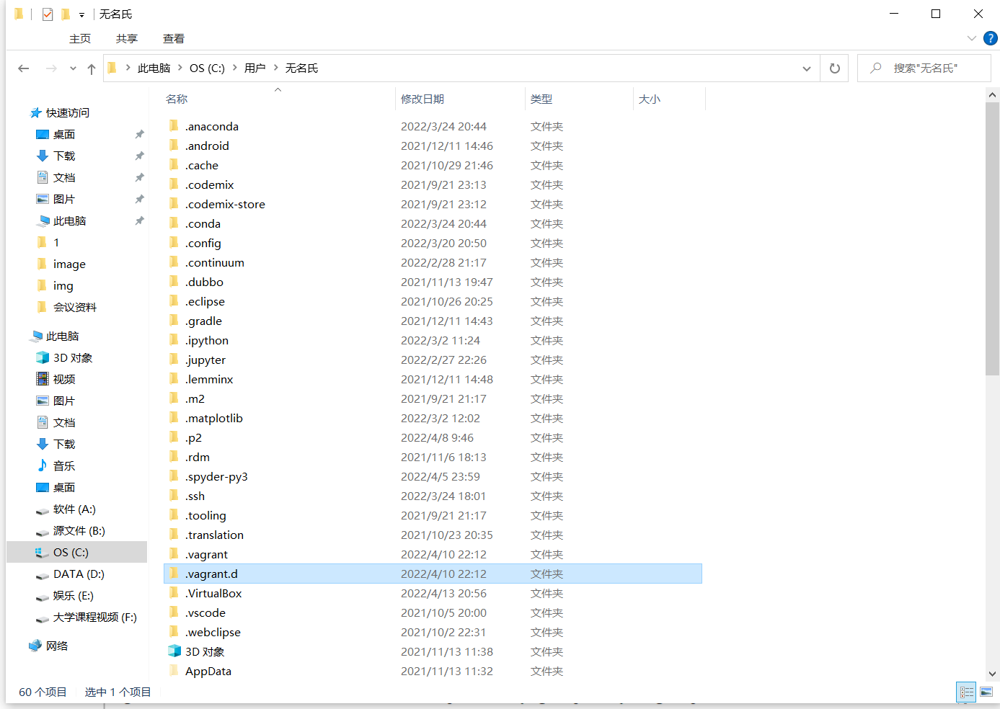


##### 2、设置环境变量

###### 1、此电脑右键-->点击属性

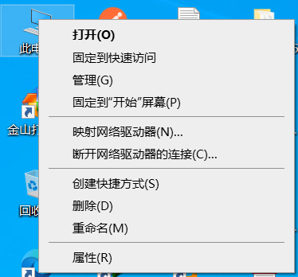

###### 2、点击高级系统设置

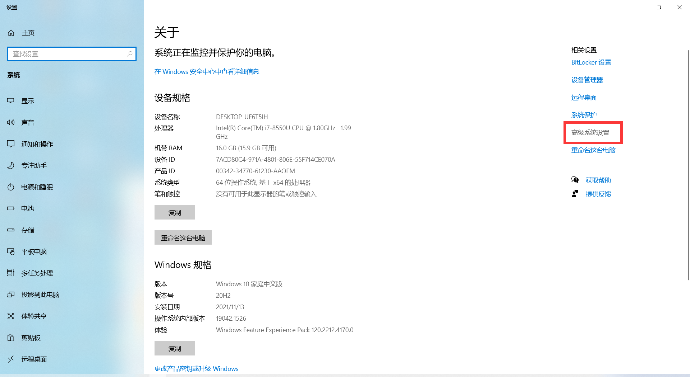

###### 3、点击环境变量

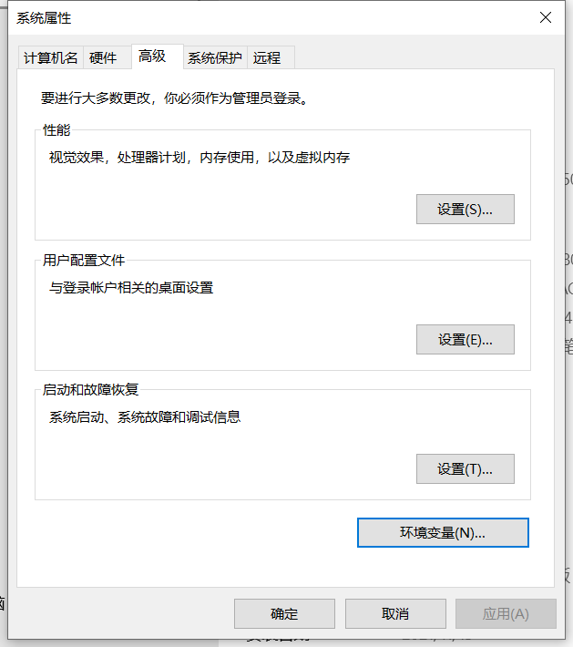

###### 4、新建系统变量

点击系统变量下的新建，输入变量名输入VAGRANT_HOME，变量值为.vagrant.d路径，点击确定

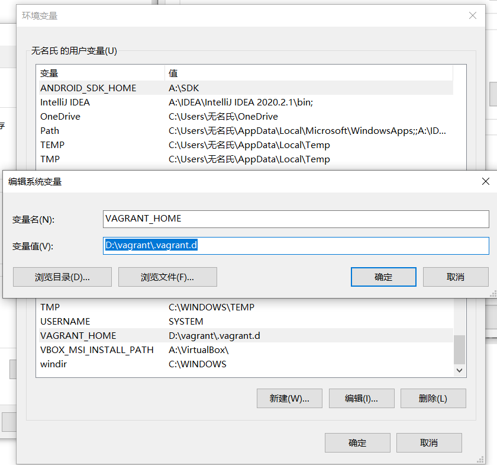

#### (2)修改virtualbox

##### 3、修改全局配置

**点击管理-->全局配置-->常规，修改默认虚拟电脑位置即可**

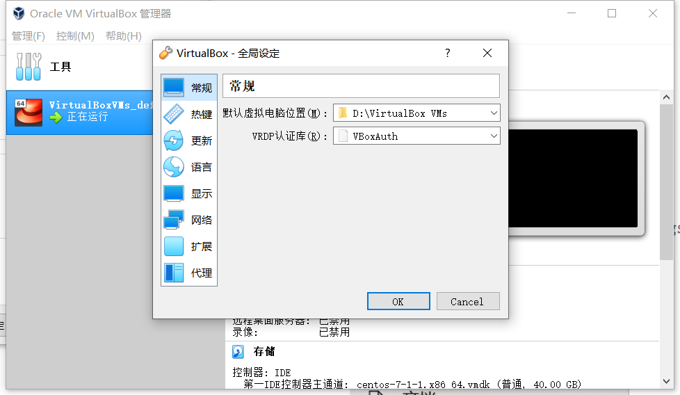

##### 4、拷贝以前虚拟机文件夹

若之前已使用过虚拟机(没有使用过，以下步骤可忽略)，可以拷贝以前虚拟机文件夹(***这一步一定要先进行，否则后面删除虚拟机后，虚拟机对应的文件就都消失了，无法重建虚拟机***)

例如:C:\Users\[用户名]\VirtualBox VMs -> D:\\virtualbox\VirtualBox VMs

##### 5、删除旧的虚拟机

点击管理-->全局配置-->常规，修改默认虚拟电脑位置即可

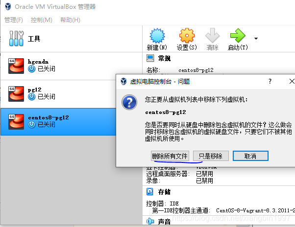

##### 6、重新添加虚拟机

点击D:\virtualbox\VirtualBox VMs\centos8-pg12

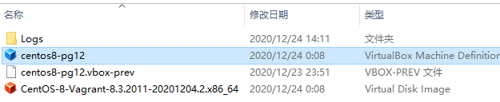

虚拟机会被重新添加到virtualbox中，右键->设置->存储，查看虚拟机的存储disk文件，已经对应的是新的目录下的文件

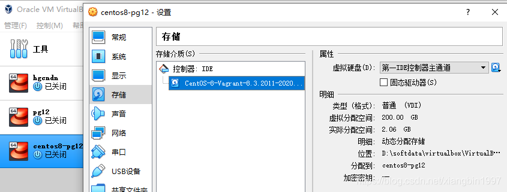

##### 7、最后可以整体删除C盘下目录VirtualBox VMs

[^参考链接;https://www.csdn.net/tags/NtzaQg5sOTUwODItYmxvZwO0O0OO0O0O.html]: 

例如C:\Users\[用户名]\VirtualBox VMs

## 1.2、使用vagrant init centos7命令安装centos7

cmd切换到VirtualBox VMs目录，执行vagrant init centos7,生成Vagrantfile文件

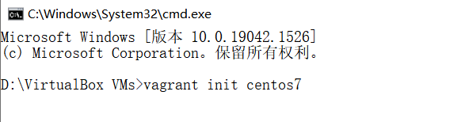

## 1.3、使用`vagrant up`命令开启虚拟机

cmd切换到VirtualBox VMs目录，执行`vagrant up`

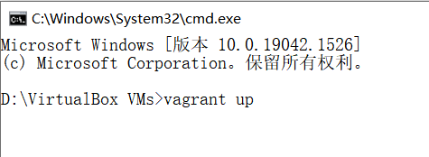

如果下载速度很慢，可以删除Vagrantfile文件使用中科大镜像重新生成Vagrantfile文件

```powershell
vagrant init centos7 https://mirrors.ustc.edu.cn/centos-cloud/centos/7/vagrant/x86_64/images/CentOS-7.box
```

或者将执行vagrant init centos7命令显示的网址复制下来，在迅雷上下载

## 1.4、使用`vagrant ssh`命令连接虚拟机

cmd切换到VirtualBox VMs目录，执行`vagrant ssh`命令

**可以使用exit可以退出vagrant ssh连接**

#### 1.4.1、vagrant报错:rage:

ssh-key的私钥的拥有者的权限，不是当前的用户。

vagrant@127.0.0.1: Permission denied (publickey,gssapi-keyex,gssapi-with-mic).

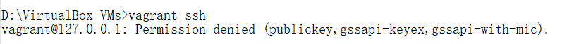

解决方法

##### 1、点击windows图标，鼠标悬浮在头像上，可以显示用户名(或者cmd使用whoami命令也可以查看用户名)

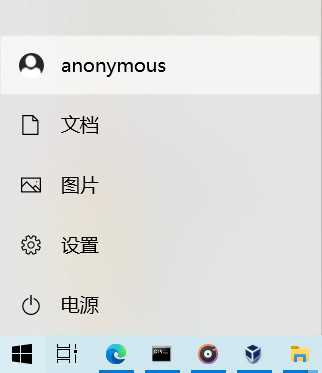

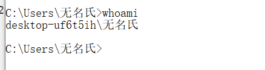

##### 2、找到VirtualBox VMs\.vagrant\machines\default\virtualbox下的private_key

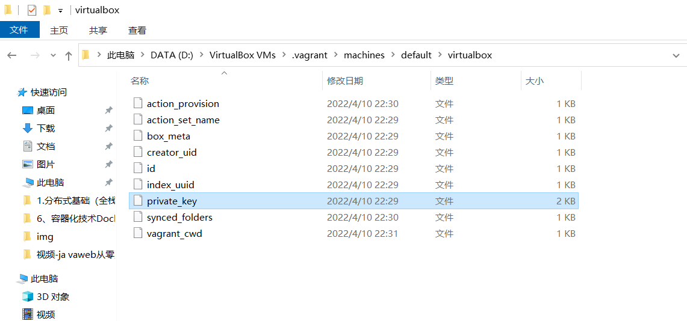

##### 3、右键该文件依次点击 属性–> 安全->编辑 添加，输入你的用户名,点击检查名称后，点击确定

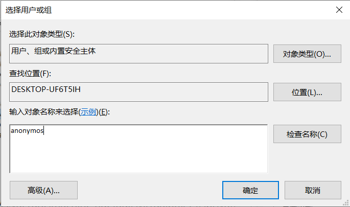

##### 4、点击刚刚添加的用户，权限设为完全控制，点击确定,删除其他没有用的用户

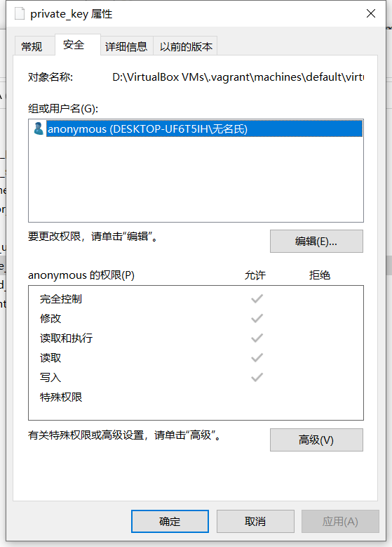

##### 5、返回上一级目录,点击virtualbox，右键-->属性

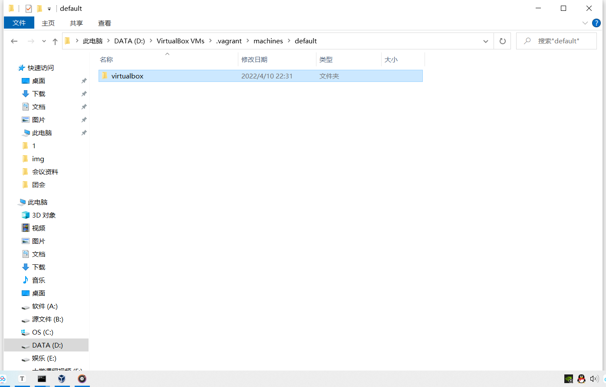

##### 6、删除其他没用的权限，只保留用户名对应的权限


##### 7、修改成这个样子，点击确定

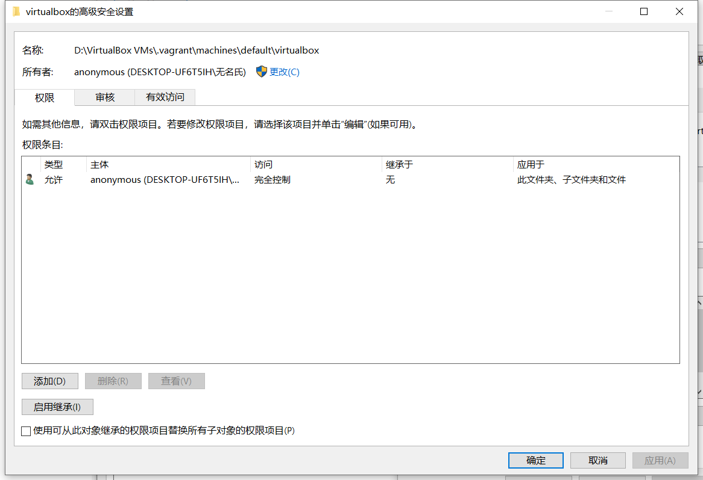

##### 8、重新输入`vagrant ssh`即可**:smile:**

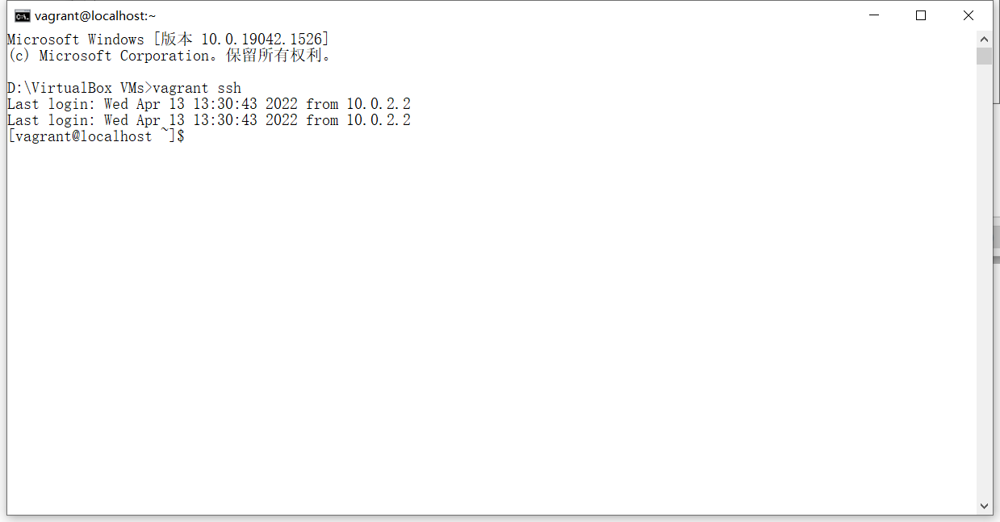


## 1.5、修改网络连接方式

修改网络连接方式,使ssh能使用相同端口连接虚拟机应用

#### 1.5.1、查看 VirtualBox的ip地址

cmd执行`ipconfig`命令,查看以太网适配器 VirtualBox Host-Only Network的IPv4地址(192.168.56.1)

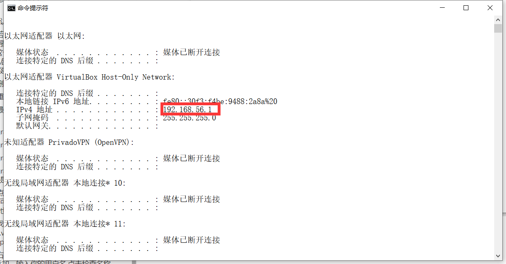

#### 1.5.2、找到VirtualBox VMs下Vagrantfile文件

#### 1.5.3、修改ip地址

打开config.vm.network选项,修改ip，使与VirtualBox Host-Only Network的IPv4地址处于同一网段,如192.168.56.10

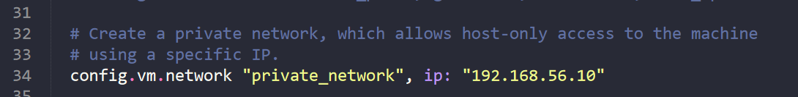

#### 1.5.4、使用`vagrant reload`命令重启虚拟机

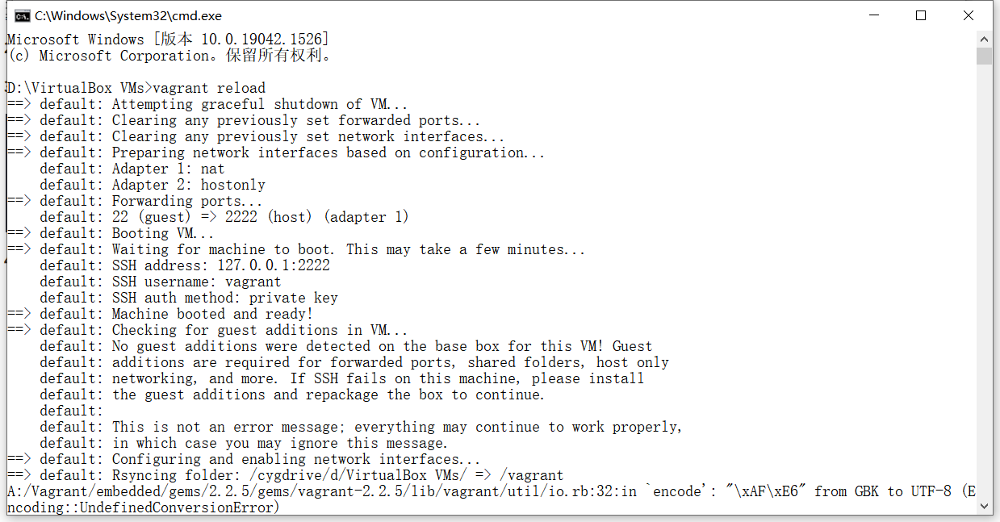

#### 1.5.5、使用`vagrant ssh`命令重新连接

#### 1.5.6、使用`ip addr`命令查看网卡地址

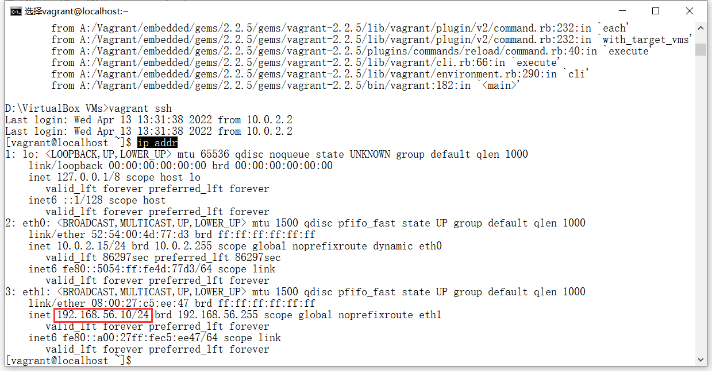

#### 1.5.7、在真实主机上测试连通性

在真实主机上使用`ping 192.168.56.10`测试真实主机与虚拟机的连通性

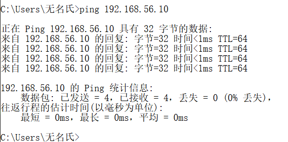

## 1.6、使用docker

Docker 安装文档：[Install Docker Engine on CentOS | Docker Documentation](https://docs.docker.com/engine/install/centos/)

#### 1.1.3.1、卸载系统之前的 docker

```linux
sudo yum remove docker \
                  docker-client \
                  docker-client-latest \
                  docker-common \
                  docker-latest \
                  docker-latest-logrotate \
                  docker-logrotate \
                  docker-engine
```

#### 1.1.3.2、安装必须的依赖

```linux
sudo yum install -y yum-utils \
                device-mapper-persistent-data \
                lvm2
```

#### 1.1.3.3、设置 docker repo 的 yum 位置

```linux
sudo yum-config-manager \
    --add-repo \
    https://download.docker.com/linux/centos/docker-ce.repo
```

#### 1.1.3.4、安装 docker，以及 docker-cli

```linux
sudo yum install docker-ce docker-ce-cli containerd.io
```

#### 1.1.3.5、启动docker

```linux
sudo systemctl start docker
```

#### 1.1.3.6、查看docker版本

```docker
docker -v
```

#### 1.1.3.7、查看docker镜像

```docker
sudo docker images
```

#### 1.1.3.8、设置docker开机自启

```linux
sudo systemctl enable docker
```

#### 1.1.3.9、配置docker镜像加速

##### 1、登录阿里云后，点击控制台


##### 2、点击三个横杠


##### 3、找到容器镜像服务

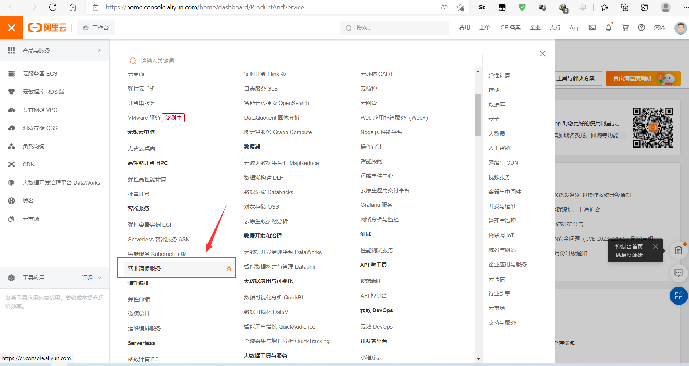

##### 4、点击镜像工具,在镜像加速器里点击CentOS,可以看到命令提示

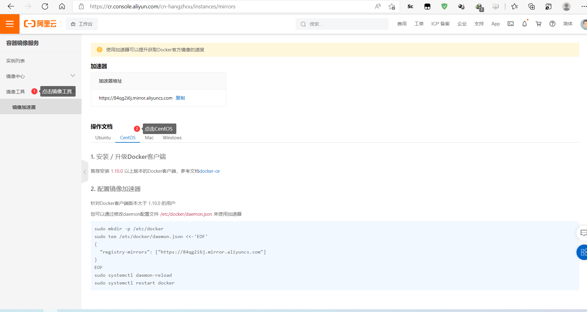

##### 5、创建/etc/docker目录

```linux
sudo mkdir -p /etc/docker
```

##### 6、修改配置文件

```linux
sudo tee /etc/docker/daemon.json <<-'EOF'
{
  "registry-mirrors": ["https://84qg2i6j.mirror.aliyuncs.com"]
}
EOF
```

##### 7、重新加载配置文件

```linux
sudo systemctl daemon-reload
```

##### 8、重启docker服务

```linux
sudo systemctl restart docker
```

##### 9、使用sudo docker info命令查看是否生效

```docker
sudo docker info
```

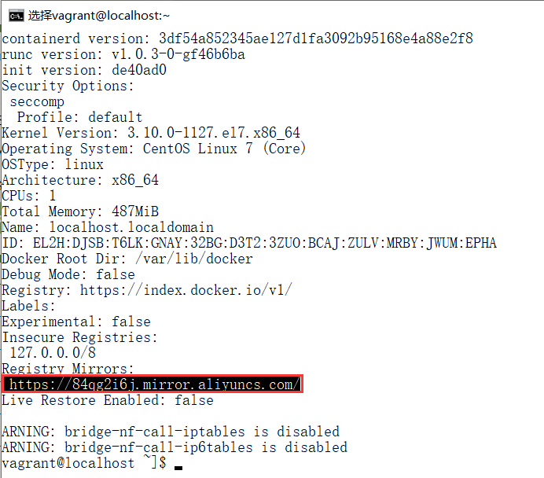

#### 1.6.10、使用mysql

##### 1、进入docker官网,点击Projects中的Docker Hub


##### 2、点击Go to Docker Hub


##### 3、在搜索框中输入mysql(Official Image为官方镜像)

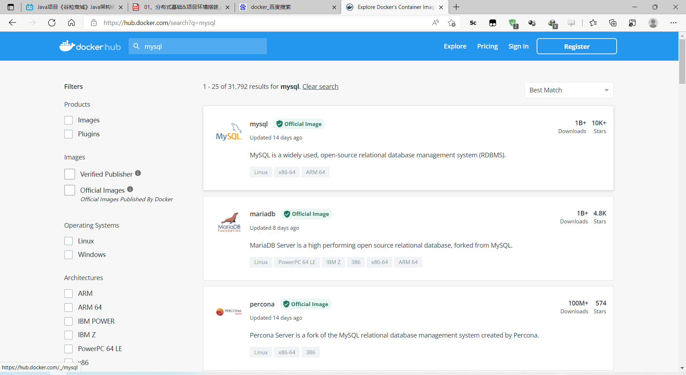

##### 4、点击mysql(Official Image)

##### 5、点击Tags可以查看历史版本

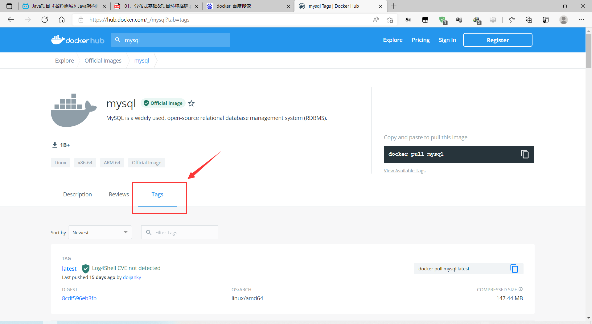

##### 6、下载mysql 5.7

可以看到下载mysql 5.7的命令为

```docker
docker pull mysql:5.7
```


若不是管理员用户登录可以提升权限,执行`sudo docker pull mysql:5.7`命令

```docker
sudo docker pull mysql:5.7
```

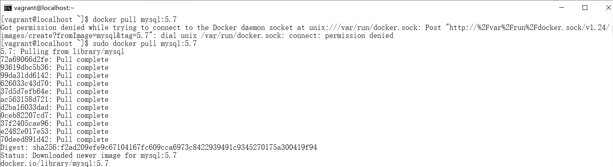

##### 7、检查是否安装成功

使用sudo docker images命令检查已安装的镜像

```docker
sudo docker images
```

可以看到mysql 5.7已安装完成

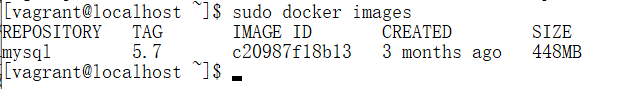

##### 8、创建实例并启动

###### 1、提升权限

该命令也需要加权限,可以切换到root用户,密码默认为vagrant

```linux
su root
```

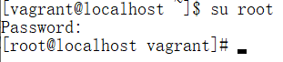

###### 2、查看当前用户

使用`whami`命令查看当前用户

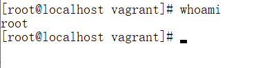

###### 3、启动mysql

```docker
docker run -p 3306:3306 --name mysql \
-v /mydata/mysql/log:/var/log/mysql \
-v /mydata/mysql/data:/var/lib/mysql \
-v /mydata/mysql/conf:/etc/mysql \
-e MYSQL_ROOT_PASSWORD=root \
-d mysql:5.7
```

参数说明

```
-p 3306:3306：将mysql容器的3306端口映射到linux主机的3306端口
--name mysql：给该容器起个名字
-v /mydata/mysql/conf:/etc/mysql：将配置文件夹挂载到主机(将mysql容器的/etc/mysql目录映射到linux的/mydata/mysql/conf目录)
-v /mydata/mysql/log:/var/log/mysql：将日志文件夹挂载到主机
-v /mydata/mysql/data:/var/lib/mysql/：将数据文件夹挂载到主机
-e MYSQL_ROOT_PASSWORD=root：初始化 root用户的密码
-d mysql:5.7 :以后台方式运行mysql:5.7镜像
```


##### 9、使用`docker ps`命令查看正在运行的容器

```dpcker
docker ps
```

可以看到mysql:5.7已经启动了

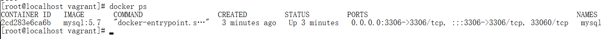

使用docker ps -a可以查看所有容器(包括未运行的容器)

```docker
docker ps -a
```

使用使用`docker images`查看所有镜像

```docker
docker images
```

**ps:docker常见错误**

权限不足,在前面加sudo 或使用管理员账户登录

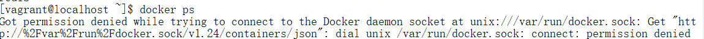

##### 10、连接mysql

使用navicate连接工具测试是否连接成功

mysql容器的3306端口映射到linux的3306端口，主机需要输入linux的ip地址,密码为root


##### 11、进入mysql内部

以交互模式进入mysql的linux bash控制台

```docker
docker exec -it mysql /bin/bash
```

##### 12、可以看到已经进入mysql容器内部

mysql容器包含mysql的完整运行环境


##### 13、使用ls /命令

```linux
ls /
```

可以看到mysql容器的目录结构

mysql容器包含mysql的完整运行环境,其实就是linux的目录结构

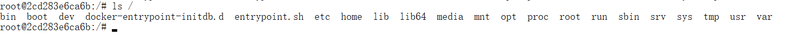

##### 14、查看mysql安装位置

```linux
whereis mysql
```

使用`whereis mysql`命令可以看到mysql安装在mysql容器里的位置

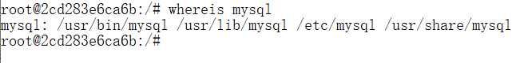

##### 15、退出mysql容器

使用`exit`命令

```linux
exit
```

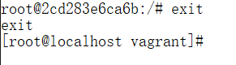

##### 16、进入mysql容器外部挂载的linux目录的对应位置

```linux
cd /mydata/mysql/conf
```

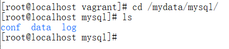

##### 17、打开my.cnf配置文件

```linux
vi /mydata/mysql/conf/my.cnf
```

##### 18、修改字符编码

`skip-name-resolve`：跳过域名解析，解决 MySQL 连接慢的问题

```properties
[client]
default-character-set=utf8

[mysql]
default-character-set=utf8

[mysqld]
init_connect='SET collation_connection = utf8_unicode_ci'
init_connect='SET NAMES utf8' 
character-set-server=utf8
collation-server=utf8_unicode_ci
skip-character-set-client-handshake
skip-name-resolve
```

##### 19、重启mysql

```docker
docker restart mysql
```

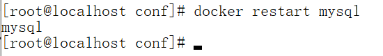

##### 20、进入mysql容器内部,查看映射是否成功

以交互模式进入mysql的linux bash控制台

```docker
docker exec -it mysql /bin/bash
```

###### 1、docker报错,容器没有运行:rage:

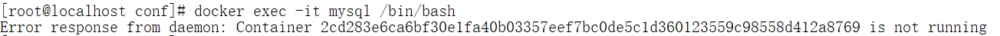

可以看到NAMES为mysql的STATUS为Exited说明mysql容器的状态为已退出

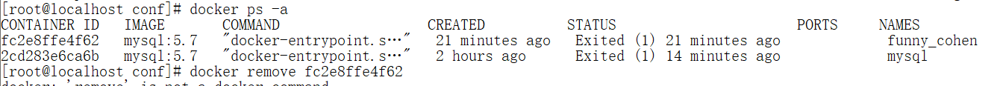

ps: 多了一个名为funy_cohen的容器

###### 2、删除容器对象

使用 `docker rm 镜像实例ID` 命令，删除对应容器对象

```docker
docker rm 镜像实例ID
```

即为:(可以写id的部分，只要可以区分就可以)

```docker
docker rm fc2e8ffe4f62
```

###### 3、启动mysql容器

```docker
docker start 2cd283e6ca6b
```

**ps: 关闭mysql容器**

```docker
docker stop 2cd283e6ca6b
```

###### 4、启动没报错，但STATUS还是为Exited:angry:

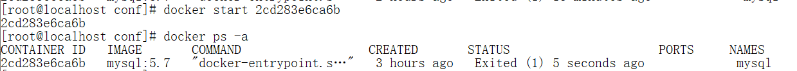

###### 5、查看该容器日志

```docker
docker logs 2cd283e6ca6b
```

###### 6、查看报错信息

 Found option without preceding group in config file /etc/mysql/my.cnf at line 1!

在配置文件/etc/mysql/my.cnf第一行中找到了没有前面组的选项

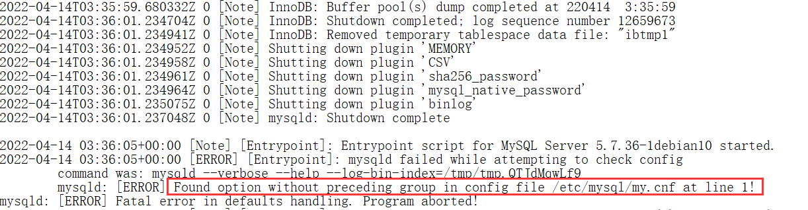

###### 7、打开/etc/mysql/my.cnf文件

```linux
vi /etc/mysql/my.cnf
```

###### 8、发现第一行少了一个[client]

![发现第一行少了一个[client]](image/1.6.10.20.8.png)

###### 9、添加[client]即可**:smile:**

ps:输入" [ "的时候[client]又跳出来了，也不知道是怎么回事

![添加[client]](image/1.6.10.20.9.png)

###### 10、启动后，可以看到STATUS变为Up

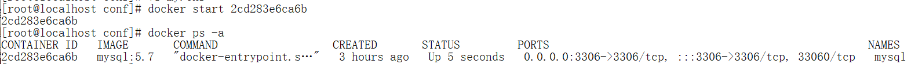

ps.再次打开可以看到[client]有时候有，有时候又没有了，就很奇怪

![再次打开可以看到[client]有时候有，有时候又没有了，就很奇怪](image/1.6.10.20.12.png)

![再次打开可以看到[client]有时候有，有时候又没有了，就很奇怪](image/1.6.10.20.11.png)

1.6.10.21查看mysql容器内部是否有该配置文件

```docker
docker exec -it mysql /bin/bash  #以交互模式进入mysql的linux bash控制台
 cd /etc/mysql/
 ls
 cat my.cnf
```

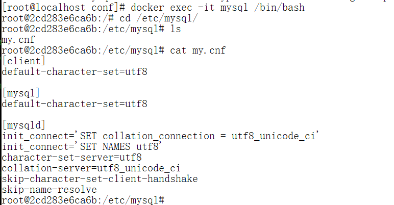

#### 1.6.11、使用redis

##### 1、下载最新redis镜像文件

```docker
docker pull redis
```

##### 2、在linux中创建redis配置目录

```linux
mkdir -p /mydata/redis/conf
```

##### 3、在linux中创建redis配置文件

```linux
touch /mydata/redis/conf/redis.conf
```

ps：必须先创建文件，然后再启动redis,否则会把redis.conf当成一个目录

##### 3、启动redis

```docker
docker run -p 6379:6379 --name redis \
-v /mydata/redis/data:/data \
-v /mydata/redis/conf/redis.conf:/etc/redis/redis.conf \
-d redis redis-server /etc/redis/redis.conf
```

说明

```
-p 6379:6379：将redis容器的6379端口映射到linux主机的6379端口
--name redis：给该容器起个名字
-v /mydata/redis/data:/data \：将数据文件夹挂载到主机
-v /mydata/redis/conf/redis.conf:/etc/redis/redis.conf \：将配置文件夹挂载到主机(将redis容器的/etc/redis/redis.conf文件映射到linux的/mydata/redis/conf/redis.conf文件)
-d redis:以后台方式运行redis镜像
redis-server /etc/redis/redis.conf 以配置文件启动redis，加载容器内的conf文件，最终找到的是挂载的目录/usr/local/docker/redis.conf
--appendonly yes 开启redis持久化
```

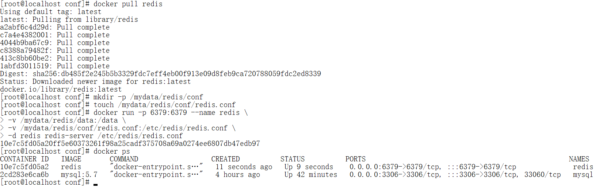

1.6.11.4、使用 redis 镜像执行 redis-cli 命令连

```docker
docker exec -it redis redis-cli
```

1.6.11.5、测试是否可用

```redis
set a b
get a
```

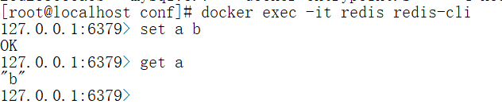

1.6.11.6、使用exit退出

```redis
exit
```

1.6.11.7、启用redis持久化

进入redis.conf配置文件

```linux
vi /mydata/redis/conf/redis.confr
```

开启redis持久化

```
appendonly yes
```

重启redis

```docker
docker restart redis
```

可以看到redis已持久化

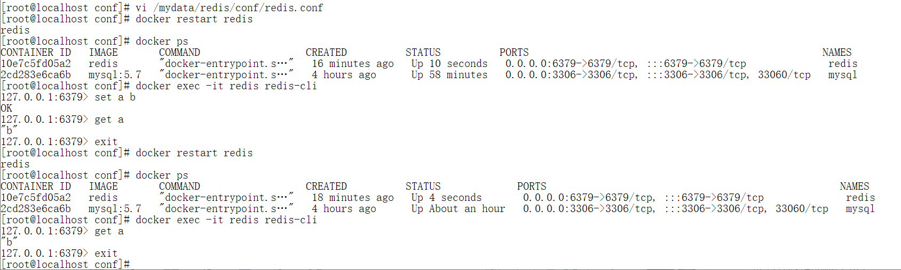

## 1.7开发工具&环境配置

#### 1.7.1、下载maven3.6.1

解压后，配置环境变量

再cmd中查看mvn版本 ，若显示版本则证明配置正确

```maven
mvn -version
```

#### 1.7.2、配置阿里云镜像

在maven的conf文件夹下的settings.xml文件内配置阿里云镜像

```xml
<mirror>
    <id>alimaven</id>
    <name>aliyun maven</name>
    <url>http://maven.aliyun.com/nexus/content/groups/public/</url>
    <mirrorOf>central</mirrorOf>
</mirror>
```


#### 1.7.3 配置 jdk1.8 编译项目

```xml
<profile>
	<id>jdk-1.8</id>
	<activation>
		<activeByDefault>true</activeByDefault>
		<jdk>1.8</jdk>
	</activation>
	<properties>
		<maven.compiler.source>1.8</maven.compiler.source>
		<maven.compiler.target>1.8</maven.compiler.target>
		<maven.compiler.compilerVersion>1.8</maven.compiler.compilerVersion>
	</properties>
</profile>
```


#### 1.7.4 配置本地仓库位置

```xml
<localRepository>A:\maven\apache-maven-3.8.2\mvn_respository</localRepository>
```


#### 17.5 将maven加载到Intellij IDEA中

##### 1、点击configure


##### 2、点击Settings


##### 3、依次点击Build、Execution，Deployment ---> Build Tools ---> Maven

修改为自己的maven路径


#### 1.7.6、安装IDEA插件

点击configure下的Plugins


安装Lombox插件


安装MyBaitsX插件


#### 1.7.7、安装Visual Studio Code插件

修改插件安装位置

可以单击右键VS Code快捷方式 ---> 属性 ---> 快捷方式 --->  目标 那里添加  --extensions-dir  "插件安装位置"

```
"软件启动程序" --extensions-dir "插件安装位置"
```

例如:

```
"A:\VS Code\Microsoft VS Code\Code.exe" --extensions-dir "A:\VS Code\extensions"
```

插件说明

- `Vetur` ：语法高亮、智能感知、Emmet 等

  包含格式化功能， Alt+Shift+F （格式化全文），Ctrl+K Ctrl+F（格式化选中代码，两个 Ctrl需要同时按着）

- ~~`EsLint` ：语法纠错~~（强烈建议不要安装，明明没错它报错，插件不及时更新，新语法不支持）

- `Auto Close Tag` ：自动闭合 HTML/XML 标签

- `Auto Rename Tag` ：自动完成另一侧标签的同步修改

- `JavaScript(ES6) code snippets` ：ES6 语法智能提示以及快速输入， 除 js 外还支持.ts，.jsx，.tsx，.html，.vue，省去了配置其支持各种包含 js 代码文件的时间

- `HTML CSS Support` ： 让 html 标签上写 class 智能提示当前项目所支持的样式

- `HTML Snippets` ： html 快速自动补全

- `Open in browser` ：浏览器快速打开

- `Live Server`：以内嵌服务器方式打开

- `Chinese (Simplified) Language Pack for Visual Studio Code` ：中文语言包


#### 1.7.8、配置git

进入git bash

##### 1、配置用户名

```git
git config --global user.name "username"    //（名字） 
```

##### 2、配置邮箱

```git
git config --global user.email "username@email.com"      //(注册账号时用的邮箱)
```

##### 3、生成密钥

```git
ssh-keygen -t rsa -C "username@email.com"
```

或使用

```git
ssh-keygen -t rsa
```

连续三次回车。一般用户目录下会有一下两个文件


##### 4、使用一下命令查看公钥

```powershell
cat ~/.ssh/id_rsa.pub
```

使用以下命令可以粘贴到剪贴板

```powershell
clip < ~/.ssh/id_rsa.pub    #windows系统
pbcopy < ~/.ssh/id_rsa.pub  #mac os系统
```


##### 5、向gitee添加公钥

登录进入 gitee，在设置里面找到 SSH KEY 将.pub 文件的内容粘贴进去


##### 6、测试添加是否成功

```git
ssh -T git@gitee.com
```

第一次绑定会有警告信息，输入yes即可


##### 7、向github添加公钥


##### 8、测试添加是否成功

第一次绑定会有警告信息，输入yes即可


#### 1.7.9、新建仓库

##### 1、使用gitee新建仓库


点击刚创建的项目 ---> 点击管理 --->点击开源 ---> 勾选须知 ---> 点击保存


##### 2、使用github新建仓库


#### 1.7.10、新建项目

##### 1、点击Get from Version Control


##### 2、查看仓库ssh


##### 3、在URL里输入刚才复制的ssh,点击关闭


ps：点击close后发现在下载java 11，删除该项目，修改版本在重新新建项目，可以发现没有下载java 11


##### 4、添加github仓库

###### 1、点击code ---> 复制ssh 


###### 2、选择VCS ---> Git ---> Remotes


###### 3、点击+号，Name输入一个名字,URL输入刚才复制的ssh


##### 4、修改项目的java版本


## 1.8、新建各个模块

#### 1.8.1、新建商品模块


```
com.atguigu.gulimall
gulimall-product
谷粒商城商品服务
com.atguigu.gulimall.product
```


选择 Web --> Spring Web; Spring Cloud Routing --> OpenFeign (其他模块也一样)


直接点确定


1.8.2、新建仓储模块

```
com.atguigu.gulimall
gulimall-ware
谷粒商城-仓储服务
com.atguigu.gulimall.ware
```


#### 1.8.3、新建订单模块

```
com.atguigu.gulimall
gulimall-order
谷粒商城-订单服务
com.atguigu.gulimall.order
```


#### 1.8.4、新建会员模块

```
com.atguigu.gulimall
gulimall-member
谷粒商城-会员服务
com.atguigu.gulimall.member
```


#### 1.8.5、新建优惠劵模块

```
com.atguigu.gulimall
gulimall-coupon
谷粒商城-优惠劵服务
com.atguigu.gulimall.coupon
```


#### 1.8.6、遇到报错

##### 1、pom文件颜色变成赤红色，内容报红:angry:


##### 2、单击右键pom文件,选择Add as Maven Project**:smile:**


##### 3、可看到已经不报红了

ps:我把pom文件内容替换成资料提供的pom文件(这样可以少很多错误)，删除那些还没创建的模块的依赖等


**ps:这里如果点了test测试类，会发现测试类报错**

可以参看1.10.9.8

##### 其他问题

 打开项目，以前不报错的地方现在报错(或出现了其他问题)

可以点击File-->Invalidate Caches / Restar  删除原来的缓存和索引，等待Idea重新构建缓存和索引


#### 1.8.7、项目添加pom文件,作为父项目

父项目需要答pom包

```xml
<packaging>pom</packaging>
```

modules为其子模块


```xml
<?xml version="1.0" encoding="UTF-8"?>
<project xmlns="http://maven.apache.org/POM/4.0.0" xmlns:xsi="http://www.w3.org/2001/XMLSchema-instance"
		 xsi:schemaLocation="http://maven.apache.org/POM/4.0.0 https://maven.apache.org/xsd/maven-4.0.0.xsd">
	<modelVersion>4.0.0</modelVersion>
	<groupId>com.atguigu.gulimall</groupId>
	<artifactId>gulimall</artifactId>
	<version>0.0.1-SNAPSHOT</version>
	<name>gulimall</name>
	<description>聚合服务</description>
	<packaging>pom</packaging>

	<modules>
		<module>gulimall-coupon</module>
		<module>gulimall-member</module>
		<module>gulimall-order</module>
		<module>gulimall-product</module>
		<module>gulimall-ware</module>
	</modules>

</project>
```

#### 1.8.8 添加.gitignore内容

##### 1找到git --> Local Changes --> Unversioned Files 可以查看未被管理的文件


有些版本的不一样，可以点这里


##### 2、如果没有找到

可以按 alt +  9 

或者设置里取消勾选这个


##### 3、添加不加入版本控制的文件和文件夹

在父项目的.gitignore文件中添加不加入版本控制的文件和文件夹

```.gitignore
**/mvnw			
**/mvnw.cmd

**/.mvn
**/target/

.idea

**/.gitignore
```


##### 4、将剩下的文件纳入到版本控制


#### 1.8.9、提交项目初始结构代码

##### 1、提交代码


##### 2、push到gitee


**ps:可以看到origin为gitee的远程仓库**


##### 3、推送到github

###### 1、push到github


###### 2、点击Push


###### 3、貌似没有提交上去:scream:

可以看到貌似没有提交上去，但是多了一个提示，说master分支9分钟前提交了推送


###### 4、切换到master分支即可看到推送


###### 5、修改默认分支

点击项目的Settings --> Branches --> 交换按钮


可以看到已经修改了默认分支


###### 6、全局修改默认分支


#### 1.8.10、初始数据库

##### 1 发现连接linux的mysql报错了


##### 2 可以看到mysql并没有启动


##### 3、设置mysql开机自启动

设置mysql开机自启动

```docker
sudo docker update  mysql  --restart=always
```


启动mysql容器

```docker
sudo docker start mysql
```

同理,设置redis开机自启动

```docker
sudo docker update  redis  --restart=always
sudo docker start redis
```

##### 4、新建数据库

新建gulimall_pms数据库(**是gulimall_pms，不是gulimall-pms**)

数据库名填 gulimall_pms

字符集选 utf8mb4


同理，新建其他数据库

```
gulimall_pms	//商品管理系统
gulimall_oms 	//订单管理系统
gulimall_sms	//营销管理系统
gulimall_ums	//用户管理系统
gulimall_wms	//库存管理系统
```

##### 5、执行sql语句

###### 1、选中gulimall_pms,点击工具 --> 命令行界面


###### 2、复制sql语句到命令行界面，然后回车执行sql语句

然后点击gulimall_pms下的表。右键 --> 刷新，即可看到sql语句执行后新建的表


1.8.10.5.3、点击表下面的随便一张表，右键 --> 设计 查看注释是不是乱码


**ps:不要运行sql文件，一定要在命令行执行sql语句，否则中文会乱码**


同理，执行其他sql语句

#### 1.8.11、使用人人开源

##### 1、使用人人开源的以下两个项目


##### 2、新建renren-fast项目

**~~可以在资料里复制该项目到自己的项目里面~~**

不要使用资料提供的renren-fast项目，不然前期会有错误，我就是使用的资料里的项目，后来出现了很多错误


##### 3、新建gulimall_admin数据库,字符集选择utf8mb4


##### 4、在gulimall_admin数据库中执行mysql.sql的sql语句


##### 5、删除哪些还没有创建的依赖


##### 6、wagon-maven-plugin报红


##### 7、上面的代码不删,在dependencies里面添加这个依赖，刷新一下就行了

```xml
<dependency>
	<groupId>org.codehaus.mojo</groupId>
	<artifactId>wagon-maven-plugin</artifactId>
	<version>1.0</version>
	<type>pom</type>
</dependency>
```


##### 8、@EnableDiscoveryClient报红

这是以后向注册中心发现服务用的，现在用不上删除即可


##### 9、运行这个项目

##### 10、又报错了

###### 1、可以看到是数据库的问题(Communications link failure：通信链路失败)


###### 2、网站也访问不到


后来发现数据库名字是gulimall-admin,配置的是gulimall_admin

将数据库删除重新新建gulimall_admin数据库即可(字符集选 utf8mb4)

同理修改其他的数据库

###### 3、修改后发现还是报错

使用本地mysql连接，发现可以连上


###### 4、在本地创建了同样的数据库，发现没有报错


###### 5、发现ssl报错:rage:

No appropriate protocol (protocol is disabled or cipher suites are inappropriate)

没有合适的协议（协议被禁用或密码套件不合适）


###### 6、不使用ssl

在url后面添加&useSSL=false，不使用ssl，可以发现已经没有错误了

```properties
url: jdbc:mysql://192.168.56.10:3306/gulimall_admin?useUnicode=true&characterEncoding=UTF-8&serverTimezone=Asia/Shanghai&useSSL=false
```


###### 7、浏览器可以访问了


## 1.9、前端初始化

#### 1.9.1、打开前端项目

~~将gulimall-admin-vue-app拖入到VS Code快捷方式（后来我又使用renren-fast-vue了）~~

下载renren-fast-vue，使用VS Code打开该项目

#### 1.9.2、配置node.js

##### 1、安装node 10.16.3

修改一下安装位置，其他默认即可

（一定要是这个版本，不然后面会有很多错误）

##### 2、cmd输入node -v可以查看版本

```node
node -v
```

##### 3、cmd输入以下命令，修改为淘宝镜像

```npm
npm config set registry http://registry.npm.taobao.org/
```

查看是否修改成功

```npm
npm config ls
```


1.9.2.4、修改node.js全局包安装位置

```npm
npm config set prefix "A:/nodejs/npm_global"
npm config set cache "A:/nodejs/npm_cache"
```

出错了，在那个位置创建npm_global文件夹和npm_cache文件夹即可


查看是否修改成功

```npm
npm config ls
```


#### 1.9.3、下载依赖

##### 1、在VS Code控制台输入npm install命令

```npm
npm install
```

npm包管理工具会根据package.json配置文件下载对应的包，放在node_moudules目录下


##### 2、python报错:rage:

可以看到python报错，很明显我python版本太高了

**ps:如果没有python，安装python2.7就行了**


##### 3、安装windows-build-tools

以管理员身份运行VS Code，输入以下命令

```npm
npm install --global --production windows-build-tools
```

可以看到该命令会安装python2.7

如果没有以管理员身份运行会提示

```
Please restart thie script from a administrative PowerShell!
```


##### 4、安装no5de-gyp

```npm
npm install --global node-gyp 
```


##### 5、卸载安装失败的包

```npm
npm uninstall node-sass
```

##### 6、然后重新安装

```npm
npm install sass -i
```

##### 7、chromedriver错误:angry:


`npm install` 安装依赖出现 chromedriver 之类的问题，先在项目运行以下命令

```npm
npm install chromedriver --chromedriver_cdnurl=http://cdn.npm.taobao.org/dist/chromedriver
```


再运行以下命令,指定python版本

```npm
npm install --python=python2.7
```

或者直接修改npm的python版本设置

```npm
npm config set python python2.7
npm install
```

可以看到已经不报错了


#### 1.9.4、运行前端项目

先运行后端项目，再运行前端项目

##### 1、执行以下命令运行前端项目

```npm
npm run dev
```

##### 2、有6处编译错误:rage:


###### 1、执行以下命令即可

```npm
npm uninstall --save node-sass
npm install --save node-sass
npm run dev
```

###### 2、VS版本问题:rage:

```
could not use PowerShell to find Visual Studio 2017 or newer, try re-running with '--loglevel silly' for more details
无法使用Power Shell查找Visual Studio 2017或更新，请尝试使用“ -loglevel Silly”重新运行，以获取更多详细信息
You need to install the latest version of Visual Studio        
find VS including the "Desktop development with C++" workload.
您需要安装最新版本的Visual Studio查找VS，包括“带有C ++的桌面开发”工作负载。
```


##### 3、设置msvs_version版本

```npm
npm config set msvs_version 2019
```

##### 4、发现又回到1.9.4.2这个错了

##### 5、再执行1.9.4.2.1的命令，就好了

```npm
npm uninstall --save node-sass
npm install --save node-sass
npm run dev
```

#### 1.9.5、没有验证码:rage:

没有验证码是因为我使用的是资料提供的代码，而不是renren-fast-vue

renren-fast-vue没有这个问题，而资料提供的是请求给了网关(88端口)

所有没有看到验证码（一定要使用renren-fast-vue，不要使用资料提供的，除非不想学前端）


查看请求可以看到，请求的路径localhost:88/api


而后台的路径为localhost:8080/renren-fast


将前端请求路径改为

```http
http://localhost:8080/renren-fast
```


可以看到有验证码了


用户名和密码都为admin

```
admin
```

ps:如果不是这个问题，先启动后端，再启动前端，另外再看看数据库是不是连不上

## 1.10、生成后端代码

#### 1.10.1、下载人人开源的[renren-generator](https://gitee.com/renrenio/renren-generator)


#### 1.10.2、解压后复制到项目的根目录

:pushpin:根目录单击右键，选择Show in Explorer可以查看根目录


如果renren-generator的pom文件为赤红色，单击右键pom文件,选择Add as Maven Project

如过pom文件`<project>`标签报错

,在`<parent>`标签内添加`<relativePath/>`即可


#### 1.10.3、修改mysql

修改renren-generator模块下的application.yml文件内的mysql的url,username,password


#### 1.10.4、修改代码生成器配置

修改renren-generator模块下的generator.properties文件内的配置


发现注释出现了#\u5503这种的，编码为GBK，且不可修改

在Files-->Settings里找到File Encodings,修改Properties Files默认字符编码

并勾选Transparent native-to-ascii conversion，将原来的gbk编码的文件转为utf-8编码


发现空文件夹默认在同一行，在项目设置里取消勾选Compact Middle Packages


可以发现gulimall_pms都是以pms_开头的


因此修改成这样

```properties
mainPath=com.atguigu
package=com.atguigu.gulimall
moduleName=product
author=作者
email=你的邮箱
tablePrefix=pms_
```


#### 1.10.5、修改模板

在resources/template的 Controller.java.vm文件内去掉使用shrio框架的部分(6处)，后续会使用Spring Security

可以使用`ctrl+F`搜索RequiresPermissions查找


#### 1.10.6、运行项目


#### 1.10.7、生成代码

浏览器输入localhost:80


#### 1.10.8、复制文件

将生成的main复制到gulimall_product的src目录下

点击模块，单击右键--> Show in Explorer可以打开该模块所在位置


resources下的src生成的是vue文件，用不到，删除resources下的src即可


没有static和templates也不要紧，里面也没有文件


#### 1.10.9、可以看到报了很多错误:rage:

##### 1、controller、dao、entity、service报错

ps:这个注释乱码了是因为执行的运行sql文件，导致表里面中文乱码，生成的代码注释也乱码了，后来我又重新执行的sql语句


##### 2、新建com.atguigu.common模块

父项目gulimall单击右键 -->New --> Moudle --> maven --> next --> com.atguigu.common --> Finish

让gulimall-product模块依赖common模块,刷新一下

```xml
<dependency>
	<groupId>com.atguigu.gulimall</groupId>
	<artifactId>gulimall-common</artifactId>
	<version>0.0.1-SNAPSHOT</version>
</dependency>
```


##### 3、解决entity报错

###### 1、可以看到有lombox和mybatis plus注解


###### 2、添加lombox和mybatis plus依赖

**需要下载lombox插件才能生成get，set，toString等方法**

可以看到添加依赖后，gulimall-product模块下的entity不报错了

```xml
<dependency>
    <groupId>com.baomidou</groupId>
    <artifactId>mybatis-plus-boot-starter</artifactId>
    <version>3.2.0</version>
</dependency>
<dependency>
     <groupId>org.projectlombok</groupId>
     <artifactId>lombok</artifactId>
     <version>1.18.8</version>
</dependency>
```


##### 4、解决dao报错

dao层只用到的@Mapper注解，在解决entity层报错时，已经添加了mybatis plus

##### 5、解决service报错

###### 1、service少了公共模块中的PageUtils类


###### 2、复制PageUtils类

将reren-fast模块里common/utils下的PageUtils类复制到gulimall-common里面


###### 3、service少了公共模块中的Query类


###### 4、复制Query类

将reren-fast模块里common/utils下的Query类复制到gulimall-common里面


###### 5、缺少SQLFiler和StringUtils


###### 6、复制SQLFilter类

将reren-fast模块里common/xss下的SQLFilter类复制到gulimall-common里面

**ps:这里的SQLFilter复制错位置了,其实问题也不大，后面移动一下位置就行了**


###### 7、去掉`import io.renren.common.xss.SQLFilter;`


###### 8、添加common-lang依赖

```xml
 <dependency>
    <groupId>commons-lang</groupId>
    <artifactId>commons-lang</artifactId>
    <version>2.6</version>
</dependency>
```


###### 9、缺少Constant


###### 10、复制Constant类

将reren-fast模块里common/utils下的Constant类复制到gulimall-common里面

可以看到Querey不报错了


###### 11、缺少RRException:angry:


###### 12、复制RRException类

将reren-fast模块里common/exception下的RRException类复制到gulimall-common里面


###### 13、替换导入的类

```java
import io.renren.common.exception.RRException;
```

替换为

```java
import com.atguigu.common.exception.RRException;
```


###### 14、可以看到service层已经不报错了


##### 6、解决controller报错

###### 1、缺少R类


###### 2、导入R类

把renren-fast模块的common/utils的R复制到com.atguigu.common模块


###### 3、R报错,没有HttpStatus:angry:


###### 4、添加httpcore

HttpStatus为httpcore依赖下的

pom中添加依赖，刷新以下，可以发现R不报错了

```xml
<dependency>
    <groupId>org.apache.httpcomponents</groupId>
    <artifactId>httpcore</artifactId>
    <version>4.4.12</version>
</dependency>
```


##### 7、可以发现都不报错了**:smile:**


##### 8、点开测试类，发现报错

这个错误的主要原因是

在Spring Boot 2.2.X以后使用Junit5导的包为`import org.junit.jupiter.api.Test`

在Spring Boot 2.2.x之前使用Junit4导的包为`import org.junit.Test`  

新建模块使用的是Spring Initializr,默认的版本为2.6.6，我后来又手动修改为的2.1.8.RELEASE

这个junit5版本的，测试类不是public类型的


可以复制提供的源代码，变为2.1.8.RELEASE版本的测试类

```java
package com.atguigu.gulimall.product;

import org.junit.Test;
import org.junit.runner.RunWith;
import org.springframework.boot.test.context.SpringBootTest;
import org.springframework.test.context.junit4.SpringRunner;

@RunWith(SpringRunner.class)
@SpringBootTest
public class GulimallProductApplicationTests {

	@Test
	public void contextLoads() {
	}

}
```


或者引入一下依赖

**version设成5.4.0设置数据源后启动的时候会报错**

```xml
<dependency>
	<groupId>org.junit.jupiter</groupId>
	<artifactId>junit-jupiter-api</artifactId>
	<version>RELEASE</version>
	<scope>test</scope>
</dependency>
```


##### 9、运行后，发现没有配DataSource


这里不用管这个错误，后期配置文件还会配其它的，到时候一起配置，也可以先配置

###### 1、在gulimall-common模块添加依赖

```xml
 <dependency>
      <groupId>mysql</groupId>
      <artifactId>mysql-connector-java</artifactId>
      <version>8.0.17</version>
</dependency>
<dependency>
     <groupId>com.baomidou</groupId>
     <artifactId>mybatis-plus-boot-starter</artifactId>
     <version>3.2.0</version>
</dependency>
```


###### 2、在启动类添加组件扫描注解

在gulimall-product模块启动类添加组件扫描注解

```java
@MapperScan("com.atguigu.gulimall.product.dao")
```


ps:可以点击com/atguigu/gulimall/product下的dao包-->单击右键 -- > Copy Reference 或者使用Ctrl + Alt + Shift + C 拷贝全包名


###### 3、配置数据源和端口

在gulimall-product模块的application.yml中配置数据源和端口

```yaml
spring:
  datasource:
    driver-class-name: com.mysql.cj.jdbc.Driver
    url: jdbc:mysql://192.168.56.10:3306/gulimall_pms?useSSL=false
    username: root
    password: root
mybatis-plus:
  mapper-locations: classpath*:/mapper/**/*.xml
  global-config:
    db-config:
      id-type: auto
server:
  port: 10000
```


###### 4、运行项目

运行后发现不报错了


**ps:后面发现SQLFilter复制错位置了，移动一下就好了**


我第二次生成代码(表的注释乱码了，又重新执行的sql语句，重新生成代码)

的时候没有gulimall-product的启动类`GulimallProductApplication`(第一次生成的有)

后面新建了一个`GulimallProductApplication`启动类


#### 1.10.10、生成其他模块代码

| 项目名          | 模块名 | 数据库名     | 表前缀 |
| --------------- | ------ | ------------ | ------ |
| gulimall-coupon | coupon | gulimall_sms | sms_   |
| gulimall-member | member | gulimall_ums | ums_   |
| gulimall-order  | order  | gulimall_oms | oms_   |
| gulimall-ware   | ware   | gulimall_wms | wms_   |

##### 1、修改数据库


##### 2、修改模块名、表前缀


##### 3、修改test测试类

将生成的文件复制到对应模块后，可以修改test测试类

修改为junit4

```java
package com.atguigu.gulimall.product;			//改动这里的product

import org.junit.Test;
import org.junit.runner.RunWith;
import org.springframework.boot.test.context.SpringBootTest;
import org.springframework.test.context.junit4.SpringRunner;

@RunWith(SpringRunner.class)
@SpringBootTest
public class GulimallProductApplicationTests {	//改动这个类名里的Product

	@Test
	public void contextLoads() {
	}

}
```


ps:这个测试类导的包和一些其他的模块不一样，我也不知道为什么

这个类导的包是

```java
import org.testng.annotations.Test;
```

其他模块是上面这个，或者是

```java
import org.junit.jupiter.api.Test;
```


##### 4、删除resources下的src文件夹

resources下的src文件夹为vue文件，后续用不到，删除即可


##### 5、修改数据库名和端口

修改对应模块的dao层的全包名

ps:可以点击对应模块下的dao包-->单击右键 -- > Copy Reference 或者使用Ctrl + Alt + Shift + C 拷贝全包名


##### 6、修改配置文件

修改数据库名和端口

| 项目名          | 数据库名     | 端口  |
| --------------- | ------------ | ----- |
| gulimall-coupon | gulimall_sms | 7000  |
| gulimall-member | gulimall_ums | 8000  |
| gulimall-order  | gulimall_oms | 9000  |
| gulimall-ware   | gulimall_wms | 11000 |

ps:模块端口从上到下，依次加1000(gulimall-product已经配过端口，为10000)


##### 7、测试各模块

浏览器运行各自的url，测试是否配置正确

| 模块名           | 测试url                                                   |
| ---------------- | --------------------------------------------------------- |
| gulimall-coupon  | http://localhost:7000/coupon/coupon/list                  |
| gulimall-member  | http://localhost:8000/member/growthchangehistory/list     |
| gulimall-order   | http://localhost:9000/order/order/list                    |
| gulimall-product | http://localhost:10000/product/attrattrgrouprelation/list |
| gulimall-ware    | http://localhost:11000/ware/purchase/list                 |


#### 1.10.11、gulimall-ware模块报错

gulimall-ware模块下的`com.atguigu.gulimall.ware.entity.UndoLogEntity`类中的`rollbackInfo`返回类型报错


查看数据库发现rollbackInfo类型为`longblob`


经查，数据库中longblob类型对应java的byte[]类型

ps:头一次听说这个类型

![数据库中longblob类型对应java的byte[]类型](image/1.10.11.3.png)

或者可以把gulimall_wms的undo_log表删掉，重新生成一下就行了(提供的源代码没有这个类)

# 二、后端分布式学习

## 2.1、整合Myabatis-plus

官网教程:[简介 | MyBatis-Plus (baomidou.com)](https://baomidou.com/pages/24112f/)

#### 2.1.1、导入依赖

可以在common模块里面导入这两个依赖

##### 1、导入mysql依赖

各依赖支持情况: [MySQL :: MySQL Connector/J 8.0 Developer Guide :: 2 Compatibility with MySQL and Java Versions](https://dev.mysql.com/doc/connector-j/8.0/en/connector-j-versions.html)

可以发现8.0版本依赖全适配


```xml
<dependency>
    <groupId>mysql</groupId>
    <artifactId>mysql-connector-java</artifactId>
    <version>8.0.17</version>
</dependency>
```

##### 2、导入mybatis-plus依赖

```xml
<dependency>
    <groupId>com.baomidou</groupId>
    <artifactId>mybatis-plus-boot-starter</artifactId>
    <version>3.2.0</version>
</dependency>
```

刷新一下就好了


#### 2.1.2、配置

##### 1、配置数据源

```yaml
spring:
  datasource:
    driver-class-name: com.mysql.cj.jdbc.Driver
    url: jdbc:mysql://192.168.56.10:3306/gulimall_pms
    username: root
    password: root
```

##### 2、启动类添加MapperScan注解

其实不配置也可以

```java
@MapperScan("com.atguigu.gulimall.product.dao")
```

##### 3、配置mapper.xml扫描路径

默认就是这个

`classpath`    表示只扫描自己的路径

`classpath*`  表示不仅扫描自己的路径，还扫描依赖的jar包的路径

```yaml
mybatis-plus:
  mapper-locations: classpath*:/mapper/**/*.xml
```

##### 4、配置id自增

先配置id自增，后来分库分表的时候再做其他的主键生成策略

```yaml
mybatis-plus:
  mapper-locations: classpath*:/mapper/**/*.xml
  global-config:
    db-config:
      id-type: auto
```

#### 2.1.3、测试一下

这里我使用的是junit5，后来我又改为junit4了(源代码提供的测试类)


这是改后的测试类


##### 1、mysql报错:angry:

又是SSL的问题


##### 2、url添加参数

url后面添加 ?useSSL=false 就行了

```properties
url: jdbc:mysql://192.168.56.10:3306/gulimall_pms?useSSL=false
```


##### 3、增改查都测试通过

```java
package com.atguigu.gulimall.product;

import com.atguigu.gulimall.product.entity.BrandEntity;
import com.atguigu.gulimall.product.service.BrandService;
import com.baomidou.mybatisplus.core.conditions.AbstractWrapper;
import com.baomidou.mybatisplus.core.conditions.query.LambdaQueryWrapper;
import com.baomidou.mybatisplus.core.conditions.query.QueryWrapper;
import org.junit.jupiter.api.Test;
import org.springframework.beans.factory.annotation.Autowired;
import org.springframework.boot.test.context.SpringBootTest;

import java.util.List;

@SpringBootTest
class GulimallProductApplicationTests {

	@Autowired
	BrandService brandService;
	@Test
	public void save() {
		BrandEntity brand = new BrandEntity();
		brand.setDescript("111");
		brandService.save(brand);
		System.out.println("保存成功...");
	}

	@Test
	public void updateById() {
		BrandEntity brand = new BrandEntity();
		brand.setBrandId(1L);
		brand.setDescript("222");
		brandService.updateById(brand);
		System.out.println("修改成功...");
	}

	@Test
	public void query() {
		LambdaQueryWrapper<BrandEntity> lambdaQueryWrapper = new LambdaQueryWrapper<BrandEntity>();
		lambdaQueryWrapper.eq(BrandEntity::getBrandId,1);
		List<BrandEntity> list = brandService.list(lambdaQueryWrapper);
		list.forEach(System.out::println);
	}
}

```


## 2.2、分布式组件

Spring Clould 官方文档: https://spring.io/projects/spring-cloud

Spring Clould Alibaba中文文档:  [spring-cloud-alibaba/README-zh.md at 2021.x · alibaba/spring-cloud-alibaba (github.com)](https://github.com/alibaba/spring-cloud-alibaba/blob/2021.x/README-zh.md)

#### 2.2.1、分布式组件选择

| 功能                           | 官方组件  | 使用组件 |
| ------------------------------ | --------- | -------- |
| 注册中心 Service Discovery     | Eureka    | Nacos    |
| 配置中心                       | Eureka    | Nacos    |
| 网关 Intelligent Routing       | Zuul      |          |
| 断路保护 Circuit Breaker       | Hystrix   |          |
| 负载均衡                       | Ribbon    | Ribbon   |
| 声明式HTTP客户端(远程调用服务) | OpenFeign |          |
| 限流、熔断、降级               | Hystrix   | Sentinel |
| API网关                        | Gateway   |          |
| 调用链监控                     | Sleuth    |          |
| 分布式事务                     |           | Seata    |

#### 2.2.2、版本选择

官方给出的版本选择方案


本项目的Spring Boot版本为2.1.8.RELEASE,因此选择的版本为Spring Clould Alibaba版本为2.1.0.RELEASE

#### 2.2.3、使用nacos做注册中心

nacos官方文档: [什么是 Nacos](https://nacos.io/zh-cn/docs/what-is-nacos.html)

nacos中文文档: [spring-cloud-alibaba/readme-zh.md at 2021.x · alibaba/spring-cloud-alibaba (github.com)](https://github.com/alibaba/spring-cloud-alibaba/blob/2021.x/spring-cloud-alibaba-examples/nacos-example/nacos-discovery-example/readme-zh.md)

##### 1、版本管理

在gulimall-common模块使用`dependencyManagement`导入`spring-cloud-alibaba`

`dependencyManagement`中定义的只是依赖的声明，并不实现引入，因此子项目需要显式的声明需要用的依赖。

在`dependencyManagement`元素中声明所依赖的jar包的版本号等信息，

那么所有子项目再次引入此依赖jar包时则无需显式的列出版本号。

Maven会沿着父子层级向上寻找拥有`dependencyManagement` 元素的项目，然后使用它指定的版本号。

```xml
<dependencyManagement>
        <dependencies>
            <dependency>
                <groupId>com.alibaba.cloud</groupId>
                <artifactId>spring-cloud-alibaba-dependencies</artifactId>
                <version>2.1.0.RELEASE</version>
                <type>pom</type>
                <scope>import</scope>
            </dependency>
        </dependencies>
</dependencyManagement>
```


##### 2、导入nacos依赖

在gulimall-common模块添加nacos依赖

```xml
<dependency>
   <groupId>com.alibaba.cloud</groupId>
   <artifactId>spring-cloud-starter-alibaba-nacos-discovery</artifactId>
</dependency>
```


##### 3、下载nacos

下载网址: https://github.com/alibaba/nacos/releases?page=3


##### 4、启动nacos

Windows电脑双击这个


##### 5、配置server-addr

向gulimall-coupon模块的配置文件配置server-addr


##### 6、启动类添加服务发现注解

向gulimall-coupon模块启动类添加服务发现注解

```java
@EnableDiscoveryClient
```


##### 7、运行模块

运行模块之前,nacos必须先启动

##### 8、查看服务列表

浏览器输入网址: http://127.0.0.1:8848/nacos

用户名和密码都为 nacos

发现没有服务


##### 9、向模块起个应用名

向gulimall-coupon模块的配置文件添加application.name

```yaml
application:
  name: gulimall-coupon
```


##### 10、重新运行模块

可以发现已经注册到注册中心了


同理，配置其他模块

#### 2.2.4、使用OpenFeign

##### 1、服务提供方

###### 1、导入OpenFeign依赖

在gulimall-coupon模块导入OpenFeign依赖

```xml
<dependency>
   <groupId>org.springframework.cloud</groupId>
   <artifactId>spring-cloud-starter-openfeign</artifactId>
</dependency>
```


###### 2、编写服务提供者方法

在gulimall-coupon模块`com.atguigu.gulimall.coupon.controller.CouponController`类写测试方法

```java
@RequestMapping("/member/list")
public R memberCoupons(){
    CouponEntity couponEntity = new CouponEntity();
    couponEntity.setCouponName("满100减10");
    return R.ok().put("coupons",Arrays.asList(couponEntity));
}
```


##### 2、服务消费方

###### 1、导入OpenFeign依赖

在gulimall-member模块导入OpenFeign依赖

```xml
<dependency>
   <groupId>org.springframework.cloud</groupId>
   <artifactId>spring-cloud-starter-openfeign</artifactId>
</dependency>
```


###### 2、编写一个接口

编写一个接口，告诉Spring Clould这个接口需要调用远程服务

这个接口写调用哪个服务的哪些请求

在gulimall-member模块下新建一个CouponFeignService接口

里面指明服务名，服务的请求路径

```java
@FeignClient("gulimall-coupon")
public interface CouponFeignService {
    @RequestMapping("/coupon/coupon/member/list")
    public R memberCoupons();
}
```


###### 3、开启远程调用功能

在该接口上加入@EnableFeignClients注解

```java
@EnableFeignClients(basePackages = "com.atguigu.gulimall.member.feign")
```


###### 4、编写测试方法

```java
@Autowired
CouponFeignService couponFeignService;

/**
 * Openfeign消费方测试
 * @return
 */
@RequestMapping("/coupons")
public R test(){
    MemberEntity memberEntity = new MemberEntity();
    memberEntity.setNickname("张三");

    R memberCoupons = couponFeignService.memberCoupons();

    Object coupons = memberCoupons.get("coupons");
    return R.ok().put("member",memberEntity).put("coupons",coupons);
}
```


###### 5、IDEA检测到不能自动注入

```java
Could not autowire. No beans of 'CouponFeignService' type found. 
```

```
无法自动注入。 找不到“CouponFeignService”类型的 bean。
```


其实可以注入成功，只是IDEA检测到该接口没有注入到Spring容器，其实使用`@EnableFeignClients`注解后在运行时会注入到容器中的

如果不想看到红色的报错，可以在该接口添加`@Component`显示的注入到Spring容器


###### 6、出现报错:angry:

```
Field couponFeignService in com.atguigu.gulimall.member.controller.MemberController 
required a bean of type 'com.atguigu.gulimall.member.feign.CouponFeignService' that could not be found.
```

```
com.atguigu.gulimall.member.controller.MemberController 中的字段 couponFeignService
需要一个找不到的“com.atguigu.gulimall.member.feign.CouponFeignService”类型的 bean。
```


发现我nacos、应用名和`@EnableDiscoveryClient`没配:fearful:


###### 7、配置后还是这个错误

我根据我以前学的Spring Coluld,将`@EnableFeignClients`注解移动到启动类后，不报错了


###### 8、运行结果


可以看到远程调用已经成功了


ps:可以使用JSON-Handle或JSONViewer等类似插件，优雅地显示json数据


#### 2.2.5、使用nacos做配置中心

nacos中文文档: https://github.com/alibaba/spring-cloud-alibaba/blob/2021.x/spring-cloud-alibaba-examples/nacos-example/nacos-config-example/readme-zh.md

##### 1、添加依赖

首先，修改 pom.xml 文件，引入 Nacos Config Starter。

```xml
<dependency>
     <groupId>com.alibaba.cloud</groupId>
     <artifactId>spring-cloud-starter-alibaba-nacos-config</artifactId>
 </dependency>
```

在gulimall-common模块的pom文件中添加依赖

##### 2、配置元数据

在应用的 /src/main/resources/bootstrap.properties 配置文件中配置 Nacos Config 元数据

```properties
 spring.application.name=nacos-config-example
 spring.cloud.nacos.config.server-addr=127.0.0.1:8848
```

在gulimall-coupon模块resources新建bootstrap.properties配置文件

在SpringBoot中默认是不支持bootstrap.properties属性文件的。我们需要映入SpringCloud的依赖才可以。

bootstrap.properties中定义的文件信息会先与application.properties中的信息加载

bootstrap.properties配置文件添加应用名和nacos的服务地址

```properties
spring.application.name=gulimall-coupon

spring.cloud.nacos.config.server-addr=127.0.0.1:8848
```


##### 3、测试

##### **传统配置文件方式**

###### 1、配置名字和年龄

在gulimall-coupon模块的resources文件夹下的application.properites文件中配置名字和年龄

```properties
user.name=zhangsan
user.age=18
```


###### 2、注入

在gulimall-coupon模块下的com.atguigu.gulimall.coupon.controller的CouponController类注入name和age

```java
@Value("${user.name}")
private String name;
@Value("${user.age}")
private String age;
```

###### 3、编写测试方法

```java
@RequestMapping("/test")
public R test(){
   return R.ok().put("name",name).put("age",age);
}
```


###### 4、测试

浏览器输入url:   http://127.0.1.1:7000/coupon/coupon/test


发现name不对，这是因为读取到了操作系统当前的用户名

###### 5、添加前缀

```properties
coupon.user.name=zhangsan
coupon.user.age=18
```

```java
@Value("${coupon.user.name}")
private String name;
@Value("${coupon.user.age}")
```

6、重新测试

重新运行模块，在浏览器中输入url: http://127.0.1.1:7000/coupon/coupon/test

传统方式的缺点是修改配置后需要重新运行模块，且多台机器运行该项目需要全部手动修改并重启


##### 配置中心方式

应用会从 Nacos Config 中获取相应的配置，并添加在 Spring Environment 的 PropertySources 中。

这里我们使用 `@Value` 注解来将对应的配置注入到 CouponController 的 `name` 和 `age` 字段，并添加 `@RefreshScope` 打开动态刷新功能

###### 1、先运行项目，查看name

可以看到 propertySources=[NacosPropertySource {name='gulimall-coupon.properties'}]}

中的name为gulimall-coupon.properties


###### 2、添加配置


###### 3、添加@RefreshScope注解

在`com.atguigu.gulimall.coupon.controller.CouponController`类上添加`@RefreshScope`注解(别加错位置)，重启模块


###### 4、查看配置是否生效

先优先使用配置中心有的配置

url: http://127.0.1.1:7000/coupon/coupon/test

重启模块后，刷新页面，发现配置已生效


###### 5、修改配置


###### 6、查看配置是否更新

url: http://127.0.1.1:7000/coupon/coupon/test

**不重启项目**，刷新页面，查看配置是否更新

可以发现，配置已更新


##### 4、总结

如何使用Nacos作为配置中心统一管理配置

###### 1、引入依赖

```xml
<dependency>
     <groupId>com.alibaba.cloud</groupId>
     <artifactId>spring-cloud-starter-alibaba-nacos-config</artifactId>
 </dependency>
```

###### 2、创建一个bootstrap.properties

```properties
 spring.application.name=nacos-config-example
 spring.cloud.nacos.config.server-addr=127.0.0.1:8848
```

###### 3、添加默认规则

需要给配置中心默认添加一个叫数据集(Data Id) gulimall-coupon.properties。默认规则，应用名. propert

###### 4、给应用名.properties添加任何配置

###### 5、动态获取配置

`@RefreshScope`:动态获取并刷新配置
`@Value( "${配置项的名}")`:获取到配置。
如果配置中心和当前应用的配置文件中都配置了相同的项，优先使用配置中心的配置。

##### 5、命名空间:配置隔离

默认: public(保留空间); 默认新增的所有配置都在public空间。

##### 开发，测试，生产 环境隔离

开发，测试，生产 利用命名空间来做环境隔离。

注意:在bootstrap. properties;配置上，需要使用哪个命名空间下的配置

```properties
spring.cloud.nacos.config.namespace=9de62e44-cd2a-4a82-bf5c-95878bd5e871
```

步骤：

###### 1、新建命名空间


###### 2、配置命名空间

可以先克隆配置


修改test命名空间配置


###### 3、使用test命名空间

复制命名空间的唯一标识


在bootstrap.properties中配置使用哪个命名空间

```properties
spring.cloud.nacos.config.namespace=6a781746-404e-4318-af52-abba2f20a03f
```


###### 4、查看结果

可以发现配置已生效**:smile:**


##### 微服务之间互相隔离配置

每一个微服务之间互相隔离配置，每一个微服务都创建自己的命名空间，只加载自己命名空间下的所有配置

###### 1、新建coupon命名空间

###### 2、配置命名空间

###### 3、使用coupon命名空间

复制coupon命名空间唯一标识


使用coupon命名空间


###### 4、查看结果

重启模块，刷新页面，可以发现配置已生效**:smile:**


##### 6、配置集

配置集：所有的配置的集合

##### 7、配置集ID

配置集ID(Data ID)：类似文件名。

##### 8、配置分组

默认所有的配置集都属于: DEFAULT_ GROUP
项目中的使用:每个微服务创建自己的命名空间，使用配置分组区分环境，dev,test, prod

###### 1、配置各环境


###### 2、使用分组

在gulimall-coupon模块的bootstrap.properties配置文件中添加配置

```properties
spring.cloud.nacos.config.group=dev
```


###### 3、查看结果

重启模块，刷新页面,可以发现配置已生效


分组也可以应用在不同的场景下


##### 9、加载多个配置集

1、微服务任何配置信息，任何配置文件都可以放在配置中心中
2、只需要在bootstrap. properties说明加载配置中心中哪些配置文件即可
3、`@Value`, `@ConfigurationProperties`。。。
以前SpringBoot任何方法从配置文件中获取值，都能使用。
配置中心有的优先使用配置中心中的。

```
datasource.yml
mybatis.yml
other.yml
```

###### 1、新建多个配置文件

新建datasource配置文件


同理，新建其他配置文件

###### 2、使用配置文件

在gulimall-coupon模块的bootstrap.properties配置文件中添加配置

```properties
#数据集id
spring.cloud.nacos.config.ext-config[0].data-id=datasource.yml
#数据分组
spring.cloud.nacos.config.ext-config[0].group=dev
#动态刷新
spring.cloud.nacos.config.ext-config[0].refresh=true

spring.cloud.nacos.config.ext-config[1].data-id=mybatis.yml
spring.cloud.nacos.config.ext-config[1].group=dev
spring.cloud.nacos.config.ext-config[1].refresh=true

spring.cloud.nacos.config.ext-config[2].data-id=other.yml
spring.cloud.nacos.config.ext-config[2].group=dev
spring.cloud.nacos.config.ext-config[2].refresh=true
```

新版本需要使用extension-configs

```properties
#数据集id
spring.cloud.nacos.config.ext-configs[0].data-id=datasource.yml
#数据分组
spring.cloud.nacos.config.ext-configs[0].group=dev
#动态刷新
spring.cloud.nacos.config.ext-configs[0].refresh=true

spring.cloud.nacos.config.ext-configs[1].data-id=mybatis.yml
spring.cloud.nacos.config.ext-configs[1].group=dev
spring.cloud.nacos.config.ext-configs[1].refresh=true

spring.cloud.nacos.config.ext-configs[2].data-id=other.yml
spring.cloud.nacos.config.ext-configs[2].group=dev
spring.cloud.nacos.config.ext-configs[2].refresh=true
```


###### 3、取消以前的配置


###### 4、查看结果

查看配置中心多配置文件是否生效

url: http://127.0.1.1:7000/coupon/coupon/test


url: http://127.0.1.1:7000/coupon/coupon/list


###### 5、读取到的配置文件

可以发现读取了4个配置文件

gulimall-coupon.properties 为默认读取到的


#### 2.2.6、使用GateWay

官方文档：[Spring Cloud Gateway](https://docs.spring.io/spring-cloud-gateway/docs/2.2.9.RELEASE/reference/html/)

选带GA的


##### 1、概念

- > **Route**: The basic building block of the gateway. It is defined by an ID, a destination URI, a collection of predicates, and a collection of filters. A route is matched if the aggregate predicate is true.
>
  > 路由：网关的基本构建块。 它由ID，目的地URI，谓词集合和滤波器集合定义。 如果总谓词是真的，则匹配路由

- > **Predicate**: This is a [Java 8 Function Predicate](https://docs.oracle.com/javase/8/docs/api/java/util/function/Predicate.html). The input type is a [Spring Framework `ServerWebExchange`](https://docs.spring.io/spring/docs/5.0.x/javadoc-api/org/springframework/web/server/ServerWebExchange.html). This lets you match on anything from the HTTP request, such as headers or parameters.
>
  > 断言：这是一个Java 8函数断言。 输入类型是Spring Framework ServerWebExchange。 这使您可以匹配HTTP请求的任何内容，例如标题或参数。

- > **Filter**: These are instances of [`GatewayFilter`](https://github.com/spring-cloud/spring-cloud-gateway/tree/2.2.x/spring-cloud-gateway-server/src/main/java/org/springframework/cloud/gateway/filter/GatewayFilter.java) that have been constructed with a specific factory. Here, you can modify requests and responses before or after sending the downstream request.
  >
  > 过滤器：这些是已使用特定工厂构建的GateWayFilter的实例。 在这里，您可以在发送下游请求之前或之后修改请求和响应。

##### 2、工作流程


##### 3、新建网关模块

```
com.atguigu.gulimall
gulimall-gateway
API网关
com.atguigu.gulimall.gateway
```


我还是复制了资料提供的pom文件

pom文件为赤红色，可以右键 --> Add as Maven Project


##### 4、依赖common工程

```xml
<dependency>
   <groupId>com.atguigu.gulimall</groupId>
   <artifactId>gulimall-common</artifactId>
   <version>0.0.1-SNAPSHOT</version>
</dependency>
```


##### 5、修改测试类

```java
package com.atguigu.gulimall.gateway;

import org.junit.Test;
import org.junit.runner.RunWith;
import org.springframework.boot.test.context.SpringBootTest;
import org.springframework.test.context.junit4.SpringRunner;

@RunWith(SpringRunner.class)
@SpringBootTest
public class GulimallGatewayApplicationTests {

    @Test
    public void contextLoads() {
    }

}
```


##### 6、配置注册中心

在gulimall-gateway模块的application.properties文件中配置注册中心

```properties
spring.cloud.nacos.discovery.server-addr=127.0.0.1:8848
spring.application.name=gulimall-gateway
server.port=88
```


##### 7、新建网关命名空间


##### 8、添加配置中心

在ulimall-gateway模块的resources目录下新建bootstrap.properties文件并添加配置

namespace为gateway命名空间的唯一标识

```properties
spring.application.name=gulimall-gateway
spring.cloud.nacos.config.server-addr=127.0.0.1:8848
spring.cloud.nacos.config.namespace=8b0687c0-b126-4fd1-bbe0-ef8ae8da674e
```


启动类加上`@EnableDiscoveryClient`注解


##### 9、添加配置


##### 10、运行项目

运行项目发现报DataSource的错误

这是因为依赖了gulimall-connon模块，gulimall-connon模块依赖了mysql数据库


##### 11、解决方法

修改@SpringBootApplication注解，排除DataSource自动配置

```java
@SpringBootApplication(exclude = {DataSourceAutoConfiguration.class})
```

或者排除spring-boot-starter-jdbc

```xml
<dependency>
   <groupId>com.atguigu.gulimall</groupId>
   <artifactId>gulimall-common</artifactId>
   <version>0.0.1-SNAPSHOT</version>
   <exclusions>
      <exclusion>
         <groupId>org.springframework.boot</groupId>
         <artifactId>spring-boot-starter-jdbc</artifactId>
      </exclusion>
   </exclusions>
</dependency>
```


##### 12、运行项目

发现网关是使用Netty做服务器的，Netty有非常高的网络性能


##### 13、配置路由规则

在application.yml中配置

> The preceding route matches if the request contained a `green` query parameter
>
> 如果请求包含“green”查询参数，则前面的路由匹配。
>

请求的url带target参数,例如：http://127.0.0.1:88/hello?target=123

```yaml
spring:
  cloud:
    gateway:
      routes:
      - id: baidu_routs
        uri: https://www.baidu.com/
        predicates:
        - Query=target
```

> The preceding route matches if the request contained a `red` query parameter whose value matched the `gree.` regexp, so `green` and `greet` would match.
>
> 如果请求包含红色查询参数，其值与 gre 匹配，则前面的路由匹配。 正则表达式，所以 green 和 greet 会匹配。
>

如果请求的target参数的值为baidu(可以为正则表达式),则转发到https://www.baidu.com/

如果请求的target参数的值为qq(可以为正则表达式),则转发到https://www.qq.com/

```yaml
spring:
  cloud:
    gateway:
      routes:
      - id: baidu_routs
        uri: https://www.baidu.com/
        predicates:
        - Query=target,baidu
      - id: qq_routs
        uri: https://www.qq.com/
        predicates:
        - Query=target,qq
```


##### 14、查看结果

运行模块查看结果:angry:

http://127.0.0.1:88/hello?target=baidu


发现报错(如果不报错的话会把/hello带上,即https://www.baidu.com/hello) 

输入http://127.0.0.1:88/?target=baidu 访问到百度**:smile:**


输入http://127.0.0.1:88/?target=qq 访问到qq


##### 15、mvn install报错:rage:

###### 1、模块重复

我在使用Maven Helper的`clear install`命令后，报了一个错误


com.atguigu.gulimall:gulimall:0.0.1-SNAPSHOT (B:\gulimall\pom.xml)的第21行有一个错误

```
 Some problems were encountered while processing the POMs:
'modules.module[8]' specifies duplicate child module gulimall-common @ line 21, column 17
```

```
处理POMS时遇到了一些问题：
'modules.module[8]' 指定重复的子模块 gulimall-common @ line 21, column 17
```


最后发现我gulimall-common写重了，删掉第21行就行了(因该是我先写了，生成gulimall-common模块的时候又给我添加了一个)

###### 2、没有找到JUnit4Provider

修改后又报了个错`java.lang.ClassNotFoundException: org.apache.maven.surefire.junit4.JUnit4Provider`


方法一：

这个类是surefire-junit4里面的，可以添加这个依赖

```xml
<dependency>
    <groupId>org.apache.maven.surefire</groupId>
    <artifactId>surefire-junit4</artifactId>
    <version>2.21.0</version>
</dependency>
```

方法二：

maven3使用junit4时需指定`org.apache.maven.surefire为surefire-junit47`,不然会报异常

```
Failed to execute goal org.apache.maven.plugins:maven-surefire-plugin:2.22.2:test (default-test) on project gulimall-coupon: There are test failures.
```

```xml
<plugin>
    <groupId>org.apache.maven.plugins</groupId>
    <artifactId>maven-surefire-plugin</artifactId>
    <version>2.12</version>
    <dependencies>
        <dependency>
            <groupId>org.apache.maven.surefire</groupId>
            <artifactId>surefire-junit47</artifactId>
            <version>2.12</version>
        </dependency>
    </dependencies>
</plugin>
```

方法三：

跳过测试

```xml
<plugin>
    <artifactId>maven-surefire-plugin</artifactId>
    <version>2.22.2</version>
    <configuration>
        <skipTests>true</skipTests>
    </configuration>
</plugin>
```


###### 3、报了很长的错误

```
he POM for org.springframework.boot:spring-boot-loader-tools:jar:2.1.8.RELEASE is invalid, transitive dependencies (if any) will not be available, enable debug logging for more details
```

```
org.springframework.boot:spring-boot-loader-tools:jar:2.1.8.RELEASE 的 POM 无效，传递依赖项（如果有）将不可用，启用调试日志以获取更多详细信息
```

```
Caused by: java.lang.ClassNotFoundException: org.springframework.boot.loader.tools.LaunchScript
```

```
[WARNING] Error injecting: org.springframework.boot.maven.RepackageMojo
java.lang.NoClassDefFoundError:org/springframework/boot/loader/tools/Repackager$MainClassTimeoutWarningListener
```

```
Failed to execute goal org.springframework.boot:spring-boot-maven-plugin:2.1.8.RELEASE:repackage (repackage) on project gulimall-coupon: Execution repackage of goal org.springframework.boot:spring-boot-maven-plugin:2.1.8.RELEASE:repackage failed: A required class was missing while executing org.springframework.boot:spring-boot-maven-plugin:2.1.8.RELEASE:repackage: org/springframework/boot/loader/tools/LaunchScript
```


找了好久,最后删除这个插件解决了


同理将其他gulimall模块(除了gulmall-common模块和gulimall根项目)的配置文件的这个部分

```xml
<build>
   <plugins>
      <plugin>
         <groupId>org.springframework.boot</groupId>
         <artifactId>spring-boot-maven-plugin</artifactId>
      </plugin>
   </plugins>
</build>
```

修改改为

```xml
<build>
   <plugins>
      <!--maven3使用junit4时需指定org.apache.maven.surefire为surefire-junit47,不然会报异常-->
      <plugin>
         <groupId>org.apache.maven.plugins</groupId>
         <artifactId>maven-surefire-plugin</artifactId>
         <version>2.12</version>
         <dependencies>
            <dependency>
               <groupId>org.apache.maven.surefire</groupId>
               <artifactId>surefire-junit47</artifactId>
               <version>2.12</version>
            </dependency>
         </dependencies>
      </plugin>
   </plugins>
</build>
```

由于renren-fast已经跳过了单元测试，所以只需要删掉spring-boot-mavne-plugin插件就行了


renren-gengerator同gulimall模块(除了gulmall-common模块和gulimall根项目)一样配置

右击gulimall根项目--> Run Maven -->`clean install`


可以看到所有项目构建成功


###### 4、离线安装jar包

**使用`mvn install`命令将下载好的jar安装至本地仓库中**

例如想使用如下依赖

```xml
<dependency>
    <groupId>org.apache.maven.plugins</groupId>
    <artifactId>maven-surefire-plugin</artifactId>
    <version>2.18.1</version>
</dependency>
```

下载的jar包名为maven-surefire-plugin-2.18.1.jar

```maven
mvn install:install-file
-Dfile=./maven-surefire-plugin-2.18.1.jar
-DgroupId=org.apache.maven.plugins
-DartifactId=maven-surefire-plugin
-Dversion=2.18.1
-Dpackaging=jar
```

- `-Dfile` ：下载的jar包的路径
- `-DgroupId`：maven引用中的groupId，如下边的那个maven引用
- `-DartifactId` ： 这个是artifactId
- `-Dversion`：是版本号
- `-Dpackaging`：一般都是jar，因为你引入的就是jar包

因此命令为:(命令需要在一行)

```maven
mvn install:install-file -Dfile=./maven-surefire-plugin-2.18.1.jar -DgroupId=org.apache.maven.plugins -DartifactId=maven-surefire-plugin -Dversion=2.18.1 -Dpackaging=jar
```

# 三、前端学习

## 3.1、ES6

#### 3.1.1、简介

ECMAScript 6.0（以下简称 ES6，ECMAScript 是一种由 Ecma 国际(前身为欧洲计算机制造商 协会,英文名称是 European Computer Manufacturers Association)通过 ECMA-262标准化的脚本 程序设计语言）是 JavaScript 语言的下一代标准，已经在 2015 年 6 月正式发布了，并且 从 ECMAScript 6 开始，开始采用年号来做版本。即 ECMAScript 2015，就是 ECMAScript6。 它的目标，是使得 JavaScript 语言可以用来编写复杂的大型应用程序，成为企业级开发语言。 每年一个新版本。


#### 3.1.2、什么是 ECMAScrip

来看下前端的发展历程：

web1.0 时代： 最初的网页以 HTML 为主，是纯静态的网页。网页是只读的，信息流只能从服务的到客户端 单向流通。开发人员也只关心页面的样式和内容即可。 

 web2.0 时代：

- 1995 年，网景工程师 Brendan Eich 花了 10 天时间设计了 JavaScript 语言。 
- 1996 年，微软发布了 JScript，其实是 JavaScript 的逆向工程实现。 
- 1996 年 11 月，JavaScript 的创造者 Netscape 公司，决定将 JavaScript 提交给标准化组 织 ECMA，希望这种语言能够成为国际标准。 
- 1997 年，ECMA 发布 262 号标准文件（ECMA-262）的第一版，规定了浏览器脚本语言的 标准，并将这种语言称为 ECMAScript，这个版本就是 1.0 版。JavaScript 和 JScript 都是 `ECMAScript`的标准实现者，随后各大浏览器厂商纷纷实现了`ECMAScript`标准。 所以，ECMAScript 是浏览器脚本语言的规范，而各种我们熟知的 js 语言，如 JavaScript 则是 规范的具体实现

#### 3.1.3、ES6 新特性

##### 1、let声明变量

```javascript
// var 声明的变量往往会越域
// let 声明的变量有严格局部作用域
{
var a = 1;
let b = 2;
}
console.log(a); // 1
console.log(b); // ReferenceError: b is not defined
// var 可以声明多次
// let 只能声明一次
var m = 1
var m = 2
let n = 3
// let n = 4
console.log(m) // 2
console.log(n) // Identifier 'n' has already been declared
// var 会变量提升
// let 不存在变量提升
console.log(x); // undefined
var x = 10;
console.log(y); //ReferenceError: y is not defined
let y = 20
```

##### 2、const 声明常量（只读变量）

```javascript
// 1. 声明之后不允许改变
// 2. 一但声明必须初始化，否则会报错
const a = 1;
a = 3; //Uncaught TypeError: Assignment to
```

##### 3、解构表达式

###### 1、数组解构

```javascript
let arr = [1,2,3];
//以前我们想获取其中的值，只能通过角标。ES6 可以这样：
const [x,y,z] = arr;// x，y，z 将与 arr 中的每个位置对应来取值
// 然后打印
console.log(x,y,z)
```

###### 2、对象解构

```javascript
const person = {
    name: "jack",
    age: 21,
    language: ['java', 'js', 'css']
}
// 解构表达式获取值，将 person 里面每一个属性和左边对应赋值
const { name, age, language } = person;
// 等价于下面
// const name = person.name;
// const age = person.age;
// const language = person.language;
// 可以分别打印
console.log(name);
console.log(age);
console.log(language);
//扩展：如果想要将 name 的值赋值给其他变量，可以如下,nn 是新的变量名
const { name: nn, age, language } = person;
console.log(nn);
console.log(age);
console.log(language);
```

##### 4、字符串扩展

###### 1、几个新的 API

ES6 为字符串扩展了几个新的 API： 

- `includes()`：返回布尔值，表示是否找到了参数字符串。 -
- `startsWith()`：返回布尔值，表示参数字符串是否在原字符串的头部。 
- `endsWith()`：返回布尔值，表示参数字符串是否在原字符串的尾部。

```javascript
let str = "hello.vue";
console.log(str.startsWith("hello"));//true
console.log(str.endsWith(".vue"));//true
console.log(str.includes("e"));//true
console.log(str.includes("hello"));//tru
```

###### 2、字符串模板

模板字符串相当于加强版的字符串，用反引号 `,除了作为普通字符串，

还可以用来定义多行 字符串，还可以在字符串中加入变量和表达式。

```javascript
// 1、多行字符串
let ss = `
        <div>
        	<span>hello world<span>
        </div>
    `
console.log(ss)
```

```javascript
// 2、字符串插入变量和表达式。变量名写在 ${} 中，${} 中可以放
入 JavaScript 表达式。
let name = "张三";
let age = 18;
let info = `我是${name}，今年${age}了`;
console.log(info)
```

```javascript
// 3、字符串中调用函数
function fun() {
    return "这是一个函数"
}
let sss = `O(∩_∩)O 哈哈~，${fun()}`;
console.log(sss); // O(∩_∩)O 哈哈~，这是一个函数
```

##### 5、函数优化

###### 1、函数参数默认值

```javascript
//在 ES6 以前，我们无法给一个函数参数设置默认值，只能采用变通写法：
function add(a, b) {
    // 判断 b 是否为空，为空就给默认值 1
    b = b || 1;
    return a + b;
}
// 传一个参数
console.log(add(10));
//现在可以这么写：直接给参数写上默认值，没传就会自动使用默认值
function add2(a , b = 1) {
    return a + b;
}
// 传一个参数
console.log(add2(10));
```

###### 2、不定参数

不定参数用来表示不确定参数个数，形如，...变量名，由...加上一个具名参数标识符组成。

具名参数只能放在参数列表的最后，并且有且只有一个不定参数

```javascript
function fun(...values) {
	console.log(values.length)
}
fun(1, 2) //2
fun(1, 2, 3, 4) //
```

###### 3、箭头函数

ES6 中定义函数的简写方式

- 一个参数

```javascript
//以前声明一个方法
// var print = function (obj) {
// console.log(obj);
// }
// 可以简写为：
var print = obj => console.log(obj);
// 测试调用
print(100);
```

- 多个参数

```javascript
// 两个参数的情况：
var sum = function (a, b) {
	return a + b;
}
// 简写为：
//当只有一行语句，并且需要返回结果时，可以省略 {} , 结果会自动返回。
var sum2 = (a, b) => a + b;
//测试调用
console.log(sum2(10, 10));//20
// 代码不止一行，可以用`{}`括起来
var sum3 = (a, b) => {
    c = a + b;
    return c;
};
//测试调用
console.log(sum3(10, 20));//30
```

###### 4、实战：箭头函数结合解构表达式

```javascript
//需求，声明一个对象，hello 方法需要对象的个别属性
//以前的方式：
const person = {
    name: "jack",
    age: 21,
    language: ['java', 'js', 'css']
}
function hello(person) {
    console.log("hello," + person.name)
}
//现在的方式
var hello2 = ({ name }) => { console.log("hello," + name) };
//测试
hello2(person);
```

##### 6、对象优化

###### 1、新增的 API

ES6 给 Object 拓展了许多新的方法，如： 

- `keys(obj)`：获取对象的所有 key 形成的数组 

- `values(obj)`：获取对象的所有 value 形成的数组 

- `entries(obj)`：获取对象的所有 key 和 value 形成的二维数组。

  格式：`[[k1,v1],[k2,v2],...]` 

- `assign(dest, ...src)` ：将多个 src 对象的值 拷贝到 dest 中。

  第一层为深拷贝，第二层为浅 拷贝

```javascript
const person = {
    name: "jack",
    age: 21,
    language: ['java', 'js', 'css']
}
console.log(Object.keys(person));//["name", "age", "language"]
console.log(Object.values(person));//["jack", 21, Array(3)]
console.log(Object.entries(person));//[Array(2), Array(2), Arra
y(2)]
const target = { a: 1 };
const source1 = { b: 2 };
const source2 = { c: 3 };
//Object.assign 方法的第一个参数是目标对象，后面的参数都是源对象。
Object.assign(target, source1, source2);
console.log(target)//{a: 1, b: 2, c: 3}
```

###### 2、声明对象简写

```javascript
const age = 23
const name = "张三"
// 传统
const person1 = { age: age, name: name }
console.log(person1)
// ES6：属性名和属性值变量名一样，可以省略
const person2 = { age, name }
console.log(person2) //{age: 23, name: "张三"}
```

###### 3、对象的函数属性简写

```javascript
let person = {
    name: "jack",
    // 以前：
    eat: function (food) {
    	console.log(this.name + "在吃" + food);
    },
    // 箭头函数版：这里拿不到 this
    eat2: food => console.log(person.name + "在吃" + food),
    // 简写版：
    eat3(food) {
    console.log(this.name + "在吃" + food);
    }
}
person.eat("apple");
```

###### 4、对象拓展运算符

拓展运算符（...）用于取出参数对象所有可遍历属性然后拷贝到当前对象。

```javascript
// 1、拷贝对象（深拷贝）
let person1 = { name: "Amy", age: 15 }
let someone = { ...person1 }
console.log(someone) //{name: "Amy", age: 15}
// 2、合并对象
let age = { age: 15 }
let name = { name: "Amy" }
let person2 = { ...age, ...name } //如果两个对象的字段名重复，后面对象字段值会覆盖前面对象的字段值
console.log(person2) //{age: 15, name: "Amy"}
```

##### 7、map 和 reduce

数组中新增了 map 和 reduce 方法

###### 1、map

`map()`：接收一个函数，将原数组中的所有元素用这个函数处理后放入新数组返回。

```javascript
let arr = ['1', '20', '-5', '3'];
console.log(arr)
arr = arr.map(s => parseInt(s));
console.log(arr)
```

###### 2、reduce

语法：

 `arr.reduce(callback,[initialValue])` 

`reduce` 为数组中的每一个元素依次执行回调函数，不包括数组中被删除或从未被赋值的元 素，接受四个参数：初始值（或者上一次回调函数的返回值），当前元素值，当前索引，调 用 reduce 的数组。 

`callback` （执行数组中每个值的函数，包含四个参数） 

1. previousValue （上一次调用回调返回的值，或者是提供的初始值（initialValue）） 
2. currentValue （数组中当前被处理的元素） 
3. index （当前元素在数组中的索引） 
4. array （调用 reduce 的数组） initialValue （作为第一次调用 callback

```javascript
const arr = [1,20,-5,3];
//没有初始值：
console.log(arr.reduce((a,b)=>a+b));//19
console.log(arr.reduce((a,b)=>a*b));//-300
//指定初始值：
console.log(arr.reduce((a,b)=>a+b,1));//20
console.log(arr.reduce((a,b)=>a*b,0));//-0
```

##### 8、Promise

在 JavaScript 的世界中，所有代码都是单线程执行的。由于这个“缺陷”，导致 JavaScript 的所 有网络操作，浏览器事件，都必须是异步执行。异步执行可以用回调函数实现。一旦有一连 串的 ajax 请求 a,b,c,d... 后面的请求依赖前面的请求结果，就需要层层嵌套。这种缩进和层 层嵌套的方式，非常容易造成上下文代码混乱，我们不得不非常小心翼翼处理内层函数与外 层函数的数据，一旦内层函数使用了上层函数的变量，这种混乱程度就会加剧......总之，这 种`层叠上下文`的层层嵌套方式，着实增加了神经的紧张程度。

案例：用户登录，并展示该用户的各科成绩。在页面发送两次请求：

1. 查询用户，查询成功说明可以登录 
2. 查询用户成功，查询科目 
3. 根据科目的查询结果，获取去成绩

分析：此时后台应该提供三个接口，一个提供用户查询接口，一个提供科目的接口，一个提 供各科成绩的接口，为了渲染方便，最好响应 json 数据。在这里就不编写后台接口了，而 是提供三个 json 文件，直接提供 json 数据，模拟后台接口：

user.json：

```json
{ 
    "id": 1,
    "name": "zhangsan", 
    "password": "123456"
}
```

user_corse_1.json:

```json
{ 
    "id": 10, 
    "name": "chinese"
}
```

corse_score_10.json:

```json
{ 
    "id": 100, 
    "score": 90
}
```

回调函数嵌套的噩梦：层层嵌套

```javascript
$.ajax({
    url: "mock/user.json",
    success(data) {
        console.log("查询用户：", data);
        $.ajax({
            url: `mock/user_corse_${data.id}.json`,
            success(data) {
                console.log("查询到课程：", data);
                $.ajax({
                    url: `mock/corse_score_${data.id}.json`,
                    success(data) {
                        console.log("查询到分数：", data);
                    },
                    error(error) {
                        console.log("出现异常了：" + error);
                    }
                });
            },
            error(error) {
                console.log("出现异常了：" + error);
            }
        });
    },
    error(error) {
        console.log("出现异常了：" + error);
    }
});
```

我们可以通过 Promise 解决以上问题。

###### 1、Promise 语法

```javascript
const promise = new Promise(function (resolve, reject) {
    // 执行异步操作
    if (/* 异步操作成功 */) {
        resolve(value);// 调用 resolve，代表 Promise 将返回成功的结果
    } else {
        reject(error);// 调用 reject，代表 Promise 会返回失败结果
    }
});
```

使用箭头函数可以简写为：

```javascript
const promise = new Promise((resolve, reject) => {
    // 执行异步操作
    if (/* 异步操作成功 */) {
        resolve(value);// 调用 resolve，代表 Promise 将返回成功的结果
    } else {
        reject(error);// 调用 reject，代表 Promise 会返回失败结果
    }
});
```

这样，在 promise 中就封装了一段异步执行的结果。

###### 2、处理异步结果

如果我们想要等待异步执行完成，做一些事情，我们可以通过 promise 的 then 方法来实现。 如果想要处理 promise 异步执行失败的事件，还可以跟上 catch：

```javascript
promise.then(function (value) {
    // 异步执行成功后的回调
}).catch(function (error) {
    // 异步执行失败后的回调
})
```

###### 3、、Promise 改造以前嵌套方式

```javascript
new Promise((resolve, reject) => {
    $.ajax({
        url: "mock/user.json",
        success(data) {
            console.log("查询用户：", data);
            resolve(data.id);
        },
        error(error) {
            console.log("出现异常了：" + error);
        }
    });
}).then((userId) => {
    return new Promise((resolve, reject) => {
        $.ajax({
            url: `mock/user_corse_${userId}.json`,
            success(data) {
                console.log("查询到课程：", data);
                resolve(data.id);
            },
            error(error) {
                console.log("出现异常了：" + error);
            }
        });
    });
}).then((corseId) => {
    console.log(corseId);
    $.ajax({
        url: `mock/corse_score_${corseId}.json`,
        success(data) {
            console.log("查询到分数：", data);
        },
        error(error) {
            console.log("出现异常了：" + error);
        }
    });
});
```

###### 4、优化处理

优化：通常在企业开发中，会把 promise 封装成通用方法

如下：封装了一个通用的 get 请 求方法；

```
let get = function (url, data) { // 实际开发中会单独放到 common.js 中
    return new Promise((resolve, reject) => {
        $.ajax({
            url: url,
            type: "GET",
            data: data,
            success(result) {
                resolve(result);
            },
            error(error) {
                reject(error);
            }
        });
    })
}
```

使用封装的 get 方法，实现查询分数

```javascript
get("mock/user.json").then((result) => {
    console.log("查询用户：", result);
    return get(`mock/user_corse_${result.id}.json`);
}).then((result) => {
    console.log("查询到课程：", result);
    return get(`mock/corse_score_${result.id}.json`)
}).then((result) => {
    console.log("查询到分数：", result);
}).catch(() => {
    console.log("出现异常了：" + error);
});
```

通过比较，我们知道了 Promise 的扁平化设计理念，也领略了这种`上层设计`带来的好处。 我们的项目中会使用到这种异步处理的方式；

##### 9、模块化

###### 1、什么是模块化

模块化就是把代码进行拆分，方便重复利用。类似 java 中的导包：要使用一个包，必须先 导包。而 JS 中没有包的概念，换来的是 模块。 

模块功能主要由两个命令构成：`export`和`import`。 

-  `export`命令用于规定模块的对外接口。 
-  `import`命令用于导入其他模块提供的功能。

###### 2、export

比如我定义一个 js 文件:hello.js，里面有一个对象

```javascript
const util = {
    sum(a, b) {
        return a + b;
    }
}
```

我可以使用 export 将这个对象导出：

```javascript
const util = {
    sum(a, b) {
        return a + b;
    }
}
export { util }
```

当然，也可以简写为：

```javascript
export const util = {
    sum(a, b) {
        return a + b;
    }
}
```

`export`不仅可以导出对象，一切 JS 变量都可以导出。比如：基本类型变量、函数、数组、 对象。 当要导出多个值时，还可以简写。比如我有一个文件：user.js：

```javascript
var name = "jack"
var age = 21
export {name,age}
```

省略名称 上面的导出代码中，都明确指定了导出的变量名，这样其它人在导入使用时就必须准确写出 变量名，否则就会出错。 因此 js 提供了`default`关键字，可以对导出的变量名进行省略

```javascript
// 无需声明对象的名字
export default {
    sum(a, b) {
        return a + b;
    }
}
```

这样，当使用者导入时，可以任意起名字

###### 3、import

使用`export`命令定义了模块的对外接口以后，其他 JS 文件就可以通过`import`命令加载这 个模块。

例如我要使用上面导出的 util：

```javascript
// 导入 util
import util from 'hello.js'
// 调用 util 中的属性
util.sum(1,2)
```

要批量导入前面导出的 name 和 age：

```javascript
import {name, age} from 'user.js'
console.log(name + " , 今年"+ age +"岁了")
```

但是上面的代码暂时无法测试，因为浏览器目前还不支持 ES6 的导入和导出功能。除非借 助于工具，把 ES6 的语法进行编译降级到 ES5，比如`Babel-cli`工具 我们暂时不做测试，大家了解即可。

## 3.2、Node.js

前端开发，少不了 node.js；Node.js 是一个基于 Chrome V8 引擎的 JavaScript 运行环境。 

http://nodejs.cn/api/ 

我们关注与 node.js 的 npm 功能就行； 

NPM 是随同 NodeJS 一起安装的包管理工具，JavaScript-NPM，Java-Maven； 

1. 官网下载安装 node.js，并使用 node -v 检查版本 
2. 配置 npm 使用淘宝镜像 npm config set registry http://registry.npm.taobao.org/ 
3. 大家如果 npm install 安装依赖出现 chromedriver 之类问题，先在项目里运行下面命令 npm install chromedriver --chromedriver_cdnurl=http://cdn.npm.taobao.org/dist/chromedriver 然后再运行 npm install

## 3.3、Vue

#### 3.3.1、MVVM 思想

- M：即 Model，模型，包括数据和一些基本操作 
- V：即 View，视图，页面渲染结果 
- VM：即 View-Model，模型与视图间的双向操作（无需开发人员干涉）

在 MVVM 之前，开发人员从后端获取需要的数据模型，然后要通过 DOM 操作 Model 渲染 到 View 中。而后当用户操作视图，我们还需要通过 DOM 获取 View 中的数据，然后同步到 Model 中。

而 MVVM 中的 VM 要做的事情就是把 DOM 操作完全封装起来，开发人员不用再关心 Model 和 View 之间是如何互相影响的:

- 只要我们 Model 发生了改变，View 上自然就会表现出来。 
- 当用户修改了 View，Model 中的数据也会跟着改变。 

把开发人员从繁琐的 DOM 操作中解放出来，把关注点放在如何操作 Model 上。


#### 3.3.2、Vue简介

Vue (读音 /vjuː/，类似于 view) 是一套用于构建用户界面的渐进式框架。与其它大型框架不同的是，Vue 被设计为可以自底向上逐层应用。Vue 的核心库只关注视图层，不仅易于上手，还便于与第三方库或既有项目整合。另一方面，当与现代化的工具链以及各种支持类库  结合使用时，Vue 也完全能够为复杂的单页应用提供驱动。

官网：https://cn.vuejs.org/

参考：https://cn.vuejs.org/v2/guide/

Git 地址：https://github.com/vuejs

尤雨溪，Vue.js 创作者，Vue Technology 创始人，致力于 Vue 的研究开发。

#### 3.3.3、入门案例

##### 1、安装

 官网文档提供了 3 中安装方式：

1. 直接 script 引入本地 vue 文件。需要通过官网下载 vue 文件。

2. 通过 script 引入 CDN 代理。需要联网，生产环境可以使用这种方式

3. 通过 npm 安装。这种方式也是官网推荐的方式，需要 nodejs 环境。

本课程就采用第三种方式

##### 2、创建示例项目

1. 新建文件夹 hello-vue，并使用 vscode 打开

2. 使用 vscode 控制台，`npm install -y`；

   项目会生成 package-lock.json 文件，类似于 maven 项目的 pom.xml 文件。

3. 使用 `npm install vue`，给项目安装 vue；项目下会多 node_modules 目录，并且在下面有一个 vue 目录。


##### 3、HelloWorld

在 hello.html 中，我们编写一段简单的代码。

 h2 中要输出一句话：`xx 非常帅`。前面的`xx`是要渲染的数据。


##### 4、vue 声明式渲染

```html
<body>
    <div id="app">
        <h1>{{name}}，非常帅！！！</h1>
    </div>

    <script src="./node_modules/vue/dist/vue.min.js"></script>
    <script>
        let vm = new Vue({
            el: "#app", 
            data: {
                name: "张三"
            }
        });
    </script>
</body>
```

首先通过 new Vue()来创建 Vue 实例
然后构造函数接收一个对象，对象中有一些属性：
`el`：是 element 的缩写，通过 id 选中要渲染的页面元素，本例中是一个 div
`data`：数据，数据是一个对象，里面有很多属性，都可以渲染到视图中
`name`：这里我们指定了一个 name 属性
页面中的`h2`元素中，我们通过{{name}}的方式，来渲染刚刚定义的 name 属性。

打开页面查看效果：


更神奇的在于，当你修改 name 属性时，页面会跟着变化：


##### 5、双向绑定

我们对刚才的案例进行简单修改：

```html
<body>
    <div id="app">
        <input type="text" v-model="num">
        <h2>
            {{name}}，非常帅！！！有{{num}}个人为他点赞。
        </h2>
    </div>
    <script src="./node_modules/vue/dist/vue.js"></script>
    <script>
        // 创建 vue 实例
        let app = new Vue({
            el: "#app", // el 即 element，该 vue 实例要渲染的页面元素
            data: { // 渲染页面需要的数据
                name: "张三", num: 5
            }
        });

    </script>
</body>
```

**双向绑定：**

效果：我们修改表单项，num 会发生变化。我们修改 num，表单项也会发生变化。为了实时观察到这个变化，我们将 num 输出到页面。

我们不需要关注他们为什么会建立起来关联，以及页面如何变化，我们只需要做好数据和视图的关联即可（MVVM）


##### 6、事件处理

给页面添加一个按钮：

```html
<body>
    <div id="app">
        <input type="text" v-model="num">
        <button v-on:click="num++">关注</button>
        <h2>
            {{name}}，非常帅！！！有{{num}}个人为他点赞。
        </h2>
    </div>
    <script src="./node_modules/vue/dist/vue.js"></script>
    <script>
        // 创建 vue 实例
        let app = new Vue({
            el: "#app", // el 即 element，该 vue 实例要渲染的页面元素
            data: { // 渲染页面需要的数据
                name: "张三", num: 5
            }
        });
    </script>
</body>
```


#### 3.3.4、概念

##### 1、创建 Vue 实例

每个 Vue 应用都是通过用 **Vue** 函数创建一个新的 **Vue 实例**开始的：

```javascript
let app = new Vue({

});
```

在构造函数中传入一个对象，并且在对象中声明各种 Vue 需要的数据和方法，包括：

- `el`
- `data`
- `methods`

等等
接下来我们一 一介绍。

##### 2、模板或元素

> 每个 Vue 实例都需要关联一段 Html 模板，Vue 会基于此模板进行视图渲染。

我们可以通过 el 属性来指定。

例如一段 html 模板：

```html
<div id="app">

</div>
```

然后创建 Vue 实例，关联这个 div

```javascript
let vm = new Vue({
    el: "#app"
})
```

这样，Vue 就可以基于 id 为`app`的 div 元素作为模板进行渲染了。在这个 div 范围以外的部分是无法使用 vue 特性的。

##### 3、数据

> 当 Vue 实例被创建时，它会尝试获取在 **data** 中定义的**所有属性**，**用于视图的渲染**，并且**监视** **data** **中的属性变化**，当 data 发生改变，所有相关的视图都将重新渲染，这就是“**响应式**“系统。

```html
<div id="app">
	<input type="text" v-model="name" />
</div>
```

```javascript
let vm = new Vue({
    el: "#app", 
    data: {
        
    }
})
```

- name 的变化会影响到`input`的值
- input 中输入的值，也会导致 vm 中的 name 发生改变

##### 4、方法

Vue 实例中除了可以定义 data 属性，也可以定义方法，并且在 Vue 实例的作用范围内使用。

```html
<div id="app">
    {{num}}
    <button v-on:click="add">加</button>
</div>
```

```javascript
let vm = new Vue({
    el: "#app", data: {
        num: 0
    },
    methods: {
        add: function () {
            // this 代表的当前 vue 实例
            this.num++;
        }
    }
}
```

##### 5、安装 vue-devtools 方便调试

将软件包中的 vue-devtools 解压

打开 chrome 设置->扩展程序


开启开发者模式，并加载插件


打开浏览器控制台，选择 vue


##### 6、安装 vscode 的 vue 插件


安装这个插件就可以有语法提示

#### 3.3.5、指令

什么是指令？

- 指令 (Directives) 是带有`v-` 前缀的特殊特性。
- 指令特性的预期值是：**单个** **JavaScript** **表达式**。
- 指令的职责是，当表达式的值改变时，将其产生的连带影响，响应式地作用于 DOM。

例如我们在入门案例中的 v-on，代表绑定事件。

##### 1、插值表达式

###### 1、花括号

格式：`{{表达式}}` 

说明：

- 该表达式支持 JS 语法，可以调用 js 内置函数（必须有返回值）
- 表达式必须有返回结果。例如 1 + 1，没有结果的表达式不允许使用，如：let a = 1 + 1;
- 可以直接获取 Vue 实例中定义的数据或函数

###### 2、插值闪烁

使用`{{}}`方式在网速较慢时会出现问题。在数据未加载完成时，页面会显示出原始的`{{}}`， 加载完毕后才显示正确数据，我们称为插值闪烁。

我们将网速调慢一些，然后刷新页面，试试看刚才的案例:


###### 3、v-text 和v-html

可以使用 `v-text` 和 `v-html` 指令来替代`{{}}` 

说明：

- v-text：将数据输出到元素内部，如果输出的数据有 HTML 代码，会作为普通文本输出
- v-html：将数据输出到元素内部，如果输出的数据有 HTML 代码，会被渲染

```html
<div id="app">
    v-text:<span v-text="hello"></span> 
    <br /> 
    v-html:<span v-html="hello"></span>
</div>
```

```html
<script src="./node_modules/vue/dist/vue.js"></script>
<script>
    let vm = new Vue({
        el: "#app", data: {
            hello: "<h1>大家好</h1>"
        }
    })
</script>
```

效果:


并且不会出现插值闪烁，当没有数据时，会显示空白或者默认数据。

##### 2、v-bind

> html 属性不能使用双大括号形式绑定，我们使用 v-bind 指令给 HTML 标签属性绑定值； 而且在将`v-bind` 用于`class` 和`style` 时，Vue.js 做了专门的增强。

###### 1、绑定class

```html
<div class="static" v-bind:class="{ active: isActive, 'text-danger': hasError }">
</div>
<script>
    let vm = new Vue({
        el: "#app", data: {
            isActive: true, 
            hasError: false
        }
    })
</script>
```

###### 2、绑定style

`v-bind:style` 的对象语法十分直观，看着非常像 CSS，但其实是一个 JavaScript 对象。style 属性名可以用驼峰式 (camelCase) 或短横线分隔 (kebab-case，这种方式记得用单引号括起来) 来命名。

例如：`font-size`-->`fontSize`

```html
<div id="app" v-bind:style="{ color: activeColor, fontSize: fontSize + 'px' }"></div>
<script>
    let vm = new Vue({
        el: "#app", data: {
            activeColor: 'red', fontSize: 30
        }
    })
</script>
```

效果：

```html
<div style="color: red; font-size: 30px;"></div>
```

###### 3、绑定其他任意属性

```html
<div id="app" v-bind:style="{ color: activeColor, fontSize: fontS ize + 'px' }" v-bind:user="userName">
</div>
<script>
    let vm = new Vue({
        el: "#app", data: {
            activeColor: 'red', 
            fontSize: 30, 
            userName: 'zhangsan'
        }
    })
</script>
```

效果：

```html
<div id="app" user="zhangsan" style="color: red; font-size: 30px;"></div>
```

###### 4、v-bind 缩写

```html
<div id="app" :style="{ color: activeColor, fontSize: fontSize + 'px' }" :user="userName">
</div>
```

##### 3、v-model

刚才的 v-text、v-html、v-bind 可以看做是单向绑定，数据影响了视图渲染，但是反过来就不行。接下来学习的 v-model 是双向绑定，视图（View）和模型（Model）之间会互相影响。

既然是双向绑定，一定是在视图中可以修改数据，这样就限定了视图的元素类型。目前

v-model 的可使用元素有：

- `input`
- `select`
- `textarea`
- `checkbox`
- `radio`
- `components`（Vue 中的自定义组件）

基本上除了最后一项，其它都是表单的输入项。

```html
<div id="app">
    <input type="checkbox" v-model="language" value="Java" />Java<br />
    <input type="checkbox" v-model="language" value="PHP" />PHP<br />
    <input type="checkbox" v-model="language" value="Swift" />Swift<br />
    <h1>
        你选择了：{{language.join(',')}}
    </h1>
</div>
<script src="../node_modules/vue/dist/vue.js"></script>
<script type="text/javascript">
    let vm = new Vue({
        el: "#app", data: {
            language: []
        }
    })
</script>
```

- 多个`CheckBox`对应一个 model 时，model 的类型是一个数组单个`checkbox` 值默认是boolean 类型
- `radio` 对应的值是 input 的 value 值
- `text` 和`textarea` 默认对应的 model 是字符串
- `select`单选对应字符串，多选对应也是数组

效果：


##### 4、v-on

###### 1、基本用法

> v-on 指令用于给页面元素绑定事件

语法： `v-on:事件名="js 片段或函数名"` 

```html
<div id="app">
    <!--事件中直接写 js 片段-->
    <button v-on:click="num++">点赞</button>
    <!--事件指定一个回调函数，必须是 Vue 实例中定义的函数-->
    <button v-on:click="decrement">取消</button>
    <h1>有{{num}}个赞</h1>
</div>
<script src="../node_modules/vue/dist/vue.js"></script>
<script type="text/javascript"> let vm = new Vue({
        el: "#app", 
        data: {
            num: 100
        },
        methods: {
            decrement() {
                this.num--; //要使用 data 中的属性，必须 this.属性名
            }
        }
    })
</script>
```

另外，事件绑定可以简写，例如`v-on:click='add'`可以简写为`@click='add'`

###### 2、事件修饰符

在事件处理程序中调用 `event.preventDefault()` 或 `event.stopPropagation()` 是非常常见的需求。

尽管我们可以在方法中轻松实现这点，但更好的方式是：方法只有纯粹的数据逻辑，  而不是去处理 DOM 事件细节。

为了解决这个问题，Vue.js 为 `v-on` 提供了**事件修饰符**。修饰符是由**点开头的指令后缀**来表示的。

- `.stop` ：阻止事件冒泡到父元素
- `.prevent`：阻止默认事件发生
- `.capture`：使用事件捕获模式
- `.self`：只有元素自身触发事件才执行。（冒泡或捕获的都不执行）
- `.once`：只执行一次

```html
<div id="app">
    <!--右击事件，并阻止默认事件发生-->
    <button v-on:contextmenu.prevent="num++">点赞</button>
    <br />
    <!--右击事件，不阻止默认事件发生-->
    <button v-on:contextmenu="decrement($event)">取消</button>
    <br />
    <h1>有{{num}}个赞</h1>
</div>
<script src="../node_modules/vue/dist/vue.js"></script>
<script type="text/javascript"> let app = new Vue({
        el: "#app", data: {
            num: 100
        },
        methods: {
            decrement(ev) {
                // ev.preventDefault(); this.num--;
            }
        }
    })
</script>
```

效果：右键“点赞”，不会触发默认的浏览器右击事件；右键“取消”，会触发默认的浏览器右击事件）

###### 3、按键修饰符

在监听键盘事件时，我们经常需要检查常见的键值。Vue 允许为`v-on` 在监听键盘事件时添加按键修饰符：

只有在 `keyCode` 是 13 时调用 `vm.submit()` 

```html
<input v-on:keyup.13="submit">
```

记住所有的 `keyCode` 比较困难，所以 Vue 为最常用的按键提供了别名：

```html
<!-- 同上 -->
<input v-on:keyup.enter="submit">
<!-- 缩写语法 -->
<input @keyup.enter="submit">
```

全部的按键别名：

- `.enter`
- `.tab`
- `.delete` (捕获“删除”和“退格”键)
- `.esc`
- `.space`
- `.up`
- `.down`
- `.left`
- `.right`

###### 4、组合按钮

可以用如下修饰符来实现仅在按下相应按键时才触发鼠标或键盘事件的监听器。

- `.ctrl`
- `.alt`
- `.shift`

```html
<!-- Alt + C -->
<input @keyup.alt.67="clear">
<!-- Ctrl + Click -->
<div @click.ctrl="doSomething">Do something</div>
```

##### 5、v-for

> 遍历数据渲染页面是非常常用的需求，Vue 中通过 v-for 指令来实现

###### 1、遍历数组

语法：**`v-for="item in items"`**

- items：要遍历的数组，需要在 vue 的 data 中定义好
- item：迭代得到的当前正在遍历的元素

```html
<div id="app">
    <ul>
        <li v-for="user in users">
            {{user.name}} - {{user.gender}} - {{user.age}}
        </li>
    </ul>
</div>
<script src="../node_modules/vue/dist/vue.js"></script>
<script type="text/javascript"> let app = new Vue({
        el: "#app",
        data: {
            users: [
                { name: '柳岩', gender: '女', age: 21 },
                { name: '张三', gender: '男', age: 18 },
                { name: '范冰冰', gender: '女', age: 24 },
                { name: '刘亦菲', gender: '女', age: 18 },
                { name: '古力娜扎', gender: '女', age: 25 }
            ]
        },
    })
</script>
```

效果：


###### 2、数组角标

在遍历的过程中，如果我们需要知道数组角标，可以指定第二个参数： 

语法：**`v-for="(item,index) in items"`**

- items：要迭代的数组
- item：迭代得到的数组元素别名
- index：迭代到的当前元素索引，从 0 开始。

```html
<div id="app">
    <ul>
        <li v-for="(user, index) in users">
            {{index + 1}}. {{user.name}} - {{user.gender}} - {{user.age}}
        </li>
    </ul>
</div>
```

效果:


###### 3、遍历对象

v-for 除了可以迭代数组，也可以迭代对象。语法基本类似语法：

- `v-for="value in object"`

  1 个参数时，得到的是对象的属性值

- `v-for="(value,key) in object"`

  2 个参数时，第一个是属性值，第二个是属性名

- `v-for="(value,key,index) in object"`

  3 个参数时，第三个是索引，从 0 开始

```html
<div id="app">
    <ul>
        <li v-for="(value, key, index) in user">
            {{index + 1}}. {{key}} - {{value}}
        </li>
    </ul>
</div>
<script src="../node_modules/vue/dist/vue.js"></script>
<script type="text/javascript"> let vm = new Vue({
        el: "#app", 
        data: {
            user: { name: '张三', gender: '男', age: 18 }
        }
    })
</script>
```

效果：


###### 4、Key

> 用来标识每一个元素的唯一特征，这样 Vue 可以使用“就地复用”策略**有效的提高渲染的效率。**

```html
<ul>
    <li v-for="(item,index) in items" :key=”index”></li>
</ul>

<ul>
    <li v-for="item in items" :key=”item.id”></li>
</ul>
```

最佳实践：

1. 如果 items 是数组，可以使用 index 作为每个元素的唯一标识
2. 如果 items 是对象数组，可以使用 item.id 作为每个元素的唯一标识

##### 6、v-if 和 v-show

###### 1、基本用法

v-if，顾名思义，条件判断。当得到结果为 true 时，所在的元素才会**被渲染**。

v-show，当得到结果为 true 时，所在的元素才会**被显示**。

语法：`v-if="布尔表达式"`, `v-show="布尔表达式"`

```html
<div id="app">
    <button v-on:click="show = !show">点我呀</button>
    <br>
    <h1 v-if="show">
        看到我啦？！
    </h1>
    <h1 v-show="show">
        看到我啦？！show
    </h1>
</div>
<script src="../node_modules/vue/dist/vue.js"></script>
<script type="text/javascript"> let app = new Vue({
        el: "#app", 
        data: {
            show: true
        }
    })
</script>
```

###### 2、与v-for 结合

当 v-if 和 v-for 出现在一起时，v-for 优先级更高。也就是说，会先遍历，再判断条件。修改 v-for 中的案例，添加 v-if：

```html
<ul>
    <li v-for="(user, index) in users" v-if="user.gender == '女'">
        {{index + 1}}. {{user.name}} - {{user.gender}} - {{user.age}}
    </li>
</ul>
```

效果：只显示女性


##### 7、v-else 和 v-else-if

> `v-else` 元素必须紧跟在带 `v-if` 或者 `v-else-if` 的元素的后面，否则它将不会被识别。

```html
<div id="app">
    <button v-on:click="random=Math.random()">点我呀
    </button><span>{{random}}</span>
    <h1 v-if="random >= 0.75">
        看到我啦？！v-if >= 0.75
    </h1>
    <h1 v-else-if="random > 0.5">
        看到我啦？！v-else-if > 0.5
    </h1>
    <h1 v-else-if="random > 0.25">
        看到我啦？！v-else-if > 0.25
    </h1>
    <h1 v-else>
        看到我啦？！v-else
    </h1>
</div>
<script src="../node_modules/vue/dist/vue.js"></script>
<script type="text/javascript"> let app = new Vue({
        el: "#app", data: {
            random: 1
        }
    })
</script>
```

#### 3.3.6、计算属性和侦听器

##### 1、计算属性（computed）

> 某些结果是基于之前数据实时计算出来的，我们可以利用计算属性。来完成 

```html
<div id="app">
    <ul>
        <li>西游记：价格{{xyjPrice}}，数量：
            <input type="number" v-model="xyjNum">
        </li>
        <li>水浒传：价格{{shzPrice}}，数量：
            <input type="number" v-model="shzNum">
        </li>
        <li>总价：{{totalPrice}}</li>
    </ul>
</div>
<script src="../node_modules/vue/dist/vue.js"></script>
<script type="text/javascript"> let app = new Vue({
        el: "#app", data: {
            xyjPrice: 56.73,
            shzPrice: 47.98,
            xyjNum: 1,
            shzNum: 1
        },
        computed: {
            totalPrice() {
                return this.xyjPrice * this.xyjNum + this.shzPrice * th
                is.shzNum;
            }
        },
    })
</script>
```

效果：只要依赖的属性发生变化，就会重新计算这个属性


##### 2、侦听

> `watch` 可以让我们监控一个值的变化。从而做出相应的反应。

```html
<div id="app">
    <ul>
        <li>西游记：价格{{xyjPrice}}，数量：
            <input type="number" v-model="xyjNum">
        </li>
        <li>水浒传：价格{{shzPrice}}，数量：
            <input type="number" v-model="shzNum">
        </li>
        <li>总价：{{totalPrice}}</li>
        {{msg}}
    </ul>
</div>
<script src="../node_modules/vue/dist/vue.js"></script>
<script type="text/javascript"> let app = new Vue({
        el: "#app", data: {
            xyjPrice: 56.73,
            shzPrice: 47.98,
            xyjNum: 1,
            shzNum: 1, msg: ""
        
    
    
    
    
    
    is.shzNum;

        },
        computed: {
            totalPrice() {
                return this.xyjPrice * this.xyjNum + this.shzPrice * th

            }
        },
        watch: {
            xyjNum(newVal, oldVal) {
                if (newVal >= 3) {
                    this.msg = "西游记没有更多库存了"; this.xyjNum = 3;
                } else {
                    this.msg = "";
                }
            }
        }
    })
</script>
```

效果:


##### 3、过滤器（filters）

> 过滤器不改变真正的`data`，而只是改变渲染的结果，并返回过滤后的版本。在很多不同的情况下，过滤器都是有用的，比如尽可能保持 API 响应的干净，并在前端处理数据的格式。

示例：展示用户列表性别显示男女

```html
<body>
    <div id="app">
        <table>
            <tr v-for="user in userList">
                <td>{{user.id}}</td>
                <td>{{user.name}}</td>
                <!-- 使用代码块实现，有代码侵入 -->
                <td>{{user.gender===1? "男":"女"}}</td>
            </tr>
        </table>
    </div>
</body>
<script src="../node_modules/vue/dist/vue.js"></script>
<script>

    let app = new Vue({
        el: "#app", data: {
            userList: [
                { id: 1, name: 'jacky', gender: 1 },
                { id: 2, name: 'peter', gender: 0 }
            ]
        }
    });

</script>
```

###### 1、局部过滤器

> 册在当前 vue 实例中，只有当前实例能用

```javascript
let app = new Vue({
    el: "#app", 
    data: {
        userList: [
            { id: 1, name: 'jacky', gender: 1 },
            { id: 2, name: 'peter', gender: 0 }
        ]
    },
    // filters 定义局部过滤器，只可以在当前 vue 实例中使用
    filters: {
        genderFilter(gender) {
            return gender === 1 ? '男~' : '女~'
        }
    }
});
```

`|` 管道符号：表示使用后面的过滤器处理前面的数据

```html
<td>{{user.gender | genderFilter}}</td>
```

###### 2、全局过滤器

```javascript
// 在创建 Vue 实例之前全局定义过滤器：
Vue.filter('capitalize', function (value) {
    return value.charAt(0).toUpperCase() + value.slice(1)
})
```

任何 vue 实例都可以使用：

```html
<td>{{user.name | capitalize}}</td>
```

过滤器常用来处理文本格式化的操作。

过滤器可以用在两个地方：

双花括号插值和 `v-bind`表达式

#### 3.3.7、组件化

在大型应用开发的时候，页面可以划分成很多部分。往往不同的页面，也会有相同的部分。  例如可能会有相同的头部导航。

但是如果每个页面都独自开发，这无疑增加了我们开发的成本。所以我们会把页面的不同部  分拆分成独立的组件，然后在不同页面就可以共享这些组件，避免重复开发。

> 在vue 里，所有的 vue 实例都是组件


##### 1、全局组件

> 我们通过 Vue 的 component 方法来定义一个全局组件

```html
<div id="app">
    <!--使用定义好的全局组件-->
    <counter></counter>
</div>
<script src="../node_modules/vue/dist/vue.js"></script>
<script type="text/javascript">
    // 定义全局组件，两个参数：1，组件名称。2，组件参数
    Vue.component("counter", {
        template: '<button v-on:click="count++">你点了我 {{ count }} 次，我记住了.</button>',
        data() {
            return {
                count: 0
            }
        }
    })
    let app = new Vue({
        el: "#app"
    })
</script>
```

- 组件其实也是一个 Vue 实例，因此它在定义时也会接收：data、methods、生命周期函数等
- 不同的是组件不会与页面的元素绑定，否则就无法复用了，因此没有 el 属性。
- 但是组件渲染需要 html 模板，所以增加了 template 属性，值就是 HTML 模板
- 全局组件定义完毕，任何 vue 实例都可以直接在 HTML 中通过组件名称来使用组件了
- data 必须是一个函数，不再是一个对象。


##### 2、组件的复用

定义好的组件，可以任意复用多次

```html
<div id="app">
    <!--使用定义好的全局组件-->
    <counter></counter>
    <counter></counter>
    <counter></counter>
</div>
```

[组件的 `data` 属性必须是函数！](https://cn.vuejs.org/v2/guide/components.html#data-%E5%BF%85%E9%A1%BB%E6%98%AF%E4%B8%80%E4%B8%AA%E5%87%BD%E6%95%B0)

一个组件的 data 选项必须是一个函数，因此每个实例可以维护一份被返回对象的独立的拷贝；

当我们定义这个 `<button-counter>` 组件时，你可能会发现它的 `data` 并不是像这样直接提供一个对象：

```javascript
data: {
  count: 0
}
```

取而代之的是，**一个组件的 `data` 选项必须是一个函数**，因此每个实例可以维护一份被返回对象的独立的拷贝：

```javascript
data: function () {
  return {
    count: 0
  }
}
```

如果 Vue 没有这条规则，点击一个按钮就可能会影响到*其它所有实例*

##### 3、局部组件

> 一旦全局注册，就意味着即便以后你不再使用这个组件，它依然会随着 Vue 的加载而加载。因此，对于一些并不频繁使用的组件，我们会采用局部注册。

我们先在外部定义一个对象，结构与创建组件时传递的第二个参数一致：

```javascript
const counter = {
    template: '<button v-on:click="count++">你点了我 {{ count }} 次，我记住了.</button>',
    data() {
        return {
            count: 0
        }
    }
};
```

然后在 Vue 中使用它：

```javascript
let app = new Vue({
    el: "#app", 
    components: {
        counter: counter // 将定义的对象注册为组件
    }
```

- `components` 就是当前 vue 对象子组件集合。

  其 key 就是子组件名称

  其值就是组件对象名

- 效果与刚才的全局注册是类似的，不同的是，这个 `counter` 组件只能在当前的 Vue 实例中使用

简写：

```javascript
let app = new Vue({
    el: "#app", 
    components: {
        counter // 将定义的对象注册为组件
    }
```

#### 3.3.8、生命周期钩子函数

##### 1、生命周期

> 每个 Vue 实例在被创建时都要经过一系列的初始化过程 ：创建实例，装载模板，渲染模板等等。Vue 为生命周期中的每个状态都设置了钩子函数（监听函数）。每当 Vue 实例处于不同的生命周期时，对应的函数就会被触发调用。


##### 2、钩子函数

beforeCreated：我们在用 Vue 时都要进行实例化，因此，该函数就是在 Vue 实例化时调用，也可以将他理解为初始化函数比较方便一点，在 Vue1.0 时，这个函数的名字就是init。

- `created`：在创建实例之后进行调用。
- `beforeMount`：页面加载完成，没有渲染。如：此时页面还是`{{name}}`
- `mounted`：我们可以将他理解为原生 js 中的 `window.onload=function({.,.})`,或许大家也在用 jquery，所以也可以理解为 jquery 中的`$(document).ready(function(){….})`，他的功能就是： 在 dom 文档渲染完毕之后将要执行的函数， 该函数在 Vue1.0 版本中名字为`compiled`。 此时页面中的`{{name}}`已被渲染成张三
- `beforeDestroy`：该函数将在销毁实例前进行调用 。
- `destroyed`：改函数将在销毁实例时进行调用。
- `beforeUpdate`：组件更新之前。
- `updated`：组件更新之后。

```html
<body>
    <div id="app">
        <span id="num">{{num}}</span>
        <button v-on:click="num++">赞！</button>
        <h2>
            {{name}}，非常帅！！！有{{num}}个人点赞。
        </h2>
    </div>
</body>
<script src="../node_modules/vue/dist/vue.js"></script>
<script>
    let app = new Vue({
        el: "#app", data: {
            name: "张三", num: 100
        },
        methods: {
            show() {
                return this.name;
            },
            add() {
                this.num++;
            }
        },
        beforeCreate() {
            console.log("=========beforeCreate============="); console.log("数据模型未加载：" + this.name, this.num); console.log(" 方 法 未 加 载 ：" + this.show()); console.log("html 模板未加载：" + document.getElementById("num"));
        },
        created: function () {
            console.log("=========created============="); console.log("数据模型已加载：" + this.name, this.num); console.log(" 方 法 已 加 载 ：" + this.show()); console.log("html 模板已加载：" + document.getElementById("num"));
            console.log("html 模板未渲染：" + document.getElementById("num").innerText);
        },
        beforeMount() {
            console.log("=========beforeMount============="); console.log("html 模板未渲染：" + document.getElementById("num").innerText);
        },
        mounted() {
            console.log("=========mounted============="); console.log("html 模板已渲染：" + document.getElementById("num").innerText);
        },
        beforeUpdate() {
            console.log("=========beforeUpdate============="); console.log(" 数 据 模 型 已 更 新 ：" + this.num); console.log("html 模板未更新：" + document.getElementById("num").innerText);
        },
        updated() {
            console.log("=========updated============="); console.log("数据模型已更新：" + this.num); console.log("html 模板已更新：" + document.getElementById("num").innerText);
        }
    });
</script>
```

#### 3.3.9、vue 模块化开发

##### 1、全局安装 webpack

```
npm install webpack -g
```

1.npm安装报错


2.以管理员方式运行cmd,重新执行`npm install webpack -g`


##### 2、全局安装 vue 脚手架

```
npm install -g @vue/cli-init
```

以管理员方式打开cmd，执行`npm install -g @vue/cli-init@4.0.3 `命令，安装4.0.3版本vue脚手架


##### 3、初始化 vue 项目；

```
vue init webpack appname
```

vue 脚手架使用 webpack 模板初始化一个 appname 项目

1、'vue' 不是内部或外部命令，也不是可运行的程序

```
npm init webpack vue-demo
```


2、卸载vue/cli-init

```
npm uninstall -g @vue/cli-init
```


3、安装vue/cli

```
npm install -g @vue/cli@4.0.3
```


4、配置环境变量


5、查看vue是否安装

```
vue -V
```


6、提示要使用`vue/cli-init`

:rage:就应该按自己的想法来

Command vue init requires a global addon to be installed.
  Please run npm install -g @vue/cli-init and try again.


7、卸载`vue/cli`

```
npm uninstall -g @vue/cli
```


8、修改环境变量


9、没想到这个也要管理员方式运行cmd执行这个命令


10、以管理员方式运行cmd执行命令

```
vue init webpack vue-demo
```


:pushpin:查看全局已安装

```
npm ls -g
```


:pushpin:查看已安装的包

```
npm ls -g --depth 0
```

只会查到安装的包，并不会查到包的依赖。


##### 4、启动 vue 项目；

项目的 package.json 中有 scripts，代表我们能运行的命令

启动项目

```
npm start = npm run dev
```

```
cd vue-demo
npm run dev
```


将项目打包

```
npm run build
```

##### 5、模块化开发

###### 1、项目结构


运行流程

- 进入页面首先加载 index.html 和 main.js 文件。
- main.js 导入了一些模块【vue、app、router】，并且创建 vue 实例，关联 index.html 页面的`<div id="app">`元素。使用了 router，导入了 App 组件。并且使用`<App/>`标签引用了这个组件
- 第一次默认显示 App 组件。App 组件有个图片和`<router-view>`，所以显示了图片。但是由于`<router-view>`代表路由的视图，默认是访问/#/路径（router 路径默认使用HASH 模式）。在 router 中配置的/是显示 HelloWorld 组件。
- 所以第一次访问，显示图片和 HelloWorld 组件。
- 我们尝试自己写一个组件， 并且加入路由。点击跳转。需要使用`<router-link to="/foo">Go to Foo</router-link>`标签

###### 2、Vue 单文件组件

Vue 单文件组件模板有三个部分；

```html
<template>
    <div class="hello">
        <h1>{{ msg }}</h1>
    </div>
</template>

<script>
    export default {
        name: 'HelloWorld', data() {
            return {
                msg: 'Welcome to Your Vue.js App'
            }
        }
    }
</script>
<!-- Add "scoped" attribute to limit CSS to this component only -->
<style scoped>
    h1,
    h2 {
        font-weight: normal;
    }
</style>
```

- `Template`：编写模板
- `Script`：vue 实例配置
- `Style`：样式

###### 3、快速生成 vue 模板

vscode 添加用户代码片段（快速生成 vue 模板）

文件-->首选项-->用户代码片段-->点击新建代码片段--取名vue.json确定

```json
{
	"生成 vue 模板": {
		"prefix": "vue",
		"body": [
			"<template>",
			"<div></div>",
			"</template>",
			"",
			"<script>",
			"//这里可以导入其他文件（比如：组件，工具 js，第三方插件 js，json文件，图片文件等等）",
			"//例如：import 《组件名称》 from '《组件路径》';",
			"",
			"export default {",
			"//import 引入的组件需要注入到对象中才能使用",
			"components: {},",
			"props: {},",
			"data() {",
			"//这里存放数据",
			"return {",
			"",
			"};",
			"},",
			"//计算属性 类似于 data 概念",
			"computed: {},",
			"//监控 data 中的数据变化",
			"watch: {},",
			"//方法集合",
			"methods: {",
			"",
			"},",
			"//生命周期 - 创建完成（可以访问当前 this 实例）",
			"created() {",
			"",
			"},",
			"//生命周期 - 挂载完成（可以访问 DOM 元素）",
			"mounted() {",
			"",
			"},",
			"beforeCreate() {}, //生命周期 - 创建之前",
			"beforeMount() {}, //生命周期 - 挂载之前",
			"beforeUpdate() {}, //生命周期 - 更新之前",
			"updated() {}, //生命周期 - 更新之后",
			"beforeDestroy() {}, //生命周期 - 销毁之前",
			"destroyed() {}, //生命周期 - 销毁完成",
			"activated() {}, //如果页面有 keep-alive 缓存功能，这个函数会触发",
			"}",
			"</script>",
			"<style scoped>",
			"$4",
			"</style>"
		],
		"description": "生成 vue 模板"
	}
}
```

###### 4、导入element-ui 快速开发

1. 安装 element-ui：  

   以管理员方式运行VS Code，终端执行该命令

   ```npm
    npm i element-ui
   ```

   

2. 在 main.js 中引入 element-ui 就可以全局使用了。

   ```javascript
   import ElementUI from 'element-ui'
   import 'element-ui/lib/theme-chalk/index.css' 
   Vue.use(ElementUI)
   ```

   

   `el-radio`这个标签报错:rage:

   

   加个div包裹起来就行了(找了好久:cold_sweat:)

   这个`el-radio`还报红，但是能运行，我把`ES Link`这个插件禁用了，才不报红

   

3. 将 App.vue 改为 element-ui 中的后台布局

4. 添加测试路由、组件，测试跳转逻辑

   (1) 参照文档 el-menu 添加 router 属性

   (2) 参照文档 el-menu-item 指定 index 需要跳转的地址


## 3.5、Babel

Babel 是一个 JavaScript 编译器，我们可以使用 es 的最新语法编程，而不用担心浏览器兼容问题。他会自动转化为浏览器兼容的代码

## 3.6、Webpack

自动化项目构建工具。gulp 也是同类产品

# 四、前后端联调

## 4.1、商品服务-API-三级分类

### 4.1.1、商品服务-API-三级分类后端

#### 1、先执行sql


#### 2、修改`com.atguigu.gulimall.product.controller.CategoryController`的list方法


改为

```java
 /**
     * 查询分类几子分类，以树状形式组装
     */
    @RequestMapping("/list")
        public R list(){
        List<CategoryEntity> list = categoryService.listWithTree();

        return R.ok().put("data", list);
    }
```


#### 3、实现`CategoryService`的`listWithTree`方法

##### 1、CategoryService接口添加方法

```java
List<CategoryEntity> listWithTree();
```


##### 2、先查询所有

```java
@Override
public List<CategoryEntity> listWithTree() {
    //baseMapper就是ServiceImpl<CategoryDao, CategoryEntity>中的CategoryDao
    //查询所有分类
    List<CategoryEntity> list = baseMapper.selectList(null);

    return list;
}
```


##### 3、测试

http://localhost:10000/product/category/list/tree


##### 4、实体添加属性

在`com.atguigu.gulimall.product.entity.CategoryEntity`类添加`children`字段

`children`字段为其下一级分类（共有三级分类）


##### 5、修改Service层代码

```java
    @Override
    public List<CategoryEntity> listWithTree() {
        //baseMapper就是ServiceImpl<CategoryDao, CategoryEntity>中的CategoryDao
        //查询所有分类
        List<CategoryEntity> list = baseMapper.selectList(null);
        List<CategoryEntity> topCategory = list.stream()
                //查出一级分类
                .filter(categoryEntity -> categoryEntity.getParentCid() == 0)
                //映射方法，改变对象结构
                .map((menu)->{
                    menu.setChildren(getAllChildren(menu,list));
                    return menu;
                })
                //根据sort字段排序
                .sorted(Comparator.comparingInt((menu)->menu.getSort()!=null?menu.getSort():0))
                //搜集
                .collect(Collectors.toList());

        return topCategory;
    }

    /**
     * 从list集合中获得当前菜单的子菜单
     * @param root 当前菜单
     * @param list  菜单集合
     * @return
     */
    private List<CategoryEntity> getAllChildren(CategoryEntity root, List<CategoryEntity> list) {
        List<CategoryEntity> collect = list.stream()
                .filter(categoryEntity -> root.getCatId().equals(categoryEntity.getParentCid()))
                //
                .map((menu)->{
                    //递归求解其子菜单
                     menu.setChildren(getAllChildren(menu,list));
                     return menu;
                })
                //根据sort字段排序
                .sorted(Comparator.comparingInt((menu)->menu.getSort()!=null?menu.getSort():0))
                .collect(Collectors.toList());
        return collect;

    }
```


##### 6、查看结果

可以看到数据已经按树状显示，并且按sort字段排序**:smile:**


```java
//1.可以通过Collection 系列集合提供的stream()或parallelStream()
List<String> list = new ArrayList<>();
Stream<String> stream1 = list.stream();

//2.通过Arrays中的静态方法stream() 获收数组流
String[] ints = {"a", "b", "c", "d"};
Stream<String> stream2 = Arrays.stream(ints);

//3.通过Stream类中的静态方法of()
Stream<String> stream3 = Stream.of("a", "b", "c", "d");

//4.迭代方式创建无限流
//10、12、14、16、18、20、22、24、26、28 ······(从10开始，下一个是 10+2=12,下一个是12+2······)
Stream<Integer> stream4 = Stream.iterate(10, (x) -> x + 2);
//10、12、14、16、18
stream4.limit(5).forEach(System.out::print);
System.out.println();

//5.生成方式创建无限流
//没有种子，每一次生成的元素与上一次生成的元素没有关系，生成的元素为double类型
// 1.2 1.2 1.2 1.2 1.2
Stream.generate(() -> 1.2).limit(5).forEach(System.out::println);
Stream<Double> stream5 = Stream.generate(Math::random);
//0.3522966301192748
//0.20867372930661876
//0.06987341089850951
//0.10069902801339281
//0.3395435668418123
stream5.limit(5).forEach(System.out::println);
```

### 4.1.2、商品服务-API-三级分类前端

#### 1、先启动项目

##### 1、启动后端

启动 `renren-fast`的`io.renren.RenrenApplication`类


##### 2、启动前端

```
npm run dev
```


#### 2、跨域报错:angry:

##### 1、浏览器输入网址

http://localhost:8001/#/login

可以


##### 2、解决跨域问题

1、方式一:

> Spring Boot 中如何解决跨域问题:[参考链接][1] ?
>
> 跨域可以在前端通过 JSONP 来解决，但是 JSONP 只可以发送 GET 请求，无法发送其他类型的请求，在 RESTful 风格的应用中，就显得非常鸡肋，因此我们推荐在后端通过 （CORS，Cross-origin resource sharing） 来解决跨域问题。这种解决方案并非 Spring Boot 特有的，在传统的 SSM 框架中，就可以通过 CORS 来解决跨域问题，只不过之前我们是在 XML 文件中配置 CORS ，现在可以通过实现WebMvcConfigurer接口然后重写addCorsMappings方法解决跨域问题。

[1]: https://blog.csdn.net/qq_28325291/article/details/113931232

把 `renren-fast`模块的`io.renren.config.CorsConfig`类的`addCorsMappings`方法注释打开

这个本来是开着的，由于我使用的是资料提供的代码，所有这里先取消注释，后来这个是要注释掉的


2、添加过滤器

> 项目中前后端分离部署，所以需要解决跨域的问题。 我们使用cookie存放用户登录的信息，在spring拦截器进行权限控制，当权限不符合时，直接返回给用户固定的json结果。 当用户登录以后，正常使用；当用户退出登录状态时或者token过期时，由于拦截器和跨域的顺序有问题，出现了跨域的现象。 我们知道一个http请求，先走filter，到达servlet后才进行拦截器的处理，如果我们把cors放在filter里，就可以优先于权限拦截器执行。

```java
package io.renren.config;

import org.springframework.context.annotation.Bean;
import org.springframework.context.annotation.Configuration;
import org.springframework.web.cors.CorsConfiguration;
import org.springframework.web.cors.UrlBasedCorsConfigurationSource;
import org.springframework.web.filter.CorsFilter;

/**
 * springboot解决跨域问题
 */
@Configuration
public class CorsConfig2 {

    @Bean
    public CorsFilter corsFilter() {
        CorsConfiguration corsConfiguration = new CorsConfiguration();
        corsConfiguration.addAllowedOrigin("*");
        corsConfiguration.addAllowedHeader("*");
        corsConfiguration.addAllowedMethod("*");
        corsConfiguration.setAllowCredentials(true);

        UrlBasedCorsConfigurationSource source = new UrlBasedCorsConfigurationSource();
        source.registerCorsConfiguration("/**", corsConfiguration);
        return new CorsFilter(source);
    }
}
```


#### 3、添加一级菜单

添加商品系统为一级菜单


#### 4、数据库中查看

可以看到商品系统已经添加进来了


#### 5、添加二级菜单

添加分类维护为商品系统的下一级菜单


#### 6、分析路由规则

##### 1、菜单URL与访问URL对应关系

可以发现当菜单URL为`product/category`时，访问的url为`product-category`


##### 2、访问URL与路径的关系

可以发现当访问的URL为`sys-role`时，文件路径为src/views/modules/sys/role.vue

因此分类维护`product-category`的文件路径src/views/modules/product/category.vue


#### 7、创建目录和vue文件

在`src/views/modules/`目录中创建`product`目录，在`product`目录下创建`category.vue`文件

在`category.vue`中输入vue然后回车，生成模板

随便在div写点东西，然后运行项目


#### 8、发现ES Link注释报错(项目能运行)

这个ES Link我禁用了还报错:angry:，但是项目能运行

这个ES Link真是阴魂不散


将`eslintrc.js`里面的`extends: 'standard',`注释掉就不报错了


或者删掉`build\webpack.base.conf.js`里面的`createLintingRule()`


:pushpin:后来我又使用的是renren-fast-vue，放弃了资料提供的做好的代码

报了一个VS Code的错

```
could not use PowerShell to find Visual Studio 2017 or newer, try re-running with '--loglevel silly' for more details
无法使用Power Shell查找Visual Studio 2017或更新，请尝试使用“ -loglevel Silly”重新运行，以获取更多详细信息
You need to install the latest version of Visual Studio        
find VS including the "Desktop development with C++" workload.
您需要安装最新版本的Visual Studio查找VS，包括“带有C ++的桌面开发”工作负载。
```


修改一下msvs_version版本就行了

```
npm config set msvs_version 2019
```

#### 9、使用tree树形组件

在`src\views\modules\product\category.vue`文件内使用element-ui中的Tree 树形组件 =>  [组件 | Element](https://element.eleme.io/#/zh-CN/component/tree)

封装的发送`ajax`请求方法在`src\utils\httpRequest.js`文件内

`get`请求可以

```vue
<template>
  <div>
    <el-tree
      :data="data"
      :props="defaultProps"
      @node-click="handleNodeClick"
    ></el-tree>
  </div>
</template>

<script>
//这里可以导入其他文件（比如：组件，工具 js，第三方插件 js，json文件，图片文件等等）
//例如：import 《组件名称》 from '《组件路径》';

export default {
  //import 引入的组件需要注入到对象中才能使用
  components: {},
  props: {},
  data() {
    return {
      data: [],
      defaultProps: {
        children: "children",
        label: "label",
      },
    };
  },
  methods: {
    handleNodeClick(data) {
      console.log(data);
    },
    getMenus() {
      this.$http({
        url: this.$http.adornUrl("/product/category/list/tree"),
        method: "get",
        // params: this.$http.adornParams({
        //   page: this.pageIndex,
        //   limit: this.pageSize,
        //   roleName: this.dataForm.roleName,
        // }),
      }).then(data=>{
          console.log(data)
      });
    },
  },
  //计算属性 类似于 data 概念
  computed: {},
  //监控 data 中的数据变化
  watch: {},

  //生命周期 - 创建完成（可以访问当前 this 实例）
  created() {
      this.getMenus();
  },
  //生命周期 - 挂载完成（可以访问 DOM 元素）
  mounted() {},
  beforeCreate() {}, //生命周期 - 创建之前
  beforeMount() {}, //生命周期 - 挂载之前
  beforeUpdate() {}, //生命周期 - 更新之前
  updated() {}, //生命周期 - 更新之后
  beforeDestroy() {}, //生命周期 - 销毁之前
  destroyed() {}, //生命周期 - 销毁完成
  activated() {}, //如果页面有 keep-alive 缓存功能，这个函数会触发
};
</script>
<style scoped>
</style>
```


`get`请求可以复制`src\views\modules\sys\role.vue`里面的


#### 10、运行项目

##### 1、端口访问错误

发现请求的url为 http://localhost:8080/renren-fast/product/category/list/tree

而正确的url为 http://localhost:10000/product/category/list/tree

访问的是8080端口下的renren-fast，而想访问的是10000端口


##### 2、修改端口

`ctrl+shift+F` 全局搜索`localhost:8080/renren-fast`

发现其定义在`static\config\index.js`里的` window.SITE_CONFIG['baseUrl'] `字段


由于要向多个模块发请求，所以可以指定访问网关，网关再路由到其他模块

```http
http://localhost:88
```

ps:后面又修改为 `http://localhost:88/api` 了


##### 3、刷新页面

刷新页面发现验证码也给网关发请求了，这是因为刚刚配置了basUrl，所有请求都发给网关


#### 11、修改网关配置

先让网关都转给renren-fast模块

##### 1、renren-fast模块注册到注册中心

1、依赖`gulimall-common`模块

`gulimall-common`模块配置的有nacos，依赖`gulimall-common`模块后，点击刷新

```xml
<dependency>
   <groupId>com.atguigu.gulimall</groupId>
   <artifactId>gulimall-common</artifactId>
   <version>0.0.1-SNAPSHOT</version>
</dependency>
```


##### 2、修改配置文件

配置应用名和注册中心地址

```yaml
spring:  
    application:
      name: renren-fast
    cloud:
      nacos:
        discovery:
          server-addr: 127.0.0.1:8848
```


##### 3、启动类添加服务发现注解

###### 1、添加注解

```java
@EnableDiscoveryClient
```


###### 2、提示Gson不存在


###### 3、添加gson依赖

添加gson依赖后，重启模块

```xml
<dependency>
   <groupId>com.google.code.gson</groupId>
   <artifactId>gson</artifactId>
   <version>2.8.5</version>
</dependency>
```


###### 4、配置中心报错

由于在`gulimall-common`配置了配置中心，而项目没有配置配置中心地址和端口

因此项目启动时，会报配置中心相关的错误，这里先不用管


##### 4、查看注册中心

启动nacos，在浏览器输入: http://localhost:8848/nacos/

用户名和密码都为nacos

可以发现已经注册到nacos上了


##### 5、修改网关配置

```yaml
- id: admin_route
  uri: lb://renren-fast   #loadbalanced 负载均衡
  predicates:
    - Path=/api/**		  #Path请求路径，请求路径前面加一个/api，**表示任意请求
```


前端的index.js的baseUrl也由

```properties
window.SITE_CONFIG['baseUrl'] = 'http://localhost:88';
```

修改为

```properties
window.SITE_CONFIG['baseUrl'] = 'http://localhost:88/api';
```

参考文档:https://docs.spring.io/spring-cloud-gateway/docs/2.2.9.RELEASE/reference/html/#the-cookie-route-predicate-factory


##### 6、重启项目

重启项目发现还是访问不了

访问不了的原因是

前端访问了 http://localhost:88/api/captcha.jpg

通过网关，断言匹配到了 /api/**

所以网关路由到了renren-fast模块,即找到了 http://localhost:8080

然后将` http://localhost:8080`与` /api/captcha.jpg`组成了 http://localhost:8080/api/captcha.jpg

而正确的路径为 http://localhost:8080/renren-fast/captcha.jpg


##### 7、路径重写

将将请求由 http://localhost:88/api/captcha.jpg 变为 http://localhost:8080/renren-fast/captcha.jpg

然后重启项目

```yaml
filters:
  #路径重写,将请求由 http://localhost:88/api/captcha.jpg 变为 http://localhost:8080/renren-fast/captcha.jpg
  - RewritePath=/api/(?<segment>/?.*),/renren-fast/$\{segment}
```


#### 12、验证码已经显示出来了


#### 13、跨域请求

点击登录发现没反应，看一下控制台显示跨域请求

```
Access to XMLHttpRequest at 'http://localhost:88/api/sys/login' from origin 'http://localhost:8001' has been blocked by CORS policy: Response to preflight request doesn't pass access control check: No 'Access-Control-Allow-Origin' header is present on the requested resource.
```


查看Network可以看到有`CORS error`


点击第二个login，发现请求方式为`OPTION`，表示这个请求为`域检请求`


#### 14、后端配置允许跨域请求

由于前端指定访问网关，网关再路由到其他模块，所有可以再网关模块配置跨域请求，这样别的模块就不用配置跨域请求了

```java
package com.atguigu.gulimall.gateway.config;

import org.springframework.context.annotation.Bean;
import org.springframework.context.annotation.Configuration;

import org.springframework.web.cors.CorsConfiguration;
import org.springframework.web.cors.reactive.CorsWebFilter;
import org.springframework.web.cors.reactive.UrlBasedCorsConfigurationSource;

/**
 * @author 无名氏
 * @date 2022/4/27
 * @Description: 跨域请求过滤器
 */
@Configuration
public class GulimallCorsConfiguration {

    @Bean
    public CorsWebFilter corsWebFilter(){
        CorsConfiguration corsConfiguration = new CorsConfiguration();
        //添加允许的请求头
        corsConfiguration.addAllowedHeader("*");
        //添加允许的请求方式
        corsConfiguration.addAllowedMethod("*");
        //添加允许的请求来源
        corsConfiguration.addAllowedOrigin("*");
        //是否允许携带cookie进行跨域
        //设为false会丢失cookie信息
        corsConfiguration.setAllowCredentials(true);

        //CorsWebFilter需要传入CorsConfigurationSource接口类型的参数
        //UrlBasedCorsConfigurationSource是CorsConfigurationSource接口的实现类
        UrlBasedCorsConfigurationSource source = new UrlBasedCorsConfigurationSource();
        // "/**"表示任意路径
        source.registerCorsConfiguration("/**",corsConfiguration);
        return new CorsWebFilter(source);
    }
}
```


#### 15、刷新前端页面

重启`gulimall-gateway`模块，刷新前端页面

```
The 'Access-Control-Allow-Origin' header contains multiple values 'http://localhost:8001, http://localhost:8001', but only one is allowed.
'Access-Control-Allow-Origin'头包含多个值，但只有一个被允许
```


NetWork也可以看到包含了两个


#### 16、取消renren-fast项目的跨域配置

包含两个值的原因是gulimall-gateway配置了跨域

而renren-fast项目默认也配置了跨域

因此取消的renren-fast项目的跨域配置就行了

注释到这里


#### 17、重新刷新前端页面

重启renren-fast项目后,重新刷新前端页面,点击登录后，发现已经登录成功了


### 4.1.3、显示商品服务下的分类维护

#### 1、分类维护页面

点击`商品系统`下的`分类维护`，发现没有数据，打开控制台，发现给网关发送了请求，但请求失败

请求路径为: http://localhost:88/api/product/category/list/tree

正确的请求为: http://localhost:10000/product/category/list/tree

网关由于没有配置`gulimall-product`，因此默认路由到了`renren-fast`

即:  http://localhost:8080/renren-fast/category/list/tree


#### 2、网关添加配置

在网关的配置文件中添加路由到`gulumall-product`模块的配置

(`product_route`的`filters`写错了，少写了个`s`:fearful:)

```yaml
- id: product_route
  uri: lb://gulimall-product
  predicates:
    - Path=/api/product/**
  filter:  #这里应该为`filters`，少写了一个`s`
    #http://localhost:88/api/product/category/list/tree 变为http://localhost:10000/product/category/list/tree
    - RewritePath=/api/(?<segment>/?.*),/$\{segment}
```


#### 3、新建product命名空间

##### 1、新建product命名空间，作为`gilimall-product`项目在配置中心的命名空间


##### 2、复制product的命名空间ID


#### 4、配置配置中心

在`gulimall-product`模块的resource目录下新建`bootstrap.properties`文件，并配置 应用名、配置中心地址、命名空间等

`namespace`写刚刚复制的product的命名空间ID

```properties
spring.application.name=gulimall-product

spring.cloud.nacos.config.server-addr=127.0.0.1:8848
spring.cloud.nacos.config.namespace=d6d03bd1-5815-4fa1-8caf-93b09462fd45
```


#### 5、配置注册中心

在`gulimall-product`模块的`application.yml`配置文件中配置注册中心地址

```yaml
spring:
  cloud:
    nacos:
      discovery:
        server-addr: 127.0.0.1:8848
```


#### 6、开启服务发现

`gulimall-product`模块添加`@EnableDiscoveryClient`注解，来开启服务发现


#### 7、查看是否添加到注册中心

重新启动`gulimall-product`项目,可以看到`gulimall-product`已经添加到注册中心上了


#### 8、查看前端页面

##### 1、第二个tree的请求出错

发现第二个tree的请求出错（第一个`OPTIONS`请求方式的`域检请求`请求成功）


##### 2、令牌无效

http://localhost:88/api/product/category/list/tree

直接访问会出现`invalid token`：令牌无效，非法的令牌


##### 3、直接访问正常

http://localhost:10000/product/category/list/tree


##### 4、查看匹配的路由

在`gulimall-gateway`模块的`application.yml`配置文件中修改日志级别

root表示所有包

```java
logging:
  level:
    root: debug
```

重新运行项目


#### 9、调整路由顺序

令牌无效的原因是`product_route`没有生效，先被`admin_route`拦截了

调整一下`product_route`和`admin_route`的路由顺序

(`product_route`的`filters`写错了，少写了个`s`:fearful:)


#### 10、发现错误

##### 1、请求报错


##### 2、直接访问正常


##### 3、修改日志级别

在`gulimall-gateway`模块的`application.yml`配置文件中修改日志级别

root表示所有包

```yaml
logging:
  level:
    root: debug
```


##### 4、查看错误

的确匹配到了`product_route`但是请求路径变成了 http://192.168.19.1:10000/api/product/category/list/tree

而正确的路径应该为: http://192.168.19.1:10000/product/category/list/tree

没有这个`/api`，应该是路径重写没有生效


这里的ip为`192.168.19.1`是因为它用的是VMnet8的ip

`cmd`输入`ipconfig`命令可以查看所有ip

```
ipconfig
```


##### 5、少写了个s:fearful:

`filters`写成了`filter`,少写了个s:fearful:

改过来就行了


#### 11、刷新页面

已经不报错，并且数据也获取到了


控制台也输出数据了，数据在`data.data`中


#### 12、获得数据

使用`console.log(data)`返回的数据在`data.data`中

```
console.log(data)
```


因此使用`console.log(data.data.data)`即为数据


这样写可以少写一个`.data`，由`console.log(data.data.data)`改为`console.log(data.data)`

```javascript
then(({data})=>{
   console.log(data.data)
});
```


把数据赋给`data`


#### 13、结构出来了

结构出来了但是没有数据


#### 14、修改属性名字段

默认的属性名为`label`，要改为`name`

`data`也改为`menu`，共3处


#### 15、显示树形结构


#### 16、显示添加和删除

| 参数                 | 说明                                                         | 类型    | 默认值 |
| -------------------- | ------------------------------------------------------------ | ------- | ------ |
| data                 | 展示数据                                                     | array   |        |
| node-key             | 每个树节点用来作为唯一标识的属性，整棵树应该是唯一的         | String  |        |
| props                | 配置选项                                                     | object  |        |
| expand-on-click-node | 是否在点击节点的时候展开或者收缩节点， 默认值为 true，如果为 false，则只有点箭头图标的时候才会展开或者收缩节点。 | boolean | true   |
| show-checkbox        | 节点是否可被选择                                             | boolean | false  |

以下代码均在`category.vue`文件中修改

##### 1、显示`append`和`delete`

在`el-tree`标签内添加 `Append`和`Delete`

```html
<span class="custom-tree-node" slot-scope="{ node, data }">
  <span>{{ node.label }}</span>
  <span>
    <el-button type="text" size="mini" @click="() => append(data)">
      Append
    </el-button>
    <el-button type="text" size="mini" @click="() => remove(node, data)">
      Delete
    </el-button>
  </span>
</span>
```

##### 2、添加`append`和`remove`方法

```javascript
append(data) {
  console.log("append方法中的data参数：");
  console.log(data);
},
remove(node, data) {
  console.log("remove方法中的node参数：");
  console.log(node);
  console.log("remove方法中的data参数：");
  console.log(data);
},
```

##### 3、修改添加和删除按钮显示规则

当不是叶子节点时才显示`Append`

在内容为`Append`对应的`el-button`标签内添加属性`v-if="data.catLevel<=2"`,使当前节点深度少于2时才显示

```
v-if="data.catLevel<=2"
```

当没有子节点时才显示`Delete`

在内容为`Delete`对应的`el-button`标签内添加属性`v-if="data.children.length==0"`,使当前节点没有子节点时才显示

```
v-if="data.children.length==0"
```

##### 4、`el-tree`标签内添加属性

`:expand-on-click-node="false"`使用户只有点击箭头图标的时候才会展开或者收缩节点。

```properties
:expand-on-click-node="false"
```

##### 5、显示复选框

`el-tree`标签内添加`show-checkbox`属性

```
show-checkbox
```

##### 6、添加节点标识

由于`catId`为唯一id，不会重复，所以把`catId`作为节点标识

~~给`el-tree`标签添加属性`node-key="data.catId"`~~,把`catId`作为节点标识，加快渲染效率

应该为`node-key="catId"`，后面发现写错了,可以看到点击“摄影摄像”，下方直接打印的"catId"即为想要设置的值，并不在data下


#### 17、完整代码

```vue
<template>
  <div>
    <el-tree
      :data="menu"
      :props="defaultProps"
      @node-click="handleNodeClick"
      node-key="data.catId"
      show-checkbox
      :expand-on-click-node="false"
    >
      <span class="custom-tree-node" slot-scope="{ node, data }">
        <span>{{ node.label }}</span>
        <span>
          <el-button v-if="data.catLevel<=2" type="text" size="mini" @click="() => append(data)">
            Append
          </el-button>
          <el-button v-if="data.children.length==0" type="text" size="mini" @click="() => remove(node, data)">
            Delete
          </el-button>
        </span>
      </span>
    </el-tree>
  </div>
</template>

<script>
//这里可以导入其他文件（比如：组件，工具 js，第三方插件 js，json文件，图片文件等等）
//例如：import 《组件名称》 from '《组件路径》';

export default {
  //import 引入的组件需要注入到对象中才能使用
  components: {},
  props: {},
  data() {
    return {
      menu: [],
      defaultProps: {
        children: "children",
        label: "name",
      },
    };
  },
  methods: {
    handleNodeClick(data) {
      console.log(data);
    },
    getMenus() {
      this.$http({
        url: this.$http.adornUrl("/product/category/list/tree"),
        method: "get",
        // params: this.$http.adornParams({
        //   page: this.pageIndex,
        //   limit: this.pageSize,
        //   roleName: this.dataForm.roleName,
        // }),
      }).then(({ data }) => {
        console.log(data.data);
        this.menu = data.data;
      });
    },
    append(data) {
      console.log("append方法中的data参数：");
      console.log(data);
    },
    remove(node, data) {
      console.log("remove方法中的node参数：");
      console.log(node);
      console.log("remove方法中的data参数：");
      console.log(data);
    },
  },
  //计算属性 类似于 data 概念
  computed: {},
  //监控 data 中的数据变化
  watch: {},

  //生命周期 - 创建完成（可以访问当前 this 实例）
  created() {
    this.getMenus();
  },
  //生命周期 - 挂载完成（可以访问 DOM 元素）
  mounted() {},
  beforeCreate() {}, //生命周期 - 创建之前
  beforeMount() {}, //生命周期 - 挂载之前
  beforeUpdate() {}, //生命周期 - 更新之前
  updated() {}, //生命周期 - 更新之后
  beforeDestroy() {}, //生命周期 - 销毁之前
  destroyed() {}, //生命周期 - 销毁完成
  activated() {}, //如果页面有 keep-alive 缓存功能，这个函数会触发
};
</script>
<style scoped>
</style>
```

### 4.1.4、分类维护实现添加和删除功能

#### 1、添加测试数据

Duplicate entry '1432' for key 'Primary ': 主键重复

Duplicate: 重复，复制

我都没用，它说我主键重复:fearful:


不写`cat_id`直接添加数据，发现`cat_id`已经到1433了，~~应该是导入的sql语句已经用过1432了~~

（这里是`navicat`没显示完,1432已经被使用了，死坑:smiling_imp:）


汉字乱码是因为`cmd`编码为`gbk`，而mysql设置的编码为`utf-8`，这里不用管它


#### 2、测试删除方法


```
POST http://localhost:10000/product/category/delete
Content-Type: application/json

[1433]
```


可以看到已经成功了("msg"为"success")

刷新一下表，已经没有测试数据了


#### 3、删除功能Controller

` categoryService.removeByIds(Arrays.asList(catIds)); `这一行应该删掉，这里写错了

```java
/**
 * 删除
 * @RequestBody ;获取请求体，必须发送POST请求
 * SpringMVC自动将请求体的数据(json) ，转为对应的对象
 */
@RequestMapping("/delete")
    public R delete(@RequestBody Long[] catIds){
    categoryService.removeByIds(Arrays.asList(catIds));  //这一行应该删掉

    //检查当前删除的菜单是否被别的地方引用
    //categoryService.removeByIds(Arrays.asList(catIds));

    //批量删除
    categoryService.removeMenuByIds(Arrays.asList(catIds));


    return R.ok();
}
```


#### 4、删除功能Service接口

在Controller的调用该方法的地方使用`alt+enter`快捷键可以快速转到`CategoryService`接口，并生成该方法


#### 5、实现批量删除方法

在接口类的左侧点击下箭头可以迅速跳转到实现类,使用`alt+enter`快捷将添加未实现的方法

先需要检查，由于不知道什么业务会引用菜单，因此先加个`//TODO`做个标记(由于生成的时候里面有很多`//TODO`所以待办事项看起来有很多)

(当然也可以使用`IDEA`中的`Favorites`,这个感觉很好用)

然后再使用逻辑删除来批量删除数据

```java
@Override
public void removeMenuByIds(List<Long> asList) {
    //TODO 检查当前删除的菜单是否被别的地方引用

    //逻辑删除(show_status作为标志位，置为0表示删除)
    baseMapper.deleteBatchIds(asList);
}
```


#### 6、配置逻辑删除

##### 1、添加配置

> 配置`com.baomidou.mybatisplus.core.config.GlobalConfig$DbConfig`

(这个配置正好和需求是反的)

```yaml
mybatis-plus:
  global-config:
    db-config:
      logic-delete-field: flag # 全局逻辑删除的实体字段名(since 3.3.0,配置后可以忽略不配置步骤2)
      logic-delete-value: 1 # 逻辑已删除值(默认为 1)
      logic-not-delete-value: 0 # 逻辑未删除值(默认为 0)
```


##### 2、添加注解

> 在`com.atguigu.gulimall.product.entity.CategoryEntity`类的`showStatus`字段添加注解
>
> - `value`逻辑未删除除的值
> - `delval` 逻辑被删除的值

```java
@TableLogic(value = "1",delval = "0")
```


##### 3、调整日志级别

在`gulimall-product\src\main\resources\application.yml`里面添加配置,调成`debug`级别

```yaml
logging:
  level:
    com.atguigu.gulimall: debug
```

图的gulimall写错了,后来没打印sql语句才发现的


#### 7、测试

##### 1、添加测试数据


##### 2、删除cat_id为1434的数据

重新运行项目，点击运行按钮，发送删除的请求

可以看到已经删除成功了

```
POST http://localhost:10000/product/category/delete
Content-Type: application/json

[1434]
```


##### 3、检查是否逻辑删除

###### 1、刷新后，发现直接删除了


###### 2、删除方法

删除`CategoryController`类的这一行


###### 3、重新测试

重启项目,重新测试发现没有打印sql语句，这个日志配置写错了一个字母:fearful:

```yaml
logging:
  level:
    com.atguigu.gulimall: debug
```


###### 4、~~发现还是直接删除了~~

需要点击右下角的下一页，显示后面的数据


###### 5、打印的sql语句显示的是逻辑删除


###### 6、使用`cmd`连接mysql

可以看到其实是逻辑删除，数据还在，而且`show_status`已经标记为0了(坑爹`navicat`不一页显示全数据:smiling_imp:)

汉字乱码是因为`cmd`编码为`gbk`，而mysql设置的编码为`utf-8`，这里不用管它


###### 7、右下角可以翻页


###### 8、点击设置可以更改每页显示的行数


### 4.1.5、分类维护前端发送删除请求

#### 1、封装请求的工具类

封装的发送`ajax`请求方法在`src\utils\httpRequest.js`文件内


#### 2、post请求模块

`post`请求可以复制`src\views\modules\sys\role.vue`里面的


#### 3、新建用户片段

##### 1、选择用户片段


##### 2、点击以前生成的模板

如果跳过前面的前端部分，在这里可以点击`新建全局代码片段文件...`，然后复制全部代码模板


##### 3、添加`get`和`post`请求模板

在后面添加添加`get`和`post`请求模板,输入"httpget"和"httppost"即可出现相应代码片段

`get`请求模板

```json
"http-get 请求": {
	"prefix": "httpget",
	"body": [
		"this.\\$http({",
		"url: this.\\$http.adornUrl(''),",
		"method: 'get',",
		"params: this.\\$http.adornParams({})",
		"}).then(({data}) => {",
		"})"
	],
	"description": "httpGET 请求"
}
```

`post`请求模板

```json
"http-post 请求": {
	"prefix": "httppost",
	"body": [
		"this.\\$http({",
		"url: this.\\$http.adornUrl(''),",
		"method: 'post',",
		"data: this.\\$http.adornData(data, false)",
		"}).then(({ data }) => { });"
	],
	"description": "httpPOST 请求"
}
```

全部代码模板

```json
{
	"生成 vue 模板": {
		"prefix": "vue",
		"body": [
			"<template>",
			"<div></div>",
			"</template>",
			"",
			"<script>",
			"//这里可以导入其他文件（比如：组件，工具 js，第三方插件 js，json文件，图片文件等等）",
			"//例如：import 《组件名称》 from '《组件路径》';",
			"",
			"export default {",
			"//import 引入的组件需要注入到对象中才能使用",
			"components: {},",
			"props: {},",
			"data() {",
			"//这里存放数据",
			"return {",
			"",
			"};",
			"},",
			"//计算属性 类似于 data 概念",
			"computed: {},",
			"//监控 data 中的数据变化",
			"watch: {},",
			"//方法集合",
			"methods: {",
			"",
			"},",
			"//生命周期 - 创建完成（可以访问当前 this 实例）",
			"created() {",
			"",
			"},",
			"//生命周期 - 挂载完成（可以访问 DOM 元素）",
			"mounted() {",
			"",
			"},",
			"beforeCreate() {}, //生命周期 - 创建之前",
			"beforeMount() {}, //生命周期 - 挂载之前",
			"beforeUpdate() {}, //生命周期 - 更新之前",
			"updated() {}, //生命周期 - 更新之后",
			"beforeDestroy() {}, //生命周期 - 销毁之前",
			"destroyed() {}, //生命周期 - 销毁完成",
			"activated() {}, //如果页面有 keep-alive 缓存功能，这个函数会触发",
			"}",
			"</script>",
			"<style scoped>",
			"$4",
			"</style>"
		],
		"description": "生成 vue 模板"
	},
	"http-get 请求": {
		"prefix": "httpget",
		"body": [
			"this.\\$http({",
			"url: this.\\$http.adornUrl(''),",
			"method: 'get',",
			"params: this.\\$http.adornParams({})",
			"}).then(({data}) => {",
			"})"
		],
		"description": "httpGET 请求"
	},
	"http-post 请求": {
		"prefix": "httppost",
		"body": [
			"this.\\$http({",
			"url: this.\\$http.adornUrl(''),",
			"method: 'post',",
			"data: this.\\$http.adornData(data, false)",
			"}).then(({ data }) => { });"
		],
		"description": "httpPOST 请求"
	}
}
```


#### 4、编写删除代码

```javascript
remove(node, data) {
  var ids = [data.catId];
  this.$http({
  url: this.$http.adornUrl('/product/category/delete'),
  method: 'post',
  data: this.$http.adornData(ids, false)
  }).then(({ data }) => {
    console.log("删除成功...")
    //重新发送请求,更新数据
    this.getMenus();
    });
},
```


#### 5、添加测试数据


#### 6、点击删除


可以看到，已经显示删除成功了


#### 7、查看结果

可以看到`测试数据5`的`show_status`字段已经为0了（已经逻辑删除了）


#### 8、体验优化

##### 1、添加删除提示框

以下代码为模板 [组件 | Element](https://element.eleme.io/#/zh-CN/component/message-box)

```javascript
this.$confirm("此操作将永久删除该文件, 是否继续?", "提示", {
  confirmButtonText: "确定",
  cancelButtonText: "取消",
  type: "warning",
})
  .then(() => {
    this.$message({
      type: "success",
      message: "删除成功!",
    });
  })
  .catch(() => {
    this.$message({
      type: "info",
      message: "已取消删除",
    });
  });
```

添加删除提示框

```javascript
this.$confirm(`是否删除【${data.name}】菜单`, "提示", {
  confirmButtonText: "确定",
  cancelButtonText: "取消",
  type: "warning",
})
  .then(() => {
    var ids = [data.catId];
    this.$http({
      url: this.$http.adornUrl("/product/category/delete"),
      method: "post",
      data: this.$http.adornData(ids, false),
    }).then(({ datas }) => {
      this.$message({
        type: "success",
        message: `【${data.name}】删除成功`,
      });
      //重新发送请求,更新数据
      this.getMenus();
    });
  })
  .catch(() => {
    this.$message({
      type: "info",
      message: "已取消删除",
    });
  });
```

##### 2、删除后默认展开其父节点

> default-expanded-keys: 默认展开的节点的 key 的数组

`el-tree`标签添加属性`:default-expanded-keys="expandedKey"`

`data`的中`return`语句里添加` expandedKey: [],`

`remove`方法添加` this.expandedKey = [node.parent.data.catId];`

###### 1、发现并没有展开

把`测试数据5`的`show_status`字段重新置为`1`后再删除，发现并没有展开


###### 2、修改`node-key`

把`node-key="data.catId"`改为`node-key="catId"`


可以看到点击“摄影摄像”，下方直接打印的"catId"即为想要设置的值，并不在data下


#### 9、完整代码

```vue
<template>
  <div>
    <el-tree
      :data="menu"
      :props="defaultProps"
      @node-click="handleNodeClick"
      node-key="catId"
      show-checkbox
      :expand-on-click-node="false"
      :default-expanded-keys="expandedKey"
    >
      <span class="custom-tree-node" slot-scope="{ node, data }">
        <span>{{ node.label }}</span>
        <span>
          <el-button
            v-if="data.catLevel <= 2"
            type="text"
            size="mini"
            @click="() => append(data)"
          >
            Append
          </el-button>
          <el-button
            v-if="data.children.length == 0"
            type="text"
            size="mini"
            @click="() => remove(node, data)"
          >
            Delete
          </el-button>
        </span>
      </span>
    </el-tree>
  </div>
</template>

<script>
//这里可以导入其他文件（比如：组件，工具 js，第三方插件 js，json文件，图片文件等等）
//例如：import 《组件名称》 from '《组件路径》';

export default {
  //import 引入的组件需要注入到对象中才能使用
  components: {},
  props: {},
  data() {
    return {
      menu: [],
      expandedKey: [],
      defaultProps: {
        children: "children",
        label: "name",
      },
    };
  },
  methods: {
    handleNodeClick(data) {
      console.log(data);
    },
    getMenus() {
      this.$http({
        url: this.$http.adornUrl("/product/category/list/tree"),
        method: "get",
        // params: this.$http.adornParams({
        //   page: this.pageIndex,
        //   limit: this.pageSize,
        //   roleName: this.dataForm.roleName,
        // }),
      }).then(({ data }) => {
        console.log(data.data);
        this.menu = data.data;
      });
    },
    append(data) {
      console.log("append方法中的data参数：");
      console.log(data);
    },
    remove(node, data) {
      this.$confirm(`是否删除【${data.name}】菜单`, "提示", {
        confirmButtonText: "确定",
        cancelButtonText: "取消",
        type: "warning",
      })
        .then(() => {
          var ids = [data.catId];
          this.$http({
            url: this.$http.adornUrl("/product/category/delete"),
            method: "post",
            data: this.$http.adornData(ids, false),
          }).then(({ datas }) => {
            this.$message({
              type: "success",
              message: `【${data.name}】删除成功`,
            });
            //重新发送请求,更新数据
            this.getMenus();
             //默认展开的菜单节点
            this.expandedKey = [node.parent.data.catId];
            //或者写成this.expandedKey=[data.parentCid]
          });
        })
        .catch(() => {
          this.$message({
            type: "info",
            message: "已取消删除",
          });
        });

      console.log("remove方法中的node参数：");
      console.log(node);
      console.log("remove方法中的data参数：");
      console.log(data);
    },
  },
  //计算属性 类似于 data 概念
  computed: {},
  //监控 data 中的数据变化
  watch: {},

  //生命周期 - 创建完成（可以访问当前 this 实例）
  created() {
    this.getMenus();
  },
  //生命周期 - 挂载完成（可以访问 DOM 元素）
  mounted() {},
  beforeCreate() {}, //生命周期 - 创建之前
  beforeMount() {}, //生命周期 - 挂载之前
  beforeUpdate() {}, //生命周期 - 更新之前
  updated() {}, //生命周期 - 更新之后
  beforeDestroy() {}, //生命周期 - 销毁之前
  destroyed() {}, //生命周期 - 销毁完成
  activated() {}, //如果页面有 keep-alive 缓存功能，这个函数会触发
};
</script>
<style scoped>
</style>
```

### 4.1.6、分类维护新增功能

#### 1、前端发送新增请求

##### 1、添加页面

再`template`标签的`div`里面添加页面

```html
<el-dialog title="提示" :visible.sync="dialogVisible" width="30%">
  <el-form :model="category">
    <el-form-item label="分类名称">
      <el-input v-model="category.name" autocomplete="off"></el-input>
    </el-form-item>
  </el-form>
  <span slot="footer" class="dialog-footer">
    <el-button @click="dialogVisible = false">取 消</el-button>
    <el-button type="primary" @click="addCatagory">确 定</el-button>
  </span>
</el-dialog>
```

##### 2、添加数据字段

在`data`的`return`语句中添加` category: { name: "" },`

##### 3、添加提交方法

```javascript
addCatagory(){
  this.dialogVisible = false;
  console.log("catagory中的数据:");
  console.log(this.category);
}
```

##### 4、点击`append`显示对话框

在`append`方法中添加`this.dialogVisible = true;`

##### 5、测试

点击"append"按钮，输入分类名称，点击确定，可以发现`category`中的数据有`name: 'hhh'`


##### 6、修改`category`数据

而后端需要的由以下五个数据


修改`data`数据下`retrun`里面的`category`

```
category: { name: "", parentCid: 0, catLevel: 0, showStatus: 1, sort: 0 },
```

##### 7、修改`append`方法

在`append`方法中添加以下代码

```javascript
//<点击append按钮的节点>为<要添加的节点>的父节点
this.category.parentCid = data.catId;
//<要添加的节点>的父节点的层级为<点击append按钮的节点>+1
//data.catLevel*1 可以将 String类型的 data.catLevel 转为 int 类型
this.category.catLevel = data.catLevel * 1 + 1;
```

##### 8、测试category携带的参数

可以看到这些数据都带上了


##### 9、向后端发送新增请求

`addCatagory`方法内添加向后端发送新增请求的代码(输入`httppost`会生成用户代码片段)

```javascript
addCatagory() {
  this.dialogVisible = false;

  this.$http({
    url: this.$http.adornUrl("/product/category/save"),
    method: "post",
    data: this.$http.adornData(this.category, false),
  }).then(({ data }) => {
    this.$message({
      type: "success",
      message: `添加成功`,
    });
    //重新获取数据
    this.getMenus();
    //默认展开的菜单节点
    this.expandedKey = [this.category.parentCid];
  });
},
```

##### 10、添加菜单

点击"append"按钮，输入分类名称，点击确定，可以发现已经有数据了


##### 11、完整代码

```vue
<template>
  <div>
    <el-tree
      :data="menu"
      :props="defaultProps"
      @node-click="handleNodeClick"
      node-key="catId"
      show-checkbox
      :expand-on-click-node="false"
      :default-expanded-keys="expandedKey"
    >
      <span class="custom-tree-node" slot-scope="{ node, data }">
        <span>{{ node.label }}</span>
        <span>
          <el-button
            v-if="data.catLevel <= 2"
            type="text"
            size="mini"
            @click="() => append(data)"
          >
            Append
          </el-button>
          <el-button
            v-if="data.children.length == 0"
            type="text"
            size="mini"
            @click="() => remove(node, data)"
          >
            Delete
          </el-button>
        </span>
      </span>
    </el-tree>

    <el-dialog title="提示" :visible.sync="dialogVisible" width="30%">
      <el-form :model="category">
        <el-form-item label="分类名称">
          <el-input v-model="category.name" autocomplete="off"></el-input>
        </el-form-item>
      </el-form>
      <span slot="footer" class="dialog-footer">
        <el-button @click="dialogVisible = false">取 消</el-button>
        <el-button type="primary" @click="addCatagory">确 定</el-button>
      </span>
    </el-dialog>
  </div>
</template>

<script>
//这里可以导入其他文件（比如：组件，工具 js，第三方插件 js，json文件，图片文件等等）
//例如：import 《组件名称》 from '《组件路径》';

export default {
  //import 引入的组件需要注入到对象中才能使用
  components: {},
  props: {},
  data() {
    return {
      //三级分类的所有数据
      menu: [],
      // 添加菜单的对话框
      dialogVisible: false,
      // 添加菜单对话框中的数据
      category: { name: "", parentCid: 0, catLevel: 0, showStatus: 1, sort: 0 },
      //默认展开的节点的 key 的数组
      expandedKey: [],
      defaultProps: {
        children: "children",
        label: "name",
      },
    };
  },
  methods: {
    handleNodeClick(data) {
      // console.log(data);
    },
    getMenus() {
      this.$http({
        url: this.$http.adornUrl("/product/category/list/tree"),
        method: "get",
        // params: this.$http.adornParams({
        //   page: this.pageIndex,
        //   limit: this.pageSize,
        //   roleName: this.dataForm.roleName,
        // }),
      }).then(({ data }) => {
        console.log(data.data);
        this.menu = data.data;
      });
    },
    //点击append按钮，弹出添加菜单的对话框
    append(data) {
      console.log("append方法中的data参数：");
      console.log(data);
      this.dialogVisible = true;
      //<点击append按钮的节点>为<要添加的节点>的父节点
      this.category.parentCid = data.catId;
      //<要添加的节点>的父节点的层级为<点击append按钮的节点>+1
      //data.catLevel*1 可以将 String类型的 data.catLevel 转为 int 类型
      this.category.catLevel = data.catLevel * 1 + 1;
    },
    //向后端发送删除请求
    remove(node, data) {
      this.$confirm(`是否删除【${data.name}】菜单`, "提示", {
        confirmButtonText: "确定",
        cancelButtonText: "取消",
        type: "warning",
      })
        .then(() => {
          var ids = [data.catId];
          this.$http({
            url: this.$http.adornUrl("/product/category/delete"),
            method: "post",
            data: this.$http.adornData(ids, false),
          }).then(({ datas }) => {
            this.$message({
              type: "success",
              message: `【${data.name}】删除成功`,
            });
            //重新发送请求,更新数据
            this.getMenus();
            //默认展开的菜单节点
            this.expandedKey = [node.parent.data.catId];
            //或者写成this.expandedKey=[data.parentCid]
          });
        })
        .catch(() => {
          this.$message({
            type: "info",
            message: "已取消删除",
          });
        });

      console.log("remove方法中的node参数：");
      console.log(node);
      console.log("remove方法中的data参数：");
      console.log(data);
    },
    //向后端发送添加请求
    addCatagory() {
      this.dialogVisible = false;
      console.log("catagory中的数据:");
      console.log(this.category);

      this.$http({
        url: this.$http.adornUrl("/product/category/save"),
        method: "post",
        data: this.$http.adornData(this.category, false),
      }).then(({ data }) => {
        this.$message({
          type: "success",
          message: `添加成功`,
        });
        //重新获取数据
        this.getMenus();
        //默认展开的菜单节点
        this.expandedKey = [this.category.parentCid];
      });
    },
  },
  //计算属性 类似于 data 概念
  computed: {},
  //监控 data 中的数据变化
  watch: {},

  //生命周期 - 创建完成（可以访问当前 this 实例）
  created() {
    this.getMenus();
  },
  //生命周期 - 挂载完成（可以访问 DOM 元素）
  mounted() {},
  beforeCreate() {}, //生命周期 - 创建之前
  beforeMount() {}, //生命周期 - 挂载之前
  beforeUpdate() {}, //生命周期 - 更新之前
  updated() {}, //生命周期 - 更新之后
  beforeDestroy() {}, //生命周期 - 销毁之前
  destroyed() {}, //生命周期 - 销毁完成
  activated() {}, //如果页面有 keep-alive 缓存功能，这个函数会触发
};
</script>
<style scoped>
</style>
```

### 4.1.7、分类维护增删查改

#### 1、基本添加和修改功能

##### 1、添加修改按钮

在`删除`按钮下添加修改按钮

```html
<el-button type="text" size="mini" @click="() => edit(data)">
  Edit
</el-button>
```

##### 2、添加数据

添加数据字段，用来标识当前对话框是添加还是删除

```javascript
//对话框的类型(添加或删除)
dialogType: "",
//对话框的标题(添加分类或删除分类)
dialogTitle: "",
```

##### 3、添加`catagory`数据字段

添加` catId: null,`字段

```javascript
category: {
  name: "",
  parentCid: 0,
  catLevel: 0,
  showStatus: 1,
  sort: 0,
  catId: null,
},
```

##### 4、编写`edit`方法

```javascript
edit(data) {
  console.log("修改按钮...", data);

  this.category.name = data.name;
  this.category.catId = data.catId;
  this.dialogType = "edit";
  this.dialogTitle = "修改分类";
  //打开添加或修改的对话框
  this.dialogVisible = true;
},
```

##### 5、修改`append`方法

```javascript
append(data) {
  console.log("append方法中的data参数：", data);

  this.dialogType = "append";
  this.dialogTitle = "添加分类";
  this.dialogVisible = true;
  //<点击append按钮的节点>为<要添加的节点>的父节点
  this.category.parentCid = data.catId;
  //<要添加的节点>的父节点的层级为<点击append按钮的节点>+1
  //data.catLevel*1 可以将 String类型的 data.catLevel 转为 int 类型
  this.category.catLevel = data.catLevel * 1 + 1;
},
```

##### 6、修改确定按钮绑定的事件方法

修改确定按钮点击事件调用的方法为`submitData`

```html
 <el-button type="primary" @click="submitData">确 定</el-button>
```

##### 7、添加`submitData`方法

```javascript
submitData() {
  if (this.dialogType == "append") {
    this.addCatagory();
  } else if (this.dialogType == "edit") {
    this.editCatagory();
  }
},
```

##### 8、打印修改请求数据

```javascript
editCatagory() {
  //关闭对话框
  this.dialogVisible = false;
  console.log("修改提交的数据：", this.category);
},
```


##### 9、对话框内添加标签

在`el-dialog`标签内添加`el-form-item`标签

```html
<el-form-item label="图标">
  <el-input v-model="category.icon" autocomplete="off"></el-input>
</el-form-item>
<el-form-item label="计量单位">
  <el-input v-model="category.productUnit" autocomplete="off" ></el-input>
</el-form-item>
```


##### 10、发送修改请求

这里的代码写的有问题(后面测试发现数据库已经修改数据了，但是前端没有显示，刷新后才能显示)

```javascript
editCatagory() {
  console.log("修改提交的数据：", this.category);
  var {catId,name,icon,productUnit} = this.category;
  this.$http({
  url: this.$http.adornUrl('/product/category/update'),
  method: 'post',
  data: this.$http.adornData({catId,name,icon,productUnit}, false)
  }).then(({ data }) => { });
  //关闭对话框
    this.dialogVisible = false;
    //重新获取数据
    this.getMenus();
    //默认展开的菜单节点
    this.expandedKey = [this.category.parentCid];
},
```

应该写为

```javascript
editCatagory() {
  console.log("修改提交的数据：", this.category);
  var { catId, name, icon, productUnit } = this.category;
  this.$http({
    url: this.$http.adornUrl("/product/category/update"),
    method: "post",
    data: this.$http.adornData({ catId, name, icon, productUnit }, false),
  }).then(({ data }) => {
    this.$message({
      type: "success",
      message: `添加成功`,
    });
    //关闭对话框
    this.dialogVisible = false;
    //重新获取数据
    this.getMenus();
    //默认展开的菜单节点
    this.expandedKey = [this.category.parentCid];
  });
},
```

##### 11、修改`edit`方法,动态获取值

```javascript
edit(data) {
  console.log("修改按钮...", data);

  this.category.catId = data.catId;
  this.dialogType = "edit";
  this.dialogTitle = "修改分类";
  //打开添加或修改的对话框
  this.dialogVisible = true;
  this.$http({
    url: this.$http.adornUrl(
      `/product/category/info/${this.category.catId}`
    ),
    method: "get",
  }).then(({ data }) => {
    console.log("修改按钮调用后端回显的数据:", data);
    this.category.name = data.data.name;
    this.category.icon = data.data.icon;
    this.category.productUnit = data.data.productUnit;
    //更新父菜单id，发送修改请求后，可以展开父节点
    this.category.parentCid = data.data.parentCid;
  });
},
```

##### 12、修改`append`方法

```javascript
append(data) {
  console.log("append方法中的data参数：", data);
  //清空category数据
  this.clearCategory();
  this.dialogType = "append";
  this.dialogTitle = "添加分类";
  this.dialogVisible = true;
  //<点击append按钮的节点>为<要添加的节点>的父节点
  this.category.parentCid = data.catId;
  //<要添加的节点>的父节点的层级为<点击append按钮的节点>+1
  //data.catLevel*1 可以将 String类型的 data.catLevel 转为 int 类型
  this.category.catLevel = data.catLevel * 1 + 1;
},
clearCategory(){
  this.category ={
    name: "",
    parentCid: 0,
    catLevel: 0,
    showStatus: 1,
    sort: 0,
    icon: "",
    productUnit: "",
    catId: null,
  }
},
```

13、修改`addCatagory`方法

```javascript
addCatagory() {
  console.log("添加提交的数据：", this.category);

  var { name, parentCid, catLevel, showStatus, sort, icon ,productUnit} = this.category;
  this.$http({
    url: this.$http.adornUrl("/product/category/save"),
    method: "post",
    data: this.$http.adornData({ name, parentCid, catLevel, showStatus, sort, icon ,productUnit}, false),
  }).then(({ data }) => {
    this.$message({
      type: "success",
      message: `添加成功`,
    });
    //关闭对话框
    this.dialogVisible = false;
    //重新获取数据
    this.getMenus();
    //默认展开的菜单节点
    this.expandedKey = [this.category.parentCid];
  });
},
```

##### 13、优化体验,防止误关对话框

###### 1、添加`close-on-click-modal`属性

在`el-dialog`标签内添加`close-on-click-modal`属性

使用户只有在点击"×"、"取消"、"确定"才会关闭对话框，防止误点到其他地方导致关闭了对话框

| 参数                 | 说明                               | 类型    | 可选值 | 默认值 |
| -------------------- | ---------------------------------- | ------- | ------ | ------ |
| close-on-click-modal | 是否可以通过点击 modal 关闭 Dialog | boolean | —      | true   |

```
close-on-click-modal="false"
```

###### 2、控制台显示需要`Boolean`类型，而给出的是"String"类型


###### 3、使用`v-bind`属性

```
:close-on-click-modal="false"
```


###### 4、控制台不报错了


##### 14、修改后前端不更新数据

修改分类名称后，发现数据库已经修改数据了，但是前端没有显示，刷新后才能显示

##### 15、修改`editCatagory`方法

```javascript
editCatagory() {
  console.log("修改提交的数据：", this.category);
  var { catId, name, icon, productUnit } = this.category;
  this.$http({
    url: this.$http.adornUrl("/product/category/update"),
    method: "post",
    data: this.$http.adornData({ catId, name, icon, productUnit }, false),
  }).then(({ data }) => {
    this.$message({
      type: "success",
      message: `添加成功`,
    });
    //关闭对话框
    this.dialogVisible = false;
    //重新获取数据
    this.getMenus();
    //默认展开的菜单节点
    this.expandedKey = [this.category.parentCid];
  });
},
```

##### 16、完整代码

```javascript
<template>
  <div>
    <el-tree
      :data="menu"
      :props="defaultProps"
      @node-click="handleNodeClick"
      node-key="catId"
      show-checkbox
      :expand-on-click-node="false"
      :default-expanded-keys="expandedKey"
    >
      <span class="custom-tree-node" slot-scope="{ node, data }">
        <span>{{ node.label }}</span>
        <span>
          <el-button
            v-if="data.catLevel <= 2"
            type="text"
            size="mini"
            @click="() => append(data)"
          >
            Append
          </el-button>
          <el-button
            v-if="data.children.length == 0"
            type="text"
            size="mini"
            @click="() => remove(node, data)"
          >
            Delete
          </el-button>
          <el-button type="text" size="mini" @click="() => edit(data)">
            Edit
          </el-button>
        </span>
      </span>
    </el-tree>

    <el-dialog
      :title="dialogTitle"
      :visible.sync="dialogVisible"
      width="30%"
      :close-on-click-modal="false"
    >
      <el-form :model="category">
        <el-form-item label="分类名称">
          <el-input v-model="category.name" autocomplete="off"></el-input>
        </el-form-item>
        <el-form-item label="图标">
          <el-input v-model="category.icon" autocomplete="off"></el-input>
        </el-form-item>
        <el-form-item label="计量单位">
          <el-input
            v-model="category.productUnit"
            autocomplete="off"
          ></el-input>
        </el-form-item>
      </el-form>
      <span slot="footer" class="dialog-footer">
        <el-button @click="dialogVisible = false">取 消</el-button>
        <el-button type="primary" @click="submitData">确 定</el-button>
      </span>
    </el-dialog>
  </div>
</template>

<script>
//这里可以导入其他文件（比如：组件，工具 js，第三方插件 js，json文件，图片文件等等）
//例如：import 《组件名称》 from '《组件路径》';

export default {
  //import 引入的组件需要注入到对象中才能使用
  components: {},
  props: {},
  data() {
    return {
      //三级分类的所有数据
      menu: [],
      // 添加或修改菜单的对话框是否打开
      dialogVisible: false,
      // 添加菜单对话框中的数据
      category: {
        name: "",
        parentCid: 0,
        catLevel: 0,
        showStatus: 1,
        sort: 0,
        icon: "",
        productUnit: "",
        catId: null,
      },
      //对话框的类型(添加或删除)
      dialogType: "",
      //对话框的标题(添加分类或删除分类)
      dialogTitle: "",
      //默认展开的节点的 key 的数组
      expandedKey: [],
      defaultProps: {
        children: "children",
        label: "name",
      },
    };
  },
  methods: {
    handleNodeClick(data) {
      console.log("点击节点返回的数据...", data);
    },
    getMenus() {
      this.$http({
        url: this.$http.adornUrl("/product/category/list/tree"),
        method: "get",
        // params: this.$http.adornParams({
        //   page: this.pageIndex,
        //   limit: this.pageSize,
        //   roleName: this.dataForm.roleName,
        // }),
      }).then(({ data }) => {
        console.log(data.data);
        this.menu = data.data;
      });
    },
    clearCategory() {
      this.category = {
        name: "",
        parentCid: 0,
        catLevel: 0,
        showStatus: 1,
        sort: 0,
        icon: "",
        productUnit: "",
        catId: null,
      };
    },
    //点击append按钮，弹出添加菜单的对话框
    append(data) {
      console.log("append方法中的data参数：", data);
      //清空category数据
      this.clearCategory();
      this.dialogType = "append";
      this.dialogTitle = "添加分类";
      this.dialogVisible = true;
      //<点击append按钮的节点>为<要添加的节点>的父节点
      this.category.parentCid = data.catId;
      //<要添加的节点>的父节点的层级为<点击append按钮的节点>+1
      //data.catLevel*1 可以将 String类型的 data.catLevel 转为 int 类型
      this.category.catLevel = data.catLevel * 1 + 1;
    },
    //向后端发送删除请求
    remove(node, data) {
      this.$confirm(`是否删除【${data.name}】菜单`, "提示", {
        confirmButtonText: "确定",
        cancelButtonText: "取消",
        type: "warning",
      })
        .then(() => {
          var ids = [data.catId];
          this.$http({
            url: this.$http.adornUrl("/product/category/delete"),
            method: "post",
            data: this.$http.adornData(ids, false),
          }).then(({ datas }) => {
            this.$message({
              type: "success",
              message: `【${data.name}】删除成功`,
            });
            //重新发送请求,更新数据
            this.getMenus();
            //默认展开的菜单节点
            this.expandedKey = [node.parent.data.catId];
            //或者写成this.expandedKey=[data.parentCid]
          });
        })
        .catch(() => {
          this.$message({
            type: "info",
            message: "已取消删除",
          });
        });

      console.log("remove方法中的node参数：", node);
      console.log("remove方法中的data参数：", data);
    },
    //点击edit按钮，弹出修改菜单的对话框
    edit(data) {
      console.log("修改按钮...", data);
      this.clearCategory();
      this.category.catId = data.catId;
      this.dialogType = "edit";
      this.dialogTitle = "修改分类";
      //打开添加或修改的对话框
      this.dialogVisible = true;
      this.$http({
        url: this.$http.adornUrl(
          `/product/category/info/${this.category.catId}`
        ),
        method: "get",
      }).then(({ data }) => {
        console.log("修改按钮调用后端回显的数据:", data);
        this.category.name = data.data.name;
        this.category.icon = data.data.icon;
        this.category.productUnit = data.data.productUnit;
        //更新父菜单id，发送修改请求后，可以展开父节点
        this.category.parentCid = data.data.parentCid;
      });
    },
    submitData() {
      if (this.dialogType == "append") {
        this.addCatagory();
      } else if (this.dialogType == "edit") {
        this.editCatagory();
      }
    },
    //向后端发送添加请求
    addCatagory() {
      console.log("添加提交的数据：", this.category);

      var { name, parentCid, catLevel, showStatus, sort, icon, productUnit } =
        this.category;
      this.$http({
        url: this.$http.adornUrl("/product/category/save"),
        method: "post",
        data: this.$http.adornData(
          { name, parentCid, catLevel, showStatus, sort, icon, productUnit },
          false
        ),
      }).then(({ data }) => {
        this.$message({
          type: "success",
          message: `添加成功`,
        });
        //关闭对话框
        this.dialogVisible = false;
        //重新获取数据
        this.getMenus();
        //默认展开的菜单节点
        this.expandedKey = [this.category.parentCid];
      });
    },
    editCatagory() {
      console.log("修改提交的数据：", this.category);
      var { catId, name, icon, productUnit } = this.category;
      this.$http({
        url: this.$http.adornUrl("/product/category/update"),
        method: "post",
        data: this.$http.adornData({ catId, name, icon, productUnit }, false),
      }).then(({ data }) => {
        this.$message({
          type: "success",
          message: `添加成功`,
        });
        //关闭对话框
        this.dialogVisible = false;
        //重新获取数据
        this.getMenus();
        //默认展开的菜单节点
        this.expandedKey = [this.category.parentCid];
      });
    },
  },
  //计算属性 类似于 data 概念
  computed: {},
  //监控 data 中的数据变化
  watch: {},

  //生命周期 - 创建完成（可以访问当前 this 实例）
  created() {
    this.getMenus();
  },
  //生命周期 - 挂载完成（可以访问 DOM 元素）
  mounted() {},
  beforeCreate() {}, //生命周期 - 创建之前
  beforeMount() {}, //生命周期 - 挂载之前
  beforeUpdate() {}, //生命周期 - 更新之前
  updated() {}, //生命周期 - 更新之后
  beforeDestroy() {}, //生命周期 - 销毁之前
  destroyed() {}, //生命周期 - 销毁完成
  activated() {}, //如果页面有 keep-alive 缓存功能，这个函数会触发
};
</script>
<style scoped>
</style>
```


#### 2、添加拖拽节点功能

##### 1、添加拖拽功能

参考文档: [组件 | Element](https://element.eleme.cn/#/zh-CN/component/tree)

| 参数       | 说明                                                         | 类型                                   | 默认值 |
| :--------- | :----------------------------------------------------------- | :------------------------------------- | :----- |
| draggable  | 是否开启拖拽节点功能                                         | boolean                                | false  |
| allow-drop | 拖拽时判定目标节点能否被放置。`type` 参数有三种情况：'prev'、'inner' 和 'next'，分别表示放置在目标节点前、插入至目标节点和放置在目标节点后 | Function(draggingNode, dropNode, type) |        |

`el-tree`标签添加属性 `draggable   :allow-drop="allowDrop"`

添加数据字段`maxLength: 0,` 表示拖拽节点及其子节点在整颗树的最大深度

并添加`allowDrop`方法，判断是否可以拖动

```javascript
/**
 * 判断该节点是否可以拖拽(节点最大深度不能大于3)
 * @param draggingNode  被拖拽的节点
 * @param dropNode      目标节点
 * @param type  放置在目标节点前：'prev'、插入至目标节点：'inner'、 放置在目标节点后：'next'
 * @return
 */
allowDrop(draggingNode, dropNode, type) {
  console.log("拖拽节点:", draggingNode, dropNode, type);
  //最大深度初始化为该该节点的深度,表示没有子节点
  this.maxLength = draggingNode.data.catLevel;
  this.countNodeLevel(draggingNode.data);
  console.log("拖拽节点后的menu:", this.menu);
  console.log(this.maxLength);
  return true;
},
```

 **这里的整棵树是指：被拖动节点和目标节点 及其子节点 和 其所有父节点 组成的树**

编写拖动的节点及其子节点在整颗大树下的最深深度（这里的代码有问题）

```javascript
countNodeLevel(data) {
  var children = data.children;
  if (children != null && children.length > 0) {
    for (let i = 0; i < children.length; i++) {
      if (children[i].catLevel > this.maxLength) {
        children[i].catLevel = this.maxLength;
      }
      //递归查找其子树的子树的最大深度
      this.countNodeLevel(children[i]);
    }
  }
},
```


##### 2、测试数据1

###### 1、拖拽前


###### 2、拖拽后

(不用管控制台里的next，跟这个没有影响，只是我选的一组数据不是inner而已)


可以发现catLevel改变了


##### 3、测试数据2

###### 1、拖动前


###### 2、拖动后

(不用管控制台里的next，跟这个没有影响，只是我选的一组数据不是inner而已)


###### 3、menu中的数据


可见menu中的数据已经改变了

`被拖拽节点`的子节点的`catLevel`都被改为了`被拖拽节点`的`catLevel`

##### 4、修改`countNodeLevel`方法

```javascript
countNodeLevel(data) {
  var children = data.children;
  if (children != null && children.length > 0) {
    for (let i = 0; i < children.length; i++) {
      if (children[i].catLevel > this.maxLength) {
        this.maxLength = children[i].catLevel;
      }
      //递归查找其子树的子树的最大深度
      this.countNodeLevel(children[i]);
    }
  }
},
```

###### 1、测试数据1

改动后，节点信息显示正常，并且打印了正确的节点深度


###### **2、测试数据2**


还是能显示正确的深度


###### 3、测试数据3


经测试可以看到，最长深度的计算没有问题了

##### 5、修改`allowDrop`方法

 **这里的整棵树是指：被拖动节点和目标节点 及其子节点 和 其所有父节点 组成的树**

```javascript
/**
 * 判断该节点是否可以拖拽(节点最大深度不能大于3)
 * @param draggingNode  被拖拽的节点
 * @param dropNode      目标节点
 * @param type  放置在目标节点前：'prev'、插入至目标节点：'inner'、 放置在目标节点后：'next'
 * @return
 */
allowDrop(draggingNode, dropNode, type) {
  console.log("拖拽节点:", draggingNode, dropNode, type);
  //最大深度初始化为该该节点的深度,表示没有子节点
  this.maxLength = draggingNode.data.catLevel;
  this.countNodeLevel(draggingNode.data);
  console.log("拖拽节点后的menu:", this.menu);
  console.log(this.maxLength);
  //拖拽节点及其子节点组成的树的最大深度
  let deep = this.maxLength - draggingNode.data.catLevel + 1;
  if(type=="inner"){
    //类型为 inner(表示在目标节点的内部)
    //拖拽后整颗树的最大深度=(目标节点的深度 + 拖拽节点及其子节点组成的树的最大深度)
    return (dropNode.data.catLevel + deep) <= 3;
  }else{
      //类型为 prev 或 next (表示在目标节点的上面或下面，与目标节点同级)
      //拖拽后整颗树的最大深度=(目标节点的父节点的深度 + 拖拽节点及其子节点组成的树的最大深度)
    return (dropNode.parent.level + deep) <= 3;
  }
},
```

##### 6、完整代码

```vue
<template>
  <div>
    <el-tree
      :data="menu"
      :props="defaultProps"
      @node-click="handleNodeClick"
      node-key="catId"
      show-checkbox
      :expand-on-click-node="false"
      :default-expanded-keys="expandedKey"
      draggable
      :allow-drop="allowDrop"
    >
      <span class="custom-tree-node" slot-scope="{ node, data }">
        <span>{{ node.label }}</span>
        <span>
          <el-button
            v-if="data.catLevel <= 2"
            type="text"
            size="mini"
            @click="() => append(data)"
          >
            Append
          </el-button>
          <el-button
            v-if="data.children.length == 0"
            type="text"
            size="mini"
            @click="() => remove(node, data)"
          >
            Delete
          </el-button>
          <el-button type="text" size="mini" @click="() => edit(data)">
            Edit
          </el-button>
        </span>
      </span>
    </el-tree>

    <el-dialog
      :title="dialogTitle"
      :visible.sync="dialogVisible"
      width="30%"
      :close-on-click-modal="false"
    >
      <el-form :model="category">
        <el-form-item label="分类名称">
          <el-input v-model="category.name" autocomplete="off"></el-input>
        </el-form-item>
        <el-form-item label="图标">
          <el-input v-model="category.icon" autocomplete="off"></el-input>
        </el-form-item>
        <el-form-item label="计量单位">
          <el-input
            v-model="category.productUnit"
            autocomplete="off"
          ></el-input>
        </el-form-item>
      </el-form>
      <span slot="footer" class="dialog-footer">
        <el-button @click="dialogVisible = false">取 消</el-button>
        <el-button type="primary" @click="submitData">确 定</el-button>
      </span>
    </el-dialog>
  </div>
</template>

<script>
//这里可以导入其他文件（比如：组件，工具 js，第三方插件 js，json文件，图片文件等等）
//例如：import 《组件名称》 from '《组件路径》';

export default {
  //import 引入的组件需要注入到对象中才能使用
  components: {},
  props: {},
  data() {
    return {
      //三级分类的所有数据
      menu: [],
      // 添加或修改菜单的对话框是否打开
      dialogVisible: false,
      // 添加菜单对话框中的数据
      category: {
        name: "",
        parentCid: 0,
        catLevel: 0,
        showStatus: 1,
        sort: 0,
        icon: "",
        productUnit: "",
        catId: null,
      },
      //对话框的类型(添加或删除)
      dialogType: "",
      //对话框的标题(添加分类或删除分类)
      dialogTitle: "",
      //默认展开的节点的 key 的数组
      expandedKey: [],
      defaultProps: {
        children: "children",
        label: "name",
      },
      //拖拽节点及其子节点在整颗树的最大深度
      maxLength: 0,
    };
  },
  methods: {
    handleNodeClick(data) {
      console.log("点击节点返回的数据...", data);
    },
    getMenus() {
      this.$http({
        url: this.$http.adornUrl("/product/category/list/tree"),
        method: "get",
        // params: this.$http.adornParams({
        //   page: this.pageIndex,
        //   limit: this.pageSize,
        //   roleName: this.dataForm.roleName,
        // }),
      }).then(({ data }) => {
        console.log(data.data);
        this.menu = data.data;
      });
    },
    clearCategory() {
      this.category = {
        name: "",
        parentCid: 0,
        catLevel: 0,
        showStatus: 1,
        sort: 0,
        icon: "",
        productUnit: "",
        catId: null,
      };
    },
    //点击append按钮，弹出添加菜单的对话框
    append(data) {
      console.log("append方法中的data参数：", data);
      //清空category数据
      this.clearCategory();
      this.dialogType = "append";
      this.dialogTitle = "添加分类";
      this.dialogVisible = true;
      //<点击append按钮的节点>为<要添加的节点>的父节点
      this.category.parentCid = data.catId;
      //<要添加的节点>的父节点的层级为<点击append按钮的节点>+1
      //data.catLevel*1 可以将 String类型的 data.catLevel 转为 int 类型
      this.category.catLevel = data.catLevel * 1 + 1;
    },
    //向后端发送删除请求
    remove(node, data) {
      this.$confirm(`是否删除【${data.name}】菜单`, "提示", {
        confirmButtonText: "确定",
        cancelButtonText: "取消",
        type: "warning",
      })
        .then(() => {
          var ids = [data.catId];
          this.$http({
            url: this.$http.adornUrl("/product/category/delete"),
            method: "post",
            data: this.$http.adornData(ids, false),
          }).then(({ datas }) => {
            this.$message({
              type: "success",
              message: `【${data.name}】删除成功`,
            });
            //重新发送请求,更新数据
            this.getMenus();
            //默认展开的菜单节点
            this.expandedKey = [node.parent.data.catId];
            //或者写成this.expandedKey=[data.parentCid]
          });
        })
        .catch(() => {
          this.$message({
            type: "info",
            message: "已取消删除",
          });
        });

      console.log("remove方法中的node参数：", node);
      console.log("remove方法中的data参数：", data);
    },
    //点击edit按钮，弹出修改菜单的对话框
    edit(data) {
      console.log("修改按钮...", data);
      this.clearCategory();
      this.category.catId = data.catId;
      this.dialogType = "edit";
      this.dialogTitle = "修改分类";
      //打开添加或修改的对话框
      this.dialogVisible = true;
      this.$http({
        url: this.$http.adornUrl(
          `/product/category/info/${this.category.catId}`
        ),
        method: "get",
      }).then(({ data }) => {
        console.log("修改按钮调用后端回显的数据:", data);
        this.category.name = data.data.name;
        this.category.icon = data.data.icon;
        this.category.productUnit = data.data.productUnit;
        //更新父菜单id，发送修改请求后，可以展开父节点
        this.category.parentCid = data.data.parentCid;
      });
    },
    submitData() {
      if (this.dialogType == "append") {
        this.addCatagory();
      } else if (this.dialogType == "edit") {
        this.editCatagory();
      }
    },
    //向后端发送添加请求
    addCatagory() {
      console.log("添加提交的数据：", this.category);

      var { name, parentCid, catLevel, showStatus, sort, icon, productUnit } =
        this.category;
      this.$http({
        url: this.$http.adornUrl("/product/category/save"),
        method: "post",
        data: this.$http.adornData(
          { name, parentCid, catLevel, showStatus, sort, icon, productUnit },
          false
        ),
      }).then(({ data }) => {
        this.$message({
          type: "success",
          message: `添加成功`,
        });
        //关闭对话框
        this.dialogVisible = false;
        //重新获取数据
        this.getMenus();
        //默认展开的菜单节点
        this.expandedKey = [this.category.parentCid];
      });
    },
    editCatagory() {
      console.log("修改提交的数据：", this.category);
      var { catId, name, icon, productUnit } = this.category;
      this.$http({
        url: this.$http.adornUrl("/product/category/update"),
        method: "post",
        data: this.$http.adornData({ catId, name, icon, productUnit }, false),
      }).then(({ data }) => {
        this.$message({
          type: "success",
          message: `添加成功`,
        });
        //关闭对话框
        this.dialogVisible = false;
        //重新获取数据
        this.getMenus();
        //默认展开的菜单节点
        this.expandedKey = [this.category.parentCid];
      });
    },
    /**
     * 判断该节点是否可以拖拽(节点最大深度不能大于3)
     * @param draggingNode  被拖拽的节点
     * @param dropNode      目标节点
     * @param type  放置在目标节点前：'prev'、插入至目标节点：'inner'、 放置在目标节点后：'next'
     * @return
     * 这里的整棵树是指：被拖动节点和目标节点 及其子节点 和 其所有父节点 组成的树
     */
    allowDrop(draggingNode, dropNode, type) {
      console.log("拖拽节点:", draggingNode, dropNode, type);
      //最大深度初始化为该该节点的深度,表示没有子节点
      this.maxLength = draggingNode.data.catLevel;
      this.countNodeLevel(draggingNode.data);
      console.log("拖拽节点后的menu:", this.menu);
      console.log("整棵树最大深度(maxLength): "+this.maxLength);
      //拖拽节点及其子节点组成的树的最大深度

      console.log("当前节点的深度(draggingNode.data.catLevel):"+draggingNode.data.catLevel)
      let deep = this.maxLength - draggingNode.data.catLevel + 1;
      console.log("拖拽的节点的局部树最大深度: "+deep);
      if(type=="inner"){
        console.log("拖拽后整颗树的最大深度",dropNode.data.catLevel + deep)
        //类型为 inner(表示在目标节点的内部)
        //拖拽后整颗树的最大深度=(目标节点的深度 + 拖拽节点及其子节点组成的树的最大深度)
        return (dropNode.data.catLevel + deep) <= 3;
      }else{
        console.log("拖拽后整颗树的最大深度",dropNode.parent.level + deep)
         //类型为 prev 或 next (表示在目标节点的上面或下面，与目标节点同级)
         //拖拽后整颗树的最大深度=(目标节点的父节点的深度 + 拖拽节点及其子节点组成的树的最大深度)
        return (dropNode.parent.level + deep) <= 3;
      }
    },
    /**
     * 返回该节点即其子节点树的最大深度
     */
    countNodeLevel(data) {
      var children = data.children;
      if (children != null && children.length > 0) {
        for (let i = 0; i < children.length; i++) {
          if (children[i].catLevel > this.maxLength) {
            this.maxLength = children[i].catLevel;
          }
          //递归查找其子树的子树的最大深度
          this.countNodeLevel(children[i]);
        }
      }
    },
  },
  //计算属性 类似于 data 概念
  computed: {},
  //监控 data 中的数据变化
  watch: {},

  //生命周期 - 创建完成（可以访问当前 this 实例）
  created() {
    this.getMenus();
  },
  //生命周期 - 挂载完成（可以访问 DOM 元素）
  mounted() {},
  beforeCreate() {}, //生命周期 - 创建之前
  beforeMount() {}, //生命周期 - 挂载之前
  beforeUpdate() {}, //生命周期 - 更新之前
  updated() {}, //生命周期 - 更新之后
  beforeDestroy() {}, //生命周期 - 销毁之前
  destroyed() {}, //生命周期 - 销毁完成
  activated() {}, //如果页面有 keep-alive 缓存功能，这个函数会触发
};
</script>
<style scoped>
</style>
```

#### 3、添加拖拽节点回调函数

| 事件名称  | 说明                     | 回调参数                                                     |
| :-------- | :----------------------- | :----------------------------------------------------------- |
| node-drop | 拖拽成功完成时触发的事件 | 共四个参数，依次为：被拖拽节点对应的 Node、结束拖拽时最后进入的节点、被拖拽节点的放置位置（before、after、inner）、event |

##### 1、`el-tree`添加属性

`el-tree`添加`@node-drop="handleDrop"`属性

##### 2、添加回调方法

```javascript
handleDrop(draggingNode, dropNode, dropType, ev) {
  console.log("tree drop: ", dropNode.label, dropType);
},
```

##### 3、查看回调参数的数据

数据和拖动节点的数据差不多


##### 4、编写拖拽成功后触发的事件

```javascript
/**
 * 拖拽成功后的回调函数，用来更新节点的信息
 * @param draggingNode  被拖拽节点对应的 Node (draggingNode里的数据不会更新)
 * @param dropNode      结束拖拽时最后进入的节点 
 * (dropNode里面的childNodes,parent等会动态更新(dropNode里面的data为数据库获取到的,不会更新))
 * @param type  被拖拽节点的放置位置（before、after、inner）
 * 放置在目标节点前：'prev'、插入至目标节点：'inner'、 放置在目标节点后：'next'
 * @return
 */
handleDrop(draggingNode, dropNode, dropType, ev) {
  console.log("拖拽成功的回调参数: ", draggingNode, dropNode, dropType);
  //当前节点的父节点id
  let pCid = 0;
  //拖动节点后，被拖动节点的新的父节点的所有子节点数组
  let sliblings = null;

  //1、找到父节点id和父节点的子节点
  if (dropType == "inner") {
    //类型为 inner(表示在目标节点的内部)
    //dropNode.data表示的是数据库获取到的data数据
    pCid = dropNode.data.catId;
    //dropNode里的数据(除了.data)表示的是element-ui动态更新的数据
    //这里的dropNode.childNodes是拖动成功后，已经更新的节点的子节点信息
    //拖拽到内部,则dropNode即为其父节点
    sliblings = dropNode.childNodes;
  } else {
    //类型为 prev 或 next (表示在目标节点的上面或下面，与目标节点同级)
    //拖拽到上面或下面，则 目标节点的父节点即为拖拽节点的父节点
    //如果托拖拽到一级菜单(level=1)dropNode.parent.data装的是一级菜单集合(和dropNode.parent.childNodes数据一样),获取到的catId为undefined
    //如果为undefined赋值为0
    pCid = dropNode.parent.data.catId || 0;
    //这里的dropNode.parent为element-ui提供的，是拖拽后的更新过的数据(draggingNode里的数据不会跟新)
    //拖拽到上面或下面，则 目标节点的父节点子节点即为被拖动节点的新的父节点的所有子节点
    sliblings = dropNode.parent.childNodes;
  }

  //2、将子节点更新的数据放到updateNodes中
  this.updateNodes = [];
  for (let i = 0; i < sliblings.length; i++) {
    //如果是正在托拽的节点，需要更新其父id
    if (sliblings[i].data.catId == draggingNode.data.catId) {
      let catLevel = draggingNode.data.catLevel;
      //当前节点的层级发生变化就更新子节点层级
      if (sliblings[i].level != draggingNode.data.catLevel) {
        //其实这个catLevel始终都是等于sliblings[i].level,即更新后的level
        catLevel = sliblings[i].level;
        //更新子节点层级
        this.updateChildNodeLevel(sliblings[i]);
      }
      this.updateNodes.push({catId: sliblings[i].data.catId,sort: i,parentCid: pCid,catLevel: catLevel,
      });
    } else {
      this.updateNodes.push({ catId: sliblings[i].data.catId, sort: i });
    }
  }

  //3、把数据发送给后端
  console.log("拖拽节点成功后，发送给后端的数据:", this.updateNodes);
},
//拖动节点后，更新其子节点的层级
updateChildNodeLevel(node) {
  if (node.childNodes.length > 0) {
    for (let i = 0; i < node.childNodes.length; i++) {
      let catId = node.childNodes[i].data.catId;
      let catLevel = node.childNodes[i].level;
      this.updateNodes.push({ catId: catId, catLevel: catLevel });
      //递归更新子节点层级
      this.updateChildNodeLevel(node.childNodes[i]);
    }
  }
},
```

##### 5、后端添加批量修改功能

```java
/**
 * 修改节点的树形结构
 */
@RequestMapping("/update/sort")
public R updateSort(@RequestBody CategoryEntity[] category){
    categoryService.updateBatchById(Arrays.asList(category));

    return R.ok();
}
```

##### 6、`handleDrop`方法里添加代码

在第3步那里添加向后端发送请求的代码

```javascript
this.$http({
  url: this.$http.adornUrl("/product/category/update/sort"),
  method: "post",
  data: this.$http.adornData(this.updateNodes, false),
}).then(({ data }) => {
  this.$message({
    type: "success",
    message: `菜单结构修改成功`,
  });
  //重新获取数据
  this.getMenus();
  //默认展开的菜单节点
  this.expandedKey = [pCid];
  this.updateNodes = [];
});
```

##### 7、测试是否成功修改

修改代码结构后，刷新页面，发现树的结构已正确显示


#### 4、多次拖拽后一次提交

多次拖拽后一次提交有可能出现其他的用户修改后，当前用户没有及时更新，当前用户覆盖了其他用户数据，但当前用户并不知情

(不能像修改节点信息那样,点击`edit`向后端发送请求，获取最新数据)

| 参数      | 说明                 | 类型    | 默认值 |
| :-------- | :------------------- | :------ | :----- |
| draggable | 是否开启拖拽节点功能 | boolean | false  |

##### 1、添加按钮

```html
<el-switch v-model="draggable" active-text="开启拖拽" inactive-text="关闭拖拽">
```

##### 2、修改`el-tree`的`draggable`属性

动态绑定`draggable`的值来确定是否可以拖拽

```properties
:draggable="draggable"
```

##### 3、添加数据字段

默认设置为不可拖拽

```properties
//是否可以拖拽
draggable: false,
```

##### 4、添加批量保存按钮

```html
<el-button v-if="draggable" @click="batchSave">批量保存</el-button>
```

##### 5、添加`batchSave`方法

删除`handleDrop`方法里向后端发送请求的代码，把向后端发送请求的代码写到`batchSave`里

由于`batchSave`里面没有`pCid`，因此需要在`data`里添加`pCid : 0,`

在`handleDrop`方法里，计算完`pCid`把它赋给`this.pCid`

```javascript
batchSave() {
  this.$http({
    url: this.$http.adornUrl("/product/category/update/sort"),
    method: "post",
    data: this.$http.adornData(this.updateNodes, false),
  }).then(({ data }) => {
    this.$message({
      type: "success",
      message: `菜单结构修改成功`,
    });
    //重新获取数据
    this.getMenus();
    //默认展开的菜单节点
    this.expandedKey = [this.pCid];
    this.updateNodes = [];
    //重新赋给pCid默认值
    //这一步可以可以省略，但前端使用变量后重新赋初值是一个良好的习惯
    this.pCid = 0;
  });
},
```

##### 6、使用动态更新的层级

由于加入了**批量提交**功能，当节点拖拽多次后才提交给后端

因此如果获取`data`里的**节点的层级**和**节点的父节点id**会导致获取到了没有更新的错误数据

(而以前获取`data`里的数据后立即向后端发送请求，重新获取新的已经更新过的数据，因此不会发生错误)

~~(其实不更新**节点的层级**也可以，因为错误的**节点层级**只用来计算拖动节点的局部树的深度，`push`的都是动态更新的层级,~~

~~而且恰巧被拖动节点的局部树都是使用未跟新的层级，因此计算的深度也是正确的结果,由于这些节点的层级并不用来做其他用途，~~

~~其实使用旧的层级来确定是否允许拖动并没有问题,但`return dropNode.parent.level + deep <= 3;`必须使用动态更新的层级，~~

~~因为假设一个节点的层级由2变为了1，其可以在里面再放2层，如果使用未更新的层级则会显示不可以放，但其实是可以的，~~

~~`return dropNode.data.catLevel + deep <= 3;`不用改，因为目标节点的层级并不会改变,只有被拖拽节点及其子节点层级会改变~~

~~总结：被拖动节点的局部树的层级并不影响其深度，可以不用修改，当拖拽到`prev`或`next`后，目标节点的层级并不会改变不用修改，但`return dropNode.parent.level + deep <= 3;`必须使用动态更新的层级)~~

(可以使用不动态更新的层级是建立在被拖动节点其子节点的结构(主要是深度)没有改变的情况下，类型为`prev`、`next`其父节点有可能是已经被拖拽的节点、类型为`inner`目标节点也有可能为已经被拖拽过的节点。其层级可能已经改变，因此也必须使用动态更新的数据，被拖动节点的子节点也需要使用动态更新的子节点，层级也需要使用动态更新的层级)

例子:

1. 一个节点的层级由2变为了1，其可以在里面再放2层，如果使用未更新的层级则会显示不可以放，但其实是可以的
2. 一个节点的层级由3变为了2，其可以在里面再放1层，如果使用未更新的层级则会显示不可以放，但其实是可以的
3. 一个节点的层级由2变为了1，把一个深度为2的节点放到这个节点的子节点的`prev`或`next`，如果使用未更新的层级则会显示不可以放，但其实是可以的

所以应使用`element-ui`提供的动态更新的**层级**和**父节点id**

(以前的代码使用的就是`element-ui`提供的动态更新的父节点id，因此不用修改了)

修改`allowDrop`方法里的代码，使用被拖拽节点的`element-ui`提供的动态更新的层级


被拖拽节点如果被再次拖拽`draggingNode.level`和 `draggingNode.data.catLevel`有可能会不一样

把这段代码

```javascript
this.maxLength = draggingNode.data.catLevel;
```

修改改为

```javascript
this.maxLength = draggingNode.level;
```

把这段代码

```javascript
let deep = this.maxLength - draggingNode.data.catLevel + 1;
```

修改改为

```js
let deep = this.maxLength - draggingNode.level + 1;
```

~~`allowDrop`方法里的这一行不用修改，因为目标节点的层级并不会改变,只有被拖拽节点及其子节点层级会改变~~

把这段代码

```js
return dropNode.data.catLevel + deep <= 3;
```

~~可以~~必须修改为~~(也可以不修改)~~

```javascript
return dropNode.level + deep <= 3;
```

子节点也使用动态更新的层级，参数不传被拖拽节点的`data`字段,而传被拖拽节点本身

动态获取其子节点和子节点的层级

把这段代码

```javascript
this.countNodeLevel(draggingNode.data);
```

修改该为

```javascript
this.countNodeLevel(draggingNode);
```

把这段代码

```javascript
countNodeLevel(data) {
  var children = data.children;
  if (children != null && children.length > 0) {
    for (let i = 0; i < children.length; i++) {
      if (children[i].catLevel > this.maxLength) {
        this.maxLength = children[i].catLevel;
      }
      //递归查找其子树的子树的最大深度
      this.countNodeLevel(children[i]);
    }
  }
},
```

修改该为

```javascript
countNodeLevel(node) {
  var children = node.childNodes;
  if (children != null && children.length > 0) {
    for (let i = 0; i < children.length; i++) {
      if (children[i].level > this.maxLength) {
        this.maxLength = children[i].level;
      }
      //递归查找其子树的子树的最大深度
      this.countNodeLevel(children[i]);
    }
  }
},
```

##### 7、测试

开拖拽后，连续拖拽以下两次，发现允许拖拽，证明代码没问题

初始结构


把`2.1`拖拽到一级菜单


把`3.1`拖拽到`2.1`下，发现是可以的，如果没有使用动态更新的数据，会显示不可以拖拽


##### 8、完整代码

###### 1、不使用动态更新的层级之前的错误代码

```vue
<template>
  <div>
    <el-switch
      v-model="draggable"
      active-text="开启拖拽"
      inactive-text="关闭拖拽"
    >
    </el-switch>
    <el-button v-if="draggable" @click="batchSave">批量保存</el-button>
    <el-tree
      :data="menu"
      :props="defaultProps"
      @node-click="handleNodeClick"
      node-key="catId"
      show-checkbox
      :expand-on-click-node="false"
      :default-expanded-keys="expandedKey"
      :draggable="draggable"
      :allow-drop="allowDrop"
      @node-drop="handleDrop"
    >
      <span class="custom-tree-node" slot-scope="{ node, data }">
        <span>{{ node.label }}</span>
        <span>
          <el-button
            v-if="data.catLevel <= 2"
            type="text"
            size="mini"
            @click="() => append(data)"
          >
            Append
          </el-button>
          <el-button
            v-if="data.children.length == 0"
            type="text"
            size="mini"
            @click="() => remove(node, data)"
          >
            Delete
          </el-button>
          <el-button type="text" size="mini" @click="() => edit(data)">
            Edit
          </el-button>
        </span>
      </span>
    </el-tree>

    <el-dialog
      :title="dialogTitle"
      :visible.sync="dialogVisible"
      width="30%"
      :close-on-click-modal="false"
    >
      <el-form :model="category">
        <el-form-item label="分类名称">
          <el-input v-model="category.name" autocomplete="off"></el-input>
        </el-form-item>
        <el-form-item label="图标">
          <el-input v-model="category.icon" autocomplete="off"></el-input>
        </el-form-item>
        <el-form-item label="计量单位">
          <el-input
            v-model="category.productUnit"
            autocomplete="off"
          ></el-input>
        </el-form-item>
      </el-form>
      <span slot="footer" class="dialog-footer">
        <el-button @click="dialogVisible = false">取 消</el-button>
        <el-button type="primary" @click="submitData">确 定</el-button>
      </span>
    </el-dialog>
  </div>
</template>

<script>
//这里可以导入其他文件（比如：组件，工具 js，第三方插件 js，json文件，图片文件等等）
//例如：import 《组件名称》 from '《组件路径》';

export default {
  //import 引入的组件需要注入到对象中才能使用
  components: {},
  props: {},
  data() {
    return {
      //三级分类的所有数据
      menu: [],
      // 添加或修改菜单的对话框是否打开
      dialogVisible: false,
      // 添加菜单对话框中的数据
      category: {
        name: "",
        parentCid: 0,
        catLevel: 0,
        showStatus: 1,
        sort: 0,
        icon: "",
        productUnit: "",
        catId: null,
      },
      //对话框的类型(添加或删除)
      dialogType: "",
      //对话框的标题(添加分类或删除分类)
      dialogTitle: "",
      //默认展开的节点的 key 的数组
      expandedKey: [],
      defaultProps: {
        children: "children",
        label: "name",
      },
      //是否可以拖拽
      draggable: false,
      //拖拽节点及其子节点在整颗树的最大深度
      maxLength: 0,
      //拖拽改变的节点数据
      updateNodes: [],
      //拖拽节点产生的pCid
      pCid: 0,
    };
  },
  methods: {
    handleNodeClick(data) {
      console.log("点击节点返回的数据...", data);
    },
    getMenus() {
      this.$http({
        url: this.$http.adornUrl("/product/category/list/tree"),
        method: "get",
        // params: this.$http.adornParams({
        //   page: this.pageIndex,
        //   limit: this.pageSize,
        //   roleName: this.dataForm.roleName,
        // }),
      }).then(({ data }) => {
        console.log(data.data);
        this.menu = data.data;
      });
    },
    clearCategory() {
      this.category = {
        name: "",
        parentCid: 0,
        catLevel: 0,
        showStatus: 1,
        sort: 0,
        icon: "",
        productUnit: "",
        catId: null,
      };
    },
    //点击append按钮，弹出添加菜单的对话框
    append(data) {
      console.log("append方法中的data参数：", data);
      //清空category数据
      this.clearCategory();
      this.dialogType = "append";
      this.dialogTitle = "添加分类";
      this.dialogVisible = true;
      //<点击append按钮的节点>为<要添加的节点>的父节点
      this.category.parentCid = data.catId;
      //<要添加的节点>的父节点的层级为<点击append按钮的节点>+1
      //data.catLevel*1 可以将 String类型的 data.catLevel 转为 int 类型
      this.category.catLevel = data.catLevel * 1 + 1;
    },
    //向后端发送删除请求
    remove(node, data) {
      this.$confirm(`是否删除【${data.name}】菜单`, "提示", {
        confirmButtonText: "确定",
        cancelButtonText: "取消",
        type: "warning",
      })
        .then(() => {
          var ids = [data.catId];
          this.$http({
            url: this.$http.adornUrl("/product/category/delete"),
            method: "post",
            data: this.$http.adornData(ids, false),
          }).then(({ datas }) => {
            this.$message({
              type: "success",
              message: `【${data.name}】删除成功`,
            });
            //重新发送请求,更新数据
            this.getMenus();
            //默认展开的菜单节点
            this.expandedKey = [node.parent.data.catId];
            //或者写成this.expandedKey=[data.parentCid]
          });
        })
        .catch(() => {
          this.$message({
            type: "info",
            message: "已取消删除",
          });
        });

      console.log("remove方法中的node参数：", node);
      console.log("remove方法中的data参数：", data);
    },
    //点击edit按钮，弹出修改菜单的对话框
    edit(data) {
      console.log("修改按钮...", data);
      this.clearCategory();
      this.category.catId = data.catId;
      this.dialogType = "edit";
      this.dialogTitle = "修改分类";
      //打开添加或修改的对话框
      this.dialogVisible = true;
      this.$http({
        url: this.$http.adornUrl(
          `/product/category/info/${this.category.catId}`
        ),
        method: "get",
      }).then(({ data }) => {
        console.log("修改按钮调用后端回显的数据:", data);
        this.category.name = data.data.name;
        this.category.icon = data.data.icon;
        this.category.productUnit = data.data.productUnit;
        //更新父菜单id，发送修改请求后，可以展开父节点
        this.category.parentCid = data.data.parentCid;
      });
    },
    submitData() {
      if (this.dialogType == "append") {
        this.addCatagory();
      } else if (this.dialogType == "edit") {
        this.editCatagory();
      }
    },
    //向后端发送添加请求
    addCatagory() {
      console.log("添加提交的数据：", this.category);

      var { name, parentCid, catLevel, showStatus, sort, icon, productUnit } =
        this.category;
      this.$http({
        url: this.$http.adornUrl("/product/category/save"),
        method: "post",
        data: this.$http.adornData(
          { name, parentCid, catLevel, showStatus, sort, icon, productUnit },
          false
        ),
      }).then(({ data }) => {
        this.$message({
          type: "success",
          message: `添加成功`,
        });
        //关闭对话框
        this.dialogVisible = false;
        //重新获取数据
        this.getMenus();
        //默认展开的菜单节点
        this.expandedKey = [this.category.parentCid];
      });
    },
    //向后端发送修改请求
    editCatagory() {
      console.log("修改提交的数据：", this.category);
      var { catId, name, icon, productUnit } = this.category;
      this.$http({
        url: this.$http.adornUrl("/product/category/update"),
        method: "post",
        data: this.$http.adornData({ catId, name, icon, productUnit }, false),
      }).then(({ data }) => {
        this.$message({
          type: "success",
          message: `添加成功`,
        });
        //关闭对话框
        this.dialogVisible = false;
        //重新获取数据
        this.getMenus();
        //默认展开的菜单节点
        this.expandedKey = [this.category.parentCid];
      });
    },
    /**
     * 判断该节点是否可以拖拽(节点最大深度不能大于3)
     * @param draggingNode  被拖拽的节点 (draggingNode里的数据不会更新)
     * @param dropNode      目标节点     (dropNode里面的childNodes,parent等会动态更新(dropNode里面的data为数据库获取到的,不会更新))
     * @param type  放置在目标节点前：'prev'、插入至目标节点：'inner'、 放置在目标节点后：'next'
     * @return
     * 这里的整棵树是指：被拖动节点和目标节点 及其子节点 和 其所有父节点 组成的树
     */
    allowDrop(draggingNode, dropNode, type) {
      //console.log("拖拽节点:", draggingNode, dropNode, type);
      //最大深度初始化为该该节点的深度,表示没有子节点
      this.maxLength = draggingNode.data.catLevel;
      this.countNodeLevel(draggingNode.data);
      //console.log("拖拽节点后的menu:", this.menu);
      //拖拽节点及其子节点组成的树的最大深度
      let deep = this.maxLength - draggingNode.data.catLevel + 1;
      this.maxLength = 0;
      //console.log("拖拽的节点的局部树最大深度: " + deep);
      if (type == "inner") {
        //类型为 inner(表示在目标节点的内部)
        //拖拽后整颗树的最大深度=(目标节点的深度 + 拖拽节点及其子节点组成的树的最大深度)
        return dropNode.data.catLevel + deep <= 3;
      } else {
        //类型为 prev 或 next (表示在目标节点的上面或下面，与目标节点同级)
        //拖拽后整颗树的最大深度=(目标节点的父节点的深度 + 拖拽节点及其子节点组成的树的最大深度)
        //dropNode.parent.level为element-ui提供的层级
        //当拖拽到顶层(一级菜单,level=1)时dropNode.parent.level获取到的是0,dropNode.parent.childNodes为所有一级菜单
        return dropNode.parent.level + deep <= 3;
      }
    },
    /**
     * 返回该节点即其子节点树的最大深度
     * @warning 需要将 catLevel初始化为该节点的深度
     */
    countNodeLevel(data) {
      var children = data.children;
      if (children != null && children.length > 0) {
        for (let i = 0; i < children.length; i++) {
          if (children[i].catLevel > this.maxLength) {
            this.maxLength = children[i].catLevel;
          }
          //递归查找其子树的子树的最大深度
          this.countNodeLevel(children[i]);
        }
      }
    },
    /**
     * 拖拽成功后的回调函数，用来更新节点的信息
     * @param draggingNode  被拖拽节点对应的 Node (draggingNode里的数据不会更新)
     * @param dropNode      结束拖拽时最后进入的节点 (dropNode里面的childNodes,parent等会动态更新(dropNode里面的data为数据库获取到的,不会更新))
     * @param type  被拖拽节点的放置位置（before、after、inner）放置在目标节点前：'prev'、插入至目标节点：'inner'、 放置在目标节点后：'next'
     * @return
     */
    handleDrop(draggingNode, dropNode, dropType, ev) {
      console.log("拖拽成功的回调参数: ", draggingNode, dropNode, dropType);
      //当前节点的父节点id
      let pCid = 0;
      //拖动节点后，被拖动节点的新的父节点的所有子节点数组
      let sliblings = null;

      //1、找到父节点id和父节点的子节点
      if (dropType == "inner") {
        //类型为 inner(表示在目标节点的内部)
        //dropNode.data表示的是数据库获取到的data数据
        pCid = dropNode.data.catId;
        //dropNode里的数据(除了.data)表示的是element-ui动态更新的数据
        //这里的dropNode.childNodes是拖动成功后，已经更新的节点的子节点信息
        //拖拽到内部,则dropNode即为其父节点
        sliblings = dropNode.childNodes;
      } else {
        //类型为 prev 或 next (表示在目标节点的上面或下面，与目标节点同级)
        //拖拽到上面或下面，则 目标节点的父节点即为拖拽节点的父节点
        //如果托拖拽到一级菜单(level=1)dropNode.parent.data装的是一级菜单集合(和dropNode.parent.childNodes数据一样),获取到的catId为undefined
        //如果为undefined赋值为0
        pCid = dropNode.parent.data.catId || 0;
        //这里的dropNode.parent为element-ui提供的，是拖拽后的更新过的数据(draggingNode里的数据不会跟新)
        //拖拽到上面或下面，则 目标节点的父节点子节点即为被拖动节点的新的父节点的所有子节点
        sliblings = dropNode.parent.childNodes;
      }
      this.pCid = pCid;
      //2、将子节点更新的数据放到updateNodes中
      this.updateNodes = [];
      for (let i = 0; i < sliblings.length; i++) {
        //如果是正在托拽的节点，需要更新其父id
        if (sliblings[i].data.catId == draggingNode.data.catId) {
          let catLevel = draggingNode.data.catLevel;
          //当前节点的层级发生变化就更新子节点层级
          if (sliblings[i].level != draggingNode.data.catLevel) {
            //其实这个catLevel始终都是等于sliblings[i].level,即更新后的level
            catLevel = sliblings[i].level;
            //更新子节点层级
            this.updateChildNodeLevel(sliblings[i]);
          }
          this.updateNodes.push({
            catId: sliblings[i].data.catId,
            sort: i,
            parentCid: pCid,
            catLevel: catLevel,
          });
        } else {
          this.updateNodes.push({ catId: sliblings[i].data.catId, sort: i });
        }
      }

      //3、把数据发送给后端(当点击批量保存后再发送)
      console.log("拖拽节点成功后，发送给后端的数据:", this.updateNodes);
    },
    //拖动节点后，更新其子节点的层级
    updateChildNodeLevel(node) {
      if (node.childNodes.length > 0) {
        for (let i = 0; i < node.childNodes.length; i++) {
          let catId = node.childNodes[i].data.catId;
          let catLevel = node.childNodes[i].level;
          this.updateNodes.push({ catId: catId, catLevel: catLevel });
          //递归更新子节点层级
          this.updateChildNodeLevel(node.childNodes[i]);
        }
      }
    },
    batchSave() {
      this.$http({
        url: this.$http.adornUrl("/product/category/update/sort"),
        method: "post",
        data: this.$http.adornData(this.updateNodes, false),
      }).then(({ data }) => {
        this.$message({
          type: "success",
          message: `菜单结构修改成功`,
        });
        //重新获取数据
        this.getMenus();
        //默认展开的菜单节点
        this.expandedKey = [this.pCid];
        this.updateNodes = [];
        //重新赋给pCid默认值
        //这一步可以可以省略，但前端使用变量后重新赋初值是一个良好的习惯
        this.pCid = 0;
      });
    },
  },
  //计算属性 类似于 data 概念
  computed: {},
  //监控 data 中的数据变化
  watch: {},

  //生命周期 - 创建完成（可以访问当前 this 实例）
  created() {
    this.getMenus();
  },
  //生命周期 - 挂载完成（可以访问 DOM 元素）
  mounted() {},
  beforeCreate() {}, //生命周期 - 创建之前
  beforeMount() {}, //生命周期 - 挂载之前
  beforeUpdate() {}, //生命周期 - 更新之前
  updated() {}, //生命周期 - 更新之后
  beforeDestroy() {}, //生命周期 - 销毁之前
  destroyed() {}, //生命周期 - 销毁完成
  activated() {}, //如果页面有 keep-alive 缓存功能，这个函数会触发
};
</script>
<style scoped>
</style>
```

###### 2、使用动态更新的层级之后的正确的代码

```vue
<template>
  <div>
    <el-switch
      v-model="draggable"
      active-text="开启拖拽"
      inactive-text="关闭拖拽"
    >
    </el-switch>
    <el-button v-if="draggable" @click="batchSave">批量保存</el-button>
    <el-tree
      :data="menu"
      :props="defaultProps"
      @node-click="handleNodeClick"
      node-key="catId"
      show-checkbox
      :expand-on-click-node="false"
      :default-expanded-keys="expandedKey"
      :draggable="draggable"
      :allow-drop="allowDrop"
      @node-drop="handleDrop"
    >
      <span class="custom-tree-node" slot-scope="{ node, data }">
        <span>{{ node.label }}</span>
        <span>
          <el-button
            v-if="data.catLevel <= 2"
            type="text"
            size="mini"
            @click="() => append(data)"
          >
            Append
          </el-button>
          <el-button
            v-if="data.children.length == 0"
            type="text"
            size="mini"
            @click="() => remove(node, data)"
          >
            Delete
          </el-button>
          <el-button type="text" size="mini" @click="() => edit(data)">
            Edit
          </el-button>
        </span>
      </span>
    </el-tree>

    <el-dialog
      :title="dialogTitle"
      :visible.sync="dialogVisible"
      width="30%"
      :close-on-click-modal="false"
    >
      <el-form :model="category">
        <el-form-item label="分类名称">
          <el-input v-model="category.name" autocomplete="off"></el-input>
        </el-form-item>
        <el-form-item label="图标">
          <el-input v-model="category.icon" autocomplete="off"></el-input>
        </el-form-item>
        <el-form-item label="计量单位">
          <el-input
            v-model="category.productUnit"
            autocomplete="off"
          ></el-input>
        </el-form-item>
      </el-form>
      <span slot="footer" class="dialog-footer">
        <el-button @click="dialogVisible = false">取 消</el-button>
        <el-button type="primary" @click="submitData">确 定</el-button>
      </span>
    </el-dialog>
  </div>
</template>

<script>
//这里可以导入其他文件（比如：组件，工具 js，第三方插件 js，json文件，图片文件等等）
//例如：import 《组件名称》 from '《组件路径》';

export default {
  //import 引入的组件需要注入到对象中才能使用
  components: {},
  props: {},
  data() {
    return {
      //三级分类的所有数据
      menu: [],
      // 添加或修改菜单的对话框是否打开
      dialogVisible: false,
      // 添加菜单对话框中的数据
      category: {
        name: "",
        parentCid: 0,
        catLevel: 0,
        showStatus: 1,
        sort: 0,
        icon: "",
        productUnit: "",
        catId: null,
      },
      //对话框的类型(添加或删除)
      dialogType: "",
      //对话框的标题(添加分类或删除分类)
      dialogTitle: "",
      //默认展开的节点的 key 的数组
      expandedKey: [],
      defaultProps: {
        children: "children",
        label: "name",
      },
      //是否可以拖拽
      draggable: false,
      //拖拽节点及其子节点在整颗树的最大深度
      maxLength: 0,
      //拖拽改变的节点数据
      updateNodes: [],
      //拖拽节点产生的pCid
      pCid: 0,
    };
  },
  methods: {
    handleNodeClick(data) {
      console.log("点击节点返回的数据...", data);
    },
    getMenus() {
      this.$http({
        url: this.$http.adornUrl("/product/category/list/tree"),
        method: "get",
        // params: this.$http.adornParams({
        //   page: this.pageIndex,
        //   limit: this.pageSize,
        //   roleName: this.dataForm.roleName,
        // }),
      }).then(({ data }) => {
        console.log(data.data);
        this.menu = data.data;
      });
    },
    clearCategory() {
      this.category = {
        name: "",
        parentCid: 0,
        catLevel: 0,
        showStatus: 1,
        sort: 0,
        icon: "",
        productUnit: "",
        catId: null,
      };
    },
    //点击append按钮，弹出添加菜单的对话框
    append(data) {
      console.log("append方法中的data参数：", data);
      //清空category数据
      this.clearCategory();
      this.dialogType = "append";
      this.dialogTitle = "添加分类";
      this.dialogVisible = true;
      //<点击append按钮的节点>为<要添加的节点>的父节点
      this.category.parentCid = data.catId;
      //<要添加的节点>的父节点的层级为<点击append按钮的节点>+1
      //data.catLevel*1 可以将 String类型的 data.catLevel 转为 int 类型
      this.category.catLevel = data.catLevel * 1 + 1;
    },
    //向后端发送删除请求
    remove(node, data) {
      this.$confirm(`是否删除【${data.name}】菜单`, "提示", {
        confirmButtonText: "确定",
        cancelButtonText: "取消",
        type: "warning",
      })
        .then(() => {
          var ids = [data.catId];
          this.$http({
            url: this.$http.adornUrl("/product/category/delete"),
            method: "post",
            data: this.$http.adornData(ids, false),
          }).then(({ datas }) => {
            this.$message({
              type: "success",
              message: `【${data.name}】删除成功`,
            });
            //重新发送请求,更新数据
            this.getMenus();
            //默认展开的菜单节点
            this.expandedKey = [node.parent.data.catId];
            //或者写成this.expandedKey=[data.parentCid]
          });
        })
        .catch(() => {
          this.$message({
            type: "info",
            message: "已取消删除",
          });
        });

      console.log("remove方法中的node参数：", node);
      console.log("remove方法中的data参数：", data);
    },
    //点击edit按钮，弹出修改菜单的对话框
    edit(data) {
      console.log("修改按钮...", data);
      this.clearCategory();
      this.category.catId = data.catId;
      this.dialogType = "edit";
      this.dialogTitle = "修改分类";
      //打开添加或修改的对话框
      this.dialogVisible = true;
      this.$http({
        url: this.$http.adornUrl(
          `/product/category/info/${this.category.catId}`
        ),
        method: "get",
      }).then(({ data }) => {
        console.log("修改按钮调用后端回显的数据:", data);
        this.category.name = data.data.name;
        this.category.icon = data.data.icon;
        this.category.productUnit = data.data.productUnit;
        //更新父菜单id，发送修改请求后，可以展开父节点
        this.category.parentCid = data.data.parentCid;
      });
    },
    submitData() {
      if (this.dialogType == "append") {
        this.addCatagory();
      } else if (this.dialogType == "edit") {
        this.editCatagory();
      }
    },
    //向后端发送添加请求
    addCatagory() {
      console.log("添加提交的数据：", this.category);

      var { name, parentCid, catLevel, showStatus, sort, icon, productUnit } =
        this.category;
      this.$http({
        url: this.$http.adornUrl("/product/category/save"),
        method: "post",
        data: this.$http.adornData(
          { name, parentCid, catLevel, showStatus, sort, icon, productUnit },
          false
        ),
      }).then(({ data }) => {
        this.$message({
          type: "success",
          message: `添加成功`,
        });
        //关闭对话框
        this.dialogVisible = false;
        //重新获取数据
        this.getMenus();
        //默认展开的菜单节点
        this.expandedKey = [this.category.parentCid];
      });
    },
    //向后端发送修改请求
    editCatagory() {
      console.log("修改提交的数据：", this.category);
      var { catId, name, icon, productUnit } = this.category;
      this.$http({
        url: this.$http.adornUrl("/product/category/update"),
        method: "post",
        data: this.$http.adornData({ catId, name, icon, productUnit }, false),
      }).then(({ data }) => {
        this.$message({
          type: "success",
          message: `添加成功`,
        });
        //关闭对话框
        this.dialogVisible = false;
        //重新获取数据
        this.getMenus();
        //默认展开的菜单节点
        this.expandedKey = [this.category.parentCid];
      });
    },
    /**
     * 判断该节点是否可以拖拽(节点最大深度不能大于3)
     * @param draggingNode  被拖拽的节点 (draggingNode里的数据不会更新)
     * @param dropNode      目标节点     (dropNode里面的childNodes,parent等会动态更新(dropNode里面的data为数据库获取到的,不会更新))
     * @param type  放置在目标节点前：'prev'、插入至目标节点：'inner'、 放置在目标节点后：'next'
     * @return
     * 这里的整棵树是指：被拖动节点和目标节点 及其子节点 和 其所有父节点 组成的树
     */
    allowDrop(draggingNode, dropNode, type) {
      //console.log("拖拽节点:", draggingNode, dropNode, type);
      //最大深度初始化为该该节点的深度,表示没有子节点
      this.maxLength = draggingNode.level;
      this.countNodeLevel(draggingNode);
      //console.log("拖拽节点后的menu:", this.menu);
      //拖拽节点及其子节点组成的树的最大深度
      let deep = this.maxLength - draggingNode.level + 1;
      this.maxLength = 0;
      //console.log("拖拽的节点的局部树最大深度: " + deep);
      if (type == "inner") {
        //类型为 inner(表示在目标节点的内部)
        //拖拽后整颗树的最大深度=(目标节点的深度 + 拖拽节点及其子节点组成的树的最大深度)
        return dropNode.level + deep <= 3;
      } else {
        //类型为 prev 或 next (表示在目标节点的上面或下面，与目标节点同级)
        //拖拽后整颗树的最大深度=(目标节点的父节点的深度 + 拖拽节点及其子节点组成的树的最大深度)
        //dropNode.parent.level为element-ui提供的层级
        //当拖拽到顶层(一级菜单,level=1)时dropNode.parent.level获取到的是0,dropNode.parent.childNodes为所有一级菜单
        return dropNode.parent.level + deep <= 3;
      }
    },
    /**
     * 返回该节点即其子节点树的最大深度
     * @warning 需要将 catLevel初始化为该节点的深度
     */
    countNodeLevel(node) {
      var children = node.childNodes;
      if (children != null && children.length > 0) {
        for (let i = 0; i < children.length; i++) {
          if (children[i].level > this.maxLength) {
            this.maxLength = children[i].level;
          }
          //递归查找其子树的子树的最大深度
          this.countNodeLevel(children[i]);
        }
      }
    },
    /**
     * 拖拽成功后的回调函数，用来更新节点的信息
     * @param draggingNode  被拖拽节点对应的 Node (draggingNode里的数据不会更新)
     * @param dropNode      结束拖拽时最后进入的节点 (dropNode里面的childNodes,parent等会动态更新(dropNode里面的data为数据库获取到的,不会更新))
     * @param type  被拖拽节点的放置位置（before、after、inner）放置在目标节点前：'prev'、插入至目标节点：'inner'、 放置在目标节点后：'next'
     * @return
     */
    handleDrop(draggingNode, dropNode, dropType, ev) {
      console.log("拖拽成功的回调参数: ", draggingNode, dropNode, dropType);
      //当前节点的父节点id
      let pCid = 0;
      //拖动节点后，被拖动节点的新的父节点的所有子节点数组
      let sliblings = null;

      //1、找到父节点id和父节点的子节点
      if (dropType == "inner") {
        //类型为 inner(表示在目标节点的内部)
        //dropNode.data表示的是数据库获取到的data数据
        pCid = dropNode.data.catId;
        //dropNode里的数据(除了.data)表示的是element-ui动态更新的数据
        //这里的dropNode.childNodes是拖动成功后，已经更新的节点的子节点信息
        //拖拽到内部,则dropNode即为其父节点
        sliblings = dropNode.childNodes;
      } else {
        //类型为 prev 或 next (表示在目标节点的上面或下面，与目标节点同级)
        //拖拽到上面或下面，则 目标节点的父节点即为拖拽节点的父节点
        //如果托拖拽到一级菜单(level=1)dropNode.parent.data装的是一级菜单集合(和dropNode.parent.childNodes数据一样),获取到的catId为undefined
        //如果为undefined赋值为0
        pCid = dropNode.parent.data.catId || 0;
        //这里的dropNode.parent为element-ui提供的，是拖拽后的更新过的数据(draggingNode里的数据不会跟新)
        //拖拽到上面或下面，则 目标节点的父节点子节点即为被拖动节点的新的父节点的所有子节点
        sliblings = dropNode.parent.childNodes;
      }
      this.pCid = pCid;
      //2、将子节点更新的数据放到updateNodes中
      this.updateNodes = [];
      for (let i = 0; i < sliblings.length; i++) {
        //如果是正在托拽的节点，需要更新其父id
        if (sliblings[i].data.catId == draggingNode.data.catId) {
          let catLevel = draggingNode.data.catLevel;
          //当前节点的层级发生变化就更新子节点层级
          if (sliblings[i].level != draggingNode.data.catLevel) {
            //其实这个catLevel始终都是等于sliblings[i].level,即更新后的level
            catLevel = sliblings[i].level;
            //更新子节点层级
            this.updateChildNodeLevel(sliblings[i]);
          }
          this.updateNodes.push({
            catId: sliblings[i].data.catId,
            sort: i,
            parentCid: pCid,
            catLevel: catLevel,
          });
        } else {
          this.updateNodes.push({ catId: sliblings[i].data.catId, sort: i });
        }
      }

      //3、把数据发送给后端(当点击批量保存后再发送)
      console.log("拖拽节点成功后，发送给后端的数据:", this.updateNodes);
    },
    //拖动节点后，更新其子节点的层级
    updateChildNodeLevel(node) {
      if (node.childNodes.length > 0) {
        for (let i = 0; i < node.childNodes.length; i++) {
          let catId = node.childNodes[i].data.catId;
          let catLevel = node.childNodes[i].level;
          this.updateNodes.push({ catId: catId, catLevel: catLevel });
          //递归更新子节点层级
          this.updateChildNodeLevel(node.childNodes[i]);
        }
      }
    },
    batchSave() {
      this.$http({
        url: this.$http.adornUrl("/product/category/update/sort"),
        method: "post",
        data: this.$http.adornData(this.updateNodes, false),
      }).then(({ data }) => {
        this.$message({
          type: "success",
          message: `菜单结构修改成功`,
        });
        //重新获取数据
        this.getMenus();
        //默认展开的菜单节点
        this.expandedKey = [this.pCid];
        this.updateNodes = [];
        //重新赋给pCid默认值
        //这一步可以可以省略，但前端使用变量后重新赋初值是一个良好的习惯
        this.pCid = 0;
      });
    },
  },
  //计算属性 类似于 data 概念
  computed: {},
  //监控 data 中的数据变化
  watch: {},

  //生命周期 - 创建完成（可以访问当前 this 实例）
  created() {
    this.getMenus();
  },
  //生命周期 - 挂载完成（可以访问 DOM 元素）
  mounted() {},
  beforeCreate() {}, //生命周期 - 创建之前
  beforeMount() {}, //生命周期 - 挂载之前
  beforeUpdate() {}, //生命周期 - 更新之前
  updated() {}, //生命周期 - 更新之后
  beforeDestroy() {}, //生命周期 - 销毁之前
  destroyed() {}, //生命周期 - 销毁完成
  activated() {}, //如果页面有 keep-alive 缓存功能，这个函数会触发
};
</script>
<style scoped>
</style>
```

#### 5、优化体验

##### 1、提交后展开多个节点

拖拽节点并批量保存成功后展开的节点只有一个，即展开的是最后一次拖拽的父节点

因此可以将`pCid: 0,`改为`pCid: [],`

`this.pCid = pCid;`改为`this.pCid.push(pCid);`

`this.pCid = 0;`改为`this.pCid = [];`

这样每拖拽节点成功后，都能保存其父节点id，批量保存后可以显示所有拖拽节点成功的节点的父节点id

(但没拖拽成功但展开的节点在批量保存后不能再次展开)

##### 2、以前展开的节点，提交后依然展开

| 事件名称      | 说明                   | 回调参数                                                     |
| :------------ | :--------------------- | :----------------------------------------------------------- |
| node-expand   | 节点被展开时触发的事件 | 共三个参数，依次为：传递给 `data` 属性的数组中该节点所对应的对象、节点对应的 Node、节点组件本身 |
| node-collapse | 节点被关闭时触发的事件 | 共三个参数，依次为：传递给 `data` 属性的数组中该节点所对应的对象、节点对应的 Node、节点组件本身 |

`el-tree`添加属性

```html
@node-expand="nodeExpand"
@node-collapse="nodeCollapse"
```

添加方法:(现在 `this.pCid`表示的是提交拖拽结果时需要展开的节点)

```javascript
//节点被展开时触发的事件
nodeExpand(data, node, ele) {
  console.log("节点被展开时触发的事件:",data, node, ele);
  this.pCid.push(data.catId)
},
//节点被关闭时触发的事件
nodeCollapse(data, node, ele) {
  console.log("节点被关闭时触发的事件",data, node, ele);
    this.pCid.pop(data.catId)
},
```

同理，可以使编辑、修改、添加，只要是重新获取数据(调用`this.getMenus();`)导致展开的节点被折叠的都可以做相似的操作


也可以另辟蹊径：当展开节点时就把它加入到默认展开的节点的 key 的数组，当折叠节点时就把它从默认展开的节点的 key 的数组里删除

这样重新获取数据后，以前展开的节点都会被展开

###### 1、使用该方法前

```vue
<template>
  <div>
    <el-switch
      v-model="draggable"
      active-text="开启拖拽"
      inactive-text="关闭拖拽"
    >
    </el-switch>
    <el-button v-if="draggable" @click="batchSave">批量保存</el-button>
    <el-tree
      :data="menu"
      :props="defaultProps"
      @node-click="handleNodeClick"
      @node-expand="nodeExpand"
      @node-collapse="nodeCollapse"
      node-key="catId"
      show-checkbox
      :expand-on-click-node="false"
      :default-expanded-keys="expandedKey"
      :draggable="draggable"
      :allow-drop="allowDrop"
      @node-drop="handleDrop"
    >
      <span class="custom-tree-node" slot-scope="{ node, data }">
        <span>{{ node.label }}</span>
        <span>
          <el-button
            v-if="data.catLevel <= 2"
            type="text"
            size="mini"
            @click="() => append(data)"
          >
            Append
          </el-button>
          <el-button
            v-if="data.children.length == 0"
            type="text"
            size="mini"
            @click="() => remove(node, data)"
          >
            Delete
          </el-button>
          <el-button type="text" size="mini" @click="() => edit(data)">
            Edit
          </el-button>
        </span>
      </span>
    </el-tree>

    <el-dialog
      :title="dialogTitle"
      :visible.sync="dialogVisible"
      width="30%"
      :close-on-click-modal="false"
    >
      <el-form :model="category">
        <el-form-item label="分类名称">
          <el-input v-model="category.name" autocomplete="off"></el-input>
        </el-form-item>
        <el-form-item label="图标">
          <el-input v-model="category.icon" autocomplete="off"></el-input>
        </el-form-item>
        <el-form-item label="计量单位">
          <el-input
            v-model="category.productUnit"
            autocomplete="off"
          ></el-input>
        </el-form-item>
      </el-form>
      <span slot="footer" class="dialog-footer">
        <el-button @click="dialogVisible = false">取 消</el-button>
        <el-button type="primary" @click="submitData">确 定</el-button>
      </span>
    </el-dialog>
  </div>
</template>

<script>
//这里可以导入其他文件（比如：组件，工具 js，第三方插件 js，json文件，图片文件等等）
//例如：import 《组件名称》 from '《组件路径》';

export default {
  //import 引入的组件需要注入到对象中才能使用
  components: {},
  props: {},
  data() {
    return {
      //三级分类的所有数据
      menu: [],
      // 添加或修改菜单的对话框是否打开
      dialogVisible: false,
      // 添加菜单对话框中的数据
      category: {
        name: "",
        parentCid: 0,
        catLevel: 0,
        showStatus: 1,
        sort: 0,
        icon: "",
        productUnit: "",
        catId: null,
      },
      //对话框的类型(添加或删除)
      dialogType: "",
      //对话框的标题(添加分类或删除分类)
      dialogTitle: "",
      //默认展开的节点的 key 的数组
      expandedKey: [],
      defaultProps: {
        children: "children",
        label: "name",
      },
      //是否可以拖拽
      draggable: false,
      //拖拽节点及其子节点在整颗树的最大深度
      maxLength: 0,
      //拖拽改变的节点数据
      updateNodes: [],
      //拖拽节点产生的pCid
      //现在表示的是提交拖拽结果时需要展开的节点
      pCid: [],
    };
  },
  methods: {
    handleNodeClick(data) {
      console.log("点击节点返回的数据...", data);
    },
    getMenus() {
      this.$http({
        url: this.$http.adornUrl("/product/category/list/tree"),
        method: "get",
        // params: this.$http.adornParams({
        //   page: this.pageIndex,
        //   limit: this.pageSize,
        //   roleName: this.dataForm.roleName,
        // }),
      }).then(({ data }) => {
        console.log(data.data);
        this.menu = data.data;
      });
    },
    clearCategory() {
      this.category = {
        name: "",
        parentCid: 0,
        catLevel: 0,
        showStatus: 1,
        sort: 0,
        icon: "",
        productUnit: "",
        catId: null,
      };
    },
    //点击append按钮，弹出添加菜单的对话框
    append(data) {
      console.log("append方法中的data参数：", data);
      //清空category数据
      this.clearCategory();
      this.dialogType = "append";
      this.dialogTitle = "添加分类";
      this.dialogVisible = true;
      //<点击append按钮的节点>为<要添加的节点>的父节点
      this.category.parentCid = data.catId;
      //<要添加的节点>的父节点的层级为<点击append按钮的节点>+1
      //data.catLevel*1 可以将 String类型的 data.catLevel 转为 int 类型
      this.category.catLevel = data.catLevel * 1 + 1;
    },
    //向后端发送删除请求
    remove(node, data) {
      this.$confirm(`是否删除【${data.name}】菜单`, "提示", {
        confirmButtonText: "确定",
        cancelButtonText: "取消",
        type: "warning",
      })
        .then(() => {
          var ids = [data.catId];
          this.$http({
            url: this.$http.adornUrl("/product/category/delete"),
            method: "post",
            data: this.$http.adornData(ids, false),
          }).then(({ datas }) => {
            this.$message({
              type: "success",
              message: `【${data.name}】删除成功`,
            });
            //重新发送请求,更新数据
            this.getMenus();
            //默认展开的菜单节点
            this.expandedKey = [node.parent.data.catId];
            //或者写成this.expandedKey=[data.parentCid]
          });
        })
        .catch(() => {
          this.$message({
            type: "info",
            message: "已取消删除",
          });
        });

      console.log("remove方法中的node参数：", node);
      console.log("remove方法中的data参数：", data);
    },
    //点击edit按钮，弹出修改菜单的对话框
    edit(data) {
      console.log("修改按钮...", data);
      this.clearCategory();
      this.category.catId = data.catId;
      this.dialogType = "edit";
      this.dialogTitle = "修改分类";
      //打开添加或修改的对话框
      this.dialogVisible = true;
      this.$http({
        url: this.$http.adornUrl(
          `/product/category/info/${this.category.catId}`
        ),
        method: "get",
      }).then(({ data }) => {
        console.log("修改按钮调用后端回显的数据:", data);
        this.category.name = data.data.name;
        this.category.icon = data.data.icon;
        this.category.productUnit = data.data.productUnit;
        //更新父菜单id，发送修改请求后，可以展开父节点
        this.category.parentCid = data.data.parentCid;
      });
    },
    submitData() {
      if (this.dialogType == "append") {
        this.addCatagory();
      } else if (this.dialogType == "edit") {
        this.editCatagory();
      }
    },
    //向后端发送添加请求
    addCatagory() {
      console.log("添加提交的数据：", this.category);

      var { name, parentCid, catLevel, showStatus, sort, icon, productUnit } =
        this.category;
      this.$http({
        url: this.$http.adornUrl("/product/category/save"),
        method: "post",
        data: this.$http.adornData(
          { name, parentCid, catLevel, showStatus, sort, icon, productUnit },
          false
        ),
      }).then(({ data }) => {
        this.$message({
          type: "success",
          message: `添加成功`,
        });
        //关闭对话框
        this.dialogVisible = false;
        //重新获取数据
        this.getMenus();
        //默认展开的菜单节点
        this.expandedKey = [this.category.parentCid];
      });
    },
    //向后端发送修改请求
    editCatagory() {
      console.log("修改提交的数据：", this.category);
      var { catId, name, icon, productUnit } = this.category;
      this.$http({
        url: this.$http.adornUrl("/product/category/update"),
        method: "post",
        data: this.$http.adornData({ catId, name, icon, productUnit }, false),
      }).then(({ data }) => {
        this.$message({
          type: "success",
          message: `添加成功`,
        });
        //关闭对话框
        this.dialogVisible = false;
        //重新获取数据
        this.getMenus();
        //默认展开的菜单节点
        this.expandedKey = [this.category.parentCid];
      });
    },
    /**
     * 判断该节点是否可以拖拽(节点最大深度不能大于3)
     * @param draggingNode  被拖拽的节点 (draggingNode里的数据不会更新)
     * @param dropNode      目标节点     (dropNode里面的childNodes,parent等会动态更新(dropNode里面的data为数据库获取到的,不会更新))
     * @param type  放置在目标节点前：'prev'、插入至目标节点：'inner'、 放置在目标节点后：'next'
     * @return
     * 这里的整棵树是指：被拖动节点和目标节点 及其子节点 和 其所有父节点 组成的树
     */
    allowDrop(draggingNode, dropNode, type) {
      //console.log("拖拽节点:", draggingNode, dropNode, type);
      //最大深度初始化为该该节点的深度,表示没有子节点
      this.maxLength = draggingNode.level;
      this.countNodeLevel(draggingNode);
      //console.log("拖拽节点后的menu:", this.menu);
      //拖拽节点及其子节点组成的树的最大深度
      let deep = this.maxLength - draggingNode.level + 1;
      this.maxLength = 0;
      //console.log("拖拽的节点的局部树最大深度: " + deep);
      if (type == "inner") {
        //类型为 inner(表示在目标节点的内部)
        //拖拽后整颗树的最大深度=(目标节点的深度 + 拖拽节点及其子节点组成的树的最大深度)
        return dropNode.level + deep <= 3;
      } else {
        //类型为 prev 或 next (表示在目标节点的上面或下面，与目标节点同级)
        //拖拽后整颗树的最大深度=(目标节点的父节点的深度 + 拖拽节点及其子节点组成的树的最大深度)
        //dropNode.parent.level为element-ui提供的层级
        //当拖拽到顶层(一级菜单,level=1)时dropNode.parent.level获取到的是0,dropNode.parent.childNodes为所有一级菜单
        return dropNode.parent.level + deep <= 3;
      }
    },
    /**
     * 返回该节点即其子节点树的最大深度
     * @warning 需要将 catLevel初始化为该节点的深度
     */
    countNodeLevel(node) {
      var children = node.childNodes;
      if (children != null && children.length > 0) {
        for (let i = 0; i < children.length; i++) {
          if (children[i].level > this.maxLength) {
            this.maxLength = children[i].level;
          }
          //递归查找其子树的子树的最大深度
          this.countNodeLevel(children[i]);
        }
      }
    },
    /**
     * 拖拽成功后的回调函数，用来更新节点的信息
     * @param draggingNode  被拖拽节点对应的 Node (draggingNode里的数据不会更新)
     * @param dropNode      结束拖拽时最后进入的节点 (dropNode里面的childNodes,parent等会动态更新(dropNode里面的data为数据库获取到的,不会更新))
     * @param type  被拖拽节点的放置位置（before、after、inner）放置在目标节点前：'prev'、插入至目标节点：'inner'、 放置在目标节点后：'next'
     * @return
     */
    handleDrop(draggingNode, dropNode, dropType, ev) {
      console.log("拖拽成功的回调参数: ", draggingNode, dropNode, dropType);
      //当前节点的父节点id
      let pCid = 0;
      //拖动节点后，被拖动节点的新的父节点的所有子节点数组
      let sliblings = null;

      //1、找到父节点id和父节点的子节点
      if (dropType == "inner") {
        //类型为 inner(表示在目标节点的内部)
        //dropNode.data表示的是数据库获取到的data数据
        pCid = dropNode.data.catId;
        //dropNode里的数据(除了.data)表示的是element-ui动态更新的数据
        //这里的dropNode.childNodes是拖动成功后，已经更新的节点的子节点信息
        //拖拽到内部,则dropNode即为其父节点
        sliblings = dropNode.childNodes;
      } else {
        //类型为 prev 或 next (表示在目标节点的上面或下面，与目标节点同级)
        //拖拽到上面或下面，则 目标节点的父节点即为拖拽节点的父节点
        //如果托拖拽到一级菜单(level=1)dropNode.parent.data装的是一级菜单集合(和dropNode.parent.childNodes数据一样),获取到的catId为undefined
        //如果为undefined赋值为0
        pCid = dropNode.parent.data.catId || 0;
        //这里的dropNode.parent为element-ui提供的，是拖拽后的更新过的数据(draggingNode里的数据不会跟新)
        //拖拽到上面或下面，则 目标节点的父节点子节点即为被拖动节点的新的父节点的所有子节点
        sliblings = dropNode.parent.childNodes;
      }
      this.pCid.push(pCid);
      //2、将子节点更新的数据放到updateNodes中
      this.updateNodes = [];
      for (let i = 0; i < sliblings.length; i++) {
        //如果是正在托拽的节点，需要更新其父id
        if (sliblings[i].data.catId == draggingNode.data.catId) {
          let catLevel = draggingNode.data.catLevel;
          //当前节点的层级发生变化就更新子节点层级
          if (sliblings[i].level != draggingNode.data.catLevel) {
            //其实这个catLevel始终都是等于sliblings[i].level,即更新后的level
            catLevel = sliblings[i].level;
            //更新子节点层级
            this.updateChildNodeLevel(sliblings[i]);
          }
          this.updateNodes.push({
            catId: sliblings[i].data.catId,
            sort: i,
            parentCid: pCid,
            catLevel: catLevel,
          });
        } else {
          this.updateNodes.push({ catId: sliblings[i].data.catId, sort: i });
        }
      }

      //3、把数据发送给后端(当点击批量保存后再发送)
      console.log("拖拽节点成功后，发送给后端的数据:", this.updateNodes);
    },
    //拖动节点后，更新其子节点的层级
    updateChildNodeLevel(node) {
      if (node.childNodes.length > 0) {
        for (let i = 0; i < node.childNodes.length; i++) {
          let catId = node.childNodes[i].data.catId;
          let catLevel = node.childNodes[i].level;
          this.updateNodes.push({ catId: catId, catLevel: catLevel });
          //递归更新子节点层级
          this.updateChildNodeLevel(node.childNodes[i]);
        }
      }
    },
    batchSave() {
      this.$http({
        url: this.$http.adornUrl("/product/category/update/sort"),
        method: "post",
        data: this.$http.adornData(this.updateNodes, false),
      }).then(({ data }) => {
        this.$message({
          type: "success",
          message: `菜单结构修改成功`,
        });
        //重新获取数据
        this.getMenus();
        //默认展开的菜单节点
        this.expandedKey = this.pCid;
        this.updateNodes = [];
        //重新赋给pCid默认值
        // this.pCid = 0;这一步可以可以省略，但前端使用变量后重新赋初值是一个良好的习惯
        //现在不可以省略了(以前pCid为数字类型，赋值时会覆盖，现在为数组
        //拖拽成功后会添加pCid,只有在此处会清空(节点展开和关闭除外，跟这个拖拽不一样))
        this.pCid = [];
      });
    },
    //节点被展开时触发的事件
    nodeExpand(data, node, ele) {
      console.log("节点被展开时触发的事件:",data, node, ele);
      this.pCid.push(data.catId)
    },
    //节点被关闭时触发的事件
    nodeCollapse(data, node, ele) {
      console.log("节点被关闭时触发的事件",data, node, ele);
       this.pCid.pop(data.catId)
    },
  },
  //计算属性 类似于 data 概念
  computed: {},
  //监控 data 中的数据变化
  watch: {},

  //生命周期 - 创建完成（可以访问当前 this 实例）
  created() {
    this.getMenus();
  },
  //生命周期 - 挂载完成（可以访问 DOM 元素）
  mounted() {},
  beforeCreate() {}, //生命周期 - 创建之前
  beforeMount() {}, //生命周期 - 挂载之前
  beforeUpdate() {}, //生命周期 - 更新之前
  updated() {}, //生命周期 - 更新之后
  beforeDestroy() {}, //生命周期 - 销毁之前
  destroyed() {}, //生命周期 - 销毁完成
  activated() {}, //如果页面有 keep-alive 缓存功能，这个函数会触发
};
</script>
<style scoped>
</style>
```

###### 2、使用该方法后

```vue
<template>
  <div>
    <el-switch
      v-model="draggable"
      active-text="开启拖拽"
      inactive-text="关闭拖拽"
    >
    </el-switch>
    <el-button v-if="draggable" @click="batchSave">批量保存</el-button>
    <el-tree
      :data="menu"
      :props="defaultProps"
      @node-click="handleNodeClick"
      @node-expand="nodeExpand"
      @node-collapse="nodeCollapse"
      node-key="catId"
      show-checkbox
      :expand-on-click-node="false"
      :default-expanded-keys="expandedKey"
      :draggable="draggable"
      :allow-drop="allowDrop"
      @node-drop="handleDrop"
    >
      <span class="custom-tree-node" slot-scope="{ node, data }">
        <span>{{ node.label }}</span>
        <span>
          <el-button
            v-if="data.catLevel <= 2"
            type="text"
            size="mini"
            @click="() => append(data)"
          >
            Append
          </el-button>
          <el-button
            v-if="data.children.length == 0"
            type="text"
            size="mini"
            @click="() => remove(node, data)"
          >
            Delete
          </el-button>
          <el-button type="text" size="mini" @click="() => edit(data)">
            Edit
          </el-button>
        </span>
      </span>
    </el-tree>

    <el-dialog
      :title="dialogTitle"
      :visible.sync="dialogVisible"
      width="30%"
      :close-on-click-modal="false"
    >
      <el-form :model="category">
        <el-form-item label="分类名称">
          <el-input v-model="category.name" autocomplete="off"></el-input>
        </el-form-item>
        <el-form-item label="图标">
          <el-input v-model="category.icon" autocomplete="off"></el-input>
        </el-form-item>
        <el-form-item label="计量单位">
          <el-input
            v-model="category.productUnit"
            autocomplete="off"
          ></el-input>
        </el-form-item>
      </el-form>
      <span slot="footer" class="dialog-footer">
        <el-button @click="dialogVisible = false">取 消</el-button>
        <el-button type="primary" @click="submitData">确 定</el-button>
      </span>
    </el-dialog>
  </div>
</template>

<script>
//这里可以导入其他文件（比如：组件，工具 js，第三方插件 js，json文件，图片文件等等）
//例如：import 《组件名称》 from '《组件路径》';

export default {
  //import 引入的组件需要注入到对象中才能使用
  components: {},
  props: {},
  data() {
    return {
      //三级分类的所有数据
      menu: [],
      // 添加或修改菜单的对话框是否打开
      dialogVisible: false,
      // 添加菜单对话框中的数据
      category: {
        name: "",
        parentCid: 0,
        catLevel: 0,
        showStatus: 1,
        sort: 0,
        icon: "",
        productUnit: "",
        catId: null,
      },
      //对话框的类型(添加或删除)
      dialogType: "",
      //对话框的标题(添加分类或删除分类)
      dialogTitle: "",
      //默认展开的节点的 key 的数组
      expandedKey: [],
      defaultProps: {
        children: "children",
        label: "name",
      },
      //是否可以拖拽
      draggable: false,
      //拖拽节点及其子节点在整颗树的最大深度
      maxLength: 0,
      //拖拽改变的节点数据
      updateNodes: [],
    };
  },
  methods: {
    handleNodeClick(data) {
      console.log("点击节点返回的数据...", data);
    },
    getMenus() {
      this.$http({
        url: this.$http.adornUrl("/product/category/list/tree"),
        method: "get",
      }).then(({ data }) => {
        console.log(data.data);
        this.menu = data.data;
      });
    },
    clearCategory() {
      this.category = {
        name: "",
        parentCid: 0,
        catLevel: 0,
        showStatus: 1,
        sort: 0,
        icon: "",
        productUnit: "",
        catId: null,
      };
    },
    //点击append按钮，弹出添加菜单的对话框
    append(data) {
      console.log("append方法中的data参数：", data);
      //清空category数据
      this.clearCategory();
      this.dialogType = "append";
      this.dialogTitle = "添加分类";
      this.dialogVisible = true;
      //<点击append按钮的节点>为<要添加的节点>的父节点
      this.category.parentCid = data.catId;
      //<要添加的节点>的父节点的层级为<点击append按钮的节点>+1
      //data.catLevel*1 可以将 String类型的 data.catLevel 转为 int 类型
      this.category.catLevel = data.catLevel * 1 + 1;
    },
    //向后端发送删除请求
    remove(node, data) {
      this.$confirm(`是否删除【${data.name}】菜单`, "提示", {
        confirmButtonText: "确定",
        cancelButtonText: "取消",
        type: "warning",
      })
        .then(() => {
          var ids = [data.catId];
          this.$http({
            url: this.$http.adornUrl("/product/category/delete"),
            method: "post",
            data: this.$http.adornData(ids, false),
          }).then(({ datas }) => {
            this.$message({
              type: "success",
              message: `【${data.name}】删除成功`,
            });
            //重新发送请求,更新数据
            this.getMenus();
          });
        })
        .catch(() => {
          this.$message({
            type: "info",
            message: "已取消删除",
          });
        });

      console.log("remove方法中的node参数：", node);
      console.log("remove方法中的data参数：", data);
    },
    //点击edit按钮，弹出修改菜单的对话框
    edit(data) {
      console.log("修改按钮...", data);
      this.clearCategory();
      this.category.catId = data.catId;
      this.dialogType = "edit";
      this.dialogTitle = "修改分类";
      //打开添加或修改的对话框
      this.dialogVisible = true;
      this.$http({
        url: this.$http.adornUrl(
          `/product/category/info/${this.category.catId}`
        ),
        method: "get",
      }).then(({ data }) => {
        console.log("修改按钮调用后端回显的数据:", data);
        this.category.name = data.data.name;
        this.category.icon = data.data.icon;
        this.category.productUnit = data.data.productUnit;
        //更新父菜单id，发送修改请求后，可以展开父节点
        this.category.parentCid = data.data.parentCid;
      });
    },
    submitData() {
      if (this.dialogType == "append") {
        this.addCatagory();
      } else if (this.dialogType == "edit") {
        this.editCatagory();
      }
    },
    //向后端发送添加请求
    addCatagory() {
      console.log("添加提交的数据：", this.category);

      var { name, parentCid, catLevel, showStatus, sort, icon, productUnit } =
        this.category;
      this.$http({
        url: this.$http.adornUrl("/product/category/save"),
        method: "post",
        data: this.$http.adornData(
          { name, parentCid, catLevel, showStatus, sort, icon, productUnit },
          false
        ),
      }).then(({ data }) => {
        this.$message({
          type: "success",
          message: `添加成功`,
        });
        //关闭对话框
        this.dialogVisible = false;
        //重新获取数据
        this.getMenus();
      });
    },
    //向后端发送修改请求
    editCatagory() {
      console.log("修改提交的数据：", this.category);
      var { catId, name, icon, productUnit } = this.category;
      this.$http({
        url: this.$http.adornUrl("/product/category/update"),
        method: "post",
        data: this.$http.adornData({ catId, name, icon, productUnit }, false),
      }).then(({ data }) => {
        this.$message({
          type: "success",
          message: `添加成功`,
        });
        //关闭对话框
        this.dialogVisible = false;
        //重新获取数据
        this.getMenus();
      });
    },
    /**
     * 判断该节点是否可以拖拽(节点最大深度不能大于3)
     * @param draggingNode  被拖拽的节点 (draggingNode里的数据不会更新)
     * @param dropNode      目标节点     (dropNode里面的childNodes,parent等会动态更新(dropNode里面的data为数据库获取到的,不会更新))
     * @param type  放置在目标节点前：'prev'、插入至目标节点：'inner'、 放置在目标节点后：'next'
     * @return
     * 这里的整棵树是指：被拖动节点和目标节点 及其子节点 和 其所有父节点 组成的树
     */
    allowDrop(draggingNode, dropNode, type) {
      //console.log("拖拽节点:", draggingNode, dropNode, type);
      //最大深度初始化为该该节点的深度,表示没有子节点
      this.maxLength = draggingNode.level;
      this.countNodeLevel(draggingNode);
      //console.log("拖拽节点后的menu:", this.menu);
      //拖拽节点及其子节点组成的树的最大深度
      let deep = this.maxLength - draggingNode.level + 1;
      this.maxLength = 0;
      //console.log("拖拽的节点的局部树最大深度: " + deep);
      if (type == "inner") {
        //类型为 inner(表示在目标节点的内部)
        //拖拽后整颗树的最大深度=(目标节点的深度 + 拖拽节点及其子节点组成的树的最大深度)
        return dropNode.level + deep <= 3;
      } else {
        //类型为 prev 或 next (表示在目标节点的上面或下面，与目标节点同级)
        //拖拽后整颗树的最大深度=(目标节点的父节点的深度 + 拖拽节点及其子节点组成的树的最大深度)
        //dropNode.parent.level为element-ui提供的层级
        //当拖拽到顶层(一级菜单,level=1)时dropNode.parent.level获取到的是0,dropNode.parent.childNodes为所有一级菜单
        return dropNode.parent.level + deep <= 3;
      }
    },
    /**
     * 返回该节点即其子节点树的最大深度
     * @warning 需要将 catLevel初始化为该节点的深度
     */
    countNodeLevel(node) {
      var children = node.childNodes;
      if (children != null && children.length > 0) {
        for (let i = 0; i < children.length; i++) {
          if (children[i].level > this.maxLength) {
            this.maxLength = children[i].level;
          }
          //递归查找其子树的子树的最大深度
          this.countNodeLevel(children[i]);
        }
      }
    },
    /**
     * 拖拽成功后的回调函数，用来更新节点的信息
     * @param draggingNode  被拖拽节点对应的 Node (draggingNode里的数据不会更新)
     * @param dropNode      结束拖拽时最后进入的节点 (dropNode里面的childNodes,parent等会动态更新(dropNode里面的data为数据库获取到的,不会更新))
     * @param type  被拖拽节点的放置位置（before、after、inner）放置在目标节点前：'prev'、插入至目标节点：'inner'、 放置在目标节点后：'next'
     * @return
     */
    handleDrop(draggingNode, dropNode, dropType, ev) {
      console.log("拖拽成功的回调参数: ", draggingNode, dropNode, dropType);
      //当前节点的父节点id
      let pCid = 0;
      //拖动节点后，被拖动节点的新的父节点的所有子节点数组
      let sliblings = null;

      //1、找到父节点id和父节点的子节点
      if (dropType == "inner") {
        //类型为 inner(表示在目标节点的内部)
        //dropNode.data表示的是数据库获取到的data数据
        pCid = dropNode.data.catId;
        //dropNode里的数据(除了.data)表示的是element-ui动态更新的数据
        //这里的dropNode.childNodes是拖动成功后，已经更新的节点的子节点信息
        //拖拽到内部,则dropNode即为其父节点
        sliblings = dropNode.childNodes;
      } else {
        //类型为 prev 或 next (表示在目标节点的上面或下面，与目标节点同级)
        //拖拽到上面或下面，则 目标节点的父节点即为拖拽节点的父节点
        //如果托拖拽到一级菜单(level=1)dropNode.parent.data装的是一级菜单集合(和dropNode.parent.childNodes数据一样),获取到的catId为undefined
        //如果为undefined赋值为0
        pCid = dropNode.parent.data.catId || 0;
        //这里的dropNode.parent为element-ui提供的，是拖拽后的更新过的数据(draggingNode里的数据不会跟新)
        //拖拽到上面或下面，则 目标节点的父节点子节点即为被拖动节点的新的父节点的所有子节点
        sliblings = dropNode.parent.childNodes;
      }
      //2、将子节点更新的数据放到updateNodes中
      this.updateNodes = [];
      for (let i = 0; i < sliblings.length; i++) {
        //如果是正在托拽的节点，需要更新其父id
        if (sliblings[i].data.catId == draggingNode.data.catId) {
          let catLevel = draggingNode.data.catLevel;
          //当前节点的层级发生变化就更新子节点层级
          if (sliblings[i].level != draggingNode.data.catLevel) {
            //其实这个catLevel始终都是等于sliblings[i].level,即更新后的level
            catLevel = sliblings[i].level;
            //更新子节点层级
            this.updateChildNodeLevel(sliblings[i]);
          }
          this.updateNodes.push({
            catId: sliblings[i].data.catId,
            sort: i,
            parentCid: pCid,
            catLevel: catLevel,
          });
        } else {
          this.updateNodes.push({ catId: sliblings[i].data.catId, sort: i });
        }
      }

      //3、把数据发送给后端(当点击批量保存后再发送)
      console.log("拖拽节点成功后，发送给后端的数据:", this.updateNodes);
    },
    //拖动节点后，更新其子节点的层级
    updateChildNodeLevel(node) {
      if (node.childNodes.length > 0) {
        for (let i = 0; i < node.childNodes.length; i++) {
          let catId = node.childNodes[i].data.catId;
          let catLevel = node.childNodes[i].level;
          this.updateNodes.push({ catId: catId, catLevel: catLevel });
          //递归更新子节点层级
          this.updateChildNodeLevel(node.childNodes[i]);
        }
      }
    },
    batchSave() {
      this.$http({
        url: this.$http.adornUrl("/product/category/update/sort"),
        method: "post",
        data: this.$http.adornData(this.updateNodes, false),
      }).then(({ data }) => {
        this.$message({
          type: "success",
          message: `菜单结构修改成功`,
        });
        //重新获取数据
        this.getMenus();
        this.updateNodes = [];
      });
    },
    //节点被展开时触发的事件
    //节点被展开就添加默认展开的节点
    nodeExpand(data, node, ele) {
      console.log("节点被展开时触发的事件:",data, node, ele);
      this.expandedKey.push(data.catId)
    },
    //节点被关闭时触发的事件
    //节点被折叠就从默认展开的节点中移除该节点
    nodeCollapse(data, node, ele) {
      console.log("节点被关闭时触发的事件",data, node, ele);
       this.expandedKey.pop(data.catId)
    },
  },
  //计算属性 类似于 data 概念
  computed: {},
  //监控 data 中的数据变化
  watch: {},

  //生命周期 - 创建完成（可以访问当前 this 实例）
  created() {
    this.getMenus();
  },
  //生命周期 - 挂载完成（可以访问 DOM 元素）
  mounted() {},
  beforeCreate() {}, //生命周期 - 创建之前
  beforeMount() {}, //生命周期 - 挂载之前
  beforeUpdate() {}, //生命周期 - 更新之前
  updated() {}, //生命周期 - 更新之后
  beforeDestroy() {}, //生命周期 - 销毁之前
  destroyed() {}, //生命周期 - 销毁完成
  activated() {}, //如果页面有 keep-alive 缓存功能，这个函数会触发
};
</script>
<style scoped>
</style>
```

###### 3、后端报错

当开启拖拽节点后，不拖拽节点，直接批量保存后页面没反应

打开控制台报500的错误，证明是后端的错误


打开后端发现，实体列表不能为空


后端加个判断就行了

```java
/**
 * 修改节点的树形结构
 */
@RequestMapping("/update/sort")
public R updateSort(@RequestBody CategoryEntity[] category){
    if (category!=null && category.length>0) {
        categoryService.updateBatchById(Arrays.asList(category));
    }
    return R.ok();
}
```


重启项目后，再次不拖拽节点，直接批量保存不报错了


##### 3、开启拖拽功能后，不能添加、修改、删除节点

在`append`、`remove`、`edit`方法开头都加上如下类似代码(只需修改一下`message`)

```javascript
if(this.draggable){
  this.$message({
    type: 'warning',
    message: '开启拖拽后不可以删除菜单'
  });
  return;
}
```

4、批量提交后关闭拖拽功能

在`batchSave`最后添加如下代码

```javascript
//关闭拖拽功能
 this.draggable = false;
```

##### 4、完整代码

```vue
<template>
  <div>
    <el-switch
      v-model="draggable"
      active-text="开启拖拽"
      inactive-text="关闭拖拽"
    >
    </el-switch>
    <el-button v-if="draggable" @click="batchSave">批量保存</el-button>
    <el-tree
      :data="menu"
      :props="defaultProps"
      @node-click="handleNodeClick"
      @node-expand="nodeExpand"
      @node-collapse="nodeCollapse"
      node-key="catId"
      show-checkbox
      :expand-on-click-node="false"
      :default-expanded-keys="expandedKey"
      :draggable="draggable"
      :allow-drop="allowDrop"
      @node-drop="handleDrop"
    >
      <span class="custom-tree-node" slot-scope="{ node, data }">
        <span>{{ node.label }}</span>
        <span>
          <el-button
            v-if="data.catLevel <= 2"
            type="text"
            size="mini"
            @click="() => append(data)"
          >
            Append
          </el-button>
          <el-button
            v-if="data.children.length == 0"
            type="text"
            size="mini"
            @click="() => remove(node, data)"
          >
            Delete
          </el-button>
          <el-button type="text" size="mini" @click="() => edit(data)">
            Edit
          </el-button>
        </span>
      </span>
    </el-tree>

    <el-dialog
      :title="dialogTitle"
      :visible.sync="dialogVisible"
      width="30%"
      :close-on-click-modal="false"
    >
      <el-form :model="category">
        <el-form-item label="分类名称">
          <el-input v-model="category.name" autocomplete="off"></el-input>
        </el-form-item>
        <el-form-item label="图标">
          <el-input v-model="category.icon" autocomplete="off"></el-input>
        </el-form-item>
        <el-form-item label="计量单位">
          <el-input
            v-model="category.productUnit"
            autocomplete="off"
          ></el-input>
        </el-form-item>
      </el-form>
      <span slot="footer" class="dialog-footer">
        <el-button @click="dialogVisible = false">取 消</el-button>
        <el-button type="primary" @click="submitData">确 定</el-button>
      </span>
    </el-dialog>
  </div>
</template>

<script>
//这里可以导入其他文件（比如：组件，工具 js，第三方插件 js，json文件，图片文件等等）
//例如：import 《组件名称》 from '《组件路径》';

export default {
  //import 引入的组件需要注入到对象中才能使用
  components: {},
  props: {},
  data() {
    return {
      //三级分类的所有数据
      menu: [],
      // 添加或修改菜单的对话框是否打开
      dialogVisible: false,
      // 添加菜单对话框中的数据
      category: {
        name: "",
        parentCid: 0,
        catLevel: 0,
        showStatus: 1,
        sort: 0,
        icon: "",
        productUnit: "",
        catId: null,
      },
      //对话框的类型(添加或删除)
      dialogType: "",
      //对话框的标题(添加分类或删除分类)
      dialogTitle: "",
      //默认展开的节点的 key 的数组
      expandedKey: [],
      defaultProps: {
        children: "children",
        label: "name",
      },
      //是否可以拖拽
      draggable: false,
      //拖拽节点及其子节点在整颗树的最大深度
      maxLength: 0,
      //拖拽改变的节点数据
      updateNodes: [],
    };
  },
  methods: {
    handleNodeClick(data) {
      console.log("点击节点返回的数据...", data);
    },
    getMenus() {
      this.$http({
        url: this.$http.adornUrl("/product/category/list/tree"),
        method: "get",
      }).then(({ data }) => {
        console.log(data.data);
        this.menu = data.data;
      });
    },
    clearCategory() {
      this.category = {
        name: "",
        parentCid: 0,
        catLevel: 0,
        showStatus: 1,
        sort: 0,
        icon: "",
        productUnit: "",
        catId: null,
      };
    },
    //点击append按钮，弹出添加菜单的对话框
    append(data) {
      if(this.draggable){
        this.$message({
          type: 'warning',
          message: '开启拖拽后不可以添加菜单'
        });
        return;
      }
      console.log("append方法中的data参数：", data);
      //清空category数据
      this.clearCategory();
      this.dialogType = "append";
      this.dialogTitle = "添加分类";
      this.dialogVisible = true;
      //<点击append按钮的节点>为<要添加的节点>的父节点
      this.category.parentCid = data.catId;
      //<要添加的节点>的父节点的层级为<点击append按钮的节点>+1
      //data.catLevel*1 可以将 String类型的 data.catLevel 转为 int 类型
      this.category.catLevel = data.catLevel * 1 + 1;
    },
    //向后端发送删除请求
    remove(node, data) {
      if(this.draggable){
        this.$message({
          type: 'warning',
          message: '开启拖拽后不可以删除菜单'
        });
        return;
      }
      this.$confirm(`是否删除【${data.name}】菜单`, "提示", {
        confirmButtonText: "确定",
        cancelButtonText: "取消",
        type: "warning",
      })
        .then(() => {
          var ids = [data.catId];
          this.$http({
            url: this.$http.adornUrl("/product/category/delete"),
            method: "post",
            data: this.$http.adornData(ids, false),
          }).then(({ datas }) => {
            this.$message({
              type: "success",
              message: `【${data.name}】删除成功`,
            });
            //重新发送请求,更新数据
            this.getMenus();
          });
        })
        .catch(() => {
          this.$message({
            type: "info",
            message: "已取消删除",
          });
        });

      console.log("remove方法中的node参数：", node);
      console.log("remove方法中的data参数：", data);
    },
    //点击edit按钮，弹出修改菜单的对话框
    edit(data) {
      if(this.draggable){
        this.$message({
          type: 'warning',
          message: '开启拖拽后不可以修改菜单'
        });
        return;
      }
      console.log("修改按钮...", data);
      this.clearCategory();
      this.category.catId = data.catId;
      this.dialogType = "edit";
      this.dialogTitle = "修改分类";
      //打开添加或修改的对话框
      this.dialogVisible = true;
      this.$http({
        url: this.$http.adornUrl(
          `/product/category/info/${this.category.catId}`
        ),
        method: "get",
      }).then(({ data }) => {
        console.log("修改按钮调用后端回显的数据:", data);
        this.category.name = data.data.name;
        this.category.icon = data.data.icon;
        this.category.productUnit = data.data.productUnit;
        //更新父菜单id，发送修改请求后，可以展开父节点
        this.category.parentCid = data.data.parentCid;
      });
    },
    submitData() {
      if (this.dialogType == "append") {
        this.addCatagory();
      } else if (this.dialogType == "edit") {
        this.editCatagory();
      }
    },
    //向后端发送添加请求
    addCatagory() {
      console.log("添加提交的数据：", this.category);

      var { name, parentCid, catLevel, showStatus, sort, icon, productUnit } =
        this.category;
      this.$http({
        url: this.$http.adornUrl("/product/category/save"),
        method: "post",
        data: this.$http.adornData(
          { name, parentCid, catLevel, showStatus, sort, icon, productUnit },
          false
        ),
      }).then(({ data }) => {
        this.$message({
          type: "success",
          message: `添加成功`,
        });
        //关闭对话框
        this.dialogVisible = false;
        //重新获取数据
        this.getMenus();
      });
    },
    //向后端发送修改请求
    editCatagory() {
      console.log("修改提交的数据：", this.category);
      var { catId, name, icon, productUnit } = this.category;
      this.$http({
        url: this.$http.adornUrl("/product/category/update"),
        method: "post",
        data: this.$http.adornData({ catId, name, icon, productUnit }, false),
      }).then(({ data }) => {
        this.$message({
          type: "success",
          message: `添加成功`,
        });
        //关闭对话框
        this.dialogVisible = false;
        //重新获取数据
        this.getMenus();
      });
    },
    /**
     * 判断该节点是否可以拖拽(节点最大深度不能大于3)
     * @param draggingNode  被拖拽的节点 (draggingNode里的数据不会更新)
     * @param dropNode      目标节点     (dropNode里面的childNodes,parent等会动态更新(dropNode里面的data为数据库获取到的,不会更新))
     * @param type  放置在目标节点前：'prev'、插入至目标节点：'inner'、 放置在目标节点后：'next'
     * @return
     * 这里的整棵树是指：被拖动节点和目标节点 及其子节点 和 其所有父节点 组成的树
     */
    allowDrop(draggingNode, dropNode, type) {
      //console.log("拖拽节点:", draggingNode, dropNode, type);
      //最大深度初始化为该该节点的深度,表示没有子节点
      this.maxLength = draggingNode.level;
      this.countNodeLevel(draggingNode);
      //console.log("拖拽节点后的menu:", this.menu);
      //拖拽节点及其子节点组成的树的最大深度
      let deep = this.maxLength - draggingNode.level + 1;
      this.maxLength = 0;
      //console.log("拖拽的节点的局部树最大深度: " + deep);
      if (type == "inner") {
        //类型为 inner(表示在目标节点的内部)
        //拖拽后整颗树的最大深度=(目标节点的深度 + 拖拽节点及其子节点组成的树的最大深度)
        return dropNode.level + deep <= 3;
      } else {
        //类型为 prev 或 next (表示在目标节点的上面或下面，与目标节点同级)
        //拖拽后整颗树的最大深度=(目标节点的父节点的深度 + 拖拽节点及其子节点组成的树的最大深度)
        //dropNode.parent.level为element-ui提供的层级
        //当拖拽到顶层(一级菜单,level=1)时dropNode.parent.level获取到的是0,dropNode.parent.childNodes为所有一级菜单
        return dropNode.parent.level + deep <= 3;
      }
    },
    /**
     * 返回该节点即其子节点树的最大深度
     * @warning 需要将 catLevel初始化为该节点的深度
     */
    countNodeLevel(node) {
      var children = node.childNodes;
      if (children != null && children.length > 0) {
        for (let i = 0; i < children.length; i++) {
          if (children[i].level > this.maxLength) {
            this.maxLength = children[i].level;
          }
          //递归查找其子树的子树的最大深度
          this.countNodeLevel(children[i]);
        }
      }
    },
    /**
     * 拖拽成功后的回调函数，用来更新节点的信息
     * @param draggingNode  被拖拽节点对应的 Node (draggingNode里的数据不会更新)
     * @param dropNode      结束拖拽时最后进入的节点 (dropNode里面的childNodes,parent等会动态更新(dropNode里面的data为数据库获取到的,不会更新))
     * @param type  被拖拽节点的放置位置（before、after、inner）放置在目标节点前：'prev'、插入至目标节点：'inner'、 放置在目标节点后：'next'
     * @return
     */
    handleDrop(draggingNode, dropNode, dropType, ev) {
      console.log("拖拽成功的回调参数: ", draggingNode, dropNode, dropType);
      //当前节点的父节点id
      let pCid = 0;
      //拖动节点后，被拖动节点的新的父节点的所有子节点数组
      let sliblings = null;

      //1、找到父节点id和父节点的子节点
      if (dropType == "inner") {
        //类型为 inner(表示在目标节点的内部)
        //dropNode.data表示的是数据库获取到的data数据
        pCid = dropNode.data.catId;
        //dropNode里的数据(除了.data)表示的是element-ui动态更新的数据
        //这里的dropNode.childNodes是拖动成功后，已经更新的节点的子节点信息
        //拖拽到内部,则dropNode即为其父节点
        sliblings = dropNode.childNodes;
      } else {
        //类型为 prev 或 next (表示在目标节点的上面或下面，与目标节点同级)
        //拖拽到上面或下面，则 目标节点的父节点即为拖拽节点的父节点
        //如果托拖拽到一级菜单(level=1)dropNode.parent.data装的是一级菜单集合(和dropNode.parent.childNodes数据一样),获取到的catId为undefined
        //如果为undefined赋值为0
        pCid = dropNode.parent.data.catId || 0;
        //这里的dropNode.parent为element-ui提供的，是拖拽后的更新过的数据(draggingNode里的数据不会跟新)
        //拖拽到上面或下面，则 目标节点的父节点子节点即为被拖动节点的新的父节点的所有子节点
        sliblings = dropNode.parent.childNodes;
      }
      //2、将子节点更新的数据放到updateNodes中
      this.updateNodes = [];
      for (let i = 0; i < sliblings.length; i++) {
        //如果是正在托拽的节点，需要更新其父id
        if (sliblings[i].data.catId == draggingNode.data.catId) {
          let catLevel = draggingNode.data.catLevel;
          //当前节点的层级发生变化就更新子节点层级
          if (sliblings[i].level != draggingNode.data.catLevel) {
            //其实这个catLevel始终都是等于sliblings[i].level,即更新后的level
            catLevel = sliblings[i].level;
            //更新子节点层级
            this.updateChildNodeLevel(sliblings[i]);
          }
          this.updateNodes.push({
            catId: sliblings[i].data.catId,
            sort: i,
            parentCid: pCid,
            catLevel: catLevel,
          });
        } else {
          this.updateNodes.push({ catId: sliblings[i].data.catId, sort: i });
        }
      }

      //3、把数据发送给后端(当点击批量保存后再发送)
      console.log("拖拽节点成功后，发送给后端的数据:", this.updateNodes);
    },
    //拖动节点后，更新其子节点的层级
    updateChildNodeLevel(node) {
      if (node.childNodes.length > 0) {
        for (let i = 0; i < node.childNodes.length; i++) {
          let catId = node.childNodes[i].data.catId;
          let catLevel = node.childNodes[i].level;
          this.updateNodes.push({ catId: catId, catLevel: catLevel });
          //递归更新子节点层级
          this.updateChildNodeLevel(node.childNodes[i]);
        }
      }
    },
    //拖拽完成后，批量提交方法
    batchSave() {
      this.$http({
        url: this.$http.adornUrl("/product/category/update/sort"),
        method: "post",
        data: this.$http.adornData(this.updateNodes, false),
      }).then(({ data }) => {
        this.$message({
          type: "success",
          message: `菜单结构修改成功`,
        });
        //重新获取数据
        this.getMenus();
        //需要更新的节点置空
        this.updateNodes = [];
        //关闭拖拽功能
        this.draggable = false;
      });
    },
    //节点被展开时触发的事件
    //节点被展开就添加默认展开的节点
    nodeExpand(data, node, ele) {
      console.log("节点被展开时触发的事件:",data, node, ele);
      this.expandedKey.push(data.catId)
    },
    //节点被关闭时触发的事件
    //节点被折叠就从默认展开的节点中移除该节点
    nodeCollapse(data, node, ele) {
      console.log("节点被关闭时触发的事件",data, node, ele);
       this.expandedKey.pop(data.catId)
    },
  },
  //计算属性 类似于 data 概念
  computed: {},
  //监控 data 中的数据变化
  watch: {},

  //生命周期 - 创建完成（可以访问当前 this 实例）
  created() {
    this.getMenus();
  },
  //生命周期 - 挂载完成（可以访问 DOM 元素）
  mounted() {},
  beforeCreate() {}, //生命周期 - 创建之前
  beforeMount() {}, //生命周期 - 挂载之前
  beforeUpdate() {}, //生命周期 - 更新之前
  updated() {}, //生命周期 - 更新之后
  beforeDestroy() {}, //生命周期 - 销毁之前
  destroyed() {}, //生命周期 - 销毁完成
  activated() {}, //如果页面有 keep-alive 缓存功能，这个函数会触发
};
</script>
<style scoped>
</style>
```

