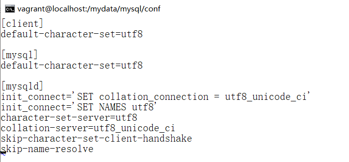
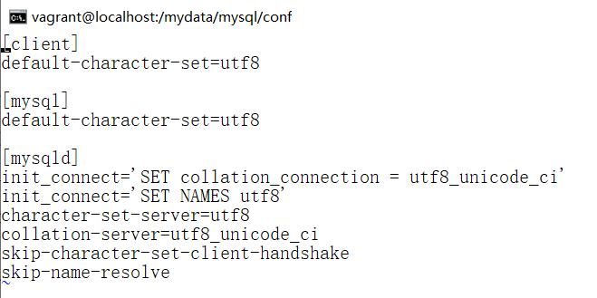
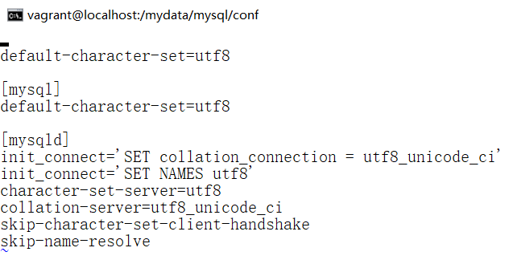
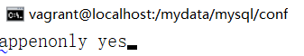
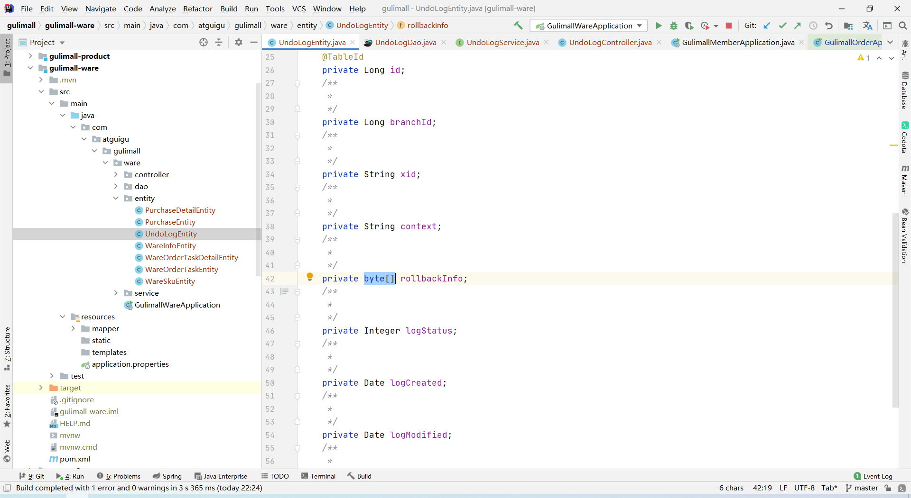

# 一、环境准备

## 1.1、安装软件虚拟机软件

### 1.1.1、安装 VirtualBox-6.0.10-132072-Win(只需修改安装路径即可)

### 1.1.2、安装 vagrant_2.2.5_x86_64(只需修改安装路径即可)

安装成功提示重启电脑，点击Yes重启电脑


### 1.1.3、修改vagrant，virtualbox数据目录

#### 	(1)修改vagrant路径

##### 	1、移动.vagrant.d文件

例如将 C:\Users\[YOUR_NAME]\.vagrant.d 移动到 D:\vagrant\\.vagrant.d


##### 2、设置环境变量

###### 1、此电脑右键-->点击属性


###### 2、点击高级系统设置


###### 3、点击环境变量


###### 4、新建系统变量

点击系统变量下的新建，输入变量名输入VAGRANT_HOME，变量值为.vagrant.d路径，点击确定


#### (2)修改virtualbox

##### 3、修改全局配置

**点击管理-->全局配置-->常规，修改默认虚拟电脑位置即可**


##### 4、拷贝以前虚拟机文件夹

若之前已使用过虚拟机(没有使用过，以下步骤可忽略)，可以拷贝以前虚拟机文件夹(***这一步一定要先进行，否则后面删除虚拟机后，虚拟机对应的文件就都消失了，无法重建虚拟机***)

例如:C:\Users\[用户名]\VirtualBox VMs -> D:\\virtualbox\VirtualBox VMs

##### 5、删除旧的虚拟机

点击管理-->全局配置-->常规，修改默认虚拟电脑位置即可


##### 6、重新添加虚拟机

点击D:\virtualbox\VirtualBox VMs\centos8-pg12


虚拟机会被重新添加到virtualbox中，右键->设置->存储，查看虚拟机的存储disk文件，已经对应的是新的目录下的文件


##### 7、最后可以整体删除C盘下目录VirtualBox VMs

[^参考链接;https://www.csdn.net/tags/NtzaQg5sOTUwODItYmxvZwO0O0OO0O0O.html]: 

例如C:\Users\[用户名]\VirtualBox VMs

## 1.2、使用vagrant init centos7命令安装centos7

cmd切换到VirtualBox VMs目录，执行vagrant init centos7,生成Vagrantfile文件


## 1.3、使用vagrant up命令开启虚拟机

cmd切换到VirtualBox VMs目录，执行vagrant up


如果下载速度很慢，可以删除Vagrantfile文件使用中科大镜像重新生成Vagrantfile文件

vagrant init centos7 https://mirrors.ustc.edu.cn/centos-cloud/centos/7/vagrant/x86_64/images/CentOS-7.box

或者将执行vagrant init centos7命令显示的网址复制下来，在迅雷上下载

## 1.4、使用vagrant ssh命令连接虚拟机

cmd切换到VirtualBox VMs目录，执行vagrant ssh命令

**可以使用exit可以退出vagrant ssh连接**

#### 1.4.1、vagrant报错

ssh-key的私钥的拥有者的权限，不是当前的用户。

vagrant@127.0.0.1: Permission denied (publickey,gssapi-keyex,gssapi-with-mic).


解决方法

##### 1、点击windows图标，鼠标悬浮在头像上，可以显示用户名(或者cmd使用whoami命令也可以查看用户名)


##### 2、找到VirtualBox VMs\.vagrant\machines\default\virtualbox下的private_key


##### 3、右键该文件依次点击 属性–> 安全->编辑 添加，输入你的用户名,点击检查名称后，点击确定


##### 4、点击刚刚添加的用户，权限设为完全控制，点击确定,删除其他没有的用户


##### 5、返回上一级目录,点击virtualbox，右键-->属性


##### 6、删除其他没用的权限，只保留用户名对应的权限


##### 7、修改成这个样子，点击确定


##### 8、重新输入vagrant ssh即可


## 1.5、修改网络连接方式

修改网络连接方式,使ssh能使用相同端口连接虚拟机应用

#### 1.5.1、查看 VirtualBox的ip地址

cmd执行ipconfig命令,查看以太网适配器 VirtualBox Host-Only Network的IPv4地址(192.168.56.1)


#### 1.5.2、找到VirtualBox VMs下Vagrantfile文件

#### 1.5.3、修改ip地址

打开config.vm.network选项,修改ip，使与VirtualBox Host-Only Network的IPv4地址处于同一网段,如192.168.56.10


#### 1.5.4、使用vagrant reload命令重启虚拟机


#### 1.5.5、使用vagrant ssh命令重新连接

#### 1.5.6、使用ip addr命令查看网卡地址


#### 1.5.7、在真实主机上测试连通性

在真实主机上使用ping 192.168.56.10测试真实主机与虚拟机的连通性


## 1.6、使用docker

Docker 安装文档：[Install Docker Engine on CentOS | Docker Documentation](https://docs.docker.com/engine/install/centos/)

#### 1.1.3.1、卸载系统之前的 docker

```linux
sudo yum remove docker \
                  docker-client \
                  docker-client-latest \
                  docker-common \
                  docker-latest \
                  docker-latest-logrotate \
                  docker-logrotate \
                  docker-engine
```

#### 1.1.3.2、安装必须的依赖

```
sudo yum install -y yum-utils \
                device-mapper-persistent-data \
                lvm2
```

#### 1.1.3.3、设置 docker repo 的 yum 位置

```
sudo yum-config-manager \
    --add-repo \
    https://download.docker.com/linux/centos/docker-ce.repo
```

#### 1.1.3.4、安装 docker，以及 docker-cli

```
sudo yum install docker-ce docker-ce-cli containerd.io
```

#### 1.1.3.5、启动docker

```
sudo systemctl start docker
```

#### 1.1.3.6、查看docker版本

```
docker -v
```

#### 1.1.3.7、查看docker镜像

```
sudo docker images
```

#### 1.1.3.8、设置docker开机自启

```
sudo systemctl enable docker
```

#### 1.1.3.9、配置docker镜像加速

##### 1、登录阿里云后，点击控制台


##### 2、点击三个横杠


##### 3、找到容器镜像服务


##### 4、点击镜像工具,在镜像加速器里点击CentOS,可以看到命令提示


##### 5、创建/etc/docker目录

```
sudo mkdir -p /etc/docker
```

##### 6、修改配置文件

```
sudo tee /etc/docker/daemon.json <<-'EOF'
{
  "registry-mirrors": ["https://84qg2i6j.mirror.aliyuncs.com"]
}
EOF
```

##### 7、重新加载配置文件

```
sudo systemctl daemon-reload
```

##### 8、重启docker服务

```
sudo systemctl restart docker
```

##### 9、使用sudo docker info命令查看是否生效

```
sudo docker info
```


#### 1.6.10、使用mysql

##### 1、进入docker官网,点击Projects中的Docker Hub


##### 2、点击Go to Docker Hub


##### 3、在搜索框中输入mysql(Official Image为官方镜像)


##### 4、点击mysql(Official Image)

##### 5、点击Tags可以查看历史版本


##### 6、下载mysql 5.7

可以看到下载mysql 5.7的命令为docker pull mysql:5.7


若不是管理员用户登录可以提升权限,执行sudo docker pull mysql:5.7命令

```
sudo docker pull mysql:5.7
```


##### 7、检查是否安装成功

使用sudo docker images命令检查已安装的镜像

```
sudo docker images
```

可以看到mysql 5.7已安装完成


##### 8、创建实例并启动

###### 1、提升权限

该命令也需要加权限,可以切换到root用户,密码默认为vagrant

```
su root
```


###### 2、查看当前用户

使用whami命令查看当前用户


###### 3、启动mysql

```
docker run -p 3306:3306 --name mysql \
-v /mydata/mysql/log:/var/log/mysql \
-v /mydata/mysql/data:/var/lib/mysql \
-v /mydata/mysql/conf:/etc/mysql \
-e MYSQL_ROOT_PASSWORD=root \
-d mysql:5.7
```

参数说明

```
-p 3306:3306：将mysql容器的3306端口映射到linux主机的3306端口
--name mysql：给该容器起个名字
-v /mydata/mysql/conf:/etc/mysql：将配置文件夹挂载到主机(将mysql容器的/etc/mysql目录映射到linux的/mydata/mysql/conf目录)
-v /mydata/mysql/log:/var/log/mysql：将日志文件夹挂载到主机
-v /mydata/mysql/data:/var/lib/mysql/：将数据文件夹挂载到主机
-e MYSQL_ROOT_PASSWORD=root：初始化 root用户的密码
-d mysql:5.7 :以后台方式运行mysql:5.7镜像
```


##### 9、使用docker ps命令查看正在运行的容器

```
docker ps
```

可以看到mysql:5.7已经启动了


使用docker ps -a可以查看所有容器(包括未运行的容器)

```
docker ps -a
```

使用使用docker images查看所有镜像

```
docker images
```

**ps:docker常见错误**

权限不足,在前面加sudo 或使用管理员账户登录


##### 10、连接mysql

使用navicate连接工具测试是否连接成功

mysql容器的3306端口映射到linux的3306端口，主机需要输入linux的ip地址,密码为root


##### 11、进入mysql内部

以交互模式进入mysql的linux bash控制台

```
docker exec -it mysql /bin/bash
```

##### 12、可以看到已经进入mysql容器内部

mysql容器包含mysql的完整运行环境


##### 13、使用ls /命令

```
ls /
```

可以看到mysql容器的目录结构

mysql容器包含mysql的完整运行环境,其实就是linux的目录结构


##### 14、查看mysql安装位置

```
whereis mysql
```

使用whereis mysql命令可以看到mysql安装在mysql容器里的位置


##### 15、退出mysql容器

使用exit命令

```
exit
```


##### 16、进入mysql容器外部挂载的linux目录的对应位置

```
cd /mydata/mysql/conf
```


##### 17、打开my.cnf配置文件

```
vi /mydata/mysql/conf/my.cnf
```

##### 18、修改字符编码

skip-name-resolve：跳过域名解析，解决 MySQL 连接慢的问题

```
[client]
default-character-set=utf8

[mysql]
default-character-set=utf8

[mysqld]
init_connect='SET collation_connection = utf8_unicode_ci'
init_connect='SET NAMES utf8' 
character-set-server=utf8
collation-server=utf8_unicode_ci
skip-character-set-client-handshake
skip-name-resolve
```

##### 19、重启mysql

```
docker restart mysql
```


##### 20、进入mysql容器内部,查看映射是否成功

以交互模式进入mysql的linux bash控制台

```
docker exec -it mysql /bin/bash
```

###### 1、docker报错,容器没有运行


可以看到NAMES为mysql的STATUS为Exited说明mysql容器的状态为已退出


ps: 多了一个名为funy_cohen的容器

###### 2、删除容器对象

使用 docker rm 镜像实例ID 命令，删除对应容器对象

```
docker rm 镜像实例ID
```

即为:(可以写id的部分，只要可以区分就可以)

```
docker rm fc2e8ffe4f62
```

###### 3、启动mysql容器

```
docker start 2cd283e6ca6b
```

**ps: 关闭mysql容器**

```
docker stop 2cd283e6ca6b
```

###### 4、启动没报错，但STATUS还是为Exited


###### 5、查看该容器日志

```
docker logs 2cd283e6ca6b
```

###### 6、查看报错信息

 Found option without preceding group in config file /etc/mysql/my.cnf at line 1!

在配置文件/etc/mysql/my.cnf第一行中找到了没有前面组的选项


###### 7、打开/etc/mysql/my.cnf文件

```
vi /etc/mysql/my.cnf
```

###### 8、发现第一行少了一个[client]


###### 9、添加[client]即可

ps:输入" [ "的时候[client]又跳出来了，也不知道是怎么回事



###### 10、启动后，可以看到STATUS变为Up


ps.再次打开可以看到[client]有时候有，有时候又没有了，就很奇怪





1.6.10.21查看mysql容器内部是否有该配置文件

```
docker exec -it mysql /bin/bash  #以交互模式进入mysql的linux bash控制台
 cd /etc/mysql/
 ls
 cat my.cnf
```


#### 1.6.11、使用redis

##### 1、下载最新redis镜像文件

```
docker pull redis
```

##### 2、在linux中创建redis配置目录

```
mkdir -p /mydata/redis/conf
```

##### 3、在linux中创建redis配置文件

```
touch /mydata/redis/conf/redis.conf
```

ps：必须先创建文件，然后再启动redis,否则会把redis.conf当成一个目录

##### 3、启动redis

```
docker run -p 6379:6379 --name redis \
-v /mydata/redis/data:/data \
-v /mydata/redis/conf/redis.conf:/etc/redis/redis.conf \
-d redis redis-server /etc/redis/redis.conf
```

说明

```
-p 6379:6379：将redis容器的6379端口映射到linux主机的6379端口
--name redis：给该容器起个名字
-v /mydata/redis/data:/data \：将数据文件夹挂载到主机
-v /mydata/redis/conf/redis.conf:/etc/redis/redis.conf \：将配置文件夹挂载到主机(将redis容器的/etc/redis/redis.conf文件映射到linux的/mydata/redis/conf/redis.conf文件)
-d redis:以后台方式运行redis镜像
redis-server /etc/redis/redis.conf 以配置文件启动redis，加载容器内的conf文件，最终找到的是挂载的目录/usr/local/docker/redis.conf
--appendonly yes 开启redis持久化
```


1.6.11.4、使用 redis 镜像执行 redis-cli 命令连

```
docker exec -it redis redis-cli
```

1.6.11.5、测试是否可用

```
set a b
get a
```


1.6.11.6、使用exit退出

```
exit
```

1.6.11.7、启用redis持久化

进入redis.conf配置文件

```
vi /mydata/redis/conf/redis.conf
```

开启redis持久化

```
appendonly yes
```



重启redis

```
docker restart redis
```

可以看到redis已持久化


## 1.7开发工具&环境配置

#### 1.7.1、下载maven3.6.1

解压后，配置环境变量

再cmd中查看mvn版本 ，若显示版本则证明配置正确

```
mvn -version
```

#### 1.7.2、配置阿里云镜像

在maven的conf文件夹下的settings.xml文件内配置阿里云镜像

        <mirror>
            <id>alimaven</id>
            <name>aliyun maven</name>
            <url>http://maven.aliyun.com/nexus/content/groups/public/</url>
            <mirrorOf>central</mirrorOf>
        </mirror>


#### 1.7.3 配置 jdk1.8 编译项目

```
<profile>
	<id>jdk-1.8</id>
	<activation>
		<activeByDefault>true</activeByDefault>
		<jdk>1.8</jdk>
	</activation>
	<properties>
		<maven.compiler.source>1.8</maven.compiler.source>
		<maven.compiler.target>1.8</maven.compiler.target>
		<maven.compiler.compilerVersion>1.8</maven.compiler.compilerVersion>
	</properties>
</profile>
```


#### 1.7.4 配置本地仓库位置

```
<localRepository>A:\maven\apache-maven-3.8.2\mvn_respository</localRepository>
```


#### 17.5 将maven加载到Intellij IDEA中

##### 1、点击configure


##### 2、点击Settings


##### 3、依次点击Build、Execution，Deployment ---> Build Tools ---> Maven

修改为自己的maven路径


#### 1.7.6、安装IDEA插件

点击configure下的Plugins


安装Lombox插件


安装MyBaitsX插件


#### 1.7.7、安装Visual Studio Code插件

修改插件安装位置

可以单击右键VS Code快捷方式 ---> 属性 ---> 快捷方式 --->  目标 那里添加  --extensions-dir  "插件安装位置"

```
"软件启动程序" --extensions-dir "插件安装位置"
```

例如:

```
"A:\VS Code\Microsoft VS Code\Code.exe" --extensions-dir "A:\VS Code\extensions"
```

插件说明

```
Vetur —— 语法高亮、智能感知、Emmet 等
包含格式化功能， Alt+Shift+F （格式化全文），Ctrl+K Ctrl+F（格式化选中代码，两个 Ctrl需要同时按着）
EsLint —— 语法纠错
Auto Close Tag —— 自动闭合 HTML/XML 标签
Auto Rename Tag —— 自动完成另一侧标签的同步修改
JavaScript(ES6) code snippets — — ES6 语法智能提示以及快速输入， 除 js 外还支持.ts，.jsx，.tsx，.html，.vue，省去了配置其支持各种包含 js 代码文件的时间
HTML CSS Support —— 让 html 标签上写 class 智能提示当前项目所支持的样式
HTML Snippets —— html 快速自动补全Open in browser —— 浏览器快速打开Live Server	—— 以内嵌服务器方式打开
Chinese (Simplified) Language Pack for Visual Studio Code —— 中文语言包
```


#### 1.7.8、配置git

进入git bash

##### 1、配置用户名

```
git config --global user.name "username"    //（名字） 
```

##### 2、配置邮箱

```
git config --global user.email "username@email.com"      //(注册账号时用的邮箱)
```

##### 3、生成密钥

```
ssh-keygen -t rsa -C "username@email.com"
```

或使用

```
ssh-keygen -t rsa
```

连续三次回车。一般用户目录下会有一下两个文件


##### 4、使用一下命令查看公钥

```
cat ~/.ssh/id_rsa.pub
```

使用以下命令可以粘贴到剪贴板

```
clip < ~/.ssh/id_rsa.pub    #windows系统
pbcopy < ~/.ssh/id_rsa.pub  #mac os系统
```


##### 5、向gitee添加公钥

登录进入 gitee，在设置里面找到 SSH KEY 将.pub 文件的内容粘贴进去


##### 6、测试添加是否成功

```
ssh -T git@gitee.com
```

第一次绑定会有警告信息，输入yes即可


##### 7、向github添加公钥


##### 8、测试添加是否成功

第一次绑定会有警告信息，输入yes即可


#### 1.7.9、新建仓库

##### 1、使用gitee新建仓库


点击刚创建的项目 ---> 点击管理 --->点击开源 ---> 勾选须知 ---> 点击保存


##### 2、使用github新建仓库


#### 1.7.10、新建项目

##### 1、点击Get from Version Control


##### 2、查看仓库ssh


##### 3、在URL里输入刚才复制的ssh,点击关闭


ps：点击close后发现在下载java 11，删除该项目，修改版本在重新新建项目，可以发现没有下载java 11


##### 4、添加github仓库

###### 1、点击code ---> 复制ssh 


###### 2、选择VCS ---> Git ---> Remotes


###### 3、点击+号，Name输入一个名字,URL输入刚才复制的ssh


##### 4、修改项目的java版本


## 1.8、新建各个模块

#### 1.8.1、新建商品模块


```
com.atguigu.gulimall
gulimall-product
谷粒商城商品服务
com.atguigu.gulimall.product
```


选择 Web --> Spring Web; Spring Cloud Routing --> OpenFeign (其他模块也一样)


直接点确定


1.8.2、新建仓储模块

```
com.atguigu.gulimall
gulimall-ware
谷粒商城-仓储服务
com.atguigu.gulimall.ware
```


#### 1.8.3、新建订单模块

```
com.atguigu.gulimall
gulimall-order
谷粒商城-订单服务
com.atguigu.gulimall.order
```


#### 1.8.4、新建会员模块

```
com.atguigu.gulimall
gulimall-member
谷粒商城-会员服务
com.atguigu.gulimall.member
```


#### 1.8.5、新建优惠劵模块

```
com.atguigu.gulimall
gulimall-coupon
谷粒商城-优惠劵服务
com.atguigu.gulimall.coupon
```


#### 1.8.6、遇到报错

##### 1、pom文件颜色变成赤红色，内容报红


##### 2、单击右键pom文件,选择Add as Maven Project


##### 3、可看到已经不报红了

ps:我把pom文件内容替换成资料提供的pom文件(这样可以少很多错误)，删除那些还没创建的模块的依赖等


**ps:这里如果点了test测试类，会发现测试类报错**

可以参看1.10.9.8

##### 其他问题

 打开项目，以前不报错的地方现在报错(或出现了其他问题)

可以点击File-->Invalidate Caches / Restar  删除原来的缓存和索引，等待Idea重新构建缓存和索引


#### 1.8.7、项目添加pom文件,作为父项目

父项目需要答pom包

```
<packaging>pom</packaging>
```

modules为其子模块


```
<?xml version="1.0" encoding="UTF-8"?>
<project xmlns="http://maven.apache.org/POM/4.0.0" xmlns:xsi="http://www.w3.org/2001/XMLSchema-instance"
		 xsi:schemaLocation="http://maven.apache.org/POM/4.0.0 https://maven.apache.org/xsd/maven-4.0.0.xsd">
	<modelVersion>4.0.0</modelVersion>
	<groupId>com.atguigu.gulimall</groupId>
	<artifactId>gulimall</artifactId>
	<version>0.0.1-SNAPSHOT</version>
	<name>gulimall</name>
	<description>聚合服务</description>
	<packaging>pom</packaging>

	<modules>
		<module>gulimall-coupon</module>
		<module>gulimall-member</module>
		<module>gulimall-order</module>
		<module>gulimall-product</module>
		<module>gulimall-ware</module>
	</modules>

</project>
```

#### 1.8.8 添加.gitignore内容

##### 1找到git --> Local Changes --> Unversioned Files 可以查看未被管理的文件


有些版本的不一样，可以点这里


##### 2、如果没有找到

可以按 alt +  9 

或者设置里取消勾选这个


##### 3、添加不加入版本控制的文件和文件夹

在父项目的.gitignore文件中添加不加入版本控制的文件和文件夹

```
**/mvnw			
**/mvnw.cmd

**/.mvn
**/target/

.idea

**/.gitignore
```


##### 4、将剩下的文件纳入到版本控制


#### 1.8.9、提交项目初始结构代码

##### 1、提交代码


##### 2、push到gitee


**ps:可以看到origin为gitee的远程仓库**


##### 3、推送到github

###### 1、push到github


###### 2、点击Push


###### 3、貌似没有提交上去

可以看到貌似没有提交上去，但是多了一个提示，说master分支9分钟前提交了推送


###### 4、切换到master分支即可看到推送


###### 5、修改默认分支

点击项目的Settings --> Branches --> 交换按钮


可以看到已经修改了默认分支


###### 6、全局修改默认分支


#### 1.8.10、初始数据库

##### 1 发现连接linux的mysql报错了


##### 2 可以看到mysql并没有启动


##### 3、设置mysql开机自启动

设置mysql开机自启动

```
sudo docker update  mysql  --restart=always
```


启动mysql容器

```
sudo docker start mysql
```

同理,设置redis开机自启动

```
sudo docker update  redis  --restart=always
sudo docker start redis
```

##### 4、新建数据库

新建gulimall_pms数据库(**是gulimall_pms，不是gulimall-pms**)

数据库名填 gulimall_pms

字符集选 utf8mb4


同理，新建其他数据库

```
gulimall_pms	//商品管理系统
gulimall_oms 	//订单管理系统
gulimall_sms	//营销管理系统
gulimall_ums	//用户管理系统
gulimall_wms	//库存管理系统
```

##### 5、执行sql语句

###### 1、选中gulimall_pms,点击工具 --> 命令行界面


###### 2、复制sql语句到命令行界面，然后回车执行sql语句

然后点击gulimall_pms下的表。右键 --> 刷新，即可看到sql语句执行后新建的表


1.8.10.5.3、点击表下面的随便一张表，右键 --> 设计 查看注释是不是乱码


**ps:不要运行sql文件，一定要在命令行执行sql语句，否则中文会乱码**


同理，执行其他sql语句

#### 1.8.11、使用人人开源

##### 1、使用人人开源的以下两个项目


##### 2、可以在资料里复制该项目到自己的项目里面


##### 3、新建gulimall_admin数据库,字符集选择utf8mb4


##### 4、在gulimall_admin数据库中执行mysql.sql的sql语句


##### 5、删除哪些还没有创建的依赖


##### 6、wagon-maven-plugin报红


##### 7、上面的代码不删,在dependencies里面添加这个依赖，刷新一下就行了

```
<dependency>
	<groupId>org.codehaus.mojo</groupId>
	<artifactId>wagon-maven-plugin</artifactId>
	<version>1.0</version>
	<type>pom</type>
</dependency>
```


##### 8、@EnableDiscoveryClient报红

这是以后向注册中心发现服务用的，现在用不上删除即可


##### 9、运行这个项目

##### 10、又报错了

###### 1、可以看到是数据库的问题(Communications link failure：通信链路失败)


###### 2、网站也访问不到


后来发现数据库名字是gulimall-admin,配置的是gulimall_admin

将数据库删除重新新建gulimall_admin数据库即可(字符集选 utf8mb4)

同理修改其他的数据库

###### 3、修改后发现还是报错

使用本地mysql连接，发现可以连上


###### 4、在本地创建了同样的数据库，发现没有报错


###### 5、发现ssl报错

No appropriate protocol (protocol is disabled or cipher suites are inappropriate)

没有合适的协议（协议被禁用或密码套件不合适）


###### 6、不使用ssl

在url后面添加&useSSL=false，不使用ssl，可以发现已经没有错误了

```
url: jdbc:mysql://192.168.56.10:3306/gulimall_admin?useUnicode=true&characterEncoding=UTF-8&serverTimezone=Asia/Shanghai&useSSL=false
```


###### 7、浏览器可以访问了


## 1.9、前端初始化

#### 1.9.1、打开前端项目

将gulimall-admin-vue-app拖入到VS Code快捷方式

#### 1.9.2、配置node.js

##### 1、安装node 10.16.3

修改一下安装位置，其他默认即可

（一定要是这个版本，不然后面会有很多错误）

##### 2、cmd输入node -v可以查看版本

```
node -v
```

##### 3、cmd输入以下命令，修改为淘宝镜像

```
npm config set registry http://registry.npm.taobao.org/
```

查看是否修改成功

```
npm config ls
```


1.9.2.4、修改node.js全局包安装位置

```
npm config set prefix "A:/nodejs/npm_global"
npm config set cache "A:/nodejs/npm_cache"
```

出错了，在那个位置创建npm_global文件夹和npm_cache文件夹即可


查看是否修改成功

```
npm config ls
```


#### 1.9.3、下载依赖

##### 1、在VS Code控制台输入npm install命令

```
npm install
```

npm包管理工具会根据package.json配置文件下载对应的包，放在node_moudules目录下


##### 2、可以看到python报错，很明显我python版本太高了

**ps:如果没有python，安装python2.7就行了**


##### 3、安装windows-build-tools

以管理员身份运行VS Code，输入以下命令

```
npm install --global --production windows-build-tools
```

可以看到该命令会安装python2.7

如果没有以管理员身份运行会提示

```
Please restart thie script from a administrative PowerShell!
```


##### 4、安装no5de-gyp

```
npm install --global node-gyp 
```


##### 5、卸载安装失败的包

```
npm uninstall node-sass
```

##### 6、然后重新安装

```
npm install sass -i
```

##### 7、又报了一个新的错误


npm install 安装依赖出现 chromedriver 之类的问题，先在项目运行以下命令

```
npm install chromedriver --chromedriver_cdnurl=http://cdn.npm.taobao.org/dist/chromedriver
```


再运行以下命令,指定python版本

```
npm install --python=python2.7
```

或者直接修改npm的python版本设置

```
npm config set python python2.7
npm install
```

可以看到已经不报错了


#### 1.9.4、运行前端项目

先运行后端项目，再运行前端项目

##### 1、执行以下命令运行前端项目

```
npm run dev
```

##### 2、又报错了


###### 1、执行以下命令即可

```
npm uninstall --save node-sass
npm install --save node-sass
npm run dev
```

###### 2、之后又报了这个错


##### 3、执行以下命令

```
npm config set msvs_version 2019
```

##### 4、发现又回到1.9.4.2这个错了

##### 5、再执行1.9.4.2.1的命令，就好了

```
npm uninstall --save node-sass
npm install --save node-sass
npm run dev
```

#### 1.9.5、没有验证码


查看请求可以看到，请求的路径localhost:88/api


而后台的路径为localhost:8080/renren-fast


将前端请求路径改为

```
http://localhost:8080/renren-fast
```


可以看到有验证码了


ps:如果不是这个问题，先启动后端，再启动前端，另外再看看数据库是不是连不上

## 1.10、生成后端代码

#### 1.10.1、下载人人开源的[renren-generator](https://gitee.com/renrenio/renren-generator)


#### 1.10.2、解压后复制到项目的根目录

根目录单击右键，选择Show in Explorer可以查看根目录


如果renren-generator的pom文件为赤红色，单击右键pom文件,选择Add as Maven Project

如过pom文件<project>标签报错

,在<parent>标签内添加<relativePath/>即可


#### 1.10.3、修改mysql

修改renren-generator模块下的application.yml文件内的mysql的url,username,password


#### 1.10.4、修改代码生成器配置

修改renren-generator模块下的generator.properties文件内的配置


发现注释出现了#\u5503这种的，编码为GBK，且不可修改

在Files-->Settings里找到File Encodings,修改Properties Files默认字符编码

并勾选Transparent native-to-ascii conversion，将原来的gbk编码的文件转为utf-8编码


发现空文件夹默认在同一行，在项目设置里取消勾选Compact Middle Packages


可以发现gulimall_pms都是以pms_开头的


因此修改成这样

```
mainPath=com.atguigu
package=com.atguigu.gulimall
moduleName=product
author=作者
email=你的邮箱
tablePrefix=pms_
```


#### 1.10.5、修改模板

在resources/template的 Controller.java.vm文件内去掉使用shrio框架的部分(6处)，后续会使用Spring Security

可以使用ctrl+F搜索RequiresPermissions查找


#### 1.10.6、运行项目


#### 1.10.7、生成代码

浏览器输入localhost:80


#### 1.10.8、复制文件

将生成的main复制到gulimall_product的src目录下

点击模块，单击右键--> Show in Explorer可以打开该模块所在位置


resources下的src生成的是vue文件，用不到，删除resources下的src即可


没有static和templates也不要紧，里面也没有文件


#### 1.10.9、可以看到报了很多错误

##### 1、controller、dao、entity、service报错

ps:这个注释乱码了是因为执行的运行sql文件，导致表里面中文乱码，生成的代码注释也乱码了，后来我又重新执行的sql语句


##### 2、新建com.atguigu.common模块

父项目gulimall单击右键 -->New --> Moudle --> maven --> next --> com.atguigu.common --> Finish

让gulimall-product模块依赖common模块,刷新一下

```
<dependency>
	<groupId>com.atguigu.gulimall</groupId>
	<artifactId>gulimall-common</artifactId>
	<version>0.0.1-SNAPSHOT</version>
</dependency>
```


##### 3、解决entity报错

###### 1、可以看到有lombox和mybatis plus注解


###### 2、添加lombox和mybatis plus依赖

**需要下载lombox插件才能生成get，set，toString等方法**

可以看到添加依赖后，gulimall-product模块下的entity不报错了

```
<dependency>
    <groupId>com.baomidou</groupId>
    <artifactId>mybatis-plus-boot-starter</artifactId>
    <version>3.2.0</version>
</dependency>
<dependency>
     <groupId>org.projectlombok</groupId>
     <artifactId>lombok</artifactId>
     <version>1.18.8</version>
</dependency>
```


##### 4、解决dao报错

dao层只用到的@Mapper注解，在解决entity层报错时，已经添加了mybatis plus

##### 5、解决service报错

###### 1、service少了公共模块中的PageUtils类


###### 2、复制PageUtils类

将reren-fast模块里common/utils下的PageUtils类复制到gulimall-common里面


###### 3、service少了公共模块中的Query类


###### 4、复制Query类

将reren-fast模块里common/utils下的Query类复制到gulimall-common里面


###### 5、缺少SQLFiler和StringUtils


###### 6、复制SQLFilter类

将reren-fast模块里common/xss下的SQLFilter类复制到gulimall-common里面

**ps:这里的SQLFilter复制错位置了,其实问题也不大，后面移动一下位置就行了**


###### 7、去掉import io.renren.common.xss.SQLFilter;


###### 8、添加common-lang依赖

```java
 <dependency>
    <groupId>commons-lang</groupId>
    <artifactId>commons-lang</artifactId>
    <version>2.6</version>
</dependency>
```


###### 9、缺少Constant


###### 10、复制Constant类

将reren-fast模块里common/utils下的Constant类复制到gulimall-common里面

可以看到Querey不报错了


###### 11、缺少RRException


###### 12、复制RRException类

将reren-fast模块里common/exception下的RRException类复制到gulimall-common里面


###### 13、替换导入的类

```java
import io.renren.common.exception.RRException;
```

替换为

```java
import com.atguigu.common.exception.RRException;
```


###### 14、可以看到service层已经不报错了


##### 6、解决controller报错

###### 1、缺少R类


###### 2、导入R类

把renren-fast模块的common/utils的R复制到com.atguigu.common模块


###### 3、R报错,没有HttpStatus


###### 4、添加httpcore

HttpStatus为httpcore依赖下的

pom中添加依赖，刷新以下，可以发现R不报错了

```
<dependency>
    <groupId>org.apache.httpcomponents</groupId>
    <artifactId>httpcore</artifactId>
    <version>4.4.12</version>
</dependency>
```


##### 7、可以发现都不报错了


##### 8、点开测试类，发现报错

这个错误的主要原因是

在Spring Boot 2.2.X以后使用Junit5导的包为import org.junit.jupiter.api.Test

在Spring Boot 2.2.x之前使用Junit4导的包为import org.junit.Test  

新建模块使用的是Spring Initializr,默认的版本为2.6.6，我后来又手动修改为的2.1.8.RELEASE

这个junit5版本的，测试类不是public类型的


可以复制提供的源代码，变为2.1.8.RELEASE版本的测试类

```
package com.atguigu.gulimall.product;

import org.junit.Test;
import org.junit.runner.RunWith;
import org.springframework.boot.test.context.SpringBootTest;
import org.springframework.test.context.junit4.SpringRunner;

@RunWith(SpringRunner.class)
@SpringBootTest
public class GulimallProductApplicationTests {

	@Test
	public void contextLoads() {
	}

}
```


或者引入一下依赖

**version设成5.4.0设置数据源后启动的时候会报错**

```
<dependency>
	<groupId>org.junit.jupiter</groupId>
	<artifactId>junit-jupiter-api</artifactId>
	<version>RELEASE</version>
	<scope>test</scope>
</dependency>
```


##### 9、运行后，发现没有配DataSource


这里不用管这个错误，后期配置文件还会配其它的，到时候一起配置，也可以先配置

###### 1、在gulimall-common模块添加依赖

```
 <dependency>
      <groupId>mysql</groupId>
      <artifactId>mysql-connector-java</artifactId>
      <version>8.0.17</version>
</dependency>
<dependency>
     <groupId>com.baomidou</groupId>
     <artifactId>mybatis-plus-boot-starter</artifactId>
     <version>3.2.0</version>
</dependency>
```


###### 2、在启动类添加组件扫描注解

在gulimall-product模块启动类添加组件扫描注解

```
@MapperScan("com.atguigu.gulimall.product.dao")
```


ps:可以点击com/atguigu/gulimall/product下的dao包-->单击右键 -- > Copy Reference 或者使用Ctrl + Alt + Shift + C 拷贝全包名


###### 3、配置数据源和端口

在gulimall-product模块的application.yml中配置数据源和端口

```
spring:
  datasource:
    driver-class-name: com.mysql.cj.jdbc.Driver
    url: jdbc:mysql://192.168.56.10:3306/gulimall_pms?useSSL=false
    username: root
    password: root
mybatis-plus:
  mapper-locations: classpath*:/mapper/**/*.xml
  global-config:
    db-config:
      id-type: auto
server:
  port: 10000
```


###### 4、运行项目

运行后发现不报错了


**ps:后面发现SQLFilter复制错位置了，移动一下就好了**


我第二次生成代码(表的注释乱码了，又重新执行的sql语句，重新生成代码)

的时候没有gulimall-product的启动类GulimallProductApplication(第一次生成的有)

后面新建了一个GulimallProductApplication启动类


#### 1.10.10、生成其他模块代码

| 项目名          | 模块名 | 数据库名     | 表前缀 |
| --------------- | ------ | ------------ | ------ |
| gulimall-coupon | coupon | gulimall_sms | sms_   |
| gulimall-member | member | gulimall_ums | ums_   |
| gulimall-order  | order  | gulimall_oms | oms_   |
| gulimall-ware   | ware   | gulimall_wms | wms_   |

##### 1、修改数据库


##### 2、修改模块名、表前缀


##### 3、修改test测试类

将生成的文件复制到对应模块后，可以修改test测试类

修改为junit4

```
package com.atguigu.gulimall.product;			//改动这里的product

import org.junit.Test;
import org.junit.runner.RunWith;
import org.springframework.boot.test.context.SpringBootTest;
import org.springframework.test.context.junit4.SpringRunner;

@RunWith(SpringRunner.class)
@SpringBootTest
public class GulimallProductApplicationTests {	//改动这个类名里的Product

	@Test
	public void contextLoads() {
	}

}
```


ps:这个测试类导的包和一些其他的模块不一样，我也不知道为什么

这个类导的包是

```
import org.testng.annotations.Test;
```

其他模块是上面这个，或者是

```
import org.junit.jupiter.api.Test;
```


##### 4、删除resources下的src文件夹

resources下的src文件夹为vue文件，后续用不到，删除即可


##### 5、修改数据库名和端口

修改对应模块的dao层的全包名

ps:可以点击对应模块下的dao包-->单击右键 -- > Copy Reference 或者使用Ctrl + Alt + Shift + C 拷贝全包名


##### 6、修改配置文件

修改数据库名和端口

| 项目名          | 数据库名     | 端口  |
| --------------- | ------------ | ----- |
| gulimall-coupon | gulimall_sms | 7000  |
| gulimall-member | gulimall_ums | 8000  |
| gulimall-order  | gulimall_oms | 9000  |
| gulimall-ware   | gulimall_wms | 11000 |

ps:模块端口从上到下，依次加1000(gulimall-product已经配过端口，为10000)


##### 7、测试各模块

浏览器运行各自的url，测试是否配置正确

| 模块名           | 测试url                                                   |
| ---------------- | --------------------------------------------------------- |
| gulimall-coupon  | http://localhost:7000/coupon/coupon/list                  |
| gulimall-member  | http://localhost:8000/member/growthchangehistory/list     |
| gulimall-order   | http://localhost:9000/order/order/list                    |
| gulimall-product | http://localhost:10000/product/attrattrgrouprelation/list |
| gulimall-ware    | http://localhost:11000/ware/purchase/list                 |


#### 1.10.11、gulimall-ware模块报错

gulimall-ware模块下的com.atguigu.gulimall.ware.entity.UndoLogEntity类中的rollbackInfo返回类型报错


查看数据库发现rollbackInfo类型为longblob


经查，数据库中longblob类型对应java的byte[]类型

ps:头一次听说这个类型



或者可以把gulimall_wms的undo_log表删掉，重新生成一下就行了(提供的源代码没有这个类)

# 二、开发各个模块

## 2.1、整合Myabatis-plus

官网教程:[简介 | MyBatis-Plus (baomidou.com)](https://baomidou.com/pages/24112f/)

#### 2.1.1、导入依赖

可以在common模块里面导入这两个依赖

##### 1、导入mysql依赖

各依赖支持情况: [MySQL :: MySQL Connector/J 8.0 Developer Guide :: 2 Compatibility with MySQL and Java Versions](https://dev.mysql.com/doc/connector-j/8.0/en/connector-j-versions.html)

可以发现8.0版本依赖全适配


```
<dependency>
    <groupId>mysql</groupId>
    <artifactId>mysql-connector-java</artifactId>
    <version>8.0.17</version>
</dependency>
```

##### 2、导入mybatis-plus依赖

```
<dependency>
    <groupId>com.baomidou</groupId>
    <artifactId>mybatis-plus-boot-starter</artifactId>
    <version>3.2.0</version>
</dependency>
```

刷新一下就好了


#### 2.1.2、配置

##### 1、配置数据源

```
spring:
  datasource:
    driver-class-name: com.mysql.cj.jdbc.Driver
    url: jdbc:mysql://192.168.56.10:3306/gulimall_pms
    username: root
    password: root
```

##### 2、启动类添加MapperScan注解

其实不配置也可以

```
@MapperScan("com.atguigu.gulimall.product.dao")
```

##### 3、配置mapper.xml扫描路径

默认就是这个

classpath    表示只扫描自己的路径

classpath*  表示不仅扫描自己的路径，还扫描依赖的jar包的路径

```
mybatis-plus:
  mapper-locations: classpath*:/mapper/**/*.xml
```

##### 4、配置id自增

先配置id自增，后来分库分表的时候再做其他的主键生成策略

```
mybatis-plus:
  mapper-locations: classpath*:/mapper/**/*.xml
  global-config:
    db-config:
      id-type: auto
```

#### 2.1.3、测试一下

这里我使用的是junit5，后来我又改为junit4了(源代码提供的测试类)


这是改后的测试类


##### 1、mysql报错

又是SSL的问题


##### 2、url添加参数

url后面添加 ?useSSL=false 就行了

```
url: jdbc:mysql://192.168.56.10:3306/gulimall_pms?useSSL=false
```


##### 3、增改查都测试通过

```
package com.atguigu.gulimall.product;

import com.atguigu.gulimall.product.entity.BrandEntity;
import com.atguigu.gulimall.product.service.BrandService;
import com.baomidou.mybatisplus.core.conditions.AbstractWrapper;
import com.baomidou.mybatisplus.core.conditions.query.LambdaQueryWrapper;
import com.baomidou.mybatisplus.core.conditions.query.QueryWrapper;
import org.junit.jupiter.api.Test;
import org.springframework.beans.factory.annotation.Autowired;
import org.springframework.boot.test.context.SpringBootTest;

import java.util.List;

@SpringBootTest
class GulimallProductApplicationTests {

	@Autowired
	BrandService brandService;
	@Test
	public void save() {
		BrandEntity brand = new BrandEntity();
		brand.setDescript("111");
		brandService.save(brand);
		System.out.println("保存成功...");
	}

	@Test
	public void updateById() {
		BrandEntity brand = new BrandEntity();
		brand.setBrandId(1L);
		brand.setDescript("222");
		brandService.updateById(brand);
		System.out.println("修改成功...");
	}

	@Test
	public void query() {
		LambdaQueryWrapper<BrandEntity> lambdaQueryWrapper = new LambdaQueryWrapper<BrandEntity>();
		lambdaQueryWrapper.eq(BrandEntity::getBrandId,1);
		List<BrandEntity> list = brandService.list(lambdaQueryWrapper);
		list.forEach(System.out::println);
	}
}

```


## 2.2、分布式组件

Spring Clould 官方文档: https://spring.io/projects/spring-cloud

Spring Clould Alibaba中文文档:  [spring-cloud-alibaba/README-zh.md at 2021.x · alibaba/spring-cloud-alibaba (github.com)](https://github.com/alibaba/spring-cloud-alibaba/blob/2021.x/README-zh.md)

#### 2.2.1、分布式组件选择

| 功能                           | 官方组件  | 使用组件 |
| ------------------------------ | --------- | -------- |
| 注册中心 Service Discovery     | Eureka    | Nacos    |
| 配置中心                       | Eureka    | Nacos    |
| 网关 Intelligent Routing       | Zuul      |          |
| 断路保护 Circuit Breaker       | Hystrix   |          |
| 负载均衡                       | Ribbon    | Ribbon   |
| 声明式HTTP客户端(远程调用服务) | OpenFeign |          |
| 限流、熔断、降级               | Hystrix   | Sentinel |
| API网关                        | Gateway   |          |
| 调用链监控                     | Sleuth    |          |
| 分布式事务                     |           | Seata    |

#### 2.2.2、版本选择

官方给出的版本选择方案


本项目的Spring Boot版本为2.1.8.RELEASE,因此选择的版本为Spring Clould Alibaba版本为2.1.0.RELEASE

#### 2.2.3、使用nacos做注册中心

nacos官方文档: [什么是 Nacos](https://nacos.io/zh-cn/docs/what-is-nacos.html)

nacos中文文档: [spring-cloud-alibaba/readme-zh.md at 2021.x · alibaba/spring-cloud-alibaba (github.com)](https://github.com/alibaba/spring-cloud-alibaba/blob/2021.x/spring-cloud-alibaba-examples/nacos-example/nacos-discovery-example/readme-zh.md)

##### 1、版本管理

在gulimall-common模块使用dependencyManagement导入spring-cloud-alibaba

dependencyManagement中定义的只是依赖的声明，并不实现引入，因此子项目需要显式的声明需要用的依赖。

在dependencyManagement元素中声明所依赖的jar包的版本号等信息，

那么所有子项目再次引入此依赖jar包时则无需显式的列出版本号。

Maven会沿着父子层级向上寻找拥有dependencyManagement 元素的项目，然后使用它指定的版本号。

```
<dependencyManagement>
        <dependencies>
            <dependency>
                <groupId>com.alibaba.cloud</groupId>
                <artifactId>spring-cloud-alibaba-dependencies</artifactId>
                <version>2.1.0.RELEASE</version>
                <type>pom</type>
                <scope>import</scope>
            </dependency>
        </dependencies>
</dependencyManagement>
```


##### 2、导入nacos依赖

在gulimall-common模块添加nacos依赖

```
<dependency>
   <groupId>com.alibaba.cloud</groupId>
   <artifactId>spring-cloud-starter-alibaba-nacos-discovery</artifactId>
</dependency>
```


##### 3、下载nacos

下载网址: https://github.com/alibaba/nacos/releases?page=3


##### 4、启动nacos

Windows电脑双击这个


##### 5、配置server-addr

向gulimall-coupon模块的配置文件配置server-addr


##### 6、启动类添加服务发现注解

向gulimall-coupon模块启动类添加服务发现注解

```
@EnableDiscoveryClient
```


##### 7、运行模块

运行模块之前,nacos必须先启动

##### 8、查看服务列表

浏览器输入网址: http://127.0.0.1:8848/nacos

用户名和密码都为 nacos

发现没有服务


##### 9、向模块起个应用名

向gulimall-coupon模块的配置文件添加application.name

```
application:
  name: gulimall-coupon
```


##### 10、重新运行模块

可以发现已经注册到注册中心了


同理，配置其他模块

#### 2.2.4、使用OpenFeign

##### 1、服务提供方

###### 1、导入OpenFeign依赖

在gulimall-coupon模块导入OpenFeign依赖

```
<dependency>
   <groupId>org.springframework.cloud</groupId>
   <artifactId>spring-cloud-starter-openfeign</artifactId>
</dependency>
```


###### 2、编写服务提供者方法

在gulimall-coupon模块com.atguigu.gulimall.coupon.controller.CouponController类写测试方法

```java
@RequestMapping("/member/list")
public R memberCoupons(){
    CouponEntity couponEntity = new CouponEntity();
    couponEntity.setCouponName("满100减10");
    return R.ok().put("coupons",Arrays.asList(couponEntity));
}
```


##### 2、服务消费方

###### 1、导入OpenFeign依赖

在gulimall-member模块导入OpenFeign依赖

```
<dependency>
   <groupId>org.springframework.cloud</groupId>
   <artifactId>spring-cloud-starter-openfeign</artifactId>
</dependency>
```


###### 2、编写一个接口

编写一个接口，告诉Spring Clould这个接口需要调用远程服务

这个接口写调用哪个服务的哪些请求

在gulimall-member模块下新建一个CouponFeignService接口

里面指明服务名，服务的请求路径

```java
@FeignClient("gulimall-coupon")
public interface CouponFeignService {
    @RequestMapping("/coupon/coupon/member/list")
    public R memberCoupons();
}
```


###### 3、开启远程调用功能

在该接口上加入@EnableFeignClients注解

```
@EnableFeignClients(basePackages = "com.atguigu.gulimall.member.feign")
```


###### 4、编写测试方法

```java
@Autowired
CouponFeignService couponFeignService;

/**
 * Openfeign消费方测试
 * @return
 */
@RequestMapping("/coupons")
public R test(){
    MemberEntity memberEntity = new MemberEntity();
    memberEntity.setNickname("张三");

    R memberCoupons = couponFeignService.memberCoupons();

    Object coupons = memberCoupons.get("coupons");
    return R.ok().put("member",memberEntity).put("coupons",coupons);
}
```


###### 5、IDEA检测到不能自动注入

```java
Could not autowire. No beans of 'CouponFeignService' type found. 
```

```
无法自动注入。 找不到“CouponFeignService”类型的 bean。
```


其实可以注入成功，只是IDEA检测到该接口没有注入到Spring容器，其实使用@EnableFeignClients注解后在运行时会注入到容器中的

如果不想看到红色的报错，可以在该接口添加@Component显示的注入到Spring容器


###### 6、出现报错

```
Field couponFeignService in com.atguigu.gulimall.member.controller.MemberController 
required a bean of type 'com.atguigu.gulimall.member.feign.CouponFeignService' that could not be found.
```

```
com.atguigu.gulimall.member.controller.MemberController 中的字段 couponFeignService
需要一个找不到的“com.atguigu.gulimall.member.feign.CouponFeignService”类型的 bean。
```


发现我nacos、应用名和@EnableDiscoveryClient没配:fearful:


###### 7、配置后还是这个错误

我根据我以前学的Spring Coluld,将@EnableFeignClients注解移动到启动类后，不报错了


###### 8、运行结果


可以看到远程调用已经成功了


ps:可以使用JSON-Handle或JSONViewer等类似插件，优雅地显示json数据


#### 2.2.5、使用nacos做配置中心

nacos中文文档: https://github.com/alibaba/spring-cloud-alibaba/blob/2021.x/spring-cloud-alibaba-examples/nacos-example/nacos-config-example/readme-zh.md

##### 1、添加依赖

首先，修改 pom.xml 文件，引入 Nacos Config Starter。

```
<dependency>
     <groupId>com.alibaba.cloud</groupId>
     <artifactId>spring-cloud-starter-alibaba-nacos-config</artifactId>
 </dependency>
```

在gulimall-common模块的pom文件中添加依赖

##### 2、配置元数据

在应用的 /src/main/resources/bootstrap.properties 配置文件中配置 Nacos Config 元数据

```
 spring.application.name=nacos-config-example
 spring.cloud.nacos.config.server-addr=127.0.0.1:8848
```

在gulimall-coupon模块resources新建bootstrap.properties配置文件

在SpringBoot中默认是不支持bootstrap.properties属性文件的。我们需要映入SpringCloud的依赖才可以。

bootstrap.properties中定义的文件信息会先与application.properties中的信息加载

bootstrap.properties配置文件添加应用名和nacos的服务地址

```
spring.application.name=gulimall-coupon

spring.cloud.nacos.config.server-addr=127.0.0.1:8848
```


##### 3、测试

##### **传统配置文件方式**

###### 1、配置名字和年龄

在gulimall-coupon模块的resources文件夹下的application.properites文件中配置名字和年龄

```
user.name=zhangsan
user.age=18
```


###### 2、注入

在gulimall-coupon模块下的com.atguigu.gulimall.coupon.controller的CouponController类注入name和age

```
@Value("${user.name}")
private String name;
@Value("${user.age}")
private String age;
```

###### 3、编写测试方法

```
@RequestMapping("/test")
public R test(){
   return R.ok().put("name",name).put("age",age);
}
```


###### 4、测试

浏览器输入url:   http://127.0.1.1:7000/coupon/coupon/test


发现name不对，这是因为读取到了操作系统当前的用户名

###### 5、添加前缀

```
coupon.user.name=zhangsan
coupon.user.age=18
```

```
@Value("${coupon.user.name}")
private String name;
@Value("${coupon.user.age}")
```

6、重新测试

重新运行模块，在浏览器中输入url: http://127.0.1.1:7000/coupon/coupon/test

传统方式的缺点是修改配置后需要重新运行模块，且多台机器运行该项目需要全部手动修改并重启


##### 配置中心方式

应用会从 Nacos Config 中获取相应的配置，并添加在 Spring Environment 的 PropertySources 中。

这里我们使用 @Value 注解来将对应的配置注入到 CouponController 的 name 和 age 字段，并添加 @RefreshScope 打开动态刷新功能

###### 1、先运行项目，查看name

可以看到 propertySources=[NacosPropertySource {name='gulimall-coupon.properties'}]}

中的name为gulimall-coupon.properties


###### 2、添加配置


###### 3、添加@RefreshScope注解

在com.atguigu.gulimall.coupon.controller.CouponController类上添加@RefreshScope注解(别加错位置)，重启模块


###### 4、查看配置是否生效

先优先使用配置中心有的配置

url: http://127.0.1.1:7000/coupon/coupon/test

重启模块后，刷新页面，发现配置已生效


###### 5、修改配置


###### 6、查看配置是否更新

url: http://127.0.1.1:7000/coupon/coupon/test

**不重启项目**，刷新页面，查看配置是否更新

可以发现，配置已更新


##### 4、总结

如何使用Nacos作为配置中心统一管理配置

###### 1、引入依赖

```
<dependency>
     <groupId>com.alibaba.cloud</groupId>
     <artifactId>spring-cloud-starter-alibaba-nacos-config</artifactId>
 </dependency>
```

###### 2、创建一个bootstrap.properties

```
 spring.application.name=nacos-config-example
 spring.cloud.nacos.config.server-addr=127.0.0.1:8848
```

###### 3、添加默认规则

需要给配置中心默认添加一个叫数据集(Data Id) gulimall-coupon.properties。默认规则，应用名. propert

###### 4、给应用名.properties添加任何配置

###### 5、动态获取配置

@RefreshScope:动态获取并刷新配置
@Value( "${配置项的名}"):获取到配置。
如果配置中心和当前应用的配置文件中都配置了相同的项，优先使用配置中心的配置。

##### 5、命名空间:配置隔离

默认: public(保留空间); 默认新增的所有配置都在public空间。

##### 开发，测试，生产 环境隔离

开发，测试，生产 利用命名空间来做环境隔离。

注意:在bootstrap. properties;配置上，需要使用哪个命名空间下的配置
spring. cloud. nacos . config . namespace=9de62e44- cd2a-4a82- bf5c-95878bd5e871

步骤：

###### 1、新建命名空间


###### 2、配置命名空间

可以先克隆配置


修改test命名空间配置


###### 3、使用test命名空间

复制命名空间的唯一标识


在bootstrap.properties中配置使用哪个命名空间

```
spring.cloud.nacos.config.namespace=6a781746-404e-4318-af52-abba2f20a03f
```


###### 4、查看结果

可以发现配置已生效


##### 微服务之间互相隔离配置

每一个微服务之间互相隔离配置，每一个微服务都创建自己的命名空间，只加载自己命名空间下的所有配置

###### 1、新建coupon命名空间

###### 2、配置命名空间

###### 3、使用coupon命名空间

复制coupon命名空间唯一标识


使用coupon命名空间


###### 4、查看结果

重启模块，刷新页面，可以发现配置已生效


##### 6、配置集

配置集：所有的配置的集合

##### 7、配置集ID

配置集ID(Data ID)：类似文件名。

##### 8、配置分组

默认所有的配置集都属于: DEFAULT_ GROUP
项目中的使用:每个微服务创建自己的命名空间，使用配置分组区分环境，dev,test, prod

###### 1、配置各环境


###### 2、使用分组

在gulimall-coupon模块的bootstrap.properties配置文件中添加配置

```
spring.cloud.nacos.config.group=dev
```


###### 3、查看结果

重启模块，刷新页面,可以发现配置已生效


分组也可以应用在不同的场景下


##### 9、加载多个配置集

1、微服务任何配置信息，任何配置文件都可以放在配置中心中
2、只需要在bootstrap. properties说明加载配置中心中哪些配置文件即可
3、@Value, @ConfigurationProperties。。。
以前SpringBoot任何方法从配置文件中获取值，都能使用。
配置中心有的优先使用配置中心中的。

```
datasource.yml
mybatis.yml
other.yml
```

###### 1、新建多个配置文件

新建datasource配置文件


同理，新建其他配置文件

###### 2、使用配置文件

在gulimall-coupon模块的bootstrap.properties配置文件中添加配置

```
#数据集id
spring.cloud.nacos.config.ext-config[0].data-id=datasource.yml
#数据分组
spring.cloud.nacos.config.ext-config[0].group=dev
#动态刷新
spring.cloud.nacos.config.ext-config[0].refresh=true

spring.cloud.nacos.config.ext-config[1].data-id=mybatis.yml
spring.cloud.nacos.config.ext-config[1].group=dev
spring.cloud.nacos.config.ext-config[1].refresh=true

spring.cloud.nacos.config.ext-config[2].data-id=other.yml
spring.cloud.nacos.config.ext-config[2].group=dev
spring.cloud.nacos.config.ext-config[2].refresh=true
```

新版本需要使用extension-configs

```
#数据集id
spring.cloud.nacos.config.ext-configs[0].data-id=datasource.yml
#数据分组
spring.cloud.nacos.config.ext-configs[0].group=dev
#动态刷新
spring.cloud.nacos.config.ext-configs[0].refresh=true

spring.cloud.nacos.config.ext-configs[1].data-id=mybatis.yml
spring.cloud.nacos.config.ext-configs[1].group=dev
spring.cloud.nacos.config.ext-configs[1].refresh=true

spring.cloud.nacos.config.ext-configs[2].data-id=other.yml
spring.cloud.nacos.config.ext-configs[2].group=dev
spring.cloud.nacos.config.ext-configs[2].refresh=true
```


###### 3、取消以前的配置


###### 4、查看结果

查看配置中心多配置文件是否生效

url: http://127.0.1.1:7000/coupon/coupon/test


url: http://127.0.1.1:7000/coupon/coupon/list


###### 5、读取到的配置文件

可以发现读取了4个配置文件

gulimall-coupon.properties 为默认读取到的


#### 2.2.6、使用GateWay

官方文档：[Spring Cloud Gateway](https://docs.spring.io/spring-cloud-gateway/docs/2.2.9.RELEASE/reference/html/)

选带GA的


##### 1、概念

- **Route**: The basic building block of the gateway. It is defined by an ID, a destination URI, a collection of predicates, and a collection of filters. A route is matched if the aggregate predicate is true.

  路由：网关的基本构建块。 它由ID，目的地URI，谓词集合和滤波器集合定义。 如果总谓词是真的，则匹配路由

- **Predicate**: This is a [Java 8 Function Predicate](https://docs.oracle.com/javase/8/docs/api/java/util/function/Predicate.html). The input type is a [Spring Framework `ServerWebExchange`](https://docs.spring.io/spring/docs/5.0.x/javadoc-api/org/springframework/web/server/ServerWebExchange.html). This lets you match on anything from the HTTP request, such as headers or parameters.

  断言：这是一个Java 8函数断言。 输入类型是Spring Framework ServerWebExchange。 这使您可以匹配HTTP请求的任何内容，例如标题或参数。

- **Filter**: These are instances of [`GatewayFilter`](https://github.com/spring-cloud/spring-cloud-gateway/tree/2.2.x/spring-cloud-gateway-server/src/main/java/org/springframework/cloud/gateway/filter/GatewayFilter.java) that have been constructed with a specific factory. Here, you can modify requests and responses before or after sending the downstream request.

  过滤器：这些是已使用特定工厂构建的GateWayFilter的实例。 在这里，您可以在发送下游请求之前或之后修改请求和响应。

##### 2、工作流程


##### 3、新建网关模块

```
com.atguigu.gulimall
gulimall-gateway
API网关
com.atguigu.gulimall.gateway
```


我还是复制了资料提供的pom文件

pom文件为赤红色，可以右键 --> Add as Maven Project


##### 4、依赖common工程

```
<dependency>
   <groupId>com.atguigu.gulimall</groupId>
   <artifactId>gulimall-common</artifactId>
   <version>0.0.1-SNAPSHOT</version>
</dependency>
```


##### 5、修改测试类

```
package com.atguigu.gulimall.gateway;

import org.junit.Test;
import org.junit.runner.RunWith;
import org.springframework.boot.test.context.SpringBootTest;
import org.springframework.test.context.junit4.SpringRunner;

@RunWith(SpringRunner.class)
@SpringBootTest
public class GulimallGatewayApplicationTests {

    @Test
    public void contextLoads() {
    }

}
```


##### 6、配置注册中心

在gulimall-gateway模块的application.properties文件中配置注册中心

```
spring.cloud.nacos.discovery.server-addr=127.0.0.1:8848
spring.application.name=gulimall-gateway
server.port=88
```


##### 7、新建网关命名空间


##### 8、添加配置中心

在ulimall-gateway模块的resources目录下新建bootstrap.properties文件并添加配置

namespace为gateway命名空间的唯一标识

```
spring.application.name=gulimall-gateway
spring.cloud.nacos.config.server-addr=127.0.0.1:8848
spring.cloud.nacos.config.namespace=8b0687c0-b126-4fd1-bbe0-ef8ae8da674e
```


启动类加上@EnableDiscoveryClient注解


##### 9、添加配置


##### 10、运行项目

运行项目发现报DataSource的错误

这是因为依赖了gulimall-connon模块，ulimall-connon模块依赖了mysql数据库


##### 11、解决方法

修改@SpringBootApplication注解，排除DataSource自动配置

```
@SpringBootApplication(exclude = {DataSourceAutoConfiguration.class})
```

或者排除spring-boot-starter-jdbc

```
<dependency>
   <groupId>com.atguigu.gulimall</groupId>
   <artifactId>gulimall-common</artifactId>
   <version>0.0.1-SNAPSHOT</version>
   <exclusions>
      <exclusion>
         <groupId>org.springframework.boot</groupId>
         <artifactId>spring-boot-starter-jdbc</artifactId>
      </exclusion>
   </exclusions>
</dependency>
```


##### 12、运行项目

发现网关是使用Netty做服务器的，Netty有非常高的网络性能


##### 13、配置路由规则

在application.yml中配置

The preceding route matches if the request contained a `green` query parameter

如果请求包含“green”查询参数，则前面的路由匹配。

请求的url带target参数,例如：http://127.0.0.1:88/hello?target=123

```
spring:
  cloud:
    gateway:
      routes:
      - id: baidu_routs
        uri: https://www.baidu.com/
        predicates:
        - Query=target
```

The preceding route matches if the request contained a `red` query parameter whose value matched the `gree.` regexp, so `green` and `greet` would match.

如果请求包含红色查询参数，其值与 gre 匹配，则前面的路由匹配。 正则表达式，所以 green 和 greet 会匹配。

如果请求的target参数的值为baidu(可以为正则表达式),则转发到https://www.baidu.com/

如果请求的target参数的值为qq(可以为正则表达式),则转发到https://www.qq.com/

```
spring:
  cloud:
    gateway:
      routes:
      - id: baidu_routs
        uri: https://www.baidu.com/
        predicates:
        - Query=target,baidu
      - id: qq_routs
        uri: https://www.qq.com/
        predicates:
        - Query=target,qq
```


##### 14、查看结果

运行模块查看结果

http://127.0.0.1:88/hello?target=baidu


发现报错(如果不报错的话会把/hello带上,即https://www.baidu.com/hello)

输入http://127.0.0.1:88/?target=baidu 访问到百度


输入http://127.0.0.1:88/?target=qq 访问到qq


##### 15、mvn install报错

###### 1、模块重复

我在使用Maven Helper的clear install命令后，报了一个错误


com.atguigu.gulimall:gulimall:0.0.1-SNAPSHOT (B:\gulimall\pom.xml)的第21行有一个错误

```
 Some problems were encountered while processing the POMs:
'modules.module[8]' specifies duplicate child module gulimall-common @ line 21, column 17
```

```
处理POMS时遇到了一些问题：
'modules.module[8]' 指定重复的子模块 gulimall-common @ line 21, column 17
```


最后发现我gulimall-common写重了，删掉第21行就行了(因该是我先写了，生成gulimall-common模块的时候又给我添加了一个)

###### 2、没有找到JUnit4Provider

修改后又报了个错java.lang.ClassNotFoundException: org.apache.maven.surefire.junit4.JUnit4Provider


方法一：

这个类是surefire-junit4里面的，可以添加这个依赖

```
<dependency>
    <groupId>org.apache.maven.surefire</groupId>
    <artifactId>surefire-junit4</artifactId>
    <version>2.21.0</version>
</dependency>
```

方法二：

maven3使用junit4时需指定org.apache.maven.surefire为surefire-junit47,不然会报异常

```
Failed to execute goal org.apache.maven.plugins:maven-surefire-plugin:2.22.2:test (default-test) on project gulimall-coupon: There are test failures.
```

```
<plugin>
    <groupId>org.apache.maven.plugins</groupId>
    <artifactId>maven-surefire-plugin</artifactId>
    <version>2.12</version>
    <dependencies>
        <dependency>
            <groupId>org.apache.maven.surefire</groupId>
            <artifactId>surefire-junit47</artifactId>
            <version>2.12</version>
        </dependency>
    </dependencies>
</plugin>
```

方法三：

跳过测试

```
<plugin>
    <artifactId>maven-surefire-plugin</artifactId>
    <version>2.22.2</version>
    <configuration>
        <skipTests>true</skipTests>
    </configuration>
</plugin>
```


###### 3、报了很长的错误

```
he POM for org.springframework.boot:spring-boot-loader-tools:jar:2.1.8.RELEASE is invalid, transitive dependencies (if any) will not be available, enable debug logging for more details
```

```
org.springframework.boot:spring-boot-loader-tools:jar:2.1.8.RELEASE 的 POM 无效，传递依赖项（如果有）将不可用，启用调试日志以获取更多详细信息
```

```
Caused by: java.lang.ClassNotFoundException: org.springframework.boot.loader.tools.LaunchScript
```

```
[WARNING] Error injecting: org.springframework.boot.maven.RepackageMojo
java.lang.NoClassDefFoundError:org/springframework/boot/loader/tools/Repackager$MainClassTimeoutWarningListener
```

```
Failed to execute goal org.springframework.boot:spring-boot-maven-plugin:2.1.8.RELEASE:repackage (repackage) on project gulimall-coupon: Execution repackage of goal org.springframework.boot:spring-boot-maven-plugin:2.1.8.RELEASE:repackage failed: A required class was missing while executing org.springframework.boot:spring-boot-maven-plugin:2.1.8.RELEASE:repackage: org/springframework/boot/loader/tools/LaunchScript
```


找了好久,最后删除这个插件解决了


同理将其他gulimall模块(除了gulmall-common模块和gulimall根项目)的配置文件的这个部分

```
<build>
   <plugins>
      <plugin>
         <groupId>org.springframework.boot</groupId>
         <artifactId>spring-boot-maven-plugin</artifactId>
      </plugin>
   </plugins>
</build>
```

修改改为

```
<build>
   <plugins>
      <!--maven3使用junit4时需指定org.apache.maven.surefire为surefire-junit47,不然会报异常-->
      <plugin>
         <groupId>org.apache.maven.plugins</groupId>
         <artifactId>maven-surefire-plugin</artifactId>
         <version>2.12</version>
         <dependencies>
            <dependency>
               <groupId>org.apache.maven.surefire</groupId>
               <artifactId>surefire-junit47</artifactId>
               <version>2.12</version>
            </dependency>
         </dependencies>
      </plugin>
   </plugins>
</build>
```

由于renren-fast已经跳过了单元测试，所以只需要删掉spring-boot-mavne-plugin插件就行了


renren-gengerator同gulimall模块(除了gulmall-common模块和gulimall根项目)一样配置

右击gulimall根项目--> Run Maven -->clean install


可以看到所有项目构建成功


###### 4、离线安装jar包

**使用mvn install命令将下载好的jar安装至本地仓库中**

例如想使用如下依赖

```
<dependency>
    <groupId>org.apache.maven.plugins</groupId>
    <artifactId>maven-surefire-plugin</artifactId>
    <version>2.18.1</version>
</dependency>
```

下载的jar包名为maven-surefire-plugin-2.18.1.jar

```
mvn install:install-file
-Dfile=./maven-surefire-plugin-2.18.1.jar
-DgroupId=org.apache.maven.plugins
-DartifactId=maven-surefire-plugin
-Dversion=2.18.1
-Dpackaging=jar
```

-Dfile ：下载的jar包的路径
-DgroupId：maven引用中的groupId，如下边的那个maven引用
-DartifactId ： 这个是artifactId
-Dversion：是版本号
-Dpackaging：一般都是jar，因为你引入的就是jar包

因此命令为:(命令需要在一行)

```
mvn install:install-file -Dfile=./maven-surefire-plugin-2.18.1.jar -DgroupId=org.apache.maven.plugins -DartifactId=maven-surefire-plugin -Dversion=2.18.1 -Dpackaging=jar
```

