# 5、高级篇

## 5.1、整合Elasticsearch

### 5.1.1、简介

#### 1、Elasticsearch 是什么？

> Elasticsearch 是一个分布式的免费开源搜索和分析引擎，适用于包括文本、数字、地理空间、结构化和非结构化数据等在内的所有类型的数据。Elasticsearch 在 Apache Lucene 的基础上开发而成，由 Elasticsearch N.V.（即现在的 Elastic）于 2010 年首次发布。Elasticsearch 以其简单的 REST 风格 API、分布式特性、速度和可扩展性而闻名，是 Elastic Stack 的核心组件；Elastic Stack 是一套适用于数据采集、扩充、存储、分析和可视化的免费开源工具。人们通常将 Elastic Stack 称为 ELK Stack（代指 Elasticsearch、Logstash 和 Kibana），目前 Elastic Stack 包括一系列丰富的轻量型数据采集代理，这些代理统称为 Beats，可用来向 Elasticsearch 发送数据。

#### 2、Elasticsearch 的用途是什么？

Elasticsearch 在速度和可扩展性方面都表现出色，而且还能够索引多种类型的内容，这意味着其可用于多种用例：

- 应用程序搜索
- 网站搜索
- 企业搜索
- 日志处理和分析
- 基础设施指标和容器监测
- 应用程序性能监测
- 地理空间数据分析和可视化
- 安全分析
- 业务分析

#### 3、Elasticsearch 的工作原理是什么？

原始数据会从多个来源（包括日志、系统指标和网络应用程序）输入到 Elasticsearch 中。*数据采集*指在 Elasticsearch 中进行*索引*之前解析、标准化并充实这些原始数据的过程。这些数据在 Elasticsearch 中索引完成之后，用户便可针对他们的数据运行复杂的查询，并使用聚合来检索自身数据的复杂汇总。在 Kibana 中，用户可以基于自己的数据创建强大的可视化，分享仪表板，并对 Elastic Stack 进行管理。

#### 4、Elasticsearch 索引是什么？

Elasticsearch *索引*指相互关联的文档集合。Elasticsearch 会以 JSON 文档的形式存储数据。每个文档都会在一组*键*（字段或属性的名称）和它们对应的值（字符串、数字、布尔值、日期、*数值*组、地理位置或其他类型的数据）之间建立联系。

Elasticsearch 使用的是一种名为*倒排索引*的数据结构，这一结构的设计可以允许十分快速地进行全文本搜索。倒排索引会列出在所有文档中出现的每个特有词汇，并且可以找到包含每个词汇的全部文档。

在索引过程中，Elasticsearch 会存储文档并构建倒排索引，这样用户便可以近实时地对文档数据进行搜索。索引过程是在索引 API 中启动的，通过此 API 您既可向特定索引中添加 JSON 文档，也可更改特定索引中的 JSON 文档。

#### 5、Logstash 的用途是什么？

Logstash 是 Elastic Stack 的核心产品之一，可用来对数据进行聚合和处理，并将数据发送到 Elasticsearch。Logstash 是一个开源的服务器端数据处理管道，允许您在将数据索引到 Elasticsearch 之前同时从多个来源采集数据，并对数据进行充实和转换。

#### 6、Kibana 的用途是什么？

Kibana 是一款适用于 Elasticsearch 的数据可视化和管理工具，可以提供实时的直方图、线形图、饼状图和地图。Kibana 同时还包括诸如 Canvas 和 Elastic Maps 等高级应用程序；Canvas 允许用户基于自身数据创建定制的动态信息图表，而 Elastic Maps 则可用来对地理空间数据进行可视化。

#### 7、为何使用 Elasticsearch？

**Elasticsearch 很快。**由于 Elasticsearch 是在 Lucene 基础上构建而成的，所以在全文本搜索方面表现十分出色。Elasticsearch 同时还是一个近实时的搜索平台，这意味着从文档索引操作到文档变为可搜索状态之间的延时很短，一般只有一秒。因此，Elasticsearch 非常适用于对时间有严苛要求的用例，例如安全分析和基础设施监测。

**Elasticsearch 具有分布式的本质特征。**Elasticsearch 中存储的文档分布在不同的容器中，这些容器称为*分片*，可以进行复制以提供数据冗余副本，以防发生硬件故障。Elasticsearch 的分布式特性使得它可以扩展至数百台（甚至数千台）服务器，并处理 PB 量级的数据。

**Elasticsearch 包含一系列广泛的功能。**除了速度、可扩展性和弹性等优势以外，Elasticsearch 还有大量强大的内置功能（例如数据汇总和索引生命周期管理），可以方便用户更加高效地存储和搜索数据。

**Elastic Stack 简化了数据采集、可视化和报告过程。**通过与 Beats 和 Logstash 进行集成，用户能够在向 Elasticsearch 中索引数据之前轻松地处理数据。同时，Kibana 不仅可针对 Elasticsearch 数据提供实时可视化，同时还提供 UI 以便用户快速访问应用程序性能监测 (APM)、日志和基础设施指标等数据。

### 5.1.2、安装Elasticsearch 

#### 1、准备工作

先把要使用的[Oracle VM *VirtualBox*](https://www.baidu.com/link?url=kt_064YgvH_qiIkWW_ekzAXDLKK6oDD_ftrlywBWyT8Jrtrbde8UVk2bGDtiAx8T&wd=&eqid=dfa91a1e000cf93a0000000662bec7af)虚拟机内存调大，这里我调到1G

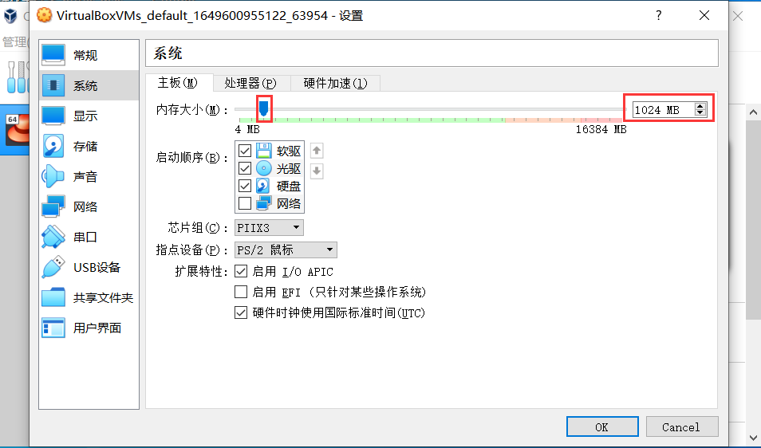

然后在`VirtualBox VMs的安装目录`使用`vagrant up`命令启动[Oracle VM *VirtualBox*](https://www.baidu.com/link?url=kt_064YgvH_qiIkWW_ekzAXDLKK6oDD_ftrlywBWyT8Jrtrbde8UVk2bGDtiAx8T&wd=&eqid=dfa91a1e000cf93a0000000662bec7af)虚拟机


然后在`VirtualBox VMs的安装目录`使用`vagrant ssh`连接虚拟机


使用`sudo docker ps`命令查看正在运行的镜像

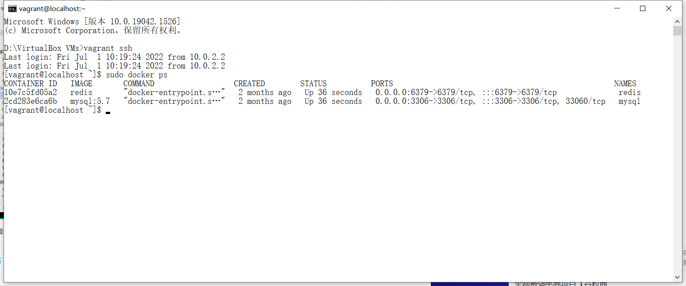

使用`sudo docker images`命令查看已下载的镜像

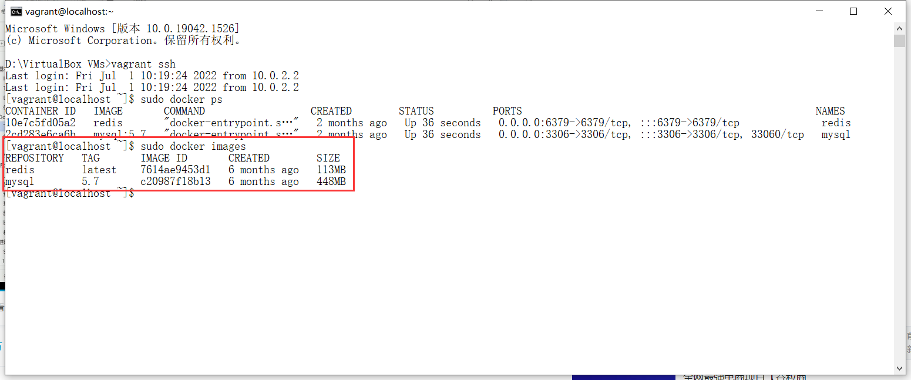

#### 2、下载

##### 1、下载`elasticsearch`

使用`sudo docker pull elasticsearch:7.4.2`命令下载`elasticsearch`

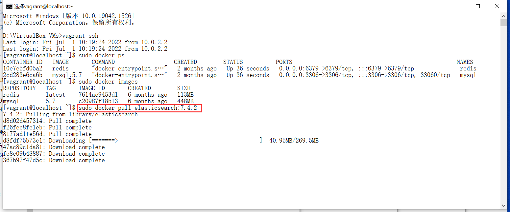

##### 2、下载`kibana`

使用`sudo docker pull kibana:7.4.2`下载`kibana`

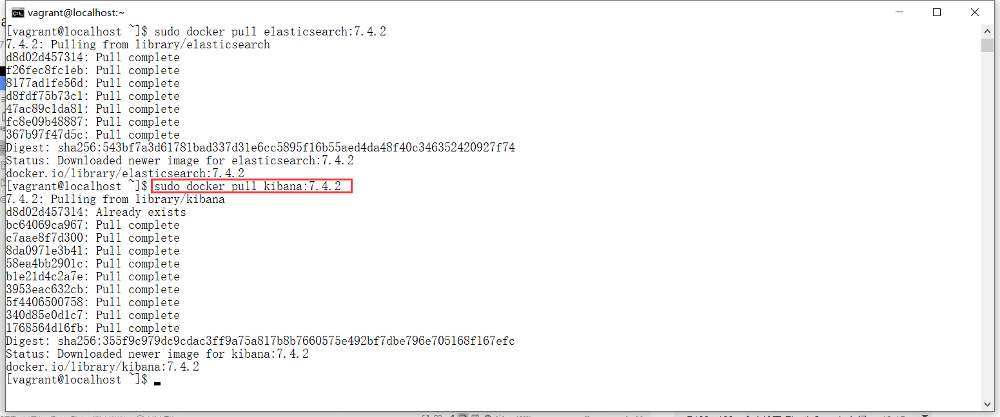

使用`sudo docker images`命令查看已下载的镜像

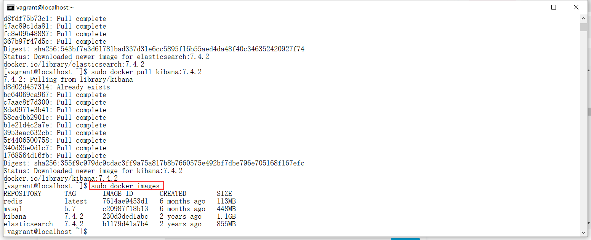

使用`free -m`查看内存使用情况，可以看到内存还剩`403`

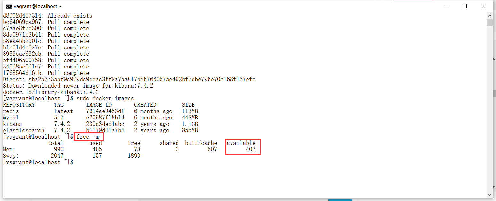

#### 3、运行

##### 1、运行`elasticsearch`

**完整命令**(`-e ES_JAVA_OPTS="-Xms64m -Xmx128m"`这里推荐修改为`-e ES_JAVA_OPTS="-Xms64m -Xmx512m"`)

```bash
su root
mkdir -p /mydata/elasticsearch/config
mkdir -p /mydata/elasticsearch/data
echo "http.host: 0.0.0.0" >> /mydata/elasticsearch/config/elasticsearch.yml
cd /mydata/elasticsearch/config
ls
cat elasticsearch.yml
chmod -R 777 /mydata/elasticsearch

docker run --name elasticsearch -p 9200:9200 -p 9300:9300 \
-e "discovery.type=single-node" \
-e ES_JAVA_OPTS="-Xms64m -Xmx128m" \
-v /mydata/elasticsearch/config/elasticsearch.yml:/usr/share/elasticsearch/config/elasticsearch.yml \
-v /mydata/elasticsearch/data:/usr/share/elasticsearch/data \
-v /mydata/elasticsearch/plugins:/usr/share/elasticsearch/plugins \
-d elasticsearch:7.4.2
```

以下是对命令的解释

```bash
su root     #提升至管理员权限，密码默认为 vagrant
mkdir -p /mydata/elasticsearch/config #在linux虚拟机里创建/mydata/elasticsearch/config目录，-p允许创建目录及子目录
mkdir -p /mydata/elasticsearch/data  #在linux虚拟机里创建/mydata/elasticsearch/data目录，-p允许创建目录及子目录
#在/mydata/elasticsearch/config/elasticsearch.yml文件里写入数据 http.host: 0.0.0.0
echo "http.host: 0.0.0.0" >> /mydata/elasticsearch/config/elasticsearch.yml #注意第二个"冒号后面有个空格
cd /mydata/elasticsearch/config #进入到/mydata/elasticsearch/config目录
ls #查看当前目录的文件及文件夹
cat elasticsearch.yml #查看elasticsearch.yml文件的内容

#9200是发送REST API类型的http请求所用的端口，9300是elasticsearch在分布式集群状态下节点之间通讯所用的端口
#  \ 斜杠表示当前行没写完，下一行接着写
#-e "discovery.type=single-node" 单节点运行
#-e ES_JAVA_OPTS="-Xms64m -Xmx128m" 初始占用64m，最大占用128m. 这个配置非常重要，如果不配置会占用虚拟机的全部内存，最后直   接卡死了
#-v /mydata/elasticsearch/config/elasticsearch.yml:/usr/share/elasticsearch/config/elasticsearch.yml 将    docker容器的/usr/share/elasticsearch/config/elasticsearch.yml文件与linux虚拟机                      的/mydata/elasticsearch/config/elasticsearch.yml文件进行关联
#-v /mydata/elasticsearch/data:/usr/share/elasticsearch/data 将docker的/usr/share/elasticsearch/data目录与   linux虚拟机的/mydata/elasticsearch/data目录进行关联
#-v /mydata/elasticsearch/plugins:/usr/share/elasticsearch/plugins 将docker的/usr/share/elasticsearch/plugins   目录与linux虚拟机的/mydata/elasticsearch/plugins目录进行关联，以后装插件就不用进入docker容器内部了
#-d elasticsearch:7.4.2 用elasticsearch:7.4.2这个镜像后台启动elasticsearch
```

可以看到`elasticsearch`并没有运行起来


使用`docker logs elasticsearch`命令，查看`elasticsearch`的日志

可以发现出现了**拒绝访问异常**

```
"Caused by: java.nio.file.AccessDeniedException: /usr/share/elasticsearch/data/nodes"
```

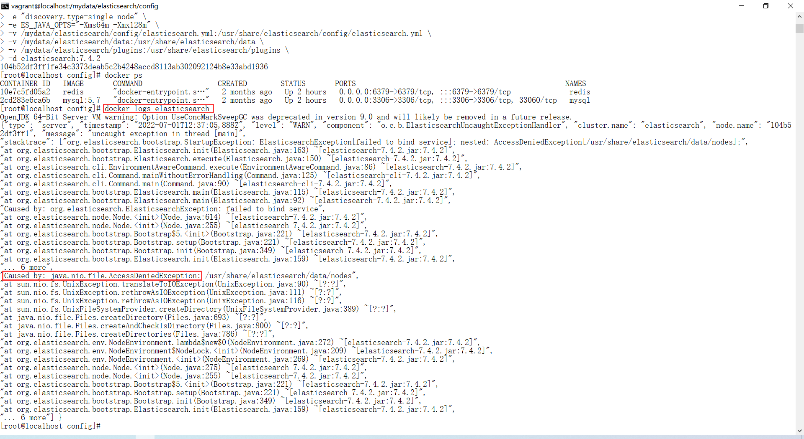

修改`/mydata/elasticsearch`目录下的所有子目录和文件的权限，让所有用户都有可执行权限

```bash
cd ..
ls
ll
chmod -R 777 /mydata/elasticsearh/
pwd
chmod -R 777 /mydata/elasticsearch
ll
```

最开始只有管理员用户有写权限

将`/mydata/elasticsearch`目录下的所有子目录和文件的权限都修改为777，即可读可写可执行

可以看到所有用户都有`可读可写可执行`权限

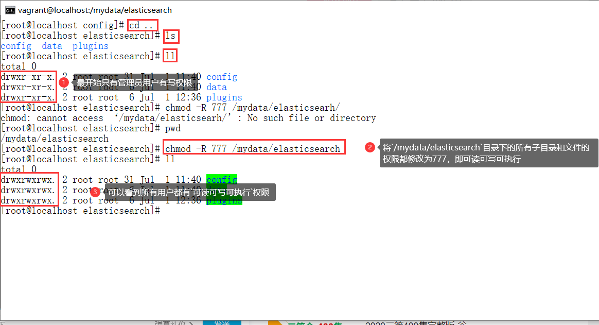

启动`elasticsearch`

```bash
docker ps
docker ps -a
docker start elasticsearch
docker ps
```

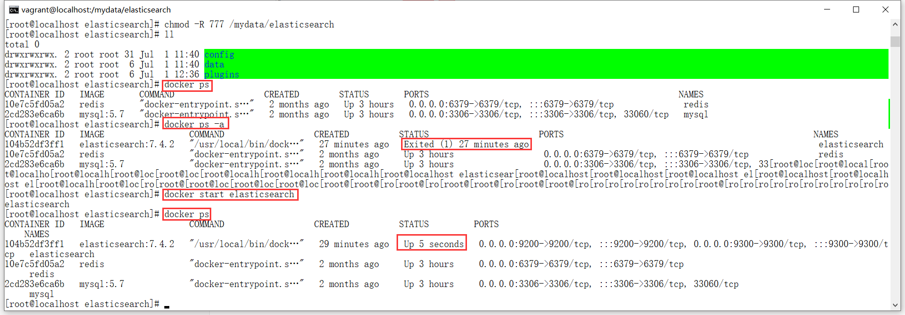

浏览器输入 http://192.168.56.10:9200/ 可以看到已经访问成功了

(记得要修改成自己在`VirtualBox VMs\Vagrantfile`文件里配置的ip)

在`VirtualBox VMs\Vagrantfile`文件里的`  config.vm.network "private_network", ip: "192.168.56.10"`这个位置，这里的ip即为自己配置的ip

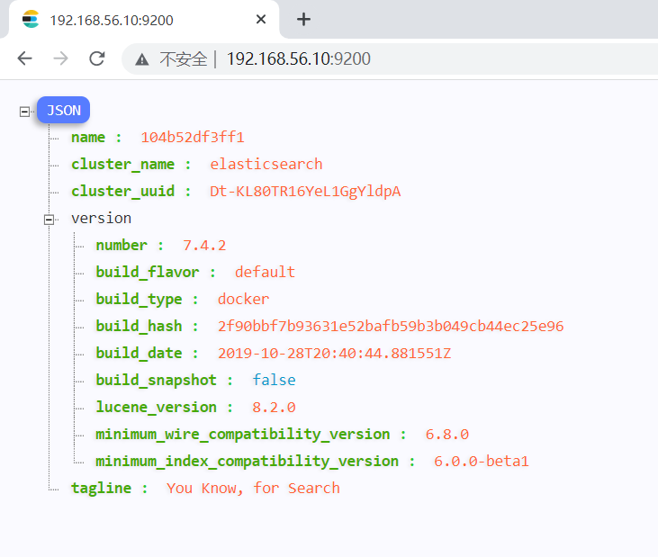

##### 2、运行`kibana`

这里的`http://192.168.56.10:9200`要改为自己配置的地址

```bash
docker run --name kibana -e ELASTICSEARCH_HOSTS=http://192.168.56.10:9200 -p 5601:5601 \
-d kibana:7.4.2
```

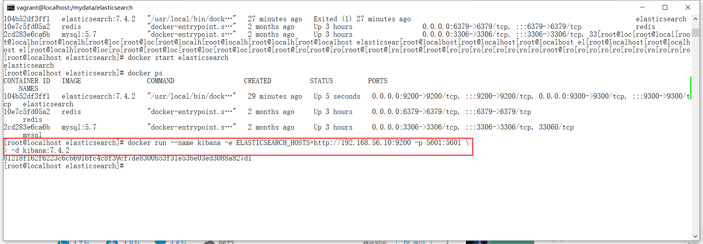

使用`docker ps`命令，查看正在运行的镜像，可以看到`kibana`已经运行起来了

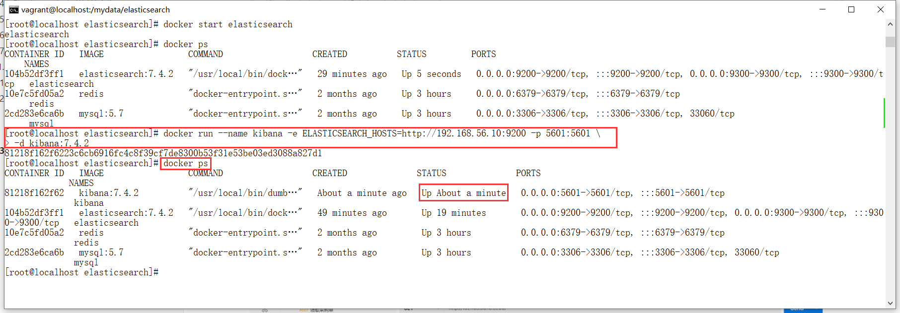


浏览器输入： http://192.168.56.10:5601/ ，即可看到欢迎界面


选择`No` ->`Explore on my own`即可进入到主界面

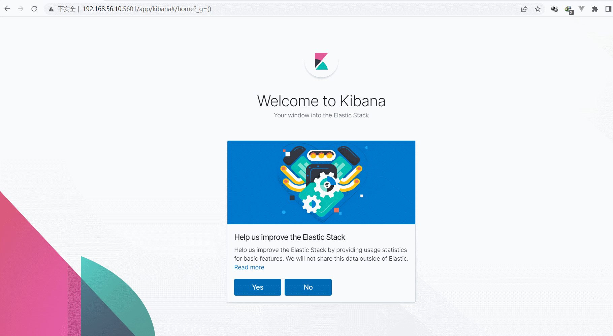

#### 3、发送请求

url： http://192.168.56.10:9200/

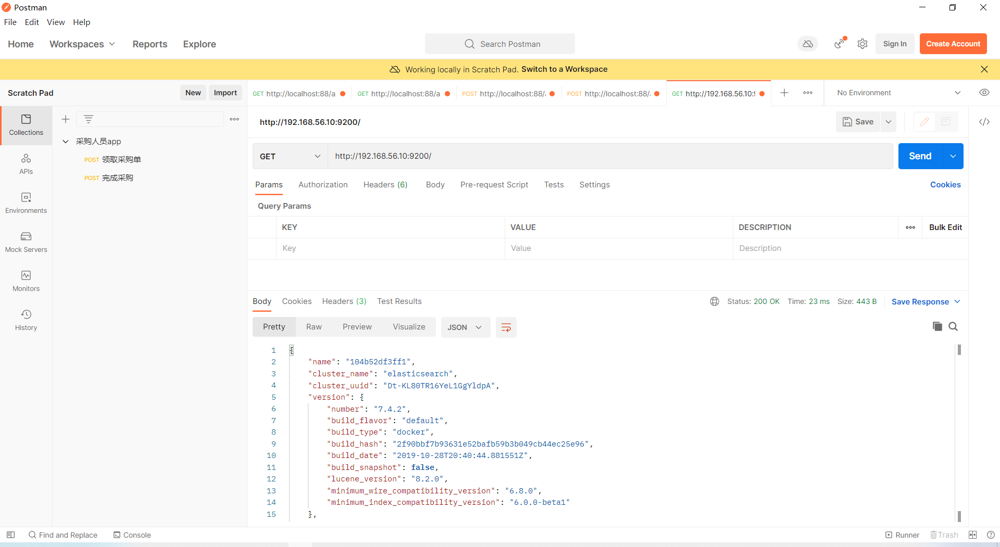

输入url： http://192.168.56.10:9200/_cat/nodes

查看所有节点信息，返回的结果中有`*`表明该节点是主节点，`104b52df3ff1`即为节点的名字

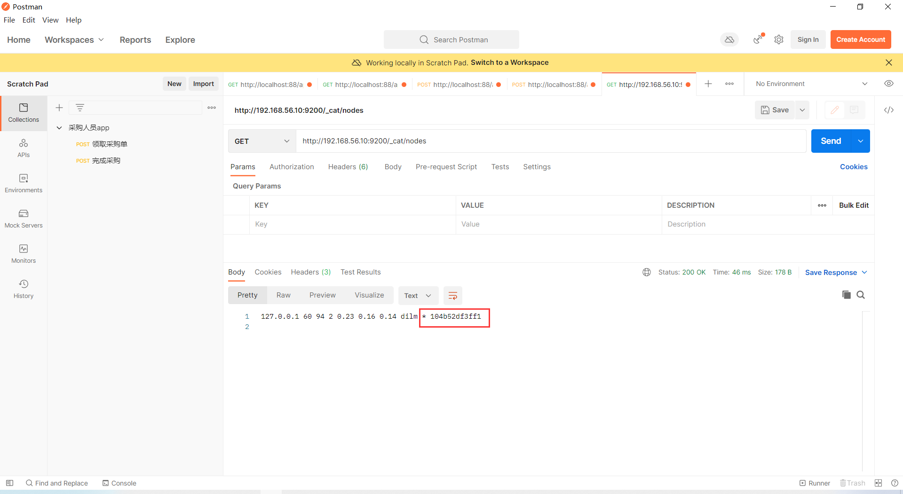

#### 4、常用命令

##### 1、启动`elasticsearch`

使用`docker start elasticsearch`命令启动`elasticsearch`

```bash
docker ps -a  #显示所有的容器，包括未运行的
docker start elasticsearch   #启动elasticsearch
docker ps -a
```

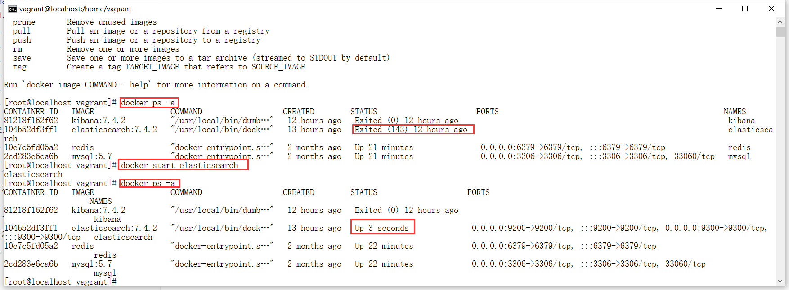

##### 2、重启`elasticsearch`

使用`docker restart elasticsearch`命令，重启`elasticsearch`

```bash
docker restart elasticsearch
```

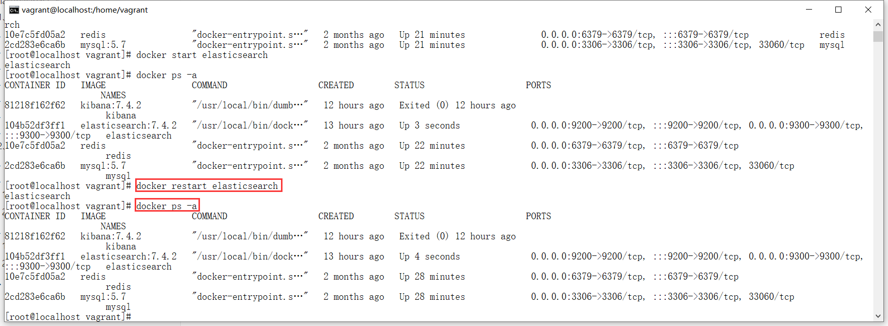

##### 3、关闭`elasticsearch`

使用`docker stop elasticsearch`命令，关闭`elasticsearch`

```bash
docker stop elasticsearch
```

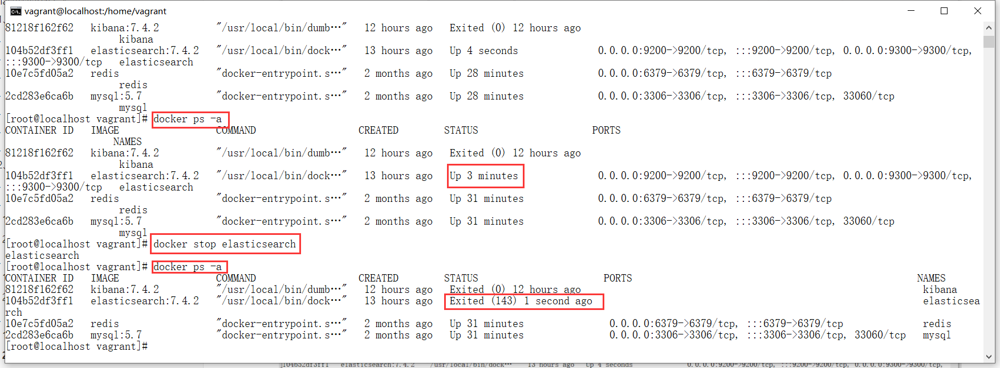

##### 4、设置开机自启

设置`elasticsearch`开机自启

```bash
 sudo docker update  elasticsearch  --restart=always
```

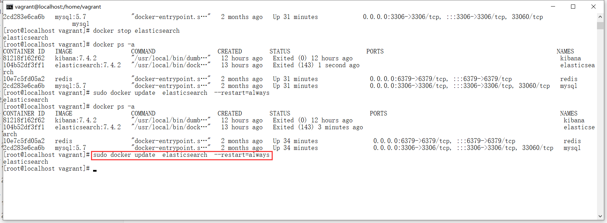

设置`kibana`开机自启

```bash
sudo docker update  kibana --restart=always
```

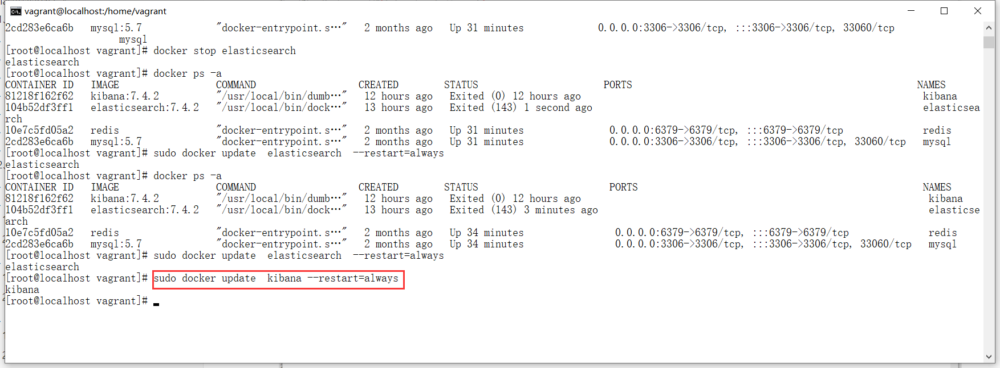

重启`linux`虚拟机，可以看到`elasticsearch`和`kibana`都已经自启了

```bash
vagrant ssh
sudo docker ps
```

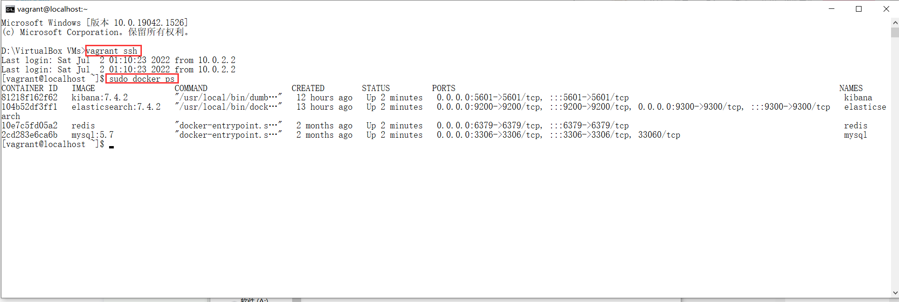

### 5.1.3、Elasticsearch入门

#### 1、查看`Elasticsearch`信息

```
GET /_cat/nodes：查看所有节点
GET /_cat/health：查看 es 健康状况
GET /_cat/master：查看主节点
GET /_cat/indices：查看所有索引 相当于数据库的“show databases”
```

##### 1、查看所有节点

```http
http://192.168.56.10:9200/_cat/nodes
```

*表示的是主节点

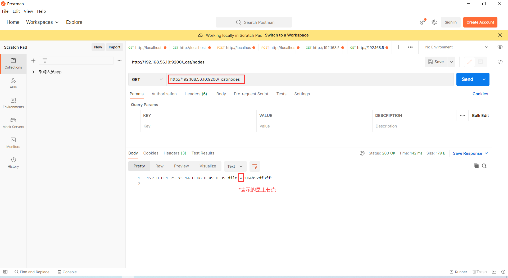

##### 2、查看健康状况

```http
http://192.168.56.10:9200/_cat/health
```

green表示健康

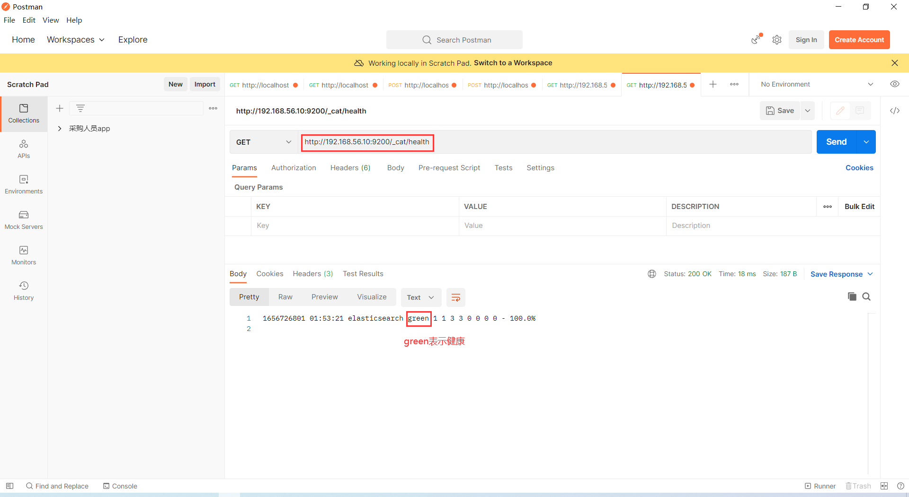

##### 3、查看主节点

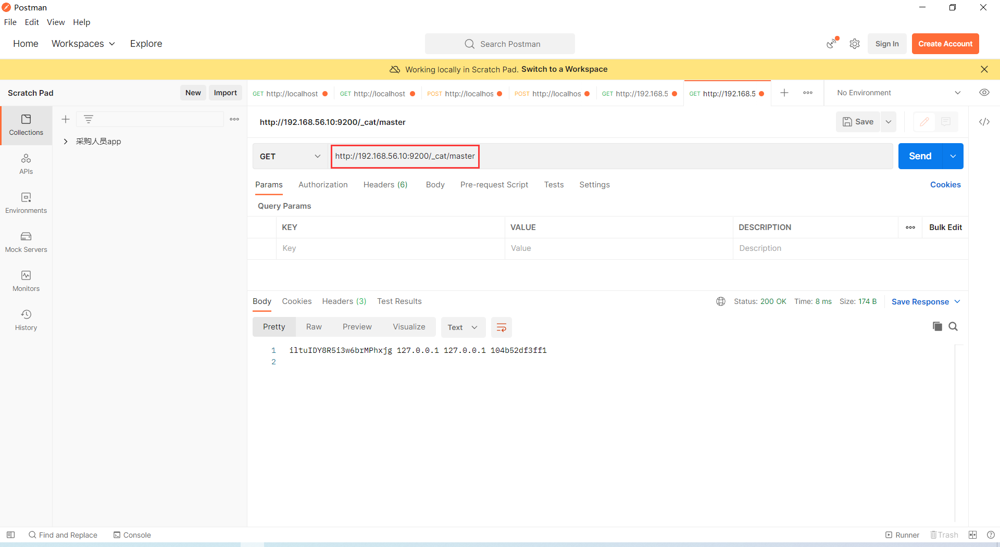

##### 4、查看所有索引

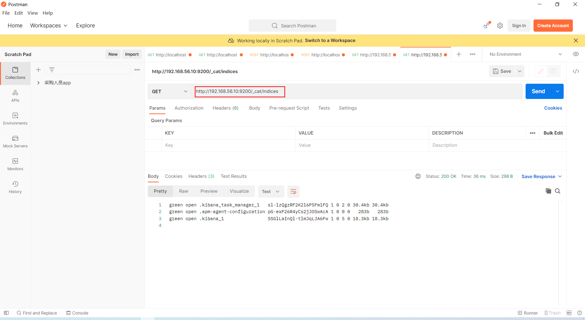

#### 2、简单增查改

##### 1、`put`方式添加或修改数据

###### 1、`put`方式发送请求

在Postman中发送请求

1. 输入`http://192.168.56.10:9200/customer/external/1`

2. 选择请求方式为PUT

3. 点击Body

4. 点击raw

5. 选择JSON

6. 点击Send

```json
{ 
    "name": "John Doe"
}
```

返回的数据信息

```json
{
    "_index": "customer",
    "_type": "external",
    "_id": "1",
    "_version": 1,
    "result": "created",
    "_shards": {
        "total": 2,
        "successful": 1,
        "failed": 0
    },
    "_seq_no": 0,
    "_primary_term": 1
}
```

这些带`_`的都称为元数据

`"_index": "customer",`  -> 在`customer`索引下，相当于mysql中的数据库

`"_type": "external",` -> 在`external`类型下，相当于mysql中的表  （新版本已经没有`_type`了，统一为`_doc`）

`"_id": "1",` -> id为1

`"_version": 1,` ->  版本号为1

`"result": "created",` -> _result为新建状态

_shards是集群信息

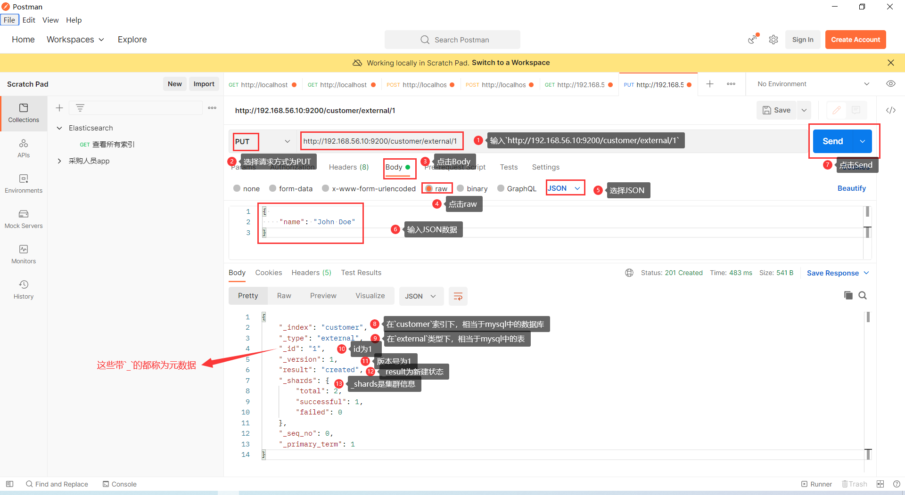

###### 2、再次发送数据

再次点击Send

版本号就变为了2

状态就变为了`updated`

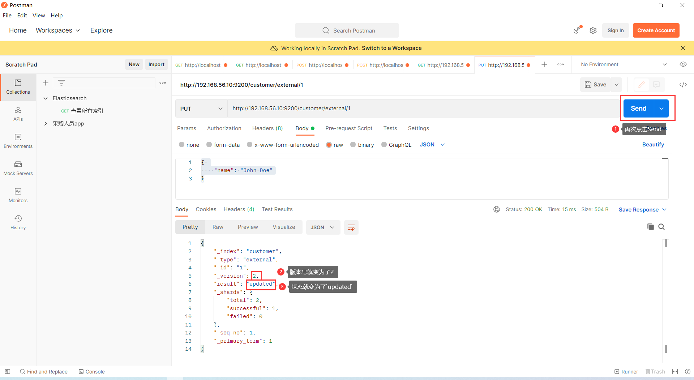

###### 3、`put`方式添加数据不允许不带`id`

uri [/customer/external] 和方法 [PUT] 的 HTTP 方法不正确，允许：[POST]

```json
{
    "error": "Incorrect HTTP method for uri [/customer/external] and method [PUT], allowed: [POST]",
    "status": 405
}
```

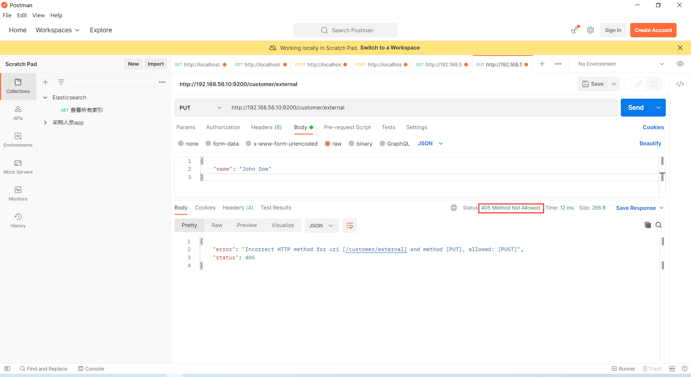

##### 2、`post`方式添加或修改数据

> 新增: 不带id;带id但之前没数据
> 修改: 带id,并且有数据

###### 1、不带id用`post`方式发送请求

1. 修改请求：  http://192.168.56.10:9200/customer/external  ，这次不指定id

2. 请求方式改为`Post`

3. 再次点击Send

返回的数据

```json
{
    "_index": "customer",
    "_type": "external",
    "_id": "fUi6vIEBNNJSS-0BII0-",
    "_version": 1,
    "result": "created",
    "_shards": {
        "total": 2,
        "successful": 1,
        "failed": 0
    },
    "_seq_no": 2,
    "_primary_term": 1
}
```

1. 这时会自动创建一个唯一id

2. 版本号为1

3. 状态为新建

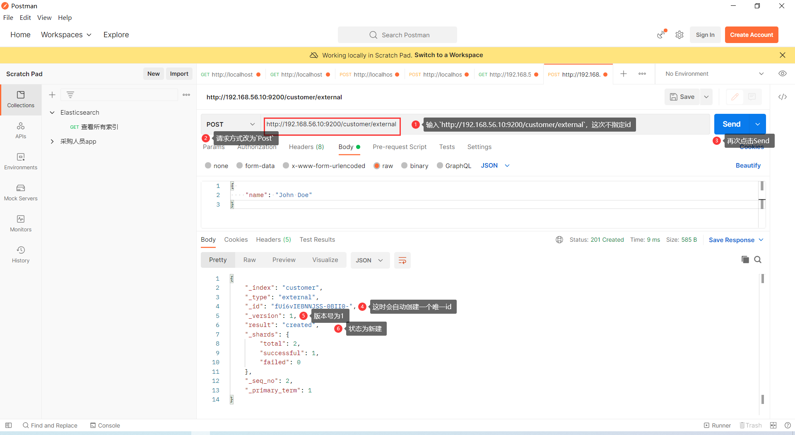

###### 2、再次发送数据

再次点击Send，又重新新建了一个数据

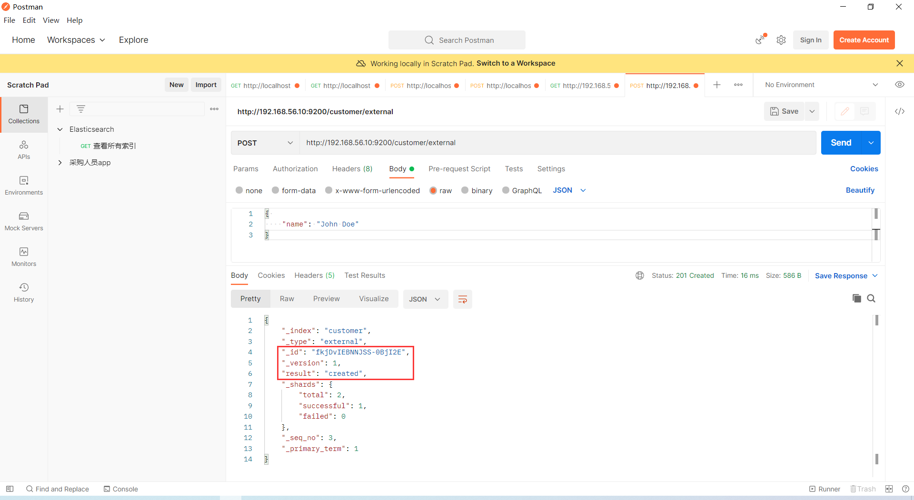

###### 3、带id用`post`方式发送请求

这次指定id，输入 http://192.168.56.10:9200/customer/external/2  ，点击Send

这时状态为新建


###### 4、再次发送数据

这时状态为更新

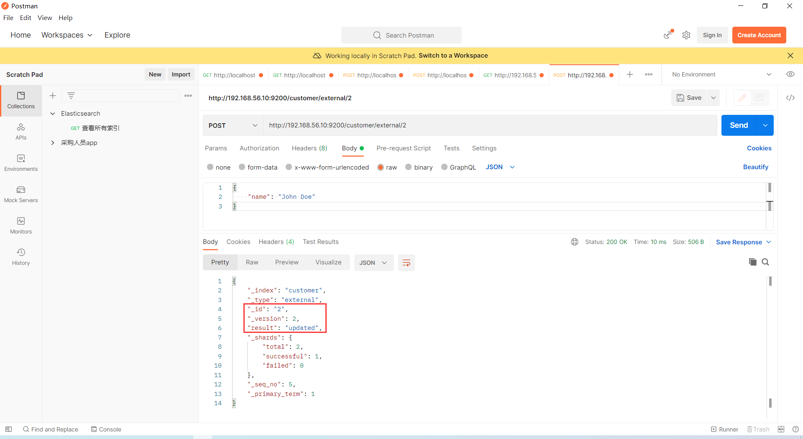

#### 3、查询和修改数据

##### 1、基础查询数据

1. 输入`http://192.168.56.10:9200/customer/external/1`

2. 请求方式选择`GET`

3. 点击`Send`

返回的数据

```json
{
    "_index": "customer",
    "_type": "external",
    "_id": "1",
    "_version": 2,
    "_seq_no": 1,
    "_primary_term": 1,
    "found": true,
    "_source": {
        "name": "John Doe"
    }
}
```

1. `"_index": "customer",`  -> 在`customer`索引下，相当于mysql中的数据库

2. `"_type": "external",` -> 在`external`类型下，相当于mysql中的表  （新版本已经没有`_type`了，统一为`_doc`）

3. `"_id": "2",` -> id为2

4. `"_version": 1,` ->  版本号为1

5. `"_seq_no": 1,` -> 做乐观锁操作的，只有数据一有改动`_seq_no`相当于序列号，就会往上加

6. `"_primary_term": 1,` -> 分片发生了变化`_primary_term`也会往上加

7. `"found": true,` -> 表明找到了数据

8. `_source` -> 内容在`_source`里面

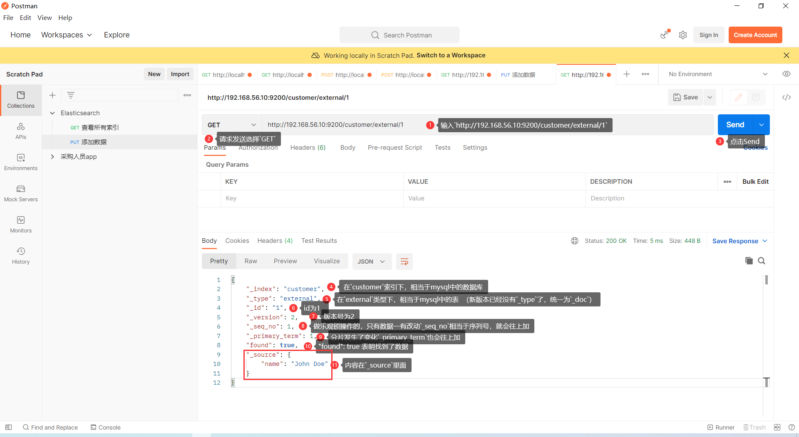

##### 2、乐观锁修改数据

开两个请求窗口

请求url都输入： http://192.168.56.10:9200/customer/external/1?if_seq_no=1&if_primary_term=1

请求方式都为`PUT`


第一个请求里输入以下json，然后点击Send

```json
{
    "name": "1"
}
```

以下是响应内容，可以看到修改成功了

```json
{
    "_index": "customer",
    "_type": "external",
    "_id": "1",
    "_version": 3,
    "result": "updated",
    "_shards": {
        "total": 2,
        "successful": 1,
        "failed": 0
    },
    "_seq_no": 6,
    "_primary_term": 1
}
```

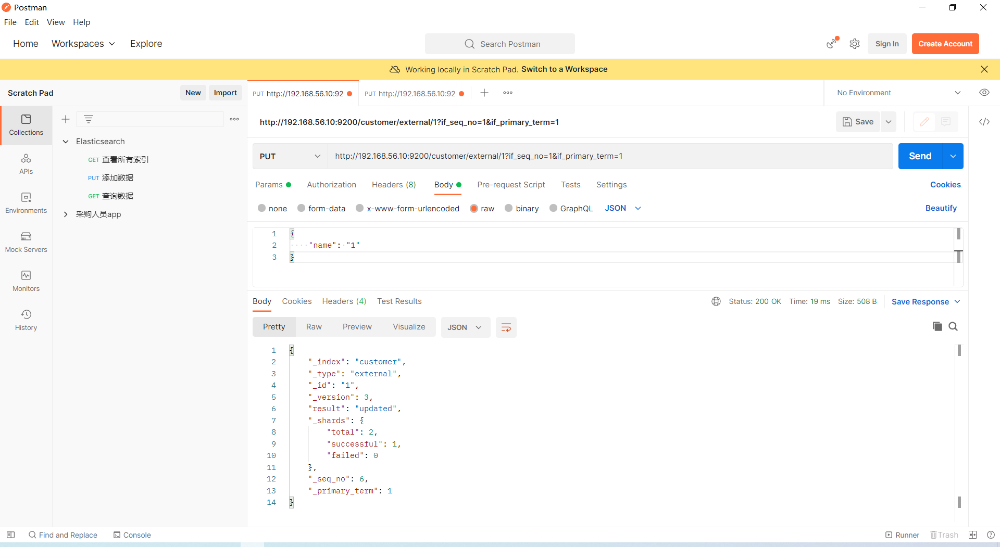

第二个请求里输入以下json，然后点击Send

```json
{
    "name": "2"
}
```

以下是响应内容，可以看到修改失败了

```json
{
    "error": {
        "root_cause": [
            {
                "type": "version_conflict_engine_exception",
                "reason": "[1]: version conflict, required seqNo [1], primary term [1]. current document has seqNo [6] and primary term [1]",
                "index_uuid": "M5lWculHRVWJOSy2fVN_3Q",
                "shard": "0",
                "index": "customer"
            }
        ],
        "type": "version_conflict_engine_exception",
        "reason": "[1]: version conflict, required seqNo [1], primary term [1]. current document has seqNo [6] and primary term [1]",
        "index_uuid": "M5lWculHRVWJOSy2fVN_3Q",
        "shard": "0",
        "index": "customer"
    },
    "status": 409
}
```

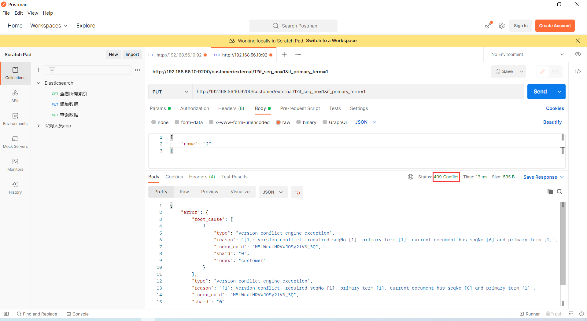

这时需要再次查询`_seq_no`

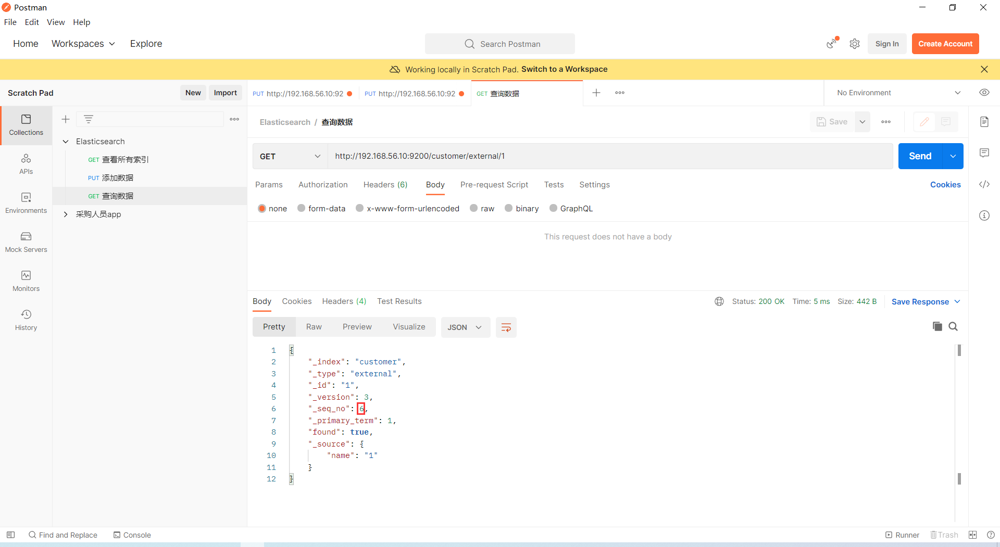

修改`_seq_no`为刚才查到的`_seq_no`的值，再次发送数据，可以看到这次查询成功了

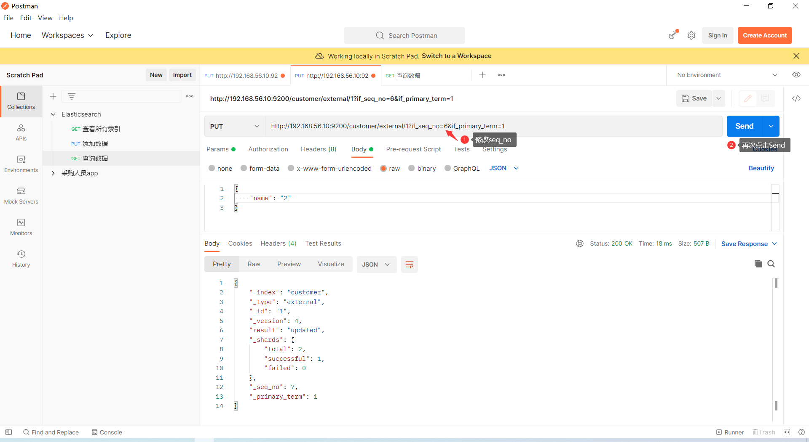

##### 3、带`_update`修改数据

> 带`_update`方式会对比原来数据，与原来一样就什么都不做，version, seq_no都不变  

> 适用于 对于大并发查询偶尔更新，带 update；对比更新，重新计算分配规则

请求的url： http://192.168.56.10:9200/customer/external/1/_update

请求方式为`POST`，输入以下json

```json
{ 
    "doc":{ 
        "name": "John"
    }
}
```

不管发送多少次，只要内容不变响应数据都为以下内容

```json
{
    "_index": "customer",
    "_type": "external",
    "_id": "1",
    "_version": 7,
    "result": "noop",
    "_shards": {
        "total": 0,
        "successful": 0,
        "failed": 0
    },
    "_seq_no": 10,
    "_primary_term": 1
}
```

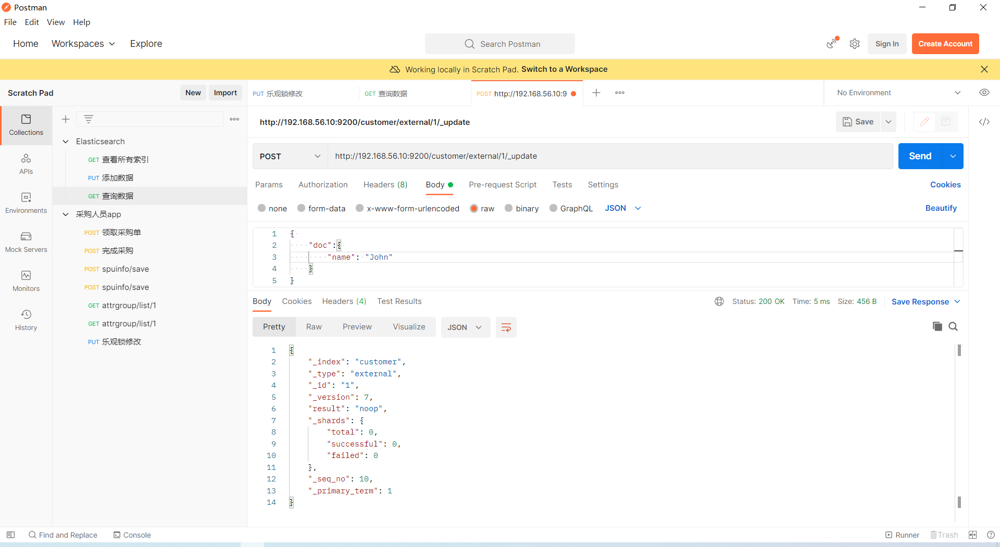

##### 4、不带`_update`修改数据

put和post (不带_update) 都会直接更新数据, 对于大并发更新，不带 update

请求的url： http://192.168.56.10:9200/customer/external/1

请求方式为`POST`，输入以下json

```json
{ 
    "name": "John"
}
```

每发送一次请求，`_version`都会加一

```json
{
    "_index": "customer",
    "_type": "external",
    "_id": "1",
    "_version": 8,
    "result": "updated",
    "_shards": {
        "total": 2,
        "successful": 1,
        "failed": 0
    },
    "_seq_no": 11,
    "_primary_term": 1
}
```


```json
{
    "_index": "customer",
    "_type": "external",
    "_id": "1",
    "_version": 9,
    "result": "updated",
    "_shards": {
        "total": 2,
        "successful": 1,
        "failed": 0
    },
    "_seq_no": 12,
    "_primary_term": 1
}
```

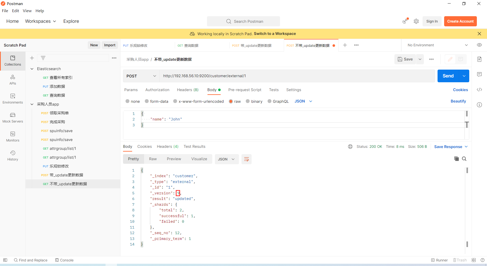

`put`请求也一样不比较，直接更新

```
{
    "_index": "customer",
    "_type": "external",
    "_id": "1",
    "_version": 10,
    "result": "updated",
    "_shards": {
        "total": 2,
        "successful": 1,
        "failed": 0
    },
    "_seq_no": 13,
    "_primary_term": 1
}
```


```
{
    "_index": "customer",
    "_type": "external",
    "_id": "1",
    "_version": 11,
    "result": "updated",
    "_shards": {
        "total": 2,
        "successful": 1,
        "failed": 0
    },
    "_seq_no": 14,
    "_primary_term": 1
}
```


#### 4、更新同时增加属性

##### 1、不带`_update`使用`PUT`方式添加属性

1. url输入：http://192.168.56.10:9200/customer/external/1

2. 请求方式选择`PUT`
3. 请求体输入以下json

```json
{ 
    "name": "John",
    "age":20
}
```

4. 点击Send

可以看到请求成功了

```json
{
    "_index": "customer",
    "_type": "external",
    "_id": "1",
    "_version": 12,
    "result": "updated",
    "_shards": {
        "total": 2,
        "successful": 1,
        "failed": 0
    },
    "_seq_no": 15,
    "_primary_term": 1
}
```

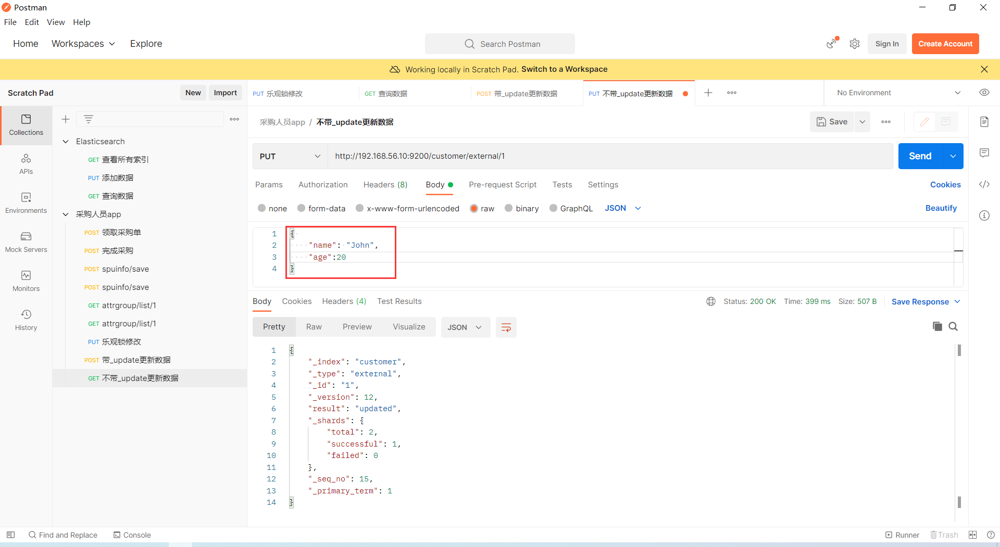

1. url输入：http://192.168.56.10:9200/customer/external/1

2. 请求方式选择`GET`

可以看到更新成功了

```json
{
    "_index": "customer",
    "_type": "external",
    "_id": "1",
    "_version": 12,
    "_seq_no": 15,
    "_primary_term": 1,
    "found": true,
    "_source": {
        "name": "John",
        "age": 20
    }
}
```

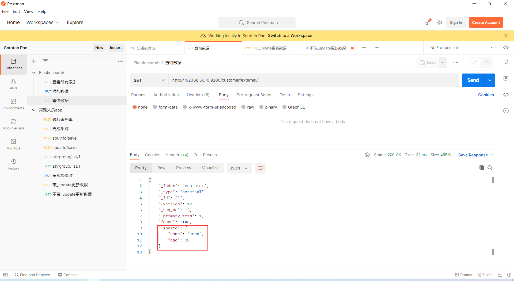

##### 2、带`_update`使用`POST`方式添加属性

1. url输入： http://192.168.56.10:9200/customer/external/1/_update

2. 请求方式选择`POST`

3. 输入以下json，带`_update`方式需要使用"doc"

```json
{ 
    "doc":{ 
        "name": "John",
        "age":20
    }
}
```

4. 点击Send

响应为以下内容

```json
{
    "_index": "customer",
    "_type": "external",
    "_id": "1",
    "_version": 12,
    "result": "noop",
    "_shards": {
        "total": 0,
        "successful": 0,
        "failed": 0
    },
    "_seq_no": 15,
    "_primary_term": 1
}
```

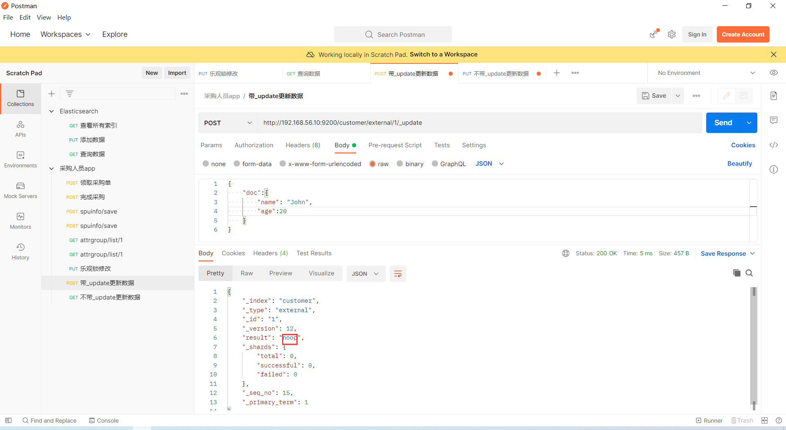

:memo:PUT 和 POST 不带_updat

#### 5、删除数据

##### 1、删除某个数据

1. url输入： http://192.168.56.10:9200/customer/external/1

2. 请求方式选择`DELETE`

3. 点击Send

可以看到删除成功了，响应数据为以下内容

```json
{
    "_index": "customer",
    "_type": "external",
    "_id": "1",
    "_version": 13,
    "result": "deleted",
    "_shards": {
        "total": 2,
        "successful": 1,
        "failed": 0
    },
    "_seq_no": 16,
    "_primary_term": 1
}
```


查询数据可以发现，响应状态为`404`， "found"为**false**

```json
{
    "_index": "customer",
    "_type": "external",
    "_id": "1",
    "found": false
}
```

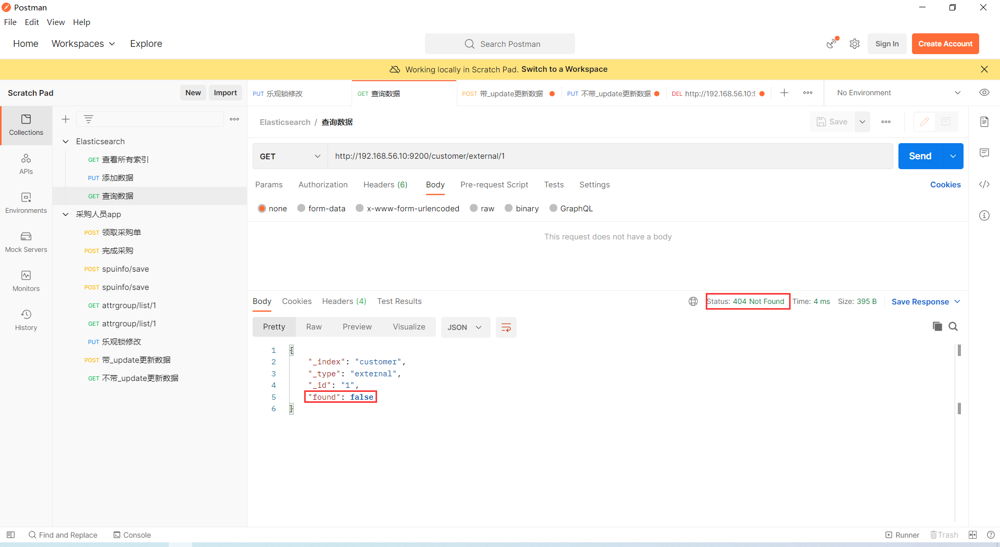

##### 2、删除索引

1. url输入： http://192.168.56.10:9200/customer

2. 请求方式选择`DELETE`

3. 点击Send

响应的数据为以下内容

```json
{
    "acknowledged": true
}
```

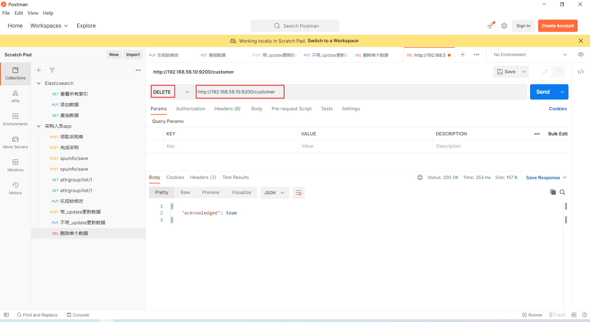

再次查询索引为`1`的数据，可以看到这次直接说**索引没有找到**

```json
{
    "error": {
        "root_cause": [
            {
                "type": "index_not_found_exception",
                "reason": "no such index [customer]",
                "resource.type": "index_expression",
                "resource.id": "customer",
                "index_uuid": "_na_",
                "index": "customer"
            }
        ],
        "type": "index_not_found_exception",
        "reason": "no such index [customer]",
        "resource.type": "index_expression",
        "resource.id": "customer",
        "index_uuid": "_na_",
        "index": "customer"
    },
    "status": 404
}
```

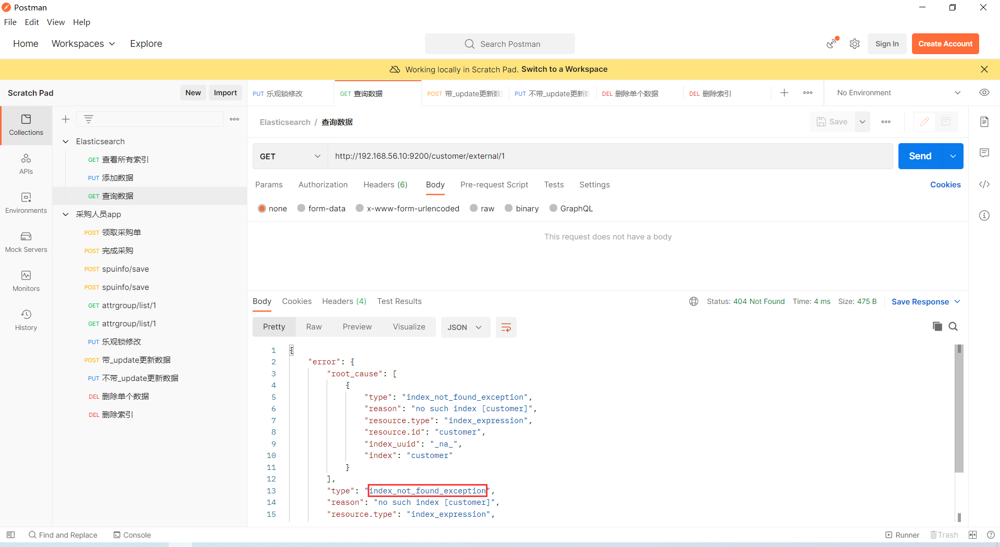

#### 6、批量添加数据

##### 1、打开`Dev Tools`

浏览器输入url： http://192.168.56.10:5601/  ，在菜单栏点击`Dev Tools`

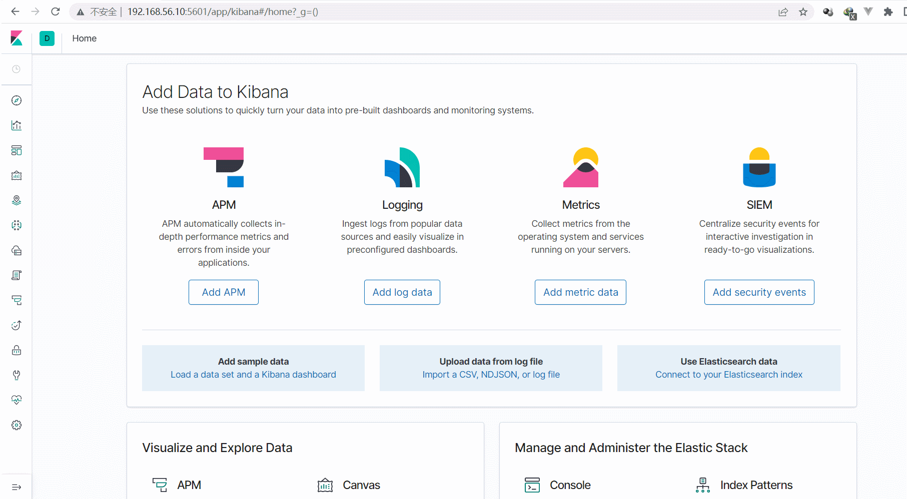


##### 2、发送简单请求

批量添加数据格式

```json
{ action: { metadata }}\n
{ request body }\n
{ action: { metadata }}\n
{ request body }\n
```

执行以下语句，这些批量操作都是独立的，上一个失败并不会影响下一个的执行

`index`表示的是`新增`或`修改`

```
POST customer/external/_bulk
{"index":{"_id":"1"}}
{"name": "John Doe" }
{"index":{"_id":"2"}}
{"name": "Jane Doe" }
```

响应的结果为

```json
#! Deprecation: [types removal] Specifying types in bulk requests is deprecated.
{
  "took" : 427,
  "errors" : false,
  "items" : [
    {
      "index" : {
        "_index" : "customer",
        "_type" : "external",
        "_id" : "1",
        "_version" : 1,
        "result" : "created",
        "_shards" : {
          "total" : 2,
          "successful" : 1,
          "failed" : 0
        },
        "_seq_no" : 0,
        "_primary_term" : 1,
        "status" : 201
      }
    },
    {
      "index" : {
        "_index" : "customer",
        "_type" : "external",
        "_id" : "2",
        "_version" : 1,
        "result" : "created",
        "_shards" : {
          "total" : 2,
          "successful" : 1,
          "failed" : 0
        },
        "_seq_no" : 1,
        "_primary_term" : 1,
        "status" : 201
      }
    }
  ]
}

```

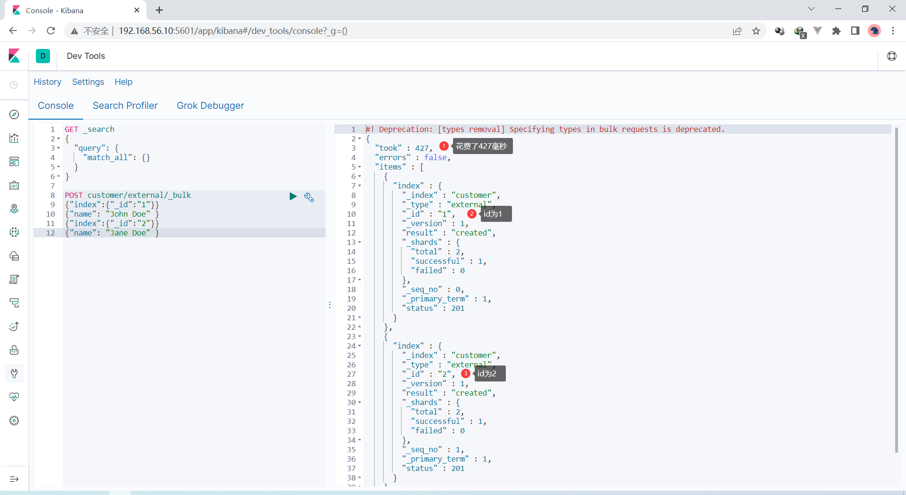

##### 3、发送复杂请求

发送以下复杂请求

```json
POST /_bulk
{ "delete": { "_index": "website", "_type": "blog", "_id": "123" }}
{ "create": { "_index": "website", "_type": "blog", "_id": "123" }}
{ "title": "My first blog post" }
{ "index": { "_index": "website", "_type": "blog" }}
{ "title": "My second blog post" }
{ "update": { "_index": "website", "_type": "blog", "_id": "123", "retry_on_conflict" : 3} }
{ "doc" : {"title" : "My updated blog post"}}
```

响应的内容为

```json
#! Deprecation: [types removal] Specifying types in bulk requests is deprecated.
{
  "took" : 286,
  "errors" : false,
  "items" : [
    {
      "delete" : {
        "_index" : "website",
        "_type" : "blog",
        "_id" : "123",
        "_version" : 1,
        "result" : "not_found",
        "_shards" : {
          "total" : 2,
          "successful" : 1,
          "failed" : 0
        },
        "_seq_no" : 0,
        "_primary_term" : 1,
        "status" : 404
      }
    },
    {
      "create" : {
        "_index" : "website",
        "_type" : "blog",
        "_id" : "123",
        "_version" : 2,
        "result" : "created",
        "_shards" : {
          "total" : 2,
          "successful" : 1,
          "failed" : 0
        },
        "_seq_no" : 1,
        "_primary_term" : 1,
        "status" : 201
      }
    },
    {
      "index" : {
        "_index" : "website",
        "_type" : "blog",
        "_id" : "f0hgvYEBNNJSS-0BkY3i",
        "_version" : 1,
        "result" : "created",
        "_shards" : {
          "total" : 2,
          "successful" : 1,
          "failed" : 0
        },
        "_seq_no" : 2,
        "_primary_term" : 1,
        "status" : 201
      }
    },
    {
      "update" : {
        "_index" : "website",
        "_type" : "blog",
        "_id" : "123",
        "_version" : 3,
        "result" : "updated",
        "_shards" : {
          "total" : 2,
          "successful" : 1,
          "failed" : 0
        },
        "_seq_no" : 3,
        "_primary_term" : 1,
        "status" : 200
      }
    }
  ]
}

```


##### 4、批量添加测试数据

输入以下数据，然后点击运行

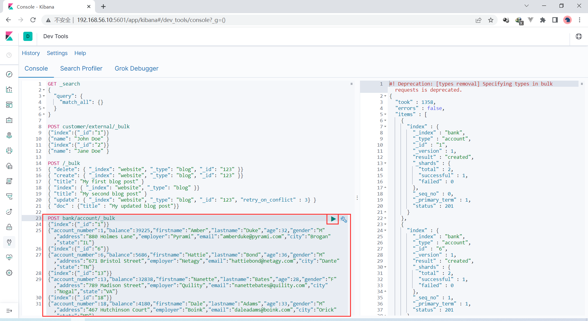

```json
POST bank/account/_bulk
{"index":{"_id":"1"}}
{"account_number":1,"balance":39225,"firstname":"Amber","lastname":"Duke","age":32,"gender":"M","address":"880 Holmes Lane","employer":"Pyrami","email":"amberduke@pyrami.com","city":"Brogan","state":"IL"}
{"index":{"_id":"6"}}
{"account_number":6,"balance":5686,"firstname":"Hattie","lastname":"Bond","age":36,"gender":"M","address":"671 Bristol Street","employer":"Netagy","email":"hattiebond@netagy.com","city":"Dante","state":"TN"}
{"index":{"_id":"13"}}
{"account_number":13,"balance":32838,"firstname":"Nanette","lastname":"Bates","age":28,"gender":"F","address":"789 Madison Street","employer":"Quility","email":"nanettebates@quility.com","city":"Nogal","state":"VA"}
{"index":{"_id":"18"}}
{"account_number":18,"balance":4180,"firstname":"Dale","lastname":"Adams","age":33,"gender":"M","address":"467 Hutchinson Court","employer":"Boink","email":"daleadams@boink.com","city":"Orick","state":"MD"}
{"index":{"_id":"20"}}
{"account_number":20,"balance":16418,"firstname":"Elinor","lastname":"Ratliff","age":36,"gender":"M","address":"282 Kings Place","employer":"Scentric","email":"elinorratliff@scentric.com","city":"Ribera","state":"WA"}
{"index":{"_id":"25"}}
{"account_number":25,"balance":40540,"firstname":"Virginia","lastname":"Ayala","age":39,"gender":"F","address":"171 Putnam Avenue","employer":"Filodyne","email":"virginiaayala@filodyne.com","city":"Nicholson","state":"PA"}
{"index":{"_id":"32"}}
{"account_number":32,"balance":48086,"firstname":"Dillard","lastname":"Mcpherson","age":34,"gender":"F","address":"702 Quentin Street","employer":"Quailcom","email":"dillardmcpherson@quailcom.com","city":"Veguita","state":"IN"}
{"index":{"_id":"37"}}
{"account_number":37,"balance":18612,"firstname":"Mcgee","lastname":"Mooney","age":39,"gender":"M","address":"826 Fillmore Place","employer":"Reversus","email":"mcgeemooney@reversus.com","city":"Tooleville","state":"OK"}
{"index":{"_id":"44"}}
{"account_number":44,"balance":34487,"firstname":"Aurelia","lastname":"Harding","age":37,"gender":"M","address":"502 Baycliff Terrace","employer":"Orbalix","email":"aureliaharding@orbalix.com","city":"Yardville","state":"DE"}
{"index":{"_id":"49"}}
{"account_number":49,"balance":29104,"firstname":"Fulton","lastname":"Holt","age":23,"gender":"F","address":"451 Humboldt Street","employer":"Anocha","email":"fultonholt@anocha.com","city":"Sunriver","state":"RI"}
{"index":{"_id":"51"}}
{"account_number":51,"balance":14097,"firstname":"Burton","lastname":"Meyers","age":31,"gender":"F","address":"334 River Street","employer":"Bezal","email":"burtonmeyers@bezal.com","city":"Jacksonburg","state":"MO"}
{"index":{"_id":"56"}}
{"account_number":56,"balance":14992,"firstname":"Josie","lastname":"Nelson","age":32,"gender":"M","address":"857 Tabor Court","employer":"Emtrac","email":"josienelson@emtrac.com","city":"Sunnyside","state":"UT"}
{"index":{"_id":"63"}}
{"account_number":63,"balance":6077,"firstname":"Hughes","lastname":"Owens","age":30,"gender":"F","address":"510 Sedgwick Street","employer":"Valpreal","email":"hughesowens@valpreal.com","city":"Guilford","state":"KS"}
{"index":{"_id":"68"}}
{"account_number":68,"balance":44214,"firstname":"Hall","lastname":"Key","age":25,"gender":"F","address":"927 Bay Parkway","employer":"Eventex","email":"hallkey@eventex.com","city":"Shawmut","state":"CA"}
{"index":{"_id":"70"}}
{"account_number":70,"balance":38172,"firstname":"Deidre","lastname":"Thompson","age":33,"gender":"F","address":"685 School Lane","employer":"Netplode","email":"deidrethompson@netplode.com","city":"Chestnut","state":"GA"}
{"index":{"_id":"75"}}
{"account_number":75,"balance":40500,"firstname":"Sandoval","lastname":"Kramer","age":22,"gender":"F","address":"166 Irvington Place","employer":"Overfork","email":"sandovalkramer@overfork.com","city":"Limestone","state":"NH"}
{"index":{"_id":"82"}}
{"account_number":82,"balance":41412,"firstname":"Concetta","lastname":"Barnes","age":39,"gender":"F","address":"195 Bayview Place","employer":"Fitcore","email":"concettabarnes@fitcore.com","city":"Summerfield","state":"NC"}
{"index":{"_id":"87"}}
{"account_number":87,"balance":1133,"firstname":"Hewitt","lastname":"Kidd","age":22,"gender":"M","address":"446 Halleck Street","employer":"Isologics","email":"hewittkidd@isologics.com","city":"Coalmont","state":"ME"}
{"index":{"_id":"94"}}
{"account_number":94,"balance":41060,"firstname":"Brittany","lastname":"Cabrera","age":30,"gender":"F","address":"183 Kathleen Court","employer":"Mixers","email":"brittanycabrera@mixers.com","city":"Cornucopia","state":"AZ"}
{"index":{"_id":"99"}}
{"account_number":99,"balance":47159,"firstname":"Ratliff","lastname":"Heath","age":39,"gender":"F","address":"806 Rockwell Place","employer":"Zappix","email":"ratliffheath@zappix.com","city":"Shaft","state":"ND"}
{"index":{"_id":"102"}}
{"account_number":102,"balance":29712,"firstname":"Dena","lastname":"Olson","age":27,"gender":"F","address":"759 Newkirk Avenue","employer":"Hinway","email":"denaolson@hinway.com","city":"Choctaw","state":"NJ"}
{"index":{"_id":"107"}}
{"account_number":107,"balance":48844,"firstname":"Randi","lastname":"Rich","age":28,"gender":"M","address":"694 Jefferson Street","employer":"Netplax","email":"randirich@netplax.com","city":"Bellfountain","state":"SC"}
{"index":{"_id":"114"}}
{"account_number":114,"balance":43045,"firstname":"Josephine","lastname":"Joseph","age":31,"gender":"F","address":"451 Oriental Court","employer":"Turnabout","email":"josephinejoseph@turnabout.com","city":"Sedley","state":"AL"}
{"index":{"_id":"119"}}
{"account_number":119,"balance":49222,"firstname":"Laverne","lastname":"Johnson","age":28,"gender":"F","address":"302 Howard Place","employer":"Senmei","email":"lavernejohnson@senmei.com","city":"Herlong","state":"DC"}
{"index":{"_id":"121"}}
{"account_number":121,"balance":19594,"firstname":"Acevedo","lastname":"Dorsey","age":32,"gender":"M","address":"479 Nova Court","employer":"Netropic","email":"acevedodorsey@netropic.com","city":"Islandia","state":"CT"}
{"index":{"_id":"126"}}
{"account_number":126,"balance":3607,"firstname":"Effie","lastname":"Gates","age":39,"gender":"F","address":"620 National Drive","employer":"Digitalus","email":"effiegates@digitalus.com","city":"Blodgett","state":"MD"}
{"index":{"_id":"133"}}
{"account_number":133,"balance":26135,"firstname":"Deena","lastname":"Richmond","age":36,"gender":"F","address":"646 Underhill Avenue","employer":"Sunclipse","email":"deenarichmond@sunclipse.com","city":"Austinburg","state":"SC"}
{"index":{"_id":"138"}}
{"account_number":138,"balance":9006,"firstname":"Daniel","lastname":"Arnold","age":39,"gender":"F","address":"422 Malbone Street","employer":"Ecstasia","email":"danielarnold@ecstasia.com","city":"Gardiner","state":"MO"}
{"index":{"_id":"140"}}
{"account_number":140,"balance":26696,"firstname":"Cotton","lastname":"Christensen","age":32,"gender":"M","address":"878 Schermerhorn Street","employer":"Prowaste","email":"cottonchristensen@prowaste.com","city":"Mayfair","state":"LA"}
{"index":{"_id":"145"}}
{"account_number":145,"balance":47406,"firstname":"Rowena","lastname":"Wilkinson","age":32,"gender":"M","address":"891 Elton Street","employer":"Asimiline","email":"rowenawilkinson@asimiline.com","city":"Ripley","state":"NH"}
{"index":{"_id":"152"}}
{"account_number":152,"balance":8088,"firstname":"Wolfe","lastname":"Rocha","age":21,"gender":"M","address":"457 Guernsey Street","employer":"Hivedom","email":"wolferocha@hivedom.com","city":"Adelino","state":"MS"}
{"index":{"_id":"157"}}
{"account_number":157,"balance":39868,"firstname":"Claudia","lastname":"Terry","age":20,"gender":"F","address":"132 Gunnison Court","employer":"Lumbrex","email":"claudiaterry@lumbrex.com","city":"Castleton","state":"MD"}
{"index":{"_id":"164"}}
{"account_number":164,"balance":9101,"firstname":"Cummings","lastname":"Little","age":26,"gender":"F","address":"308 Schaefer Street","employer":"Comtrak","email":"cummingslittle@comtrak.com","city":"Chaparrito","state":"WI"}
{"index":{"_id":"169"}}
{"account_number":169,"balance":45953,"firstname":"Hollie","lastname":"Osborn","age":34,"gender":"M","address":"671 Seaview Court","employer":"Musaphics","email":"hollieosborn@musaphics.com","city":"Hanover","state":"GA"}
{"index":{"_id":"171"}}
{"account_number":171,"balance":7091,"firstname":"Nelda","lastname":"Hopper","age":39,"gender":"M","address":"742 Prospect Place","employer":"Equicom","email":"neldahopper@equicom.com","city":"Finderne","state":"SC"}
{"index":{"_id":"176"}}
{"account_number":176,"balance":18607,"firstname":"Kemp","lastname":"Walters","age":28,"gender":"F","address":"906 Howard Avenue","employer":"Eyewax","email":"kempwalters@eyewax.com","city":"Why","state":"KY"}
{"index":{"_id":"183"}}
{"account_number":183,"balance":14223,"firstname":"Hudson","lastname":"English","age":26,"gender":"F","address":"823 Herkimer Place","employer":"Xinware","email":"hudsonenglish@xinware.com","city":"Robbins","state":"ND"}
{"index":{"_id":"188"}}
{"account_number":188,"balance":41504,"firstname":"Tia","lastname":"Miranda","age":24,"gender":"F","address":"583 Ainslie Street","employer":"Jasper","email":"tiamiranda@jasper.com","city":"Summerset","state":"UT"}
{"index":{"_id":"190"}}
{"account_number":190,"balance":3150,"firstname":"Blake","lastname":"Davidson","age":30,"gender":"F","address":"636 Diamond Street","employer":"Quantasis","email":"blakedavidson@quantasis.com","city":"Crumpler","state":"KY"}
{"index":{"_id":"195"}}
{"account_number":195,"balance":5025,"firstname":"Kaye","lastname":"Gibson","age":31,"gender":"M","address":"955 Hopkins Street","employer":"Zork","email":"kayegibson@zork.com","city":"Ola","state":"WY"}
{"index":{"_id":"203"}}
{"account_number":203,"balance":21890,"firstname":"Eve","lastname":"Wyatt","age":33,"gender":"M","address":"435 Furman Street","employer":"Assitia","email":"evewyatt@assitia.com","city":"Jamestown","state":"MN"}
{"index":{"_id":"208"}}
{"account_number":208,"balance":40760,"firstname":"Garcia","lastname":"Hess","age":26,"gender":"F","address":"810 Nostrand Avenue","employer":"Quiltigen","email":"garciahess@quiltigen.com","city":"Brooktrails","state":"GA"}
{"index":{"_id":"210"}}
{"account_number":210,"balance":33946,"firstname":"Cherry","lastname":"Carey","age":24,"gender":"M","address":"539 Tiffany Place","employer":"Martgo","email":"cherrycarey@martgo.com","city":"Fairacres","state":"AK"}
{"index":{"_id":"215"}}
{"account_number":215,"balance":37427,"firstname":"Copeland","lastname":"Solomon","age":20,"gender":"M","address":"741 McDonald Avenue","employer":"Recognia","email":"copelandsolomon@recognia.com","city":"Edmund","state":"ME"}
{"index":{"_id":"222"}}
{"account_number":222,"balance":14764,"firstname":"Rachelle","lastname":"Rice","age":36,"gender":"M","address":"333 Narrows Avenue","employer":"Enaut","email":"rachellerice@enaut.com","city":"Wright","state":"AZ"}
{"index":{"_id":"227"}}
{"account_number":227,"balance":19780,"firstname":"Coleman","lastname":"Berg","age":22,"gender":"M","address":"776 Little Street","employer":"Exoteric","email":"colemanberg@exoteric.com","city":"Eagleville","state":"WV"}
{"index":{"_id":"234"}}
{"account_number":234,"balance":44207,"firstname":"Betty","lastname":"Hall","age":37,"gender":"F","address":"709 Garfield Place","employer":"Miraclis","email":"bettyhall@miraclis.com","city":"Bendon","state":"NY"}
{"index":{"_id":"239"}}
{"account_number":239,"balance":25719,"firstname":"Chang","lastname":"Boyer","age":36,"gender":"M","address":"895 Brigham Street","employer":"Qaboos","email":"changboyer@qaboos.com","city":"Belgreen","state":"NH"}
{"index":{"_id":"241"}}
{"account_number":241,"balance":25379,"firstname":"Schroeder","lastname":"Harrington","age":26,"gender":"M","address":"610 Tapscott Avenue","employer":"Otherway","email":"schroederharrington@otherway.com","city":"Ebro","state":"TX"}
{"index":{"_id":"246"}}
{"account_number":246,"balance":28405,"firstname":"Katheryn","lastname":"Foster","age":21,"gender":"F","address":"259 Kane Street","employer":"Quantalia","email":"katherynfoster@quantalia.com","city":"Bath","state":"TX"}
{"index":{"_id":"253"}}
{"account_number":253,"balance":20240,"firstname":"Melissa","lastname":"Gould","age":31,"gender":"M","address":"440 Fuller Place","employer":"Buzzopia","email":"melissagould@buzzopia.com","city":"Lumberton","state":"MD"}
{"index":{"_id":"258"}}
{"account_number":258,"balance":5712,"firstname":"Lindsey","lastname":"Hawkins","age":37,"gender":"M","address":"706 Frost Street","employer":"Enormo","email":"lindseyhawkins@enormo.com","city":"Gardners","state":"AK"}
{"index":{"_id":"260"}}
{"account_number":260,"balance":2726,"firstname":"Kari","lastname":"Skinner","age":30,"gender":"F","address":"735 Losee Terrace","employer":"Singavera","email":"kariskinner@singavera.com","city":"Rushford","state":"WV"}
{"index":{"_id":"265"}}
{"account_number":265,"balance":46910,"firstname":"Marion","lastname":"Schneider","age":26,"gender":"F","address":"574 Everett Avenue","employer":"Evidends","email":"marionschneider@evidends.com","city":"Maplewood","state":"WY"}
{"index":{"_id":"272"}}
{"account_number":272,"balance":19253,"firstname":"Lilly","lastname":"Morgan","age":25,"gender":"F","address":"689 Fleet Street","employer":"Biolive","email":"lillymorgan@biolive.com","city":"Sunbury","state":"OH"}
{"index":{"_id":"277"}}
{"account_number":277,"balance":29564,"firstname":"Romero","lastname":"Lott","age":31,"gender":"M","address":"456 Danforth Street","employer":"Plasto","email":"romerolott@plasto.com","city":"Vincent","state":"VT"}
{"index":{"_id":"284"}}
{"account_number":284,"balance":22806,"firstname":"Randolph","lastname":"Banks","age":29,"gender":"M","address":"875 Hamilton Avenue","employer":"Caxt","email":"randolphbanks@caxt.com","city":"Crawfordsville","state":"WA"}
{"index":{"_id":"289"}}
{"account_number":289,"balance":7798,"firstname":"Blair","lastname":"Church","age":29,"gender":"M","address":"370 Sutton Street","employer":"Cubix","email":"blairchurch@cubix.com","city":"Nile","state":"NH"}
{"index":{"_id":"291"}}
{"account_number":291,"balance":19955,"firstname":"Lynn","lastname":"Pollard","age":40,"gender":"F","address":"685 Pierrepont Street","employer":"Slambda","email":"lynnpollard@slambda.com","city":"Mappsville","state":"ID"}
{"index":{"_id":"296"}}
{"account_number":296,"balance":24606,"firstname":"Rosa","lastname":"Oliver","age":34,"gender":"M","address":"168 Woodbine Street","employer":"Idetica","email":"rosaoliver@idetica.com","city":"Robinson","state":"WY"}
{"index":{"_id":"304"}}
{"account_number":304,"balance":28647,"firstname":"Palmer","lastname":"Clark","age":35,"gender":"M","address":"866 Boulevard Court","employer":"Maximind","email":"palmerclark@maximind.com","city":"Avalon","state":"NH"}
{"index":{"_id":"309"}}
{"account_number":309,"balance":3830,"firstname":"Rosemarie","lastname":"Nieves","age":30,"gender":"M","address":"206 Alice Court","employer":"Zounds","email":"rosemarienieves@zounds.com","city":"Ferney","state":"AR"}
{"index":{"_id":"311"}}
{"account_number":311,"balance":13388,"firstname":"Vinson","lastname":"Ballard","age":23,"gender":"F","address":"960 Glendale Court","employer":"Gynk","email":"vinsonballard@gynk.com","city":"Fairforest","state":"WY"}
{"index":{"_id":"316"}}
{"account_number":316,"balance":8214,"firstname":"Anita","lastname":"Ewing","age":32,"gender":"M","address":"396 Lombardy Street","employer":"Panzent","email":"anitaewing@panzent.com","city":"Neahkahnie","state":"WY"}
{"index":{"_id":"323"}}
{"account_number":323,"balance":42230,"firstname":"Chelsea","lastname":"Gamble","age":34,"gender":"F","address":"356 Dare Court","employer":"Isosphere","email":"chelseagamble@isosphere.com","city":"Dundee","state":"MD"}
{"index":{"_id":"328"}}
{"account_number":328,"balance":12523,"firstname":"Good","lastname":"Campbell","age":27,"gender":"F","address":"438 Hicks Street","employer":"Gracker","email":"goodcampbell@gracker.com","city":"Marion","state":"CA"}
{"index":{"_id":"330"}}
{"account_number":330,"balance":41620,"firstname":"Yvette","lastname":"Browning","age":34,"gender":"F","address":"431 Beekman Place","employer":"Marketoid","email":"yvettebrowning@marketoid.com","city":"Talpa","state":"CO"}
{"index":{"_id":"335"}}
{"account_number":335,"balance":35433,"firstname":"Vera","lastname":"Hansen","age":24,"gender":"M","address":"252 Bushwick Avenue","employer":"Zanilla","email":"verahansen@zanilla.com","city":"Manila","state":"TN"}
{"index":{"_id":"342"}}
{"account_number":342,"balance":33670,"firstname":"Vivian","lastname":"Wells","age":36,"gender":"M","address":"570 Cobek Court","employer":"Nutralab","email":"vivianwells@nutralab.com","city":"Fontanelle","state":"OK"}
{"index":{"_id":"347"}}
{"account_number":347,"balance":36038,"firstname":"Gould","lastname":"Carson","age":24,"gender":"F","address":"784 Pulaski Street","employer":"Mobildata","email":"gouldcarson@mobildata.com","city":"Goochland","state":"MI"}
{"index":{"_id":"354"}}
{"account_number":354,"balance":21294,"firstname":"Kidd","lastname":"Mclean","age":22,"gender":"M","address":"691 Saratoga Avenue","employer":"Ronbert","email":"kiddmclean@ronbert.com","city":"Tioga","state":"ME"}
{"index":{"_id":"359"}}
{"account_number":359,"balance":29927,"firstname":"Vanessa","lastname":"Harvey","age":28,"gender":"F","address":"679 Rutledge Street","employer":"Zentime","email":"vanessaharvey@zentime.com","city":"Williston","state":"IL"}
{"index":{"_id":"361"}}
{"account_number":361,"balance":23659,"firstname":"Noreen","lastname":"Shelton","age":36,"gender":"M","address":"702 Tillary Street","employer":"Medmex","email":"noreenshelton@medmex.com","city":"Derwood","state":"NH"}
{"index":{"_id":"366"}}
{"account_number":366,"balance":42368,"firstname":"Lydia","lastname":"Cooke","age":31,"gender":"M","address":"470 Coleman Street","employer":"Comstar","email":"lydiacooke@comstar.com","city":"Datil","state":"TN"}
{"index":{"_id":"373"}}
{"account_number":373,"balance":9671,"firstname":"Simpson","lastname":"Carpenter","age":21,"gender":"M","address":"837 Horace Court","employer":"Snips","email":"simpsoncarpenter@snips.com","city":"Tolu","state":"MA"}
{"index":{"_id":"378"}}
{"account_number":378,"balance":27100,"firstname":"Watson","lastname":"Simpson","age":36,"gender":"F","address":"644 Thomas Street","employer":"Wrapture","email":"watsonsimpson@wrapture.com","city":"Keller","state":"TX"}
{"index":{"_id":"380"}}
{"account_number":380,"balance":35628,"firstname":"Fernandez","lastname":"Reid","age":33,"gender":"F","address":"154 Melba Court","employer":"Cosmosis","email":"fernandezreid@cosmosis.com","city":"Boyd","state":"NE"}
{"index":{"_id":"385"}}
{"account_number":385,"balance":11022,"firstname":"Rosalinda","lastname":"Valencia","age":22,"gender":"M","address":"933 Lloyd Street","employer":"Zoarere","email":"rosalindavalencia@zoarere.com","city":"Waverly","state":"GA"}
{"index":{"_id":"392"}}
{"account_number":392,"balance":31613,"firstname":"Dotson","lastname":"Dean","age":35,"gender":"M","address":"136 Ford Street","employer":"Petigems","email":"dotsondean@petigems.com","city":"Chical","state":"SD"}
{"index":{"_id":"397"}}
{"account_number":397,"balance":37418,"firstname":"Leonard","lastname":"Gray","age":36,"gender":"F","address":"840 Morgan Avenue","employer":"Recritube","email":"leonardgray@recritube.com","city":"Edenburg","state":"AL"}
{"index":{"_id":"400"}}
{"account_number":400,"balance":20685,"firstname":"Kane","lastname":"King","age":21,"gender":"F","address":"405 Cornelia Street","employer":"Tri@Tribalog","email":"kaneking@tri@tribalog.com","city":"Gulf","state":"VT"}
{"index":{"_id":"405"}}
{"account_number":405,"balance":5679,"firstname":"Strickland","lastname":"Fuller","age":26,"gender":"M","address":"990 Concord Street","employer":"Digique","email":"stricklandfuller@digique.com","city":"Southmont","state":"NV"}
{"index":{"_id":"412"}}
{"account_number":412,"balance":27436,"firstname":"Ilene","lastname":"Abbott","age":26,"gender":"M","address":"846 Vine Street","employer":"Typhonica","email":"ileneabbott@typhonica.com","city":"Cedarville","state":"VT"}
{"index":{"_id":"417"}}
{"account_number":417,"balance":1788,"firstname":"Wheeler","lastname":"Ayers","age":35,"gender":"F","address":"677 Hope Street","employer":"Fortean","email":"wheelerayers@fortean.com","city":"Ironton","state":"PA"}
{"index":{"_id":"424"}}
{"account_number":424,"balance":36818,"firstname":"Tracie","lastname":"Gregory","age":34,"gender":"M","address":"112 Hunterfly Place","employer":"Comstruct","email":"traciegregory@comstruct.com","city":"Onton","state":"TN"}
{"index":{"_id":"429"}}
{"account_number":429,"balance":46970,"firstname":"Cantu","lastname":"Lindsey","age":31,"gender":"M","address":"404 Willoughby Avenue","employer":"Inquala","email":"cantulindsey@inquala.com","city":"Cowiche","state":"IA"}
{"index":{"_id":"431"}}
{"account_number":431,"balance":13136,"firstname":"Laurie","lastname":"Shaw","age":26,"gender":"F","address":"263 Aviation Road","employer":"Zillanet","email":"laurieshaw@zillanet.com","city":"Harmon","state":"WV"}
{"index":{"_id":"436"}}
{"account_number":436,"balance":27585,"firstname":"Alexander","lastname":"Sargent","age":23,"gender":"M","address":"363 Albemarle Road","employer":"Fangold","email":"alexandersargent@fangold.com","city":"Calpine","state":"OR"}
{"index":{"_id":"443"}}
{"account_number":443,"balance":7588,"firstname":"Huff","lastname":"Thomas","age":23,"gender":"M","address":"538 Erskine Loop","employer":"Accufarm","email":"huffthomas@accufarm.com","city":"Corinne","state":"AL"}
{"index":{"_id":"448"}}
{"account_number":448,"balance":22776,"firstname":"Adriana","lastname":"Mcfadden","age":35,"gender":"F","address":"984 Woodside Avenue","employer":"Telequiet","email":"adrianamcfadden@telequiet.com","city":"Darrtown","state":"WI"}
{"index":{"_id":"450"}}
{"account_number":450,"balance":2643,"firstname":"Bradford","lastname":"Nielsen","age":25,"gender":"M","address":"487 Keen Court","employer":"Exovent","email":"bradfordnielsen@exovent.com","city":"Hamilton","state":"DE"}
{"index":{"_id":"455"}}
{"account_number":455,"balance":39556,"firstname":"Lynn","lastname":"Tran","age":36,"gender":"M","address":"741 Richmond Street","employer":"Optyk","email":"lynntran@optyk.com","city":"Clinton","state":"WV"}
{"index":{"_id":"462"}}
{"account_number":462,"balance":10871,"firstname":"Calderon","lastname":"Day","age":27,"gender":"M","address":"810 Milford Street","employer":"Cofine","email":"calderonday@cofine.com","city":"Kula","state":"OK"}
{"index":{"_id":"467"}}
{"account_number":467,"balance":6312,"firstname":"Angelica","lastname":"May","age":32,"gender":"F","address":"384 Karweg Place","employer":"Keeg","email":"angelicamay@keeg.com","city":"Tetherow","state":"IA"}
{"index":{"_id":"474"}}
{"account_number":474,"balance":35896,"firstname":"Obrien","lastname":"Walton","age":40,"gender":"F","address":"192 Ide Court","employer":"Suremax","email":"obrienwalton@suremax.com","city":"Crucible","state":"UT"}
{"index":{"_id":"479"}}
{"account_number":479,"balance":31865,"firstname":"Cameron","lastname":"Ross","age":40,"gender":"M","address":"904 Bouck Court","employer":"Telpod","email":"cameronross@telpod.com","city":"Nord","state":"MO"}
{"index":{"_id":"481"}}
{"account_number":481,"balance":20024,"firstname":"Lina","lastname":"Stanley","age":33,"gender":"M","address":"361 Hanover Place","employer":"Strozen","email":"linastanley@strozen.com","city":"Wyoming","state":"NC"}
{"index":{"_id":"486"}}
{"account_number":486,"balance":35902,"firstname":"Dixie","lastname":"Fuentes","age":22,"gender":"F","address":"991 Applegate Court","employer":"Portico","email":"dixiefuentes@portico.com","city":"Salix","state":"VA"}
{"index":{"_id":"493"}}
{"account_number":493,"balance":5871,"firstname":"Campbell","lastname":"Best","age":24,"gender":"M","address":"297 Friel Place","employer":"Fanfare","email":"campbellbest@fanfare.com","city":"Kidder","state":"GA"}
{"index":{"_id":"498"}}
{"account_number":498,"balance":10516,"firstname":"Stella","lastname":"Hinton","age":39,"gender":"F","address":"649 Columbia Place","employer":"Flyboyz","email":"stellahinton@flyboyz.com","city":"Crenshaw","state":"SC"}
{"index":{"_id":"501"}}
{"account_number":501,"balance":16572,"firstname":"Kelley","lastname":"Ochoa","age":36,"gender":"M","address":"451 Clifton Place","employer":"Bluplanet","email":"kelleyochoa@bluplanet.com","city":"Gouglersville","state":"CT"}
{"index":{"_id":"506"}}
{"account_number":506,"balance":43440,"firstname":"Davidson","lastname":"Salas","age":28,"gender":"M","address":"731 Cleveland Street","employer":"Sequitur","email":"davidsonsalas@sequitur.com","city":"Lloyd","state":"ME"}
{"index":{"_id":"513"}}
{"account_number":513,"balance":30040,"firstname":"Maryellen","lastname":"Rose","age":37,"gender":"F","address":"428 Durland Place","employer":"Waterbaby","email":"maryellenrose@waterbaby.com","city":"Kiskimere","state":"RI"}
{"index":{"_id":"518"}}
{"account_number":518,"balance":48954,"firstname":"Finch","lastname":"Curtis","age":29,"gender":"F","address":"137 Ryder Street","employer":"Viagrand","email":"finchcurtis@viagrand.com","city":"Riverton","state":"MO"}
{"index":{"_id":"520"}}
{"account_number":520,"balance":27987,"firstname":"Brandy","lastname":"Calhoun","age":32,"gender":"M","address":"818 Harden Street","employer":"Maxemia","email":"brandycalhoun@maxemia.com","city":"Sidman","state":"OR"}
{"index":{"_id":"525"}}
{"account_number":525,"balance":23545,"firstname":"Holly","lastname":"Miles","age":25,"gender":"M","address":"746 Ludlam Place","employer":"Xurban","email":"hollymiles@xurban.com","city":"Harold","state":"AR"}
{"index":{"_id":"532"}}
{"account_number":532,"balance":17207,"firstname":"Hardin","lastname":"Kirk","age":26,"gender":"M","address":"268 Canarsie Road","employer":"Exposa","email":"hardinkirk@exposa.com","city":"Stouchsburg","state":"IL"}
{"index":{"_id":"537"}}
{"account_number":537,"balance":31069,"firstname":"Morin","lastname":"Frost","age":29,"gender":"M","address":"910 Lake Street","employer":"Primordia","email":"morinfrost@primordia.com","city":"Rivera","state":"DE"}
{"index":{"_id":"544"}}
{"account_number":544,"balance":41735,"firstname":"Short","lastname":"Dennis","age":21,"gender":"F","address":"908 Glen Street","employer":"Minga","email":"shortdennis@minga.com","city":"Dale","state":"KY"}
{"index":{"_id":"549"}}
{"account_number":549,"balance":1932,"firstname":"Jacqueline","lastname":"Maxwell","age":40,"gender":"M","address":"444 Schenck Place","employer":"Fuelworks","email":"jacquelinemaxwell@fuelworks.com","city":"Oretta","state":"OR"}
{"index":{"_id":"551"}}
{"account_number":551,"balance":21732,"firstname":"Milagros","lastname":"Travis","age":27,"gender":"F","address":"380 Murdock Court","employer":"Sloganaut","email":"milagrostravis@sloganaut.com","city":"Homeland","state":"AR"}
{"index":{"_id":"556"}}
{"account_number":556,"balance":36420,"firstname":"Collier","lastname":"Odonnell","age":35,"gender":"M","address":"591 Nolans Lane","employer":"Sultraxin","email":"collierodonnell@sultraxin.com","city":"Fulford","state":"MD"}
{"index":{"_id":"563"}}
{"account_number":563,"balance":43403,"firstname":"Morgan","lastname":"Torres","age":30,"gender":"F","address":"672 Belvidere Street","employer":"Quonata","email":"morgantorres@quonata.com","city":"Hollymead","state":"KY"}
{"index":{"_id":"568"}}
{"account_number":568,"balance":36628,"firstname":"Lesa","lastname":"Maynard","age":29,"gender":"F","address":"295 Whitty Lane","employer":"Coash","email":"lesamaynard@coash.com","city":"Broadlands","state":"VT"}
{"index":{"_id":"570"}}
{"account_number":570,"balance":26751,"firstname":"Church","lastname":"Mercado","age":24,"gender":"F","address":"892 Wyckoff Street","employer":"Xymonk","email":"churchmercado@xymonk.com","city":"Gloucester","state":"KY"}
{"index":{"_id":"575"}}
{"account_number":575,"balance":12588,"firstname":"Buchanan","lastname":"Pope","age":39,"gender":"M","address":"581 Sumner Place","employer":"Stucco","email":"buchananpope@stucco.com","city":"Ellerslie","state":"MD"}
{"index":{"_id":"582"}}
{"account_number":582,"balance":33371,"firstname":"Manning","lastname":"Guthrie","age":24,"gender":"F","address":"271 Jodie Court","employer":"Xerex","email":"manningguthrie@xerex.com","city":"Breinigsville","state":"NM"}
{"index":{"_id":"587"}}
{"account_number":587,"balance":3468,"firstname":"Carly","lastname":"Johns","age":33,"gender":"M","address":"390 Noll Street","employer":"Gallaxia","email":"carlyjohns@gallaxia.com","city":"Emison","state":"DC"}
{"index":{"_id":"594"}}
{"account_number":594,"balance":28194,"firstname":"Golden","lastname":"Donovan","age":26,"gender":"M","address":"199 Jewel Street","employer":"Organica","email":"goldendonovan@organica.com","city":"Macdona","state":"RI"}
{"index":{"_id":"599"}}
{"account_number":599,"balance":11944,"firstname":"Joanna","lastname":"Jennings","age":36,"gender":"F","address":"318 Irving Street","employer":"Extremo","email":"joannajennings@extremo.com","city":"Bartley","state":"MI"}
{"index":{"_id":"602"}}
{"account_number":602,"balance":38699,"firstname":"Mcgowan","lastname":"Mcclain","age":33,"gender":"M","address":"361 Stoddard Place","employer":"Oatfarm","email":"mcgowanmcclain@oatfarm.com","city":"Kapowsin","state":"MI"}
{"index":{"_id":"607"}}
{"account_number":607,"balance":38350,"firstname":"White","lastname":"Small","age":38,"gender":"F","address":"736 Judge Street","employer":"Immunics","email":"whitesmall@immunics.com","city":"Fairfield","state":"HI"}
{"index":{"_id":"614"}}
{"account_number":614,"balance":13157,"firstname":"Salazar","lastname":"Howard","age":35,"gender":"F","address":"847 Imlay Street","employer":"Retrack","email":"salazarhoward@retrack.com","city":"Grill","state":"FL"}
{"index":{"_id":"619"}}
{"account_number":619,"balance":48755,"firstname":"Grimes","lastname":"Reynolds","age":36,"gender":"M","address":"378 Denton Place","employer":"Frenex","email":"grimesreynolds@frenex.com","city":"Murillo","state":"LA"}
{"index":{"_id":"621"}}
{"account_number":621,"balance":35480,"firstname":"Leslie","lastname":"Sloan","age":26,"gender":"F","address":"336 Kansas Place","employer":"Dancity","email":"lesliesloan@dancity.com","city":"Corriganville","state":"AR"}
{"index":{"_id":"626"}}
{"account_number":626,"balance":19498,"firstname":"Ava","lastname":"Richardson","age":31,"gender":"F","address":"666 Nautilus Avenue","employer":"Cinaster","email":"avarichardson@cinaster.com","city":"Sutton","state":"AL"}
{"index":{"_id":"633"}}
{"account_number":633,"balance":35874,"firstname":"Conner","lastname":"Ramos","age":34,"gender":"M","address":"575 Agate Court","employer":"Insource","email":"connerramos@insource.com","city":"Madaket","state":"OK"}
{"index":{"_id":"638"}}
{"account_number":638,"balance":2658,"firstname":"Bridget","lastname":"Gallegos","age":31,"gender":"M","address":"383 Wogan Terrace","employer":"Songlines","email":"bridgetgallegos@songlines.com","city":"Linganore","state":"WA"}
{"index":{"_id":"640"}}
{"account_number":640,"balance":35596,"firstname":"Candace","lastname":"Hancock","age":25,"gender":"M","address":"574 Riverdale Avenue","employer":"Animalia","email":"candacehancock@animalia.com","city":"Blandburg","state":"KY"}
{"index":{"_id":"645"}}
{"account_number":645,"balance":29362,"firstname":"Edwina","lastname":"Hutchinson","age":26,"gender":"F","address":"892 Pacific Street","employer":"Essensia","email":"edwinahutchinson@essensia.com","city":"Dowling","state":"NE"}
{"index":{"_id":"652"}}
{"account_number":652,"balance":17363,"firstname":"Bonner","lastname":"Garner","age":26,"gender":"M","address":"219 Grafton Street","employer":"Utarian","email":"bonnergarner@utarian.com","city":"Vandiver","state":"PA"}
{"index":{"_id":"657"}}
{"account_number":657,"balance":40475,"firstname":"Kathleen","lastname":"Wilder","age":34,"gender":"F","address":"286 Sutter Avenue","employer":"Solgan","email":"kathleenwilder@solgan.com","city":"Graniteville","state":"MI"}
{"index":{"_id":"664"}}
{"account_number":664,"balance":16163,"firstname":"Hart","lastname":"Mccormick","age":40,"gender":"M","address":"144 Guider Avenue","employer":"Dyno","email":"hartmccormick@dyno.com","city":"Carbonville","state":"ID"}
{"index":{"_id":"669"}}
{"account_number":669,"balance":16934,"firstname":"Jewel","lastname":"Estrada","age":28,"gender":"M","address":"896 Meeker Avenue","employer":"Zilla","email":"jewelestrada@zilla.com","city":"Goodville","state":"PA"}
{"index":{"_id":"671"}}
{"account_number":671,"balance":29029,"firstname":"Antoinette","lastname":"Cook","age":34,"gender":"M","address":"375 Cumberland Street","employer":"Harmoney","email":"antoinettecook@harmoney.com","city":"Bergoo","state":"VT"}
{"index":{"_id":"676"}}
{"account_number":676,"balance":23842,"firstname":"Lisa","lastname":"Dudley","age":34,"gender":"M","address":"506 Vanderveer Street","employer":"Tropoli","email":"lisadudley@tropoli.com","city":"Konterra","state":"NY"}
{"index":{"_id":"683"}}
{"account_number":683,"balance":4381,"firstname":"Matilda","lastname":"Berger","age":39,"gender":"M","address":"884 Noble Street","employer":"Fibrodyne","email":"matildaberger@fibrodyne.com","city":"Shepardsville","state":"TN"}
{"index":{"_id":"688"}}
{"account_number":688,"balance":17931,"firstname":"Freeman","lastname":"Zamora","age":22,"gender":"F","address":"114 Herzl Street","employer":"Elemantra","email":"freemanzamora@elemantra.com","city":"Libertytown","state":"NM"}
{"index":{"_id":"690"}}
{"account_number":690,"balance":18127,"firstname":"Russo","lastname":"Swanson","age":35,"gender":"F","address":"256 Roebling Street","employer":"Zaj","email":"russoswanson@zaj.com","city":"Hoagland","state":"MI"}
{"index":{"_id":"695"}}
{"account_number":695,"balance":36800,"firstname":"Gonzales","lastname":"Mcfarland","age":26,"gender":"F","address":"647 Louisa Street","employer":"Songbird","email":"gonzalesmcfarland@songbird.com","city":"Crisman","state":"ID"}
{"index":{"_id":"703"}}
{"account_number":703,"balance":27443,"firstname":"Dona","lastname":"Burton","age":29,"gender":"M","address":"489 Flatlands Avenue","employer":"Cytrex","email":"donaburton@cytrex.com","city":"Reno","state":"VA"}
{"index":{"_id":"708"}}
{"account_number":708,"balance":34002,"firstname":"May","lastname":"Ortiz","age":28,"gender":"F","address":"244 Chauncey Street","employer":"Syntac","email":"mayortiz@syntac.com","city":"Munjor","state":"ID"}
{"index":{"_id":"710"}}
{"account_number":710,"balance":33650,"firstname":"Shelton","lastname":"Stark","age":37,"gender":"M","address":"404 Ovington Avenue","employer":"Kraggle","email":"sheltonstark@kraggle.com","city":"Ogema","state":"TN"}
{"index":{"_id":"715"}}
{"account_number":715,"balance":23734,"firstname":"Tammi","lastname":"Hodge","age":24,"gender":"M","address":"865 Church Lane","employer":"Netur","email":"tammihodge@netur.com","city":"Lacomb","state":"KS"}
{"index":{"_id":"722"}}
{"account_number":722,"balance":27256,"firstname":"Roberts","lastname":"Beasley","age":34,"gender":"F","address":"305 Kings Hwy","employer":"Quintity","email":"robertsbeasley@quintity.com","city":"Hayden","state":"PA"}
{"index":{"_id":"727"}}
{"account_number":727,"balance":27263,"firstname":"Natasha","lastname":"Knapp","age":36,"gender":"M","address":"723 Hubbard Street","employer":"Exostream","email":"natashaknapp@exostream.com","city":"Trexlertown","state":"LA"}
{"index":{"_id":"734"}}
{"account_number":734,"balance":20325,"firstname":"Keri","lastname":"Kinney","age":23,"gender":"M","address":"490 Balfour Place","employer":"Retrotex","email":"kerikinney@retrotex.com","city":"Salunga","state":"PA"}
{"index":{"_id":"739"}}
{"account_number":739,"balance":39063,"firstname":"Gwen","lastname":"Hardy","age":33,"gender":"F","address":"733 Stuart Street","employer":"Exozent","email":"gwenhardy@exozent.com","city":"Drytown","state":"NY"}
{"index":{"_id":"741"}}
{"account_number":741,"balance":33074,"firstname":"Nielsen","lastname":"Good","age":22,"gender":"M","address":"404 Norfolk Street","employer":"Kiggle","email":"nielsengood@kiggle.com","city":"Cumberland","state":"WA"}
{"index":{"_id":"746"}}
{"account_number":746,"balance":15970,"firstname":"Marguerite","lastname":"Wall","age":28,"gender":"F","address":"364 Crosby Avenue","employer":"Aquoavo","email":"margueritewall@aquoavo.com","city":"Jeff","state":"MI"}
{"index":{"_id":"753"}}
{"account_number":753,"balance":33340,"firstname":"Katina","lastname":"Alford","age":21,"gender":"F","address":"690 Ross Street","employer":"Intrawear","email":"katinaalford@intrawear.com","city":"Grimsley","state":"OK"}
{"index":{"_id":"758"}}
{"account_number":758,"balance":15739,"firstname":"Berta","lastname":"Short","age":28,"gender":"M","address":"149 Surf Avenue","employer":"Ozean","email":"bertashort@ozean.com","city":"Odessa","state":"UT"}
{"index":{"_id":"760"}}
{"account_number":760,"balance":40996,"firstname":"Rhea","lastname":"Blair","age":37,"gender":"F","address":"440 Hubbard Place","employer":"Bicol","email":"rheablair@bicol.com","city":"Stockwell","state":"LA"}
{"index":{"_id":"765"}}
{"account_number":765,"balance":31278,"firstname":"Knowles","lastname":"Cunningham","age":23,"gender":"M","address":"753 Macdougal Street","employer":"Thredz","email":"knowlescunningham@thredz.com","city":"Thomasville","state":"WA"}
{"index":{"_id":"772"}}
{"account_number":772,"balance":37849,"firstname":"Eloise","lastname":"Sparks","age":21,"gender":"M","address":"608 Willow Street","employer":"Satiance","email":"eloisesparks@satiance.com","city":"Richford","state":"NY"}
{"index":{"_id":"777"}}
{"account_number":777,"balance":48294,"firstname":"Adkins","lastname":"Mejia","age":32,"gender":"M","address":"186 Oxford Walk","employer":"Datagen","email":"adkinsmejia@datagen.com","city":"Faywood","state":"OK"}
{"index":{"_id":"784"}}
{"account_number":784,"balance":25291,"firstname":"Mabel","lastname":"Thornton","age":21,"gender":"M","address":"124 Louisiana Avenue","employer":"Zolavo","email":"mabelthornton@zolavo.com","city":"Lynn","state":"AL"}
{"index":{"_id":"789"}}
{"account_number":789,"balance":8760,"firstname":"Cunningham","lastname":"Kerr","age":27,"gender":"F","address":"154 Sharon Street","employer":"Polarium","email":"cunninghamkerr@polarium.com","city":"Tuskahoma","state":"MS"}
{"index":{"_id":"791"}}
{"account_number":791,"balance":48249,"firstname":"Janine","lastname":"Huber","age":38,"gender":"F","address":"348 Porter Avenue","employer":"Viocular","email":"janinehuber@viocular.com","city":"Fivepointville","state":"MA"}
{"index":{"_id":"796"}}
{"account_number":796,"balance":23503,"firstname":"Mona","lastname":"Craft","age":35,"gender":"F","address":"511 Henry Street","employer":"Opticom","email":"monacraft@opticom.com","city":"Websterville","state":"IN"}
{"index":{"_id":"804"}}
{"account_number":804,"balance":23610,"firstname":"Rojas","lastname":"Oneal","age":27,"gender":"M","address":"669 Sandford Street","employer":"Glukgluk","email":"rojasoneal@glukgluk.com","city":"Wheaton","state":"ME"}
{"index":{"_id":"809"}}
{"account_number":809,"balance":47812,"firstname":"Christie","lastname":"Strickland","age":30,"gender":"M","address":"346 Bancroft Place","employer":"Anarco","email":"christiestrickland@anarco.com","city":"Baden","state":"NV"}
{"index":{"_id":"811"}}
{"account_number":811,"balance":26007,"firstname":"Walls","lastname":"Rogers","age":28,"gender":"F","address":"352 Freeman Street","employer":"Geekmosis","email":"wallsrogers@geekmosis.com","city":"Caroleen","state":"NV"}
{"index":{"_id":"816"}}
{"account_number":816,"balance":9567,"firstname":"Cornelia","lastname":"Lane","age":20,"gender":"F","address":"384 Bainbridge Street","employer":"Sulfax","email":"cornelialane@sulfax.com","city":"Elizaville","state":"MS"}
{"index":{"_id":"823"}}
{"account_number":823,"balance":48726,"firstname":"Celia","lastname":"Bernard","age":33,"gender":"F","address":"466 Amboy Street","employer":"Mitroc","email":"celiabernard@mitroc.com","city":"Skyland","state":"GA"}
{"index":{"_id":"828"}}
{"account_number":828,"balance":44890,"firstname":"Blanche","lastname":"Holmes","age":33,"gender":"F","address":"605 Stryker Court","employer":"Motovate","email":"blancheholmes@motovate.com","city":"Loomis","state":"KS"}
{"index":{"_id":"830"}}
{"account_number":830,"balance":45210,"firstname":"Louella","lastname":"Chan","age":23,"gender":"M","address":"511 Heath Place","employer":"Conferia","email":"louellachan@conferia.com","city":"Brookfield","state":"OK"}
{"index":{"_id":"835"}}
{"account_number":835,"balance":46558,"firstname":"Glover","lastname":"Rutledge","age":25,"gender":"F","address":"641 Royce Street","employer":"Ginkogene","email":"gloverrutledge@ginkogene.com","city":"Dixonville","state":"VA"}
{"index":{"_id":"842"}}
{"account_number":842,"balance":49587,"firstname":"Meagan","lastname":"Buckner","age":23,"gender":"F","address":"833 Bushwick Court","employer":"Biospan","email":"meaganbuckner@biospan.com","city":"Craig","state":"TX"}
{"index":{"_id":"847"}}
{"account_number":847,"balance":8652,"firstname":"Antonia","lastname":"Duncan","age":23,"gender":"M","address":"644 Stryker Street","employer":"Talae","email":"antoniaduncan@talae.com","city":"Dawn","state":"MO"}
{"index":{"_id":"854"}}
{"account_number":854,"balance":49795,"firstname":"Jimenez","lastname":"Barry","age":25,"gender":"F","address":"603 Cooper Street","employer":"Verton","email":"jimenezbarry@verton.com","city":"Moscow","state":"AL"}
{"index":{"_id":"859"}}
{"account_number":859,"balance":20734,"firstname":"Beulah","lastname":"Stuart","age":24,"gender":"F","address":"651 Albemarle Terrace","employer":"Hatology","email":"beulahstuart@hatology.com","city":"Waiohinu","state":"RI"}
{"index":{"_id":"861"}}
{"account_number":861,"balance":44173,"firstname":"Jaime","lastname":"Wilson","age":35,"gender":"M","address":"680 Richardson Street","employer":"Temorak","email":"jaimewilson@temorak.com","city":"Fidelis","state":"FL"}
{"index":{"_id":"866"}}
{"account_number":866,"balance":45565,"firstname":"Araceli","lastname":"Woodward","age":28,"gender":"M","address":"326 Meadow Street","employer":"Olympix","email":"araceliwoodward@olympix.com","city":"Dana","state":"KS"}
{"index":{"_id":"873"}}
{"account_number":873,"balance":43931,"firstname":"Tisha","lastname":"Cotton","age":39,"gender":"F","address":"432 Lincoln Road","employer":"Buzzmaker","email":"tishacotton@buzzmaker.com","city":"Bluetown","state":"GA"}
{"index":{"_id":"878"}}
{"account_number":878,"balance":49159,"firstname":"Battle","lastname":"Blackburn","age":40,"gender":"F","address":"234 Hendrix Street","employer":"Zilphur","email":"battleblackburn@zilphur.com","city":"Wanamie","state":"PA"}
{"index":{"_id":"880"}}
{"account_number":880,"balance":22575,"firstname":"Christian","lastname":"Myers","age":35,"gender":"M","address":"737 Crown Street","employer":"Combogen","email":"christianmyers@combogen.com","city":"Abrams","state":"OK"}
{"index":{"_id":"885"}}
{"account_number":885,"balance":31661,"firstname":"Valdez","lastname":"Roberson","age":40,"gender":"F","address":"227 Scholes Street","employer":"Delphide","email":"valdezroberson@delphide.com","city":"Chilton","state":"MT"}
{"index":{"_id":"892"}}
{"account_number":892,"balance":44974,"firstname":"Hill","lastname":"Hayes","age":29,"gender":"M","address":"721 Dooley Street","employer":"Fuelton","email":"hillhayes@fuelton.com","city":"Orason","state":"MT"}
{"index":{"_id":"897"}}
{"account_number":897,"balance":45973,"firstname":"Alyson","lastname":"Irwin","age":25,"gender":"M","address":"731 Poplar Street","employer":"Quizka","email":"alysonirwin@quizka.com","city":"Singer","state":"VA"}
{"index":{"_id":"900"}}
{"account_number":900,"balance":6124,"firstname":"Gonzalez","lastname":"Watson","age":23,"gender":"M","address":"624 Sullivan Street","employer":"Marvane","email":"gonzalezwatson@marvane.com","city":"Wikieup","state":"IL"}
{"index":{"_id":"905"}}
{"account_number":905,"balance":29438,"firstname":"Schultz","lastname":"Moreno","age":20,"gender":"F","address":"761 Cedar Street","employer":"Paragonia","email":"schultzmoreno@paragonia.com","city":"Glenshaw","state":"SC"}
{"index":{"_id":"912"}}
{"account_number":912,"balance":13675,"firstname":"Flora","lastname":"Alvarado","age":26,"gender":"M","address":"771 Vandervoort Avenue","employer":"Boilicon","email":"floraalvarado@boilicon.com","city":"Vivian","state":"ID"}
{"index":{"_id":"917"}}
{"account_number":917,"balance":47782,"firstname":"Parks","lastname":"Hurst","age":24,"gender":"M","address":"933 Cozine Avenue","employer":"Pyramis","email":"parkshurst@pyramis.com","city":"Lindcove","state":"GA"}
{"index":{"_id":"924"}}
{"account_number":924,"balance":3811,"firstname":"Hilary","lastname":"Leonard","age":24,"gender":"M","address":"235 Hegeman Avenue","employer":"Metroz","email":"hilaryleonard@metroz.com","city":"Roosevelt","state":"ME"}
{"index":{"_id":"929"}}
{"account_number":929,"balance":34708,"firstname":"Willie","lastname":"Hickman","age":35,"gender":"M","address":"430 Devoe Street","employer":"Apextri","email":"williehickman@apextri.com","city":"Clay","state":"MS"}
{"index":{"_id":"931"}}
{"account_number":931,"balance":8244,"firstname":"Ingrid","lastname":"Garcia","age":23,"gender":"F","address":"674 Indiana Place","employer":"Balooba","email":"ingridgarcia@balooba.com","city":"Interlochen","state":"AZ"}
{"index":{"_id":"936"}}
{"account_number":936,"balance":22430,"firstname":"Beth","lastname":"Frye","age":36,"gender":"M","address":"462 Thatford Avenue","employer":"Puria","email":"bethfrye@puria.com","city":"Hiseville","state":"LA"}
{"index":{"_id":"943"}}
{"account_number":943,"balance":24187,"firstname":"Wagner","lastname":"Griffin","age":23,"gender":"M","address":"489 Ellery Street","employer":"Gazak","email":"wagnergriffin@gazak.com","city":"Lorraine","state":"HI"}
{"index":{"_id":"948"}}
{"account_number":948,"balance":37074,"firstname":"Sargent","lastname":"Powers","age":40,"gender":"M","address":"532 Fiske Place","employer":"Accuprint","email":"sargentpowers@accuprint.com","city":"Umapine","state":"AK"}
{"index":{"_id":"950"}}
{"account_number":950,"balance":30916,"firstname":"Sherrie","lastname":"Patel","age":32,"gender":"F","address":"658 Langham Street","employer":"Futurize","email":"sherriepatel@futurize.com","city":"Garfield","state":"OR"}
{"index":{"_id":"955"}}
{"account_number":955,"balance":41621,"firstname":"Klein","lastname":"Kemp","age":33,"gender":"M","address":"370 Vanderbilt Avenue","employer":"Synkgen","email":"kleinkemp@synkgen.com","city":"Bonanza","state":"FL"}
{"index":{"_id":"962"}}
{"account_number":962,"balance":32096,"firstname":"Trujillo","lastname":"Wilcox","age":21,"gender":"F","address":"914 Duffield Street","employer":"Extragene","email":"trujillowilcox@extragene.com","city":"Golconda","state":"MA"}
{"index":{"_id":"967"}}
{"account_number":967,"balance":19161,"firstname":"Carrie","lastname":"Huffman","age":36,"gender":"F","address":"240 Sands Street","employer":"Injoy","email":"carriehuffman@injoy.com","city":"Leroy","state":"CA"}
{"index":{"_id":"974"}}
{"account_number":974,"balance":38082,"firstname":"Deborah","lastname":"Yang","age":26,"gender":"F","address":"463 Goodwin Place","employer":"Entogrok","email":"deborahyang@entogrok.com","city":"Herald","state":"KY"}
{"index":{"_id":"979"}}
{"account_number":979,"balance":43130,"firstname":"Vaughn","lastname":"Pittman","age":29,"gender":"M","address":"446 Tompkins Place","employer":"Phormula","email":"vaughnpittman@phormula.com","city":"Fingerville","state":"WI"}
{"index":{"_id":"981"}}
{"account_number":981,"balance":20278,"firstname":"Nolan","lastname":"Warner","age":29,"gender":"F","address":"753 Channel Avenue","employer":"Interodeo","email":"nolanwarner@interodeo.com","city":"Layhill","state":"MT"}
{"index":{"_id":"986"}}
{"account_number":986,"balance":35086,"firstname":"Norris","lastname":"Hubbard","age":31,"gender":"M","address":"600 Celeste Court","employer":"Printspan","email":"norrishubbard@printspan.com","city":"Cassel","state":"MI"}
{"index":{"_id":"993"}}
{"account_number":993,"balance":26487,"firstname":"Campos","lastname":"Olsen","age":37,"gender":"M","address":"873 Covert Street","employer":"Isbol","email":"camposolsen@isbol.com","city":"Glendale","state":"AK"}
{"index":{"_id":"998"}}
{"account_number":998,"balance":16869,"firstname":"Letha","lastname":"Baker","age":40,"gender":"F","address":"206 Llama Court","employer":"Dognosis","email":"lethabaker@dognosis.com","city":"Dunlo","state":"WV"}
{"index":{"_id":"2"}}
{"account_number":2,"balance":28838,"firstname":"Roberta","lastname":"Bender","age":22,"gender":"F","address":"560 Kingsway Place","employer":"Chillium","email":"robertabender@chillium.com","city":"Bennett","state":"LA"}
{"index":{"_id":"7"}}
{"account_number":7,"balance":39121,"firstname":"Levy","lastname":"Richard","age":22,"gender":"M","address":"820 Logan Street","employer":"Teraprene","email":"levyrichard@teraprene.com","city":"Shrewsbury","state":"MO"}
{"index":{"_id":"14"}}
{"account_number":14,"balance":20480,"firstname":"Erma","lastname":"Kane","age":39,"gender":"F","address":"661 Vista Place","employer":"Stockpost","email":"ermakane@stockpost.com","city":"Chamizal","state":"NY"}
{"index":{"_id":"19"}}
{"account_number":19,"balance":27894,"firstname":"Schwartz","lastname":"Buchanan","age":28,"gender":"F","address":"449 Mersereau Court","employer":"Sybixtex","email":"schwartzbuchanan@sybixtex.com","city":"Greenwich","state":"KS"}
{"index":{"_id":"21"}}
{"account_number":21,"balance":7004,"firstname":"Estella","lastname":"Paul","age":38,"gender":"M","address":"859 Portal Street","employer":"Zillatide","email":"estellapaul@zillatide.com","city":"Churchill","state":"WV"}
{"index":{"_id":"26"}}
{"account_number":26,"balance":14127,"firstname":"Lorraine","lastname":"Mccullough","age":39,"gender":"F","address":"157 Dupont Street","employer":"Zosis","email":"lorrainemccullough@zosis.com","city":"Dennard","state":"NH"}
{"index":{"_id":"33"}}
{"account_number":33,"balance":35439,"firstname":"Savannah","lastname":"Kirby","age":30,"gender":"F","address":"372 Malta Street","employer":"Musanpoly","email":"savannahkirby@musanpoly.com","city":"Muse","state":"AK"}
{"index":{"_id":"38"}}
{"account_number":38,"balance":10511,"firstname":"Erna","lastname":"Fields","age":32,"gender":"M","address":"357 Maple Street","employer":"Eweville","email":"ernafields@eweville.com","city":"Twilight","state":"MS"}
{"index":{"_id":"40"}}
{"account_number":40,"balance":33882,"firstname":"Pace","lastname":"Molina","age":40,"gender":"M","address":"263 Ovington Court","employer":"Cytrak","email":"pacemolina@cytrak.com","city":"Silkworth","state":"OR"}
{"index":{"_id":"45"}}
{"account_number":45,"balance":44478,"firstname":"Geneva","lastname":"Morin","age":21,"gender":"F","address":"357 Herkimer Street","employer":"Ezent","email":"genevamorin@ezent.com","city":"Blanco","state":"AZ"}
{"index":{"_id":"52"}}
{"account_number":52,"balance":46425,"firstname":"Kayla","lastname":"Bradshaw","age":31,"gender":"M","address":"449 Barlow Drive","employer":"Magnemo","email":"kaylabradshaw@magnemo.com","city":"Wawona","state":"AZ"}
{"index":{"_id":"57"}}
{"account_number":57,"balance":8705,"firstname":"Powell","lastname":"Herring","age":21,"gender":"M","address":"263 Merit Court","employer":"Digiprint","email":"powellherring@digiprint.com","city":"Coral","state":"MT"}
{"index":{"_id":"64"}}
{"account_number":64,"balance":44036,"firstname":"Miles","lastname":"Battle","age":35,"gender":"F","address":"988 Homecrest Avenue","employer":"Koffee","email":"milesbattle@koffee.com","city":"Motley","state":"ID"}
{"index":{"_id":"69"}}
{"account_number":69,"balance":14253,"firstname":"Desiree","lastname":"Harrison","age":24,"gender":"M","address":"694 Garland Court","employer":"Barkarama","email":"desireeharrison@barkarama.com","city":"Hackneyville","state":"GA"}
{"index":{"_id":"71"}}
{"account_number":71,"balance":38201,"firstname":"Sharpe","lastname":"Hoffman","age":39,"gender":"F","address":"450 Conklin Avenue","employer":"Centree","email":"sharpehoffman@centree.com","city":"Urbana","state":"WY"}
{"index":{"_id":"76"}}
{"account_number":76,"balance":38345,"firstname":"Claudette","lastname":"Beard","age":24,"gender":"F","address":"748 Dorset Street","employer":"Repetwire","email":"claudettebeard@repetwire.com","city":"Caln","state":"TX"}
{"index":{"_id":"83"}}
{"account_number":83,"balance":35928,"firstname":"Mayo","lastname":"Cleveland","age":28,"gender":"M","address":"720 Brooklyn Road","employer":"Indexia","email":"mayocleveland@indexia.com","city":"Roberts","state":"ND"}
{"index":{"_id":"88"}}
{"account_number":88,"balance":26418,"firstname":"Adela","lastname":"Tyler","age":21,"gender":"F","address":"737 Clove Road","employer":"Surelogic","email":"adelatyler@surelogic.com","city":"Boling","state":"SD"}
{"index":{"_id":"90"}}
{"account_number":90,"balance":25332,"firstname":"Herman","lastname":"Snyder","age":22,"gender":"F","address":"737 College Place","employer":"Lunchpod","email":"hermansnyder@lunchpod.com","city":"Flintville","state":"IA"}
{"index":{"_id":"95"}}
{"account_number":95,"balance":1650,"firstname":"Dominguez","lastname":"Le","age":20,"gender":"M","address":"539 Grace Court","employer":"Portica","email":"dominguezle@portica.com","city":"Wollochet","state":"KS"}
{"index":{"_id":"103"}}
{"account_number":103,"balance":11253,"firstname":"Calhoun","lastname":"Bruce","age":33,"gender":"F","address":"731 Clarkson Avenue","employer":"Automon","email":"calhounbruce@automon.com","city":"Marienthal","state":"IL"}
{"index":{"_id":"108"}}
{"account_number":108,"balance":19015,"firstname":"Christensen","lastname":"Weaver","age":21,"gender":"M","address":"398 Dearborn Court","employer":"Quilk","email":"christensenweaver@quilk.com","city":"Belvoir","state":"TX"}
{"index":{"_id":"110"}}
{"account_number":110,"balance":4850,"firstname":"Daphne","lastname":"Byrd","age":23,"gender":"F","address":"239 Conover Street","employer":"Freakin","email":"daphnebyrd@freakin.com","city":"Taft","state":"MN"}
{"index":{"_id":"115"}}
{"account_number":115,"balance":18750,"firstname":"Nikki","lastname":"Doyle","age":31,"gender":"F","address":"537 Clara Street","employer":"Fossiel","email":"nikkidoyle@fossiel.com","city":"Caron","state":"MS"}
{"index":{"_id":"122"}}
{"account_number":122,"balance":17128,"firstname":"Aurora","lastname":"Fry","age":31,"gender":"F","address":"227 Knapp Street","employer":"Makingway","email":"aurorafry@makingway.com","city":"Maybell","state":"NE"}
{"index":{"_id":"127"}}
{"account_number":127,"balance":48734,"firstname":"Diann","lastname":"Mclaughlin","age":33,"gender":"F","address":"340 Clermont Avenue","employer":"Enomen","email":"diannmclaughlin@enomen.com","city":"Rutherford","state":"ND"}
{"index":{"_id":"134"}}
{"account_number":134,"balance":33829,"firstname":"Madelyn","lastname":"Norris","age":30,"gender":"F","address":"176 Noel Avenue","employer":"Endicil","email":"madelynnorris@endicil.com","city":"Walker","state":"NE"}
{"index":{"_id":"139"}}
{"account_number":139,"balance":18444,"firstname":"Rios","lastname":"Todd","age":35,"gender":"F","address":"281 Georgia Avenue","employer":"Uberlux","email":"riostodd@uberlux.com","city":"Hannasville","state":"PA"}
{"index":{"_id":"141"}}
{"account_number":141,"balance":20790,"firstname":"Liliana","lastname":"Caldwell","age":29,"gender":"M","address":"414 Huron Street","employer":"Rubadub","email":"lilianacaldwell@rubadub.com","city":"Hiwasse","state":"OK"}
{"index":{"_id":"146"}}
{"account_number":146,"balance":39078,"firstname":"Lang","lastname":"Kaufman","age":32,"gender":"F","address":"626 Beverley Road","employer":"Rodeomad","email":"langkaufman@rodeomad.com","city":"Mahtowa","state":"RI"}
{"index":{"_id":"153"}}
{"account_number":153,"balance":32074,"firstname":"Bird","lastname":"Cochran","age":31,"gender":"F","address":"691 Bokee Court","employer":"Supremia","email":"birdcochran@supremia.com","city":"Barrelville","state":"NE"}
{"index":{"_id":"158"}}
{"account_number":158,"balance":9380,"firstname":"Natalie","lastname":"Mcdowell","age":27,"gender":"M","address":"953 Roder Avenue","employer":"Myopium","email":"nataliemcdowell@myopium.com","city":"Savage","state":"ND"}
{"index":{"_id":"160"}}
{"account_number":160,"balance":48974,"firstname":"Hull","lastname":"Cherry","age":23,"gender":"F","address":"275 Beaumont Street","employer":"Noralex","email":"hullcherry@noralex.com","city":"Whipholt","state":"WA"}
{"index":{"_id":"165"}}
{"account_number":165,"balance":18956,"firstname":"Sims","lastname":"Mckay","age":40,"gender":"F","address":"205 Jackson Street","employer":"Comtour","email":"simsmckay@comtour.com","city":"Tilden","state":"DC"}
{"index":{"_id":"172"}}
{"account_number":172,"balance":18356,"firstname":"Marie","lastname":"Whitehead","age":20,"gender":"M","address":"704 Monaco Place","employer":"Sultrax","email":"mariewhitehead@sultrax.com","city":"Dragoon","state":"IL"}
{"index":{"_id":"177"}}
{"account_number":177,"balance":48972,"firstname":"Harris","lastname":"Gross","age":40,"gender":"F","address":"468 Suydam Street","employer":"Kidstock","email":"harrisgross@kidstock.com","city":"Yettem","state":"KY"}
{"index":{"_id":"184"}}
{"account_number":184,"balance":9157,"firstname":"Cathy","lastname":"Morrison","age":27,"gender":"M","address":"882 Pine Street","employer":"Zytrek","email":"cathymorrison@zytrek.com","city":"Fedora","state":"FL"}
{"index":{"_id":"189"}}
{"account_number":189,"balance":20167,"firstname":"Ada","lastname":"Cortez","age":38,"gender":"F","address":"700 Forest Place","employer":"Micronaut","email":"adacortez@micronaut.com","city":"Eagletown","state":"TX"}
{"index":{"_id":"191"}}
{"account_number":191,"balance":26172,"firstname":"Barr","lastname":"Sharpe","age":28,"gender":"M","address":"428 Auburn Place","employer":"Ziggles","email":"barrsharpe@ziggles.com","city":"Springdale","state":"KS"}
{"index":{"_id":"196"}}
{"account_number":196,"balance":29931,"firstname":"Caldwell","lastname":"Daniel","age":28,"gender":"F","address":"405 Oliver Street","employer":"Furnigeer","email":"caldwelldaniel@furnigeer.com","city":"Zortman","state":"NE"}
{"index":{"_id":"204"}}
{"account_number":204,"balance":27714,"firstname":"Mavis","lastname":"Deleon","age":39,"gender":"F","address":"400 Waldane Court","employer":"Lotron","email":"mavisdeleon@lotron.com","city":"Stollings","state":"LA"}
{"index":{"_id":"209"}}
{"account_number":209,"balance":31052,"firstname":"Myers","lastname":"Noel","age":30,"gender":"F","address":"691 Alton Place","employer":"Greeker","email":"myersnoel@greeker.com","city":"Hinsdale","state":"KY"}
{"index":{"_id":"211"}}
{"account_number":211,"balance":21539,"firstname":"Graciela","lastname":"Vaughan","age":22,"gender":"M","address":"558 Montauk Court","employer":"Fishland","email":"gracielavaughan@fishland.com","city":"Madrid","state":"PA"}
{"index":{"_id":"216"}}
{"account_number":216,"balance":11422,"firstname":"Price","lastname":"Haley","age":35,"gender":"M","address":"233 Portland Avenue","employer":"Zeam","email":"pricehaley@zeam.com","city":"Titanic","state":"UT"}
{"index":{"_id":"223"}}
{"account_number":223,"balance":9528,"firstname":"Newton","lastname":"Fletcher","age":26,"gender":"F","address":"654 Dewitt Avenue","employer":"Assistia","email":"newtonfletcher@assistia.com","city":"Nipinnawasee","state":"AK"}
{"index":{"_id":"228"}}
{"account_number":228,"balance":10543,"firstname":"Rosella","lastname":"Albert","age":20,"gender":"M","address":"185 Gotham Avenue","employer":"Isoplex","email":"rosellaalbert@isoplex.com","city":"Finzel","state":"NY"}
{"index":{"_id":"230"}}
{"account_number":230,"balance":10829,"firstname":"Chris","lastname":"Raymond","age":28,"gender":"F","address":"464 Remsen Street","employer":"Cogentry","email":"chrisraymond@cogentry.com","city":"Bowmansville","state":"SD"}
{"index":{"_id":"235"}}
{"account_number":235,"balance":17729,"firstname":"Mcpherson","lastname":"Mueller","age":31,"gender":"M","address":"541 Strong Place","employer":"Tingles","email":"mcphersonmueller@tingles.com","city":"Brantleyville","state":"AR"}
{"index":{"_id":"242"}}
{"account_number":242,"balance":42318,"firstname":"Berger","lastname":"Roach","age":21,"gender":"M","address":"125 Wakeman Place","employer":"Ovium","email":"bergerroach@ovium.com","city":"Hessville","state":"WI"}
{"index":{"_id":"247"}}
{"account_number":247,"balance":45123,"firstname":"Mccormick","lastname":"Moon","age":37,"gender":"M","address":"582 Brighton Avenue","employer":"Norsup","email":"mccormickmoon@norsup.com","city":"Forestburg","state":"DE"}
{"index":{"_id":"254"}}
{"account_number":254,"balance":35104,"firstname":"Yang","lastname":"Dodson","age":21,"gender":"M","address":"531 Lott Street","employer":"Mondicil","email":"yangdodson@mondicil.com","city":"Enoree","state":"UT"}
{"index":{"_id":"259"}}
{"account_number":259,"balance":41877,"firstname":"Eleanor","lastname":"Gonzalez","age":30,"gender":"M","address":"800 Sumpter Street","employer":"Futuris","email":"eleanorgonzalez@futuris.com","city":"Jenkinsville","state":"ID"}
{"index":{"_id":"261"}}
{"account_number":261,"balance":39998,"firstname":"Millicent","lastname":"Pickett","age":34,"gender":"F","address":"722 Montieth Street","employer":"Gushkool","email":"millicentpickett@gushkool.com","city":"Norwood","state":"MS"}
{"index":{"_id":"266"}}
{"account_number":266,"balance":2777,"firstname":"Monique","lastname":"Conner","age":35,"gender":"F","address":"489 Metrotech Courtr","employer":"Flotonic","email":"moniqueconner@flotonic.com","city":"Retsof","state":"MD"}
{"index":{"_id":"273"}}
{"account_number":273,"balance":11181,"firstname":"Murphy","lastname":"Chandler","age":20,"gender":"F","address":"569 Bradford Street","employer":"Zilch","email":"murphychandler@zilch.com","city":"Vicksburg","state":"FL"}
{"index":{"_id":"278"}}
{"account_number":278,"balance":22530,"firstname":"Tamra","lastname":"Navarro","age":27,"gender":"F","address":"175 Woodruff Avenue","employer":"Norsul","email":"tamranavarro@norsul.com","city":"Glasgow","state":"VT"}
{"index":{"_id":"280"}}
{"account_number":280,"balance":3380,"firstname":"Vilma","lastname":"Shields","age":26,"gender":"F","address":"133 Berriman Street","employer":"Applidec","email":"vilmashields@applidec.com","city":"Adamstown","state":"ME"}
{"index":{"_id":"285"}}
{"account_number":285,"balance":47369,"firstname":"Hilda","lastname":"Phillips","age":28,"gender":"F","address":"618 Nixon Court","employer":"Comcur","email":"hildaphillips@comcur.com","city":"Siglerville","state":"NC"}
{"index":{"_id":"292"}}
{"account_number":292,"balance":26679,"firstname":"Morrow","lastname":"Greene","age":20,"gender":"F","address":"691 Nassau Street","employer":"Columella","email":"morrowgreene@columella.com","city":"Sanborn","state":"FL"}
{"index":{"_id":"297"}}
{"account_number":297,"balance":20508,"firstname":"Tucker","lastname":"Patrick","age":35,"gender":"F","address":"978 Whitwell Place","employer":"Valreda","email":"tuckerpatrick@valreda.com","city":"Deseret","state":"CO"}
{"index":{"_id":"300"}}
{"account_number":300,"balance":25654,"firstname":"Lane","lastname":"Tate","age":26,"gender":"F","address":"632 Kay Court","employer":"Genesynk","email":"lanetate@genesynk.com","city":"Lowell","state":"MO"}
{"index":{"_id":"305"}}
{"account_number":305,"balance":11655,"firstname":"Augusta","lastname":"Winters","age":29,"gender":"F","address":"377 Paerdegat Avenue","employer":"Vendblend","email":"augustawinters@vendblend.com","city":"Gwynn","state":"MA"}
{"index":{"_id":"312"}}
{"account_number":312,"balance":8511,"firstname":"Burgess","lastname":"Gentry","age":25,"gender":"F","address":"382 Bergen Court","employer":"Orbixtar","email":"burgessgentry@orbixtar.com","city":"Conestoga","state":"WI"}
{"index":{"_id":"317"}}
{"account_number":317,"balance":31968,"firstname":"Ruiz","lastname":"Morris","age":31,"gender":"F","address":"972 Dean Street","employer":"Apex","email":"ruizmorris@apex.com","city":"Jacksonwald","state":"WV"}
{"index":{"_id":"324"}}
{"account_number":324,"balance":44976,"firstname":"Gladys","lastname":"Erickson","age":22,"gender":"M","address":"250 Battery Avenue","employer":"Eternis","email":"gladyserickson@eternis.com","city":"Marne","state":"IA"}
{"index":{"_id":"329"}}
{"account_number":329,"balance":31138,"firstname":"Nellie","lastname":"Mercer","age":25,"gender":"M","address":"967 Ebony Court","employer":"Scenty","email":"nelliemercer@scenty.com","city":"Jardine","state":"AK"}
{"index":{"_id":"331"}}
{"account_number":331,"balance":46004,"firstname":"Gibson","lastname":"Potts","age":34,"gender":"F","address":"994 Dahill Road","employer":"Zensus","email":"gibsonpotts@zensus.com","city":"Frizzleburg","state":"CO"}
{"index":{"_id":"336"}}
{"account_number":336,"balance":40891,"firstname":"Dudley","lastname":"Avery","age":25,"gender":"M","address":"405 Powers Street","employer":"Genmom","email":"dudleyavery@genmom.com","city":"Clarksburg","state":"CO"}
{"index":{"_id":"343"}}
{"account_number":343,"balance":37684,"firstname":"Robbie","lastname":"Logan","age":29,"gender":"M","address":"488 Linden Boulevard","employer":"Hydrocom","email":"robbielogan@hydrocom.com","city":"Stockdale","state":"TN"}
{"index":{"_id":"348"}}
{"account_number":348,"balance":1360,"firstname":"Karina","lastname":"Russell","age":37,"gender":"M","address":"797 Moffat Street","employer":"Limozen","email":"karinarussell@limozen.com","city":"Riegelwood","state":"RI"}
{"index":{"_id":"350"}}
{"account_number":350,"balance":4267,"firstname":"Wyatt","lastname":"Wise","age":22,"gender":"F","address":"896 Bleecker Street","employer":"Rockyard","email":"wyattwise@rockyard.com","city":"Joes","state":"MS"}
{"index":{"_id":"355"}}
{"account_number":355,"balance":40961,"firstname":"Gregory","lastname":"Delacruz","age":38,"gender":"M","address":"876 Cortelyou Road","employer":"Oulu","email":"gregorydelacruz@oulu.com","city":"Waterloo","state":"WV"}
{"index":{"_id":"362"}}
{"account_number":362,"balance":14938,"firstname":"Jimmie","lastname":"Dejesus","age":26,"gender":"M","address":"351 Navy Walk","employer":"Ecolight","email":"jimmiedejesus@ecolight.com","city":"Berlin","state":"ME"}
{"index":{"_id":"367"}}
{"account_number":367,"balance":40458,"firstname":"Elaine","lastname":"Workman","age":20,"gender":"M","address":"188 Ridge Boulevard","employer":"Colaire","email":"elaineworkman@colaire.com","city":"Herbster","state":"AK"}
{"index":{"_id":"374"}}
{"account_number":374,"balance":19521,"firstname":"Blanchard","lastname":"Stein","age":30,"gender":"M","address":"313 Bartlett Street","employer":"Cujo","email":"blanchardstein@cujo.com","city":"Cascades","state":"OR"}
{"index":{"_id":"379"}}
{"account_number":379,"balance":12962,"firstname":"Ruthie","lastname":"Lamb","age":21,"gender":"M","address":"796 Rockaway Avenue","employer":"Incubus","email":"ruthielamb@incubus.com","city":"Hickory","state":"TX"}
{"index":{"_id":"381"}}
{"account_number":381,"balance":40978,"firstname":"Sophie","lastname":"Mays","age":31,"gender":"M","address":"261 Varanda Place","employer":"Uneeq","email":"sophiemays@uneeq.com","city":"Cressey","state":"AR"}
{"index":{"_id":"386"}}
{"account_number":386,"balance":42588,"firstname":"Wallace","lastname":"Barr","age":39,"gender":"F","address":"246 Beverly Road","employer":"Concility","email":"wallacebarr@concility.com","city":"Durham","state":"IN"}
{"index":{"_id":"393"}}
{"account_number":393,"balance":43936,"firstname":"William","lastname":"Kelly","age":24,"gender":"M","address":"178 Lawrence Avenue","employer":"Techtrix","email":"williamkelly@techtrix.com","city":"Orin","state":"PA"}
{"index":{"_id":"398"}}
{"account_number":398,"balance":8543,"firstname":"Leticia","lastname":"Duran","age":35,"gender":"F","address":"305 Senator Street","employer":"Xleen","email":"leticiaduran@xleen.com","city":"Cavalero","state":"PA"}
{"index":{"_id":"401"}}
{"account_number":401,"balance":29408,"firstname":"Contreras","lastname":"Randolph","age":38,"gender":"M","address":"104 Lewis Avenue","employer":"Inrt","email":"contrerasrandolph@inrt.com","city":"Chesapeake","state":"CT"}
{"index":{"_id":"406"}}
{"account_number":406,"balance":28127,"firstname":"Mccarthy","lastname":"Dunlap","age":28,"gender":"F","address":"684 Seacoast Terrace","employer":"Canopoly","email":"mccarthydunlap@canopoly.com","city":"Elliott","state":"NC"}
{"index":{"_id":"413"}}
{"account_number":413,"balance":15631,"firstname":"Pugh","lastname":"Hamilton","age":39,"gender":"F","address":"124 Euclid Avenue","employer":"Techade","email":"pughhamilton@techade.com","city":"Beaulieu","state":"CA"}
{"index":{"_id":"418"}}
{"account_number":418,"balance":10207,"firstname":"Reed","lastname":"Goff","age":32,"gender":"M","address":"959 Everit Street","employer":"Zillan","email":"reedgoff@zillan.com","city":"Hiko","state":"WV"}
{"index":{"_id":"420"}}
{"account_number":420,"balance":44699,"firstname":"Brandie","lastname":"Hayden","age":22,"gender":"M","address":"291 Ash Street","employer":"Digifad","email":"brandiehayden@digifad.com","city":"Spelter","state":"NM"}
{"index":{"_id":"425"}}
{"account_number":425,"balance":41308,"firstname":"Queen","lastname":"Leach","age":30,"gender":"M","address":"105 Fair Street","employer":"Magneato","email":"queenleach@magneato.com","city":"Barronett","state":"NH"}
{"index":{"_id":"432"}}
{"account_number":432,"balance":28969,"firstname":"Preston","lastname":"Ferguson","age":40,"gender":"F","address":"239 Greenwood Avenue","employer":"Bitendrex","email":"prestonferguson@bitendrex.com","city":"Idledale","state":"ND"}
{"index":{"_id":"437"}}
{"account_number":437,"balance":41225,"firstname":"Rosales","lastname":"Marquez","age":29,"gender":"M","address":"873 Ryerson Street","employer":"Ronelon","email":"rosalesmarquez@ronelon.com","city":"Allendale","state":"CA"}
{"index":{"_id":"444"}}
{"account_number":444,"balance":44219,"firstname":"Dolly","lastname":"Finch","age":24,"gender":"F","address":"974 Interborough Parkway","employer":"Zytrac","email":"dollyfinch@zytrac.com","city":"Vowinckel","state":"WY"}
{"index":{"_id":"449"}}
{"account_number":449,"balance":41950,"firstname":"Barnett","lastname":"Cantrell","age":39,"gender":"F","address":"945 Bedell Lane","employer":"Zentility","email":"barnettcantrell@zentility.com","city":"Swartzville","state":"ND"}
{"index":{"_id":"451"}}
{"account_number":451,"balance":31950,"firstname":"Mason","lastname":"Mcleod","age":31,"gender":"F","address":"438 Havemeyer Street","employer":"Omatom","email":"masonmcleod@omatom.com","city":"Ryderwood","state":"NE"}
{"index":{"_id":"456"}}
{"account_number":456,"balance":21419,"firstname":"Solis","lastname":"Kline","age":33,"gender":"M","address":"818 Ashford Street","employer":"Vetron","email":"soliskline@vetron.com","city":"Ruffin","state":"NY"}
{"index":{"_id":"463"}}
{"account_number":463,"balance":36672,"firstname":"Heidi","lastname":"Acosta","age":20,"gender":"F","address":"692 Kenmore Terrace","employer":"Elpro","email":"heidiacosta@elpro.com","city":"Ezel","state":"SD"}
{"index":{"_id":"468"}}
{"account_number":468,"balance":18400,"firstname":"Foreman","lastname":"Fowler","age":40,"gender":"M","address":"443 Jackson Court","employer":"Zillactic","email":"foremanfowler@zillactic.com","city":"Wakarusa","state":"WA"}
{"index":{"_id":"470"}}
{"account_number":470,"balance":20455,"firstname":"Schneider","lastname":"Hull","age":35,"gender":"M","address":"724 Apollo Street","employer":"Exospeed","email":"schneiderhull@exospeed.com","city":"Watchtower","state":"ID"}
{"index":{"_id":"475"}}
{"account_number":475,"balance":24427,"firstname":"Morales","lastname":"Jacobs","age":22,"gender":"F","address":"225 Desmond Court","employer":"Oronoko","email":"moralesjacobs@oronoko.com","city":"Clayville","state":"CT"}
{"index":{"_id":"482"}}
{"account_number":482,"balance":14834,"firstname":"Janie","lastname":"Bass","age":39,"gender":"M","address":"781 Grattan Street","employer":"Manglo","email":"janiebass@manglo.com","city":"Kenwood","state":"IA"}
{"index":{"_id":"487"}}
{"account_number":487,"balance":30718,"firstname":"Sawyer","lastname":"Vincent","age":26,"gender":"F","address":"238 Lancaster Avenue","employer":"Brainquil","email":"sawyervincent@brainquil.com","city":"Galesville","state":"MS"}
{"index":{"_id":"494"}}
{"account_number":494,"balance":3592,"firstname":"Holden","lastname":"Bowen","age":30,"gender":"M","address":"374 Elmwood Avenue","employer":"Endipine","email":"holdenbowen@endipine.com","city":"Rosine","state":"ID"}
{"index":{"_id":"499"}}
{"account_number":499,"balance":26060,"firstname":"Lara","lastname":"Perkins","age":26,"gender":"M","address":"703 Monroe Street","employer":"Paprikut","email":"laraperkins@paprikut.com","city":"Barstow","state":"NY"}
{"index":{"_id":"502"}}
{"account_number":502,"balance":31898,"firstname":"Woodard","lastname":"Bailey","age":31,"gender":"F","address":"585 Albee Square","employer":"Imperium","email":"woodardbailey@imperium.com","city":"Matheny","state":"MT"}
{"index":{"_id":"507"}}
{"account_number":507,"balance":27675,"firstname":"Blankenship","lastname":"Ramirez","age":31,"gender":"M","address":"630 Graham Avenue","employer":"Bytrex","email":"blankenshipramirez@bytrex.com","city":"Bancroft","state":"CT"}
{"index":{"_id":"514"}}
{"account_number":514,"balance":30125,"firstname":"Solomon","lastname":"Bush","age":34,"gender":"M","address":"409 Harkness Avenue","employer":"Snacktion","email":"solomonbush@snacktion.com","city":"Grayhawk","state":"TX"}
{"index":{"_id":"519"}}
{"account_number":519,"balance":3282,"firstname":"Lorna","lastname":"Franco","age":31,"gender":"F","address":"722 Schenck Court","employer":"Zentia","email":"lornafranco@zentia.com","city":"National","state":"FL"}
{"index":{"_id":"521"}}
{"account_number":521,"balance":16348,"firstname":"Josefa","lastname":"Buckley","age":34,"gender":"F","address":"848 Taylor Street","employer":"Mazuda","email":"josefabuckley@mazuda.com","city":"Saranap","state":"NM"}
{"index":{"_id":"526"}}
{"account_number":526,"balance":35375,"firstname":"Sweeney","lastname":"Fulton","age":33,"gender":"F","address":"550 Martense Street","employer":"Cormoran","email":"sweeneyfulton@cormoran.com","city":"Chalfant","state":"IA"}
{"index":{"_id":"533"}}
{"account_number":533,"balance":13761,"firstname":"Margarita","lastname":"Diaz","age":23,"gender":"M","address":"295 Tapscott Street","employer":"Zilodyne","email":"margaritadiaz@zilodyne.com","city":"Hondah","state":"ID"}
{"index":{"_id":"538"}}
{"account_number":538,"balance":16416,"firstname":"Koch","lastname":"Barker","age":21,"gender":"M","address":"919 Gerry Street","employer":"Xplor","email":"kochbarker@xplor.com","city":"Dixie","state":"WY"}
{"index":{"_id":"540"}}
{"account_number":540,"balance":40235,"firstname":"Tammy","lastname":"Wiggins","age":32,"gender":"F","address":"186 Schenectady Avenue","employer":"Speedbolt","email":"tammywiggins@speedbolt.com","city":"Salvo","state":"LA"}
{"index":{"_id":"545"}}
{"account_number":545,"balance":27011,"firstname":"Lena","lastname":"Lucas","age":20,"gender":"M","address":"110 Lamont Court","employer":"Kindaloo","email":"lenalucas@kindaloo.com","city":"Harleigh","state":"KY"}
{"index":{"_id":"552"}}
{"account_number":552,"balance":14727,"firstname":"Kate","lastname":"Estes","age":39,"gender":"M","address":"785 Willmohr Street","employer":"Rodeocean","email":"kateestes@rodeocean.com","city":"Elfrida","state":"HI"}
{"index":{"_id":"557"}}
{"account_number":557,"balance":3119,"firstname":"Landry","lastname":"Buck","age":20,"gender":"M","address":"558 Schweikerts Walk","employer":"Protodyne","email":"landrybuck@protodyne.com","city":"Edneyville","state":"AL"}
{"index":{"_id":"564"}}
{"account_number":564,"balance":43631,"firstname":"Owens","lastname":"Bowers","age":22,"gender":"M","address":"842 Congress Street","employer":"Nspire","email":"owensbowers@nspire.com","city":"Machias","state":"VA"}
{"index":{"_id":"569"}}
{"account_number":569,"balance":40019,"firstname":"Sherri","lastname":"Rowe","age":39,"gender":"F","address":"591 Arlington Place","employer":"Netility","email":"sherrirowe@netility.com","city":"Bridgetown","state":"SC"}
{"index":{"_id":"571"}}
{"account_number":571,"balance":3014,"firstname":"Ayers","lastname":"Duffy","age":28,"gender":"F","address":"721 Wortman Avenue","employer":"Aquasseur","email":"ayersduffy@aquasseur.com","city":"Tilleda","state":"MS"}
{"index":{"_id":"576"}}
{"account_number":576,"balance":29682,"firstname":"Helena","lastname":"Robertson","age":33,"gender":"F","address":"774 Devon Avenue","employer":"Vicon","email":"helenarobertson@vicon.com","city":"Dyckesville","state":"NV"}
{"index":{"_id":"583"}}
{"account_number":583,"balance":26558,"firstname":"Castro","lastname":"West","age":34,"gender":"F","address":"814 Williams Avenue","employer":"Cipromox","email":"castrowest@cipromox.com","city":"Nescatunga","state":"IL"}
{"index":{"_id":"588"}}
{"account_number":588,"balance":43531,"firstname":"Martina","lastname":"Collins","age":31,"gender":"M","address":"301 Anna Court","employer":"Geekwagon","email":"martinacollins@geekwagon.com","city":"Oneida","state":"VA"}
{"index":{"_id":"590"}}
{"account_number":590,"balance":4652,"firstname":"Ladonna","lastname":"Tucker","age":31,"gender":"F","address":"162 Kane Place","employer":"Infotrips","email":"ladonnatucker@infotrips.com","city":"Utting","state":"IA"}
{"index":{"_id":"595"}}
{"account_number":595,"balance":12478,"firstname":"Mccall","lastname":"Britt","age":36,"gender":"F","address":"823 Hill Street","employer":"Cablam","email":"mccallbritt@cablam.com","city":"Vernon","state":"CA"}
{"index":{"_id":"603"}}
{"account_number":603,"balance":28145,"firstname":"Janette","lastname":"Guzman","age":31,"gender":"F","address":"976 Kingston Avenue","employer":"Splinx","email":"janetteguzman@splinx.com","city":"Boomer","state":"NC"}
{"index":{"_id":"608"}}
{"account_number":608,"balance":47091,"firstname":"Carey","lastname":"Whitley","age":32,"gender":"F","address":"976 Lawrence Street","employer":"Poshome","email":"careywhitley@poshome.com","city":"Weogufka","state":"NE"}
{"index":{"_id":"610"}}
{"account_number":610,"balance":40571,"firstname":"Foster","lastname":"Weber","age":24,"gender":"F","address":"323 Rochester Avenue","employer":"Firewax","email":"fosterweber@firewax.com","city":"Winston","state":"NY"}
{"index":{"_id":"615"}}
{"account_number":615,"balance":28726,"firstname":"Delgado","lastname":"Curry","age":28,"gender":"F","address":"706 Butler Street","employer":"Zoxy","email":"delgadocurry@zoxy.com","city":"Gracey","state":"SD"}
{"index":{"_id":"622"}}
{"account_number":622,"balance":9661,"firstname":"Paulette","lastname":"Hartman","age":38,"gender":"M","address":"375 Emerald Street","employer":"Locazone","email":"paulettehartman@locazone.com","city":"Canterwood","state":"OH"}
{"index":{"_id":"627"}}
{"account_number":627,"balance":47546,"firstname":"Crawford","lastname":"Sears","age":37,"gender":"F","address":"686 Eastern Parkway","employer":"Updat","email":"crawfordsears@updat.com","city":"Bison","state":"VT"}
{"index":{"_id":"634"}}
{"account_number":634,"balance":29805,"firstname":"Deloris","lastname":"Levy","age":38,"gender":"M","address":"838 Foster Avenue","employer":"Homelux","email":"delorislevy@homelux.com","city":"Kempton","state":"PA"}
{"index":{"_id":"639"}}
{"account_number":639,"balance":28875,"firstname":"Caitlin","lastname":"Clements","age":32,"gender":"F","address":"627 Aster Court","employer":"Bunga","email":"caitlinclements@bunga.com","city":"Cetronia","state":"SC"}
{"index":{"_id":"641"}}
{"account_number":641,"balance":18345,"firstname":"Sheppard","lastname":"Everett","age":39,"gender":"F","address":"791 Norwood Avenue","employer":"Roboid","email":"sheppardeverett@roboid.com","city":"Selma","state":"AK"}
{"index":{"_id":"646"}}
{"account_number":646,"balance":15559,"firstname":"Lavonne","lastname":"Reyes","age":31,"gender":"F","address":"983 Newport Street","employer":"Parcoe","email":"lavonnereyes@parcoe.com","city":"Monument","state":"LA"}
{"index":{"_id":"653"}}
{"account_number":653,"balance":7606,"firstname":"Marcia","lastname":"Bennett","age":33,"gender":"F","address":"455 Bragg Street","employer":"Opticall","email":"marciabennett@opticall.com","city":"Magnolia","state":"NC"}
{"index":{"_id":"658"}}
{"account_number":658,"balance":10210,"firstname":"Bass","lastname":"Mcconnell","age":32,"gender":"F","address":"274 Ocean Avenue","employer":"Combot","email":"bassmcconnell@combot.com","city":"Beyerville","state":"OH"}
{"index":{"_id":"660"}}
{"account_number":660,"balance":46427,"firstname":"Moon","lastname":"Wood","age":33,"gender":"F","address":"916 Amersfort Place","employer":"Olucore","email":"moonwood@olucore.com","city":"Como","state":"VA"}
{"index":{"_id":"665"}}
{"account_number":665,"balance":15215,"firstname":"Britney","lastname":"Young","age":36,"gender":"M","address":"766 Sackman Street","employer":"Geoforma","email":"britneyyoung@geoforma.com","city":"Tuttle","state":"WI"}
{"index":{"_id":"672"}}
{"account_number":672,"balance":12621,"firstname":"Camille","lastname":"Munoz","age":36,"gender":"F","address":"959 Lewis Place","employer":"Vantage","email":"camillemunoz@vantage.com","city":"Whitmer","state":"IN"}
{"index":{"_id":"677"}}
{"account_number":677,"balance":8491,"firstname":"Snider","lastname":"Benton","age":26,"gender":"M","address":"827 Evans Street","employer":"Medicroix","email":"sniderbenton@medicroix.com","city":"Kaka","state":"UT"}
{"index":{"_id":"684"}}
{"account_number":684,"balance":46091,"firstname":"Warren","lastname":"Snow","age":25,"gender":"M","address":"756 Oakland Place","employer":"Bizmatic","email":"warrensnow@bizmatic.com","city":"Hatteras","state":"NE"}
{"index":{"_id":"689"}}
{"account_number":689,"balance":14985,"firstname":"Ines","lastname":"Chaney","age":28,"gender":"M","address":"137 Dikeman Street","employer":"Zidant","email":"ineschaney@zidant.com","city":"Nettie","state":"DC"}
{"index":{"_id":"691"}}
{"account_number":691,"balance":10792,"firstname":"Mclean","lastname":"Colon","age":22,"gender":"M","address":"876 Classon Avenue","employer":"Elentrix","email":"mcleancolon@elentrix.com","city":"Unionville","state":"OK"}
{"index":{"_id":"696"}}
{"account_number":696,"balance":17568,"firstname":"Crane","lastname":"Matthews","age":32,"gender":"F","address":"721 Gerritsen Avenue","employer":"Intradisk","email":"cranematthews@intradisk.com","city":"Brewster","state":"WV"}
{"index":{"_id":"704"}}
{"account_number":704,"balance":45347,"firstname":"Peters","lastname":"Kent","age":22,"gender":"F","address":"871 Independence Avenue","employer":"Extragen","email":"peterskent@extragen.com","city":"Morriston","state":"CA"}
{"index":{"_id":"709"}}
{"account_number":709,"balance":11015,"firstname":"Abbott","lastname":"Odom","age":29,"gender":"M","address":"893 Union Street","employer":"Jimbies","email":"abbottodom@jimbies.com","city":"Leeper","state":"NJ"}
{"index":{"_id":"711"}}
{"account_number":711,"balance":26939,"firstname":"Villarreal","lastname":"Horton","age":35,"gender":"F","address":"861 Creamer Street","employer":"Lexicondo","email":"villarrealhorton@lexicondo.com","city":"Lydia","state":"MS"}
{"index":{"_id":"716"}}
{"account_number":716,"balance":19789,"firstname":"Paul","lastname":"Mason","age":34,"gender":"F","address":"618 Nichols Avenue","employer":"Slax","email":"paulmason@slax.com","city":"Snowville","state":"OK"}
{"index":{"_id":"723"}}
{"account_number":723,"balance":16421,"firstname":"Nixon","lastname":"Moran","age":27,"gender":"M","address":"569 Campus Place","employer":"Cuizine","email":"nixonmoran@cuizine.com","city":"Buxton","state":"DC"}
{"index":{"_id":"728"}}
{"account_number":728,"balance":44818,"firstname":"Conley","lastname":"Preston","age":28,"gender":"M","address":"450 Coventry Road","employer":"Obones","email":"conleypreston@obones.com","city":"Alden","state":"CO"}
{"index":{"_id":"730"}}
{"account_number":730,"balance":41299,"firstname":"Moore","lastname":"Lee","age":30,"gender":"M","address":"797 Turner Place","employer":"Orbean","email":"moorelee@orbean.com","city":"Highland","state":"DE"}
{"index":{"_id":"735"}}
{"account_number":735,"balance":3984,"firstname":"Loraine","lastname":"Willis","age":32,"gender":"F","address":"928 Grove Street","employer":"Gadtron","email":"lorainewillis@gadtron.com","city":"Lowgap","state":"NY"}
{"index":{"_id":"742"}}
{"account_number":742,"balance":24765,"firstname":"Merle","lastname":"Wooten","age":26,"gender":"M","address":"317 Pooles Lane","employer":"Tropolis","email":"merlewooten@tropolis.com","city":"Bentley","state":"ND"}
{"index":{"_id":"747"}}
{"account_number":747,"balance":16617,"firstname":"Diaz","lastname":"Austin","age":38,"gender":"M","address":"676 Harway Avenue","employer":"Irack","email":"diazaustin@irack.com","city":"Cliff","state":"HI"}
{"index":{"_id":"754"}}
{"account_number":754,"balance":10779,"firstname":"Jones","lastname":"Vega","age":25,"gender":"F","address":"795 India Street","employer":"Gluid","email":"jonesvega@gluid.com","city":"Tyhee","state":"FL"}
{"index":{"_id":"759"}}
{"account_number":759,"balance":38007,"firstname":"Rose","lastname":"Carlson","age":27,"gender":"M","address":"987 Navy Street","employer":"Aquasure","email":"rosecarlson@aquasure.com","city":"Carlton","state":"CT"}
{"index":{"_id":"761"}}
{"account_number":761,"balance":7663,"firstname":"Rae","lastname":"Juarez","age":34,"gender":"F","address":"560 Gilmore Court","employer":"Entropix","email":"raejuarez@entropix.com","city":"Northchase","state":"ID"}
{"index":{"_id":"766"}}
{"account_number":766,"balance":21957,"firstname":"Thomas","lastname":"Gillespie","age":38,"gender":"M","address":"993 Williams Place","employer":"Octocore","email":"thomasgillespie@octocore.com","city":"Defiance","state":"MS"}
{"index":{"_id":"773"}}
{"account_number":773,"balance":31126,"firstname":"Liza","lastname":"Coffey","age":36,"gender":"F","address":"540 Bulwer Place","employer":"Assurity","email":"lizacoffey@assurity.com","city":"Gilgo","state":"WV"}
{"index":{"_id":"778"}}
{"account_number":778,"balance":46007,"firstname":"Underwood","lastname":"Wheeler","age":28,"gender":"M","address":"477 Provost Street","employer":"Decratex","email":"underwoodwheeler@decratex.com","city":"Sardis","state":"ID"}
{"index":{"_id":"780"}}
{"account_number":780,"balance":4682,"firstname":"Maryanne","lastname":"Hendricks","age":26,"gender":"F","address":"709 Wolcott Street","employer":"Sarasonic","email":"maryannehendricks@sarasonic.com","city":"Santel","state":"NH"}
{"index":{"_id":"785"}}
{"account_number":785,"balance":25078,"firstname":"Fields","lastname":"Lester","age":29,"gender":"M","address":"808 Chestnut Avenue","employer":"Visualix","email":"fieldslester@visualix.com","city":"Rowe","state":"PA"}
{"index":{"_id":"792"}}
{"account_number":792,"balance":13109,"firstname":"Becky","lastname":"Jimenez","age":40,"gender":"F","address":"539 Front Street","employer":"Isologia","email":"beckyjimenez@isologia.com","city":"Summertown","state":"MI"}
{"index":{"_id":"797"}}
{"account_number":797,"balance":6854,"firstname":"Lindsay","lastname":"Mills","age":26,"gender":"F","address":"919 Quay Street","employer":"Zoinage","email":"lindsaymills@zoinage.com","city":"Elliston","state":"VA"}
{"index":{"_id":"800"}}
{"account_number":800,"balance":26217,"firstname":"Candy","lastname":"Oconnor","age":28,"gender":"M","address":"200 Newel Street","employer":"Radiantix","email":"candyoconnor@radiantix.com","city":"Sandston","state":"OH"}
{"index":{"_id":"805"}}
{"account_number":805,"balance":18426,"firstname":"Jackson","lastname":"Sampson","age":27,"gender":"F","address":"722 Kenmore Court","employer":"Daido","email":"jacksonsampson@daido.com","city":"Bellamy","state":"ME"}
{"index":{"_id":"812"}}
{"account_number":812,"balance":42593,"firstname":"Graves","lastname":"Newman","age":32,"gender":"F","address":"916 Joralemon Street","employer":"Ecrater","email":"gravesnewman@ecrater.com","city":"Crown","state":"PA"}
{"index":{"_id":"817"}}
{"account_number":817,"balance":36582,"firstname":"Padilla","lastname":"Bauer","age":36,"gender":"F","address":"310 Cadman Plaza","employer":"Exoblue","email":"padillabauer@exoblue.com","city":"Ahwahnee","state":"MN"}
{"index":{"_id":"824"}}
{"account_number":824,"balance":6053,"firstname":"Dyer","lastname":"Henson","age":33,"gender":"M","address":"650 Seaview Avenue","employer":"Nitracyr","email":"dyerhenson@nitracyr.com","city":"Gibsonia","state":"KS"}
{"index":{"_id":"829"}}
{"account_number":829,"balance":20263,"firstname":"Althea","lastname":"Bell","age":37,"gender":"M","address":"319 Cook Street","employer":"Hyplex","email":"altheabell@hyplex.com","city":"Wadsworth","state":"DC"}
{"index":{"_id":"831"}}
{"account_number":831,"balance":25375,"firstname":"Wendy","lastname":"Savage","age":37,"gender":"M","address":"421 Veranda Place","employer":"Neurocell","email":"wendysavage@neurocell.com","city":"Fresno","state":"MS"}
{"index":{"_id":"836"}}
{"account_number":836,"balance":20797,"firstname":"Lloyd","lastname":"Lindsay","age":25,"gender":"F","address":"953 Dinsmore Place","employer":"Suretech","email":"lloydlindsay@suretech.com","city":"Conway","state":"VA"}
{"index":{"_id":"843"}}
{"account_number":843,"balance":15555,"firstname":"Patricia","lastname":"Barton","age":34,"gender":"F","address":"406 Seabring Street","employer":"Providco","email":"patriciabarton@providco.com","city":"Avoca","state":"RI"}
{"index":{"_id":"848"}}
{"account_number":848,"balance":15443,"firstname":"Carmella","lastname":"Cash","age":38,"gender":"M","address":"988 Exeter Street","employer":"Bristo","email":"carmellacash@bristo.com","city":"Northridge","state":"ID"}
{"index":{"_id":"850"}}
{"account_number":850,"balance":6531,"firstname":"Carlene","lastname":"Gaines","age":37,"gender":"F","address":"753 Monroe Place","employer":"Naxdis","email":"carlenegaines@naxdis.com","city":"Genoa","state":"OR"}
{"index":{"_id":"855"}}
{"account_number":855,"balance":40170,"firstname":"Mia","lastname":"Stevens","age":31,"gender":"F","address":"326 Driggs Avenue","employer":"Aeora","email":"miastevens@aeora.com","city":"Delwood","state":"IL"}
{"index":{"_id":"862"}}
{"account_number":862,"balance":38792,"firstname":"Clayton","lastname":"Golden","age":38,"gender":"F","address":"620 Regent Place","employer":"Accusage","email":"claytongolden@accusage.com","city":"Ona","state":"NC"}
{"index":{"_id":"867"}}
{"account_number":867,"balance":45453,"firstname":"Blanca","lastname":"Ellison","age":23,"gender":"F","address":"593 McKibben Street","employer":"Koogle","email":"blancaellison@koogle.com","city":"Frystown","state":"WY"}
{"index":{"_id":"874"}}
{"account_number":874,"balance":23079,"firstname":"Lynette","lastname":"Higgins","age":22,"gender":"M","address":"377 McKinley Avenue","employer":"Menbrain","email":"lynettehiggins@menbrain.com","city":"Manitou","state":"TX"}
{"index":{"_id":"879"}}
{"account_number":879,"balance":48332,"firstname":"Sabrina","lastname":"Lancaster","age":31,"gender":"F","address":"382 Oak Street","employer":"Webiotic","email":"sabrinalancaster@webiotic.com","city":"Lindisfarne","state":"AZ"}
{"index":{"_id":"881"}}
{"account_number":881,"balance":26684,"firstname":"Barnes","lastname":"Ware","age":38,"gender":"F","address":"666 Hooper Street","employer":"Norali","email":"barnesware@norali.com","city":"Cazadero","state":"GA"}
{"index":{"_id":"886"}}
{"account_number":886,"balance":14867,"firstname":"Willa","lastname":"Leblanc","age":38,"gender":"F","address":"773 Bergen Street","employer":"Nurali","email":"willaleblanc@nurali.com","city":"Hilltop","state":"NC"}
{"index":{"_id":"893"}}
{"account_number":893,"balance":42584,"firstname":"Moses","lastname":"Campos","age":38,"gender":"F","address":"991 Bevy Court","employer":"Trollery","email":"mosescampos@trollery.com","city":"Freetown","state":"AK"}
{"index":{"_id":"898"}}
{"account_number":898,"balance":12019,"firstname":"Lori","lastname":"Stevenson","age":29,"gender":"M","address":"910 Coles Street","employer":"Honotron","email":"loristevenson@honotron.com","city":"Shindler","state":"VT"}
{"index":{"_id":"901"}}
{"account_number":901,"balance":35038,"firstname":"Irma","lastname":"Dotson","age":23,"gender":"F","address":"245 Mayfair Drive","employer":"Bleeko","email":"irmadotson@bleeko.com","city":"Lodoga","state":"UT"}
{"index":{"_id":"906"}}
{"account_number":906,"balance":24073,"firstname":"Vicki","lastname":"Suarez","age":36,"gender":"M","address":"829 Roosevelt Place","employer":"Utara","email":"vickisuarez@utara.com","city":"Albrightsville","state":"AR"}
{"index":{"_id":"913"}}
{"account_number":913,"balance":47657,"firstname":"Margery","lastname":"Monroe","age":25,"gender":"M","address":"941 Fanchon Place","employer":"Exerta","email":"margerymonroe@exerta.com","city":"Bannock","state":"MD"}
{"index":{"_id":"918"}}
{"account_number":918,"balance":36776,"firstname":"Dianna","lastname":"Hernandez","age":25,"gender":"M","address":"499 Moultrie Street","employer":"Isologica","email":"diannahernandez@isologica.com","city":"Falconaire","state":"ID"}
{"index":{"_id":"920"}}
{"account_number":920,"balance":41513,"firstname":"Jerri","lastname":"Mitchell","age":26,"gender":"M","address":"831 Kent Street","employer":"Tasmania","email":"jerrimitchell@tasmania.com","city":"Cotopaxi","state":"IA"}
{"index":{"_id":"925"}}
{"account_number":925,"balance":18295,"firstname":"Rosario","lastname":"Jackson","age":24,"gender":"M","address":"178 Leonora Court","employer":"Progenex","email":"rosariojackson@progenex.com","city":"Rivereno","state":"DE"}
{"index":{"_id":"932"}}
{"account_number":932,"balance":3111,"firstname":"Summer","lastname":"Porter","age":33,"gender":"F","address":"949 Grand Avenue","employer":"Multiflex","email":"summerporter@multiflex.com","city":"Spokane","state":"OK"}
{"index":{"_id":"937"}}
{"account_number":937,"balance":43491,"firstname":"Selma","lastname":"Anderson","age":24,"gender":"M","address":"205 Reed Street","employer":"Dadabase","email":"selmaanderson@dadabase.com","city":"Malo","state":"AL"}
{"index":{"_id":"944"}}
{"account_number":944,"balance":46478,"firstname":"Donaldson","lastname":"Woodard","age":38,"gender":"F","address":"498 Laurel Avenue","employer":"Zogak","email":"donaldsonwoodard@zogak.com","city":"Hasty","state":"ID"}
{"index":{"_id":"949"}}
{"account_number":949,"balance":48703,"firstname":"Latasha","lastname":"Mullins","age":29,"gender":"F","address":"272 Lefferts Place","employer":"Zenolux","email":"latashamullins@zenolux.com","city":"Kieler","state":"MN"}
{"index":{"_id":"951"}}
{"account_number":951,"balance":36337,"firstname":"Tran","lastname":"Burris","age":25,"gender":"F","address":"561 Rutland Road","employer":"Geoform","email":"tranburris@geoform.com","city":"Longbranch","state":"IL"}
{"index":{"_id":"956"}}
{"account_number":956,"balance":19477,"firstname":"Randall","lastname":"Lynch","age":22,"gender":"F","address":"490 Madison Place","employer":"Cosmetex","email":"randalllynch@cosmetex.com","city":"Wells","state":"SD"}
{"index":{"_id":"963"}}
{"account_number":963,"balance":30461,"firstname":"Griffin","lastname":"Sheppard","age":20,"gender":"M","address":"682 Linden Street","employer":"Zanymax","email":"griffinsheppard@zanymax.com","city":"Fannett","state":"NM"}
{"index":{"_id":"968"}}
{"account_number":968,"balance":32371,"firstname":"Luella","lastname":"Burch","age":39,"gender":"M","address":"684 Arkansas Drive","employer":"Krag","email":"luellaburch@krag.com","city":"Brambleton","state":"SD"}
{"index":{"_id":"970"}}
{"account_number":970,"balance":19648,"firstname":"Forbes","lastname":"Wallace","age":28,"gender":"M","address":"990 Mill Road","employer":"Pheast","email":"forbeswallace@pheast.com","city":"Lopezo","state":"AK"}
{"index":{"_id":"975"}}
{"account_number":975,"balance":5239,"firstname":"Delores","lastname":"Booker","age":27,"gender":"F","address":"328 Conselyea Street","employer":"Centice","email":"deloresbooker@centice.com","city":"Williams","state":"HI"}
{"index":{"_id":"982"}}
{"account_number":982,"balance":16511,"firstname":"Buck","lastname":"Robinson","age":24,"gender":"M","address":"301 Melrose Street","employer":"Calcu","email":"buckrobinson@calcu.com","city":"Welch","state":"PA"}
{"index":{"_id":"987"}}
{"account_number":987,"balance":4072,"firstname":"Brock","lastname":"Sandoval","age":20,"gender":"F","address":"977 Gem Street","employer":"Fiberox","email":"brocksandoval@fiberox.com","city":"Celeryville","state":"NY"}
{"index":{"_id":"994"}}
{"account_number":994,"balance":33298,"firstname":"Madge","lastname":"Holcomb","age":31,"gender":"M","address":"612 Hawthorne Street","employer":"Escenta","email":"madgeholcomb@escenta.com","city":"Alafaya","state":"OR"}
{"index":{"_id":"999"}}
{"account_number":999,"balance":6087,"firstname":"Dorothy","lastname":"Barron","age":22,"gender":"F","address":"499 Laurel Avenue","employer":"Xurban","email":"dorothybarron@xurban.com","city":"Belvoir","state":"CA"}
{"index":{"_id":"4"}}
{"account_number":4,"balance":27658,"firstname":"Rodriquez","lastname":"Flores","age":31,"gender":"F","address":"986 Wyckoff Avenue","employer":"Tourmania","email":"rodriquezflores@tourmania.com","city":"Eastvale","state":"HI"}
{"index":{"_id":"9"}}
{"account_number":9,"balance":24776,"firstname":"Opal","lastname":"Meadows","age":39,"gender":"M","address":"963 Neptune Avenue","employer":"Cedward","email":"opalmeadows@cedward.com","city":"Olney","state":"OH"}
{"index":{"_id":"11"}}
{"account_number":11,"balance":20203,"firstname":"Jenkins","lastname":"Haney","age":20,"gender":"M","address":"740 Ferry Place","employer":"Qimonk","email":"jenkinshaney@qimonk.com","city":"Steinhatchee","state":"GA"}
{"index":{"_id":"16"}}
{"account_number":16,"balance":35883,"firstname":"Adrian","lastname":"Pitts","age":34,"gender":"F","address":"963 Fay Court","employer":"Combogene","email":"adrianpitts@combogene.com","city":"Remington","state":"SD"}
{"index":{"_id":"23"}}
{"account_number":23,"balance":42374,"firstname":"Kirsten","lastname":"Fox","age":20,"gender":"M","address":"330 Dumont Avenue","employer":"Codax","email":"kirstenfox@codax.com","city":"Walton","state":"AK"}
{"index":{"_id":"28"}}
{"account_number":28,"balance":42112,"firstname":"Vega","lastname":"Flynn","age":20,"gender":"M","address":"647 Hyman Court","employer":"Accupharm","email":"vegaflynn@accupharm.com","city":"Masthope","state":"OH"}
{"index":{"_id":"30"}}
{"account_number":30,"balance":19087,"firstname":"Lamb","lastname":"Townsend","age":26,"gender":"M","address":"169 Lyme Avenue","employer":"Geeknet","email":"lambtownsend@geeknet.com","city":"Epworth","state":"AL"}
{"index":{"_id":"35"}}
{"account_number":35,"balance":42039,"firstname":"Darla","lastname":"Bridges","age":27,"gender":"F","address":"315 Central Avenue","employer":"Xeronk","email":"darlabridges@xeronk.com","city":"Woodlake","state":"RI"}
{"index":{"_id":"42"}}
{"account_number":42,"balance":21137,"firstname":"Harding","lastname":"Hobbs","age":26,"gender":"F","address":"474 Ridgewood Place","employer":"Xth","email":"hardinghobbs@xth.com","city":"Heil","state":"ND"}
{"index":{"_id":"47"}}
{"account_number":47,"balance":33044,"firstname":"Georgia","lastname":"Wilkerson","age":23,"gender":"M","address":"369 Herbert Street","employer":"Endipin","email":"georgiawilkerson@endipin.com","city":"Dellview","state":"WI"}
{"index":{"_id":"54"}}
{"account_number":54,"balance":23406,"firstname":"Angel","lastname":"Mann","age":22,"gender":"F","address":"229 Ferris Street","employer":"Amtas","email":"angelmann@amtas.com","city":"Calverton","state":"WA"}
{"index":{"_id":"59"}}
{"account_number":59,"balance":37728,"firstname":"Malone","lastname":"Justice","age":37,"gender":"F","address":"721 Russell Street","employer":"Emoltra","email":"malonejustice@emoltra.com","city":"Trucksville","state":"HI"}
{"index":{"_id":"61"}}
{"account_number":61,"balance":6856,"firstname":"Shawn","lastname":"Baird","age":20,"gender":"M","address":"605 Monument Walk","employer":"Moltonic","email":"shawnbaird@moltonic.com","city":"Darlington","state":"MN"}
{"index":{"_id":"66"}}
{"account_number":66,"balance":25939,"firstname":"Franks","lastname":"Salinas","age":28,"gender":"M","address":"437 Hamilton Walk","employer":"Cowtown","email":"frankssalinas@cowtown.com","city":"Chase","state":"VT"}
{"index":{"_id":"73"}}
{"account_number":73,"balance":33457,"firstname":"Irene","lastname":"Stephenson","age":32,"gender":"M","address":"684 Miller Avenue","employer":"Hawkster","email":"irenestephenson@hawkster.com","city":"Levant","state":"AR"}
{"index":{"_id":"78"}}
{"account_number":78,"balance":48656,"firstname":"Elvira","lastname":"Patterson","age":23,"gender":"F","address":"834 Amber Street","employer":"Assistix","email":"elvirapatterson@assistix.com","city":"Dunbar","state":"TN"}
{"index":{"_id":"80"}}
{"account_number":80,"balance":13445,"firstname":"Lacey","lastname":"Blanchard","age":30,"gender":"F","address":"823 Himrod Street","employer":"Comdom","email":"laceyblanchard@comdom.com","city":"Matthews","state":"MO"}
{"index":{"_id":"85"}}
{"account_number":85,"balance":48735,"firstname":"Wilcox","lastname":"Sellers","age":20,"gender":"M","address":"212 Irving Avenue","employer":"Confrenzy","email":"wilcoxsellers@confrenzy.com","city":"Kipp","state":"MT"}
{"index":{"_id":"92"}}
{"account_number":92,"balance":26753,"firstname":"Gay","lastname":"Brewer","age":34,"gender":"M","address":"369 Ditmars Street","employer":"Savvy","email":"gaybrewer@savvy.com","city":"Moquino","state":"HI"}
{"index":{"_id":"97"}}
{"account_number":97,"balance":49671,"firstname":"Karen","lastname":"Trujillo","age":40,"gender":"F","address":"512 Cumberland Walk","employer":"Tsunamia","email":"karentrujillo@tsunamia.com","city":"Fredericktown","state":"MO"}
{"index":{"_id":"100"}}
{"account_number":100,"balance":29869,"firstname":"Madden","lastname":"Woods","age":32,"gender":"F","address":"696 Ryder Avenue","employer":"Slumberia","email":"maddenwoods@slumberia.com","city":"Deercroft","state":"ME"}
{"index":{"_id":"105"}}
{"account_number":105,"balance":29654,"firstname":"Castillo","lastname":"Dickerson","age":33,"gender":"F","address":"673 Oxford Street","employer":"Tellifly","email":"castillodickerson@tellifly.com","city":"Succasunna","state":"NY"}
{"index":{"_id":"112"}}
{"account_number":112,"balance":38395,"firstname":"Frederick","lastname":"Case","age":30,"gender":"F","address":"580 Lexington Avenue","employer":"Talkalot","email":"frederickcase@talkalot.com","city":"Orovada","state":"MA"}
{"index":{"_id":"117"}}
{"account_number":117,"balance":48831,"firstname":"Robin","lastname":"Hays","age":38,"gender":"F","address":"347 Hornell Loop","employer":"Pasturia","email":"robinhays@pasturia.com","city":"Sims","state":"WY"}
{"index":{"_id":"124"}}
{"account_number":124,"balance":16425,"firstname":"Fern","lastname":"Lambert","age":20,"gender":"M","address":"511 Jay Street","employer":"Furnitech","email":"fernlambert@furnitech.com","city":"Cloverdale","state":"FL"}
{"index":{"_id":"129"}}
{"account_number":129,"balance":42409,"firstname":"Alexandria","lastname":"Sanford","age":33,"gender":"F","address":"934 Ridgecrest Terrace","employer":"Kyagoro","email":"alexandriasanford@kyagoro.com","city":"Concho","state":"UT"}
{"index":{"_id":"131"}}
{"account_number":131,"balance":28030,"firstname":"Dollie","lastname":"Koch","age":22,"gender":"F","address":"287 Manhattan Avenue","employer":"Skinserve","email":"dolliekoch@skinserve.com","city":"Shasta","state":"PA"}
{"index":{"_id":"136"}}
{"account_number":136,"balance":45801,"firstname":"Winnie","lastname":"Holland","age":38,"gender":"M","address":"198 Mill Lane","employer":"Neteria","email":"winnieholland@neteria.com","city":"Urie","state":"IL"}
{"index":{"_id":"143"}}
{"account_number":143,"balance":43093,"firstname":"Cohen","lastname":"Noble","age":39,"gender":"M","address":"454 Nelson Street","employer":"Buzzworks","email":"cohennoble@buzzworks.com","city":"Norvelt","state":"CO"}
{"index":{"_id":"148"}}
{"account_number":148,"balance":3662,"firstname":"Annmarie","lastname":"Snider","age":34,"gender":"F","address":"857 Lafayette Walk","employer":"Edecine","email":"annmariesnider@edecine.com","city":"Hollins","state":"OH"}
{"index":{"_id":"150"}}
{"account_number":150,"balance":15306,"firstname":"Ortega","lastname":"Dalton","age":20,"gender":"M","address":"237 Mermaid Avenue","employer":"Rameon","email":"ortegadalton@rameon.com","city":"Maxville","state":"NH"}
{"index":{"_id":"155"}}
{"account_number":155,"balance":27878,"firstname":"Atkinson","lastname":"Hudson","age":39,"gender":"F","address":"434 Colin Place","employer":"Qualitern","email":"atkinsonhudson@qualitern.com","city":"Hoehne","state":"OH"}
{"index":{"_id":"162"}}
{"account_number":162,"balance":6302,"firstname":"Griffith","lastname":"Calderon","age":35,"gender":"M","address":"871 Vandervoort Place","employer":"Quotezart","email":"griffithcalderon@quotezart.com","city":"Barclay","state":"FL"}
{"index":{"_id":"167"}}
{"account_number":167,"balance":42051,"firstname":"Hampton","lastname":"Ryan","age":20,"gender":"M","address":"618 Fleet Place","employer":"Zipak","email":"hamptonryan@zipak.com","city":"Irwin","state":"KS"}
{"index":{"_id":"174"}}
{"account_number":174,"balance":1464,"firstname":"Gamble","lastname":"Pierce","age":23,"gender":"F","address":"650 Eagle Street","employer":"Matrixity","email":"gamblepierce@matrixity.com","city":"Abiquiu","state":"OR"}
{"index":{"_id":"179"}}
{"account_number":179,"balance":13265,"firstname":"Elise","lastname":"Drake","age":25,"gender":"M","address":"305 Christopher Avenue","employer":"Turnling","email":"elisedrake@turnling.com","city":"Loretto","state":"LA"}
{"index":{"_id":"181"}}
{"account_number":181,"balance":27983,"firstname":"Bennett","lastname":"Hampton","age":22,"gender":"F","address":"435 Billings Place","employer":"Voipa","email":"bennetthampton@voipa.com","city":"Rodman","state":"WY"}
{"index":{"_id":"186"}}
{"account_number":186,"balance":18373,"firstname":"Kline","lastname":"Joyce","age":32,"gender":"M","address":"285 Falmouth Street","employer":"Tetratrex","email":"klinejoyce@tetratrex.com","city":"Klondike","state":"SD"}
{"index":{"_id":"193"}}
{"account_number":193,"balance":13412,"firstname":"Patty","lastname":"Petty","age":34,"gender":"F","address":"251 Vermont Street","employer":"Kinetica","email":"pattypetty@kinetica.com","city":"Grantville","state":"MS"}
{"index":{"_id":"198"}}
{"account_number":198,"balance":19686,"firstname":"Rachael","lastname":"Sharp","age":38,"gender":"F","address":"443 Vernon Avenue","employer":"Powernet","email":"rachaelsharp@powernet.com","city":"Canoochee","state":"UT"}
{"index":{"_id":"201"}}
{"account_number":201,"balance":14586,"firstname":"Ronda","lastname":"Perry","age":25,"gender":"F","address":"856 Downing Street","employer":"Artiq","email":"rondaperry@artiq.com","city":"Colton","state":"WV"}
{"index":{"_id":"206"}}
{"account_number":206,"balance":47423,"firstname":"Kelli","lastname":"Francis","age":20,"gender":"M","address":"671 George Street","employer":"Exoswitch","email":"kellifrancis@exoswitch.com","city":"Babb","state":"NJ"}
{"index":{"_id":"213"}}
{"account_number":213,"balance":34172,"firstname":"Bauer","lastname":"Summers","age":27,"gender":"M","address":"257 Boynton Place","employer":"Voratak","email":"bauersummers@voratak.com","city":"Oceola","state":"NC"}
{"index":{"_id":"218"}}
{"account_number":218,"balance":26702,"firstname":"Garrison","lastname":"Bryan","age":24,"gender":"F","address":"478 Greenpoint Avenue","employer":"Uniworld","email":"garrisonbryan@uniworld.com","city":"Comptche","state":"WI"}
{"index":{"_id":"220"}}
{"account_number":220,"balance":3086,"firstname":"Tania","lastname":"Middleton","age":22,"gender":"F","address":"541 Gunther Place","employer":"Zerology","email":"taniamiddleton@zerology.com","city":"Linwood","state":"IN"}
{"index":{"_id":"225"}}
{"account_number":225,"balance":21949,"firstname":"Maryann","lastname":"Murphy","age":24,"gender":"F","address":"894 Bridgewater Street","employer":"Cinesanct","email":"maryannmurphy@cinesanct.com","city":"Cartwright","state":"RI"}
{"index":{"_id":"232"}}
{"account_number":232,"balance":11984,"firstname":"Carr","lastname":"Jensen","age":34,"gender":"F","address":"995 Micieli Place","employer":"Biohab","email":"carrjensen@biohab.com","city":"Waikele","state":"OH"}
{"index":{"_id":"237"}}
{"account_number":237,"balance":5603,"firstname":"Kirby","lastname":"Watkins","age":27,"gender":"F","address":"348 Blake Court","employer":"Sonique","email":"kirbywatkins@sonique.com","city":"Freelandville","state":"PA"}
{"index":{"_id":"244"}}
{"account_number":244,"balance":8048,"firstname":"Judith","lastname":"Riggs","age":27,"gender":"F","address":"590 Kosciusko Street","employer":"Arctiq","email":"judithriggs@arctiq.com","city":"Gorham","state":"DC"}
{"index":{"_id":"249"}}
{"account_number":249,"balance":16822,"firstname":"Mckinney","lastname":"Gallagher","age":38,"gender":"F","address":"939 Seigel Court","employer":"Premiant","email":"mckinneygallagher@premiant.com","city":"Catharine","state":"NH"}
{"index":{"_id":"251"}}
{"account_number":251,"balance":13475,"firstname":"Marks","lastname":"Graves","age":39,"gender":"F","address":"427 Lawn Court","employer":"Dentrex","email":"marksgraves@dentrex.com","city":"Waukeenah","state":"IL"}
{"index":{"_id":"256"}}
{"account_number":256,"balance":48318,"firstname":"Simon","lastname":"Hogan","age":31,"gender":"M","address":"789 Suydam Place","employer":"Dancerity","email":"simonhogan@dancerity.com","city":"Dargan","state":"GA"}
{"index":{"_id":"263"}}
{"account_number":263,"balance":12837,"firstname":"Thornton","lastname":"Meyer","age":29,"gender":"M","address":"575 Elliott Place","employer":"Peticular","email":"thorntonmeyer@peticular.com","city":"Dotsero","state":"NH"}
{"index":{"_id":"268"}}
{"account_number":268,"balance":20925,"firstname":"Avis","lastname":"Blackwell","age":36,"gender":"M","address":"569 Jerome Avenue","employer":"Magnina","email":"avisblackwell@magnina.com","city":"Bethany","state":"MD"}
{"index":{"_id":"270"}}
{"account_number":270,"balance":43951,"firstname":"Moody","lastname":"Harmon","age":39,"gender":"F","address":"233 Vanderbilt Street","employer":"Otherside","email":"moodyharmon@otherside.com","city":"Elwood","state":"MT"}
{"index":{"_id":"275"}}
{"account_number":275,"balance":2384,"firstname":"Reynolds","lastname":"Barnett","age":31,"gender":"M","address":"394 Stockton Street","employer":"Austex","email":"reynoldsbarnett@austex.com","city":"Grandview","state":"MS"}
{"index":{"_id":"282"}}
{"account_number":282,"balance":38540,"firstname":"Gay","lastname":"Schultz","age":25,"gender":"F","address":"805 Claver Place","employer":"Handshake","email":"gayschultz@handshake.com","city":"Tampico","state":"MA"}
{"index":{"_id":"287"}}
{"account_number":287,"balance":10845,"firstname":"Valerie","lastname":"Lang","age":35,"gender":"F","address":"423 Midwood Street","employer":"Quarx","email":"valerielang@quarx.com","city":"Cannondale","state":"VT"}
{"index":{"_id":"294"}}
{"account_number":294,"balance":29582,"firstname":"Pitts","lastname":"Haynes","age":26,"gender":"M","address":"901 Broome Street","employer":"Aquazure","email":"pittshaynes@aquazure.com","city":"Turah","state":"SD"}
{"index":{"_id":"299"}}
{"account_number":299,"balance":40825,"firstname":"Angela","lastname":"Talley","age":36,"gender":"F","address":"822 Bills Place","employer":"Remold","email":"angelatalley@remold.com","city":"Bethpage","state":"DC"}
{"index":{"_id":"302"}}
{"account_number":302,"balance":11298,"firstname":"Isabella","lastname":"Hewitt","age":40,"gender":"M","address":"455 Bedford Avenue","employer":"Cincyr","email":"isabellahewitt@cincyr.com","city":"Blanford","state":"IN"}
{"index":{"_id":"307"}}
{"account_number":307,"balance":43355,"firstname":"Enid","lastname":"Ashley","age":23,"gender":"M","address":"412 Emerson Place","employer":"Avenetro","email":"enidashley@avenetro.com","city":"Catherine","state":"WI"}
{"index":{"_id":"314"}}
{"account_number":314,"balance":5848,"firstname":"Norton","lastname":"Norton","age":35,"gender":"M","address":"252 Ditmas Avenue","employer":"Talkola","email":"nortonnorton@talkola.com","city":"Veyo","state":"SC"}
{"index":{"_id":"319"}}
{"account_number":319,"balance":15430,"firstname":"Ferrell","lastname":"Mckinney","age":36,"gender":"M","address":"874 Cranberry Street","employer":"Portaline","email":"ferrellmckinney@portaline.com","city":"Rose","state":"WV"}
{"index":{"_id":"321"}}
{"account_number":321,"balance":43370,"firstname":"Marta","lastname":"Larsen","age":35,"gender":"M","address":"617 Williams Court","employer":"Manufact","email":"martalarsen@manufact.com","city":"Sisquoc","state":"MA"}
{"index":{"_id":"326"}}
{"account_number":326,"balance":9692,"firstname":"Pearl","lastname":"Reese","age":30,"gender":"F","address":"451 Colonial Court","employer":"Accruex","email":"pearlreese@accruex.com","city":"Westmoreland","state":"MD"}
{"index":{"_id":"333"}}
{"account_number":333,"balance":22778,"firstname":"Trudy","lastname":"Sweet","age":27,"gender":"F","address":"881 Kiely Place","employer":"Acumentor","email":"trudysweet@acumentor.com","city":"Kent","state":"IA"}
{"index":{"_id":"338"}}
{"account_number":338,"balance":6969,"firstname":"Pierce","lastname":"Lawrence","age":35,"gender":"M","address":"318 Gallatin Place","employer":"Lunchpad","email":"piercelawrence@lunchpad.com","city":"Iola","state":"MD"}
{"index":{"_id":"340"}}
{"account_number":340,"balance":42072,"firstname":"Juarez","lastname":"Gutierrez","age":40,"gender":"F","address":"802 Seba Avenue","employer":"Billmed","email":"juarezgutierrez@billmed.com","city":"Malott","state":"OH"}
{"index":{"_id":"345"}}
{"account_number":345,"balance":9812,"firstname":"Parker","lastname":"Hines","age":38,"gender":"M","address":"715 Mill Avenue","employer":"Baluba","email":"parkerhines@baluba.com","city":"Blackgum","state":"KY"}
{"index":{"_id":"352"}}
{"account_number":352,"balance":20290,"firstname":"Kendra","lastname":"Mcintosh","age":31,"gender":"F","address":"963 Wolf Place","employer":"Orboid","email":"kendramcintosh@orboid.com","city":"Bladensburg","state":"AK"}
{"index":{"_id":"357"}}
{"account_number":357,"balance":15102,"firstname":"Adele","lastname":"Carroll","age":39,"gender":"F","address":"381 Arion Place","employer":"Aquafire","email":"adelecarroll@aquafire.com","city":"Springville","state":"RI"}
{"index":{"_id":"364"}}
{"account_number":364,"balance":35247,"firstname":"Felicia","lastname":"Merrill","age":40,"gender":"F","address":"229 Branton Street","employer":"Prosely","email":"feliciamerrill@prosely.com","city":"Dola","state":"MA"}
{"index":{"_id":"369"}}
{"account_number":369,"balance":17047,"firstname":"Mcfadden","lastname":"Guy","age":28,"gender":"F","address":"445 Lott Avenue","employer":"Kangle","email":"mcfaddenguy@kangle.com","city":"Greenbackville","state":"DE"}
{"index":{"_id":"371"}}
{"account_number":371,"balance":19751,"firstname":"Barker","lastname":"Allen","age":32,"gender":"F","address":"295 Wallabout Street","employer":"Nexgene","email":"barkerallen@nexgene.com","city":"Nanafalia","state":"NE"}
{"index":{"_id":"376"}}
{"account_number":376,"balance":44407,"firstname":"Mcmillan","lastname":"Dunn","age":21,"gender":"F","address":"771 Dorchester Road","employer":"Eargo","email":"mcmillandunn@eargo.com","city":"Yogaville","state":"RI"}
{"index":{"_id":"383"}}
{"account_number":383,"balance":48889,"firstname":"Knox","lastname":"Larson","age":28,"gender":"F","address":"962 Bartlett Place","employer":"Bostonic","email":"knoxlarson@bostonic.com","city":"Smeltertown","state":"TX"}
{"index":{"_id":"388"}}
{"account_number":388,"balance":9606,"firstname":"Julianne","lastname":"Nicholson","age":26,"gender":"F","address":"338 Crescent Street","employer":"Viasia","email":"juliannenicholson@viasia.com","city":"Alleghenyville","state":"MO"}
{"index":{"_id":"390"}}
{"account_number":390,"balance":7464,"firstname":"Ramona","lastname":"Roy","age":32,"gender":"M","address":"135 Banner Avenue","employer":"Deminimum","email":"ramonaroy@deminimum.com","city":"Dodge","state":"ID"}
{"index":{"_id":"395"}}
{"account_number":395,"balance":18679,"firstname":"Juliet","lastname":"Whitaker","age":31,"gender":"M","address":"128 Remsen Avenue","employer":"Toyletry","email":"julietwhitaker@toyletry.com","city":"Yonah","state":"LA"}
{"index":{"_id":"403"}}
{"account_number":403,"balance":18833,"firstname":"Williamson","lastname":"Horn","age":32,"gender":"M","address":"223 Strickland Avenue","employer":"Nimon","email":"williamsonhorn@nimon.com","city":"Bawcomville","state":"NJ"}
{"index":{"_id":"408"}}
{"account_number":408,"balance":34666,"firstname":"Lidia","lastname":"Guerrero","age":30,"gender":"M","address":"254 Stratford Road","employer":"Snowpoke","email":"lidiaguerrero@snowpoke.com","city":"Fairlee","state":"LA"}
{"index":{"_id":"410"}}
{"account_number":410,"balance":31200,"firstname":"Fox","lastname":"Cardenas","age":39,"gender":"M","address":"987 Monitor Street","employer":"Corpulse","email":"foxcardenas@corpulse.com","city":"Southview","state":"NE"}
{"index":{"_id":"415"}}
{"account_number":415,"balance":19449,"firstname":"Martinez","lastname":"Benson","age":36,"gender":"M","address":"172 Berkeley Place","employer":"Enersol","email":"martinezbenson@enersol.com","city":"Chumuckla","state":"AL"}
{"index":{"_id":"422"}}
{"account_number":422,"balance":40162,"firstname":"Brigitte","lastname":"Scott","age":26,"gender":"M","address":"662 Vermont Court","employer":"Waretel","email":"brigittescott@waretel.com","city":"Elrama","state":"VA"}
{"index":{"_id":"427"}}
{"account_number":427,"balance":1463,"firstname":"Rebekah","lastname":"Garrison","age":36,"gender":"F","address":"837 Hampton Avenue","employer":"Niquent","email":"rebekahgarrison@niquent.com","city":"Zarephath","state":"NY"}
{"index":{"_id":"434"}}
{"account_number":434,"balance":11329,"firstname":"Christa","lastname":"Huff","age":25,"gender":"M","address":"454 Oriental Boulevard","employer":"Earthpure","email":"christahuff@earthpure.com","city":"Stevens","state":"DC"}
{"index":{"_id":"439"}}
{"account_number":439,"balance":22752,"firstname":"Lula","lastname":"Williams","age":35,"gender":"M","address":"630 Furman Avenue","employer":"Vinch","email":"lulawilliams@vinch.com","city":"Newcastle","state":"ME"}
{"index":{"_id":"441"}}
{"account_number":441,"balance":47947,"firstname":"Dickson","lastname":"Mcgee","age":29,"gender":"M","address":"478 Knight Court","employer":"Gogol","email":"dicksonmcgee@gogol.com","city":"Laurelton","state":"AR"}
{"index":{"_id":"446"}}
{"account_number":446,"balance":23071,"firstname":"Lolita","lastname":"Fleming","age":32,"gender":"F","address":"918 Bridge Street","employer":"Vidto","email":"lolitafleming@vidto.com","city":"Brownlee","state":"HI"}
{"index":{"_id":"453"}}
{"account_number":453,"balance":21520,"firstname":"Hood","lastname":"Powell","age":24,"gender":"F","address":"479 Brevoort Place","employer":"Vortexaco","email":"hoodpowell@vortexaco.com","city":"Alderpoint","state":"CT"}
{"index":{"_id":"458"}}
{"account_number":458,"balance":8865,"firstname":"Aida","lastname":"Wolf","age":21,"gender":"F","address":"403 Thames Street","employer":"Isis","email":"aidawolf@isis.com","city":"Bordelonville","state":"ME"}
{"index":{"_id":"460"}}
{"account_number":460,"balance":37734,"firstname":"Aguirre","lastname":"White","age":21,"gender":"F","address":"190 Crooke Avenue","employer":"Unq","email":"aguirrewhite@unq.com","city":"Albany","state":"NJ"}
{"index":{"_id":"465"}}
{"account_number":465,"balance":10681,"firstname":"Pearlie","lastname":"Holman","age":29,"gender":"M","address":"916 Evergreen Avenue","employer":"Hometown","email":"pearlieholman@hometown.com","city":"Needmore","state":"UT"}
{"index":{"_id":"472"}}
{"account_number":472,"balance":25571,"firstname":"Lee","lastname":"Long","age":32,"gender":"F","address":"288 Mill Street","employer":"Comverges","email":"leelong@comverges.com","city":"Movico","state":"MT"}
{"index":{"_id":"477"}}
{"account_number":477,"balance":25892,"firstname":"Holcomb","lastname":"Cobb","age":40,"gender":"M","address":"369 Marconi Place","employer":"Steeltab","email":"holcombcobb@steeltab.com","city":"Byrnedale","state":"CA"}
{"index":{"_id":"484"}}
{"account_number":484,"balance":3274,"firstname":"Staci","lastname":"Melendez","age":35,"gender":"F","address":"751 Otsego Street","employer":"Namebox","email":"stacimelendez@namebox.com","city":"Harborton","state":"NV"}
{"index":{"_id":"489"}}
{"account_number":489,"balance":7879,"firstname":"Garrett","lastname":"Langley","age":36,"gender":"M","address":"331 Bowne Street","employer":"Zillidium","email":"garrettlangley@zillidium.com","city":"Riviera","state":"LA"}
{"index":{"_id":"491"}}
{"account_number":491,"balance":42942,"firstname":"Teresa","lastname":"Owen","age":24,"gender":"F","address":"713 Canton Court","employer":"Plasmos","email":"teresaowen@plasmos.com","city":"Bartonsville","state":"NH"}
{"index":{"_id":"496"}}
{"account_number":496,"balance":14869,"firstname":"Alison","lastname":"Conrad","age":35,"gender":"F","address":"347 Varet Street","employer":"Perkle","email":"alisonconrad@perkle.com","city":"Cliffside","state":"OH"}
{"index":{"_id":"504"}}
{"account_number":504,"balance":49205,"firstname":"Shanna","lastname":"Chambers","age":23,"gender":"M","address":"220 Beard Street","employer":"Corporana","email":"shannachambers@corporana.com","city":"Cashtown","state":"AZ"}
{"index":{"_id":"509"}}
{"account_number":509,"balance":34754,"firstname":"Durham","lastname":"Pacheco","age":40,"gender":"M","address":"129 Plymouth Street","employer":"Datacator","email":"durhampacheco@datacator.com","city":"Loveland","state":"NC"}
{"index":{"_id":"511"}}
{"account_number":511,"balance":40908,"firstname":"Elba","lastname":"Grant","age":24,"gender":"F","address":"157 Bijou Avenue","employer":"Dognost","email":"elbagrant@dognost.com","city":"Coyote","state":"MT"}
{"index":{"_id":"516"}}
{"account_number":516,"balance":44940,"firstname":"Roy","lastname":"Smith","age":37,"gender":"M","address":"770 Cherry Street","employer":"Parleynet","email":"roysmith@parleynet.com","city":"Carrsville","state":"RI"}
{"index":{"_id":"523"}}
{"account_number":523,"balance":28729,"firstname":"Amalia","lastname":"Benjamin","age":40,"gender":"F","address":"173 Bushwick Place","employer":"Sentia","email":"amaliabenjamin@sentia.com","city":"Jacumba","state":"OK"}
{"index":{"_id":"528"}}
{"account_number":528,"balance":4071,"firstname":"Thompson","lastname":"Hoover","age":27,"gender":"F","address":"580 Garden Street","employer":"Portalis","email":"thompsonhoover@portalis.com","city":"Knowlton","state":"AL"}
{"index":{"_id":"530"}}
{"account_number":530,"balance":8840,"firstname":"Kathrine","lastname":"Evans","age":37,"gender":"M","address":"422 Division Place","employer":"Spherix","email":"kathrineevans@spherix.com","city":"Biddle","state":"CO"}
{"index":{"_id":"535"}}
{"account_number":535,"balance":8715,"firstname":"Fry","lastname":"George","age":34,"gender":"M","address":"722 Green Street","employer":"Ewaves","email":"frygeorge@ewaves.com","city":"Kenmar","state":"DE"}
{"index":{"_id":"542"}}
{"account_number":542,"balance":23285,"firstname":"Michelle","lastname":"Mayo","age":35,"gender":"M","address":"657 Caton Place","employer":"Biflex","email":"michellemayo@biflex.com","city":"Beaverdale","state":"WY"}
{"index":{"_id":"547"}}
{"account_number":547,"balance":12870,"firstname":"Eaton","lastname":"Rios","age":32,"gender":"M","address":"744 Withers Street","employer":"Podunk","email":"eatonrios@podunk.com","city":"Chelsea","state":"IA"}
{"index":{"_id":"554"}}
{"account_number":554,"balance":33163,"firstname":"Townsend","lastname":"Atkins","age":39,"gender":"M","address":"566 Ira Court","employer":"Acruex","email":"townsendatkins@acruex.com","city":"Valle","state":"IA"}
{"index":{"_id":"559"}}
{"account_number":559,"balance":11450,"firstname":"Tonia","lastname":"Schmidt","age":38,"gender":"F","address":"508 Sheffield Avenue","employer":"Extro","email":"toniaschmidt@extro.com","city":"Newry","state":"CT"}
{"index":{"_id":"561"}}
{"account_number":561,"balance":12370,"firstname":"Sellers","lastname":"Davis","age":30,"gender":"M","address":"860 Madoc Avenue","employer":"Isodrive","email":"sellersdavis@isodrive.com","city":"Trail","state":"KS"}
{"index":{"_id":"566"}}
{"account_number":566,"balance":6183,"firstname":"Cox","lastname":"Roman","age":37,"gender":"M","address":"349 Winthrop Street","employer":"Medcom","email":"coxroman@medcom.com","city":"Rosewood","state":"WY"}
{"index":{"_id":"573"}}
{"account_number":573,"balance":32171,"firstname":"Callie","lastname":"Castaneda","age":36,"gender":"M","address":"799 Scott Avenue","employer":"Earthwax","email":"calliecastaneda@earthwax.com","city":"Marshall","state":"NH"}
{"index":{"_id":"578"}}
{"account_number":578,"balance":34259,"firstname":"Holmes","lastname":"Mcknight","age":37,"gender":"M","address":"969 Metropolitan Avenue","employer":"Cubicide","email":"holmesmcknight@cubicide.com","city":"Aguila","state":"PA"}
{"index":{"_id":"580"}}
{"account_number":580,"balance":13716,"firstname":"Mcmahon","lastname":"York","age":34,"gender":"M","address":"475 Beacon Court","employer":"Zillar","email":"mcmahonyork@zillar.com","city":"Farmington","state":"MO"}
{"index":{"_id":"585"}}
{"account_number":585,"balance":26745,"firstname":"Nieves","lastname":"Nolan","age":32,"gender":"M","address":"115 Seagate Terrace","employer":"Jumpstack","email":"nievesnolan@jumpstack.com","city":"Eastmont","state":"UT"}
{"index":{"_id":"592"}}
{"account_number":592,"balance":32968,"firstname":"Head","lastname":"Webster","age":36,"gender":"F","address":"987 Lefferts Avenue","employer":"Empirica","email":"headwebster@empirica.com","city":"Rockingham","state":"TN"}
{"index":{"_id":"597"}}
{"account_number":597,"balance":11246,"firstname":"Penny","lastname":"Knowles","age":33,"gender":"M","address":"139 Forbell Street","employer":"Ersum","email":"pennyknowles@ersum.com","city":"Vallonia","state":"IA"}
{"index":{"_id":"600"}}
{"account_number":600,"balance":10336,"firstname":"Simmons","lastname":"Byers","age":37,"gender":"M","address":"250 Dictum Court","employer":"Qualitex","email":"simmonsbyers@qualitex.com","city":"Wanship","state":"OH"}
{"index":{"_id":"605"}}
{"account_number":605,"balance":38427,"firstname":"Mcclain","lastname":"Manning","age":24,"gender":"M","address":"832 Leonard Street","employer":"Qiao","email":"mcclainmanning@qiao.com","city":"Calvary","state":"TX"}
{"index":{"_id":"612"}}
{"account_number":612,"balance":11868,"firstname":"Dunn","lastname":"Cameron","age":32,"gender":"F","address":"156 Lorimer Street","employer":"Isonus","email":"dunncameron@isonus.com","city":"Virgie","state":"ND"}
{"index":{"_id":"617"}}
{"account_number":617,"balance":35445,"firstname":"Kitty","lastname":"Cooley","age":22,"gender":"M","address":"788 Seagate Avenue","employer":"Ultrimax","email":"kittycooley@ultrimax.com","city":"Clarktown","state":"MD"}
{"index":{"_id":"624"}}
{"account_number":624,"balance":27538,"firstname":"Roxanne","lastname":"Franklin","age":39,"gender":"F","address":"299 Woodrow Court","employer":"Silodyne","email":"roxannefranklin@silodyne.com","city":"Roulette","state":"VA"}
{"index":{"_id":"629"}}
{"account_number":629,"balance":32987,"firstname":"Mcclure","lastname":"Rodgers","age":26,"gender":"M","address":"806 Pierrepont Place","employer":"Elita","email":"mcclurerodgers@elita.com","city":"Brownsville","state":"MI"}
{"index":{"_id":"631"}}
{"account_number":631,"balance":21657,"firstname":"Corrine","lastname":"Barber","age":32,"gender":"F","address":"447 Hunts Lane","employer":"Quarmony","email":"corrinebarber@quarmony.com","city":"Wyano","state":"IL"}
{"index":{"_id":"636"}}
{"account_number":636,"balance":8036,"firstname":"Agnes","lastname":"Hooper","age":25,"gender":"M","address":"865 Hanson Place","employer":"Digial","email":"agneshooper@digial.com","city":"Sperryville","state":"OK"}
{"index":{"_id":"643"}}
{"account_number":643,"balance":8057,"firstname":"Hendricks","lastname":"Stokes","age":23,"gender":"F","address":"142 Barbey Street","employer":"Remotion","email":"hendricksstokes@remotion.com","city":"Lewis","state":"MA"}
{"index":{"_id":"648"}}
{"account_number":648,"balance":11506,"firstname":"Terry","lastname":"Montgomery","age":21,"gender":"F","address":"115 Franklin Avenue","employer":"Enervate","email":"terrymontgomery@enervate.com","city":"Bascom","state":"MA"}
{"index":{"_id":"650"}}
{"account_number":650,"balance":18091,"firstname":"Benton","lastname":"Knight","age":28,"gender":"F","address":"850 Aitken Place","employer":"Pholio","email":"bentonknight@pholio.com","city":"Cobbtown","state":"AL"}
{"index":{"_id":"655"}}
{"account_number":655,"balance":22912,"firstname":"Eula","lastname":"Taylor","age":30,"gender":"M","address":"520 Orient Avenue","employer":"Miracula","email":"eulataylor@miracula.com","city":"Wacissa","state":"IN"}
{"index":{"_id":"662"}}
{"account_number":662,"balance":10138,"firstname":"Daisy","lastname":"Burnett","age":33,"gender":"M","address":"114 Norman Avenue","employer":"Liquicom","email":"daisyburnett@liquicom.com","city":"Grahamtown","state":"MD"}
{"index":{"_id":"667"}}
{"account_number":667,"balance":22559,"firstname":"Juliana","lastname":"Chase","age":32,"gender":"M","address":"496 Coleridge Street","employer":"Comtract","email":"julianachase@comtract.com","city":"Wilsonia","state":"NJ"}
{"index":{"_id":"674"}}
{"account_number":674,"balance":36038,"firstname":"Watts","lastname":"Shannon","age":22,"gender":"F","address":"600 Story Street","employer":"Joviold","email":"wattsshannon@joviold.com","city":"Fairhaven","state":"ID"}
{"index":{"_id":"679"}}
{"account_number":679,"balance":20149,"firstname":"Henrietta","lastname":"Bonner","age":33,"gender":"M","address":"461 Bond Street","employer":"Geekol","email":"henriettabonner@geekol.com","city":"Richville","state":"WA"}
{"index":{"_id":"681"}}
{"account_number":681,"balance":34244,"firstname":"Velazquez","lastname":"Wolfe","age":33,"gender":"M","address":"773 Eckford Street","employer":"Zisis","email":"velazquezwolfe@zisis.com","city":"Smock","state":"ME"}
{"index":{"_id":"686"}}
{"account_number":686,"balance":10116,"firstname":"Decker","lastname":"Mcclure","age":30,"gender":"F","address":"236 Commerce Street","employer":"Everest","email":"deckermcclure@everest.com","city":"Gibbsville","state":"TN"}
{"index":{"_id":"693"}}
{"account_number":693,"balance":31233,"firstname":"Tabatha","lastname":"Zimmerman","age":30,"gender":"F","address":"284 Emmons Avenue","employer":"Pushcart","email":"tabathazimmerman@pushcart.com","city":"Esmont","state":"NC"}
{"index":{"_id":"698"}}
{"account_number":698,"balance":14965,"firstname":"Baker","lastname":"Armstrong","age":36,"gender":"F","address":"796 Tehama Street","employer":"Nurplex","email":"bakerarmstrong@nurplex.com","city":"Starks","state":"UT"}
{"index":{"_id":"701"}}
{"account_number":701,"balance":23772,"firstname":"Gardner","lastname":"Griffith","age":27,"gender":"M","address":"187 Moore Place","employer":"Vertide","email":"gardnergriffith@vertide.com","city":"Coventry","state":"NV"}
{"index":{"_id":"706"}}
{"account_number":706,"balance":5282,"firstname":"Eliza","lastname":"Potter","age":39,"gender":"M","address":"945 Dunham Place","employer":"Playce","email":"elizapotter@playce.com","city":"Woodruff","state":"AK"}
{"index":{"_id":"713"}}
{"account_number":713,"balance":20054,"firstname":"Iris","lastname":"Mcguire","age":21,"gender":"F","address":"508 Benson Avenue","employer":"Duflex","email":"irismcguire@duflex.com","city":"Hillsboro","state":"MO"}
{"index":{"_id":"718"}}
{"account_number":718,"balance":13876,"firstname":"Hickman","lastname":"Dillard","age":22,"gender":"F","address":"132 Etna Street","employer":"Genmy","email":"hickmandillard@genmy.com","city":"Curtice","state":"NV"}
{"index":{"_id":"720"}}
{"account_number":720,"balance":31356,"firstname":"Ruth","lastname":"Vance","age":32,"gender":"F","address":"229 Adams Street","employer":"Zilidium","email":"ruthvance@zilidium.com","city":"Allison","state":"IA"}
{"index":{"_id":"725"}}
{"account_number":725,"balance":14677,"firstname":"Reeves","lastname":"Tillman","age":26,"gender":"M","address":"674 Ivan Court","employer":"Cemention","email":"reevestillman@cemention.com","city":"Navarre","state":"MA"}
{"index":{"_id":"732"}}
{"account_number":732,"balance":38445,"firstname":"Delia","lastname":"Cruz","age":37,"gender":"F","address":"870 Cheever Place","employer":"Multron","email":"deliacruz@multron.com","city":"Cresaptown","state":"NH"}
{"index":{"_id":"737"}}
{"account_number":737,"balance":40431,"firstname":"Sampson","lastname":"Yates","age":23,"gender":"F","address":"214 Cox Place","employer":"Signidyne","email":"sampsonyates@signidyne.com","city":"Brazos","state":"GA"}
{"index":{"_id":"744"}}
{"account_number":744,"balance":8690,"firstname":"Bernard","lastname":"Martinez","age":21,"gender":"M","address":"148 Dunne Place","employer":"Dragbot","email":"bernardmartinez@dragbot.com","city":"Moraida","state":"MN"}
{"index":{"_id":"749"}}
{"account_number":749,"balance":1249,"firstname":"Rush","lastname":"Boyle","age":36,"gender":"M","address":"310 Argyle Road","employer":"Sportan","email":"rushboyle@sportan.com","city":"Brady","state":"WA"}
{"index":{"_id":"751"}}
{"account_number":751,"balance":49252,"firstname":"Patrick","lastname":"Osborne","age":23,"gender":"M","address":"915 Prospect Avenue","employer":"Gynko","email":"patrickosborne@gynko.com","city":"Takilma","state":"MO"}
{"index":{"_id":"756"}}
{"account_number":756,"balance":40006,"firstname":"Jasmine","lastname":"Howell","age":32,"gender":"M","address":"605 Elliott Walk","employer":"Ecratic","email":"jasminehowell@ecratic.com","city":"Harrodsburg","state":"OH"}
{"index":{"_id":"763"}}
{"account_number":763,"balance":12091,"firstname":"Liz","lastname":"Bentley","age":22,"gender":"F","address":"933 Debevoise Avenue","employer":"Nipaz","email":"lizbentley@nipaz.com","city":"Glenville","state":"NJ"}
{"index":{"_id":"768"}}
{"account_number":768,"balance":2213,"firstname":"Sondra","lastname":"Soto","age":21,"gender":"M","address":"625 Colonial Road","employer":"Navir","email":"sondrasoto@navir.com","city":"Benson","state":"VA"}
{"index":{"_id":"770"}}
{"account_number":770,"balance":39505,"firstname":"Joann","lastname":"Crane","age":26,"gender":"M","address":"798 Farragut Place","employer":"Lingoage","email":"joanncrane@lingoage.com","city":"Kirk","state":"MA"}
{"index":{"_id":"775"}}
{"account_number":775,"balance":27943,"firstname":"Wilson","lastname":"Merritt","age":33,"gender":"F","address":"288 Thornton Street","employer":"Geeky","email":"wilsonmerritt@geeky.com","city":"Holtville","state":"HI"}
{"index":{"_id":"782"}}
{"account_number":782,"balance":3960,"firstname":"Maldonado","lastname":"Craig","age":36,"gender":"F","address":"345 Myrtle Avenue","employer":"Zilencio","email":"maldonadocraig@zilencio.com","city":"Yukon","state":"ID"}
{"index":{"_id":"787"}}
{"account_number":787,"balance":11876,"firstname":"Harper","lastname":"Wynn","age":21,"gender":"F","address":"139 Oceanic Avenue","employer":"Interfind","email":"harperwynn@interfind.com","city":"Gerber","state":"ND"}
{"index":{"_id":"794"}}
{"account_number":794,"balance":16491,"firstname":"Walker","lastname":"Charles","age":32,"gender":"M","address":"215 Kenilworth Place","employer":"Orbin","email":"walkercharles@orbin.com","city":"Rivers","state":"WI"}
{"index":{"_id":"799"}}
{"account_number":799,"balance":2889,"firstname":"Myra","lastname":"Guerra","age":28,"gender":"F","address":"625 Dahlgreen Place","employer":"Digigene","email":"myraguerra@digigene.com","city":"Draper","state":"CA"}
{"index":{"_id":"802"}}
{"account_number":802,"balance":19630,"firstname":"Gracie","lastname":"Foreman","age":40,"gender":"F","address":"219 Kent Avenue","employer":"Supportal","email":"gracieforeman@supportal.com","city":"Westboro","state":"NH"}
{"index":{"_id":"807"}}
{"account_number":807,"balance":29206,"firstname":"Hatfield","lastname":"Lowe","age":23,"gender":"M","address":"499 Adler Place","employer":"Lovepad","email":"hatfieldlowe@lovepad.com","city":"Wiscon","state":"DC"}
{"index":{"_id":"814"}}
{"account_number":814,"balance":9838,"firstname":"Morse","lastname":"Mcbride","age":26,"gender":"F","address":"776 Calyer Street","employer":"Inear","email":"morsemcbride@inear.com","city":"Kingstowne","state":"ND"}
{"index":{"_id":"819"}}
{"account_number":819,"balance":3971,"firstname":"Karyn","lastname":"Medina","age":24,"gender":"F","address":"417 Utica Avenue","employer":"Qnekt","email":"karynmedina@qnekt.com","city":"Kerby","state":"WY"}
{"index":{"_id":"821"}}
{"account_number":821,"balance":33271,"firstname":"Trisha","lastname":"Blankenship","age":22,"gender":"M","address":"329 Jamaica Avenue","employer":"Chorizon","email":"trishablankenship@chorizon.com","city":"Sexton","state":"VT"}
{"index":{"_id":"826"}}
{"account_number":826,"balance":11548,"firstname":"Summers","lastname":"Vinson","age":22,"gender":"F","address":"742 Irwin Street","employer":"Globoil","email":"summersvinson@globoil.com","city":"Callaghan","state":"WY"}
{"index":{"_id":"833"}}
{"account_number":833,"balance":46154,"firstname":"Woodward","lastname":"Hood","age":22,"gender":"M","address":"398 Atkins Avenue","employer":"Zedalis","email":"woodwardhood@zedalis.com","city":"Stonybrook","state":"NE"}
{"index":{"_id":"838"}}
{"account_number":838,"balance":24629,"firstname":"Latonya","lastname":"Blake","age":37,"gender":"F","address":"531 Milton Street","employer":"Rugstars","email":"latonyablake@rugstars.com","city":"Tedrow","state":"WA"}
{"index":{"_id":"840"}}
{"account_number":840,"balance":39615,"firstname":"Boone","lastname":"Gomez","age":38,"gender":"M","address":"256 Hampton Place","employer":"Geekular","email":"boonegomez@geekular.com","city":"Westerville","state":"HI"}
{"index":{"_id":"845"}}
{"account_number":845,"balance":35422,"firstname":"Tracy","lastname":"Vaughn","age":39,"gender":"M","address":"645 Rockaway Parkway","employer":"Andryx","email":"tracyvaughn@andryx.com","city":"Wilmington","state":"ME"}
{"index":{"_id":"852"}}
{"account_number":852,"balance":6041,"firstname":"Allen","lastname":"Hammond","age":26,"gender":"M","address":"793 Essex Street","employer":"Tersanki","email":"allenhammond@tersanki.com","city":"Osmond","state":"NC"}
{"index":{"_id":"857"}}
{"account_number":857,"balance":39678,"firstname":"Alyce","lastname":"Douglas","age":23,"gender":"M","address":"326 Robert Street","employer":"Earbang","email":"alycedouglas@earbang.com","city":"Thornport","state":"GA"}
{"index":{"_id":"864"}}
{"account_number":864,"balance":21804,"firstname":"Duffy","lastname":"Anthony","age":23,"gender":"M","address":"582 Cooke Court","employer":"Schoolio","email":"duffyanthony@schoolio.com","city":"Brenton","state":"CO"}
{"index":{"_id":"869"}}
{"account_number":869,"balance":43544,"firstname":"Corinne","lastname":"Robbins","age":25,"gender":"F","address":"732 Quentin Road","employer":"Orbaxter","email":"corinnerobbins@orbaxter.com","city":"Roy","state":"TN"}
{"index":{"_id":"871"}}
{"account_number":871,"balance":35854,"firstname":"Norma","lastname":"Burt","age":32,"gender":"M","address":"934 Cyrus Avenue","employer":"Magnafone","email":"normaburt@magnafone.com","city":"Eden","state":"TN"}
{"index":{"_id":"876"}}
{"account_number":876,"balance":48568,"firstname":"Brady","lastname":"Glover","age":21,"gender":"F","address":"565 Oceanview Avenue","employer":"Comvex","email":"bradyglover@comvex.com","city":"Noblestown","state":"ID"}
{"index":{"_id":"883"}}
{"account_number":883,"balance":33679,"firstname":"Austin","lastname":"Jefferson","age":34,"gender":"M","address":"846 Lincoln Avenue","employer":"Polarax","email":"austinjefferson@polarax.com","city":"Savannah","state":"CT"}
{"index":{"_id":"888"}}
{"account_number":888,"balance":22277,"firstname":"Myrna","lastname":"Herman","age":39,"gender":"F","address":"649 Harwood Place","employer":"Enthaze","email":"myrnaherman@enthaze.com","city":"Idamay","state":"AR"}
{"index":{"_id":"890"}}
{"account_number":890,"balance":31198,"firstname":"Alvarado","lastname":"Pate","age":25,"gender":"M","address":"269 Ashland Place","employer":"Ovolo","email":"alvaradopate@ovolo.com","city":"Volta","state":"MI"}
{"index":{"_id":"895"}}
{"account_number":895,"balance":7327,"firstname":"Lara","lastname":"Mcdaniel","age":36,"gender":"M","address":"854 Willow Place","employer":"Acusage","email":"laramcdaniel@acusage.com","city":"Imperial","state":"NC"}
{"index":{"_id":"903"}}
{"account_number":903,"balance":10238,"firstname":"Wade","lastname":"Page","age":35,"gender":"F","address":"685 Waldorf Court","employer":"Eplosion","email":"wadepage@eplosion.com","city":"Welda","state":"AL"}
{"index":{"_id":"908"}}
{"account_number":908,"balance":45975,"firstname":"Mosley","lastname":"Holloway","age":31,"gender":"M","address":"929 Eldert Lane","employer":"Anivet","email":"mosleyholloway@anivet.com","city":"Biehle","state":"MS"}
{"index":{"_id":"910"}}
{"account_number":910,"balance":36831,"firstname":"Esmeralda","lastname":"James","age":23,"gender":"F","address":"535 High Street","employer":"Terrasys","email":"esmeraldajames@terrasys.com","city":"Dubois","state":"IN"}
{"index":{"_id":"915"}}
{"account_number":915,"balance":19816,"firstname":"Farrell","lastname":"French","age":35,"gender":"F","address":"126 McKibbin Street","employer":"Techmania","email":"farrellfrench@techmania.com","city":"Wescosville","state":"AL"}
{"index":{"_id":"922"}}
{"account_number":922,"balance":39347,"firstname":"Irwin","lastname":"Pugh","age":32,"gender":"M","address":"463 Shale Street","employer":"Idego","email":"irwinpugh@idego.com","city":"Ivanhoe","state":"ID"}
{"index":{"_id":"927"}}
{"account_number":927,"balance":19976,"firstname":"Jeanette","lastname":"Acevedo","age":26,"gender":"M","address":"694 Polhemus Place","employer":"Halap","email":"jeanetteacevedo@halap.com","city":"Harrison","state":"MO"}
{"index":{"_id":"934"}}
{"account_number":934,"balance":43987,"firstname":"Freida","lastname":"Daniels","age":34,"gender":"M","address":"448 Cove Lane","employer":"Vurbo","email":"freidadaniels@vurbo.com","city":"Snelling","state":"NJ"}
{"index":{"_id":"939"}}
{"account_number":939,"balance":31228,"firstname":"Hodges","lastname":"Massey","age":37,"gender":"F","address":"431 Dahl Court","employer":"Kegular","email":"hodgesmassey@kegular.com","city":"Katonah","state":"MD"}
{"index":{"_id":"941"}}
{"account_number":941,"balance":38796,"firstname":"Kim","lastname":"Moss","age":28,"gender":"F","address":"105 Onderdonk Avenue","employer":"Digirang","email":"kimmoss@digirang.com","city":"Centerville","state":"TX"}
{"index":{"_id":"946"}}
{"account_number":946,"balance":42794,"firstname":"Ina","lastname":"Obrien","age":36,"gender":"M","address":"339 Rewe Street","employer":"Eclipsent","email":"inaobrien@eclipsent.com","city":"Soham","state":"RI"}
{"index":{"_id":"953"}}
{"account_number":953,"balance":1110,"firstname":"Baxter","lastname":"Black","age":27,"gender":"M","address":"720 Stillwell Avenue","employer":"Uplinx","email":"baxterblack@uplinx.com","city":"Drummond","state":"MN"}
{"index":{"_id":"958"}}
{"account_number":958,"balance":32849,"firstname":"Brown","lastname":"Wilkins","age":40,"gender":"M","address":"686 Delmonico Place","employer":"Medesign","email":"brownwilkins@medesign.com","city":"Shelby","state":"WY"}
{"index":{"_id":"960"}}
{"account_number":960,"balance":2905,"firstname":"Curry","lastname":"Vargas","age":40,"gender":"M","address":"242 Blake Avenue","employer":"Pearlesex","email":"curryvargas@pearlesex.com","city":"Henrietta","state":"NH"}
{"index":{"_id":"965"}}
{"account_number":965,"balance":21882,"firstname":"Patrica","lastname":"Melton","age":28,"gender":"M","address":"141 Rodney Street","employer":"Flexigen","email":"patricamelton@flexigen.com","city":"Klagetoh","state":"MD"}
{"index":{"_id":"972"}}
{"account_number":972,"balance":24719,"firstname":"Leona","lastname":"Christian","age":26,"gender":"F","address":"900 Woodpoint Road","employer":"Extrawear","email":"leonachristian@extrawear.com","city":"Roderfield","state":"MA"}
{"index":{"_id":"977"}}
{"account_number":977,"balance":6744,"firstname":"Rodgers","lastname":"Mccray","age":21,"gender":"F","address":"612 Duryea Place","employer":"Papricut","email":"rodgersmccray@papricut.com","city":"Marenisco","state":"MD"}
{"index":{"_id":"984"}}
{"account_number":984,"balance":1904,"firstname":"Viola","lastname":"Crawford","age":35,"gender":"F","address":"354 Linwood Street","employer":"Ginkle","email":"violacrawford@ginkle.com","city":"Witmer","state":"AR"}
{"index":{"_id":"989"}}
{"account_number":989,"balance":48622,"firstname":"Franklin","lastname":"Frank","age":38,"gender":"M","address":"270 Carlton Avenue","employer":"Shopabout","email":"franklinfrank@shopabout.com","city":"Guthrie","state":"NC"}
{"index":{"_id":"991"}}
{"account_number":991,"balance":4239,"firstname":"Connie","lastname":"Berry","age":28,"gender":"F","address":"647 Gardner Avenue","employer":"Flumbo","email":"connieberry@flumbo.com","city":"Frierson","state":"MO"}
{"index":{"_id":"996"}}
{"account_number":996,"balance":17541,"firstname":"Andrews","lastname":"Herrera","age":30,"gender":"F","address":"570 Vandam Street","employer":"Klugger","email":"andrewsherrera@klugger.com","city":"Whitehaven","state":"MN"}
{"index":{"_id":"0"}}
{"account_number":0,"balance":16623,"firstname":"Bradshaw","lastname":"Mckenzie","age":29,"gender":"F","address":"244 Columbus Place","employer":"Euron","email":"bradshawmckenzie@euron.com","city":"Hobucken","state":"CO"}
{"index":{"_id":"5"}}
{"account_number":5,"balance":29342,"firstname":"Leola","lastname":"Stewart","age":30,"gender":"F","address":"311 Elm Place","employer":"Diginetic","email":"leolastewart@diginetic.com","city":"Fairview","state":"NJ"}
{"index":{"_id":"12"}}
{"account_number":12,"balance":37055,"firstname":"Stafford","lastname":"Brock","age":20,"gender":"F","address":"296 Wythe Avenue","employer":"Uncorp","email":"staffordbrock@uncorp.com","city":"Bend","state":"AL"}
{"index":{"_id":"17"}}
{"account_number":17,"balance":7831,"firstname":"Bessie","lastname":"Orr","age":31,"gender":"F","address":"239 Hinsdale Street","employer":"Skyplex","email":"bessieorr@skyplex.com","city":"Graball","state":"FL"}
{"index":{"_id":"24"}}
{"account_number":24,"balance":44182,"firstname":"Wood","lastname":"Dale","age":39,"gender":"M","address":"582 Gelston Avenue","employer":"Besto","email":"wooddale@besto.com","city":"Juntura","state":"MI"}
{"index":{"_id":"29"}}
{"account_number":29,"balance":27323,"firstname":"Leah","lastname":"Santiago","age":33,"gender":"M","address":"193 Schenck Avenue","employer":"Isologix","email":"leahsantiago@isologix.com","city":"Gerton","state":"ND"}
{"index":{"_id":"31"}}
{"account_number":31,"balance":30443,"firstname":"Kristen","lastname":"Santana","age":22,"gender":"F","address":"130 Middagh Street","employer":"Dogspa","email":"kristensantana@dogspa.com","city":"Vale","state":"MA"}
{"index":{"_id":"36"}}
{"account_number":36,"balance":15902,"firstname":"Alexandra","lastname":"Nguyen","age":39,"gender":"F","address":"389 Elizabeth Place","employer":"Bittor","email":"alexandranguyen@bittor.com","city":"Hemlock","state":"KY"}
{"index":{"_id":"43"}}
{"account_number":43,"balance":33474,"firstname":"Ryan","lastname":"Howe","age":25,"gender":"M","address":"660 Huntington Street","employer":"Microluxe","email":"ryanhowe@microluxe.com","city":"Clara","state":"CT"}
{"index":{"_id":"48"}}
{"account_number":48,"balance":40608,"firstname":"Peck","lastname":"Downs","age":39,"gender":"F","address":"594 Dwight Street","employer":"Ramjob","email":"peckdowns@ramjob.com","city":"Coloma","state":"WA"}
{"index":{"_id":"50"}}
{"account_number":50,"balance":43695,"firstname":"Sheena","lastname":"Kirkland","age":33,"gender":"M","address":"598 Bank Street","employer":"Zerbina","email":"sheenakirkland@zerbina.com","city":"Walland","state":"IN"}
{"index":{"_id":"55"}}
{"account_number":55,"balance":22020,"firstname":"Shelia","lastname":"Puckett","age":33,"gender":"M","address":"265 Royce Place","employer":"Izzby","email":"sheliapuckett@izzby.com","city":"Slovan","state":"HI"}
{"index":{"_id":"62"}}
{"account_number":62,"balance":43065,"firstname":"Lester","lastname":"Stanton","age":37,"gender":"M","address":"969 Doughty Street","employer":"Geekko","email":"lesterstanton@geekko.com","city":"Itmann","state":"DC"}
{"index":{"_id":"67"}}
{"account_number":67,"balance":39430,"firstname":"Isabelle","lastname":"Spence","age":39,"gender":"M","address":"718 Troy Avenue","employer":"Geeketron","email":"isabellespence@geeketron.com","city":"Camptown","state":"WA"}
{"index":{"_id":"74"}}
{"account_number":74,"balance":47167,"firstname":"Lauri","lastname":"Saunders","age":38,"gender":"F","address":"768 Lynch Street","employer":"Securia","email":"laurisaunders@securia.com","city":"Caroline","state":"TN"}
{"index":{"_id":"79"}}
{"account_number":79,"balance":28185,"firstname":"Booker","lastname":"Lowery","age":29,"gender":"M","address":"817 Campus Road","employer":"Sensate","email":"bookerlowery@sensate.com","city":"Carlos","state":"MT"}
{"index":{"_id":"81"}}
{"account_number":81,"balance":46568,"firstname":"Dennis","lastname":"Gilbert","age":40,"gender":"M","address":"619 Minna Street","employer":"Melbacor","email":"dennisgilbert@melbacor.com","city":"Kersey","state":"ND"}
{"index":{"_id":"86"}}
{"account_number":86,"balance":15428,"firstname":"Walton","lastname":"Butler","age":36,"gender":"M","address":"999 Schenck Street","employer":"Unisure","email":"waltonbutler@unisure.com","city":"Bentonville","state":"IL"}
{"index":{"_id":"93"}}
{"account_number":93,"balance":17728,"firstname":"Jeri","lastname":"Booth","age":31,"gender":"M","address":"322 Roosevelt Court","employer":"Geekology","email":"jeribooth@geekology.com","city":"Leming","state":"ND"}
{"index":{"_id":"98"}}
{"account_number":98,"balance":15085,"firstname":"Cora","lastname":"Barrett","age":24,"gender":"F","address":"555 Neptune Court","employer":"Kiosk","email":"corabarrett@kiosk.com","city":"Independence","state":"MN"}
{"index":{"_id":"101"}}
{"account_number":101,"balance":43400,"firstname":"Cecelia","lastname":"Grimes","age":31,"gender":"M","address":"972 Lincoln Place","employer":"Ecosys","email":"ceceliagrimes@ecosys.com","city":"Manchester","state":"AR"}
{"index":{"_id":"106"}}
{"account_number":106,"balance":8212,"firstname":"Josefina","lastname":"Wagner","age":36,"gender":"M","address":"418 Estate Road","employer":"Kyaguru","email":"josefinawagner@kyaguru.com","city":"Darbydale","state":"FL"}
{"index":{"_id":"113"}}
{"account_number":113,"balance":41652,"firstname":"Burt","lastname":"Moses","age":27,"gender":"M","address":"633 Berry Street","employer":"Uni","email":"burtmoses@uni.com","city":"Russellville","state":"CT"}
{"index":{"_id":"118"}}
{"account_number":118,"balance":2223,"firstname":"Ballard","lastname":"Vasquez","age":33,"gender":"F","address":"101 Bush Street","employer":"Intergeek","email":"ballardvasquez@intergeek.com","city":"Century","state":"MN"}
{"index":{"_id":"120"}}
{"account_number":120,"balance":38565,"firstname":"Browning","lastname":"Rodriquez","age":33,"gender":"M","address":"910 Moore Street","employer":"Opportech","email":"browningrodriquez@opportech.com","city":"Cutter","state":"ND"}
{"index":{"_id":"125"}}
{"account_number":125,"balance":5396,"firstname":"Tanisha","lastname":"Dixon","age":30,"gender":"M","address":"482 Hancock Street","employer":"Junipoor","email":"tanishadixon@junipoor.com","city":"Wauhillau","state":"IA"}
{"index":{"_id":"132"}}
{"account_number":132,"balance":37707,"firstname":"Horton","lastname":"Romero","age":35,"gender":"M","address":"427 Rutherford Place","employer":"Affluex","email":"hortonromero@affluex.com","city":"Hall","state":"AK"}
{"index":{"_id":"137"}}
{"account_number":137,"balance":3596,"firstname":"Frost","lastname":"Freeman","age":29,"gender":"F","address":"191 Dennett Place","employer":"Beadzza","email":"frostfreeman@beadzza.com","city":"Sabillasville","state":"HI"}
{"index":{"_id":"144"}}
{"account_number":144,"balance":43257,"firstname":"Evans","lastname":"Dyer","age":30,"gender":"F","address":"912 Post Court","employer":"Magmina","email":"evansdyer@magmina.com","city":"Gordon","state":"HI"}
{"index":{"_id":"149"}}
{"account_number":149,"balance":22994,"firstname":"Megan","lastname":"Gonzales","age":21,"gender":"M","address":"836 Tampa Court","employer":"Andershun","email":"megangonzales@andershun.com","city":"Rockhill","state":"AL"}
{"index":{"_id":"151"}}
{"account_number":151,"balance":34473,"firstname":"Kent","lastname":"Joyner","age":20,"gender":"F","address":"799 Truxton Street","employer":"Kozgene","email":"kentjoyner@kozgene.com","city":"Allamuchy","state":"DC"}
{"index":{"_id":"156"}}
{"account_number":156,"balance":40185,"firstname":"Sloan","lastname":"Pennington","age":24,"gender":"F","address":"573 Opal Court","employer":"Hopeli","email":"sloanpennington@hopeli.com","city":"Evergreen","state":"CT"}
{"index":{"_id":"163"}}
{"account_number":163,"balance":43075,"firstname":"Wilda","lastname":"Norman","age":33,"gender":"F","address":"173 Beadel Street","employer":"Kog","email":"wildanorman@kog.com","city":"Bodega","state":"ME"}
{"index":{"_id":"168"}}
{"account_number":168,"balance":49568,"firstname":"Carissa","lastname":"Simon","age":20,"gender":"M","address":"975 Flatbush Avenue","employer":"Zillacom","email":"carissasimon@zillacom.com","city":"Neibert","state":"IL"}
{"index":{"_id":"170"}}
{"account_number":170,"balance":6025,"firstname":"Mann","lastname":"Madden","age":36,"gender":"F","address":"161 Radde Place","employer":"Farmex","email":"mannmadden@farmex.com","city":"Thermal","state":"LA"}
{"index":{"_id":"175"}}
{"account_number":175,"balance":16213,"firstname":"Montoya","lastname":"Donaldson","age":28,"gender":"F","address":"481 Morton Street","employer":"Envire","email":"montoyadonaldson@envire.com","city":"Delco","state":"MA"}
{"index":{"_id":"182"}}
{"account_number":182,"balance":7803,"firstname":"Manuela","lastname":"Dillon","age":21,"gender":"M","address":"742 Garnet Street","employer":"Moreganic","email":"manueladillon@moreganic.com","city":"Ilchester","state":"TX"}
{"index":{"_id":"187"}}
{"account_number":187,"balance":26581,"firstname":"Autumn","lastname":"Hodges","age":35,"gender":"M","address":"757 Granite Street","employer":"Ezentia","email":"autumnhodges@ezentia.com","city":"Martinsville","state":"KY"}
{"index":{"_id":"194"}}
{"account_number":194,"balance":16311,"firstname":"Beck","lastname":"Rosario","age":39,"gender":"M","address":"721 Cambridge Place","employer":"Zoid","email":"beckrosario@zoid.com","city":"Efland","state":"ID"}
{"index":{"_id":"199"}}
{"account_number":199,"balance":18086,"firstname":"Branch","lastname":"Love","age":26,"gender":"M","address":"458 Commercial Street","employer":"Frolix","email":"branchlove@frolix.com","city":"Caspar","state":"NC"}
{"index":{"_id":"202"}}
{"account_number":202,"balance":26466,"firstname":"Medina","lastname":"Brown","age":31,"gender":"F","address":"519 Sunnyside Court","employer":"Bleendot","email":"medinabrown@bleendot.com","city":"Winfred","state":"MI"}
{"index":{"_id":"207"}}
{"account_number":207,"balance":45535,"firstname":"Evelyn","lastname":"Lara","age":35,"gender":"F","address":"636 Chestnut Street","employer":"Ultrasure","email":"evelynlara@ultrasure.com","city":"Logan","state":"MI"}
{"index":{"_id":"214"}}
{"account_number":214,"balance":24418,"firstname":"Luann","lastname":"Faulkner","age":37,"gender":"F","address":"697 Hazel Court","employer":"Zolar","email":"luannfaulkner@zolar.com","city":"Ticonderoga","state":"TX"}
{"index":{"_id":"219"}}
{"account_number":219,"balance":17127,"firstname":"Edwards","lastname":"Hurley","age":25,"gender":"M","address":"834 Stockholm Street","employer":"Austech","email":"edwardshurley@austech.com","city":"Bayview","state":"NV"}
{"index":{"_id":"221"}}
{"account_number":221,"balance":15803,"firstname":"Benjamin","lastname":"Barrera","age":34,"gender":"M","address":"568 Main Street","employer":"Zaphire","email":"benjaminbarrera@zaphire.com","city":"Germanton","state":"WY"}
{"index":{"_id":"226"}}
{"account_number":226,"balance":37720,"firstname":"Wilkins","lastname":"Brady","age":40,"gender":"F","address":"486 Baltic Street","employer":"Dogtown","email":"wilkinsbrady@dogtown.com","city":"Condon","state":"MT"}
{"index":{"_id":"233"}}
{"account_number":233,"balance":23020,"firstname":"Washington","lastname":"Walsh","age":27,"gender":"M","address":"366 Church Avenue","employer":"Candecor","email":"washingtonwalsh@candecor.com","city":"Westphalia","state":"MA"}
{"index":{"_id":"238"}}
{"account_number":238,"balance":21287,"firstname":"Constance","lastname":"Wong","age":28,"gender":"M","address":"496 Brown Street","employer":"Grainspot","email":"constancewong@grainspot.com","city":"Cecilia","state":"IN"}
{"index":{"_id":"240"}}
{"account_number":240,"balance":49741,"firstname":"Oconnor","lastname":"Clay","age":35,"gender":"F","address":"659 Highland Boulevard","employer":"Franscene","email":"oconnorclay@franscene.com","city":"Kilbourne","state":"NH"}
{"index":{"_id":"245"}}
{"account_number":245,"balance":22026,"firstname":"Fran","lastname":"Bolton","age":28,"gender":"F","address":"147 Jerome Street","employer":"Solaren","email":"franbolton@solaren.com","city":"Nash","state":"RI"}
{"index":{"_id":"252"}}
{"account_number":252,"balance":18831,"firstname":"Elvia","lastname":"Poole","age":22,"gender":"F","address":"836 Delevan Street","employer":"Velity","email":"elviapoole@velity.com","city":"Groveville","state":"MI"}
{"index":{"_id":"257"}}
{"account_number":257,"balance":5318,"firstname":"Olive","lastname":"Oneil","age":35,"gender":"F","address":"457 Decatur Street","employer":"Helixo","email":"oliveoneil@helixo.com","city":"Chicopee","state":"MI"}
{"index":{"_id":"264"}}
{"account_number":264,"balance":22084,"firstname":"Samantha","lastname":"Ferrell","age":35,"gender":"F","address":"488 Fulton Street","employer":"Flum","email":"samanthaferrell@flum.com","city":"Brandywine","state":"MT"}
{"index":{"_id":"269"}}
{"account_number":269,"balance":43317,"firstname":"Crosby","lastname":"Figueroa","age":34,"gender":"M","address":"910 Aurelia Court","employer":"Pyramia","email":"crosbyfigueroa@pyramia.com","city":"Leyner","state":"OH"}
{"index":{"_id":"271"}}
{"account_number":271,"balance":11864,"firstname":"Holt","lastname":"Walter","age":30,"gender":"F","address":"645 Poplar Avenue","employer":"Grupoli","email":"holtwalter@grupoli.com","city":"Mansfield","state":"OR"}
{"index":{"_id":"276"}}
{"account_number":276,"balance":11606,"firstname":"Pittman","lastname":"Mathis","age":23,"gender":"F","address":"567 Charles Place","employer":"Zuvy","email":"pittmanmathis@zuvy.com","city":"Roeville","state":"KY"}
{"index":{"_id":"283"}}
{"account_number":283,"balance":24070,"firstname":"Fuentes","lastname":"Foley","age":30,"gender":"M","address":"729 Walker Court","employer":"Knowlysis","email":"fuentesfoley@knowlysis.com","city":"Tryon","state":"TN"}
{"index":{"_id":"288"}}
{"account_number":288,"balance":27243,"firstname":"Wong","lastname":"Stone","age":39,"gender":"F","address":"440 Willoughby Street","employer":"Zentix","email":"wongstone@zentix.com","city":"Wheatfields","state":"DC"}
{"index":{"_id":"290"}}
{"account_number":290,"balance":26103,"firstname":"Neva","lastname":"Burgess","age":37,"gender":"F","address":"985 Wyona Street","employer":"Slofast","email":"nevaburgess@slofast.com","city":"Cawood","state":"DC"}
{"index":{"_id":"295"}}
{"account_number":295,"balance":37358,"firstname":"Howe","lastname":"Nash","age":20,"gender":"M","address":"833 Union Avenue","employer":"Aquacine","email":"howenash@aquacine.com","city":"Indio","state":"MN"}
{"index":{"_id":"303"}}
{"account_number":303,"balance":21976,"firstname":"Huffman","lastname":"Green","age":24,"gender":"F","address":"455 Colby Court","employer":"Comtest","email":"huffmangreen@comtest.com","city":"Weeksville","state":"UT"}
{"index":{"_id":"308"}}
{"account_number":308,"balance":33989,"firstname":"Glass","lastname":"Schroeder","age":25,"gender":"F","address":"670 Veterans Avenue","employer":"Realmo","email":"glassschroeder@realmo.com","city":"Gratton","state":"NY"}
{"index":{"_id":"310"}}
{"account_number":310,"balance":23049,"firstname":"Shannon","lastname":"Morton","age":39,"gender":"F","address":"412 Pleasant Place","employer":"Ovation","email":"shannonmorton@ovation.com","city":"Edgar","state":"AZ"}
{"index":{"_id":"315"}}
{"account_number":315,"balance":1314,"firstname":"Clare","lastname":"Morrow","age":33,"gender":"F","address":"728 Madeline Court","employer":"Gaptec","email":"claremorrow@gaptec.com","city":"Mapletown","state":"PA"}
{"index":{"_id":"322"}}
{"account_number":322,"balance":6303,"firstname":"Gilliam","lastname":"Horne","age":27,"gender":"M","address":"414 Florence Avenue","employer":"Shepard","email":"gilliamhorne@shepard.com","city":"Winesburg","state":"WY"}
{"index":{"_id":"327"}}
{"account_number":327,"balance":29294,"firstname":"Nell","lastname":"Contreras","age":27,"gender":"M","address":"694 Gold Street","employer":"Momentia","email":"nellcontreras@momentia.com","city":"Cumminsville","state":"AL"}
{"index":{"_id":"334"}}
{"account_number":334,"balance":9178,"firstname":"Cross","lastname":"Floyd","age":21,"gender":"F","address":"815 Herkimer Court","employer":"Maroptic","email":"crossfloyd@maroptic.com","city":"Kraemer","state":"AK"}
{"index":{"_id":"339"}}
{"account_number":339,"balance":3992,"firstname":"Franco","lastname":"Welch","age":38,"gender":"F","address":"776 Brightwater Court","employer":"Earthplex","email":"francowelch@earthplex.com","city":"Naomi","state":"ME"}
{"index":{"_id":"341"}}
{"account_number":341,"balance":44367,"firstname":"Alberta","lastname":"Bradford","age":30,"gender":"F","address":"670 Grant Avenue","employer":"Bugsall","email":"albertabradford@bugsall.com","city":"Romeville","state":"MT"}
{"index":{"_id":"346"}}
{"account_number":346,"balance":26594,"firstname":"Shelby","lastname":"Sanchez","age":36,"gender":"F","address":"257 Fillmore Avenue","employer":"Geekus","email":"shelbysanchez@geekus.com","city":"Seymour","state":"CO"}
{"index":{"_id":"353"}}
{"account_number":353,"balance":45182,"firstname":"Rivera","lastname":"Sherman","age":37,"gender":"M","address":"603 Garden Place","employer":"Bovis","email":"riverasherman@bovis.com","city":"Otranto","state":"CA"}
{"index":{"_id":"358"}}
{"account_number":358,"balance":44043,"firstname":"Hale","lastname":"Baldwin","age":40,"gender":"F","address":"845 Menahan Street","employer":"Kidgrease","email":"halebaldwin@kidgrease.com","city":"Day","state":"AK"}
{"index":{"_id":"360"}}
{"account_number":360,"balance":26651,"firstname":"Ward","lastname":"Hicks","age":34,"gender":"F","address":"592 Brighton Court","employer":"Biotica","email":"wardhicks@biotica.com","city":"Kanauga","state":"VT"}
{"index":{"_id":"365"}}
{"account_number":365,"balance":3176,"firstname":"Sanders","lastname":"Holder","age":31,"gender":"F","address":"453 Cypress Court","employer":"Geekola","email":"sandersholder@geekola.com","city":"Staples","state":"TN"}
{"index":{"_id":"372"}}
{"account_number":372,"balance":28566,"firstname":"Alba","lastname":"Forbes","age":24,"gender":"M","address":"814 Meserole Avenue","employer":"Isostream","email":"albaforbes@isostream.com","city":"Clarence","state":"OR"}
{"index":{"_id":"377"}}
{"account_number":377,"balance":5374,"firstname":"Margo","lastname":"Gay","age":34,"gender":"F","address":"613 Chase Court","employer":"Rotodyne","email":"margogay@rotodyne.com","city":"Waumandee","state":"KS"}
{"index":{"_id":"384"}}
{"account_number":384,"balance":48758,"firstname":"Sallie","lastname":"Houston","age":31,"gender":"F","address":"836 Polar Street","employer":"Squish","email":"salliehouston@squish.com","city":"Morningside","state":"NC"}
{"index":{"_id":"389"}}
{"account_number":389,"balance":8839,"firstname":"York","lastname":"Cummings","age":27,"gender":"M","address":"778 Centre Street","employer":"Insurity","email":"yorkcummings@insurity.com","city":"Freeburn","state":"RI"}
{"index":{"_id":"391"}}
{"account_number":391,"balance":14733,"firstname":"Holman","lastname":"Jordan","age":30,"gender":"M","address":"391 Forrest Street","employer":"Maineland","email":"holmanjordan@maineland.com","city":"Cade","state":"CT"}
{"index":{"_id":"396"}}
{"account_number":396,"balance":14613,"firstname":"Marsha","lastname":"Elliott","age":38,"gender":"F","address":"297 Liberty Avenue","employer":"Orbiflex","email":"marshaelliott@orbiflex.com","city":"Windsor","state":"TX"}
{"index":{"_id":"404"}}
{"account_number":404,"balance":34978,"firstname":"Massey","lastname":"Becker","age":26,"gender":"F","address":"930 Pitkin Avenue","employer":"Genekom","email":"masseybecker@genekom.com","city":"Blairstown","state":"OR"}
{"index":{"_id":"409"}}
{"account_number":409,"balance":36960,"firstname":"Maura","lastname":"Glenn","age":31,"gender":"M","address":"183 Poly Place","employer":"Viagreat","email":"mauraglenn@viagreat.com","city":"Foscoe","state":"DE"}
{"index":{"_id":"411"}}
{"account_number":411,"balance":1172,"firstname":"Guzman","lastname":"Whitfield","age":22,"gender":"M","address":"181 Perry Terrace","employer":"Springbee","email":"guzmanwhitfield@springbee.com","city":"Balm","state":"IN"}
{"index":{"_id":"416"}}
{"account_number":416,"balance":27169,"firstname":"Hunt","lastname":"Schwartz","age":28,"gender":"F","address":"461 Havens Place","employer":"Danja","email":"huntschwartz@danja.com","city":"Grenelefe","state":"NV"}
{"index":{"_id":"423"}}
{"account_number":423,"balance":38852,"firstname":"Hines","lastname":"Underwood","age":21,"gender":"F","address":"284 Louise Terrace","employer":"Namegen","email":"hinesunderwood@namegen.com","city":"Downsville","state":"CO"}
{"index":{"_id":"428"}}
{"account_number":428,"balance":13925,"firstname":"Stephens","lastname":"Cain","age":20,"gender":"F","address":"189 Summit Street","employer":"Rocklogic","email":"stephenscain@rocklogic.com","city":"Bourg","state":"HI"}
{"index":{"_id":"430"}}
{"account_number":430,"balance":15251,"firstname":"Alejandra","lastname":"Chavez","age":34,"gender":"M","address":"651 Butler Place","employer":"Gology","email":"alejandrachavez@gology.com","city":"Allensworth","state":"VT"}
{"index":{"_id":"435"}}
{"account_number":435,"balance":14654,"firstname":"Sue","lastname":"Lopez","age":22,"gender":"F","address":"632 Stone Avenue","employer":"Emergent","email":"suelopez@emergent.com","city":"Waterford","state":"TN"}
{"index":{"_id":"442"}}
{"account_number":442,"balance":36211,"firstname":"Lawanda","lastname":"Leon","age":27,"gender":"F","address":"126 Canal Avenue","employer":"Xixan","email":"lawandaleon@xixan.com","city":"Berwind","state":"TN"}
{"index":{"_id":"447"}}
{"account_number":447,"balance":11402,"firstname":"Lucia","lastname":"Livingston","age":35,"gender":"M","address":"773 Lake Avenue","employer":"Soprano","email":"lucialivingston@soprano.com","city":"Edgewater","state":"TN"}
{"index":{"_id":"454"}}
{"account_number":454,"balance":31687,"firstname":"Alicia","lastname":"Rollins","age":22,"gender":"F","address":"483 Verona Place","employer":"Boilcat","email":"aliciarollins@boilcat.com","city":"Lutsen","state":"MD"}
{"index":{"_id":"459"}}
{"account_number":459,"balance":18869,"firstname":"Pamela","lastname":"Henry","age":20,"gender":"F","address":"361 Locust Avenue","employer":"Imageflow","email":"pamelahenry@imageflow.com","city":"Greenfields","state":"OH"}
{"index":{"_id":"461"}}
{"account_number":461,"balance":38807,"firstname":"Mcbride","lastname":"Padilla","age":34,"gender":"F","address":"550 Borinquen Pl","employer":"Zepitope","email":"mcbridepadilla@zepitope.com","city":"Emory","state":"AZ"}
{"index":{"_id":"466"}}
{"account_number":466,"balance":25109,"firstname":"Marcie","lastname":"Mcmillan","age":30,"gender":"F","address":"947 Gain Court","employer":"Entroflex","email":"marciemcmillan@entroflex.com","city":"Ronco","state":"ND"}
{"index":{"_id":"473"}}
{"account_number":473,"balance":5391,"firstname":"Susan","lastname":"Luna","age":25,"gender":"F","address":"521 Bogart Street","employer":"Zaya","email":"susanluna@zaya.com","city":"Grazierville","state":"MI"}
{"index":{"_id":"478"}}
{"account_number":478,"balance":28044,"firstname":"Dana","lastname":"Decker","age":35,"gender":"M","address":"627 Dobbin Street","employer":"Acrodance","email":"danadecker@acrodance.com","city":"Sharon","state":"MN"}
{"index":{"_id":"480"}}
{"account_number":480,"balance":40807,"firstname":"Anastasia","lastname":"Parker","age":24,"gender":"M","address":"650 Folsom Place","employer":"Zilladyne","email":"anastasiaparker@zilladyne.com","city":"Oberlin","state":"WY"}
{"index":{"_id":"485"}}
{"account_number":485,"balance":44235,"firstname":"Albert","lastname":"Roberts","age":40,"gender":"M","address":"385 Harman Street","employer":"Stralum","email":"albertroberts@stralum.com","city":"Watrous","state":"NM"}
{"index":{"_id":"492"}}
{"account_number":492,"balance":31055,"firstname":"Burnett","lastname":"Briggs","age":35,"gender":"M","address":"987 Cass Place","employer":"Pharmex","email":"burnettbriggs@pharmex.com","city":"Cornfields","state":"TX"}
{"index":{"_id":"497"}}
{"account_number":497,"balance":13493,"firstname":"Doyle","lastname":"Jenkins","age":30,"gender":"M","address":"205 Nevins Street","employer":"Unia","email":"doylejenkins@unia.com","city":"Nicut","state":"DC"}
{"index":{"_id":"500"}}
{"account_number":500,"balance":39143,"firstname":"Pope","lastname":"Keith","age":28,"gender":"F","address":"537 Fane Court","employer":"Zboo","email":"popekeith@zboo.com","city":"Courtland","state":"AL"}
{"index":{"_id":"505"}}
{"account_number":505,"balance":45493,"firstname":"Shelley","lastname":"Webb","age":29,"gender":"M","address":"873 Crawford Avenue","employer":"Quadeebo","email":"shelleywebb@quadeebo.com","city":"Topanga","state":"IL"}
{"index":{"_id":"512"}}
{"account_number":512,"balance":47432,"firstname":"Alisha","lastname":"Morales","age":29,"gender":"M","address":"623 Batchelder Street","employer":"Terragen","email":"alishamorales@terragen.com","city":"Gilmore","state":"VA"}
{"index":{"_id":"517"}}
{"account_number":517,"balance":3022,"firstname":"Allyson","lastname":"Walls","age":38,"gender":"F","address":"334 Coffey Street","employer":"Gorganic","email":"allysonwalls@gorganic.com","city":"Dahlen","state":"GA"}
{"index":{"_id":"524"}}
{"account_number":524,"balance":49334,"firstname":"Salas","lastname":"Farley","age":30,"gender":"F","address":"499 Trucklemans Lane","employer":"Xumonk","email":"salasfarley@xumonk.com","city":"Noxen","state":"AL"}
{"index":{"_id":"529"}}
{"account_number":529,"balance":21788,"firstname":"Deann","lastname":"Fisher","age":23,"gender":"F","address":"511 Buffalo Avenue","employer":"Twiist","email":"deannfisher@twiist.com","city":"Templeton","state":"WA"}
{"index":{"_id":"531"}}
{"account_number":531,"balance":39770,"firstname":"Janet","lastname":"Pena","age":38,"gender":"M","address":"645 Livonia Avenue","employer":"Corecom","email":"janetpena@corecom.com","city":"Garberville","state":"OK"}
{"index":{"_id":"536"}}
{"account_number":536,"balance":6255,"firstname":"Emma","lastname":"Adkins","age":33,"gender":"F","address":"971 Calder Place","employer":"Ontagene","email":"emmaadkins@ontagene.com","city":"Ruckersville","state":"GA"}
{"index":{"_id":"543"}}
{"account_number":543,"balance":48022,"firstname":"Marina","lastname":"Rasmussen","age":31,"gender":"M","address":"446 Love Lane","employer":"Crustatia","email":"marinarasmussen@crustatia.com","city":"Statenville","state":"MD"}
{"index":{"_id":"548"}}
{"account_number":548,"balance":36930,"firstname":"Sandra","lastname":"Andrews","age":37,"gender":"M","address":"973 Prospect Street","employer":"Datagene","email":"sandraandrews@datagene.com","city":"Inkerman","state":"MO"}
{"index":{"_id":"550"}}
{"account_number":550,"balance":32238,"firstname":"Walsh","lastname":"Goodwin","age":22,"gender":"M","address":"953 Canda Avenue","employer":"Proflex","email":"walshgoodwin@proflex.com","city":"Ypsilanti","state":"MT"}
{"index":{"_id":"555"}}
{"account_number":555,"balance":10750,"firstname":"Fannie","lastname":"Slater","age":31,"gender":"M","address":"457 Tech Place","employer":"Kineticut","email":"fannieslater@kineticut.com","city":"Basye","state":"MO"}
{"index":{"_id":"562"}}
{"account_number":562,"balance":10737,"firstname":"Sarah","lastname":"Strong","age":39,"gender":"F","address":"177 Pioneer Street","employer":"Megall","email":"sarahstrong@megall.com","city":"Ladera","state":"WY"}
{"index":{"_id":"567"}}
{"account_number":567,"balance":6507,"firstname":"Diana","lastname":"Dominguez","age":40,"gender":"M","address":"419 Albany Avenue","employer":"Ohmnet","email":"dianadominguez@ohmnet.com","city":"Wildwood","state":"TX"}
{"index":{"_id":"574"}}
{"account_number":574,"balance":32954,"firstname":"Andrea","lastname":"Mosley","age":24,"gender":"M","address":"368 Throop Avenue","employer":"Musix","email":"andreamosley@musix.com","city":"Blende","state":"DC"}
{"index":{"_id":"579"}}
{"account_number":579,"balance":12044,"firstname":"Banks","lastname":"Sawyer","age":36,"gender":"M","address":"652 Doone Court","employer":"Rooforia","email":"bankssawyer@rooforia.com","city":"Foxworth","state":"ND"}
{"index":{"_id":"581"}}
{"account_number":581,"balance":16525,"firstname":"Fuller","lastname":"Mcintyre","age":32,"gender":"M","address":"169 Bergen Place","employer":"Applideck","email":"fullermcintyre@applideck.com","city":"Kenvil","state":"NY"}
{"index":{"_id":"586"}}
{"account_number":586,"balance":13644,"firstname":"Love","lastname":"Velasquez","age":26,"gender":"F","address":"290 Girard Street","employer":"Zomboid","email":"lovevelasquez@zomboid.com","city":"Villarreal","state":"SD"}
{"index":{"_id":"593"}}
{"account_number":593,"balance":41230,"firstname":"Muriel","lastname":"Vazquez","age":37,"gender":"M","address":"395 Montgomery Street","employer":"Sustenza","email":"murielvazquez@sustenza.com","city":"Strykersville","state":"OK"}
{"index":{"_id":"598"}}
{"account_number":598,"balance":33251,"firstname":"Morgan","lastname":"Coleman","age":33,"gender":"M","address":"324 McClancy Place","employer":"Aclima","email":"morgancoleman@aclima.com","city":"Bowden","state":"WA"}
{"index":{"_id":"601"}}
{"account_number":601,"balance":20796,"firstname":"Vickie","lastname":"Valentine","age":34,"gender":"F","address":"432 Bassett Avenue","employer":"Comvene","email":"vickievalentine@comvene.com","city":"Teasdale","state":"UT"}
{"index":{"_id":"606"}}
{"account_number":606,"balance":28770,"firstname":"Michael","lastname":"Bray","age":31,"gender":"M","address":"935 Lake Place","employer":"Telepark","email":"michaelbray@telepark.com","city":"Lemoyne","state":"CT"}
{"index":{"_id":"613"}}
{"account_number":613,"balance":39340,"firstname":"Eddie","lastname":"Mccarty","age":34,"gender":"F","address":"971 Richards Street","employer":"Bisba","email":"eddiemccarty@bisba.com","city":"Fruitdale","state":"NY"}
{"index":{"_id":"618"}}
{"account_number":618,"balance":8976,"firstname":"Cheri","lastname":"Ford","age":30,"gender":"F","address":"803 Ridgewood Avenue","employer":"Zorromop","email":"cheriford@zorromop.com","city":"Gambrills","state":"VT"}
{"index":{"_id":"620"}}
{"account_number":620,"balance":7224,"firstname":"Coleen","lastname":"Bartlett","age":38,"gender":"M","address":"761 Carroll Street","employer":"Idealis","email":"coleenbartlett@idealis.com","city":"Mathews","state":"DE"}
{"index":{"_id":"625"}}
{"account_number":625,"balance":46010,"firstname":"Cynthia","lastname":"Johnston","age":23,"gender":"M","address":"142 Box Street","employer":"Zentry","email":"cynthiajohnston@zentry.com","city":"Makena","state":"MA"}
{"index":{"_id":"632"}}
{"account_number":632,"balance":40470,"firstname":"Kay","lastname":"Warren","age":20,"gender":"F","address":"422 Alabama Avenue","employer":"Realysis","email":"kaywarren@realysis.com","city":"Homestead","state":"HI"}
{"index":{"_id":"637"}}
{"account_number":637,"balance":3169,"firstname":"Kathy","lastname":"Carter","age":27,"gender":"F","address":"410 Jamison Lane","employer":"Limage","email":"kathycarter@limage.com","city":"Ernstville","state":"WA"}
{"index":{"_id":"644"}}
{"account_number":644,"balance":44021,"firstname":"Etta","lastname":"Miller","age":21,"gender":"F","address":"376 Lawton Street","employer":"Bluegrain","email":"ettamiller@bluegrain.com","city":"Baker","state":"MD"}
{"index":{"_id":"649"}}
{"account_number":649,"balance":20275,"firstname":"Jeanine","lastname":"Malone","age":26,"gender":"F","address":"114 Dodworth Street","employer":"Nixelt","email":"jeaninemalone@nixelt.com","city":"Keyport","state":"AK"}
{"index":{"_id":"651"}}
{"account_number":651,"balance":18360,"firstname":"Young","lastname":"Reeves","age":34,"gender":"M","address":"581 Plaza Street","employer":"Krog","email":"youngreeves@krog.com","city":"Sussex","state":"WY"}
{"index":{"_id":"656"}}
{"account_number":656,"balance":21632,"firstname":"Olson","lastname":"Hunt","age":36,"gender":"M","address":"342 Jaffray Street","employer":"Volax","email":"olsonhunt@volax.com","city":"Bangor","state":"WA"}
{"index":{"_id":"663"}}
{"account_number":663,"balance":2456,"firstname":"Rollins","lastname":"Richards","age":37,"gender":"M","address":"129 Sullivan Place","employer":"Geostele","email":"rollinsrichards@geostele.com","city":"Morgandale","state":"FL"}
{"index":{"_id":"668"}}
{"account_number":668,"balance":45069,"firstname":"Potter","lastname":"Michael","age":27,"gender":"M","address":"803 Glenmore Avenue","employer":"Ontality","email":"pottermichael@ontality.com","city":"Newkirk","state":"KS"}
{"index":{"_id":"670"}}
{"account_number":670,"balance":10178,"firstname":"Ollie","lastname":"Riley","age":22,"gender":"M","address":"252 Jackson Place","employer":"Adornica","email":"ollieriley@adornica.com","city":"Brethren","state":"WI"}
{"index":{"_id":"675"}}
{"account_number":675,"balance":36102,"firstname":"Fisher","lastname":"Shepard","age":27,"gender":"F","address":"859 Varick Street","employer":"Qot","email":"fishershepard@qot.com","city":"Diaperville","state":"MD"}
{"index":{"_id":"682"}}
{"account_number":682,"balance":14168,"firstname":"Anne","lastname":"Hale","age":22,"gender":"F","address":"708 Anthony Street","employer":"Cytrek","email":"annehale@cytrek.com","city":"Beechmont","state":"WV"}
{"index":{"_id":"687"}}
{"account_number":687,"balance":48630,"firstname":"Caroline","lastname":"Cox","age":31,"gender":"M","address":"626 Hillel Place","employer":"Opticon","email":"carolinecox@opticon.com","city":"Loma","state":"ND"}
{"index":{"_id":"694"}}
{"account_number":694,"balance":33125,"firstname":"Craig","lastname":"Palmer","age":31,"gender":"F","address":"273 Montrose Avenue","employer":"Comvey","email":"craigpalmer@comvey.com","city":"Cleary","state":"OK"}
{"index":{"_id":"699"}}
{"account_number":699,"balance":4156,"firstname":"Gallagher","lastname":"Marshall","age":37,"gender":"F","address":"648 Clifford Place","employer":"Exiand","email":"gallaghermarshall@exiand.com","city":"Belfair","state":"KY"}
{"index":{"_id":"702"}}
{"account_number":702,"balance":46490,"firstname":"Meadows","lastname":"Delgado","age":26,"gender":"M","address":"612 Jardine Place","employer":"Daisu","email":"meadowsdelgado@daisu.com","city":"Venice","state":"AR"}
{"index":{"_id":"707"}}
{"account_number":707,"balance":30325,"firstname":"Sonya","lastname":"Trevino","age":30,"gender":"F","address":"181 Irving Place","employer":"Atgen","email":"sonyatrevino@atgen.com","city":"Enetai","state":"TN"}
{"index":{"_id":"714"}}
{"account_number":714,"balance":16602,"firstname":"Socorro","lastname":"Murray","age":34,"gender":"F","address":"810 Manhattan Court","employer":"Isoswitch","email":"socorromurray@isoswitch.com","city":"Jugtown","state":"AZ"}
{"index":{"_id":"719"}}
{"account_number":719,"balance":33107,"firstname":"Leanna","lastname":"Reed","age":25,"gender":"F","address":"528 Krier Place","employer":"Rodeology","email":"leannareed@rodeology.com","city":"Carrizo","state":"WI"}
{"index":{"_id":"721"}}
{"account_number":721,"balance":32958,"firstname":"Mara","lastname":"Dickson","age":26,"gender":"M","address":"810 Harrison Avenue","employer":"Comtours","email":"maradickson@comtours.com","city":"Thynedale","state":"DE"}
{"index":{"_id":"726"}}
{"account_number":726,"balance":44737,"firstname":"Rosemary","lastname":"Salazar","age":21,"gender":"M","address":"290 Croton Loop","employer":"Rockabye","email":"rosemarysalazar@rockabye.com","city":"Helen","state":"IA"}
{"index":{"_id":"733"}}
{"account_number":733,"balance":15722,"firstname":"Lakeisha","lastname":"Mccarthy","age":37,"gender":"M","address":"782 Turnbull Avenue","employer":"Exosis","email":"lakeishamccarthy@exosis.com","city":"Caberfae","state":"NM"}
{"index":{"_id":"738"}}
{"account_number":738,"balance":44936,"firstname":"Rosalind","lastname":"Hunter","age":32,"gender":"M","address":"644 Eaton Court","employer":"Zolarity","email":"rosalindhunter@zolarity.com","city":"Cataract","state":"SD"}
{"index":{"_id":"740"}}
{"account_number":740,"balance":6143,"firstname":"Chambers","lastname":"Hahn","age":22,"gender":"M","address":"937 Windsor Place","employer":"Medalert","email":"chambershahn@medalert.com","city":"Dorneyville","state":"DC"}
{"index":{"_id":"745"}}
{"account_number":745,"balance":4572,"firstname":"Jacobs","lastname":"Sweeney","age":32,"gender":"M","address":"189 Lott Place","employer":"Comtent","email":"jacobssweeney@comtent.com","city":"Advance","state":"NJ"}
{"index":{"_id":"752"}}
{"account_number":752,"balance":14039,"firstname":"Jerry","lastname":"Rush","age":31,"gender":"M","address":"632 Dank Court","employer":"Ebidco","email":"jerryrush@ebidco.com","city":"Geyserville","state":"AR"}
{"index":{"_id":"757"}}
{"account_number":757,"balance":34628,"firstname":"Mccullough","lastname":"Moore","age":30,"gender":"F","address":"304 Hastings Street","employer":"Nikuda","email":"mcculloughmoore@nikuda.com","city":"Charco","state":"DC"}
{"index":{"_id":"764"}}
{"account_number":764,"balance":3728,"firstname":"Noemi","lastname":"Gill","age":30,"gender":"M","address":"427 Chester Street","employer":"Avit","email":"noemigill@avit.com","city":"Chesterfield","state":"AL"}
{"index":{"_id":"769"}}
{"account_number":769,"balance":15362,"firstname":"Francis","lastname":"Beck","age":28,"gender":"M","address":"454 Livingston Street","employer":"Furnafix","email":"francisbeck@furnafix.com","city":"Dunnavant","state":"HI"}
{"index":{"_id":"771"}}
{"account_number":771,"balance":32784,"firstname":"Jocelyn","lastname":"Boone","age":23,"gender":"M","address":"513 Division Avenue","employer":"Collaire","email":"jocelynboone@collaire.com","city":"Lisco","state":"VT"}
{"index":{"_id":"776"}}
{"account_number":776,"balance":29177,"firstname":"Duke","lastname":"Atkinson","age":24,"gender":"M","address":"520 Doscher Street","employer":"Tripsch","email":"dukeatkinson@tripsch.com","city":"Lafferty","state":"NC"}
{"index":{"_id":"783"}}
{"account_number":783,"balance":11911,"firstname":"Faith","lastname":"Cooper","age":25,"gender":"F","address":"539 Rapelye Street","employer":"Insuron","email":"faithcooper@insuron.com","city":"Jennings","state":"MN"}
{"index":{"_id":"788"}}
{"account_number":788,"balance":12473,"firstname":"Marianne","lastname":"Aguilar","age":39,"gender":"F","address":"213 Holly Street","employer":"Marqet","email":"marianneaguilar@marqet.com","city":"Alfarata","state":"HI"}
{"index":{"_id":"790"}}
{"account_number":790,"balance":29912,"firstname":"Ellis","lastname":"Sullivan","age":39,"gender":"F","address":"877 Coyle Street","employer":"Enersave","email":"ellissullivan@enersave.com","city":"Canby","state":"MS"}
{"index":{"_id":"795"}}
{"account_number":795,"balance":31450,"firstname":"Bruce","lastname":"Avila","age":34,"gender":"M","address":"865 Newkirk Placez","employer":"Plasmosis","email":"bruceavila@plasmosis.com","city":"Ada","state":"ID"}
{"index":{"_id":"803"}}
{"account_number":803,"balance":49567,"firstname":"Marissa","lastname":"Spears","age":25,"gender":"M","address":"963 Highland Avenue","employer":"Centregy","email":"marissaspears@centregy.com","city":"Bloomington","state":"MS"}
{"index":{"_id":"808"}}
{"account_number":808,"balance":11251,"firstname":"Nola","lastname":"Quinn","age":20,"gender":"M","address":"863 Wythe Place","employer":"Iplax","email":"nolaquinn@iplax.com","city":"Cuylerville","state":"NH"}
{"index":{"_id":"810"}}
{"account_number":810,"balance":10563,"firstname":"Alyssa","lastname":"Ortega","age":40,"gender":"M","address":"977 Clymer Street","employer":"Eventage","email":"alyssaortega@eventage.com","city":"Convent","state":"SC"}
{"index":{"_id":"815"}}
{"account_number":815,"balance":19336,"firstname":"Guthrie","lastname":"Morse","age":30,"gender":"M","address":"685 Vandalia Avenue","employer":"Gronk","email":"guthriemorse@gronk.com","city":"Fowlerville","state":"OR"}
{"index":{"_id":"822"}}
{"account_number":822,"balance":13024,"firstname":"Hicks","lastname":"Farrell","age":25,"gender":"M","address":"468 Middleton Street","employer":"Zolarex","email":"hicksfarrell@zolarex.com","city":"Columbus","state":"OR"}
{"index":{"_id":"827"}}
{"account_number":827,"balance":37536,"firstname":"Naomi","lastname":"Ball","age":29,"gender":"F","address":"319 Stewart Street","employer":"Isotronic","email":"naomiball@isotronic.com","city":"Trona","state":"NM"}
{"index":{"_id":"834"}}
{"account_number":834,"balance":38049,"firstname":"Sybil","lastname":"Carrillo","age":25,"gender":"M","address":"359 Baughman Place","employer":"Phuel","email":"sybilcarrillo@phuel.com","city":"Kohatk","state":"CT"}
{"index":{"_id":"839"}}
{"account_number":839,"balance":38292,"firstname":"Langley","lastname":"Neal","age":39,"gender":"F","address":"565 Newton Street","employer":"Liquidoc","email":"langleyneal@liquidoc.com","city":"Osage","state":"AL"}
{"index":{"_id":"841"}}
{"account_number":841,"balance":28291,"firstname":"Dalton","lastname":"Waters","age":21,"gender":"M","address":"859 Grand Street","employer":"Malathion","email":"daltonwaters@malathion.com","city":"Tonopah","state":"AZ"}
{"index":{"_id":"846"}}
{"account_number":846,"balance":35099,"firstname":"Maureen","lastname":"Glass","age":22,"gender":"M","address":"140 Amherst Street","employer":"Stelaecor","email":"maureenglass@stelaecor.com","city":"Cucumber","state":"IL"}
{"index":{"_id":"853"}}
{"account_number":853,"balance":38353,"firstname":"Travis","lastname":"Parks","age":40,"gender":"M","address":"930 Bay Avenue","employer":"Pyramax","email":"travisparks@pyramax.com","city":"Gadsden","state":"ND"}
{"index":{"_id":"858"}}
{"account_number":858,"balance":23194,"firstname":"Small","lastname":"Hatfield","age":36,"gender":"M","address":"593 Tennis Court","employer":"Letpro","email":"smallhatfield@letpro.com","city":"Haena","state":"KS"}
{"index":{"_id":"860"}}
{"account_number":860,"balance":23613,"firstname":"Clark","lastname":"Boyd","age":37,"gender":"M","address":"501 Rock Street","employer":"Deepends","email":"clarkboyd@deepends.com","city":"Whitewater","state":"MA"}
{"index":{"_id":"865"}}
{"account_number":865,"balance":10574,"firstname":"Cook","lastname":"Kelley","age":28,"gender":"F","address":"865 Lincoln Terrace","employer":"Quizmo","email":"cookkelley@quizmo.com","city":"Kansas","state":"KY"}
{"index":{"_id":"872"}}
{"account_number":872,"balance":26314,"firstname":"Jane","lastname":"Greer","age":36,"gender":"F","address":"717 Hewes Street","employer":"Newcube","email":"janegreer@newcube.com","city":"Delshire","state":"DE"}
{"index":{"_id":"877"}}
{"account_number":877,"balance":42879,"firstname":"Tracey","lastname":"Ruiz","age":34,"gender":"F","address":"141 Tompkins Avenue","employer":"Waab","email":"traceyruiz@waab.com","city":"Zeba","state":"NM"}
{"index":{"_id":"884"}}
{"account_number":884,"balance":29316,"firstname":"Reva","lastname":"Rosa","age":40,"gender":"M","address":"784 Greene Avenue","employer":"Urbanshee","email":"revarosa@urbanshee.com","city":"Bakersville","state":"MS"}
{"index":{"_id":"889"}}
{"account_number":889,"balance":26464,"firstname":"Fischer","lastname":"Klein","age":38,"gender":"F","address":"948 Juliana Place","employer":"Comtext","email":"fischerklein@comtext.com","city":"Jackpot","state":"PA"}
{"index":{"_id":"891"}}
{"account_number":891,"balance":34829,"firstname":"Jacobson","lastname":"Clemons","age":24,"gender":"F","address":"507 Wilson Street","employer":"Quilm","email":"jacobsonclemons@quilm.com","city":"Muir","state":"TX"}
{"index":{"_id":"896"}}
{"account_number":896,"balance":31947,"firstname":"Buckley","lastname":"Peterson","age":26,"gender":"M","address":"217 Beayer Place","employer":"Earwax","email":"buckleypeterson@earwax.com","city":"Franklin","state":"DE"}
{"index":{"_id":"904"}}
{"account_number":904,"balance":27707,"firstname":"Mendez","lastname":"Mcneil","age":26,"gender":"M","address":"431 Halsey Street","employer":"Macronaut","email":"mendezmcneil@macronaut.com","city":"Troy","state":"OK"}
{"index":{"_id":"909"}}
{"account_number":909,"balance":18421,"firstname":"Stark","lastname":"Lewis","age":36,"gender":"M","address":"409 Tilden Avenue","employer":"Frosnex","email":"starklewis@frosnex.com","city":"Axis","state":"CA"}
{"index":{"_id":"911"}}
{"account_number":911,"balance":42655,"firstname":"Annie","lastname":"Lyons","age":21,"gender":"M","address":"518 Woods Place","employer":"Enerforce","email":"annielyons@enerforce.com","city":"Stagecoach","state":"MA"}
{"index":{"_id":"916"}}
{"account_number":916,"balance":47887,"firstname":"Jarvis","lastname":"Alexander","age":40,"gender":"M","address":"406 Bergen Avenue","employer":"Equitax","email":"jarvisalexander@equitax.com","city":"Haring","state":"KY"}
{"index":{"_id":"923"}}
{"account_number":923,"balance":48466,"firstname":"Mueller","lastname":"Mckee","age":26,"gender":"M","address":"298 Ruby Street","employer":"Luxuria","email":"muellermckee@luxuria.com","city":"Coleville","state":"TN"}
{"index":{"_id":"928"}}
{"account_number":928,"balance":19611,"firstname":"Hester","lastname":"Copeland","age":22,"gender":"F","address":"425 Cropsey Avenue","employer":"Dymi","email":"hestercopeland@dymi.com","city":"Wolcott","state":"NE"}
{"index":{"_id":"930"}}
{"account_number":930,"balance":47257,"firstname":"Kinney","lastname":"Lawson","age":39,"gender":"M","address":"501 Raleigh Place","employer":"Neptide","email":"kinneylawson@neptide.com","city":"Deltaville","state":"MD"}
{"index":{"_id":"935"}}
{"account_number":935,"balance":4959,"firstname":"Flowers","lastname":"Robles","age":30,"gender":"M","address":"201 Hull Street","employer":"Xelegyl","email":"flowersrobles@xelegyl.com","city":"Rehrersburg","state":"AL"}
{"index":{"_id":"942"}}
{"account_number":942,"balance":21299,"firstname":"Hamilton","lastname":"Clayton","age":26,"gender":"M","address":"413 Debevoise Street","employer":"Architax","email":"hamiltonclayton@architax.com","city":"Terlingua","state":"NM"}
{"index":{"_id":"947"}}
{"account_number":947,"balance":22039,"firstname":"Virgie","lastname":"Garza","age":30,"gender":"M","address":"903 Matthews Court","employer":"Plasmox","email":"virgiegarza@plasmox.com","city":"Somerset","state":"WY"}
{"index":{"_id":"954"}}
{"account_number":954,"balance":49404,"firstname":"Jenna","lastname":"Martin","age":22,"gender":"M","address":"688 Hart Street","employer":"Zinca","email":"jennamartin@zinca.com","city":"Oasis","state":"MD"}
{"index":{"_id":"959"}}
{"account_number":959,"balance":34743,"firstname":"Shaffer","lastname":"Cervantes","age":40,"gender":"M","address":"931 Varick Avenue","employer":"Oceanica","email":"shaffercervantes@oceanica.com","city":"Bowie","state":"AL"}
{"index":{"_id":"961"}}
{"account_number":961,"balance":43219,"firstname":"Betsy","lastname":"Hyde","age":27,"gender":"F","address":"183 Junius Street","employer":"Tubalum","email":"betsyhyde@tubalum.com","city":"Driftwood","state":"TX"}
{"index":{"_id":"966"}}
{"account_number":966,"balance":20619,"firstname":"Susanne","lastname":"Rodriguez","age":35,"gender":"F","address":"255 Knickerbocker Avenue","employer":"Comtrek","email":"susannerodriguez@comtrek.com","city":"Trinway","state":"TX"}
{"index":{"_id":"973"}}
{"account_number":973,"balance":45756,"firstname":"Rice","lastname":"Farmer","age":31,"gender":"M","address":"476 Nassau Avenue","employer":"Photobin","email":"ricefarmer@photobin.com","city":"Suitland","state":"ME"}
{"index":{"_id":"978"}}
{"account_number":978,"balance":21459,"firstname":"Melanie","lastname":"Rojas","age":33,"gender":"M","address":"991 Java Street","employer":"Kage","email":"melanierojas@kage.com","city":"Greenock","state":"VT"}
{"index":{"_id":"980"}}
{"account_number":980,"balance":42436,"firstname":"Cash","lastname":"Collier","age":33,"gender":"F","address":"999 Sapphire Street","employer":"Ceprene","email":"cashcollier@ceprene.com","city":"Glidden","state":"AK"}
{"index":{"_id":"985"}}
{"account_number":985,"balance":20083,"firstname":"Martin","lastname":"Gardner","age":28,"gender":"F","address":"644 Fairview Place","employer":"Golistic","email":"martingardner@golistic.com","city":"Connerton","state":"NJ"}
{"index":{"_id":"992"}}
{"account_number":992,"balance":11413,"firstname":"Kristie","lastname":"Kennedy","age":33,"gender":"F","address":"750 Hudson Avenue","employer":"Ludak","email":"kristiekennedy@ludak.com","city":"Warsaw","state":"WY"}
{"index":{"_id":"997"}}
{"account_number":997,"balance":25311,"firstname":"Combs","lastname":"Frederick","age":20,"gender":"M","address":"586 Lloyd Court","employer":"Pathways","email":"combsfrederick@pathways.com","city":"Williamson","state":"CA"}
{"index":{"_id":"3"}}
{"account_number":3,"balance":44947,"firstname":"Levine","lastname":"Burks","age":26,"gender":"F","address":"328 Wilson Avenue","employer":"Amtap","email":"levineburks@amtap.com","city":"Cochranville","state":"HI"}
{"index":{"_id":"8"}}
{"account_number":8,"balance":48868,"firstname":"Jan","lastname":"Burns","age":35,"gender":"M","address":"699 Visitation Place","employer":"Glasstep","email":"janburns@glasstep.com","city":"Wakulla","state":"AZ"}
{"index":{"_id":"10"}}
{"account_number":10,"balance":46170,"firstname":"Dominique","lastname":"Park","age":37,"gender":"F","address":"100 Gatling Place","employer":"Conjurica","email":"dominiquepark@conjurica.com","city":"Omar","state":"NJ"}
{"index":{"_id":"15"}}
{"account_number":15,"balance":43456,"firstname":"Bobbie","lastname":"Sexton","age":21,"gender":"M","address":"232 Sedgwick Place","employer":"Zytrex","email":"bobbiesexton@zytrex.com","city":"Hendersonville","state":"CA"}
{"index":{"_id":"22"}}
{"account_number":22,"balance":40283,"firstname":"Barrera","lastname":"Terrell","age":23,"gender":"F","address":"292 Orange Street","employer":"Steelfab","email":"barreraterrell@steelfab.com","city":"Bynum","state":"ME"}
{"index":{"_id":"27"}}
{"account_number":27,"balance":6176,"firstname":"Meyers","lastname":"Williamson","age":26,"gender":"F","address":"675 Henderson Walk","employer":"Plexia","email":"meyerswilliamson@plexia.com","city":"Richmond","state":"AZ"}
{"index":{"_id":"34"}}
{"account_number":34,"balance":35379,"firstname":"Ellison","lastname":"Kim","age":30,"gender":"F","address":"986 Revere Place","employer":"Signity","email":"ellisonkim@signity.com","city":"Sehili","state":"IL"}
{"index":{"_id":"39"}}
{"account_number":39,"balance":38688,"firstname":"Bowers","lastname":"Mendez","age":22,"gender":"F","address":"665 Bennet Court","employer":"Farmage","email":"bowersmendez@farmage.com","city":"Duryea","state":"PA"}
{"index":{"_id":"41"}}
{"account_number":41,"balance":36060,"firstname":"Hancock","lastname":"Holden","age":20,"gender":"M","address":"625 Gaylord Drive","employer":"Poochies","email":"hancockholden@poochies.com","city":"Alamo","state":"KS"}
{"index":{"_id":"46"}}
{"account_number":46,"balance":12351,"firstname":"Karla","lastname":"Bowman","age":23,"gender":"M","address":"554 Chapel Street","employer":"Undertap","email":"karlabowman@undertap.com","city":"Sylvanite","state":"DC"}
{"index":{"_id":"53"}}
{"account_number":53,"balance":28101,"firstname":"Kathryn","lastname":"Payne","age":29,"gender":"F","address":"467 Louis Place","employer":"Katakana","email":"kathrynpayne@katakana.com","city":"Harviell","state":"SD"}
{"index":{"_id":"58"}}
{"account_number":58,"balance":31697,"firstname":"Marva","lastname":"Cannon","age":40,"gender":"M","address":"993 Highland Place","employer":"Comcubine","email":"marvacannon@comcubine.com","city":"Orviston","state":"MO"}
{"index":{"_id":"60"}}
{"account_number":60,"balance":45955,"firstname":"Maude","lastname":"Casey","age":31,"gender":"F","address":"566 Strauss Street","employer":"Quilch","email":"maudecasey@quilch.com","city":"Enlow","state":"GA"}
{"index":{"_id":"65"}}
{"account_number":65,"balance":23282,"firstname":"Leonor","lastname":"Pruitt","age":24,"gender":"M","address":"974 Terrace Place","employer":"Velos","email":"leonorpruitt@velos.com","city":"Devon","state":"WI"}
{"index":{"_id":"72"}}
{"account_number":72,"balance":9732,"firstname":"Barlow","lastname":"Rhodes","age":25,"gender":"F","address":"891 Clinton Avenue","employer":"Zialactic","email":"barlowrhodes@zialactic.com","city":"Echo","state":"TN"}
{"index":{"_id":"77"}}
{"account_number":77,"balance":5724,"firstname":"Byrd","lastname":"Conley","age":24,"gender":"F","address":"698 Belmont Avenue","employer":"Zidox","email":"byrdconley@zidox.com","city":"Rockbridge","state":"SC"}
{"index":{"_id":"84"}}
{"account_number":84,"balance":3001,"firstname":"Hutchinson","lastname":"Newton","age":34,"gender":"F","address":"553 Locust Street","employer":"Zaggles","email":"hutchinsonnewton@zaggles.com","city":"Snyderville","state":"DC"}
{"index":{"_id":"89"}}
{"account_number":89,"balance":13263,"firstname":"Mcdowell","lastname":"Bradley","age":28,"gender":"M","address":"960 Howard Alley","employer":"Grok","email":"mcdowellbradley@grok.com","city":"Toftrees","state":"TX"}
{"index":{"_id":"91"}}
{"account_number":91,"balance":29799,"firstname":"Vonda","lastname":"Galloway","age":20,"gender":"M","address":"988 Voorhies Avenue","employer":"Illumity","email":"vondagalloway@illumity.com","city":"Holcombe","state":"HI"}
{"index":{"_id":"96"}}
{"account_number":96,"balance":15933,"firstname":"Shirley","lastname":"Edwards","age":38,"gender":"M","address":"817 Caton Avenue","employer":"Equitox","email":"shirleyedwards@equitox.com","city":"Nelson","state":"MA"}
{"index":{"_id":"104"}}
{"account_number":104,"balance":32619,"firstname":"Casey","lastname":"Roth","age":29,"gender":"M","address":"963 Railroad Avenue","employer":"Hotcakes","email":"caseyroth@hotcakes.com","city":"Davenport","state":"OH"}
{"index":{"_id":"109"}}
{"account_number":109,"balance":25812,"firstname":"Gretchen","lastname":"Dawson","age":31,"gender":"M","address":"610 Bethel Loop","employer":"Tetak","email":"gretchendawson@tetak.com","city":"Hailesboro","state":"CO"}
{"index":{"_id":"111"}}
{"account_number":111,"balance":1481,"firstname":"Traci","lastname":"Allison","age":35,"gender":"M","address":"922 Bryant Street","employer":"Enjola","email":"traciallison@enjola.com","city":"Robinette","state":"OR"}
{"index":{"_id":"116"}}
{"account_number":116,"balance":21335,"firstname":"Hobbs","lastname":"Wright","age":24,"gender":"M","address":"965 Temple Court","employer":"Netbook","email":"hobbswright@netbook.com","city":"Strong","state":"CA"}
{"index":{"_id":"123"}}
{"account_number":123,"balance":3079,"firstname":"Cleo","lastname":"Beach","age":27,"gender":"F","address":"653 Haring Street","employer":"Proxsoft","email":"cleobeach@proxsoft.com","city":"Greensburg","state":"ME"}
{"index":{"_id":"128"}}
{"account_number":128,"balance":3556,"firstname":"Mack","lastname":"Bullock","age":34,"gender":"F","address":"462 Ingraham Street","employer":"Terascape","email":"mackbullock@terascape.com","city":"Eureka","state":"PA"}
{"index":{"_id":"130"}}
{"account_number":130,"balance":24171,"firstname":"Roxie","lastname":"Cantu","age":33,"gender":"M","address":"841 Catherine Street","employer":"Skybold","email":"roxiecantu@skybold.com","city":"Deputy","state":"NE"}
{"index":{"_id":"135"}}
{"account_number":135,"balance":24885,"firstname":"Stevenson","lastname":"Crosby","age":40,"gender":"F","address":"473 Boardwalk ","employer":"Accel","email":"stevensoncrosby@accel.com","city":"Norris","state":"OK"}
{"index":{"_id":"142"}}
{"account_number":142,"balance":4544,"firstname":"Vang","lastname":"Hughes","age":27,"gender":"M","address":"357 Landis Court","employer":"Bolax","email":"vanghughes@bolax.com","city":"Emerald","state":"WY"}
{"index":{"_id":"147"}}
{"account_number":147,"balance":35921,"firstname":"Charmaine","lastname":"Whitney","age":28,"gender":"F","address":"484 Seton Place","employer":"Comveyer","email":"charmainewhitney@comveyer.com","city":"Dexter","state":"DC"}
{"index":{"_id":"154"}}
{"account_number":154,"balance":40945,"firstname":"Burns","lastname":"Solis","age":31,"gender":"M","address":"274 Lorraine Street","employer":"Rodemco","email":"burnssolis@rodemco.com","city":"Ballico","state":"WI"}
{"index":{"_id":"159"}}
{"account_number":159,"balance":1696,"firstname":"Alvarez","lastname":"Mack","age":22,"gender":"F","address":"897 Manor Court","employer":"Snorus","email":"alvarezmack@snorus.com","city":"Rosedale","state":"CA"}
{"index":{"_id":"161"}}
{"account_number":161,"balance":4659,"firstname":"Doreen","lastname":"Randall","age":37,"gender":"F","address":"178 Court Street","employer":"Calcula","email":"doreenrandall@calcula.com","city":"Belmont","state":"TX"}
{"index":{"_id":"166"}}
{"account_number":166,"balance":33847,"firstname":"Rutledge","lastname":"Rivas","age":23,"gender":"M","address":"352 Verona Street","employer":"Virxo","email":"rutledgerivas@virxo.com","city":"Brandermill","state":"NE"}
{"index":{"_id":"173"}}
{"account_number":173,"balance":5989,"firstname":"Whitley","lastname":"Blevins","age":32,"gender":"M","address":"127 Brooklyn Avenue","employer":"Pawnagra","email":"whitleyblevins@pawnagra.com","city":"Rodanthe","state":"ND"}
{"index":{"_id":"178"}}
{"account_number":178,"balance":36735,"firstname":"Clements","lastname":"Finley","age":39,"gender":"F","address":"270 Story Court","employer":"Imaginart","email":"clementsfinley@imaginart.com","city":"Lookingglass","state":"MN"}
{"index":{"_id":"180"}}
{"account_number":180,"balance":34236,"firstname":"Ursula","lastname":"Goodman","age":32,"gender":"F","address":"414 Clinton Street","employer":"Earthmark","email":"ursulagoodman@earthmark.com","city":"Rote","state":"AR"}
{"index":{"_id":"185"}}
{"account_number":185,"balance":43532,"firstname":"Laurel","lastname":"Cline","age":40,"gender":"M","address":"788 Fenimore Street","employer":"Prismatic","email":"laurelcline@prismatic.com","city":"Frank","state":"UT"}
{"index":{"_id":"192"}}
{"account_number":192,"balance":23508,"firstname":"Ramsey","lastname":"Carr","age":31,"gender":"F","address":"209 Williamsburg Street","employer":"Strezzo","email":"ramseycarr@strezzo.com","city":"Grapeview","state":"NM"}
{"index":{"_id":"197"}}
{"account_number":197,"balance":17246,"firstname":"Sweet","lastname":"Sanders","age":33,"gender":"F","address":"712 Homecrest Court","employer":"Isosure","email":"sweetsanders@isosure.com","city":"Sheatown","state":"VT"}
{"index":{"_id":"200"}}
{"account_number":200,"balance":26210,"firstname":"Teri","lastname":"Hester","age":39,"gender":"M","address":"653 Abbey Court","employer":"Electonic","email":"terihester@electonic.com","city":"Martell","state":"MD"}
{"index":{"_id":"205"}}
{"account_number":205,"balance":45493,"firstname":"Johnson","lastname":"Chang","age":28,"gender":"F","address":"331 John Street","employer":"Gleamink","email":"johnsonchang@gleamink.com","city":"Sultana","state":"KS"}
{"index":{"_id":"212"}}
{"account_number":212,"balance":10299,"firstname":"Marisol","lastname":"Fischer","age":39,"gender":"M","address":"362 Prince Street","employer":"Autograte","email":"marisolfischer@autograte.com","city":"Oley","state":"SC"}
{"index":{"_id":"217"}}
{"account_number":217,"balance":33730,"firstname":"Sally","lastname":"Mccoy","age":38,"gender":"F","address":"854 Corbin Place","employer":"Omnigog","email":"sallymccoy@omnigog.com","city":"Escondida","state":"FL"}
{"index":{"_id":"224"}}
{"account_number":224,"balance":42708,"firstname":"Billie","lastname":"Nixon","age":28,"gender":"F","address":"241 Kaufman Place","employer":"Xanide","email":"billienixon@xanide.com","city":"Chapin","state":"NY"}
{"index":{"_id":"229"}}
{"account_number":229,"balance":2740,"firstname":"Jana","lastname":"Hensley","age":30,"gender":"M","address":"176 Erasmus Street","employer":"Isotrack","email":"janahensley@isotrack.com","city":"Caledonia","state":"ME"}
{"index":{"_id":"231"}}
{"account_number":231,"balance":46180,"firstname":"Essie","lastname":"Clarke","age":34,"gender":"F","address":"308 Harbor Lane","employer":"Pharmacon","email":"essieclarke@pharmacon.com","city":"Fillmore","state":"MS"}
{"index":{"_id":"236"}}
{"account_number":236,"balance":41200,"firstname":"Suzanne","lastname":"Bird","age":39,"gender":"F","address":"219 Luquer Street","employer":"Imant","email":"suzannebird@imant.com","city":"Bainbridge","state":"NY"}
{"index":{"_id":"243"}}
{"account_number":243,"balance":29902,"firstname":"Evangelina","lastname":"Perez","age":20,"gender":"M","address":"787 Joval Court","employer":"Keengen","email":"evangelinaperez@keengen.com","city":"Mulberry","state":"SD"}
{"index":{"_id":"248"}}
{"account_number":248,"balance":49989,"firstname":"West","lastname":"England","age":36,"gender":"M","address":"717 Hendrickson Place","employer":"Obliq","email":"westengland@obliq.com","city":"Maury","state":"WA"}
{"index":{"_id":"250"}}
{"account_number":250,"balance":27893,"firstname":"Earlene","lastname":"Ellis","age":39,"gender":"F","address":"512 Bay Street","employer":"Codact","email":"earleneellis@codact.com","city":"Sunwest","state":"GA"}
{"index":{"_id":"255"}}
{"account_number":255,"balance":49339,"firstname":"Iva","lastname":"Rivers","age":38,"gender":"M","address":"470 Rost Place","employer":"Mantrix","email":"ivarivers@mantrix.com","city":"Disautel","state":"MD"}
{"index":{"_id":"262"}}
{"account_number":262,"balance":30289,"firstname":"Tameka","lastname":"Levine","age":36,"gender":"F","address":"815 Atlantic Avenue","employer":"Acium","email":"tamekalevine@acium.com","city":"Winchester","state":"SD"}
{"index":{"_id":"267"}}
{"account_number":267,"balance":42753,"firstname":"Weeks","lastname":"Castillo","age":21,"gender":"F","address":"526 Holt Court","employer":"Talendula","email":"weekscastillo@talendula.com","city":"Washington","state":"NV"}
{"index":{"_id":"274"}}
{"account_number":274,"balance":12104,"firstname":"Frieda","lastname":"House","age":33,"gender":"F","address":"171 Banker Street","employer":"Quonk","email":"friedahouse@quonk.com","city":"Aberdeen","state":"NJ"}
{"index":{"_id":"279"}}
{"account_number":279,"balance":15904,"firstname":"Chapman","lastname":"Hart","age":32,"gender":"F","address":"902 Bliss Terrace","employer":"Kongene","email":"chapmanhart@kongene.com","city":"Bradenville","state":"NJ"}
{"index":{"_id":"281"}}
{"account_number":281,"balance":39830,"firstname":"Bean","lastname":"Aguirre","age":20,"gender":"F","address":"133 Pilling Street","employer":"Amril","email":"beanaguirre@amril.com","city":"Waterview","state":"TX"}
{"index":{"_id":"286"}}
{"account_number":286,"balance":39063,"firstname":"Rosetta","lastname":"Turner","age":35,"gender":"M","address":"169 Jefferson Avenue","employer":"Spacewax","email":"rosettaturner@spacewax.com","city":"Stewart","state":"MO"}
{"index":{"_id":"293"}}
{"account_number":293,"balance":29867,"firstname":"Cruz","lastname":"Carver","age":28,"gender":"F","address":"465 Boerum Place","employer":"Vitricomp","email":"cruzcarver@vitricomp.com","city":"Crayne","state":"CO"}
{"index":{"_id":"298"}}
{"account_number":298,"balance":34334,"firstname":"Bullock","lastname":"Marsh","age":20,"gender":"M","address":"589 Virginia Place","employer":"Renovize","email":"bullockmarsh@renovize.com","city":"Coinjock","state":"UT"}
{"index":{"_id":"301"}}
{"account_number":301,"balance":16782,"firstname":"Minerva","lastname":"Graham","age":35,"gender":"M","address":"532 Harrison Place","employer":"Sureplex","email":"minervagraham@sureplex.com","city":"Belleview","state":"GA"}
{"index":{"_id":"306"}}
{"account_number":306,"balance":2171,"firstname":"Hensley","lastname":"Hardin","age":40,"gender":"M","address":"196 Maujer Street","employer":"Neocent","email":"hensleyhardin@neocent.com","city":"Reinerton","state":"HI"}
{"index":{"_id":"313"}}
{"account_number":313,"balance":34108,"firstname":"Alston","lastname":"Henderson","age":36,"gender":"F","address":"132 Prescott Place","employer":"Prosure","email":"alstonhenderson@prosure.com","city":"Worton","state":"IA"}
{"index":{"_id":"318"}}
{"account_number":318,"balance":8512,"firstname":"Nichole","lastname":"Pearson","age":34,"gender":"F","address":"656 Lacon Court","employer":"Yurture","email":"nicholepearson@yurture.com","city":"Juarez","state":"MO"}
{"index":{"_id":"320"}}
{"account_number":320,"balance":34521,"firstname":"Patti","lastname":"Brennan","age":37,"gender":"F","address":"870 Degraw Street","employer":"Cognicode","email":"pattibrennan@cognicode.com","city":"Torboy","state":"FL"}
{"index":{"_id":"325"}}
{"account_number":325,"balance":1956,"firstname":"Magdalena","lastname":"Simmons","age":25,"gender":"F","address":"681 Townsend Street","employer":"Geekosis","email":"magdalenasimmons@geekosis.com","city":"Sterling","state":"CA"}
{"index":{"_id":"332"}}
{"account_number":332,"balance":37770,"firstname":"Shepherd","lastname":"Davenport","age":28,"gender":"F","address":"586 Montague Terrace","employer":"Ecraze","email":"shepherddavenport@ecraze.com","city":"Accoville","state":"NM"}
{"index":{"_id":"337"}}
{"account_number":337,"balance":43432,"firstname":"Monroe","lastname":"Stafford","age":37,"gender":"F","address":"183 Seigel Street","employer":"Centuria","email":"monroestafford@centuria.com","city":"Camino","state":"DE"}
{"index":{"_id":"344"}}
{"account_number":344,"balance":42654,"firstname":"Sasha","lastname":"Baxter","age":35,"gender":"F","address":"700 Bedford Place","employer":"Callflex","email":"sashabaxter@callflex.com","city":"Campo","state":"MI"}
{"index":{"_id":"349"}}
{"account_number":349,"balance":24180,"firstname":"Allison","lastname":"Fitzpatrick","age":22,"gender":"F","address":"913 Arlington Avenue","employer":"Veraq","email":"allisonfitzpatrick@veraq.com","city":"Marbury","state":"TX"}
{"index":{"_id":"351"}}
{"account_number":351,"balance":47089,"firstname":"Hendrix","lastname":"Stephens","age":29,"gender":"M","address":"181 Beaver Street","employer":"Recrisys","email":"hendrixstephens@recrisys.com","city":"Denio","state":"OR"}
{"index":{"_id":"356"}}
{"account_number":356,"balance":34540,"firstname":"Lourdes","lastname":"Valdez","age":20,"gender":"F","address":"700 Anchorage Place","employer":"Interloo","email":"lourdesvaldez@interloo.com","city":"Goldfield","state":"OK"}
{"index":{"_id":"363"}}
{"account_number":363,"balance":34007,"firstname":"Peggy","lastname":"Bright","age":21,"gender":"M","address":"613 Engert Avenue","employer":"Inventure","email":"peggybright@inventure.com","city":"Chautauqua","state":"ME"}
{"index":{"_id":"368"}}
{"account_number":368,"balance":23535,"firstname":"Hooper","lastname":"Tyson","age":39,"gender":"M","address":"892 Taaffe Place","employer":"Zaggle","email":"hoopertyson@zaggle.com","city":"Nutrioso","state":"ME"}
{"index":{"_id":"370"}}
{"account_number":370,"balance":28499,"firstname":"Oneill","lastname":"Carney","age":25,"gender":"F","address":"773 Adelphi Street","employer":"Bedder","email":"oneillcarney@bedder.com","city":"Yorklyn","state":"FL"}
{"index":{"_id":"375"}}
{"account_number":375,"balance":23860,"firstname":"Phoebe","lastname":"Patton","age":25,"gender":"M","address":"564 Hale Avenue","employer":"Xoggle","email":"phoebepatton@xoggle.com","city":"Brule","state":"NM"}
{"index":{"_id":"382"}}
{"account_number":382,"balance":42061,"firstname":"Finley","lastname":"Singleton","age":37,"gender":"F","address":"407 Clay Street","employer":"Quarex","email":"finleysingleton@quarex.com","city":"Bedias","state":"LA"}
{"index":{"_id":"387"}}
{"account_number":387,"balance":35916,"firstname":"April","lastname":"Hill","age":29,"gender":"M","address":"818 Bayard Street","employer":"Kengen","email":"aprilhill@kengen.com","city":"Chloride","state":"NC"}
{"index":{"_id":"394"}}
{"account_number":394,"balance":6121,"firstname":"Lorrie","lastname":"Nunez","age":38,"gender":"M","address":"221 Ralph Avenue","employer":"Bullzone","email":"lorrienunez@bullzone.com","city":"Longoria","state":"ID"}
{"index":{"_id":"399"}}
{"account_number":399,"balance":32587,"firstname":"Carmela","lastname":"Franks","age":23,"gender":"M","address":"617 Dewey Place","employer":"Zensure","email":"carmelafranks@zensure.com","city":"Sanders","state":"DC"}
{"index":{"_id":"402"}}
{"account_number":402,"balance":1282,"firstname":"Pacheco","lastname":"Rosales","age":32,"gender":"M","address":"538 Pershing Loop","employer":"Circum","email":"pachecorosales@circum.com","city":"Elbert","state":"ID"}
{"index":{"_id":"407"}}
{"account_number":407,"balance":36417,"firstname":"Gilda","lastname":"Jacobson","age":29,"gender":"F","address":"883 Loring Avenue","employer":"Comveyor","email":"gildajacobson@comveyor.com","city":"Topaz","state":"NH"}
{"index":{"_id":"414"}}
{"account_number":414,"balance":17506,"firstname":"Conway","lastname":"Daugherty","age":37,"gender":"F","address":"643 Kermit Place","employer":"Lyria","email":"conwaydaugherty@lyria.com","city":"Vaughn","state":"NV"}
{"index":{"_id":"419"}}
{"account_number":419,"balance":34847,"firstname":"Helen","lastname":"Montoya","age":29,"gender":"F","address":"736 Kingsland Avenue","employer":"Hairport","email":"helenmontoya@hairport.com","city":"Edinburg","state":"NE"}
{"index":{"_id":"421"}}
{"account_number":421,"balance":46868,"firstname":"Tamika","lastname":"Mccall","age":27,"gender":"F","address":"764 Bragg Court","employer":"Eventix","email":"tamikamccall@eventix.com","city":"Tivoli","state":"RI"}
{"index":{"_id":"426"}}
{"account_number":426,"balance":4499,"firstname":"Julie","lastname":"Parsons","age":31,"gender":"M","address":"768 Keap Street","employer":"Goko","email":"julieparsons@goko.com","city":"Coldiron","state":"VA"}
{"index":{"_id":"433"}}
{"account_number":433,"balance":19266,"firstname":"Wilkinson","lastname":"Flowers","age":39,"gender":"M","address":"154 Douglass Street","employer":"Xsports","email":"wilkinsonflowers@xsports.com","city":"Coultervillle","state":"MN"}
{"index":{"_id":"438"}}
{"account_number":438,"balance":16367,"firstname":"Walter","lastname":"Velez","age":27,"gender":"F","address":"931 Farragut Road","employer":"Virva","email":"waltervelez@virva.com","city":"Tyro","state":"WV"}
{"index":{"_id":"440"}}
{"account_number":440,"balance":41590,"firstname":"Ray","lastname":"Wiley","age":31,"gender":"F","address":"102 Barwell Terrace","employer":"Polaria","email":"raywiley@polaria.com","city":"Hardyville","state":"IA"}
{"index":{"_id":"445"}}
{"account_number":445,"balance":41178,"firstname":"Rodriguez","lastname":"Macias","age":34,"gender":"M","address":"164 Boerum Street","employer":"Xylar","email":"rodriguezmacias@xylar.com","city":"Riner","state":"AL"}
{"index":{"_id":"452"}}
{"account_number":452,"balance":3589,"firstname":"Blackwell","lastname":"Delaney","age":39,"gender":"F","address":"443 Sackett Street","employer":"Imkan","email":"blackwelldelaney@imkan.com","city":"Gasquet","state":"DC"}
{"index":{"_id":"457"}}
{"account_number":457,"balance":14057,"firstname":"Bush","lastname":"Gordon","age":34,"gender":"M","address":"975 Dakota Place","employer":"Softmicro","email":"bushgordon@softmicro.com","city":"Chemung","state":"PA"}
{"index":{"_id":"464"}}
{"account_number":464,"balance":20504,"firstname":"Cobb","lastname":"Humphrey","age":21,"gender":"M","address":"823 Sunnyside Avenue","employer":"Apexia","email":"cobbhumphrey@apexia.com","city":"Wintersburg","state":"NY"}
{"index":{"_id":"469"}}
{"account_number":469,"balance":26509,"firstname":"Marci","lastname":"Shepherd","age":26,"gender":"M","address":"565 Hall Street","employer":"Shadease","email":"marcishepherd@shadease.com","city":"Springhill","state":"IL"}
{"index":{"_id":"471"}}
{"account_number":471,"balance":7629,"firstname":"Juana","lastname":"Silva","age":36,"gender":"M","address":"249 Amity Street","employer":"Artworlds","email":"juanasilva@artworlds.com","city":"Norfolk","state":"TX"}
{"index":{"_id":"476"}}
{"account_number":476,"balance":33386,"firstname":"Silva","lastname":"Marks","age":31,"gender":"F","address":"183 Eldert Street","employer":"Medifax","email":"silvamarks@medifax.com","city":"Hachita","state":"RI"}
{"index":{"_id":"483"}}
{"account_number":483,"balance":6344,"firstname":"Kelley","lastname":"Harper","age":29,"gender":"M","address":"758 Preston Court","employer":"Xyqag","email":"kelleyharper@xyqag.com","city":"Healy","state":"IA"}
{"index":{"_id":"488"}}
{"account_number":488,"balance":6289,"firstname":"Wilma","lastname":"Hopkins","age":38,"gender":"M","address":"428 Lee Avenue","employer":"Entality","email":"wilmahopkins@entality.com","city":"Englevale","state":"WI"}
{"index":{"_id":"490"}}
{"account_number":490,"balance":1447,"firstname":"Strong","lastname":"Hendrix","age":26,"gender":"F","address":"134 Beach Place","employer":"Duoflex","email":"stronghendrix@duoflex.com","city":"Allentown","state":"ND"}
{"index":{"_id":"495"}}
{"account_number":495,"balance":13478,"firstname":"Abigail","lastname":"Nichols","age":40,"gender":"F","address":"887 President Street","employer":"Enquility","email":"abigailnichols@enquility.com","city":"Bagtown","state":"NM"}
{"index":{"_id":"503"}}
{"account_number":503,"balance":42649,"firstname":"Leta","lastname":"Stout","age":39,"gender":"F","address":"518 Bowery Street","employer":"Pivitol","email":"letastout@pivitol.com","city":"Boonville","state":"ND"}
{"index":{"_id":"508"}}
{"account_number":508,"balance":41300,"firstname":"Lawrence","lastname":"Mathews","age":27,"gender":"F","address":"987 Rose Street","employer":"Deviltoe","email":"lawrencemathews@deviltoe.com","city":"Woodburn","state":"FL"}
{"index":{"_id":"510"}}
{"account_number":510,"balance":48504,"firstname":"Petty","lastname":"Sykes","age":28,"gender":"M","address":"566 Village Road","employer":"Nebulean","email":"pettysykes@nebulean.com","city":"Wedgewood","state":"MO"}
{"index":{"_id":"515"}}
{"account_number":515,"balance":18531,"firstname":"Lott","lastname":"Keller","age":27,"gender":"M","address":"827 Miami Court","employer":"Translink","email":"lottkeller@translink.com","city":"Gila","state":"TX"}
{"index":{"_id":"522"}}
{"account_number":522,"balance":19879,"firstname":"Faulkner","lastname":"Garrett","age":29,"gender":"F","address":"396 Grove Place","employer":"Pigzart","email":"faulknergarrett@pigzart.com","city":"Felt","state":"AR"}
{"index":{"_id":"527"}}
{"account_number":527,"balance":2028,"firstname":"Carver","lastname":"Peters","age":35,"gender":"M","address":"816 Victor Road","employer":"Housedown","email":"carverpeters@housedown.com","city":"Nadine","state":"MD"}
{"index":{"_id":"534"}}
{"account_number":534,"balance":20470,"firstname":"Cristina","lastname":"Russo","age":25,"gender":"F","address":"500 Highlawn Avenue","employer":"Cyclonica","email":"cristinarusso@cyclonica.com","city":"Gorst","state":"KS"}
{"index":{"_id":"539"}}
{"account_number":539,"balance":24560,"firstname":"Tami","lastname":"Maddox","age":23,"gender":"F","address":"741 Pineapple Street","employer":"Accidency","email":"tamimaddox@accidency.com","city":"Kennedyville","state":"OH"}
{"index":{"_id":"541"}}
{"account_number":541,"balance":42915,"firstname":"Logan","lastname":"Burke","age":32,"gender":"M","address":"904 Clarendon Road","employer":"Overplex","email":"loganburke@overplex.com","city":"Johnsonburg","state":"OH"}
{"index":{"_id":"546"}}
{"account_number":546,"balance":43242,"firstname":"Bernice","lastname":"Sims","age":33,"gender":"M","address":"382 Columbia Street","employer":"Verbus","email":"bernicesims@verbus.com","city":"Sena","state":"KY"}
{"index":{"_id":"553"}}
{"account_number":553,"balance":28390,"firstname":"Aimee","lastname":"Cohen","age":28,"gender":"M","address":"396 Lafayette Avenue","employer":"Eplode","email":"aimeecohen@eplode.com","city":"Thatcher","state":"NJ"}
{"index":{"_id":"558"}}
{"account_number":558,"balance":8922,"firstname":"Horne","lastname":"Valenzuela","age":20,"gender":"F","address":"979 Kensington Street","employer":"Isoternia","email":"hornevalenzuela@isoternia.com","city":"Greenbush","state":"NC"}
{"index":{"_id":"560"}}
{"account_number":560,"balance":24514,"firstname":"Felecia","lastname":"Oneill","age":26,"gender":"M","address":"995 Autumn Avenue","employer":"Mediot","email":"feleciaoneill@mediot.com","city":"Joppa","state":"IN"}
{"index":{"_id":"565"}}
{"account_number":565,"balance":15197,"firstname":"Taylor","lastname":"Ingram","age":37,"gender":"F","address":"113 Will Place","employer":"Lyrichord","email":"tayloringram@lyrichord.com","city":"Collins","state":"ME"}
{"index":{"_id":"572"}}
{"account_number":572,"balance":49355,"firstname":"Therese","lastname":"Espinoza","age":20,"gender":"M","address":"994 Chester Court","employer":"Gonkle","email":"thereseespinoza@gonkle.com","city":"Hayes","state":"UT"}
{"index":{"_id":"577"}}
{"account_number":577,"balance":21398,"firstname":"Gilbert","lastname":"Serrano","age":38,"gender":"F","address":"294 Troutman Street","employer":"Senmao","email":"gilbertserrano@senmao.com","city":"Greer","state":"MT"}
{"index":{"_id":"584"}}
{"account_number":584,"balance":5346,"firstname":"Pearson","lastname":"Bryant","age":40,"gender":"F","address":"971 Heyward Street","employer":"Anacho","email":"pearsonbryant@anacho.com","city":"Bluffview","state":"MN"}
{"index":{"_id":"589"}}
{"account_number":589,"balance":33260,"firstname":"Ericka","lastname":"Cote","age":39,"gender":"F","address":"425 Bath Avenue","employer":"Venoflex","email":"erickacote@venoflex.com","city":"Blue","state":"CT"}
{"index":{"_id":"591"}}
{"account_number":591,"balance":48997,"firstname":"Rivers","lastname":"Macdonald","age":34,"gender":"F","address":"919 Johnson Street","employer":"Ziore","email":"riversmacdonald@ziore.com","city":"Townsend","state":"IL"}
{"index":{"_id":"596"}}
{"account_number":596,"balance":4063,"firstname":"Letitia","lastname":"Walker","age":26,"gender":"F","address":"963 Vanderveer Place","employer":"Zizzle","email":"letitiawalker@zizzle.com","city":"Rossmore","state":"ID"}
{"index":{"_id":"604"}}
{"account_number":604,"balance":10675,"firstname":"Isabel","lastname":"Gilliam","age":23,"gender":"M","address":"854 Broadway ","employer":"Zenthall","email":"isabelgilliam@zenthall.com","city":"Ventress","state":"WI"}
{"index":{"_id":"609"}}
{"account_number":609,"balance":28586,"firstname":"Montgomery","lastname":"Washington","age":30,"gender":"M","address":"169 Schroeders Avenue","employer":"Kongle","email":"montgomerywashington@kongle.com","city":"Croom","state":"AZ"}
{"index":{"_id":"611"}}
{"account_number":611,"balance":17528,"firstname":"Katherine","lastname":"Prince","age":33,"gender":"F","address":"705 Elm Avenue","employer":"Zillacon","email":"katherineprince@zillacon.com","city":"Rew","state":"MI"}
{"index":{"_id":"616"}}
{"account_number":616,"balance":25276,"firstname":"Jessie","lastname":"Mayer","age":35,"gender":"F","address":"683 Chester Avenue","employer":"Emtrak","email":"jessiemayer@emtrak.com","city":"Marysville","state":"HI"}
{"index":{"_id":"623"}}
{"account_number":623,"balance":20514,"firstname":"Rose","lastname":"Combs","age":32,"gender":"F","address":"312 Grimes Road","employer":"Aquamate","email":"rosecombs@aquamate.com","city":"Fostoria","state":"OH"}
{"index":{"_id":"628"}}
{"account_number":628,"balance":42736,"firstname":"Buckner","lastname":"Chen","age":37,"gender":"M","address":"863 Rugby Road","employer":"Jamnation","email":"bucknerchen@jamnation.com","city":"Camas","state":"TX"}
{"index":{"_id":"630"}}
{"account_number":630,"balance":46060,"firstname":"Leanne","lastname":"Jones","age":31,"gender":"M","address":"451 Bayview Avenue","employer":"Wazzu","email":"leannejones@wazzu.com","city":"Kylertown","state":"OK"}
{"index":{"_id":"635"}}
{"account_number":635,"balance":44705,"firstname":"Norman","lastname":"Gilmore","age":33,"gender":"M","address":"330 Gates Avenue","employer":"Comfirm","email":"normangilmore@comfirm.com","city":"Riceville","state":"TN"}
{"index":{"_id":"642"}}
{"account_number":642,"balance":32852,"firstname":"Reyna","lastname":"Harris","age":35,"gender":"M","address":"305 Powell Street","employer":"Bedlam","email":"reynaharris@bedlam.com","city":"Florence","state":"KS"}
{"index":{"_id":"647"}}
{"account_number":647,"balance":10147,"firstname":"Annabelle","lastname":"Velazquez","age":30,"gender":"M","address":"299 Kensington Walk","employer":"Sealoud","email":"annabellevelazquez@sealoud.com","city":"Soudan","state":"ME"}
{"index":{"_id":"654"}}
{"account_number":654,"balance":38695,"firstname":"Armstrong","lastname":"Frazier","age":25,"gender":"M","address":"899 Seeley Street","employer":"Zensor","email":"armstrongfrazier@zensor.com","city":"Cherokee","state":"UT"}
{"index":{"_id":"659"}}
{"account_number":659,"balance":29648,"firstname":"Dorsey","lastname":"Sosa","age":40,"gender":"M","address":"270 Aberdeen Street","employer":"Daycore","email":"dorseysosa@daycore.com","city":"Chamberino","state":"SC"}
{"index":{"_id":"661"}}
{"account_number":661,"balance":3679,"firstname":"Joanne","lastname":"Spencer","age":39,"gender":"F","address":"910 Montauk Avenue","employer":"Visalia","email":"joannespencer@visalia.com","city":"Valmy","state":"NH"}
{"index":{"_id":"666"}}
{"account_number":666,"balance":13880,"firstname":"Mcguire","lastname":"Lloyd","age":40,"gender":"F","address":"658 Just Court","employer":"Centrexin","email":"mcguirelloyd@centrexin.com","city":"Warren","state":"MT"}
{"index":{"_id":"673"}}
{"account_number":673,"balance":11303,"firstname":"Mcdaniel","lastname":"Harrell","age":33,"gender":"M","address":"565 Montgomery Place","employer":"Eyeris","email":"mcdanielharrell@eyeris.com","city":"Garnet","state":"NV"}
{"index":{"_id":"678"}}
{"account_number":678,"balance":43663,"firstname":"Ruby","lastname":"Shaffer","age":28,"gender":"M","address":"350 Clark Street","employer":"Comtrail","email":"rubyshaffer@comtrail.com","city":"Aurora","state":"MA"}
{"index":{"_id":"680"}}
{"account_number":680,"balance":31561,"firstname":"Melton","lastname":"Camacho","age":32,"gender":"F","address":"771 Montana Place","employer":"Insuresys","email":"meltoncamacho@insuresys.com","city":"Sparkill","state":"IN"}
{"index":{"_id":"685"}}
{"account_number":685,"balance":22249,"firstname":"Yesenia","lastname":"Rowland","age":24,"gender":"F","address":"193 Dekalb Avenue","employer":"Coriander","email":"yeseniarowland@coriander.com","city":"Lupton","state":"NC"}
{"index":{"_id":"692"}}
{"account_number":692,"balance":10435,"firstname":"Haney","lastname":"Barlow","age":21,"gender":"F","address":"267 Lenox Road","employer":"Egypto","email":"haneybarlow@egypto.com","city":"Detroit","state":"IN"}
{"index":{"_id":"697"}}
{"account_number":697,"balance":48745,"firstname":"Mallory","lastname":"Emerson","age":24,"gender":"F","address":"318 Dunne Court","employer":"Exoplode","email":"malloryemerson@exoplode.com","city":"Montura","state":"LA"}
{"index":{"_id":"700"}}
{"account_number":700,"balance":19164,"firstname":"Patel","lastname":"Durham","age":21,"gender":"F","address":"440 King Street","employer":"Icology","email":"pateldurham@icology.com","city":"Mammoth","state":"IL"}
{"index":{"_id":"705"}}
{"account_number":705,"balance":28415,"firstname":"Krystal","lastname":"Cross","age":22,"gender":"M","address":"604 Drew Street","employer":"Tubesys","email":"krystalcross@tubesys.com","city":"Dalton","state":"MO"}
{"index":{"_id":"712"}}
{"account_number":712,"balance":12459,"firstname":"Butler","lastname":"Alston","age":37,"gender":"M","address":"486 Hemlock Street","employer":"Quordate","email":"butleralston@quordate.com","city":"Verdi","state":"MS"}
{"index":{"_id":"717"}}
{"account_number":717,"balance":29270,"firstname":"Erickson","lastname":"Mcdonald","age":31,"gender":"M","address":"873 Franklin Street","employer":"Exotechno","email":"ericksonmcdonald@exotechno.com","city":"Jessie","state":"MS"}
{"index":{"_id":"724"}}
{"account_number":724,"balance":12548,"firstname":"Hopper","lastname":"Peck","age":31,"gender":"M","address":"849 Hendrickson Street","employer":"Uxmox","email":"hopperpeck@uxmox.com","city":"Faxon","state":"UT"}
{"index":{"_id":"729"}}
{"account_number":729,"balance":41812,"firstname":"Katy","lastname":"Rivera","age":36,"gender":"F","address":"791 Olive Street","employer":"Blurrybus","email":"katyrivera@blurrybus.com","city":"Innsbrook","state":"MI"}
{"index":{"_id":"731"}}
{"account_number":731,"balance":4994,"firstname":"Lorene","lastname":"Weiss","age":35,"gender":"M","address":"990 Ocean Court","employer":"Comvoy","email":"loreneweiss@comvoy.com","city":"Lavalette","state":"WI"}
{"index":{"_id":"736"}}
{"account_number":736,"balance":28677,"firstname":"Rogers","lastname":"Mcmahon","age":21,"gender":"F","address":"423 Cameron Court","employer":"Brainclip","email":"rogersmcmahon@brainclip.com","city":"Saddlebrooke","state":"FL"}
{"index":{"_id":"743"}}
{"account_number":743,"balance":14077,"firstname":"Susana","lastname":"Moody","age":23,"gender":"M","address":"842 Fountain Avenue","employer":"Bitrex","email":"susanamoody@bitrex.com","city":"Temperanceville","state":"TN"}
{"index":{"_id":"748"}}
{"account_number":748,"balance":38060,"firstname":"Ford","lastname":"Branch","age":25,"gender":"M","address":"926 Cypress Avenue","employer":"Buzzness","email":"fordbranch@buzzness.com","city":"Beason","state":"DC"}
{"index":{"_id":"750"}}
{"account_number":750,"balance":40481,"firstname":"Cherie","lastname":"Brooks","age":20,"gender":"F","address":"601 Woodhull Street","employer":"Kaggle","email":"cheriebrooks@kaggle.com","city":"Groton","state":"MA"}
{"index":{"_id":"755"}}
{"account_number":755,"balance":43878,"firstname":"Bartlett","lastname":"Conway","age":22,"gender":"M","address":"453 Times Placez","employer":"Konnect","email":"bartlettconway@konnect.com","city":"Belva","state":"VT"}
{"index":{"_id":"762"}}
{"account_number":762,"balance":10291,"firstname":"Amanda","lastname":"Head","age":20,"gender":"F","address":"990 Ocean Parkway","employer":"Zentury","email":"amandahead@zentury.com","city":"Hegins","state":"AR"}
{"index":{"_id":"767"}}
{"account_number":767,"balance":26220,"firstname":"Anthony","lastname":"Sutton","age":27,"gender":"F","address":"179 Fayette Street","employer":"Xiix","email":"anthonysutton@xiix.com","city":"Iberia","state":"TN"}
{"index":{"_id":"774"}}
{"account_number":774,"balance":35287,"firstname":"Lynnette","lastname":"Alvarez","age":38,"gender":"F","address":"991 Brightwater Avenue","employer":"Gink","email":"lynnettealvarez@gink.com","city":"Leola","state":"NC"}
{"index":{"_id":"779"}}
{"account_number":779,"balance":40983,"firstname":"Maggie","lastname":"Pace","age":32,"gender":"F","address":"104 Harbor Court","employer":"Bulljuice","email":"maggiepace@bulljuice.com","city":"Floris","state":"MA"}
{"index":{"_id":"781"}}
{"account_number":781,"balance":29961,"firstname":"Sanford","lastname":"Mullen","age":26,"gender":"F","address":"879 Dover Street","employer":"Zanity","email":"sanfordmullen@zanity.com","city":"Martinez","state":"TX"}
{"index":{"_id":"786"}}
{"account_number":786,"balance":3024,"firstname":"Rene","lastname":"Vang","age":33,"gender":"M","address":"506 Randolph Street","employer":"Isopop","email":"renevang@isopop.com","city":"Vienna","state":"NJ"}
{"index":{"_id":"793"}}
{"account_number":793,"balance":16911,"firstname":"Alford","lastname":"Compton","age":36,"gender":"M","address":"186 Veronica Place","employer":"Zyple","email":"alfordcompton@zyple.com","city":"Sugartown","state":"AK"}
{"index":{"_id":"798"}}
{"account_number":798,"balance":3165,"firstname":"Catherine","lastname":"Ward","age":30,"gender":"F","address":"325 Burnett Street","employer":"Dreamia","email":"catherineward@dreamia.com","city":"Glenbrook","state":"SD"}
{"index":{"_id":"801"}}
{"account_number":801,"balance":14954,"firstname":"Molly","lastname":"Maldonado","age":37,"gender":"M","address":"518 Maple Avenue","employer":"Straloy","email":"mollymaldonado@straloy.com","city":"Hebron","state":"WI"}
{"index":{"_id":"806"}}
{"account_number":806,"balance":36492,"firstname":"Carson","lastname":"Riddle","age":31,"gender":"M","address":"984 Lois Avenue","employer":"Terrago","email":"carsonriddle@terrago.com","city":"Leland","state":"MN"}
{"index":{"_id":"813"}}
{"account_number":813,"balance":30833,"firstname":"Ebony","lastname":"Bishop","age":20,"gender":"M","address":"487 Ridge Court","employer":"Optique","email":"ebonybishop@optique.com","city":"Fairmount","state":"WA"}
{"index":{"_id":"818"}}
{"account_number":818,"balance":24433,"firstname":"Espinoza","lastname":"Petersen","age":26,"gender":"M","address":"641 Glenwood Road","employer":"Futurity","email":"espinozapetersen@futurity.com","city":"Floriston","state":"MD"}
{"index":{"_id":"820"}}
{"account_number":820,"balance":1011,"firstname":"Shepard","lastname":"Ramsey","age":24,"gender":"F","address":"806 Village Court","employer":"Mantro","email":"shepardramsey@mantro.com","city":"Tibbie","state":"NV"}
{"index":{"_id":"825"}}
{"account_number":825,"balance":49000,"firstname":"Terra","lastname":"Witt","age":21,"gender":"F","address":"590 Conway Street","employer":"Insectus","email":"terrawitt@insectus.com","city":"Forbestown","state":"AR"}
{"index":{"_id":"832"}}
{"account_number":832,"balance":8582,"firstname":"Laura","lastname":"Gibbs","age":39,"gender":"F","address":"511 Osborn Street","employer":"Corepan","email":"lauragibbs@corepan.com","city":"Worcester","state":"KS"}
{"index":{"_id":"837"}}
{"account_number":837,"balance":14485,"firstname":"Amy","lastname":"Villarreal","age":35,"gender":"M","address":"381 Stillwell Place","employer":"Fleetmix","email":"amyvillarreal@fleetmix.com","city":"Sanford","state":"IA"}
{"index":{"_id":"844"}}
{"account_number":844,"balance":26840,"firstname":"Jill","lastname":"David","age":31,"gender":"M","address":"346 Legion Street","employer":"Zytrax","email":"jilldavid@zytrax.com","city":"Saticoy","state":"SC"}
{"index":{"_id":"849"}}
{"account_number":849,"balance":16200,"firstname":"Barry","lastname":"Chapman","age":26,"gender":"M","address":"931 Dekoven Court","employer":"Darwinium","email":"barrychapman@darwinium.com","city":"Whitestone","state":"WY"}
{"index":{"_id":"851"}}
{"account_number":851,"balance":22026,"firstname":"Henderson","lastname":"Price","age":33,"gender":"F","address":"530 Hausman Street","employer":"Plutorque","email":"hendersonprice@plutorque.com","city":"Brutus","state":"RI"}
{"index":{"_id":"856"}}
{"account_number":856,"balance":27583,"firstname":"Alissa","lastname":"Knox","age":25,"gender":"M","address":"258 Empire Boulevard","employer":"Geologix","email":"alissaknox@geologix.com","city":"Hartsville/Hartley","state":"MN"}
{"index":{"_id":"863"}}
{"account_number":863,"balance":23165,"firstname":"Melendez","lastname":"Fernandez","age":40,"gender":"M","address":"661 Johnson Avenue","employer":"Vixo","email":"melendezfernandez@vixo.com","city":"Farmers","state":"IL"}
{"index":{"_id":"868"}}
{"account_number":868,"balance":27624,"firstname":"Polly","lastname":"Barron","age":22,"gender":"M","address":"129 Frank Court","employer":"Geofarm","email":"pollybarron@geofarm.com","city":"Loyalhanna","state":"ND"}
{"index":{"_id":"870"}}
{"account_number":870,"balance":43882,"firstname":"Goff","lastname":"Phelps","age":21,"gender":"M","address":"164 Montague Street","employer":"Digigen","email":"goffphelps@digigen.com","city":"Weedville","state":"IL"}
{"index":{"_id":"875"}}
{"account_number":875,"balance":19655,"firstname":"Mercer","lastname":"Pratt","age":24,"gender":"M","address":"608 Perry Place","employer":"Twiggery","email":"mercerpratt@twiggery.com","city":"Eggertsville","state":"MO"}
{"index":{"_id":"882"}}
{"account_number":882,"balance":10895,"firstname":"Mari","lastname":"Landry","age":39,"gender":"M","address":"963 Gerald Court","employer":"Kenegy","email":"marilandry@kenegy.com","city":"Lithium","state":"NC"}
{"index":{"_id":"887"}}
{"account_number":887,"balance":31772,"firstname":"Eunice","lastname":"Watts","age":36,"gender":"F","address":"707 Stuyvesant Avenue","employer":"Memora","email":"eunicewatts@memora.com","city":"Westwood","state":"TN"}
{"index":{"_id":"894"}}
{"account_number":894,"balance":1031,"firstname":"Tyler","lastname":"Fitzgerald","age":32,"gender":"M","address":"787 Meserole Street","employer":"Jetsilk","email":"tylerfitzgerald@jetsilk.com","city":"Woodlands","state":"WV"}
{"index":{"_id":"899"}}
{"account_number":899,"balance":32953,"firstname":"Carney","lastname":"Callahan","age":23,"gender":"M","address":"724 Kimball Street","employer":"Mangelica","email":"carneycallahan@mangelica.com","city":"Tecolotito","state":"MT"}
{"index":{"_id":"902"}}
{"account_number":902,"balance":13345,"firstname":"Hallie","lastname":"Jarvis","age":23,"gender":"F","address":"237 Duryea Court","employer":"Anixang","email":"halliejarvis@anixang.com","city":"Boykin","state":"IN"}
{"index":{"_id":"907"}}
{"account_number":907,"balance":12961,"firstname":"Ingram","lastname":"William","age":36,"gender":"M","address":"826 Overbaugh Place","employer":"Genmex","email":"ingramwilliam@genmex.com","city":"Kimmell","state":"AK"}
{"index":{"_id":"914"}}
{"account_number":914,"balance":7120,"firstname":"Esther","lastname":"Bean","age":32,"gender":"F","address":"583 Macon Street","employer":"Applica","email":"estherbean@applica.com","city":"Homeworth","state":"MN"}
{"index":{"_id":"919"}}
{"account_number":919,"balance":39655,"firstname":"Shauna","lastname":"Hanson","age":27,"gender":"M","address":"557 Hart Place","employer":"Exospace","email":"shaunahanson@exospace.com","city":"Outlook","state":"LA"}
{"index":{"_id":"921"}}
{"account_number":921,"balance":49119,"firstname":"Barbara","lastname":"Wade","age":29,"gender":"M","address":"687 Hoyts Lane","employer":"Roughies","email":"barbarawade@roughies.com","city":"Sattley","state":"CO"}
{"index":{"_id":"926"}}
{"account_number":926,"balance":49433,"firstname":"Welch","lastname":"Mcgowan","age":21,"gender":"M","address":"833 Quincy Street","employer":"Atomica","email":"welchmcgowan@atomica.com","city":"Hampstead","state":"VT"}
{"index":{"_id":"933"}}
{"account_number":933,"balance":18071,"firstname":"Tabitha","lastname":"Cole","age":21,"gender":"F","address":"916 Rogers Avenue","employer":"Eclipto","email":"tabithacole@eclipto.com","city":"Lawrence","state":"TX"}
{"index":{"_id":"938"}}
{"account_number":938,"balance":9597,"firstname":"Sharron","lastname":"Santos","age":40,"gender":"F","address":"215 Matthews Place","employer":"Zenco","email":"sharronsantos@zenco.com","city":"Wattsville","state":"VT"}
{"index":{"_id":"940"}}
{"account_number":940,"balance":23285,"firstname":"Melinda","lastname":"Mendoza","age":38,"gender":"M","address":"806 Kossuth Place","employer":"Kneedles","email":"melindamendoza@kneedles.com","city":"Coaldale","state":"OK"}
{"index":{"_id":"945"}}
{"account_number":945,"balance":23085,"firstname":"Hansen","lastname":"Hebert","age":33,"gender":"F","address":"287 Conduit Boulevard","employer":"Capscreen","email":"hansenhebert@capscreen.com","city":"Taycheedah","state":"AK"}
{"index":{"_id":"952"}}
{"account_number":952,"balance":21430,"firstname":"Angelique","lastname":"Weeks","age":33,"gender":"M","address":"659 Reeve Place","employer":"Exodoc","email":"angeliqueweeks@exodoc.com","city":"Turpin","state":"MD"}
{"index":{"_id":"957"}}
{"account_number":957,"balance":11373,"firstname":"Michael","lastname":"Giles","age":31,"gender":"M","address":"668 Court Square","employer":"Yogasm","email":"michaelgiles@yogasm.com","city":"Rosburg","state":"WV"}
{"index":{"_id":"964"}}
{"account_number":964,"balance":26154,"firstname":"Elena","lastname":"Waller","age":34,"gender":"F","address":"618 Crystal Street","employer":"Insurety","email":"elenawaller@insurety.com","city":"Gallina","state":"NY"}
{"index":{"_id":"969"}}
{"account_number":969,"balance":22214,"firstname":"Briggs","lastname":"Lynn","age":30,"gender":"M","address":"952 Lester Court","employer":"Quinex","email":"briggslynn@quinex.com","city":"Roland","state":"ID"}
{"index":{"_id":"971"}}
{"account_number":971,"balance":22772,"firstname":"Gabrielle","lastname":"Reilly","age":32,"gender":"F","address":"964 Tudor Terrace","employer":"Blanet","email":"gabriellereilly@blanet.com","city":"Falmouth","state":"AL"}
{"index":{"_id":"976"}}
{"account_number":976,"balance":31707,"firstname":"Mullen","lastname":"Tanner","age":26,"gender":"M","address":"711 Whitney Avenue","employer":"Pulze","email":"mullentanner@pulze.com","city":"Mooresburg","state":"MA"}
{"index":{"_id":"983"}}
{"account_number":983,"balance":47205,"firstname":"Mattie","lastname":"Eaton","age":24,"gender":"F","address":"418 Allen Avenue","employer":"Trasola","email":"mattieeaton@trasola.com","city":"Dupuyer","state":"NJ"}
{"index":{"_id":"988"}}
{"account_number":988,"balance":17803,"firstname":"Lucy","lastname":"Castro","age":34,"gender":"F","address":"425 Fleet Walk","employer":"Geekfarm","email":"lucycastro@geekfarm.com","city":"Mulino","state":"VA"}
{"index":{"_id":"990"}}
{"account_number":990,"balance":44456,"firstname":"Kelly","lastname":"Steele","age":35,"gender":"M","address":"809 Hoyt Street","employer":"Eschoir","email":"kellysteele@eschoir.com","city":"Stewartville","state":"ID"}
{"index":{"_id":"995"}}
{"account_number":995,"balance":21153,"firstname":"Phelps","lastname":"Parrish","age":25,"gender":"M","address":"666 Miller Place","employer":"Pearlessa","email":"phelpsparrish@pearlessa.com","city":"Brecon","state":"ME"}
```

##### 5、查看索引

url输入： http://192.168.56.10:9200/_cat/indices

请求方式选择`GET`

点击Send

可以看到添加了以下索引

```
yellow open website                  wXyluvLtRWike6KwFEsecw 1 1    2 2   8.6kb   8.6kb
yellow open bank                     NP_JYORgQlSTFQyh1b3TzA 1 1 1000 0 427.9kb 427.9kb
green  open .kibana_task_manager_1   sl-lzQgzRF2K2l6P5FmlFQ 1 0    2 0  30.4kb  30.4kb
green  open .apm-agent-configuration pG-exF26R4yCs2jJOSwAcA 1 0    0 0    283b    283b
green  open .kibana_1                SSGlLaInQl-tlmJqLJA6Fw 1 0    8 0  25.3kb  25.3kb
yellow open customer                 EKZizrVgRfGj8NP-mDH3qw 1 1    2 0   3.5kb   3.5kb
```

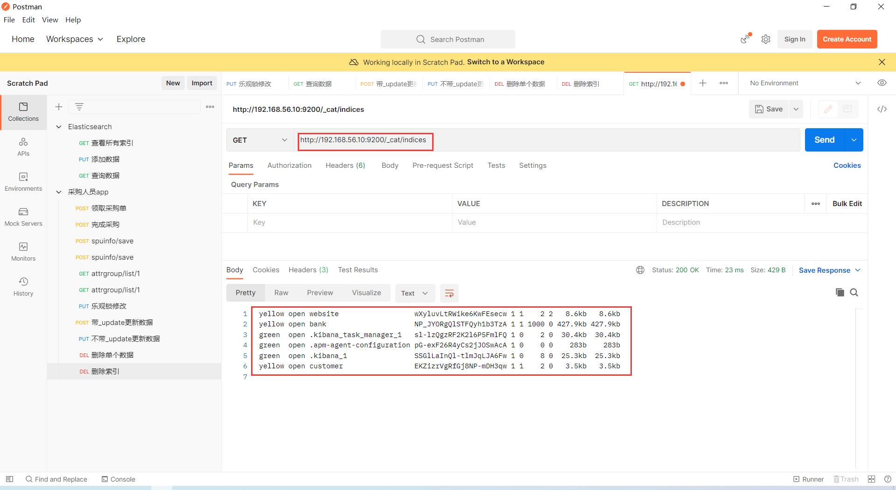


### 5.1.4、Elasticsearch进阶

参考文档：https://www.elastic.co/guide/en/elasticsearch/reference/7.5/getting-started-search.html


#### 1、基本方式检索

ES 支持两种基本方式检索 : 

- 一个是通过使用 REST request URI 发送搜索参数（uri+检索参数） 

- 另一个是通过使用 REST request body 来发送它们（uri+请求体)

请求命令

```json
GET /bank/_search
{
  "query": { "match_all": {} },
  "sort": [
    { "account_number": "asc" }
  ]
}
```

响应格式

```json
{
  "took" : 63,
  "timed_out" : false,
  "_shards" : {
    "total" : 5,
    "successful" : 5,
    "skipped" : 0,
    "failed" : 0
  },
  "hits" : {
    "total" : {
        "value": 1000,
        "relation": "eq"
    },
    "max_score" : null,
    "hits" : [ {
      "_index" : "bank",
      "_type" : "_doc",
      "_id" : "0",
      "sort": [0],
      "_score" : null,
      "_source" : {"account_number":0,"balance":16623,"firstname":"Bradshaw","lastname":"Mckenzie","age":29,"gender":"F","address":"244 Columbus Place","employer":"Euron","email":"bradshawmckenzie@euron.com","city":"Hobucken","state":"CO"}
    }, {
      "_index" : "bank",
      "_type" : "_doc",
      "_id" : "1",
      "sort": [1],
      "_score" : null,
      "_source" : {"account_number":1,"balance":39225,"firstname":"Amber","lastname":"Duke","age":32,"gender":"M","address":"880 Holmes Lane","employer":"Pyrami","email":"amberduke@pyrami.com","city":"Brogan","state":"IL"}
    }, ...
    ]
  }
}
```

> The response also provides the following information about the search request:
>
> - `took` – how long it took Elasticsearch to run the query, in milliseconds
> - `timed_out` – whether or not the search request timed out
> - `_shards` – how many shards were searched and a breakdown of how many shards succeeded, failed, or were skipped.
> - `max_score` – the score of the most relevant document found
> - `hits.total.value` - how many matching documents were found
> - `hits.sort` - the document’s sort position (when not sorting by relevance score)
> - `hits._score` - the document’s relevance score (not applicable when using `match_all`)

该响应还提供有关搜索请求的以下信息：

- `took`– Elasticsearch 运行查询需要多长时间，以毫秒为单位
- `timed_out`– 搜索请求是否超时
- `_shards`– 搜索了多少分片，以及多少分片成功、失败或被跳过的细分。
- `max_score`– 找到的最相关文档的分数
- `hits.total.value`- 找到了多少匹配的文档
- `hits.sort`- 文档的排序位置（不按相关性分数排序时）
- `hits._score`- 文档的相关性分数（使用时不适用`match_all`）

##### 1、使用`uri+检索参数`检索

> 通过使用 REST request URI 发送搜索参数（uri+检索参数）

在`kibana`中输入以下命令

```
GET bank/_search?q=*&sort=account_number:asc
```

`q=*`表示查询所有

`sort=account_number:asc`表示按照`account_number`升序排列

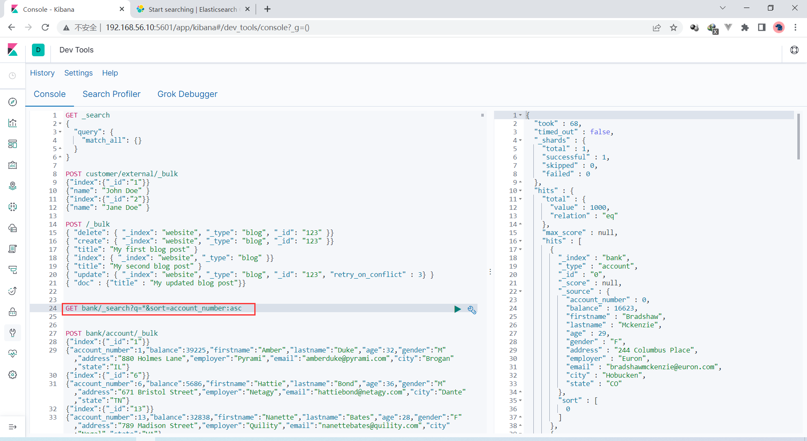

##### 2、使用`uri+请求体`检索

> 通过使用 REST request body 来发送它们（uri+请求体)

在`kibana`中输入以下命令

```json
GET /bank/_search
{
  "query": { "match_all": {} },
  "sort": [
    { "account_number": "asc" }
  ]
}
```

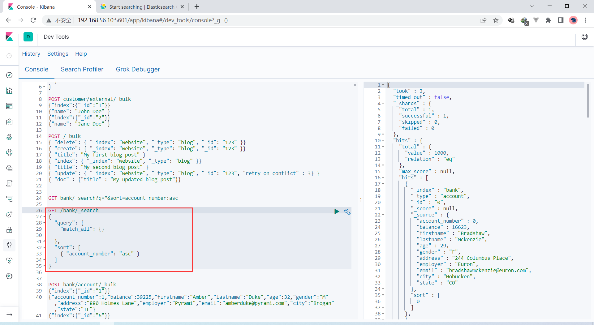

##### 3、排序查询

也可以先按`account_number`升序，再按`balance`降序

```json
GET /bank/_search
{
  "query": { 
    "match_all": {} 
    
  },
  "sort": [
    { "account_number": "asc" },
    {"balance": "desc"}
  ]
}
```

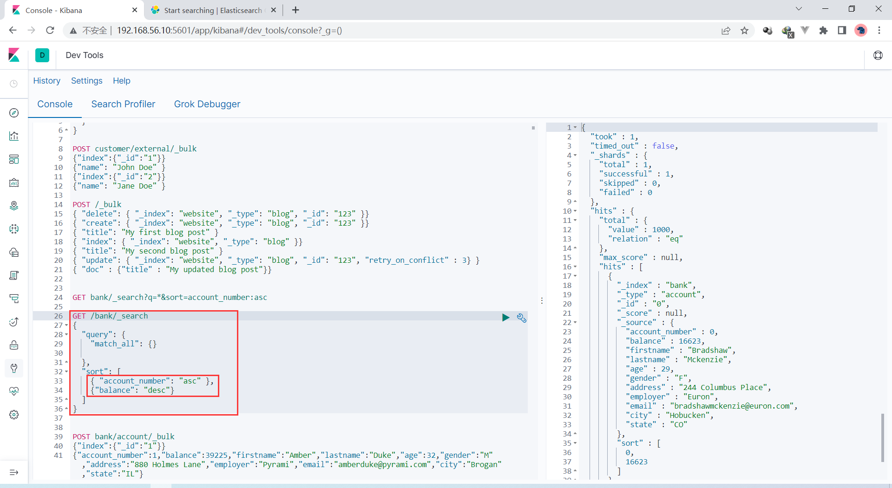

响应内容如下

```json
{
  "took" : 1,
  "timed_out" : false,
  "_shards" : {
    "total" : 1,
    "successful" : 1,
    "skipped" : 0,
    "failed" : 0
  },
  "hits" : {
    "total" : {
      "value" : 1000,
      "relation" : "eq"
    },
    "max_score" : null,
    "hits" : [
      {
        "_index" : "bank",
        "_type" : "account",
        "_id" : "0",
        "_score" : null,
        "_source" : {
          "account_number" : 0,
          "balance" : 16623,
          "firstname" : "Bradshaw",
          "lastname" : "Mckenzie",
          "age" : 29,
          "gender" : "F",
          "address" : "244 Columbus Place",
          "employer" : "Euron",
          "email" : "bradshawmckenzie@euron.com",
          "city" : "Hobucken",
          "state" : "CO"
        },
        "sort" : [
          0,
          16623
        ]
      },
      {
        "_index" : "bank",
        "_type" : "account",
        "_id" : "1",
        "_score" : null,
        "_source" : {
          "account_number" : 1,
          "balance" : 39225,
          "firstname" : "Amber",
          "lastname" : "Duke",
          "age" : 32,
          "gender" : "M",
          "address" : "880 Holmes Lane",
          "employer" : "Pyrami",
          "email" : "amberduke@pyrami.com",
          "city" : "Brogan",
          "state" : "IL"
        },
        "sort" : [
          1,
          39225
        ]
      },
      {
        "_index" : "bank",
        "_type" : "account",
        "_id" : "2",
        "_score" : null,
        "_source" : {
          "account_number" : 2,
          "balance" : 28838,
          "firstname" : "Roberta",
          "lastname" : "Bender",
          "age" : 22,
          "gender" : "F",
          "address" : "560 Kingsway Place",
          "employer" : "Chillium",
          "email" : "robertabender@chillium.com",
          "city" : "Bennett",
          "state" : "LA"
        },
        "sort" : [
          2,
          28838
        ]
      },
      {
        "_index" : "bank",
        "_type" : "account",
        "_id" : "3",
        "_score" : null,
        "_source" : {
          "account_number" : 3,
          "balance" : 44947,
          "firstname" : "Levine",
          "lastname" : "Burks",
          "age" : 26,
          "gender" : "F",
          "address" : "328 Wilson Avenue",
          "employer" : "Amtap",
          "email" : "levineburks@amtap.com",
          "city" : "Cochranville",
          "state" : "HI"
        },
        "sort" : [
          3,
          44947
        ]
      },
      {
        "_index" : "bank",
        "_type" : "account",
        "_id" : "4",
        "_score" : null,
        "_source" : {
          "account_number" : 4,
          "balance" : 27658,
          "firstname" : "Rodriquez",
          "lastname" : "Flores",
          "age" : 31,
          "gender" : "F",
          "address" : "986 Wyckoff Avenue",
          "employer" : "Tourmania",
          "email" : "rodriquezflores@tourmania.com",
          "city" : "Eastvale",
          "state" : "HI"
        },
        "sort" : [
          4,
          27658
        ]
      },
      {
        "_index" : "bank",
        "_type" : "account",
        "_id" : "5",
        "_score" : null,
        "_source" : {
          "account_number" : 5,
          "balance" : 29342,
          "firstname" : "Leola",
          "lastname" : "Stewart",
          "age" : 30,
          "gender" : "F",
          "address" : "311 Elm Place",
          "employer" : "Diginetic",
          "email" : "leolastewart@diginetic.com",
          "city" : "Fairview",
          "state" : "NJ"
        },
        "sort" : [
          5,
          29342
        ]
      },
      {
        "_index" : "bank",
        "_type" : "account",
        "_id" : "6",
        "_score" : null,
        "_source" : {
          "account_number" : 6,
          "balance" : 5686,
          "firstname" : "Hattie",
          "lastname" : "Bond",
          "age" : 36,
          "gender" : "M",
          "address" : "671 Bristol Street",
          "employer" : "Netagy",
          "email" : "hattiebond@netagy.com",
          "city" : "Dante",
          "state" : "TN"
        },
        "sort" : [
          6,
          5686
        ]
      },
      {
        "_index" : "bank",
        "_type" : "account",
        "_id" : "7",
        "_score" : null,
        "_source" : {
          "account_number" : 7,
          "balance" : 39121,
          "firstname" : "Levy",
          "lastname" : "Richard",
          "age" : 22,
          "gender" : "M",
          "address" : "820 Logan Street",
          "employer" : "Teraprene",
          "email" : "levyrichard@teraprene.com",
          "city" : "Shrewsbury",
          "state" : "MO"
        },
        "sort" : [
          7,
          39121
        ]
      },
      {
        "_index" : "bank",
        "_type" : "account",
        "_id" : "8",
        "_score" : null,
        "_source" : {
          "account_number" : 8,
          "balance" : 48868,
          "firstname" : "Jan",
          "lastname" : "Burns",
          "age" : 35,
          "gender" : "M",
          "address" : "699 Visitation Place",
          "employer" : "Glasstep",
          "email" : "janburns@glasstep.com",
          "city" : "Wakulla",
          "state" : "AZ"
        },
        "sort" : [
          8,
          48868
        ]
      },
      {
        "_index" : "bank",
        "_type" : "account",
        "_id" : "9",
        "_score" : null,
        "_source" : {
          "account_number" : 9,
          "balance" : 24776,
          "firstname" : "Opal",
          "lastname" : "Meadows",
          "age" : 39,
          "gender" : "M",
          "address" : "963 Neptune Avenue",
          "employer" : "Cedward",
          "email" : "opalmeadows@cedward.com",
          "city" : "Olney",
          "state" : "OH"
        },
        "sort" : [
          9,
          24776
        ]
      }
    ]
  }
}

```

##### 4、分页查询某些字段

`"from": 5,"size": 5,` ：从第5条数据开始，查询5条数据

`"_source": ["balance", "firstname"]` ：查询**balance**和 **firstname**字段

```json
GET bank/_search
{
  "query": {
    "match_all": {}
  },
  "sort": [
    {
      "balance": {
        "order": "desc"
      }
    }
  ],
  "from": 5,
  "size": 5,
  "_source": ["balance", "firstname"]
}
```

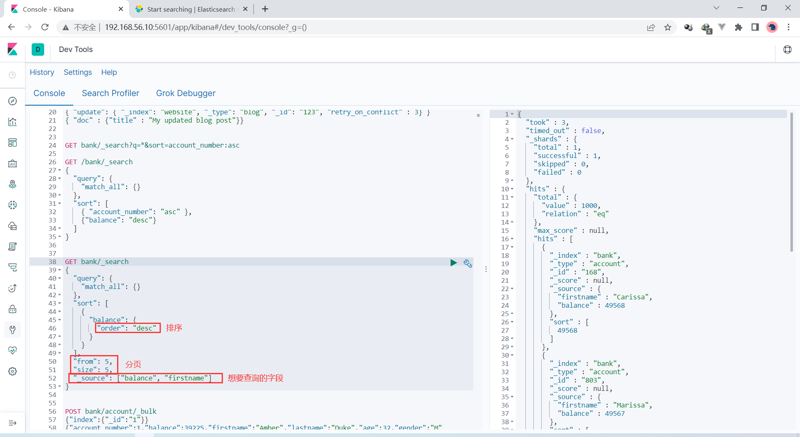

#### 2、`match`匹配查询

- **基本类型（非字符串），精确匹配**  -> `"account_number": "20"`match 返回 account_number=20 的

- **字符串，全文检索** -> `"address": "mill"`match 当搜索字符串类型的时候，会进行全文检索，并且每条记录有相关性得分。

- **字符串，多个单词（分词+全文检索）**-> `"address": "mill road"`最终查询出 address 中包含 mill 或者 road 或者 mill road 的所有记录，并给出相关性得分

##### 1、精确匹配

```json
GET bank/_search
{
  "query": {
    "match": {
      "account_number": 20
    }
  }
}
```

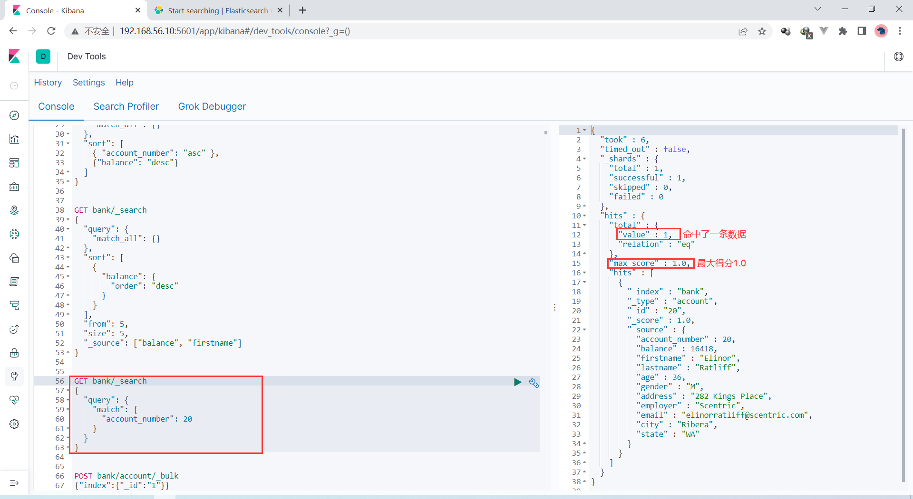

##### 2、模糊匹配1

```json
GET bank/_search
{
  "query": {
    "match": {
      "address": "Kings"
    }
  }
}
```

可以看到`address`中包含有`Kings`的都检索出来了


##### 3、模糊匹配2

```json
GET bank/_search
{
  "query": {
    "match": {
      "address": "mill lane"
    }
  }
}
```

可以看到，只要包含了`mill`或`lane`的都能查出来，其中`198 Mill Lane`的得分最高，默认按照**评分**由高到低排列 

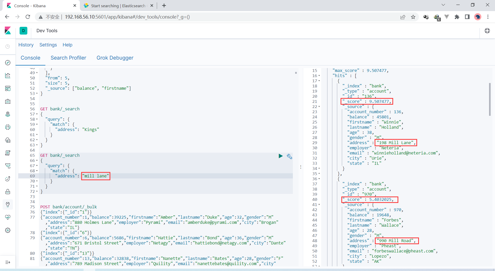

#### 3、`match_phrase`短语（不分词）匹配

将需要匹配的值当成一个整体单词（不分词）进行检索 -> `"address": "mill` 查出 address 中包含 mill road 的所有记录，并给出相关性得

```json
GET bank/_search
{
  "query": {
    "match_phrase": {
      "address": "mill lane"
    }
  }
}
```

此时只能查询出多个单词全存在的数据

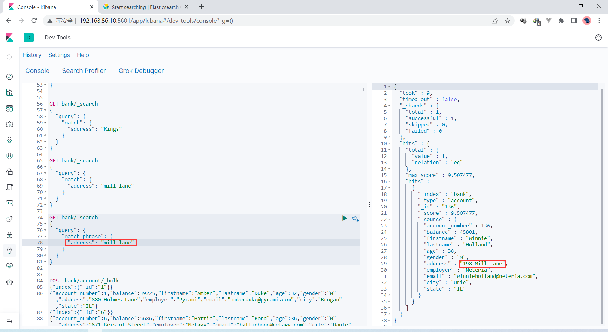

使用`match_phrase`匹配时必须指定字段包含该不分词的短语，但该字段不必须只包含该短语

```json
GET bank/_search
{
  "query": {
    "match_phrase": {
      "address": "789 Madison"
    }
  }
}
```


使用`FIELD.keyword`匹配必须指定字段为该不分词的短语

```json
GET bank/_search
{
  "query": {
    "match": {
      "address.keyword": "789 Madison"
    }
  }
}
```

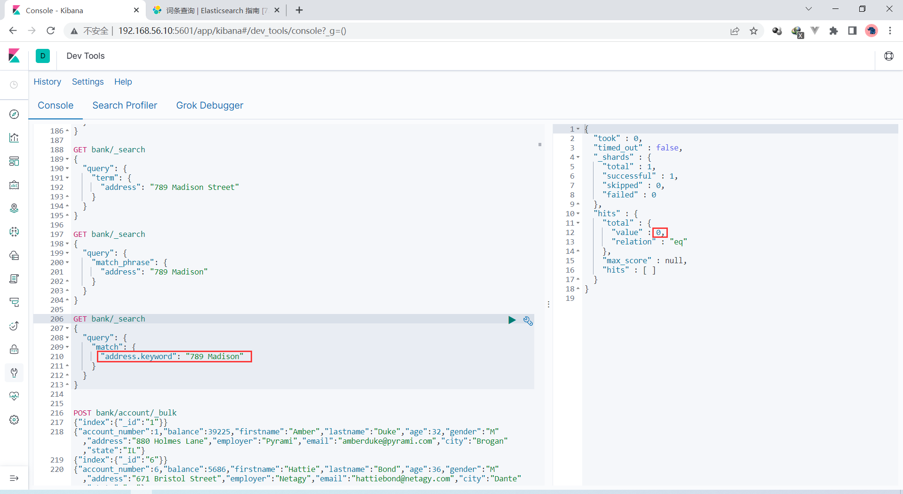

#### 4、`multi_match`多字段匹配

多个字段其中有任何一个字段匹配

```json
GET bank/_search
{
  "query": {
    "multi_match": {
      "query": "mill",
      "fields": ["address","city"]
    }
  }
}
```

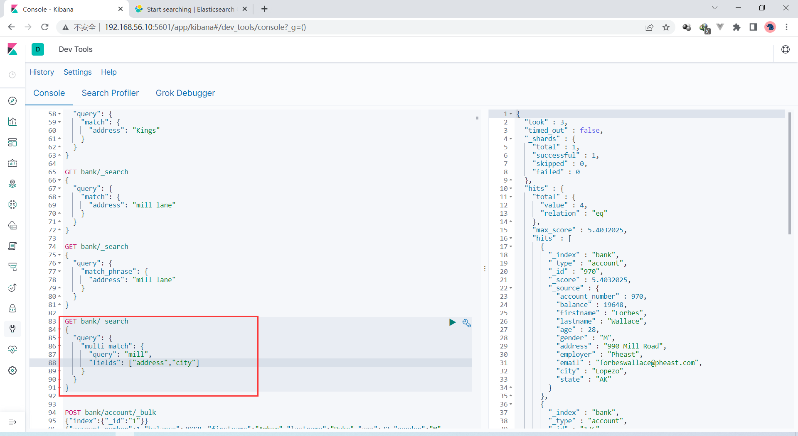

```json
GET bank/_search
{
  "query": {
    "multi_match": {
      "query": "mill movico",
      "fields": ["address","city"]
    }
  }
}
```

可以看到多字段匹配用的也是`match匹配查询`,也查询出了包含**分词**的所有数据；包含的分词越多，得分越高

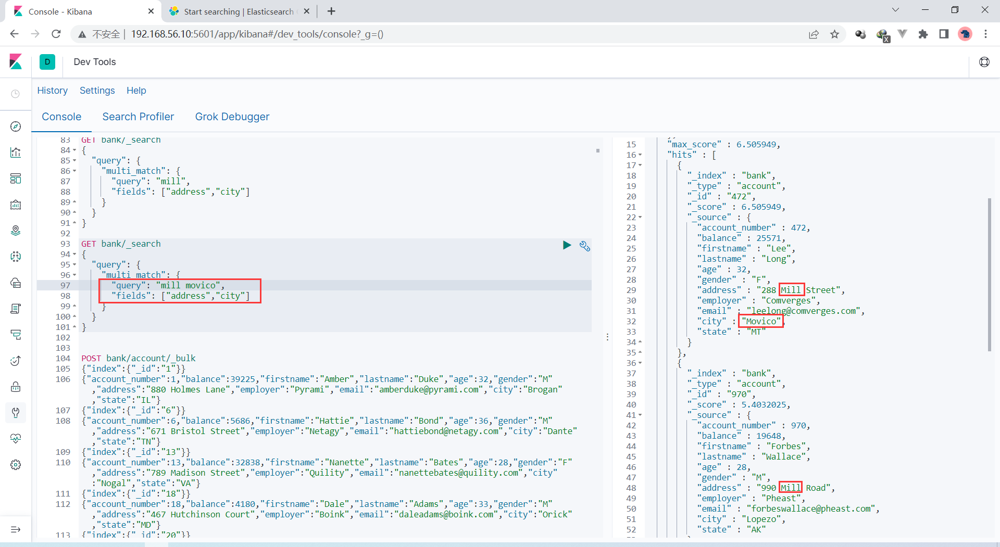

#### 5、`bool`复合查询

> To construct more complex queries, you can use a `bool` query to combine multiple query criteria. You can designate criteria as required (must match), desirable (should match), or undesirable (must not match).

要构造更复杂的查询，您可以使用一个`bool`查询来组合多个查询条件。您可以根据需要（必须匹配）、需要（应该匹配）或不需要（必须不匹配）指定条件。

bool 用来做复合查询： 复合语句可以合并任何 其它查询语句，包括复合语句，了解这一点是很重要的。这就意味着，复合语句之间可以互相嵌套，可以表达非常复杂的逻辑。

> Each `must`, `should`, and `must_not` element in a Boolean query is referred to as a query clause. How well a document meets the criteria in each `must` or `should` clause contributes to the document’s *relevance score*. The higher the score, the better the document matches your search criteria. By default, Elasticsearch returns documents ranked by these relevance scores.
>
> The criteria in a `must_not` clause is treated as a *filter*. It affects whether or not the document is included in the results, but does not contribute to how documents are scored. You can also explicitly specify arbitrary filters to include or exclude documents based on structured data.

布尔查询中的每个`must`、`should`和`must_not`元素都称为查询子句。文档满足每个**`must`或 `should`**子句中的标准的程度会**影响文档的*相关性评分***。分数越高，文档越符合您的搜索条件。默认情况下，Elasticsearch 返回按这些相关性分数排序的文档。

子句中的条件**`must_not`**被视为*过滤器*。它影响文档是否包含在结果中，但**不影响文档的评分**方式。您还可以显式指定任意过滤器以根据结构化数据包含或排除文档。

##### 1、必须满足&必须不满足

> must：必须达到 must 列举的所有条件

必须满足`"gender": "M"`和` "address": "mill"`  必须不满足 `"age": "38" `

```json
GET bank/_search
{
  "query": {
    "bool": {
      "must":[
        {"match": {
          "gender": "M" 
        }},
        {"match": {
          "address": "mill"
        }}
      ],
      "must_not":[
        {"match": {
          "age": "38" 
        }}
      ]
    }
  }
}
```

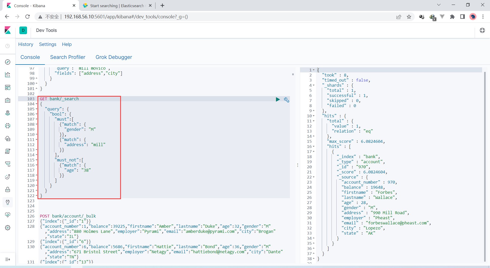

##### 2、应该匹配

> should：应该达到 should 列举的条件，如果达到会增加相关文档的评分，并不会改变查询的结果。如果 query 中只有 should 且只有一种匹配规则，那么 should 的条件就会被作为默认匹配条件而去改变查询结果

```json
GET bank/_search
{
  "query": {
    "bool": {
      "must":[
        {"match": {
          "gender": "M" 
        }},
        {"match": {
          "address": "mill"
        }}
      ],
      "must_not":[
        {"match": {
          "age": "18" 
        }}
      ],
      "should": [
        {"match": {
          "lastname": "Wallace"
        }}
      ]
    }
  }
}
```

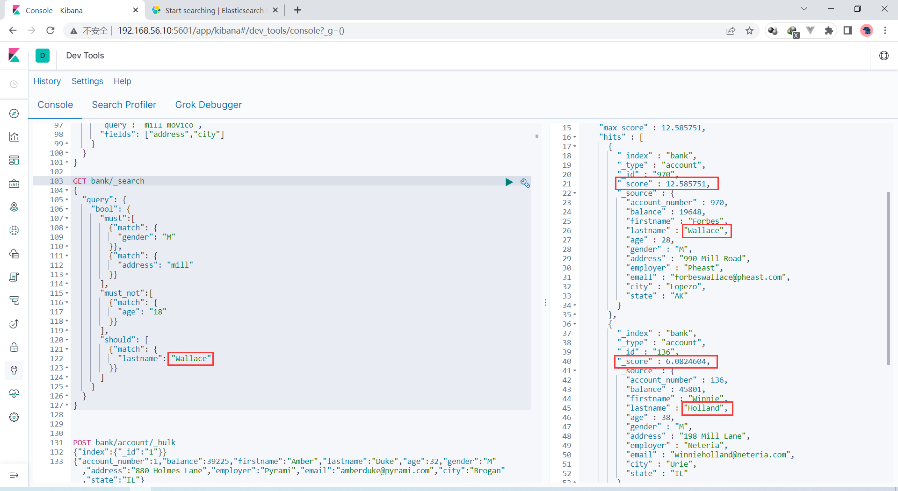

#### 6、`filter`结果过滤

可以看到使用`must`会有相关性得分

```json
GET bank/_search
{
  "query": {
    "bool": {
      "must": [
        {"range": {
            "age": {
              "gte": 18,
              "lte": 30
            }
          }
        },
        {"match": {
          "address": "mill"
        }}
      ]
    }
  }
}
```

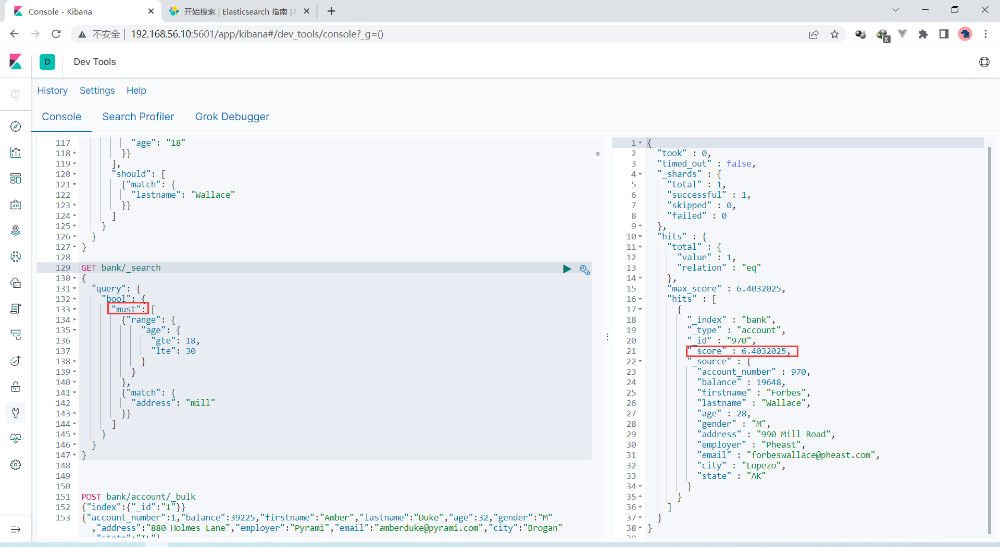

而使用`filter`没有相关性得分

```json
GET bank/_search
{
  "query": {
    "bool": {
      "filter": [
        {"range": {
            "age": {
              "gte": 18,
              "lte": 30
            }
          }
        },
        {"match": {
          "address": "mill"
        }}
      ]
    }
  }
}
```

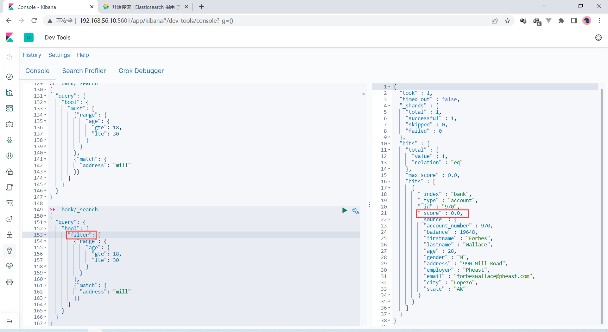

#### 7、`Term query`

`term`和`match`一样。匹配某个属性的值。全文检索字段用 match，其他非 text 字段匹配(精确的字段匹配)用 term。

参考文档： https://www.elastic.co/guide/en/elasticsearch/reference/7.5/query-dsl-term-query.html


**Term query**

> Returns documents that contain an **exact** term in a provided field.
>
> You can use the `term` query to find documents based on a precise value such as a price, a product ID, or a username.
>
> Avoid using the `term` query for [`text`](https://www.elastic.co/guide/en/elasticsearch/reference/7.5/text.html) fields.
>
> By default, Elasticsearch changes the values of `text` fields as part of [analysis](https://www.elastic.co/guide/en/elasticsearch/reference/7.5/analysis.html). This can make finding exact matches for `text` field values difficult.
>
> To search `text` field values, use the [`match`](https://www.elastic.co/guide/en/elasticsearch/reference/7.5/query-dsl-match-query.html) query instead.

**Term查询**

返回在提供的字段中包含**确切术语的文档。**

您可以使用`term`查询根据价格、产品 ID 或用户名等精确值查找文档。

避免使用字段`term`查询[`text`](https://www.elastic.co/guide/en/elasticsearch/reference/7.5/text.html)

默认情况下，Elasticsearch 会在[分析](https://www.elastic.co/guide/en/elasticsearch/reference/7.5/analysis.html)`text`过程中更改字段的值。这会使查找字段值的精确匹配变得困难`text`

要搜索`text`字段值，请改用[`match`](https://www.elastic.co/guide/en/elasticsearch/reference/7.5/query-dsl-match-query.html)查询。


使用`match`可以查询`"age": "28"`的数据

```json
GET bank/_search
{
  "query": {
    "match": {
      "age": "28"
    }
  }
}
```

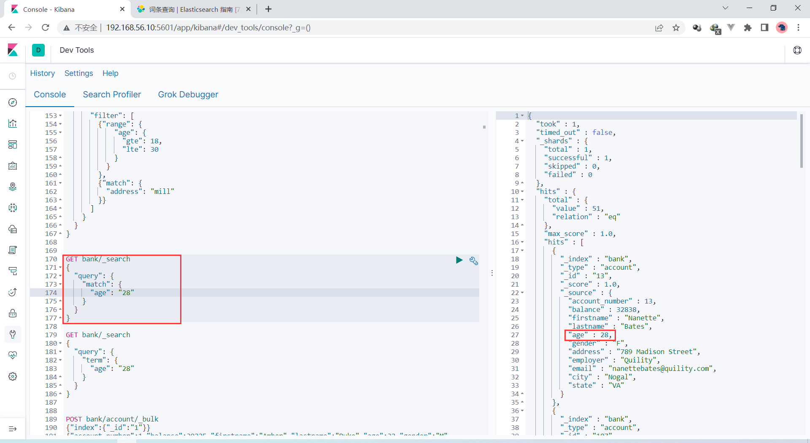

使用`term`也可以查询`"age": "28"`的数据，推荐使用`term`

```json
GET bank/_search
{
  "query": {
    "term": {
      "age": "28"
    }
  }
}
```

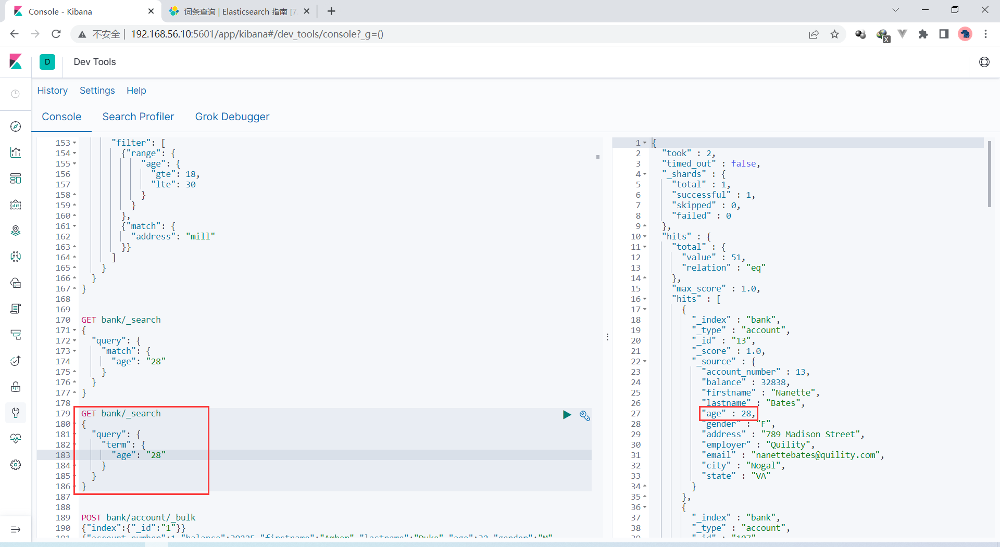

使用`term`查询多字段`text`会查询不到

```json
GET bank/_search
{
  "query": {
    "term": {
      "address": "789 Madison Street"
    }
  }
}
```

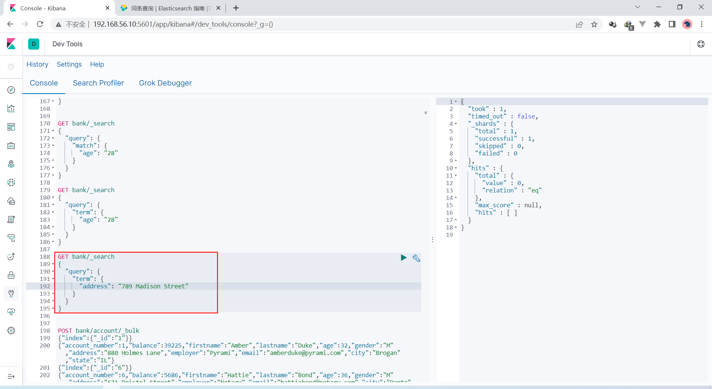

#### 8、`aggregations`执行聚合

参考文档： https://www.elastic.co/guide/en/elasticsearch/reference/7.5/search-aggregations.html

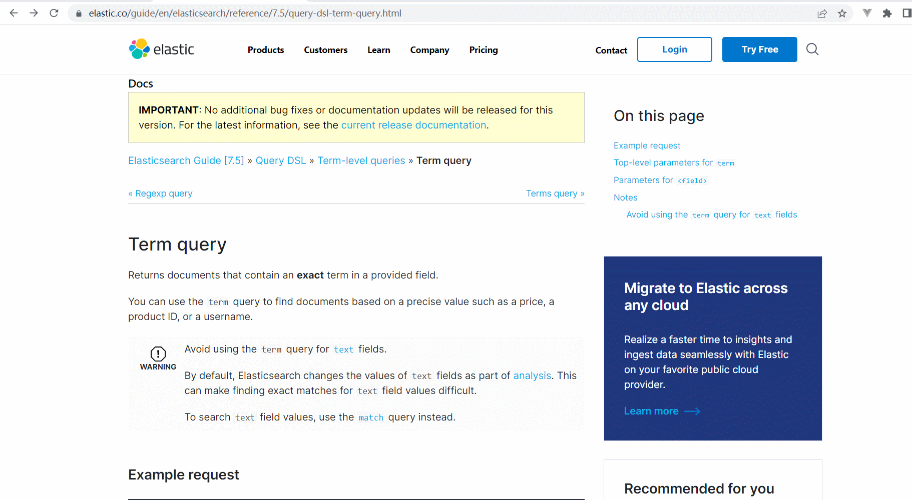

> The aggregations framework helps provide aggregated data based on a search query. It is based on simple building blocks called aggregations, that can be composed in order to build complex summaries of the data.
>
> An aggregation can be seen as a *unit-of-work* that builds analytic information over a set of documents. The context of the execution defines what this document set is (e.g. a top-level aggregation executes within the context of the executed query/filters of the search request).
>
> There are many different types of aggregations, each with its own purpose and output. To better understand these types, it is often easier to break them into four main families:
>
> - **[\*Bucketing\*](https://www.elastic.co/guide/en/elasticsearch/reference/7.5/search-aggregations-bucket.html)**
>
>   A family of aggregations that build buckets, where each bucket is associated with a *key* and a document criterion. When the aggregation is executed, all the buckets criteria are evaluated on every document in the context and when a criterion matches, the document is considered to "fall in" the relevant bucket. By the end of the aggregation process, we’ll end up with a list of buckets - each one with a set of documents that "belong" to it.
>
> - **[\*Metric\*](https://www.elastic.co/guide/en/elasticsearch/reference/7.5/search-aggregations-metrics.html)**
>
>   Aggregations that keep track and compute metrics over a set of documents.
>
> - **[\*Matrix\*](https://www.elastic.co/guide/en/elasticsearch/reference/7.5/search-aggregations-matrix.html)**
>
>   A family of aggregations that operate on multiple fields and produce a matrix result based on the values extracted from the requested document fields. Unlike metric and bucket aggregations, this aggregation family does not yet support scripting.
>
> - **[\*Pipeline\*](https://www.elastic.co/guide/en/elasticsearch/reference/7.5/search-aggregations-pipeline.html)**
>
>   Aggregations that aggregate the output of other aggregations and their associated metrics
>
> The interesting part comes next. Since each bucket effectively defines a document set (all documents belonging to the bucket), one can potentially associate aggregations on the bucket level, and those will execute within the context of that bucket. This is where the real power of aggregations kicks in: **aggregations can be nested!**

聚合框架有助于提供基于搜索查询的聚合数据。它基于称为聚合的简单构建块，可以组合这些块以构建复杂的数据摘要。

聚合可以看作是在一组文档上构建分析信息*的工作单元。*执行的上下文定义了该文档集是什么（例如，顶级聚合在搜索请求的已执行查询/过滤器的上下文中执行）。

有许多不同类型的聚合，每种都有自己的目的和输出。为了更好地理解这些类型，通常更容易将它们分为四个主要系列：

- **[\*分桶\*](https://www.elastic.co/guide/en/elasticsearch/reference/7.5/search-aggregations-bucket.html)**：构建存储桶的聚合系列，其中每个存储桶都与一个*键*和一个文档标准相关联。执行聚合时，将对上下文中的每个文档评估所有存储桶标准，并且当标准匹配时，该文档被认为“落入”相关存储桶中。在聚合过程结束时，我们将得到一个桶列表——每个桶都有一组“属于”它的文档。
- **[\*公制\*](https://www.elastic.co/guide/en/elasticsearch/reference/7.5/search-aggregations-metrics.html)**：跟踪和计算一组文档的指标的聚合。
- **[\*矩阵\*](https://www.elastic.co/guide/en/elasticsearch/reference/7.5/search-aggregations-matrix.html)**：对多个字段进行操作并根据从请求的文档字段中提取的值生成矩阵结果的聚合系列。与度量和桶聚合不同，这个聚合系列还不支持脚本。
- **[\*管道\*](https://www.elastic.co/guide/en/elasticsearch/reference/7.5/search-aggregations-pipeline.html)**：聚合其他聚合及其相关指标的输出的聚合

接下来是有趣的部分。由于每个存储桶有效地定义了一个文档集（属于该存储桶的所有文档），因此可以潜在地将存储桶级别的聚合关联起来，并且这些聚合将在该存储桶的上下文中执行。这就是聚合真正强大的地方：**聚合可以嵌套！**

分桶聚合可以有子聚合（分桶或度量）。将为它们的父聚合生成的桶计算子聚合。嵌套聚合的级别/深度没有硬性限制（可以将聚合嵌套在“父”聚合下，该聚合本身是另一个更高级别聚合的子聚合）。

聚合对`double`数据的表示进行操作。因此，在绝对值大于 的 long 上运行时，结果可能是近似的`2^53`。

**结构化聚合**

以下代码片段捕获了聚合的基本结构：

```js
"aggregations" : {
    "<aggregation_name>" : {
        "<aggregation_type>" : {
            <aggregation_body>
        }
        [,"meta" : {  [<meta_data_body>] } ]?
        [,"aggregations" : { [<sub_aggregation>]+ } ]?
    }
    [,"<aggregation_name_2>" : { ... } ]*
}
```

JSON 中的`aggregations`对象（`aggs`也可以使用键）保存要计算的聚合。每个聚合都与用户定义的逻辑名称相关联（例如，如果聚合计算平均价格，那么命名它是有意义的`avg_price`）。这些逻辑名称也将用于唯一标识响应中的聚合。每个聚合都有一个特定的类型（`<aggregation_type>`在上面的代码片段中），并且通常是命名聚合体中的第一个键。每种类型的聚合都定义了自己的主体，具体取决于聚合的性质（例如`avg`特定字段的聚合将定义计算平均值的字段）。在聚合类型定义的同一级别，可以选择定义一组附加聚合，尽管这仅在您定义的聚合具有分桶性质时才有意义。在这种情况下，您在桶聚合级别上定义的子聚合将为桶聚合构建的所有桶计算。例如，如果您在聚合下定义了一组`range`聚合，则将为定义的范围存储桶计算子聚合。

**解释：**

聚合提供了从数据中分组和提取数据的能力。最简单的聚合方法大致等于 SQL GROUP BY 和 SQL 聚合函数。在 Elasticsearch 中，您有执行搜索返回 hits（命中结果），并且同时返 回聚合结果，把一个响应中的所有 hits（命中结果）分隔开的能力。这是非常强大且有效的， 您可以执行查询和多个聚合，并且在一次使用中得到各自的（任何一个的）返回结果，使用 一次简洁和简化的 API 来避免网络往返。

##### 1、简单聚合

   **搜索 address 中包含 mill 的所有人的年龄分布以及平均年龄，但不显示这些人的详情。**

1. 搜索 address 中包含 mill的

```json
GET bank/_search
{ 
  "query": { 
    "match": { 
      "address": "mill"
    }
  }
}
```

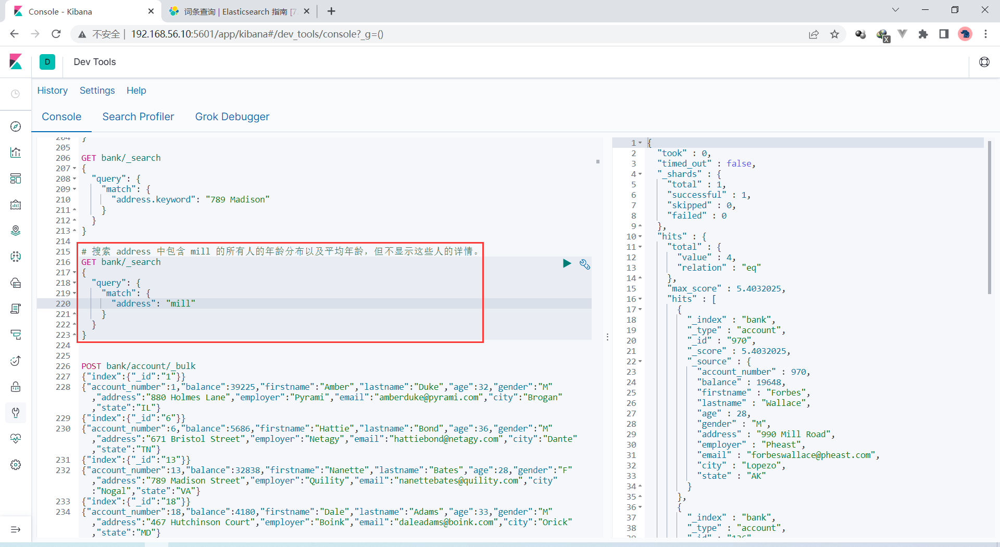

2. 搜索 address 中包含 mill 的所有人的年龄分布

```json
GET bank/_search
{ 
  "query": { 
    "match": { 
      "address": "mill"
    }
  },
  "aggs": {
    "age_agg": { 
      "terms": { 
        "field": "age"
      }
    }
  }
}
```

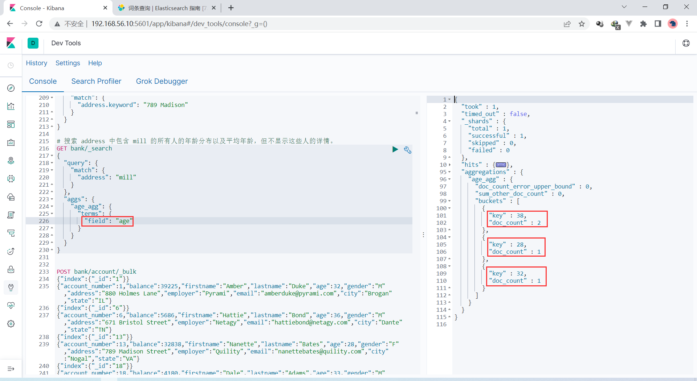

3. 搜索 address 中包含 mill 的所有人的年龄分布以及平均年龄

```json
GET bank/_search
{ 
  "query": { 
    "match": { 
      "address": "mill"
    }
  },
  "aggs": {
    "age_agg": { 
      "terms": { 
        "field": "age"
      }
    },
    "avg_age": {
      "avg": {
        "field": "age"
      }
    }
  }
}
```

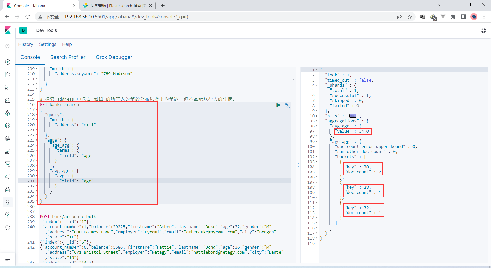

4. 搜索 address 中包含 mill 的所有人的年龄分布以及平均年龄，但不显示这些人的详情。

```json
GET bank/_search
{ 
  "query": { 
    "match": { 
      "address": "mill"
    }
  },
  "aggs": {
    "age_agg": { 
      "terms": { 
        "field": "age"
      }
    },
    "avg_age": {
      "avg": {
        "field": "age"
      }
    }
  },
  "size": 0
}
```

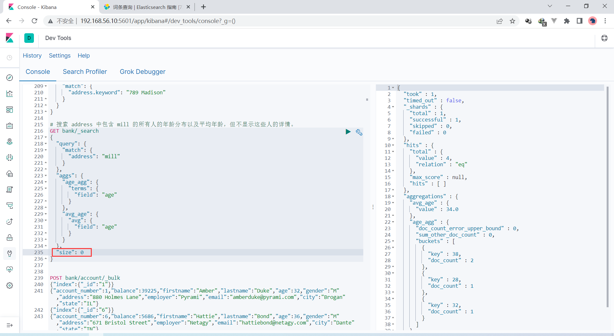

size：0 不显示搜索数据 

aggs：执行聚合。

聚合语法如下

```json
 "aggs": { 
 	"aggs_name 这次聚合的名字，方便展示在结果集中": 
 		{ "AGG_TYPE 聚合的类型（avg,term,terms）": {} 
 		} 
 	},
```

##### 2、复杂聚合1

按照年龄聚合，并且请求这些年龄段的这些人的平均薪资

```json
GET bank/account/_search
{
  "query": {
    "match_all": {}
  },
  "aggs": {
    "age_avg": {
      "terms": {
        "field": "age",
        "size": 1000
      },
      "aggs": {
        "banlances_avg": {
          "avg": {
            "field": "balance"
          }
        }
      }
    }
  }
  ,"size": 1000
}
```

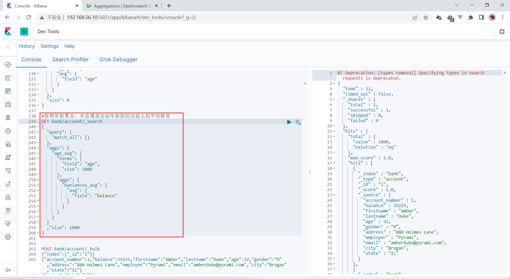

##### 3、复杂聚合2

查出**所有年龄分布**，并且这些年龄段中**性别为 M 的平均薪资**和 **性别为F 的平均薪资**以及**这个年龄段的总体平均薪资**

```json
GET bank/_search
{
  "query": {
    "match_all": {}
  },
  "aggs": {
    "age_agg": {
      "terms": {
        "field": "age",
        "size": 100
      },
      "aggs": {
        "balance_agg": {
          "terms": {
            "field": "gender.keyword",
            "size": 100
          },
          "aggs": {
            "balance_avg": {
              "avg": {
                "field": "balance"
              }
            }
          }
        },
        "balance_agg2": {
          "avg": {
            "field": "balance"
          }
        }
      }
    }
  }
}
```

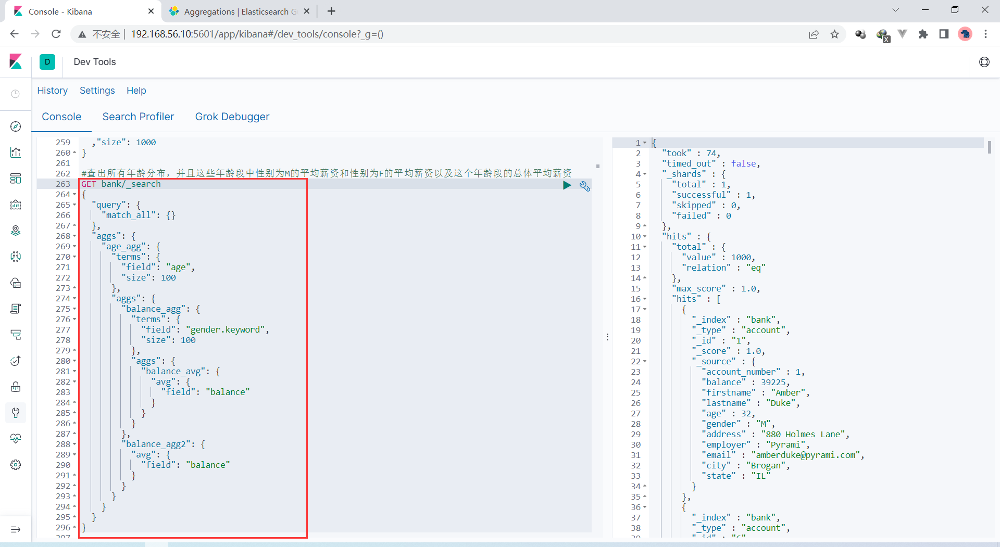

### 5.1.5、Elasticsearch映射

参考文档： https://www.elastic.co/guide/en/elasticsearch/reference/7.5/mapping.html

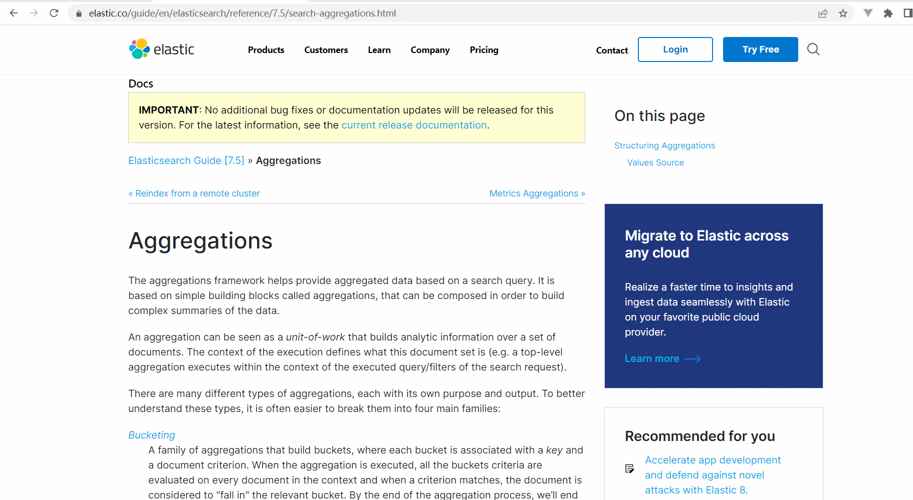

> Mapping is the process of defining how a document, and the fields it contains, are stored and indexed. For instance, use mappings to define:
>
> - which string fields should be treated as full text fields.
> - which fields contain numbers, dates, or geolocations.
> - the [format](https://www.elastic.co/guide/en/elasticsearch/reference/7.5/mapping-date-format.html) of date values.
> - custom rules to control the mapping for [dynamically added fields](https://www.elastic.co/guide/en/elasticsearch/reference/7.5/dynamic-mapping.html).
>
> A mapping definition has:
>
> - **[Meta-fields](https://www.elastic.co/guide/en/elasticsearch/reference/7.5/mapping-fields.html)**
>
>   Meta-fields are used to customize how a document’s metadata associated is treated. Examples of meta-fields include the document’s [`_index`](https://www.elastic.co/guide/en/elasticsearch/reference/7.5/mapping-index-field.html), [`_id`](https://www.elastic.co/guide/en/elasticsearch/reference/7.5/mapping-id-field.html), and [`_source`](https://www.elastic.co/guide/en/elasticsearch/reference/7.5/mapping-source-field.html) fields.
>
> - **[Fields](https://www.elastic.co/guide/en/elasticsearch/reference/7.5/mapping-types.html) or \*properties\***
>
>   A mapping contains a list of fields or `properties` pertinent to the document.
>
> Each field has a data `type` which can be:
>
> - a simple type like [`text`](https://www.elastic.co/guide/en/elasticsearch/reference/7.5/text.html), [`keyword`](https://www.elastic.co/guide/en/elasticsearch/reference/7.5/keyword.html), [`date`](https://www.elastic.co/guide/en/elasticsearch/reference/7.5/date.html), [`long`](https://www.elastic.co/guide/en/elasticsearch/reference/7.5/number.html), [`double`](https://www.elastic.co/guide/en/elasticsearch/reference/7.5/number.html), [`boolean`](https://www.elastic.co/guide/en/elasticsearch/reference/7.5/boolean.html) or [`ip`](https://www.elastic.co/guide/en/elasticsearch/reference/7.5/ip.html).
> - a type which supports the hierarchical nature of JSON such as [`object`](https://www.elastic.co/guide/en/elasticsearch/reference/7.5/object.html) or [`nested`](https://www.elastic.co/guide/en/elasticsearch/reference/7.5/nested.html).
> - or a specialised type like [`geo_point`](https://www.elastic.co/guide/en/elasticsearch/reference/7.5/geo-point.html), [`geo_shape`](https://www.elastic.co/guide/en/elasticsearch/reference/7.5/geo-shape.html), or [`completion`](https://www.elastic.co/guide/en/elasticsearch/reference/7.5/search-suggesters.html#completion-suggester).
>
> It is often useful to index the same field in different ways for different purposes. For instance, a `string` field could be [indexed](https://www.elastic.co/guide/en/elasticsearch/reference/7.5/mapping-index.html) as a `text` field for full-text search, and as a `keyword` field for sorting or aggregations. Alternatively, you could index a string field with the [`standard` analyzer](https://www.elastic.co/guide/en/elasticsearch/reference/7.5/analysis-standard-analyzer.html), the [`english`](https://www.elastic.co/guide/en/elasticsearch/reference/7.5/analysis-lang-analyzer.html#english-analyzer) analyzer, and the [`french` analyzer](https://www.elastic.co/guide/en/elasticsearch/reference/7.5/analysis-lang-analyzer.html#french-analyzer).
>
> This is the purpose of *multi-fields*. Most datatypes support multi-fields via the [`fields`](https://www.elastic.co/guide/en/elasticsearch/reference/7.5/multi-fields.html) parameter.

映射是定义文档及其包含的字段如何存储和索引的过程。例如，使用映射来定义：

- 哪些字符串字段应被视为全文字段。
- 哪些字段包含数字、日期或地理位置。
- 日期值的[格式](https://www.elastic.co/guide/en/elasticsearch/reference/7.5/mapping-date-format.html)。
- 自定义规则来控制 [动态添加字段](https://www.elastic.co/guide/en/elasticsearch/reference/7.5/dynamic-mapping.html)的映射。

映射定义具有：

- **[元字段](https://www.elastic.co/guide/en/elasticsearch/reference/7.5/mapping-fields.html)**：元字段用于自定义如何处理文档的相关元数据。元字段的示例包括文档的 [`_index`](https://www.elastic.co/guide/en/elasticsearch/reference/7.5/mapping-index-field.html)、[`_id`](https://www.elastic.co/guide/en/elasticsearch/reference/7.5/mapping-id-field.html)和 [`_source`](https://www.elastic.co/guide/en/elasticsearch/reference/7.5/mapping-source-field.html)字段。
- **[字段](https://www.elastic.co/guide/en/elasticsearch/reference/7.5/mapping-types.html)或属性**：映射包含`properties`与文档相关的字段列表。

每个字段都有一个数据`type`，可以是：

- 一个简单的类型，如[`text`](https://www.elastic.co/guide/en/elasticsearch/reference/7.5/text.html), [`keyword`](https://www.elastic.co/guide/en/elasticsearch/reference/7.5/keyword.html), [`date`](https://www.elastic.co/guide/en/elasticsearch/reference/7.5/date.html), [`long`](https://www.elastic.co/guide/en/elasticsearch/reference/7.5/number.html), [`double`](https://www.elastic.co/guide/en/elasticsearch/reference/7.5/number.html),[`boolean`](https://www.elastic.co/guide/en/elasticsearch/reference/7.5/boolean.html)或[`ip`](https://www.elastic.co/guide/en/elasticsearch/reference/7.5/ip.html).
- 一种支持 JSON 分层特性的类型，例如 [`object`](https://www.elastic.co/guide/en/elasticsearch/reference/7.5/object.html)或[`nested`](https://www.elastic.co/guide/en/elasticsearch/reference/7.5/nested.html).
- 或特殊类型，如[`geo_point`](https://www.elastic.co/guide/en/elasticsearch/reference/7.5/geo-point.html), [`geo_shape`](https://www.elastic.co/guide/en/elasticsearch/reference/7.5/geo-shape.html)或[`completion`](https://www.elastic.co/guide/en/elasticsearch/reference/7.5/search-suggesters.html#completion-suggester).

出于不同目的以不同方式索引同一字段通常很有用。例如，一个`string`字段可以被[索引](https://www.elastic.co/guide/en/elasticsearch/reference/7.5/mapping-index.html)为一个`text`用于全文搜索的字段，也可以作为一个`keyword`用于排序或聚合的字段。[`standard`或者，您可以使用分析器](https://www.elastic.co/guide/en/elasticsearch/reference/7.5/analysis-standard-analyzer.html)、 [`english`](https://www.elastic.co/guide/en/elasticsearch/reference/7.5/analysis-lang-analyzer.html#english-analyzer)分析器和 [`french`分析器](https://www.elastic.co/guide/en/elasticsearch/reference/7.5/analysis-lang-analyzer.html#french-analyzer)索引字符串字段。

这就是*多领域*的目的。[`fields`](https://www.elastic.co/guide/en/elasticsearch/reference/7.5/multi-fields.html)大多数数据类型通过参数支持多字段。

#### 1、查询映射

> **View the mapping of an index**
>
> You can use the [get mapping](https://www.elastic.co/guide/en/elasticsearch/reference/7.5/indices-get-mapping.html) API to view the mapping of an existing index.


```console
GET bank/_mapping
```

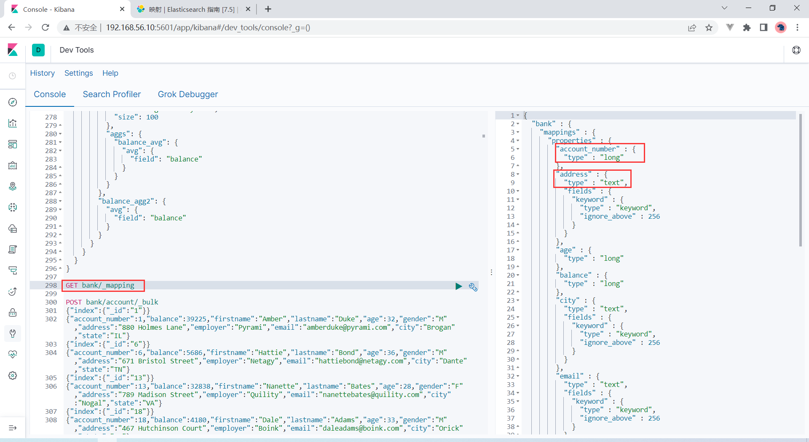

#### 2、创建索引

新特性：Es7 及以上移除了 type 的概念。 

关系型数据库中两个数据表示是独立的，即使他们里面有相同名称的列也不影响使用， 但 ES 中不是这样的。elasticsearch 是基于 Lucene 开发的搜索引擎，而 ES 中不同 type 下名称相同的 filed 最终在 Lucene 中的处理方式是一样的。

- 两个不同 type 下的两个 user_name，在 ES 同一个索引下其实被认为是同一个 filed， 你必须在两个不同的 type 中定义相同的 filed 映射。否则，不同 type 中的相同字段 名称就会在处理中出现冲突的情况，导致 Lucene 处理效率下降。 
- 去掉 type 就是为了提高 ES 处理数据的效率。

数据类型参考文档： https://www.elastic.co/guide/en/elasticsearch/reference/7.5/mapping-types.html

**Core datatypes**

- **string**：[`text`](https://www.elastic.co/guide/en/elasticsearch/reference/7.5/text.html) and [`keyword`](https://www.elastic.co/guide/en/elasticsearch/reference/7.5/keyword.html)
- **[Numeric](https://www.elastic.co/guide/en/elasticsearch/reference/7.5/number.html)**：`long`, `integer`, `short`, `byte`, `double`, `float`, `half_float`, `scaled_float`
- **[Date](https://www.elastic.co/guide/en/elasticsearch/reference/7.5/date.html)**：`date`
- **[Date nanoseconds](https://www.elastic.co/guide/en/elasticsearch/reference/7.5/date_nanos.html)**：`date_nanos`
- **[Boolean](https://www.elastic.co/guide/en/elasticsearch/reference/7.5/boolean.html)**：`boolean`
- **[Binary](https://www.elastic.co/guide/en/elasticsearch/reference/7.5/binary.html)**：`binary`
- **[Range](https://www.elastic.co/guide/en/elasticsearch/reference/7.5/range.html)**：`integer_range`, `float_range`, `long_range`, `double_range`, `date_range`

**Complex datatypes**

- **[Object](https://www.elastic.co/guide/en/elasticsearch/reference/7.5/object.html)**：`object` for single JSON objects
- **[Nested](https://www.elastic.co/guide/en/elasticsearch/reference/7.5/nested.html)**：`nested` for arrays of JSON objects

**Geo datatypes**

- **[Geo-point](https://www.elastic.co/guide/en/elasticsearch/reference/7.5/geo-point.html)**：`geo_point` for lat/lon points
- **[Geo-shape](https://www.elastic.co/guide/en/elasticsearch/reference/7.5/geo-shape.html)**：`geo_shape` for complex shapes like polygons

**Specialised datatypes**

- **[IP](https://www.elastic.co/guide/en/elasticsearch/reference/7.5/ip.html)**：`ip` for IPv4 and IPv6 addresses
- **[Completion datatype](https://www.elastic.co/guide/en/elasticsearch/reference/7.5/search-suggesters.html#completion-suggester)**：`completion` to provide auto-complete suggestions
- **[Token count](https://www.elastic.co/guide/en/elasticsearch/reference/7.5/token-count.html)**：`token_count` to count the number of tokens in a string
- **[`mapper-murmur3`](https://www.elastic.co/guide/en/elasticsearch/plugins/7.5/mapper-murmur3.html)**：`murmur3` to compute hashes of values at index-time and store them in the index
- **[`mapper-annotated-text`](https://www.elastic.co/guide/en/elasticsearch/plugins/7.5/mapper-annotated-text.html)**：`annotated-text` to index text containing special markup (typically used for identifying named entities)
- **[Percolator](https://www.elastic.co/guide/en/elasticsearch/reference/7.5/percolator.html)**：Accepts queries from the query-dsl
- **[Join](https://www.elastic.co/guide/en/elasticsearch/reference/7.5/parent-join.html)**：Defines parent/child relation for documents within the same index
- **[Rank feature](https://www.elastic.co/guide/en/elasticsearch/reference/7.5/rank-feature.html)**：Record numeric feature to boost hits at query time.
- **[Rank features](https://www.elastic.co/guide/en/elasticsearch/reference/7.5/rank-features.html)**：Record numeric features to boost hits at query time.
- **[Dense vector](https://www.elastic.co/guide/en/elasticsearch/reference/7.5/dense-vector.html)**：Record dense vectors of float values.
- **[Sparse vector](https://www.elastic.co/guide/en/elasticsearch/reference/7.5/sparse-vector.html)**：Record sparse vectors of float values.
- **[Search-as-you-type](https://www.elastic.co/guide/en/elasticsearch/reference/7.5/search-as-you-type.html)**：A text-like field optimized for queries to implement as-you-type completion
- **[Alias](https://www.elastic.co/guide/en/elasticsearch/reference/7.5/alias.html)**：Defines an alias to an existing field.
- **[Flattened](https://www.elastic.co/guide/en/elasticsearch/reference/7.5/flattened.html)**：Allows an entire JSON object to be indexed as a single field.
- **[Shape](https://www.elastic.co/guide/en/elasticsearch/reference/7.5/shape.html)**：`shape` for arbitrary cartesian geometries.

**Arrays**

In Elasticsearch, arrays do not require a dedicated field datatype. Any field can contain zero or more values by default, however, all values in the array must be of the same datatype. See [Arrays](https://www.elastic.co/guide/en/elasticsearch/reference/7.5/array.html).

**Multi-fields**

It is often useful to index the same field in different ways for different purposes. For instance, a `string` field could be mapped as a `text` field for full-text search, and as a `keyword` field for sorting or aggregations. Alternatively, you could index a text field with the [`standard` analyzer](https://www.elastic.co/guide/en/elasticsearch/reference/7.5/analysis-standard-analyzer.html), the [`english`](https://www.elastic.co/guide/en/elasticsearch/reference/7.5/analysis-lang-analyzer.html#english-analyzer) analyzer, and the [`french` analyzer](https://www.elastic.co/guide/en/elasticsearch/reference/7.5/analysis-lang-analyzer.html#french-analyzer).

This is the purpose of *multi-fields*. Most datatypes support multi-fields via the [`fields`](https://www.elastic.co/guide/en/elasticsearch/reference/7.5/multi-fields.html) parameter.


>  Create an index with an explicit mapping
>
> You can use the [create index](https://www.elastic.co/guide/en/elasticsearch/reference/7.5/indices-create-index.html) API to create a new index with an explicit mapping.

```json
PUT /my_index
{
  "mappings": {
    "properties": {
      "age":    { "type": "integer" },  
      "email":  { "type": "keyword"  }, 
      "name":   { "type": "text"  }     
    }
  }
}
```

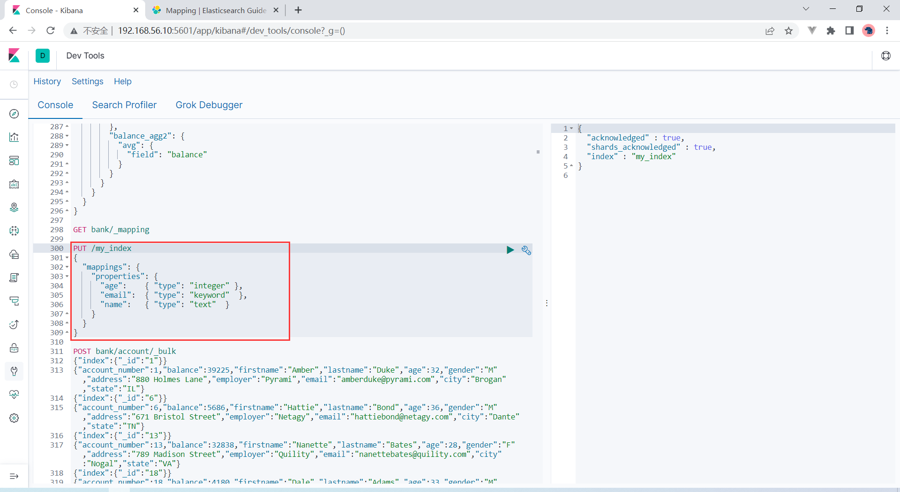

#### 3、添加新的字段映射

>  **Add a field to an existing mapping**
>
> You can use the [put mapping](https://www.elastic.co/guide/en/elasticsearch/reference/7.5/indices-put-mapping.html) API to add one or more new fields to an existing index.
>
> The following example adds `employee-id`, a `keyword` field with an [`index`](https://www.elastic.co/guide/en/elasticsearch/reference/7.5/mapping-index.html) mapping parameter value of `false`. This means values for the `employee-id` field are stored but not indexed or available for search.


```json
PUT /my_index/_mapping
{
  "properties": {
    "employee-id": {
      "type": "keyword",
      "index": false
    }
  }
}
```

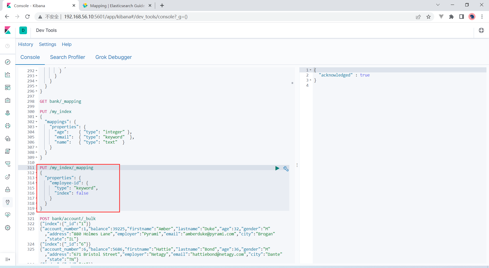

#### 4、更新映射

> **Update the mapping of a field**
>
> Except for supported [mapping parameters](https://www.elastic.co/guide/en/elasticsearch/reference/7.5/mapping-params.html), you can’t change the mapping or field type of an existing field. Changing an existing field could invalidate data that’s already indexed.
>
> If you need to change the mapping of a field, create a new index with the correct mapping and [reindex](https://www.elastic.co/guide/en/elasticsearch/reference/7.5/docs-reindex.html) your data into that index.
>
> Renaming a field would invalidate data already indexed under the old field name. Instead, add an [`alias`](https://www.elastic.co/guide/en/elasticsearch/reference/7.5/alias.html) field to create an alternate field name.

对于已经存在的映射字段，我们不能更新。更新必须创建新的索引进行数据迁移

#### 5、数据迁移

##### 1、创建新的索引

```json
PUT newbank
{
  "mappings" : {
      "properties" : {
        "account_number" : {
          "type" : "long"
        },
        "address" : {
          "type" : "text"
        },
        "age" : {
          "type" : "integer"
        },
        "balance" : {
          "type" : "long"
        },
        "city" : {
          "type" : "keyword"
        },
        "email" : {
          "type" : "keyword"
        },
        "employer" : {
          "type" : "keyword"
        },
        "firstname" : {
          "type" : "text"
        },
        "gender" : {
          "type" : "keyword"
        },
        "lastname" : {
          "type" : "text",
          "fields" : {
            "keyword" : {
              "type" : "keyword",
              "ignore_above" : 256
            }
          }
        },
        "state" : {
          "type" : "keyword"
        }
      }
    }
}
```

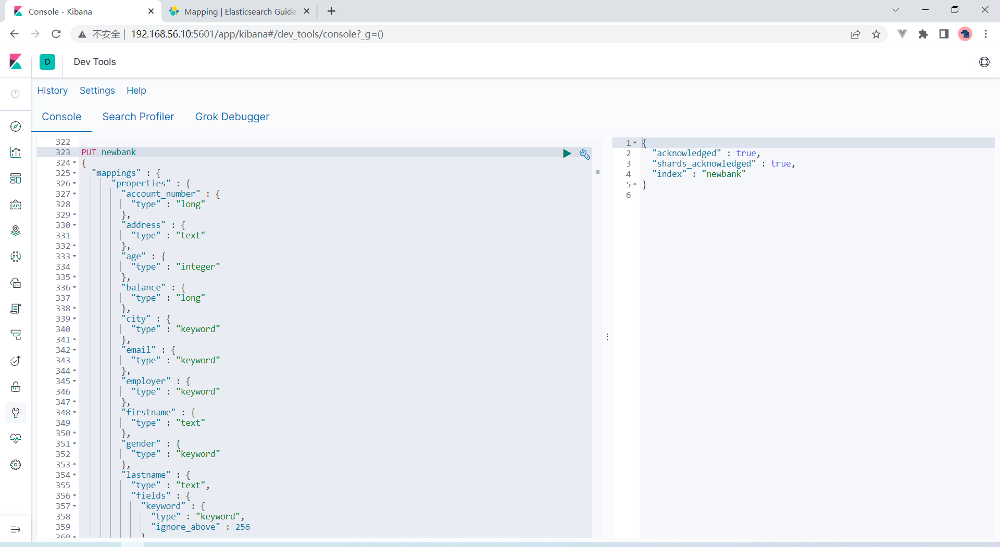

##### 2、迁移数据

```json
POST _reindex
{
  "source": {
    "index": "bank",
    "type": "account"
  },
  "dest": {
    "index": "newbank"
  }
}
```

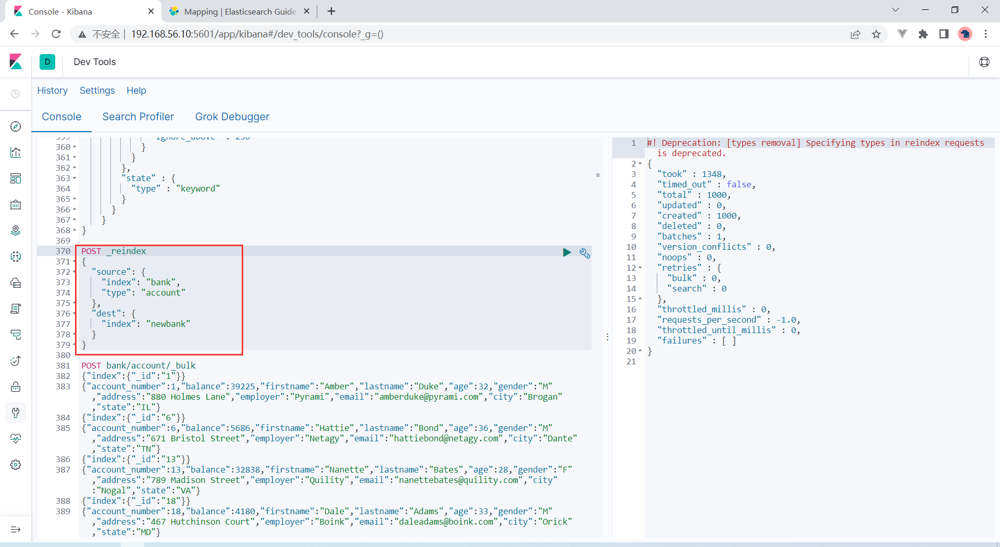

##### 3、查询迁移的数据

```json
GET newbank/_search
```

可以看到都把数据放到`"_type" : "_doc"`默认类型上了

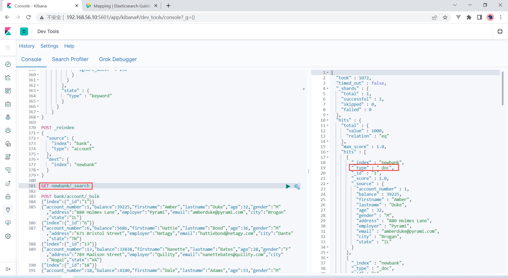

#### 6、分词器

##### 1、内置分词器

**Built-in analyzer reference**

Elasticsearch ships with a wide range of built-in analyzers, which can be used in any index without further configuration:

- **[Standard Analyzer](https://www.elastic.co/guide/en/elasticsearch/reference/7.5/analysis-standard-analyzer.html)**

  The `standard` analyzer divides text into terms on word boundaries, as defined by the Unicode Text Segmentation algorithm. It removes most punctuation, lowercases terms, and supports removing stop words.

- **[Simple Analyzer](https://www.elastic.co/guide/en/elasticsearch/reference/7.5/analysis-simple-analyzer.html)**

  The `simple` analyzer divides text into terms whenever it encounters a character which is not a letter. It lowercases all terms.

- **[Whitespace Analyzer](https://www.elastic.co/guide/en/elasticsearch/reference/7.5/analysis-whitespace-analyzer.html)**

  The `whitespace` analyzer divides text into terms whenever it encounters any whitespace character. It does not lowercase terms.

- **[Stop Analyzer](https://www.elastic.co/guide/en/elasticsearch/reference/7.5/analysis-stop-analyzer.html)**

  The `stop` analyzer is like the `simple` analyzer, but also supports removal of stop words.

- **[Keyword Analyzer](https://www.elastic.co/guide/en/elasticsearch/reference/7.5/analysis-keyword-analyzer.html)**

  The `keyword` analyzer is a “noop” analyzer that accepts whatever text it is given and outputs the exact same text as a single term.

- **[Pattern Analyzer](https://www.elastic.co/guide/en/elasticsearch/reference/7.5/analysis-pattern-analyzer.html)**

  The `pattern` analyzer uses a regular expression to split the text into terms. It supports lower-casing and stop words.

- **[Language Analyzers](https://www.elastic.co/guide/en/elasticsearch/reference/7.5/analysis-lang-analyzer.html)**

  Elasticsearch provides many language-specific analyzers like `english` or `french`.

- **[Fingerprint Analyzer](https://www.elastic.co/guide/en/elasticsearch/reference/7.5/analysis-fingerprint-analyzer.html)**

  The `fingerprint` analyzer is a specialist analyzer which creates a fingerprint which can be used for duplicate detection.

参考文档： https://www.elastic.co/guide/en/elasticsearch/reference/7.5/analysis-analyzers.html

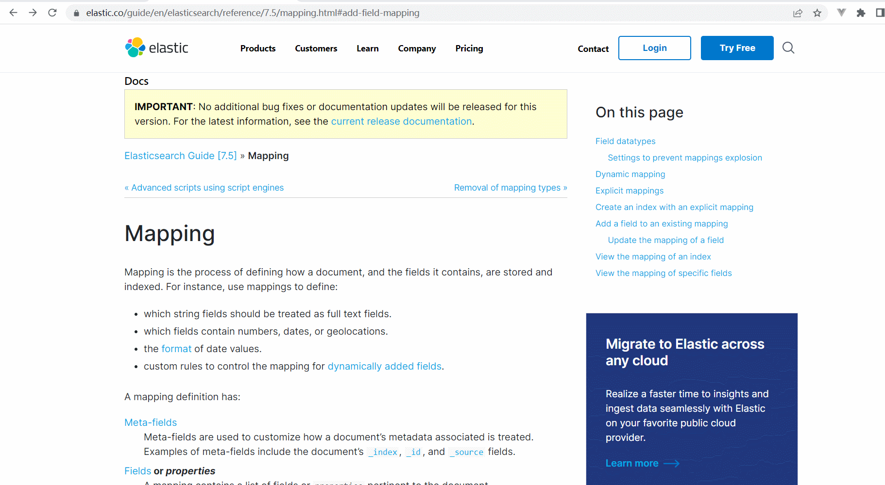

##### 2、测试分词器

参考文档： https://www.elastic.co/guide/en/elasticsearch/reference/7.5/test-analyzer.html


英文使用默认分词器可以正常分词

```json
POST _analyze
{
  "analyzer": "whitespace",
  "text":     "The quick brown fox."
}
```

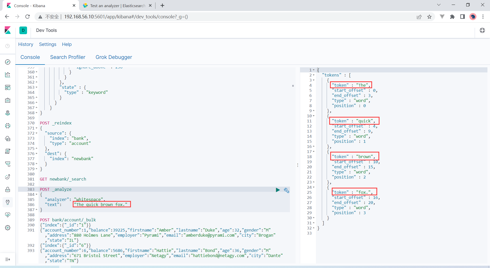

中文使用默认分词器进行分词会出现问题，每个字会分成一个词

```json
POST _analyze
{
  "analyzer": "standard",
  "text":     "尚硅谷电商项目"
}
```

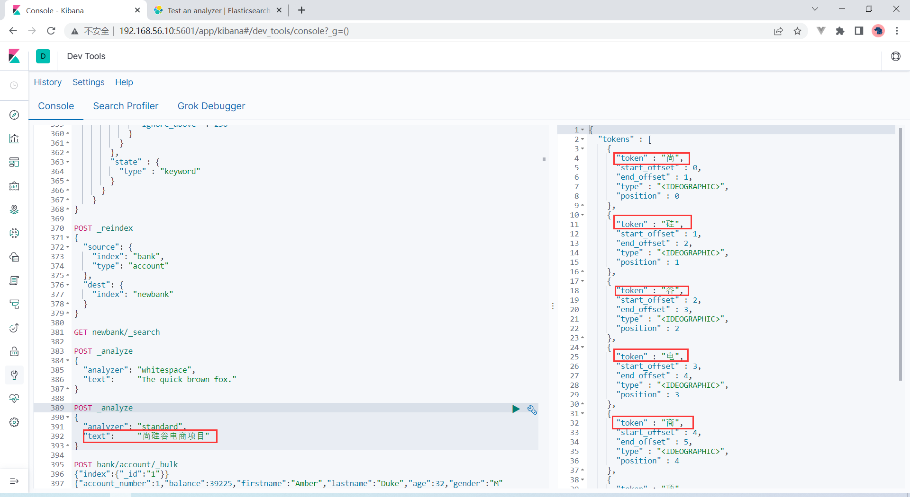

##### 3、安装ik分词器

###### 1、下载地址

7.4.2版本的`elasticsearch`下载地址为： https://github.com/medcl/elasticsearch-analysis-ik/releases/download/v7.4.2/elasticsearch-analysis-ik-7.4.2.zip

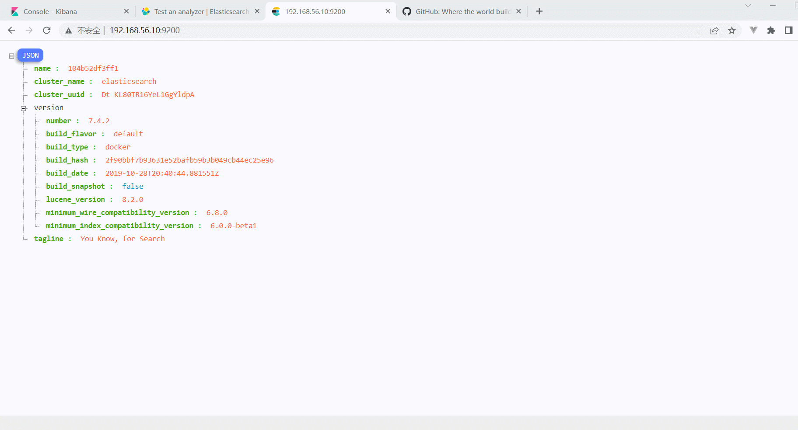

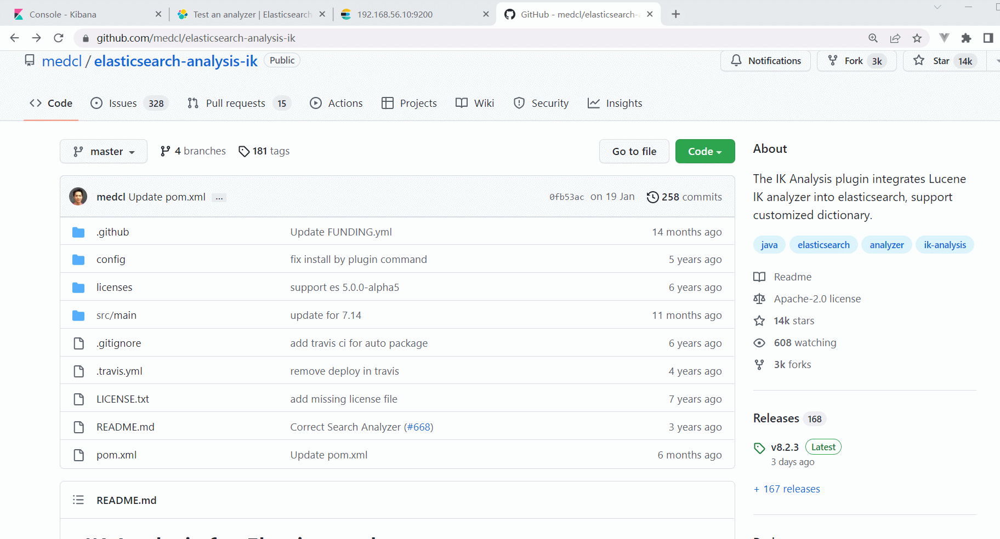


###### 2、下载插件

```bash
vagrant ssh
su root #使用root用户，密码默认为vagrant
docker ps	#查看docker运行的容器
docker exec -it elasticsearch  /bin/bash #以交互模式进入容器内部
pwd	#查看当前当前路径的完整路径
ls	#查看当前目录的子目录和文件
cd plugins/ #进入到plugins目录
ls	#查看当前目录的子目录和文件，可以看到什么都没有
wget https://github.com/medcl/elasticsearch-analysis-ik/releases/download/v7.4.2/elasticsearch-analysis-ik-7.4.2.zip #下载插件
exit #退出elasticsearch容器
```

下载插件提示`bash: wget: command not found`，这是因为容器内部非常纯净，没有这些命令

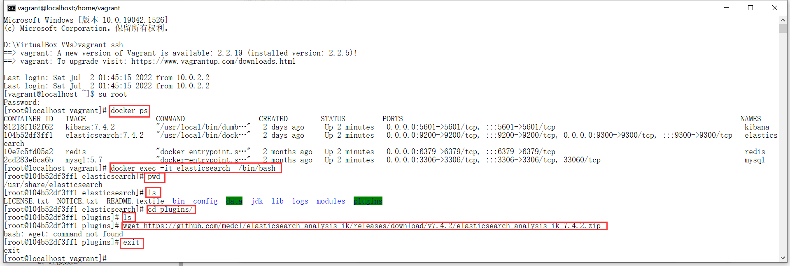

由于设置了`elasticsearch容器`和外部`linux虚拟机`进行了关联，因此可以在`linux虚拟机`里下载插件

```bash
pwd
cd /mydata/elasticsearch/
ls
cd plugins/
wget
yum install wget	#安装wget
ls
wget https://github.com/medcl/elasticsearch-analysis-ik/releases/download/v7.4.2/elasticsearch-analysis-ik-7.4.2.zip
wget https://github.com/medcl/elasticsearch-analysis-ik/releases/download/v7.4.2/elasticsearch-analysis-ik-7.4.2.zip –no-check-certificate  #添加参数 --no-check-certificate
systemctl stop firewalld		#关闭防火墙
wget https://github.com/medcl/elasticsearch-analysis-ik/releases/download/v7.4.2/elasticsearch-analysis-ik-7.4.2.zip -no-check-certificate	#重新下载插件
```

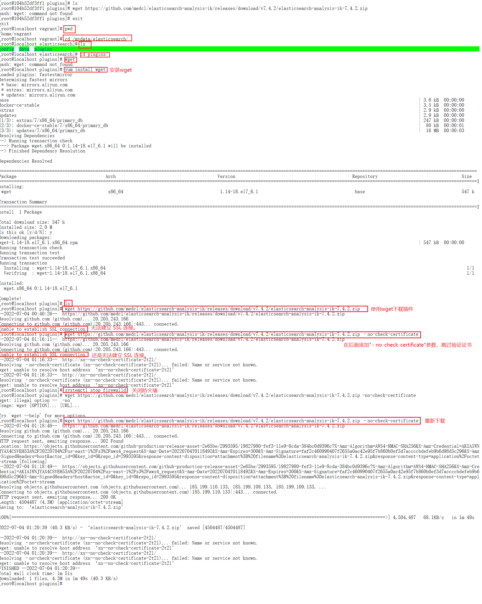


```bash
ls	#elasticsearch-analysis-ik-7.4.2.zip
pwd	#/mydata/elasticsearch/plugins
docker exec -it elasticsearch  /bin/bash
pwd  #/usr/share/elasticsearch
ls
cd plugins/
ls	#elasticsearch-analysis-ik-7.4.2.zip
exit;
```

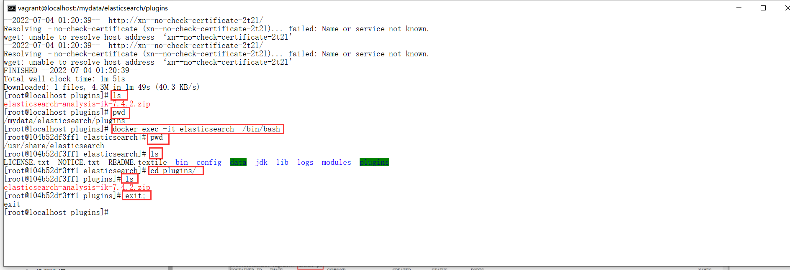

###### 3、安装插件

```bash
ll
unzip elasticsearch-analysis-ik-7.4.2.zip -d ./ik	#解压到当前目录的下的ik目录下，没有ik目录会自动创建
ll	#有elasticsearch-analysis-ik-7.4.2.zip 和 ik
cd ik	#进入ik目录
ll		#可以看到以成功解压到ik目录下了
cd ..	#退回到上级目录
rm -rf elasticsearch-analysis-ik-7.4.2.zip #删除elasticsearch-analysis-ik-7.4.2.zip压缩包
ll		# ik目录的权限为 drwxr-xr-x.
chmod -R 777 ik/ #改变uk目录及子目录的权限
ll		#此时ik目录的权限为 drwxrwxrwx.
```

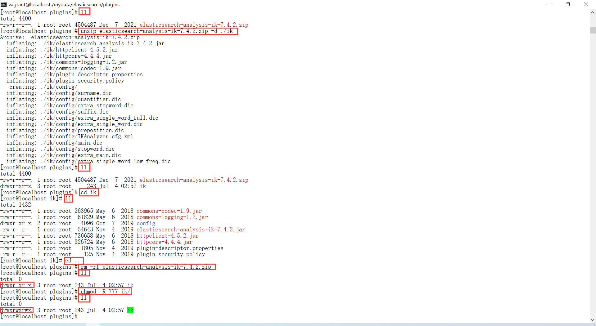


```bash
docker exec -it elasticsearch  /bin/bash #进入bash控制台
pwd
cd plugins/
ll
cd ../
ls
cd bin/
ls	#查看可执行文件
elasticsearch-plugin	#直接打出该可执行文件名，会提示一些信息
elasticsearch-plugin -h	#加 -h 显示帮助信息
#如果这一步报错，删掉 elasticsearch-analysis-ik-7.4.2.zip 压缩包
elasticsearch-plugin list #列出已安装的elasticsearch插件，可以看到ik分词器已经安装成功了
```

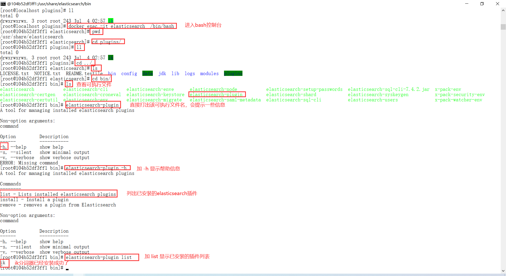

###### 4、测试

发送以下数据

```json
POST _analyze
{
  "analyzer": "ik_smart",
  "text":     "尚硅谷电商项目"
}
```

响应了错误信息，`failed to find global analyzer [ik_smart]`

```json
{
  "error": {
    "root_cause": [
      {
        "type": "remote_transport_exception",
        "reason": "[104b52df3ff1][127.0.0.1:9300][indices:admin/analyze[s]]"
      }
    ],
    "type": "illegal_argument_exception",
    "reason": "failed to find global analyzer [ik_smart]"
  },
  "status": 400
}
```

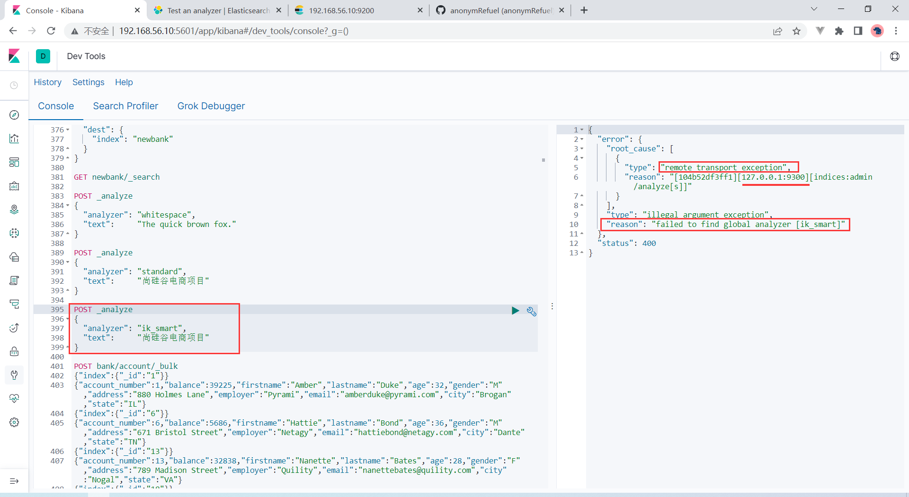

查看正在运行的dorcker容器，可以看到`elasticsearch`并没有停止运行

重启`elasticsearch`，再次发送请求看看还报不报错

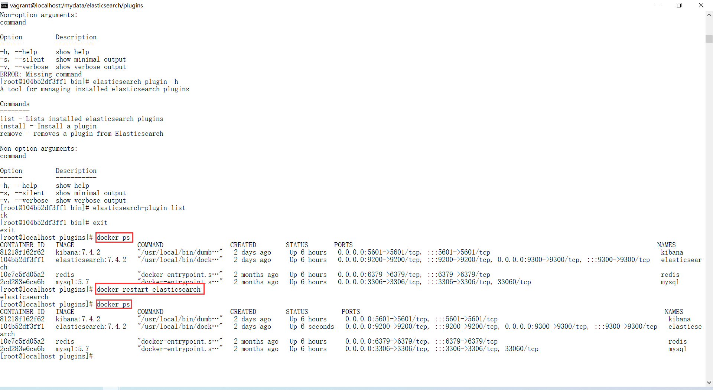

打开`kibana`可以看到报了以下错误，这个不用管，等一会就能加载出来了

```
Cannot connect to the Elasticsearch cluster
See the Kibana logs for details and try reloading the page.
```

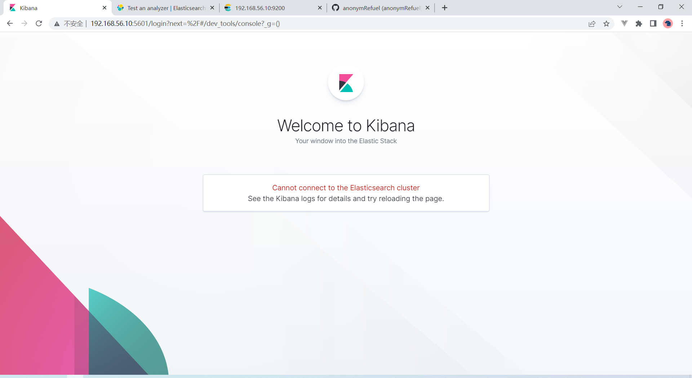

重新发送请求，可以看到已经可以分词了

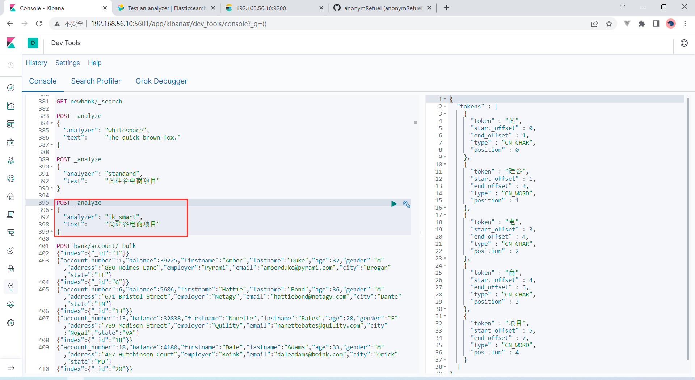

```json
{
  "tokens" : [
    {
      "token" : "尚",
      "start_offset" : 0,
      "end_offset" : 1,
      "type" : "<IDEOGRAPHIC>",
      "position" : 0
    },
    {
      "token" : "硅",
      "start_offset" : 1,
      "end_offset" : 2,
      "type" : "<IDEOGRAPHIC>",
      "position" : 1
    },
    {
      "token" : "谷",
      "start_offset" : 2,
      "end_offset" : 3,
      "type" : "<IDEOGRAPHIC>",
      "position" : 2
    },
    {
      "token" : "电",
      "start_offset" : 3,
      "end_offset" : 4,
      "type" : "<IDEOGRAPHIC>",
      "position" : 3
    },
    {
      "token" : "商",
      "start_offset" : 4,
      "end_offset" : 5,
      "type" : "<IDEOGRAPHIC>",
      "position" : 4
    },
    {
      "token" : "项",
      "start_offset" : 5,
      "end_offset" : 6,
      "type" : "<IDEOGRAPHIC>",
      "position" : 5
    },
    {
      "token" : "目",
      "start_offset" : 6,
      "end_offset" : 7,
      "type" : "<IDEOGRAPHIC>",
      "position" : 6
    }
  ]
}

```

##### 4、使用`Xshell`连接linux虚拟机

###### 1、设置可以使用root用户登录

```bash
#注意要在管理员方式修改
vi /etc/ssh/sshd_config #修改 PasswordAuthentication no 这一行为 PasswordAuthentication yes
#如果是生产环境可以先执行 service sshd reload ，不行再执行以下命令
service sshd restart
```


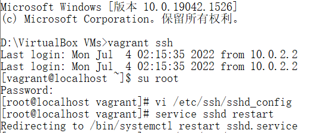

###### 2、使用`Xshell`连接

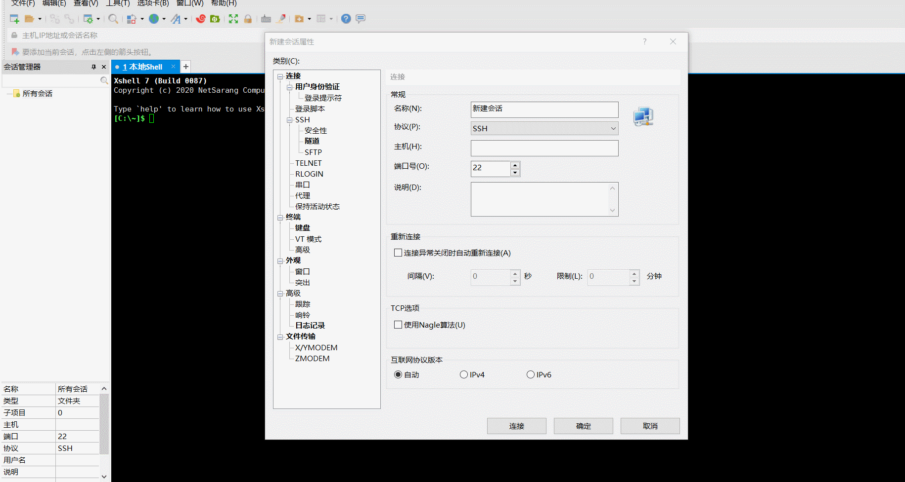

###### 3、如果`ping`不通

```bash
ping baidu.com	#ping百度
cd /etc/sysconfig/network-scripts/
ls
ip addr	#查看ip配置
vi ifcfg-eth1 #编辑eth1网卡配置，内容在后面
service network restart #重启服务
ping baidu.com #再次ping百度
```

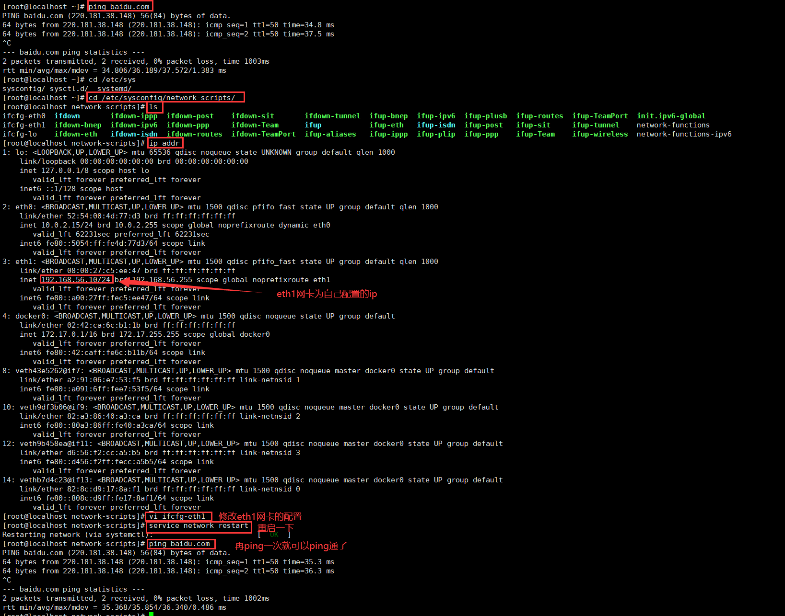

修改`ifcfg-eth1`为以下内容

```
#VAGRANT-BEGIN
# The contents below are automatically generated by Vagrant. Do not modify.
NM_CONTROLLED=yes
BOOTPROTO=none
ONBOOT=yes
IPADDR=192.168.56.10
NETMASK=255.255.255.0
GATEWAY=192.168.56.1
DNS1=114.114.114.114
DNS2=8.8.8.8
DEVICE=eth1
PEERDNS=no
#VAGRANT-END
```

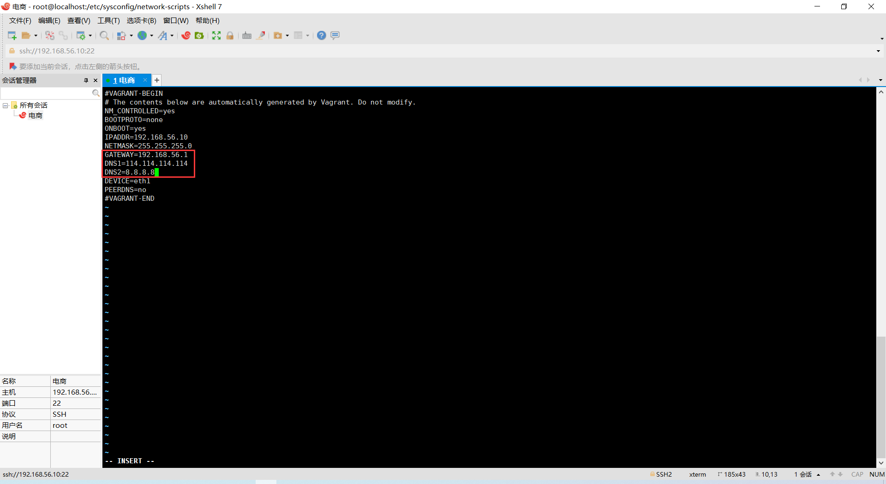

###### 4、修改yum源

如果不能正常使用yum，可以修改yum源  如果可以正常使用就不用修改

**老师提供的方法**

```bash
#备份原 yum 源，如果失败了也不要紧，直接使用新 yum 源
mv /etc/yum.repos.d/CentOS-Base.repo /etc/yum.repos.d/CentOS-Base.repo.backup
#使用新 yum 源
curl -o /etc/yum.repos.d/CentOS-Base.repo http://mirrors.163.com/.help/CentOS7-Base-163.repo
yum makecach #生成缓存
```

**我的方法**

```
sudo yum-config-manager \
    --add-repo \
    https://download.docker.com/linux/centos/docker-ce.repo
```

如果找不到`yum-config-manager`可以先安装`yum-utils`

```
yum install -y yum-utils
```

##### 5、使用`ik分词器`

###### 1、`ik_smart`

```
POST _analyze
{
  "analyzer": "ik_smart",
  "text":     "我是中国人"
}
```

响应内容为

```json
{
  "tokens" : [
    {
      "token" : "我",
      "start_offset" : 0,
      "end_offset" : 1,
      "type" : "CN_CHAR",
      "position" : 0
    },
    {
      "token" : "是",
      "start_offset" : 1,
      "end_offset" : 2,
      "type" : "CN_CHAR",
      "position" : 1
    },
    {
      "token" : "中国人",
      "start_offset" : 2,
      "end_offset" : 5,
      "type" : "CN_WORD",
      "position" : 2
    }
  ]
}
```

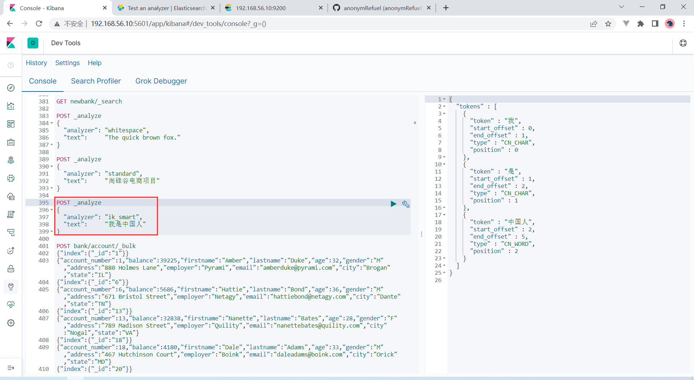

###### 2、`ik_max_word`

```json
POST _analyze
{
  "analyzer": "ik_max_word",
  "text":     "我是中国人"
}
```

响应内容为

```json
{
  "tokens" : [
    {
      "token" : "我",
      "start_offset" : 0,
      "end_offset" : 1,
      "type" : "CN_CHAR",
      "position" : 0
    },
    {
      "token" : "是",
      "start_offset" : 1,
      "end_offset" : 2,
      "type" : "CN_CHAR",
      "position" : 1
    },
    {
      "token" : "中国人",
      "start_offset" : 2,
      "end_offset" : 5,
      "type" : "CN_WORD",
      "position" : 2
    },
    {
      "token" : "中国",
      "start_offset" : 2,
      "end_offset" : 4,
      "type" : "CN_WORD",
      "position" : 3
    },
    {
      "token" : "国人",
      "start_offset" : 3,
      "end_offset" : 5,
      "type" : "CN_WORD",
      "position" : 4
    }
  ]
}
```

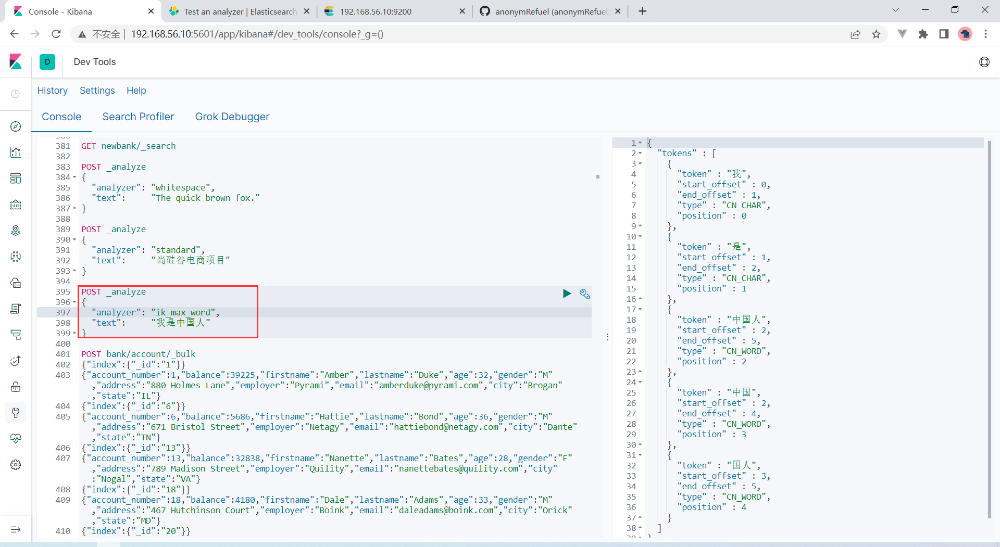

##### 7 、自定义分词

###### 1、修改docker启动参数

```bash
docker ps	#查看elasticsearch的id  也可以使用 docker ps -a 命令
systemctl stop docker.socket #停止这个服务，否则docker是没办法停止的
systemctl stop docker	#停止docker
docker  ps	#再次查看是否有启动的docker容器
cd /var/lib/docker/containers/ #进入到该目录
ll
cd 104b52df3ff1fe34c3373deab5c2b4248accd8113ab302092124b8e33abd1936/ #进入到elasticsearch的配置目录
ll
vi config.v2.json	#修改该文件
```

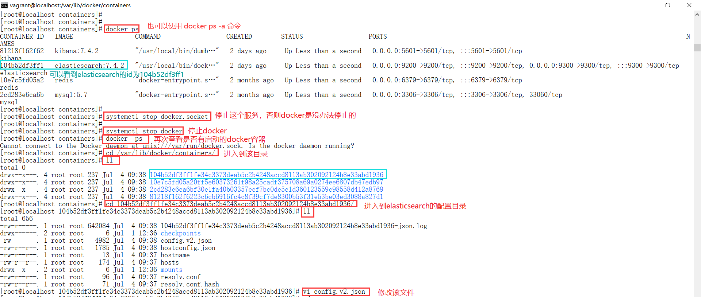

在`命令模式`下输入`/Env`,即可找到`Env`的配置

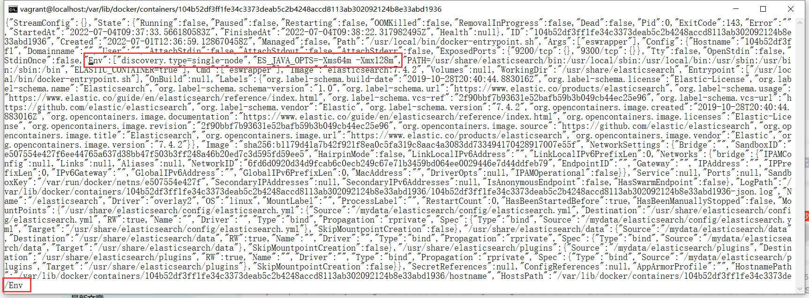

将

```
"Env":["discovery.type=single-node","ES_JAVA_OPTS=-Xms64m -Xmx128m"
```

中的第二个`-Xmx128m`修改为`-Xmx512m`

```
"Env":["discovery.type=single-node","ES_JAVA_OPTS=-Xms64m -Xmx512m"
```

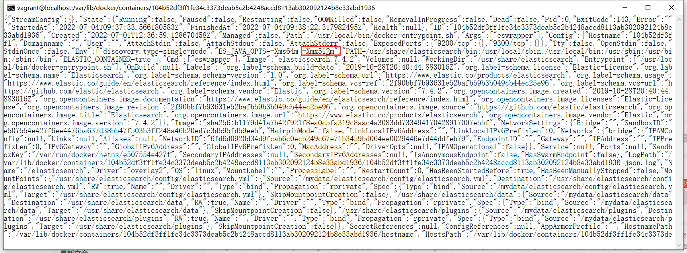

启动docker

```bash
systemctl start docker
docker ps
```

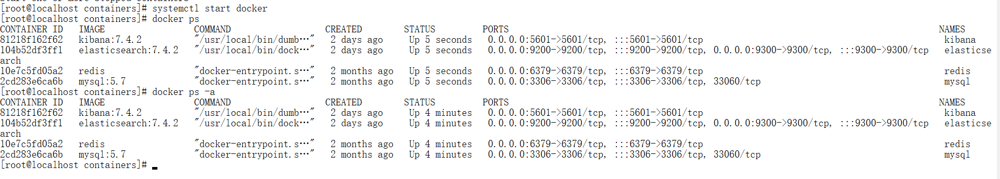

**方法二**：删掉容器，重新运行(设置目录挂载后，linux虚拟机保存的有elasticsearch的数据)

```bash
docker stop elasticsearch
docker rm elasticsearch

docker run --name elasticsearch -p 9200:9200 -p 9300:9300 \
-e "discovery.type=single-node" \
-e ES_JAVA_OPTS="-Xms64m -Xmx512m" \
-v /mydata/elasticsearch/config/elasticsearch.yml:/usr/share/elasticsearch/config/elasticsearch.yml \
-v /mydata/elasticsearch/data:/usr/share/elasticsearch/data \
-v /mydata/elasticsearch/plugins:/usr/share/elasticsearch/plugins \
-d elasticsearch:7.4.2
```

###### 2、安装nginx

1. 随便启动一个 nginx 实例，只是为了复制出配置

```bash
cd /mydata/
pwd
mkdir nginx
ls
docker images
docker run -p 80:80 --name nginx -d nginx:1.10
docker ps
docker container cp nginx:/etc/nginx .
ls
cd nginx/
ls
docker stop nginx
docker rm nginx
cd ..
ls
mv nginx conf
ls
mkdir nginx
mv conf nginx/
ls
cd nginx/
ls
```


```bash
docker run -p 80:80 --name nginx \
-v /mydata/nginx/html:/usr/share/nginx/html \
-v /mydata/nginx/logs:/var/log/nginx \
-v /mydata/nginx/conf:/etc/nginx \
-d nginx:1.10
```

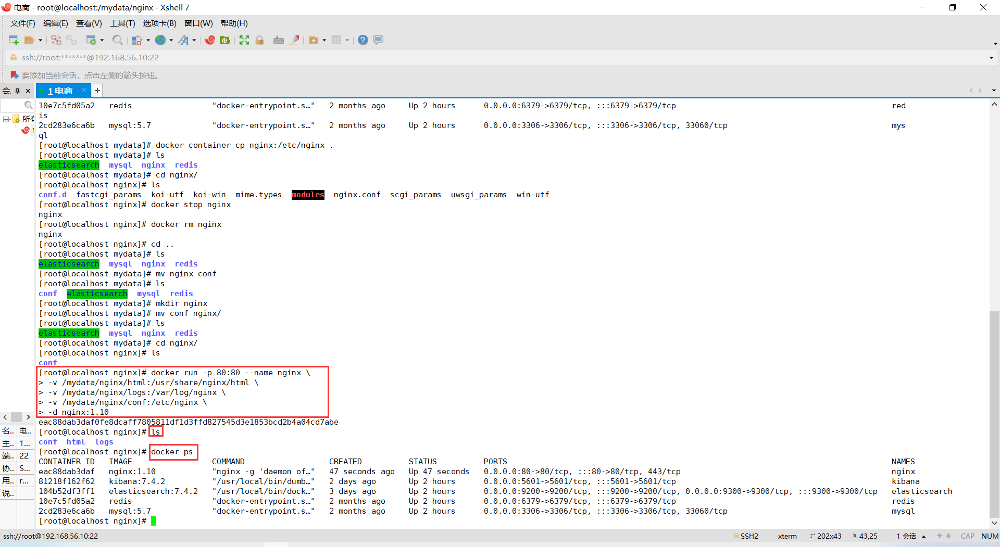

直接访问成功了


可以新建个`index.html`页面，`nginx`会默认展示

```bash
cd html/
ls
vi index.html
```

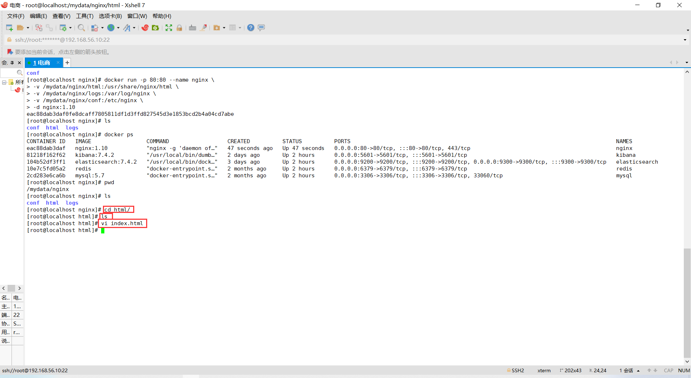

`index.html`内容如下

```html
<h1>Gulimall</h1>
```

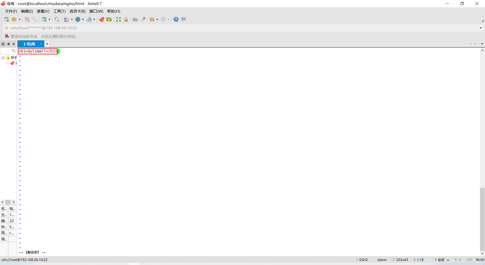

刷新网页，可以看到已经访问成功了


###### 3、创建文件

```bash
mkdir es
ls
cd es
ls
vi fenci.txt	#修改的内容在下面
ls
pwd
```

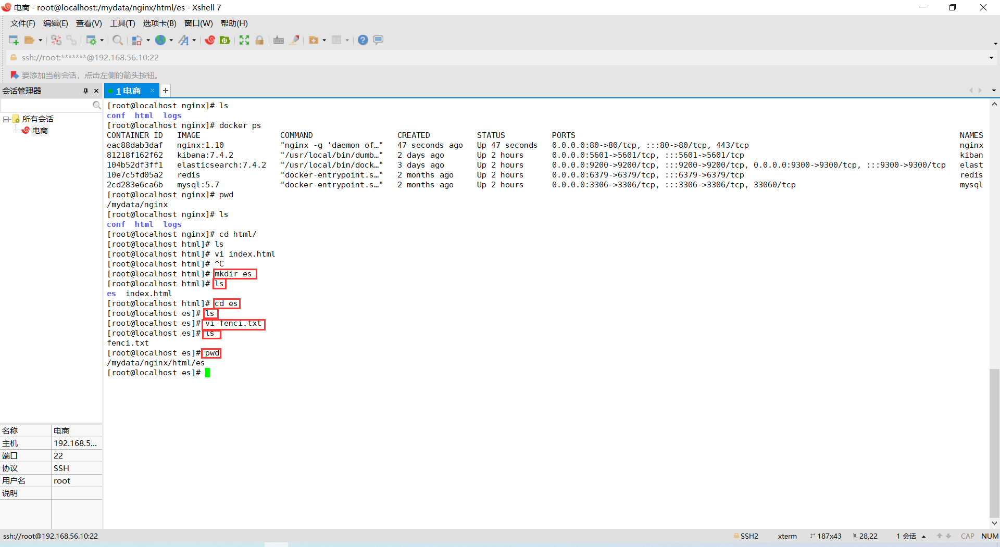

```
尚硅谷
乔碧罗
```

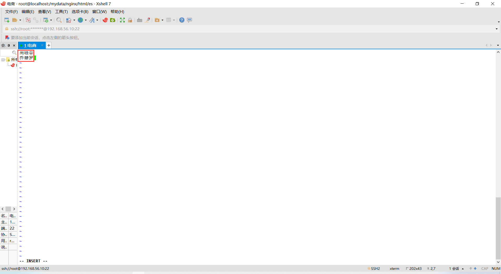

通过浏览器已经访问到了，就是会乱码

```
http://192.168.56.10/es/fenci.txt
```


###### 4、修改分词器设置

1. 修改配置

```bash
cd /mydata/
ls
cd elasticsearch/
ls
cd plugins/
ls
cd ik/
cd config/
ls
vi IKAnalyzer.cfg.xml	#修改的内容在下面
docker ps
docker restart elasticsearch
```

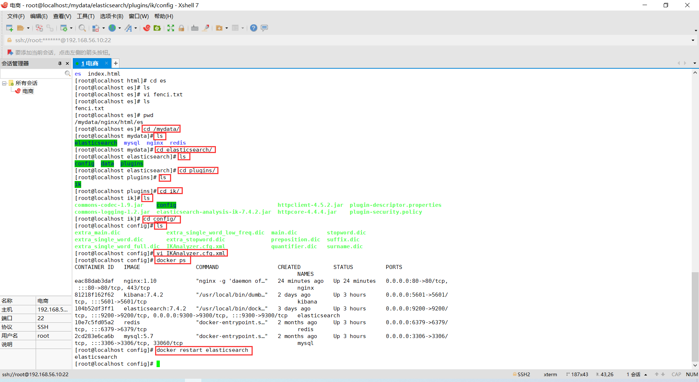

2. 修改以下配置

将`IKAnalyzer.cfg.xml`文件的以下配置

```xml
<?xml version="1.0" encoding="UTF-8"?>
<!DOCTYPE properties SYSTEM "http://java.sun.com/dtd/properties.dtd">
<properties>
        <comment>IK Analyzer 扩展配置</comment>
        <!--用户可以在这里配置自己的扩展字典 -->
        <entry key="ext_dict"></entry>
         <!--用户可以在这里配置自己的扩展停止词字典-->
        <entry key="ext_stopwords"></entry>
        <!--用户可以在这里配置远程扩展字典 -->
        <!-- <entry key="remote_ext_dict">words_location</entry> -->
        <!--用户可以在这里配置远程扩展停止词字典-->
        <!-- <entry key="remote_ext_stopwords">words_location</entry> -->
</properties>
```

修改为：

```xml
<?xml version="1.0" encoding="UTF-8"?>
<!DOCTYPE properties SYSTEM "http://java.sun.com/dtd/properties.dtd">
<properties>
        <comment>IK Analyzer 扩展配置</comment>
        <!--用户可以在这里配置自己的扩展字典 -->
        <entry key="ext_dict"></entry>
         <!--用户可以在这里配置自己的扩展停止词字典-->
        <entry key="ext_stopwords"></entry>
        <!--用户可以在这里配置远程扩展字典 -->
        <entry key="remote_ext_dict">http://192.168.56.10/es/fenci.txt</entry>
        <!--用户可以在这里配置远程扩展停止词字典-->
        <!-- <entry key="remote_ext_stopwords">words_location</entry> -->
</properties>
```

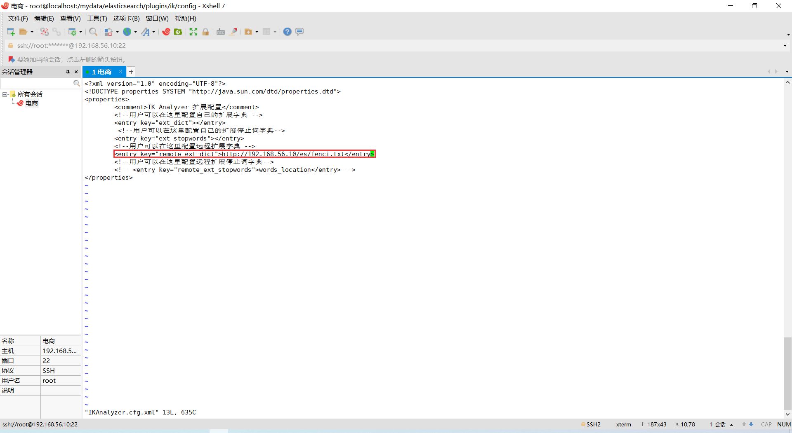

3. 设置`nginx`开机自启

```bash
docker update nginx --restart=always
```

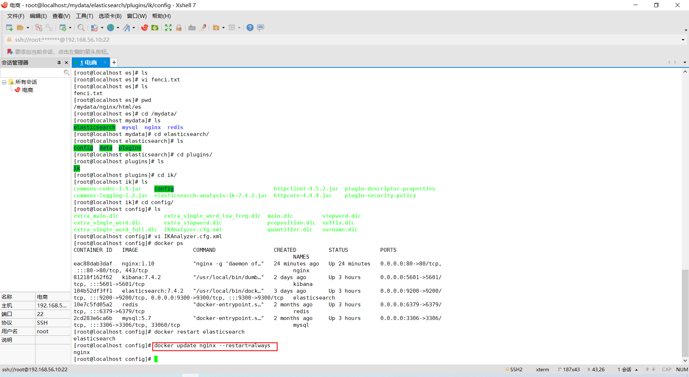

4、发送请求测试

在`kibana`里发送请求

```
POST _analyze
{
  "analyzer": "ik_max_word",
  "text":     "尚硅谷电商项目"
}
```

响应了以下内容，可以看到`尚硅谷`已经变为一个词了

```
{
  "tokens" : [
    {
      "token" : "尚硅谷",
      "start_offset" : 0,
      "end_offset" : 3,
      "type" : "CN_WORD",
      "position" : 0
    },
    {
      "token" : "硅谷",
      "start_offset" : 1,
      "end_offset" : 3,
      "type" : "CN_WORD",
      "position" : 1
    },
    {
      "token" : "电",
      "start_offset" : 3,
      "end_offset" : 4,
      "type" : "CN_CHAR",
      "position" : 2
    },
    {
      "token" : "商",
      "start_offset" : 4,
      "end_offset" : 5,
      "type" : "CN_CHAR",
      "position" : 3
    },
    {
      "token" : "项目",
      "start_offset" : 5,
      "end_offset" : 7,
      "type" : "CN_WORD",
      "position" : 4
    }
  ]
}
```

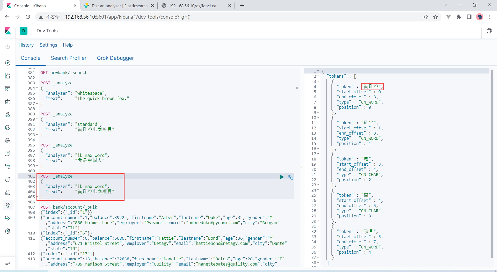

### 5.1.6、ElasticSearch整合SpringBoot

#### 1、创建模块

##### 1、新建模块

使用`Spring Initializr`新建`gulimall-search`模块

```
com.atguigu.gulimall
gulimall-search
ElasticSearch检索服务
com.atguigu.gulimall.search
```

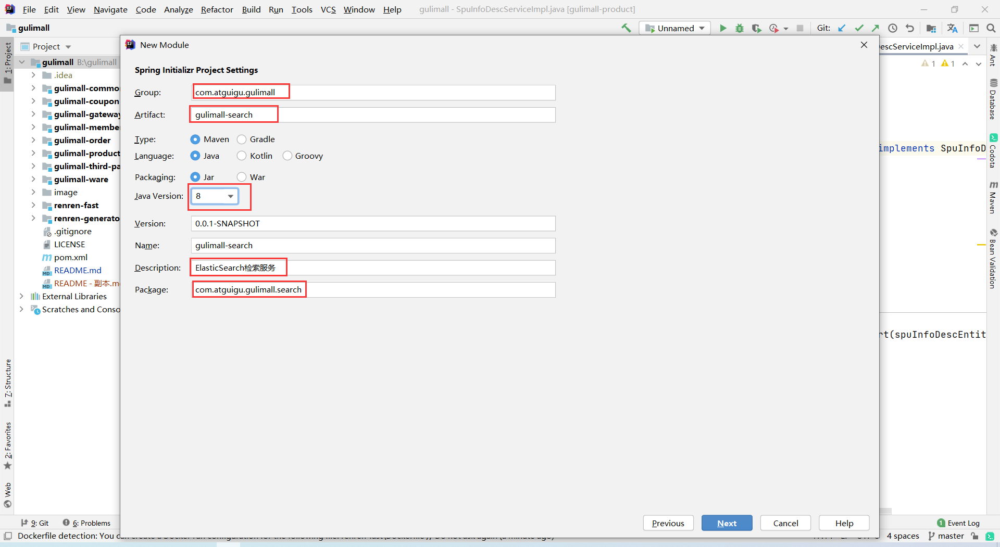

勾选`Web`里的`Spring Web`

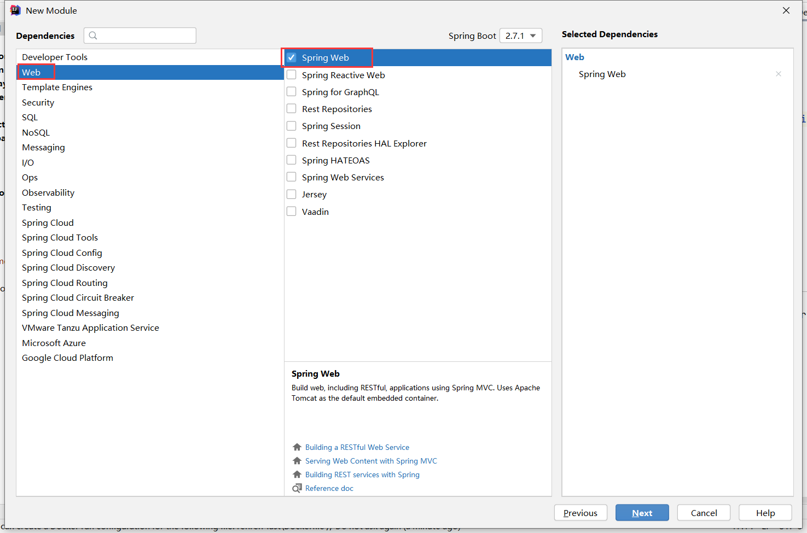

点击`Finish`

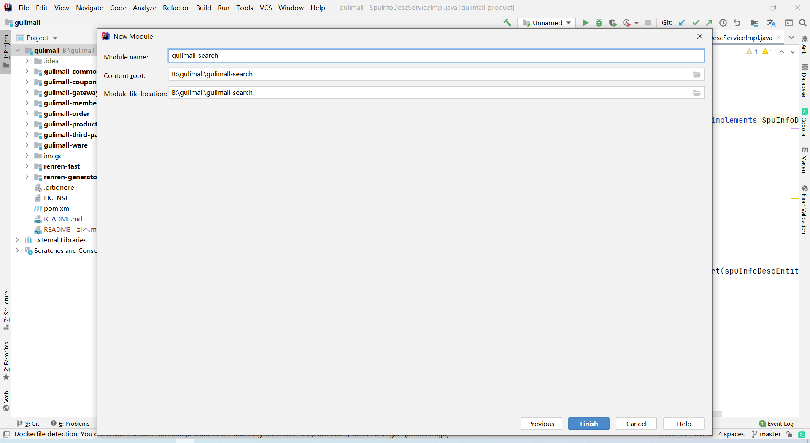

##### 2、修改`pom`文件

删除刚刚新建的`gulimall-search`模块，只保留以下内容

```xml
<groupId>com.atguigu.gulimall</groupId>
<artifactId>gulimall-search</artifactId>
<version>0.0.1-SNAPSHOT</version>
<name>gulimall-search</name>
<description>ElasticSearch检索服务</description>
<properties>
	<java.version>1.8</java.version>
</properties>
<dependencies>
	<dependency>
		<groupId>org.springframework.boot</groupId>
		<artifactId>spring-boot-starter-web</artifactId>
	</dependency>

	<dependency>
		<groupId>org.springframework.boot</groupId>
		<artifactId>spring-boot-starter-test</artifactId>
		<scope>test</scope>
	</dependency>
</dependencies>
```

复制别的模块的`pom`文件，粘贴到此模块，并用刚刚复制到本模块的部分替换掉复制的别的`pom`文件的以上部分

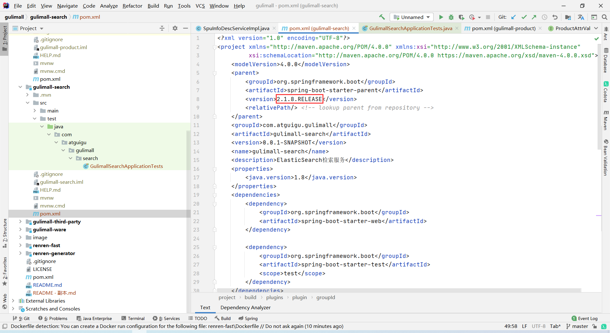

完整`pom`文件：

```xml
<?xml version="1.0" encoding="UTF-8"?>
<project xmlns="http://maven.apache.org/POM/4.0.0" xmlns:xsi="http://www.w3.org/2001/XMLSchema-instance"
       xsi:schemaLocation="http://maven.apache.org/POM/4.0.0 https://maven.apache.org/xsd/maven-4.0.0.xsd">
   <modelVersion>4.0.0</modelVersion>
   <parent>
      <groupId>org.springframework.boot</groupId>
      <artifactId>spring-boot-starter-parent</artifactId>
      <version>2.1.8.RELEASE</version>
      <relativePath/> <!-- lookup parent from repository -->
   </parent>
   <groupId>com.atguigu.gulimall</groupId>
   <artifactId>gulimall-search</artifactId>
   <version>0.0.1-SNAPSHOT</version>
   <name>gulimall-search</name>
   <description>ElasticSearch检索服务</description>
   <properties>
      <java.version>1.8</java.version>
   </properties>
   <dependencies>
      <dependency>
         <groupId>org.springframework.boot</groupId>
         <artifactId>spring-boot-starter-web</artifactId>
      </dependency>

      <dependency>
         <groupId>org.springframework.boot</groupId>
         <artifactId>spring-boot-starter-test</artifactId>
         <scope>test</scope>
      </dependency>
      
   </dependencies>

   <build>
      <plugins>
         <!--<plugin>-->
         <!--    <groupId>org.springframework.boot</groupId>-->
         <!--    <artifactId>spring-boot-maven-plugin</artifactId>-->
         <!--</plugin>-->
         <!--跳过测试-->
         <!--<plugin>-->
         <!--    <artifactId>maven-surefire-plugin</artifactId>-->
         <!--    <version>2.22.2</version>-->
         <!--    <configuration>-->
         <!--        <skipTests>true</skipTests>-->
         <!--    </configuration>-->
         <!--</plugin>-->

         <!--maven3使用junit4时需指定org.apache.maven.surefire为surefire-junit47,不然会报异常-->
         <plugin>
            <groupId>org.apache.maven.plugins</groupId>
            <artifactId>maven-surefire-plugin</artifactId>
            <version>2.12</version>
            <dependencies>
               <dependency>
                  <groupId>org.apache.maven.surefire</groupId>
                  <artifactId>surefire-junit47</artifactId>
                  <version>2.12</version>
               </dependency>
            </dependencies>
         </plugin>
      </plugins>
   </build>

</project>
```

##### 3、修改`GulimallSearchApplicationTests`

复制别的模块的测试类，替换掉本模块的`gulimall-search`的测试类

```
package com.atguigu.gulimall.search;

import org.junit.Test;
import org.junit.runner.RunWith;
import org.springframework.boot.test.context.SpringBootTest;
import org.springframework.test.context.junit4.SpringRunner;

@RunWith(SpringRunner.class)
@SpringBootTest
public class GulimallSearchApplicationTests {

	@Test
	void contextLoads() {
	}

}
```

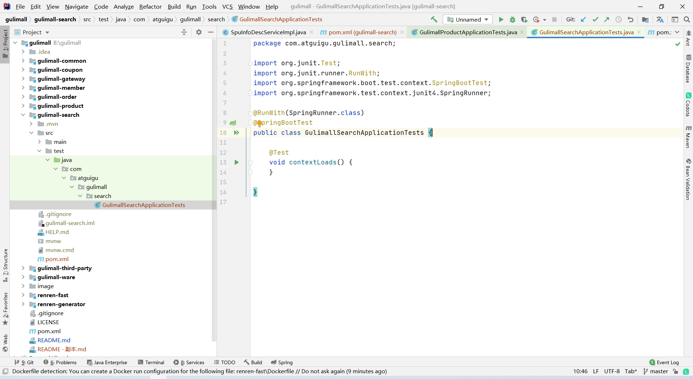

#### 2、添加依赖

##### 1、添加`elasticsearch`依赖

方法一：可以添加以下依赖

```xml
<dependency>
   <groupId>org.elasticsearch</groupId>
   <artifactId>elasticsearch</artifactId>
   <version>7.4.2</version>
</dependency>
```

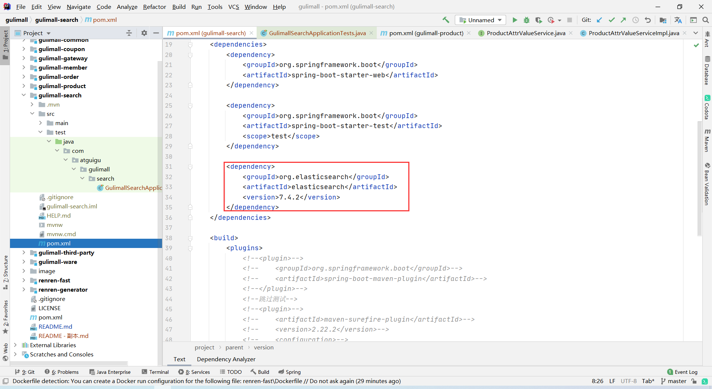

方法二：也可以添加以下依赖(老师的做法)

```java
<dependency>
   <groupId>org.elasticsearch.client</groupId>
   <artifactId>elasticsearch-rest-high-level-client</artifactId>
   <version>7.4.2</version>
</dependency>
```

添加这个依赖时，`elasticsearch`的版本不对，这是因为父工程(`spring-boot-starter-parent`工程)指定了版本

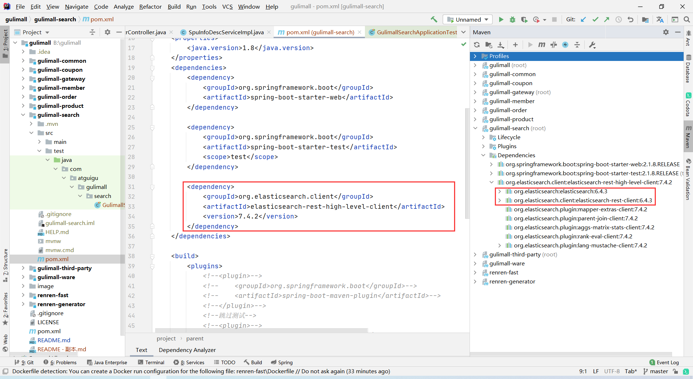

可以在`properties`标签内添加如下配置，可以看到版本已经为`7.4.2`了

```java
<elasticsearch.version>7.4.2</elasticsearch.version>
```

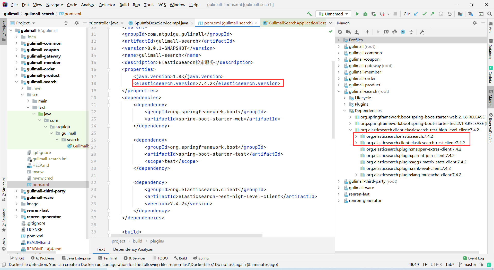

##### 2、添加`gulimall-common`依赖

```java
<dependency>
   <groupId>com.atguigu.gulimall</groupId>
   <artifactId>gulimall-common</artifactId>
   <version>0.0.1-SNAPSHOT</version>
</dependency>
```

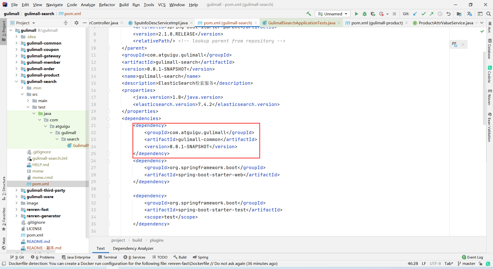

#### 3、整合`nacos`

在`src/main/resources/application.properties`文件内添加如下配置

```properties
spring.cloud.nacos.discovery.server-addr=127.0.0.1:8848

spring.application.name=gulimall-search
```

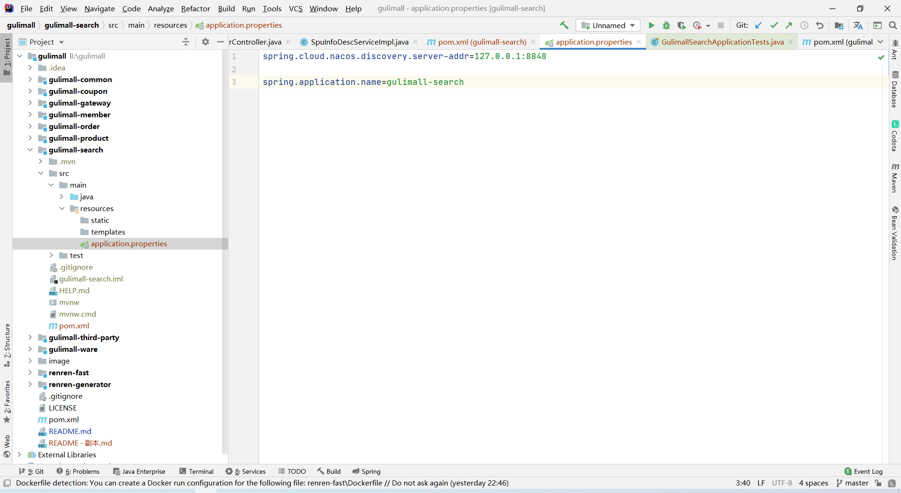

在`gulimall-search`模块的`com.atguigu.gulimall.search.GulimallSearchApplication`启动类上添加如下注解

```
@EnableDiscoveryClient
```

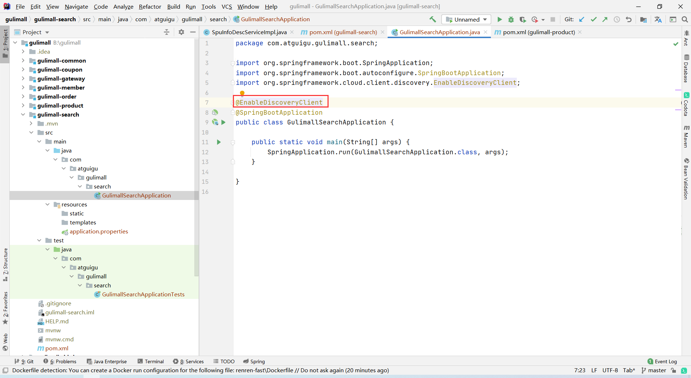

#### 4、添加配置类

参考文档：[Java REST Client [7.17\] | Elastic](https://www.elastic.co/guide/en/elasticsearch/client/java-rest/current/index.html)

在`com.atguigu.gulimall.search`包下新建`config`文件夹，在`config`文件夹下新建`GulimallElasticSearchConfig`配置类

配置类写以下代码：

参考文档：[Initialization | Java REST Client [7.17\] | Elastic](https://www.elastic.co/guide/en/elasticsearch/client/java-rest/current/java-rest-high-getting-started-initialization.html)

```java
package com.atguigu.gulimall.search.config;

import org.apache.http.HttpHost;
import org.elasticsearch.client.RestClient;
import org.elasticsearch.client.RestHighLevelClient;
import org.springframework.context.annotation.Bean;
import org.springframework.context.annotation.Configuration;

/**
 * @author 无名氏
 * @date 2022/7/5
 * @Description:
 */
@Configuration
public class GulimallElasticSearchConfig {

    @Bean
    public RestHighLevelClient esRestClient(){
        RestHighLevelClient client = new RestHighLevelClient(
                RestClient.builder(
                        new HttpHost("192.168.56.10",9200,"http")
                )
        );
        return client;
    }
}
```


查看官方文档：[Initialization | Java REST Client [7.17\] | Elastic](https://www.elastic.co/guide/en/elasticsearch/client/java-rest/current/java-rest-high-getting-started-initialization.html)


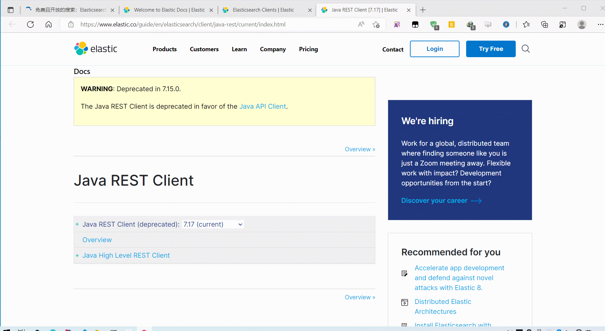

#### 5、测试`RestHighLevelClient`

在`com.atguigu.gulimall.search.GulimallSearchApplicationTests`里对`RestHighLevelClient`进行测试

```java
package com.atguigu.gulimall.search;

import org.elasticsearch.client.RestHighLevelClient;
import org.junit.Test;
import org.junit.runner.RunWith;
import org.springframework.beans.factory.annotation.Autowired;
import org.springframework.boot.test.context.SpringBootTest;
import org.springframework.test.context.junit4.SpringRunner;

@RunWith(SpringRunner.class)
@SpringBootTest
public class GulimallSearchApplicationTests {

	@Autowired
	RestHighLevelClient client;

	@Test
	public void contextLoads() {
		System.out.println(client);
	}

}
```

报了以下错误

```
Caused by: org.springframework.beans.BeanInstantiationException: Failed to instantiate [com.zaxxer.hikari.HikariDataSource]: Factory method 'dataSource' threw exception; nested exception is org.springframework.boot.autoconfigure.jdbc

Caused by: org.springframework.boot.autoconfigure.jdbc.DataSourceProperties$DataSourceBeanCreationException: Failed to determine a suitable driver class at org.springframework.boot.autoconfigure.jdbc.DataSourceProperties.determineDriverClassName(DataSourceProperties.java:233)
```

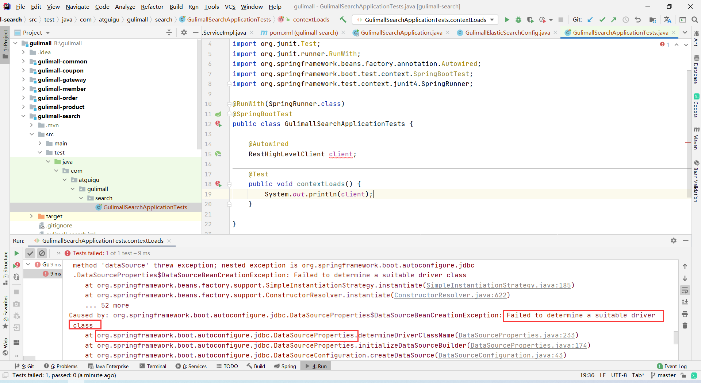

在`gulimall-search`模块的`com.atguigu.gulimall.search.GulimallSearchApplication`启动类里排除数据源

```java
@SpringBootApplication(exclude = DataSourceAutoConfiguration.class)
```

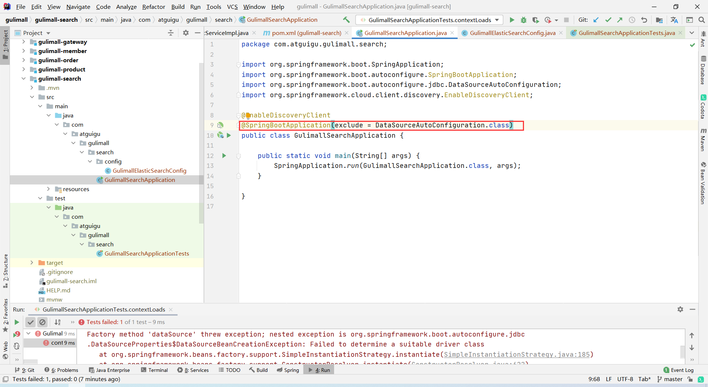

再次测试，就成功了

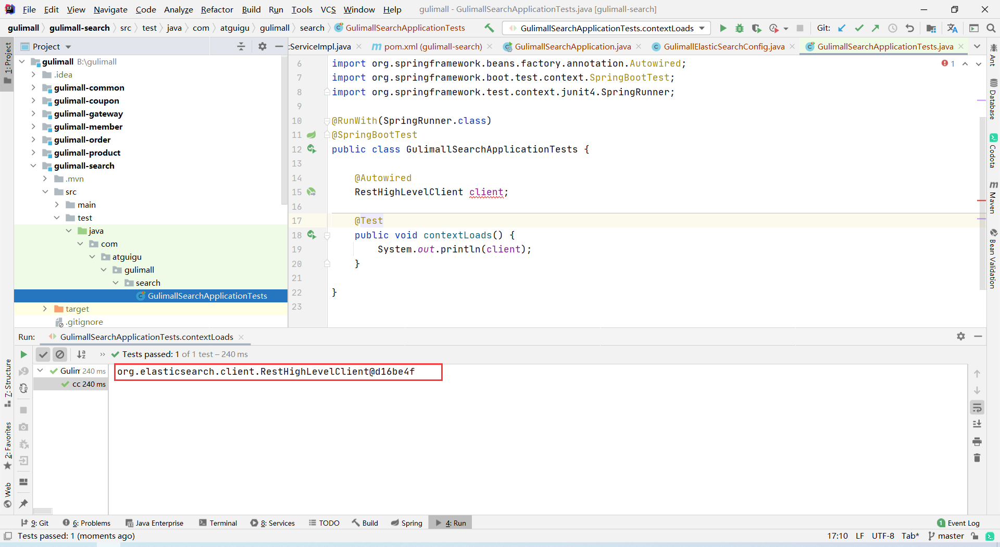

#### 6、测试`RequestOptions`

```java
public static final RequestOptions COMMON_OPTIONS;

static {
    RequestOptions.Builder builder = RequestOptions.DEFAULT.toBuilder();
    //builder.addHeader("Authorization", "Bearer", TOCKEN);
    //builder.setHttpAsyncResponseConsumerFactory(
    //        new HttpAsyncResponseConsumerFactory
    //                .HeapBufferedResponseConsumerFactory(30 * 1024 * 1024 * 1024)
    //);
    COMMON_OPTIONS = builder.build();
}
```

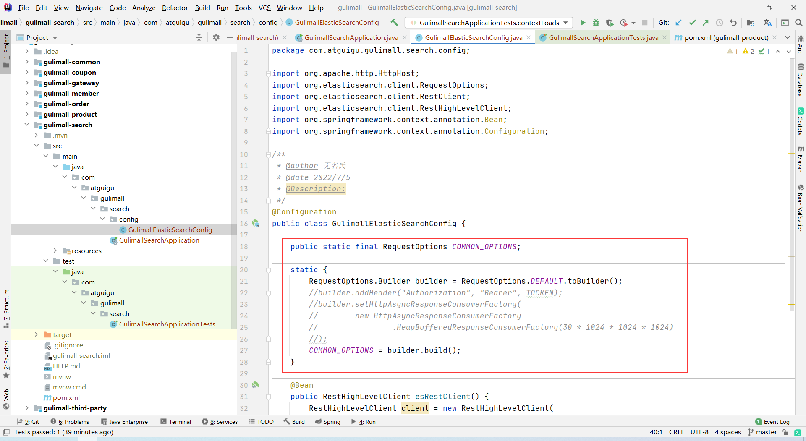

查看官方文档：[Performing requests | Elasticsearch Java API Client [7.17\] | Elastic](https://www.elastic.co/guide/en/elasticsearch/client/java-api-client/7.17/java-rest-low-usage-requests.html#java-rest-low-usage-request-options)

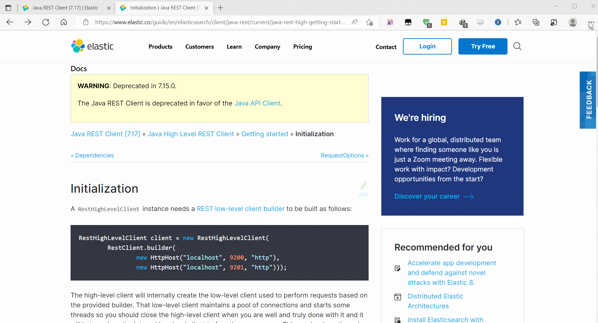

#### 7、存储或更新数据到es

先使用`kibana`发送请求查询`users`，可以看到没有查到数据

```
GET users/_search
```

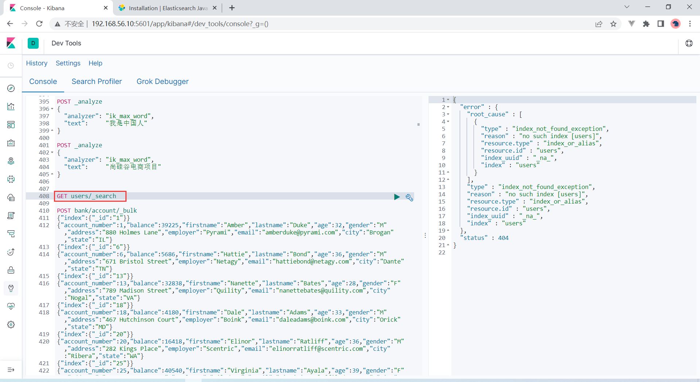

添加测试方法，然后运行测试方法

```java
/**
 * 存储或更新数据到es
 * @throws IOException
 */
@Test
public void indexData() throws IOException {
   IndexRequest indexRequest = new IndexRequest("users");
   //数据的id
   indexRequest.id("1");

   //indexRequest.source("userName","zhangsan","age",18,"gender","男");
   User user = new User();
   String jsonString = JSON.toJSONString(user);
   //要保存的内容
   indexRequest.source(jsonString, XContentType.JSON);

   //执行操作
   IndexResponse indexResponse = client.index(indexRequest, GulimallElasticSearchConfig.COMMON_OPTIONS);

   //提取有用的响应信息
   System.out.println(indexResponse);
}

@Data
class User{
   private String userName;
   private String gender;
   private Integer age;
}
```

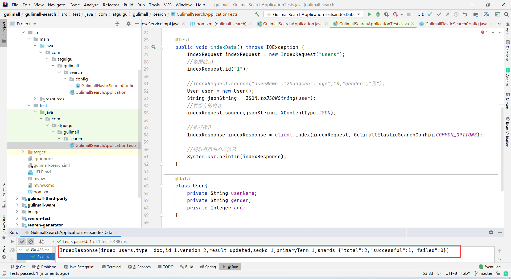

再次发送请求，可以看到已经查到数据了

```
GET users/_search
```

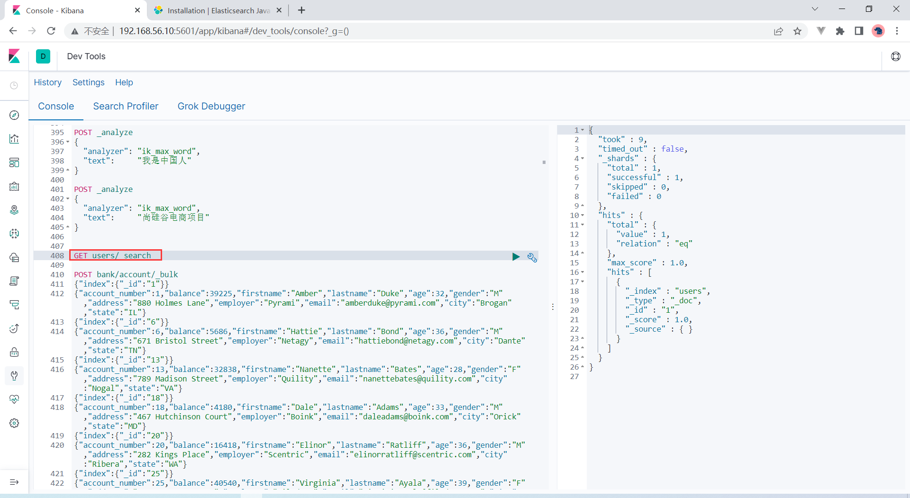

 查看官方文档：[Index API | Java REST Client [7.17\] | Elastic](https://www.elastic.co/guide/en/elasticsearch/client/java-rest/current/java-rest-high-document-index.html)

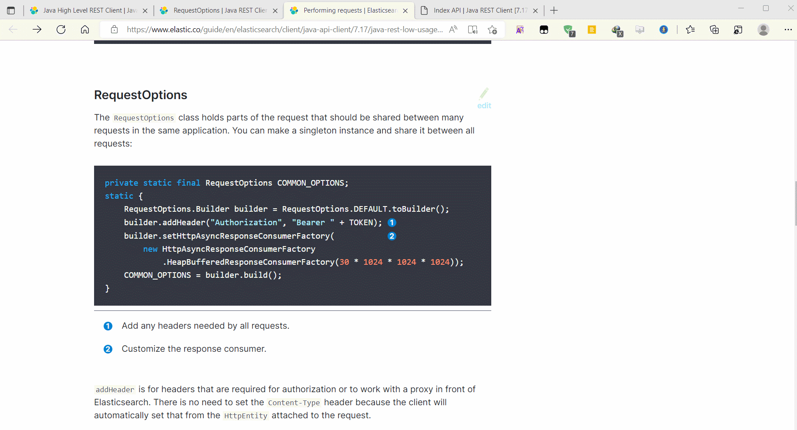

完整`GulimallSearchApplicationTests`类代码

```java
package com.atguigu.gulimall.search;

import com.alibaba.fastjson.JSON;
import com.atguigu.gulimall.search.config.GulimallElasticSearchConfig;
import lombok.Data;
import org.elasticsearch.action.index.IndexRequest;
import org.elasticsearch.action.index.IndexResponse;
import org.elasticsearch.client.RestHighLevelClient;
import org.elasticsearch.common.xcontent.XContentType;
import org.junit.Test;
import org.junit.runner.RunWith;
import org.springframework.beans.factory.annotation.Autowired;
import org.springframework.boot.test.context.SpringBootTest;
import org.springframework.test.context.junit4.SpringRunner;

import java.io.IOException;

@RunWith(SpringRunner.class)
@SpringBootTest
public class GulimallSearchApplicationTests {

   @Autowired
   RestHighLevelClient client;

   @Test
   public void indexData() throws IOException {
      IndexRequest indexRequest = new IndexRequest("users");
      //数据的id
      indexRequest.id("1");

      //indexRequest.source("userName","zhangsan","age",18,"gender","男");
      User user = new User();
      String jsonString = JSON.toJSONString(user);
      //要保存的内容
      indexRequest.source(jsonString, XContentType.JSON);

      //执行操作
      IndexResponse indexResponse = client.index(indexRequest, GulimallElasticSearchConfig.COMMON_OPTIONS);

      //提取有用的响应信息
      System.out.println(indexResponse);
   }

   @Data
   class User{
      private String userName;
      private String gender;
      private Integer age;
   }


   @Test
   public void contextLoads() {
      System.out.println(client);
   }
}
```

#### 8、从es中查询数据

 查看官方文档：https://www.elastic.co/guide/en/elasticsearch/client/java-rest/current/java-rest-high-search.html

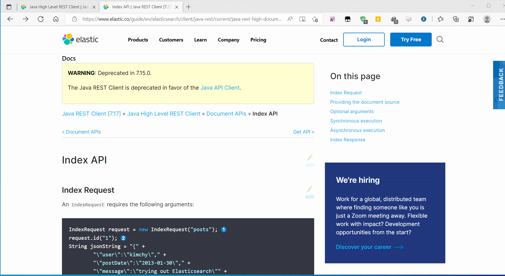

##### 1、想要完成的请求

```json
GET bank/_search
{
  "query": {
    "match": {
      "address": "mill"
    }
  },
  "aggs": {
    "ageAgg": {
      "terms": {
        "field": "age",
        "size": 10
      }
    },
    "ageAvg": {
      "avg": {
        "field": "age"
      }
    },
    "balanceAvg": {
      "avg": {
        "field": "balance"
      }
    }
  },
  "size": 0
}
```

##### 2、添加`searchData`方法

在`gulimall-search`模块的`com.atguigu.gulimall.search.GulimallSearchApplicationTests`测试类中添加以下方法

```java
@Test
public void searchData() throws IOException {
   //1、创建检索请求
   SearchRequest searchRequest = new SearchRequest();
   //指定索引
   searchRequest.indices("bank");

   //指定DSL，检索条件
   SearchSourceBuilder sourceBuilder = new SearchSourceBuilder();
   //sourceBuilder.query();
   //sourceBuilder.from();
   //sourceBuilder.size();
   //sourceBuilder.aggregation()
   sourceBuilder.query(QueryBuilders.matchQuery("address","mill"));

   TermsAggregationBuilder ageAgg = AggregationBuilders.terms("ageAgg").field("age").size(10);
   sourceBuilder.aggregation(ageAgg);
   AvgAggregationBuilder ageAvg = AggregationBuilders.avg("ageAvg").field("age");
   sourceBuilder.aggregation(ageAvg);
   AvgAggregationBuilder balanceAvg = AggregationBuilders.avg("balanceAvg").field("balance");
   sourceBuilder.aggregation(balanceAvg);

   sourceBuilder.size(0);
   System.out.println(sourceBuilder);

   searchRequest.source(sourceBuilder);

   //2、执行检索
   SearchResponse searchResponse = client.search(searchRequest,GulimallElasticSearchConfig.COMMON_OPTIONS);

   //3、分析结果
   System.out.println(searchResponse);
}
```

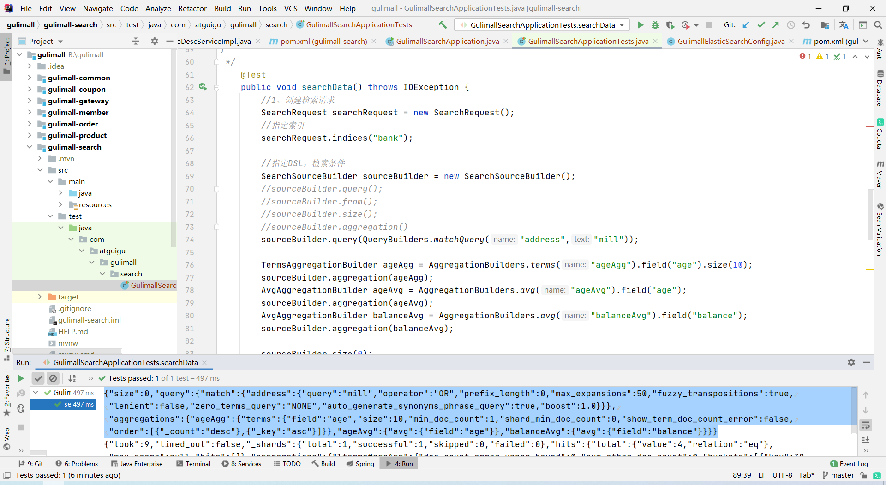

##### 3、对比请求

###### 1、想要完成的请求

```json
# 搜索 address 中包含 mill 的所有人的年龄分布以及平均年龄，但不显示这些人的详情。
GET bank/_search
{
  "query": {
    "match": {
      "address": "mill"
    }
  },
  "aggs": {
    "ageAgg": {
      "terms": {
        "field": "age",
        "size": 10
      }
    },
    "ageAvg": {
      "avg": {
        "field": "age"
      }
    },
    "balanceAvg": {
      "avg": {
        "field": "balance"
      }
    }
  },
  "size": 0
}
```


###### 2、实际发送的请求

可以看到，除了 添加了一些 **默认查询条件** 和 **顺序** 不同外其他想要的查询条件都正确

```json
GET bank/_search
{
	"size": 0,
	"query": {
		"match": {
			"address": {
				"query": "mill",
				"operator": "OR",
				"prefix_length": 0,
				"max_expansions": 50,
				"fuzzy_transpositions": true,
				"lenient": false,
				"zero_terms_query": "NONE",
				"auto_generate_synonyms_phrase_query": true,
				"boost": 1.0
			}
		}
	},
	"aggregations": {
		"ageAgg": {
			"terms": {
				"field": "age",
				"size": 10,
				"min_doc_count": 1,
				"shard_min_doc_count": 0,
				"show_term_doc_count_error": false,
				"order": [{
					"_count": "desc"
				}, {
					"_key": "asc"
				}]
			}
		},
		"ageAvg": {
			"avg": {
				"field": "age"
			}
		},
		"balanceAvg": {
			"avg": {
				"field": "balance"
			}
		}
	}
}
```

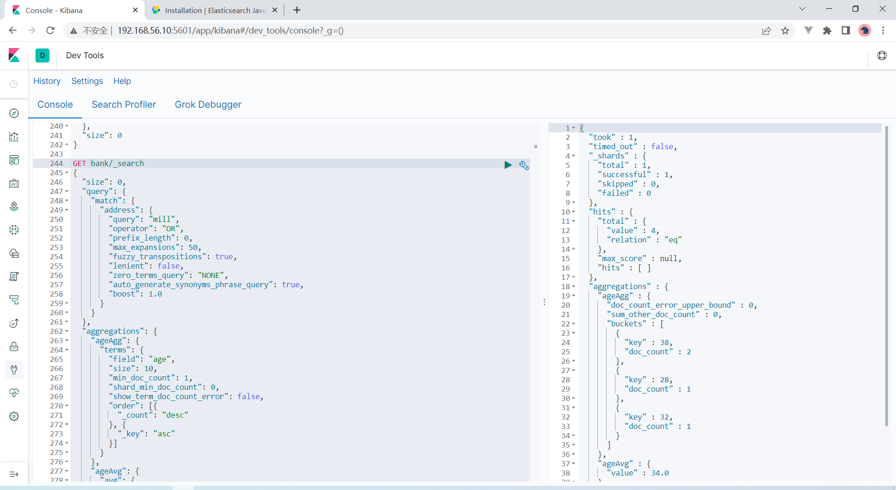

##### 4、响应的数据

可以看到 **想要的响应** 和 **实际接收的响应** 一样

###### 1、想要的响应

```json
{
  "took" : 0,
  "timed_out" : false,
  "_shards" : {
    "total" : 1,
    "successful" : 1,
    "skipped" : 0,
    "failed" : 0
  },
  "hits" : {
    "total" : {
      "value" : 4,
      "relation" : "eq"
    },
    "max_score" : null,
    "hits" : [ ]
  },
  "aggregations" : {
    "ageAgg" : {
      "doc_count_error_upper_bound" : 0,
      "sum_other_doc_count" : 0,
      "buckets" : [
        {
          "key" : 38,
          "doc_count" : 2
        },
        {
          "key" : 28,
          "doc_count" : 1
        },
        {
          "key" : 32,
          "doc_count" : 1
        }
      ]
    },
    "ageAvg" : {
      "value" : 34.0
    },
    "balanceAvg" : {
      "value" : 25208.0
    }
  }
}
```

###### 2、实际接收的响应

```json
{
	"took": 9,
	"timed_out": false,
	"_shards": {
		"total": 1,
		"successful": 1,
		"skipped": 0,
		"failed": 0
	},
	"hits": {
		"total": {
			"value": 4,
			"relation": "eq"
		},
		"max_score": null,
		"hits": []
	},
	"aggregations": {
		"lterms#ageAgg": {
			"doc_count_error_upper_bound": 0,
			"sum_other_doc_count": 0,
			"buckets": [{
				"key": 38,
				"doc_count": 2
			}, {
				"key": 28,
				"doc_count": 1
			}, {
				"key": 32,
				"doc_count": 1
			}]
		},
		"avg#ageAvg": {
			"value": 34.0
		},
		"avg#balanceAvg": {
			"value": 25208.0
		}
	}
}
```

##### 5、获取响应的实体类信息

###### 1、修改代码

修改`gulimall-search`模块的`com.atguigu.gulimall.search.GulimallSearchApplicationTests`测试类中`searchData`方法

将`sourceBuilder.size(0);`注释掉，并添加获取响应信息的代码

```java
@Test
public void searchData() throws IOException {
   //1、创建检索请求
   SearchRequest searchRequest = new SearchRequest();
   //指定索引
   searchRequest.indices("bank");

   //指定DSL，检索条件
   SearchSourceBuilder sourceBuilder = new SearchSourceBuilder();
   //sourceBuilder.query();
   //sourceBuilder.from();
   //sourceBuilder.size();
   //sourceBuilder.aggregation()
   sourceBuilder.query(QueryBuilders.matchQuery("address","mill"));

   TermsAggregationBuilder ageAgg = AggregationBuilders.terms("ageAgg").field("age").size(10);
   sourceBuilder.aggregation(ageAgg);
   AvgAggregationBuilder ageAvg = AggregationBuilders.avg("ageAvg").field("age");
   sourceBuilder.aggregation(ageAvg);
   AvgAggregationBuilder balanceAvg = AggregationBuilders.avg("balanceAvg").field("balance");
   sourceBuilder.aggregation(balanceAvg);

   //sourceBuilder.size(0);
   System.out.println(sourceBuilder);

   searchRequest.source(sourceBuilder);

   //2、执行检索
   SearchResponse searchResponse = client.search(searchRequest,GulimallElasticSearchConfig.COMMON_OPTIONS);

   //3、分析结果
   System.out.println(searchResponse);
   SearchHits hits = searchResponse.getHits();
   SearchHit[] searchHits = hits.getHits();
   /*
    {"_index" : "bank",
       "_type" : "account",
       "_id" : "472",
       "_score" : 5.4032025,
       "_source" : {}}
    */
   for (SearchHit hit : searchHits) {
      String string = hit.getSourceAsString();
      Account account = JSON.parseObject(string, Account.class);
      System.out.println("account:"+account);
   }
}

@ToString
@Data
static class Account{
      private int account_number;
      private int balance;
      private String firstname;
      private String lastname;
      private int age;
      private String gender;
      private String address;
      private String employer;
      private String email;
      private String city;
      private String state;
}
```

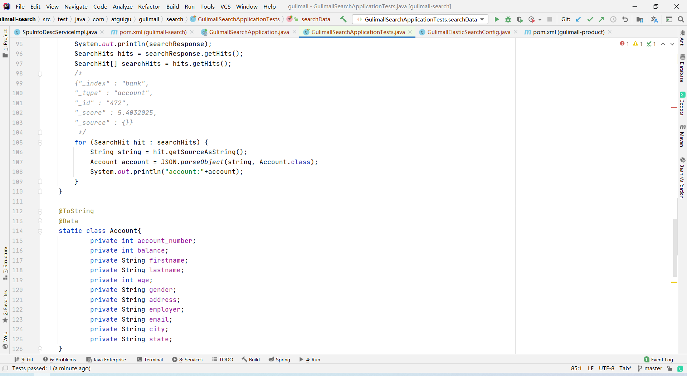

###### 2、测试

可以看到已经封装到`Account`类里了

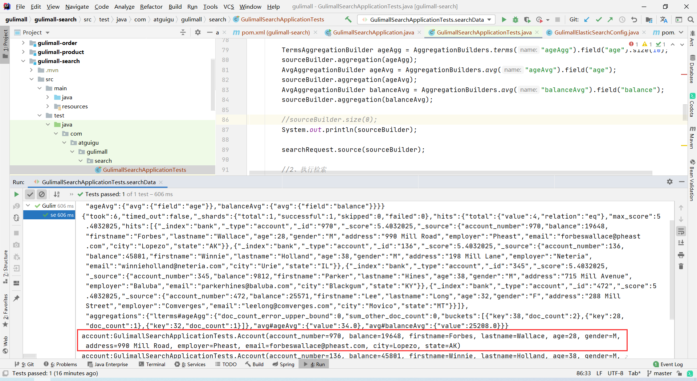

##### 6、获取响应的分析数据

在`gulimall-search`模块的`com.atguigu.gulimall.search.GulimallSearchApplicationTests`测试类中`searchData`方法里添加如下代码：

```java
//3.2、获取这次检索的分析信息
Aggregations aggregations = searchResponse.getAggregations();
Terms ageAgg1 = aggregations.get("ageAgg");
for (Terms.Bucket bucket : ageAgg1.getBuckets()) {
   String keyAsString = bucket.getKeyAsString();
   System.out.println("年龄："+keyAsString+"==>"+bucket.getDocCount());
}
Avg balanceAvg1 = aggregations.get("balanceAvg");
System.out.println("平均薪资："+balanceAvg1.getValue());
```

进行测试，可以发现已经打印出数据了

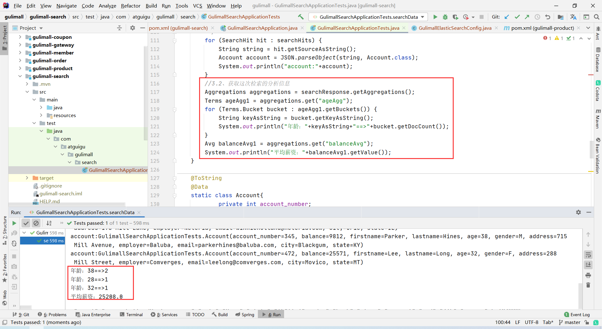

##### 7、完整代码

`gulimall-search`模块的`com.atguigu.gulimall.search.GulimallSearchApplicationTests`测试类的完整代码：

```java
package com.atguigu.gulimall.search;

import com.alibaba.fastjson.JSON;
import com.atguigu.gulimall.search.config.GulimallElasticSearchConfig;
import lombok.Data;
import lombok.ToString;
import org.elasticsearch.action.index.IndexRequest;
import org.elasticsearch.action.index.IndexResponse;
import org.elasticsearch.action.search.SearchRequest;
import org.elasticsearch.action.search.SearchResponse;
import org.elasticsearch.client.RestHighLevelClient;
import org.elasticsearch.common.xcontent.XContentType;
import org.elasticsearch.index.query.QueryBuilders;
import org.elasticsearch.search.SearchHit;
import org.elasticsearch.search.SearchHits;
import org.elasticsearch.search.aggregations.AggregationBuilders;
import org.elasticsearch.search.aggregations.Aggregations;
import org.elasticsearch.search.aggregations.bucket.terms.Terms;
import org.elasticsearch.search.aggregations.bucket.terms.TermsAggregationBuilder;
import org.elasticsearch.search.aggregations.metrics.Avg;
import org.elasticsearch.search.aggregations.metrics.AvgAggregationBuilder;
import org.elasticsearch.search.builder.SearchSourceBuilder;
import org.junit.Test;
import org.junit.runner.RunWith;
import org.springframework.beans.factory.annotation.Autowired;
import org.springframework.boot.test.context.SpringBootTest;
import org.springframework.test.context.junit4.SpringRunner;

import java.io.IOException;

@RunWith(SpringRunner.class)
@SpringBootTest
public class GulimallSearchApplicationTests {

   @Autowired
   RestHighLevelClient client;

/* 从es中查询数据
GET bank/_search
{
  "query": {
    "match": {
      "address": "mill"
    }
  },
  "aggs": {
    "ageAgg": {
      "terms": {
        "field": "age",
        "size": 10
      }
    },
    "ageAvg": {
      "avg": {
        "field": "age"
      }
    },
    "balanceAvg": {
      "avg": {
        "field": "balance"
      }
    }
  },
  "size": 0
}
 */
   @Test
   public void searchData() throws IOException {
      //1、创建检索请求
      SearchRequest searchRequest = new SearchRequest();
      //指定索引
      searchRequest.indices("bank");

      //指定DSL，检索条件
      SearchSourceBuilder sourceBuilder = new SearchSourceBuilder();
      //sourceBuilder.query();
      //sourceBuilder.from();
      //sourceBuilder.size();
      //sourceBuilder.aggregation()
      sourceBuilder.query(QueryBuilders.matchQuery("address","mill"));

      TermsAggregationBuilder ageAgg = AggregationBuilders.terms("ageAgg").field("age").size(10);
      sourceBuilder.aggregation(ageAgg);
      AvgAggregationBuilder ageAvg = AggregationBuilders.avg("ageAvg").field("age");
      //嵌套聚合
      //ageAvg.subAggregation(AggregationBuilders.avg().field())
      sourceBuilder.aggregation(ageAvg);
      AvgAggregationBuilder balanceAvg = AggregationBuilders.avg("balanceAvg").field("balance");
      sourceBuilder.aggregation(balanceAvg);

      //sourceBuilder.size(0);
      System.out.println(sourceBuilder);

      searchRequest.source(sourceBuilder);

      //2、执行检索
      SearchResponse searchResponse = client.search(searchRequest,GulimallElasticSearchConfig.COMMON_OPTIONS);

      //3、分析结果
      System.out.println(searchResponse);
      //3.1、获取符合条件的实体类
      SearchHits hits = searchResponse.getHits();
      SearchHit[] searchHits = hits.getHits();
      /*
       {"_index" : "bank",
        "_type" : "account",
        "_id" : "472",
        "_score" : 5.4032025,
        "_source" : {}}
       */
      for (SearchHit hit : searchHits) {
         String string = hit.getSourceAsString();
         Account account = JSON.parseObject(string, Account.class);
         System.out.println("account:"+account);
      }
      //3.2、获取这次检索的分析信息
      Aggregations aggregations = searchResponse.getAggregations();
      Terms ageAgg1 = aggregations.get("ageAgg");
      for (Terms.Bucket bucket : ageAgg1.getBuckets()) {
         String keyAsString = bucket.getKeyAsString();
         System.out.println("年龄："+keyAsString+"==>"+bucket.getDocCount());
      }
      Avg balanceAvg1 = aggregations.get("balanceAvg");
      System.out.println("平均薪资："+balanceAvg1.getValue());
   }

   @ToString
   @Data
   static class Account{
         private int account_number;
         private int balance;
         private String firstname;
         private String lastname;
         private int age;
         private String gender;
         private String address;
         private String employer;
         private String email;
         private String city;
         private String state;
   }

   /**
    * 存储或更新数据到es
    * @throws IOException
    */
   @Test
   public void indexData() throws IOException {
      IndexRequest indexRequest = new IndexRequest("users");
      //数据的id
      indexRequest.id("1");

      //indexRequest.source("userName","zhangsan","age",18,"gender","男");
      User user = new User();
      String jsonString = JSON.toJSONString(user);
      //要保存的内容
      indexRequest.source(jsonString, XContentType.JSON);

      //执行操作
      IndexResponse indexResponse = client.index(indexRequest, GulimallElasticSearchConfig.COMMON_OPTIONS);

      //提取有用的响应信息
      System.out.println(indexResponse);
   }

   @Data
   class User{
      private String userName;
      private String gender;
      private Integer age;
   }


   @Test
   public void contextLoads() {
      System.out.println(client);
   }
}
```

## 5.2、商城业务-商品上架

### 5.2.1、sku在es中存储模型分析

`"index": false,` 不可以被检索，但可以查询(可以通过`skuTitle`检索查出`skuImg`，但不可以通过`skuImg`检索)

`"doc_values": false` 不可以做聚合、排序、脚本等操作，这样会省一些内存

` "type": "nested",` 该字段是集合，防止扁平化处理

```json
PUT product
{
  "mappings": {
    "properties": {
      "skuId": {
        "type": "long"
      },
      "spuId": {
        "type": "keyword"
      },
      "skuTitle": {
        "type": "text",
        "analyzer": "ik_smart"
      },
      "skuPrice": {
        "type": "double"
      },
      "skuImg": {
        "type": "keyword",
        "index": false,
        "doc_values": false
      },
      "saleCount": {
        "type": "long"
      },
      "hasStock": {
        "type": "boolean"
      },
      "hotScore": {
        "type": "long"
      },
      "brandId": {
        "type": "long"
      },
      "catalogId": {
        "type": "long"
      },
      "brandName": {
        "type": "keyword",
        "index": false,
        "doc_values": false
      },
      "brandImg": {
        "type": "keyword",
        "index": false,
        "doc_values": false
      },
      "catalogName": {
        "type": "keyword",
        "index": false,
        "doc_values": false
      },
      "attrs": {
        "type": "nested",
        "properties": {
          "attrId": {
            "type": "long"
          },
          "attrName": {
            "type": "keyword",
            "index": false,
            "doc_values": false
          },
          "attrValue": {
            "type": "keyword"
          }
        }
      }
    }
  }
}
```

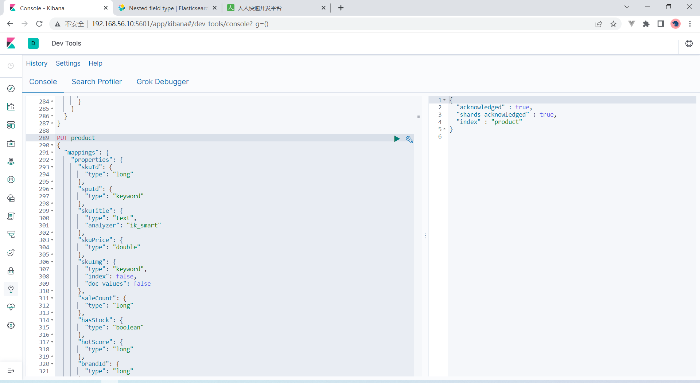

### 5.2.2、扁平化处理

查看官方文档：https://www.elastic.co/guide/en/elasticsearch/reference/8.3/nested.html

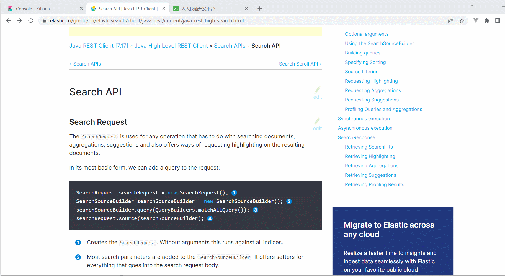

#### 1、不加入`nested`

```json
PUT my_index2/_doc/1
{
  "group" : "fans",
  "user" : [ 
    {
      "first" : "John",
      "last" :  "Smith"
    },
    {
      "first" : "Alice",
      "last" :  "White"
    }
  ]
}
```

在索引index中，存入user的数据，最终 es 会将上述数据，扁平化处理，实际存储如下这样子：

```json
{
  "group" :        "fans",
  "user.first" : [ "alice", "john" ],
  "user.last" :  [ "smith", "white" ]
}
```

很明显，数据存储成这样子，丢失了first 和 last 之间关系。从这样的存储中，我们无法确定，first 为 “alice” ，对应的 last 是 “smith” 还是 “white”。

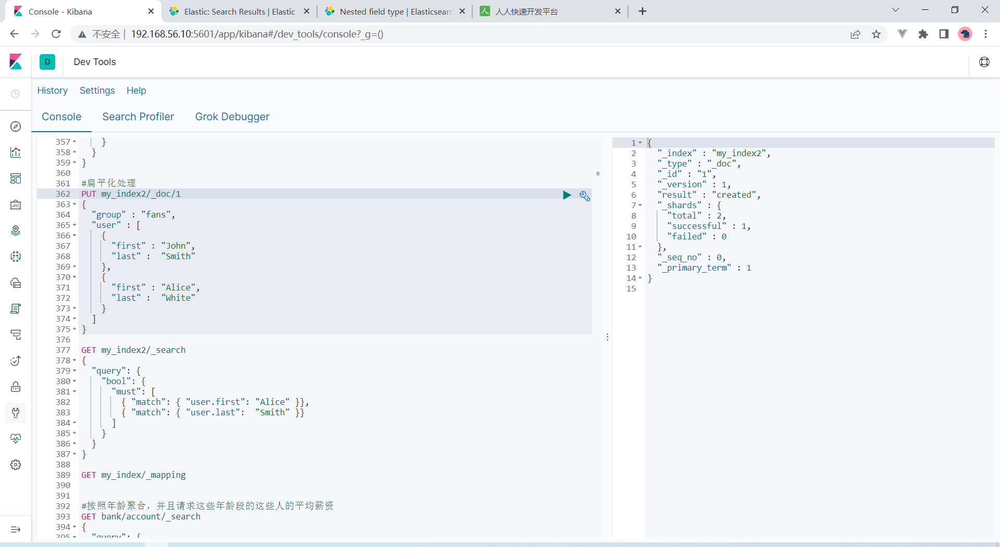

执行如下查询：

```json
GET my_index2/_search
{
  "query": {
    "bool": {
      "must": [
        { "match": { "user.first": "Alice" }},
        { "match": { "user.last":  "Smith" }}
      ]
    }
  }
}
```

查询到的结果：

```json
{
  "took" : 6,
  "timed_out" : false,
  "_shards" : {
    "total" : 1,
    "successful" : 1,
    "skipped" : 0,
    "failed" : 0
  },
  "hits" : {
    "total" : {
      "value" : 1,
      "relation" : "eq"
    },
    "max_score" : 0.5753642,
    "hits" : [
      {
        "_index" : "my_index",
        "_type" : "_doc",
        "_id" : "1",
        "_score" : 0.5753642,
        "_source" : {
          "group" : "fans",
          "user" : [
            {
              "first" : "John",
              "last" : "Smith"
            },
            {
              "first" : "Alice",
              "last" : "White"
            }
          ]
        }
      }
    ]
  }
}
```

查询到一条数据，而这样的数据并不是我们想要的。因为通过 `"first" 为 "Alice"` 和 `"last" 为 "Smith"`，不应该查询到数据。之所以查询到数据，是因为数组中存储的对象被扁平化处理了。

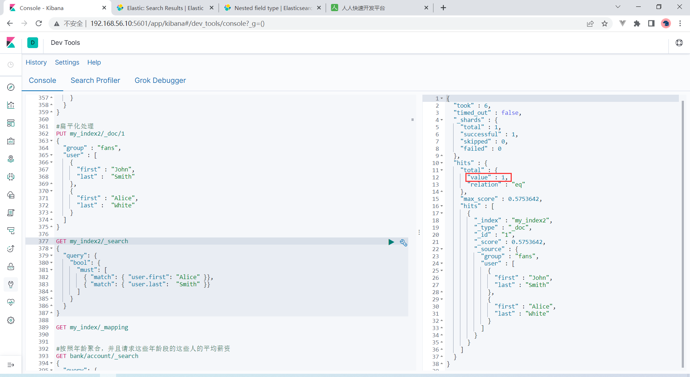

获取映射信息

```
GET my_index2/_mapping
```

```json
{
  "my_index2" : {
    "mappings" : {
      "properties" : {
        "group" : {
          "type" : "text",
          "fields" : {
            "keyword" : {
              "type" : "keyword",
              "ignore_above" : 256
            }
          }
        },
        "user" : {
          "properties" : {
            "first" : {
              "type" : "text",
              "fields" : {
                "keyword" : {
                  "type" : "keyword",
                  "ignore_above" : 256
                }
              }
            },
            "last" : {
              "type" : "text",
              "fields" : {
                "keyword" : {
                  "type" : "keyword",
                  "ignore_above" : 256
                }
              }
            }
          }
        }
      }
    }
  }
}
```


#### 2、加入`nested`

如果数组里存储的是对象，那么数组的类型应该是 nested，这样，再将对象数据存入数组中时，对象便不会被扁平化处理。

修改索引的mapping信息，将user数组的类型定义为 nested 并存入数据，重新执行检索。

```json
PUT my_index3
{
  "mappings": {
    "properties": {
      "user": {
        "type": "nested" 
      }
    }
  }
}

PUT my_index3/_doc/1
{
  "group" : "fans",
  "user" : [ 
    {
      "first" : "John",
      "last" :  "Smith"
    },
    {
      "first" : "Alice",
      "last" :  "White"
    }
  ]
}
```

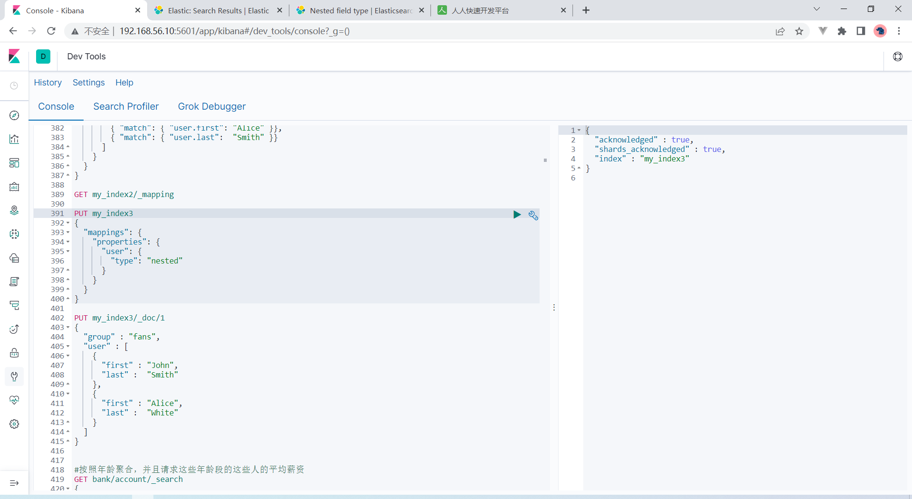


执行同样查询：

```json
GET my_index3/_search
{
  "query": {
    "bool": {
      "must": [
        { "match": { "user.first": "Alice" }},
        { "match": { "user.last":  "Smith" }}
      ]
    }
  }
}
```

获取到的结果为空：

```json
{
  "took" : 11,
  "timed_out" : false,
  "_shards" : {
    "total" : 1,
    "successful" : 1,
    "skipped" : 0,
    "failed" : 0
  },
  "hits" : {
    "total" : {
      "value" : 0,
      "relation" : "eq"
    },
    "max_score" : null,
    "hits" : [ ]
  }
}
```

这样的结果才是我们想要的，这样防止了 frist 和 last 之间关系的丢失。

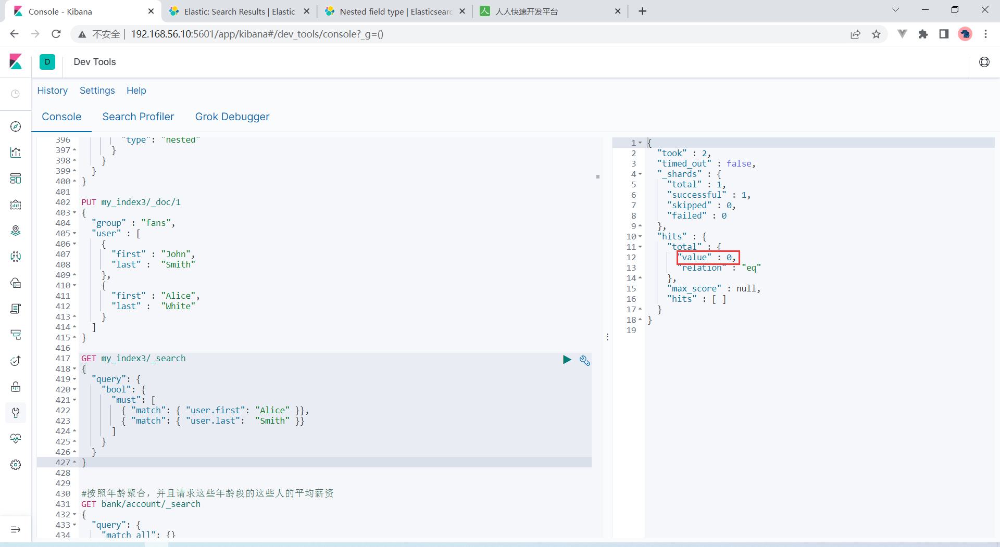

### 5.2.3、构造基本数据

#### 1、查看接口

请求url： http://localhost:88/api/product/spuinfo/1/up

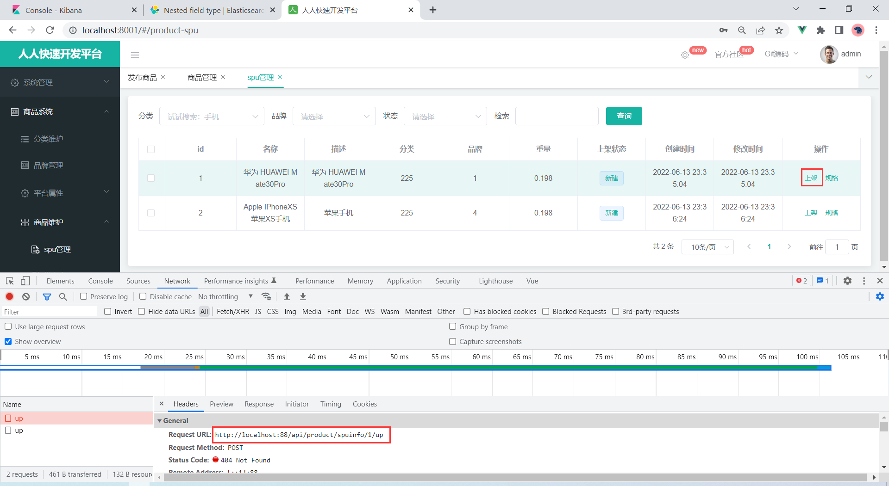

接口文档： https://easydoc.net/s/78237135/ZUqEdvA4/DhOtFr4A

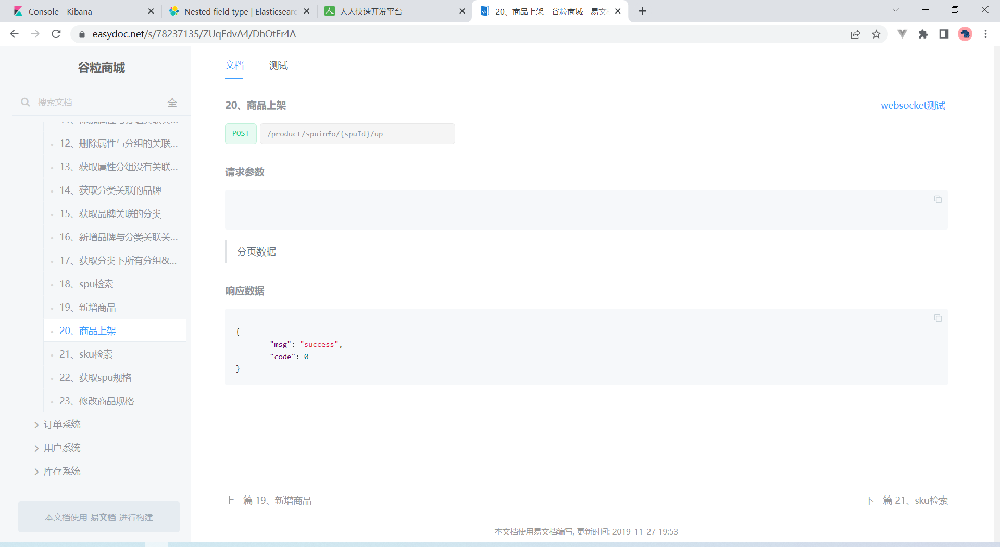

#### 2、添加`spuUp`方法

在`gulimall-product`模块的`com.atguigu.gulimall.product.controller.SpuInfoController`类里添加`spuUp`方法

```java
@PostMapping("/{spuId}/up")
public R spuUp(@PathVariable("spuId") Long spuId) {
    spuInfoService.up(spuId);

    return R.ok();
}
```

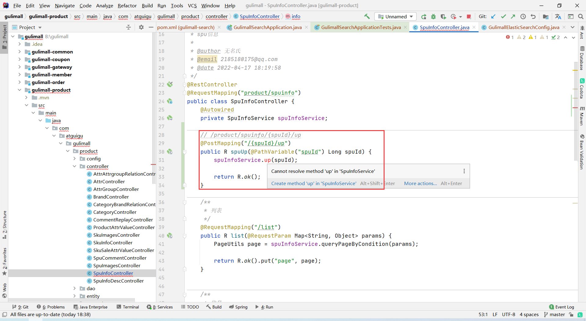

#### 3、添加`up`抽象方法

在`gulimall-product`模块的`com.atguigu.gulimall.product.service.SpuInfoService`抽象接口里添加`up`抽象方法

```java
/**
 * 商品上架
 * @param spuId
 */
void up(Long spuId);
```

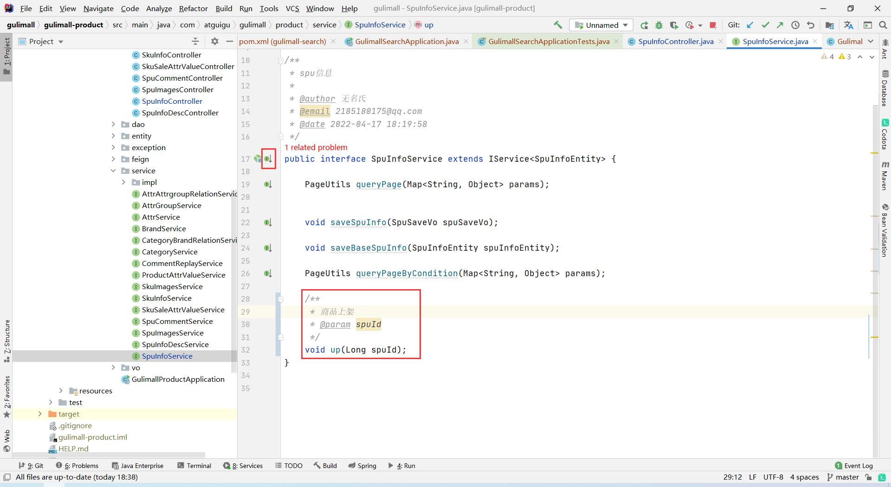

#### 4、新建`SkuEsModel`类

在`gulimall-common`模块的`com.atguigu.common.to`包下新建`es`文件夹，在`es`文件夹下新建`SkuEsModel`类

```java
package com.atguigu.common.to.es;

import lombok.Data;

import java.math.BigDecimal;
import java.util.List;

/**
 * @author 无名氏
 * @date 2022/7/5
 * @Description:
 */
@Data
public class SkuEsModel {

    private Long skuId;

    private Long spuId;

    private String skuTitle;

    private BigDecimal skuPrice;

    private String skuImg;

    private Long saleCount;
    /**
     * 是否还有库存
     */
    private Boolean hasStock;
    /**
     * 热度评分
     */
    private Long hotScore;
    /**
     * 品牌id
     */
    private Long brandId;
    /**
     * 分类id
     */
    private Long catalogId;
    /**
     * 品牌名
     */
    private String brandName;
    /**
     * 品牌图片
     */
    private String brandImg;
    /**
     * 分类名
     */
    private String catalogName;

    private List<Attr> attrs;

    @Data
    public static class Attr{
        private Long attrId;

        private String attrName;

        private String attrValue;
    }
}
```

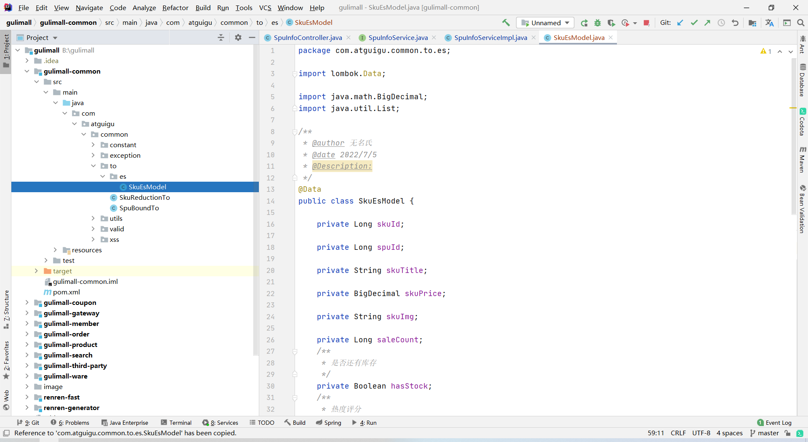

#### 5、实现`up`抽象方法

##### 1、修改`up`方法

修改`gulimall-product`模块的`com.atguigu.gulimall.product.service.impl.SpuInfoServiceImpl`类的`up`方法

```java
@Override
public void up(Long spuId) {
    List<SkuEsModel> upProducts = new ArrayList<>();

    //组装需要的数据
    SkuEsModel esModel = new SkuEsModel();
    //1、查出当前spuId对应的所有sku信息,包括品牌的名字。
    List<SkuInfoEntity> skuInfoEntities = skuInfoService.getSkusBySpuId(spuId);
}
```

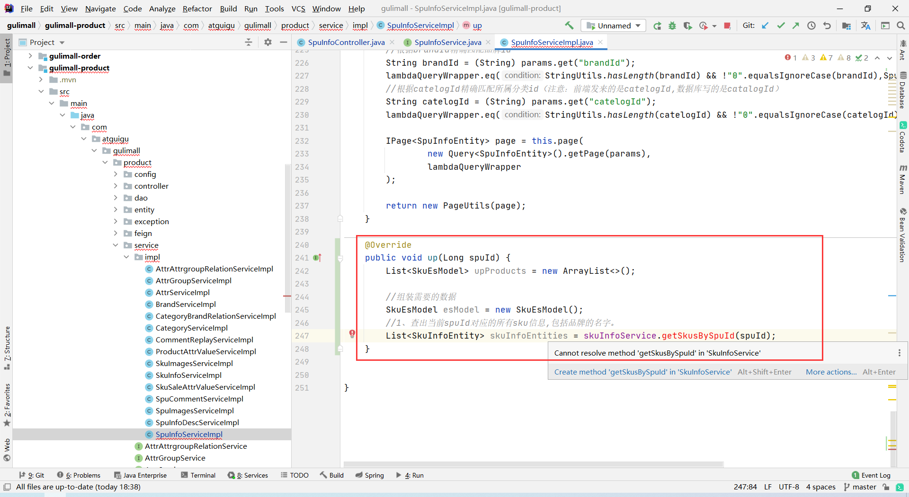

##### 2、添加`getSkusBySpuId`抽象方法

在`gulimall-product`模块的`com.atguigu.gulimall.product.service.SkuInfoService`抽象类里添加`getSkusBySpuId`抽象方法

```java
List<SkuInfoEntity> getSkusBySpuId(Long spuId);
```

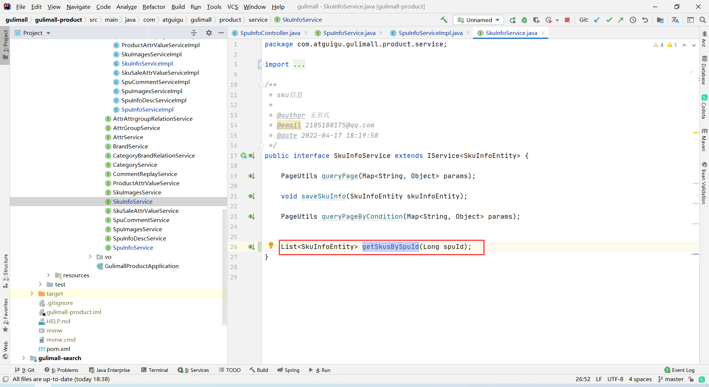

##### 3、实现`getSkusBySpuId`抽象方法

在`gulimall-product`模块的`com.atguigu.gulimall.product.service.impl.SkuInfoServiceImpl`类里实现`getSkusBySpuId`抽象方法

(这里的`lambdaQueryWrapper.eq(SkuInfoEntity::getSKuId,spuId);`写错了，应该为`lambdaQueryWrapper.eq(SkuInfoEntity::getSpuId,spuId);`)

```java
@Override
public List<SkuInfoEntity> getSkusBySpuId(Long spuId) {
    LambdaQueryWrapper<SkuInfoEntity> lambdaQueryWrapper = new LambdaQueryWrapper<>();
    lambdaQueryWrapper.eq(SkuInfoEntity::getSKuId,spuId);
    List<SkuInfoEntity> list = this.list(lambdaQueryWrapper);
    return list;
}
```

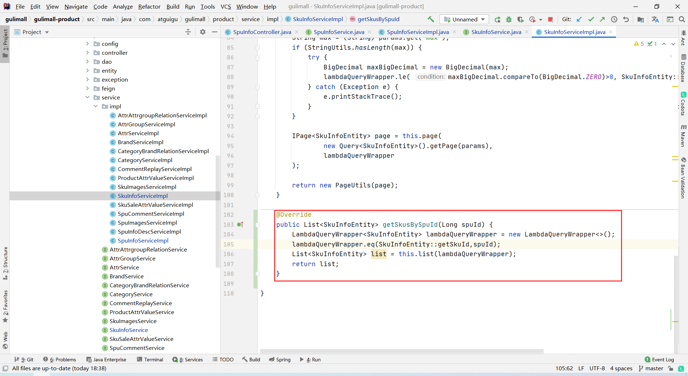

##### 4、对比`SkuEsModel`类与`SkuInfoEntity`类

`SkuEsModel`类与`SkuInfoEntity`类共同有的属性，但属性名不一样的数据的对比

| SkuEsModel类中的属性名 | SkuInfoEntity类中的属性名 |
| ---------------------- | ------------------------- |
| skuPrice               | price                     |
| skuImg                 | skuDefaultImg             |

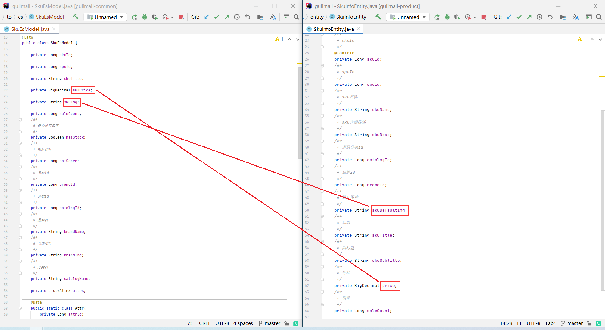

`SkuEsModel`类有的属性，而`SkuInfoEntity`类没有的属性

```java
hasStock    //是否还有库存
hotScore 	//热度评分
brandName 	//品牌名
BrandImg 	//品牌图片
catalogName //分类名
attrs
```

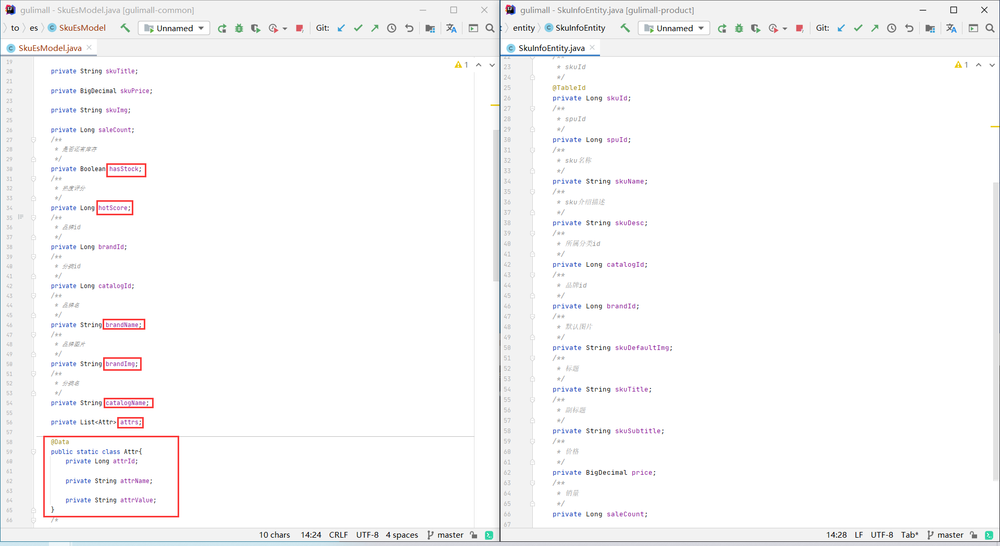

#### 6、修改`up`方法

##### 1、修改`up`方法

修改`gulimall-product`模块的`com.atguigu.gulimall.product.service.impl.SpuInfoServiceImpl`类的`up`方法

```java
@Autowired
BrandService brandService;
@Autowired
CategoryService categoryService;

@Override
public void up(Long spuId) {
    //attrs
    //TODO 4、查询当前sku的所有可以被用来检索的规格属性。
    List<ProductAttrValueEntity> productAttrValueEntities = productAttrValueService.baseAttrlistforspu(spuId);
    List<Long> attrIds = productAttrValueEntities.stream().map(ProductAttrValueEntity::getAttrId).collect(Collectors.toList());
    List<Long> searchAttrIds = attrService.selectSearchAttrIds(attrIds);
    Set<Long> idSet = new HashSet<>(searchAttrIds);

    List<SkuEsModel.Attr> attrList = productAttrValueEntities.stream().filter(item -> {
        return idSet.contains(item.getAttrId());
    }).map(item -> {
        SkuEsModel.Attr attr = new SkuEsModel.Attr();
        BeanUtils.copyProperties(item, attr);
        return attr;
    }).collect(Collectors.toList());

    //1、查出当前spuId对应的所有sku信息,包括品牌的名字。
    List<SkuInfoEntity> skuInfoEntities = skuInfoService.getSkusBySpuId(spuId);
    List<SkuEsModel> collect = skuInfoEntities.stream().map(skuInfoEntity -> {
        //组装需要的数据
        SkuEsModel skuEsModel = new SkuEsModel();
        BeanUtils.copyProperties(skuInfoEntity, skuEsModel);
        //skuPrice
        //skuImg
        //hasStock      是否还有库存
        //TODO 1、发送远程调用，在库存系统中查询是否有库存，并不用知道库存是多少
        //hotScore      热度评分
        //TODO 2、热度评分，默认为 0
        skuEsModel.setHotScore(0L);
        //brandName：品牌名   BrandImg：品牌图片
        //TODO 3、查询品牌和分类的名字信息
        BrandEntity brandEntity = brandService.getById(skuInfoEntity.getBrandId());
        skuEsModel.setBrandName(brandEntity.getName());
        skuEsModel.setBrandImg(brandEntity.getLogo());
        //catalogName   分类名
        CategoryEntity categoryEntity = categoryService.getById(skuInfoEntity.getCatalogId());
        skuEsModel.setCatalogName(categoryEntity.getName());
        //设置检索属性
        skuEsModel.setAttrs(attrList);
        return skuEsModel;
    }).collect(Collectors.toList());
    //TODO 5、将数据发送给es进行保存
}
```

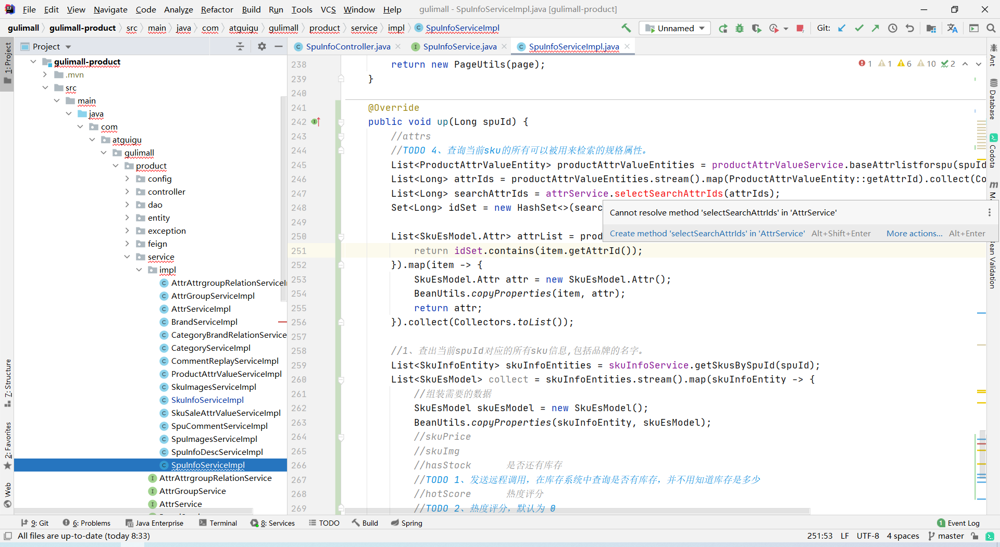

##### 2、添加`selectSearchAttrIds`抽象方法

在`gulimall-product`模块的`com.atguigu.gulimall.product.service.AttrService`抽象类里添加`selectSearchAttrIds`抽象方法

```java
/**
 * 在指定的所有属性集合里面挑出检索属性
 * @param attrIds
 * @return
 */
List<Long> selectSearchAttrIds(List<Long> attrIds);
```


##### 3、添加`selectSearchAttrIds`方法

在`gulimall-product`模块的`com.atguigu.gulimall.product.service.impl.AttrServiceImpl`类里添加`selectSearchAttrIds`方法

```java
@Override
public List<Long> selectSearchAttrIds(List<Long> attrIds) {
    //select attr_id from `pms_attr` where attr_id in(?) and search_type = 1
    return this.baseMapper.selectSearchAttrIds(attrIds);
}
```

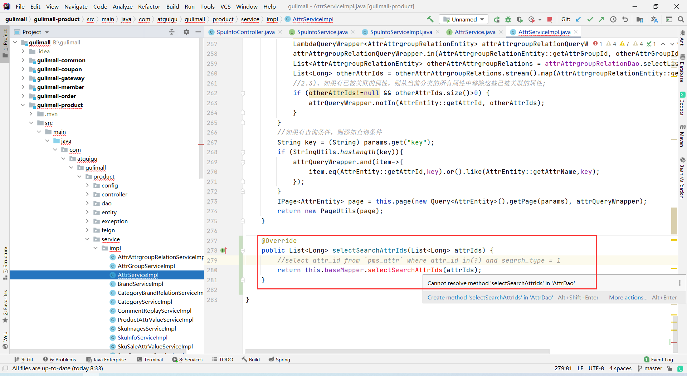

##### 4、添加`selectSearchAttrIds`抽象方法

在`gulimall-product`模块的`com.atguigu.gulimall.product.dao.AttrDao`接口里添加`selectSearchAttrIds`抽象方法

```java
List<Long> selectSearchAttrIds(@Param("attrIds") List<Long> attrIds);
```

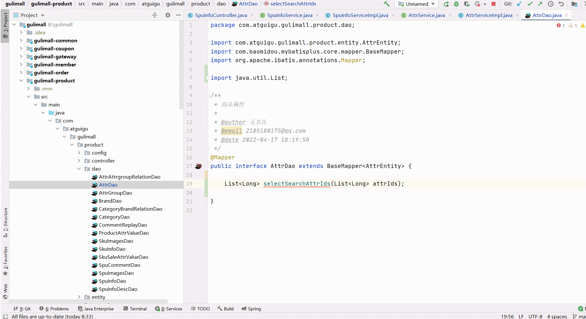

##### 5、修改`AttrDao.xml`文件

在`gulimall-product`模块的`src/main/resources/mapper/product/AttrDao.xml`文件里添加如下代码

```xml
<select id="selectSearchAttrIds" resultType="java.lang.Long">
    select attr_id from gulimall_pms.pms_attr
    <where>
        attr_id in
        <foreach collection="attrIds" item="attrId" separator="," open="(" close=")">
            #{attrId}
        </foreach>
        and search_type = 1
    </where>
</select>
```

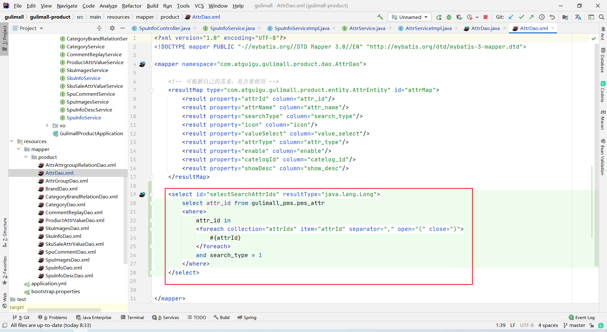

### 5.2.4、远程查询库存&泛型结果封装

#### 1、新建`SkuHasStock`类

在`gulimall-ware`模块的`com.atguigu.gulimall.ware.vo`里新建`SkuHasStock`类

```java
package com.atguigu.gulimall.ware.vo;

import lombok.Data;

/**
 * @author 无名氏
 * @date 2022/7/6
 * @Description:
 */
@Data
public class SkuHasStock {

    private Long skuId;
    private Boolean hasStock;
}
```

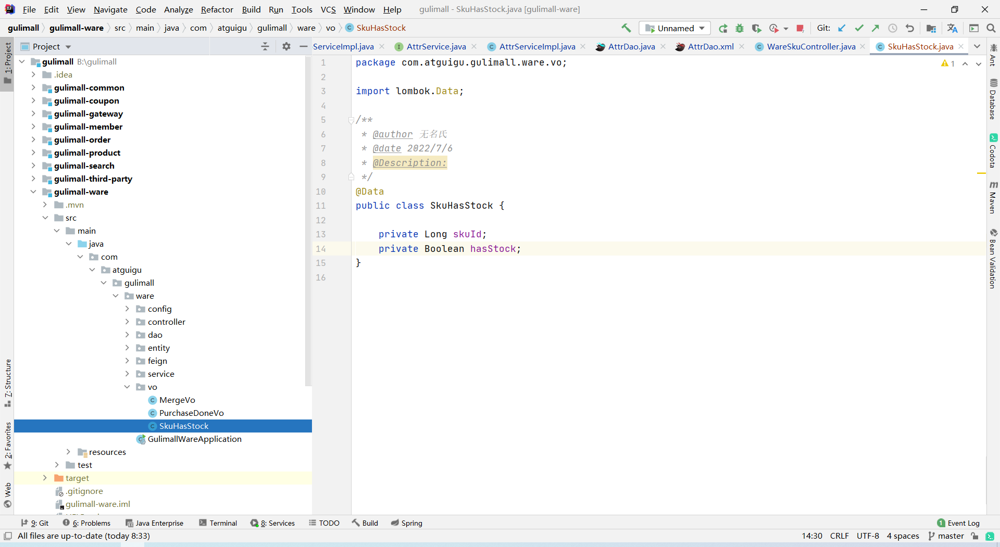

#### 2、添加`getSkuHasStock`方法

在`gulimall-ware`模块的`com.atguigu.gulimall.ware.controller.WareSkuController`类里添加`getSkuHasStock`方法

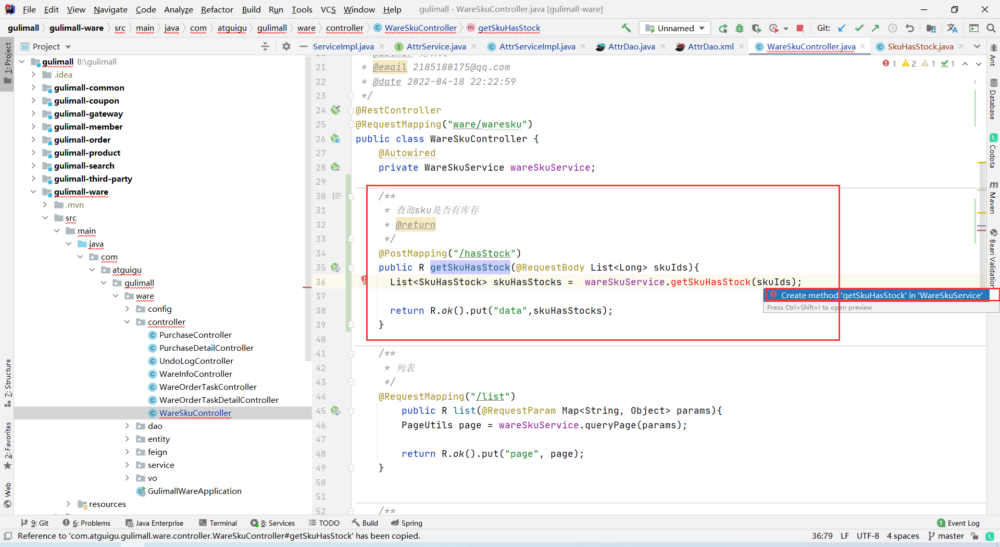

#### 3、添加`getSkuHasStock`抽象方法

在`gulimall-ware`模块的`com.atguigu.gulimall.ware.service.WareSkuService`接口里添加`getSkuHasStock`抽象方法

```java
List<SkuHasStock> getSkuHasStock(List<Long> skuIds);
```

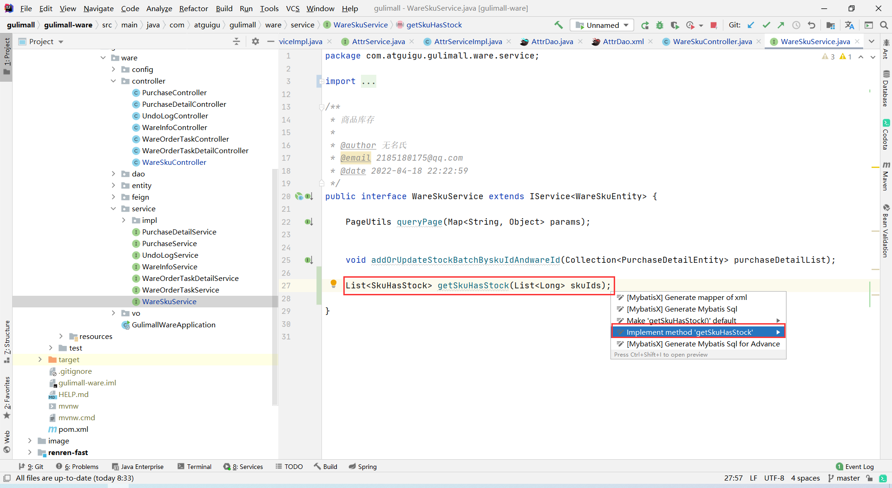

#### 4、添加`getSkuHasStock`方法

在`gulimall-ware`模块的`com.atguigu.gulimall.ware.service.impl.WareSkuServiceImpl`类里添加`getSkuHasStock`方法

```java
@Override
public List<SkuHasStock> getSkuHasStock(List<Long> skuIds) {
    List<SkuHasStock> collect = skuIds.stream().map(skuId -> {
        SkuHasStock vo = new SkuHasStock();
        //SELECT SUM (stock) FROM、 wms ware skui WHERE sku id=1
        long count = this.baseMapper.getSkuStock(skuId);

        vo.setSkuId(skuId);
        vo.setHasStock(count > 0);
        return vo;
    }).collect(Collectors.toList());

    return collect;
}
```

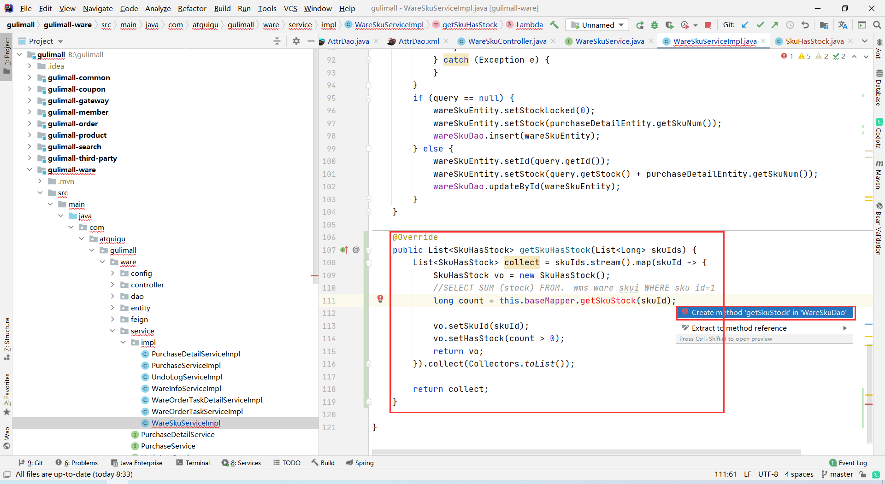

#### 5、添加`getSkuStock`方法

在`gulimall-ware`模块的`com.atguigu.gulimall.ware.dao.WareSkuDao`类里添加`getSkuStock`方法

```java
long getSkuStock(Long skuId);
```

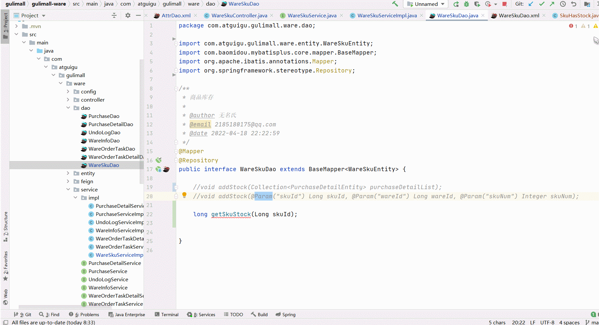

#### 6、添加`getSkuStock`

在`gulimall-ware`模块的`src/main/resources/mapper/ware/WareSkuDao.xml`文件里添加`getSkuStock`

```java
<!--   库存数 = 剩余库存 - 已被锁定的件数(已生成订单但未付款，已下单等)    -->
<select id="getSkuStock" resultType="java.lang.Long">
    select sum(stock-stock_locked) from gulimall_wms.wms_ware_sku where sku_id=#{skuId}
</select>
```

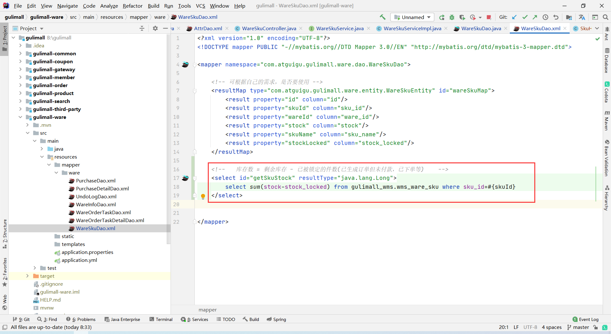

#### 7、重命名`SkuHasStock`

重新将`SkuHasStock`重命名为`SkuHasStockVo`


### 5.2.5、调用远程库存服务

#### 1、导入依赖

在`gulimall-product`模块的`pom`文件里添加如下依赖(已经添加过了)

```xml
<dependency>
    <groupId>org.springframework.cloud</groupId>
    <artifactId>spring-cloud-starter-openfeign</artifactId>
</dependency>
```

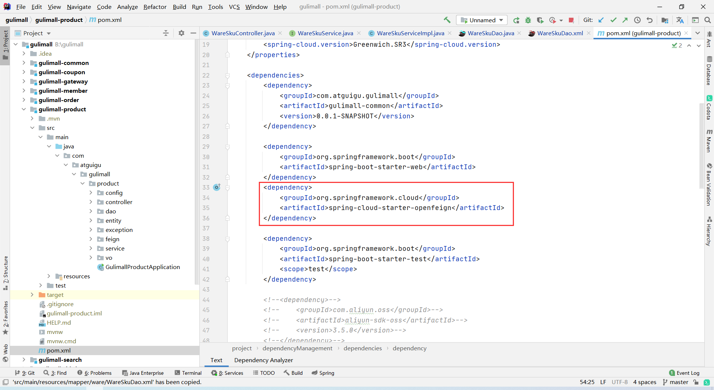

#### 2、开启远程调用

在`gulimall-product`模块的`com.atguigu.gulimall.product.GulimallProductApplication`启动类上添加如下注解(已经添加过了)

```java
@EnableFeignClients(basePackages = "com.atguigu.gulimall.product.feign")
```

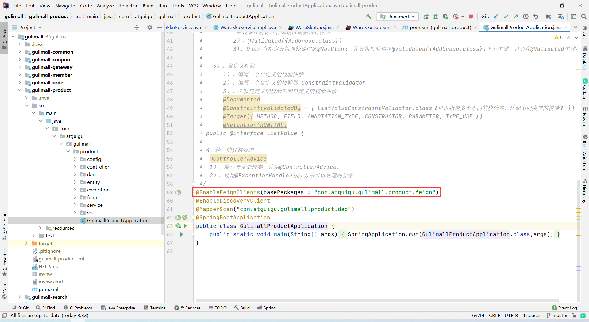

#### 3、添加`getSkuHasStock`抽象方法

在`gulimall-product`模块的`com.atguigu.gulimall.product.feign`包下新建`WareFelginService`接口,在`WareFelginService`接口里添加`getSkuHasStock`抽象方法

```java
package com.atguigu.gulimall.product.feign;

import com.atguigu.common.utils.R;
import org.springframework.cloud.openfeign.FeignClient;
import org.springframework.web.bind.annotation.PostMapping;
import org.springframework.web.bind.annotation.RequestBody;

import java.util.List;

/**
 * @author 无名氏
 * @date 2022/7/7
 * @Description:
 */
@FeignClient("gulimall-ware")
public interface WareFelginService {

    @PostMapping("/ware/waresku/hasStock")
    public R getSkuHasStock(@RequestBody List<Long> skuIds);
}
```

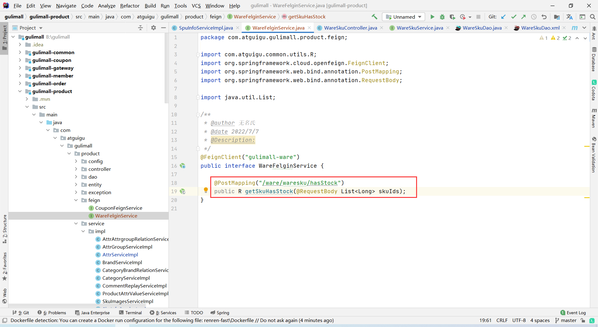

#### 4、修改RS

方法一：（不推荐）

可以在`gulimall-common`模块的`com.atguigu.common.utils.R`类里添加泛型，用于封装数据(但我不想用这种方式)

```java
/**
 * Copyright (c) 2016-2019 人人开源 All rights reserved.
 *
 * https://www.renren.io
 *
 * 版权所有，侵权必究！
 */

package com.atguigu.common.utils;

import com.atguigu.common.exception.BizCodeException;
import org.apache.http.HttpStatus;

import java.util.HashMap;
import java.util.Map;

/**
 * 返回数据
 *
 * @author Mark sunlightcs@gmail.com
 */
public class R<T> extends HashMap<String, Object> {
   private static final long serialVersionUID = 1L;
   private T data;

   public T getData() {
      return data;
   }

   public void setData(T data) {
      this.data = data;
   }

   public R() {
      put("code", 0);
      put("msg", "success");
   }
   
   public static R error() {
      return error(HttpStatus.SC_INTERNAL_SERVER_ERROR, "未知异常，请联系管理员");
   }
   
   public static R error(String msg) {
      return error(HttpStatus.SC_INTERNAL_SERVER_ERROR, msg);
   }
   
   public static R error(int code, String msg) {
      R r = new R();
      r.put("code", code);
      r.put("msg", msg);
      return r;
   }

   public static R error(BizCodeException bizCodeException){
      return error(bizCodeException.getCode(),bizCodeException.getMsg());
   }

   public static R ok(String msg) {
      R r = new R();
      r.put("msg", msg);
      return r;
   }
   
   public static R ok(Map<String, Object> map) {
      R r = new R();
      r.putAll(map);
      return r;
   }
   
   public static R ok() {
      return new R();
   }

   @Override
   public R put(String key, Object value) {
      super.put(key, value);
      return this;
   }

   public Integer getCode(){
      return (Integer) this.get("code");
   }
}
```

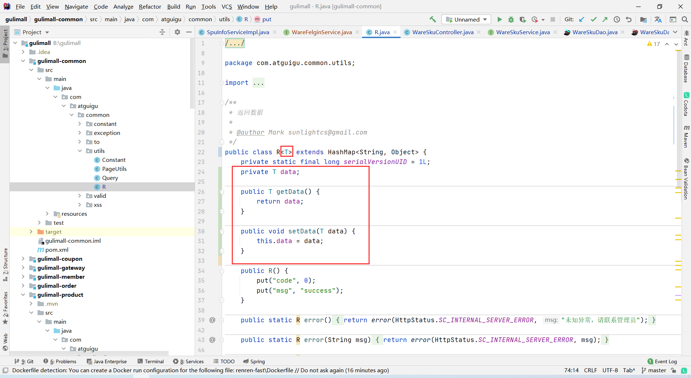

方法二：（推荐）

重新在`gulimall-common`模块的`com.atguigu.common.utils`包里新建`RS`类用于后端数据传输

```java
/**
 * Copyright (c) 2016-2019 人人开源 All rights reserved.
 *
 * https://www.renren.io
 *
 * 版权所有，侵权必究！
 */

package com.atguigu.common.utils;

import com.atguigu.common.exception.BizCodeException;
import org.apache.http.HttpStatus;

import java.util.HashMap;
import java.util.Map;

public class RS<T> extends HashMap<String, Object> {
   private static final long serialVersionUID = 1L;

   private T data;

   public T getData() {
      return data;
   }

   public void setData(T data) {
      this.data = data;
   }

   public RS(){

   }

   public RS(T t) {
      this.setData(data);
   }
   
   public RS<T> error() {
      return error(HttpStatus.SC_INTERNAL_SERVER_ERROR, "未知异常，请联系管理员");
   }
   
   public RS<T> error(String msg) {
      return error(HttpStatus.SC_INTERNAL_SERVER_ERROR, msg);
   }
   
   public RS<T> error(int code, String msg) {
      this.put("code", code);
      this.put("msg", msg);
      return this;
   }

   public RS<T> error(BizCodeException bizCodeException){
      return error(bizCodeException.getCode(),bizCodeException.getMsg());
   }

   public RS<T> ok() {
      this.put("code", 0);
      this.put("msg", "success");
      return this;
   }

   public RS<T> ok(String msg) {
      this.put("code", 0);
      this.put("msg", msg);
      return this;
   }

   public RS<T> ok(int code,String msg) {
      this.put("code", code);
      this.put("msg", msg);
      return this;
   }

   public RS<T> ok(Map<String, Object> map) {
      this.ok();
      this.putAll(map);
      return this;
   }


   @Override
   public RS<T> put(String key, Object value) {
      super.put(key, value);
      return this;
   }


   public Integer getCode(){
      return (Integer) this.get("code");
   }
}
```

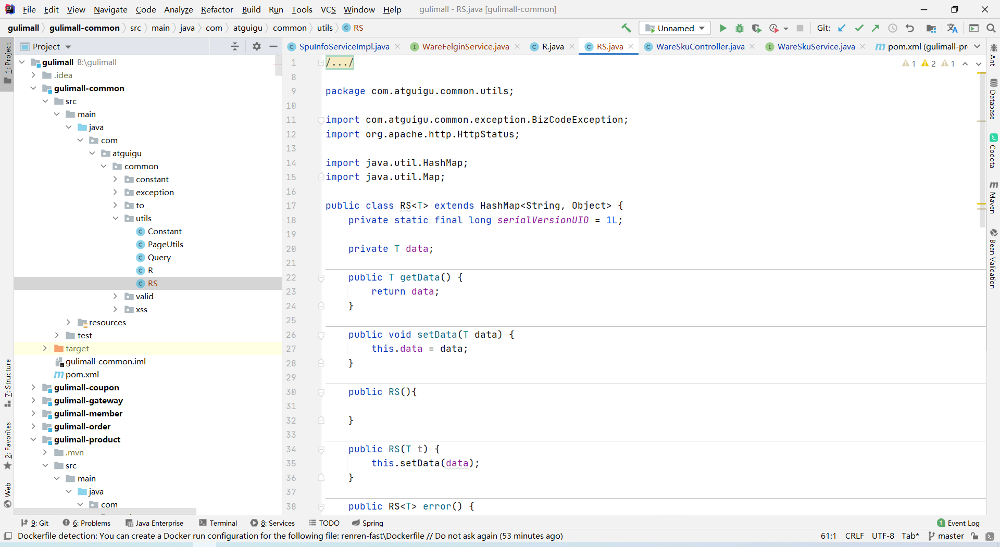

#### 5、修改`getSkuHasStock`方法

修改`gulimall-ware`模块的`com.atguigu.gulimall.ware.controller.WareSkuController`类的`getSkuHasStock`方法

```java
/**
 * 查询sku是否有库存
 * @return
 */
@PostMapping("/hasStock")
public RS<List<SkuHasStockVo>> getSkuHasStock(@RequestBody List<Long> skuIds){
  List<SkuHasStockVo> skuHasStocks =  wareSkuService.getSkuHasStock(skuIds);

  return new RS<>(skuHasStocks);
}
```

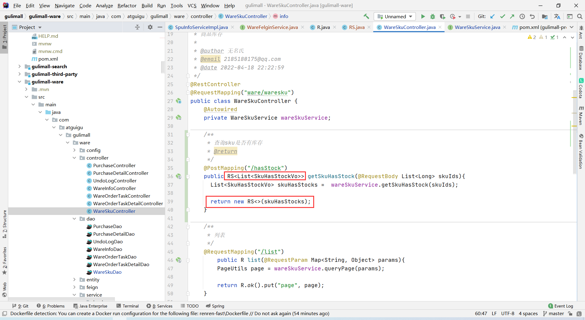

#### 6、移动并重命名`SkuHasStockVo`类

把`gulimall-ware`模块的`com.atguigu.gulimall.ware.vo.SkuHasStockVo`移动到`gulimall-common`模块的`com.atguigu.common.to`类下，并将`SkuHasStockVo`重命名为`SkuHasStockTo`

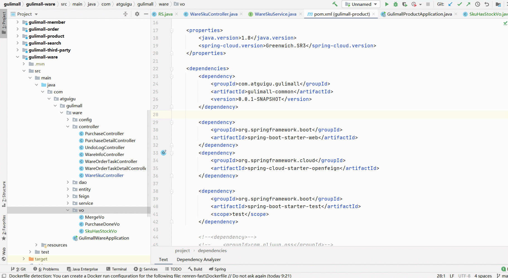

#### 7、修改`getSkuHasStock`抽象方法

修改`gulimall-product`模块的`com.atguigu.gulimall.product.feign.WareFelginService`接口的`getSkuHasStock`抽象方法

(这里的`@PostMapping("/hasStock")`写错了，应该为`@PostMapping("/ware/waresku/hasStock")`

```java
@PostMapping("/hasStock")
public RS<List<SkuHasStockTo>> getSkuHasStock(List<Long> skuIds);
```

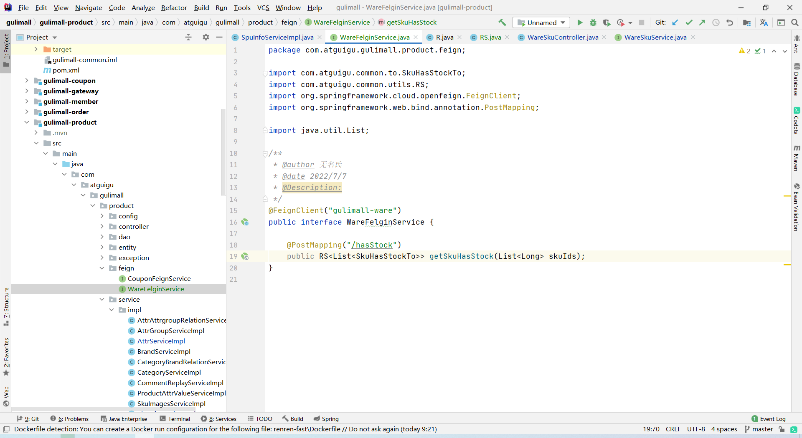

#### 8、修改`up`方法

修改`gulimall-product`模块的`com.atguigu.gulimall.product.service.impl.SpuInfoServiceImpl`类的`up`方法

```java
@Override
public void up(Long spuId) {
    //1、查出当前spuId对应的所有sku信息,包括品牌的名字。
    List<SkuInfoEntity> skuInfoEntities = skuInfoService.getSkusBySpuId(spuId);
    //attrs
    //TODO 4、查询当前sku的所有可以被用来检索的规格属性。
    List<ProductAttrValueEntity> productAttrValueEntities = productAttrValueService.baseAttrlistforspu(spuId);
    List<Long> attrIds = productAttrValueEntities.stream().map(ProductAttrValueEntity::getAttrId).collect(Collectors.toList());
    List<Long> searchAttrIds = attrService.selectSearchAttrIds(attrIds);
    Set<Long> idSet = new HashSet<>(searchAttrIds);

    List<SkuEsModel.Attr> attrList = productAttrValueEntities.stream().filter(item -> {
        return idSet.contains(item.getAttrId());
    }).map(item -> {
        SkuEsModel.Attr attr = new SkuEsModel.Attr();
        BeanUtils.copyProperties(item, attr);
        return attr;
    }).collect(Collectors.toList());

    //TODO 1、发送远程调用，在库存系统中查询是否有库存，并不用知道库存是多少
    //hotScore      热度评分
    Map<Long, Boolean> isSkuStock = null;
    try {
        List<Long> skuIdList = skuInfoEntities.stream().map(SkuInfoEntity::getSkuId).collect(Collectors.toList());
        RS<List<SkuHasStockTo>> skuHasStock = wareFelginService.getSkuHasStock(skuIdList);
        isSkuStock = skuHasStock.getData().stream()
                .collect(Collectors.toMap(SkuHasStockTo::getSkuId, SkuHasStockTo::getHasStock));
    }catch (Exception e){
        log.error("库存服务查询异常：原因{}",e);
    }

    Map<Long, Boolean> finalIsSkuStock = isSkuStock;
    List<SkuEsModel> collect = skuInfoEntities.stream().map(skuInfoEntity -> {
        //组装需要的数据
        SkuEsModel skuEsModel = new SkuEsModel();
        BeanUtils.copyProperties(skuInfoEntity, skuEsModel);
        //TODO 1、发送远程调用，在库存系统中查询是否有库存，并不用知道库存是多少
        //hotScore      热度评分
        boolean hasStock = false;
        //设置库存信息
        //如果远程调用失败，则默认有库存
        if (finalIsSkuStock ==null || !finalIsSkuStock.containsKey(skuInfoEntity.getSkuId())){
           skuEsModel.setHasStock(true);
        }else {
            skuEsModel.setHasStock(finalIsSkuStock.get(skuInfoEntity.getSkuId()));
        }
        //skuPrice
        //skuImg
        //hasStock      是否还有库存
        //TODO 2、热度评分，默认为 0
        skuEsModel.setHotScore(0L);
        //brandName：品牌名   BrandImg：品牌图片
        //TODO 3、查询品牌和分类的名字信息
        BrandEntity brandEntity = brandService.getById(skuInfoEntity.getBrandId());
        skuEsModel.setBrandName(brandEntity.getName());
        skuEsModel.setBrandImg(brandEntity.getLogo());
        //catalogName   分类名
        CategoryEntity categoryEntity = categoryService.getById(skuInfoEntity.getCatalogId());
        skuEsModel.setCatalogName(categoryEntity.getName());
        //设置检索属性
        skuEsModel.setAttrs(attrList);
        return skuEsModel;
    }).collect(Collectors.toList());
    //TODO 5、将数据发送给es进行保存
}
```

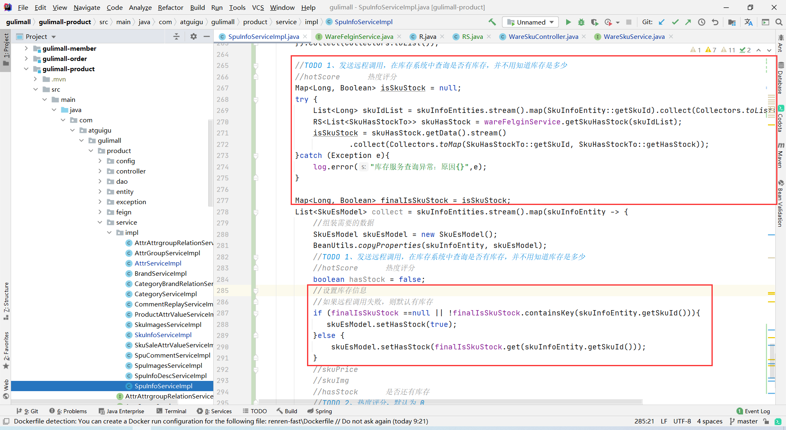

### 5.2.6、使用ES远程上架

#### 1、新建`ElasticSaveController`类

在`gulimall-search`模块的`com.atguigu.gulimall.search`包下新建`controller`文件夹，在`controller`文件夹下新建`ElasticSaveController`类，在`ElasticSaveController`里新建`productStatusUp`方法

```java
package com.atguigu.gulimall.search.controller;

import com.atguigu.common.to.es.SkuEsModel;
import com.atguigu.common.utils.R;
import org.springframework.web.bind.annotation.PostMapping;
import org.springframework.web.bind.annotation.RequestBody;
import org.springframework.web.bind.annotation.RequestMapping;
import org.springframework.web.bind.annotation.RestController;

import java.util.List;

/**
 * @author 无名氏
 * @date 2022/7/7
 * @Description:
 */
@RestController
@RequestMapping("/search")
public class ElasticSaveController {

    /**
     * 上架商品
     */
    @PostMapping("/product")
    public R productStatusUp(@RequestBody List<SkuEsModel> skuEsModels) {

        return R.ok();
    }
}
```

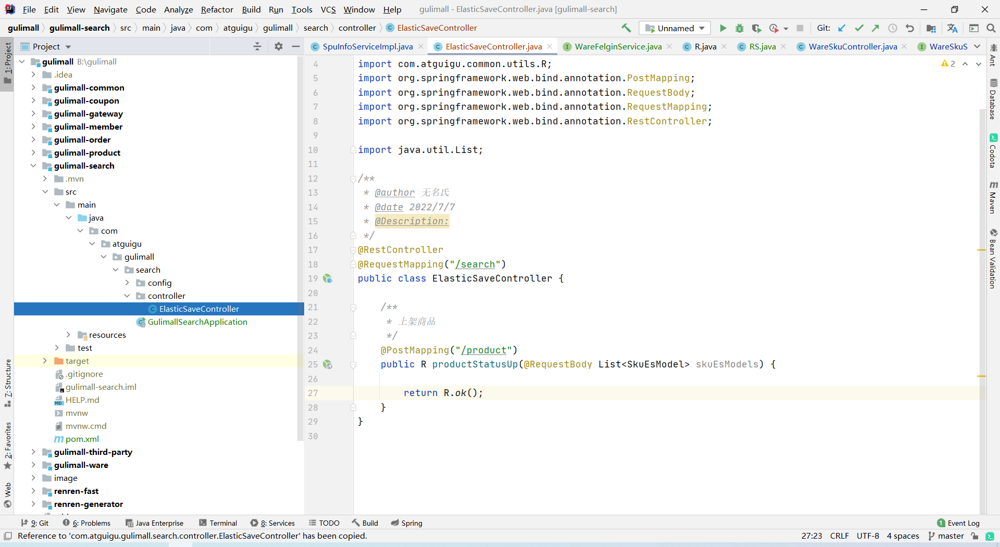

#### 2、新建`ProductSaveService`类

在`gulimall-search`模块的`com.atguigu.gulimall.search`包下新建`service`文件夹，在`service`文件夹下新建`ProductSaveService`类

```java
package com.atguigu.gulimall.search.service;

/**
 * @author 无名氏
 * @date 2022/7/7
 * @Description:
 */
public interface ProductSaveService {
}
```

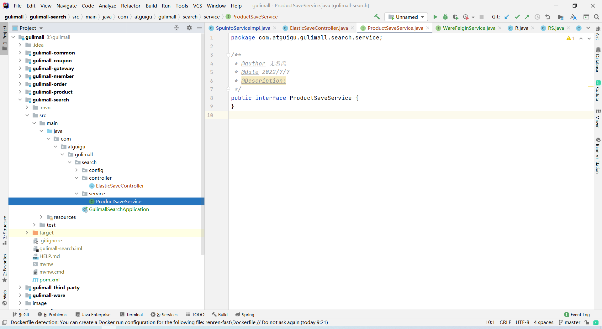

#### 3、修改`productStatusUp`方法

修改`gulimall-search`模块的`com.atguigu.gulimall.search.controller.ElasticSaveController`类的`productStatusUp`方法

```java
@Autowired
ProductSaveService productSaveService;
/**
 * 上架商品
 */
@PostMapping("/product")
public R productStatusUp(@RequestBody List<SkuEsModel> skuEsModels) {
    productSaveService.productStatusUp(skuEsModels);
    return R.ok();
}
```

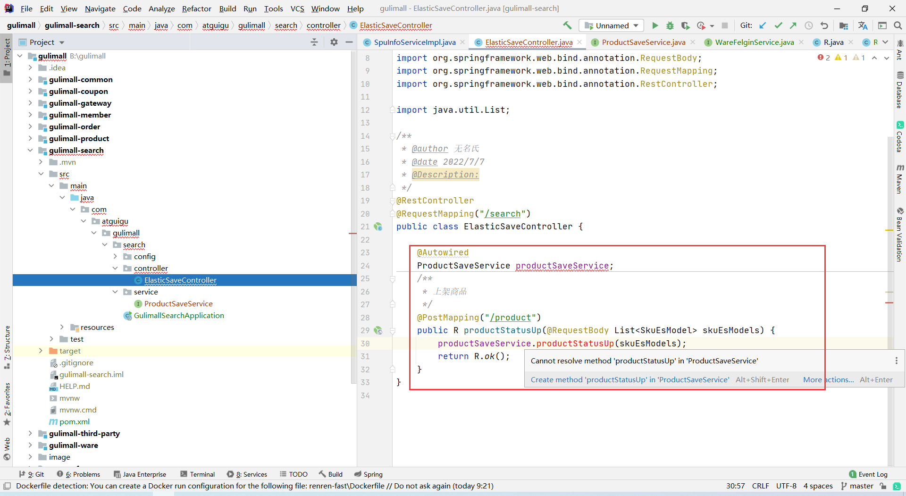

#### 4、添加`productStatusUp`抽象方法

在`gulimall-search`模块的`com.atguigu.gulimall.search.service.ProductSaveService`接口里添加`productStatusUp`抽象方法

```java
void productStatusUp(List<SkuEsModel> skuEsModels);
```

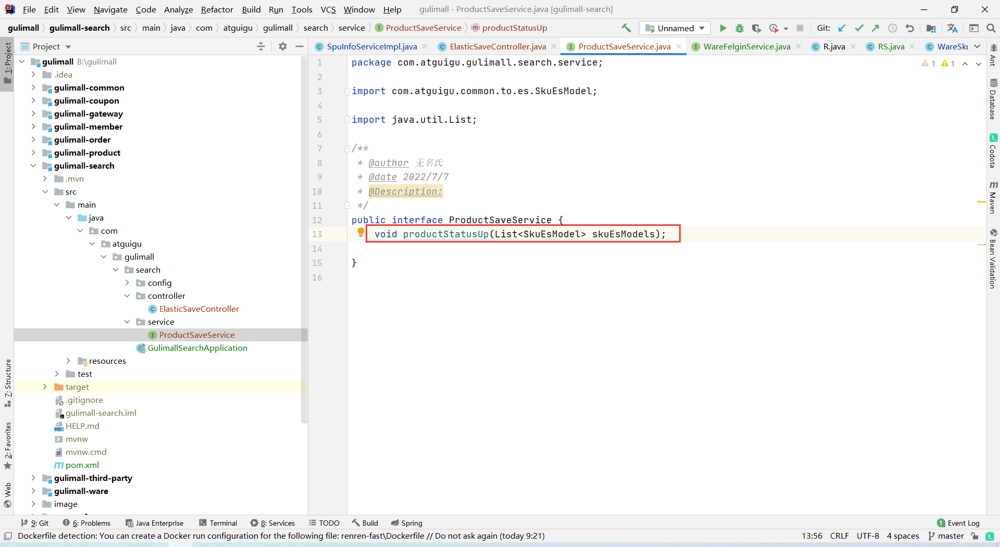

#### 5、新建`EsConstant`常量类

在`gulimall-search`模块的`com.atguigu.gulimall.search`包里新建`constant`文件夹，在`constant`文件夹里新建`EsConstant`常量类

```java
package com.atguigu.gulimall.search.constant;

/**
 * @author 无名氏
 * @date 2022/7/7
 * @Description:
 */
public class EsConstant {

    /**
     * sku数据在es中的索引
     */
    public static final String PRODUCT_INDEX = "product";

}
```

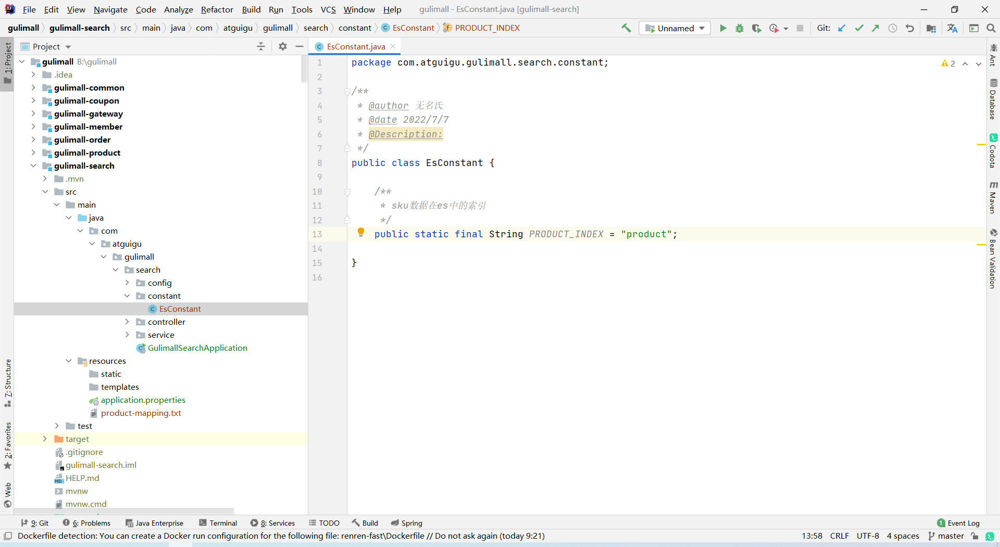

#### 6、新建`ProductSaveServiceImpl`类

##### 1、向上抛出异常

在`gulimall-search`模块的`com.atguigu.gulimall.search.service`包里新建`impl`文件夹，在`impl`文件夹里新建`ProductSaveServiceImpl`类，实现`ProductSaveService`接口

```java
package com.atguigu.gulimall.search.service.impl;

import com.alibaba.fastjson.JSON;
import com.atguigu.common.to.es.SkuEsModel;
import com.atguigu.gulimall.search.config.GulimallElasticSearchConfig;
import com.atguigu.gulimall.search.constant.EsConstant;
import com.atguigu.gulimall.search.service.ProductSaveService;
import org.elasticsearch.action.bulk.BulkRequest;
import org.elasticsearch.action.index.IndexRequest;
import org.elasticsearch.client.RestHighLevelClient;
import org.elasticsearch.common.xcontent.XContentType;
import org.springframework.beans.factory.annotation.Autowired;
import org.springframework.stereotype.Service;

import java.util.List;

/**
 * @author 无名氏
 * @date 2022/7/7
 * @Description:
 */
@Service
public class ProductSaveServiceImpl implements ProductSaveService {

    @Autowired
    RestHighLevelClient restHighLevelClient;
    @Override
    public void productStatusUp(List<SkuEsModel> skuEsModels) {

        //保存到es
        //1、给es中建立索引，product，建立好映射关系。

        //2、给es中保存这些数据
        BulkRequest bulkRequest = new BulkRequest();
        for (SkuEsModel skuEsModel : skuEsModels) {
            IndexRequest indexRequest = new IndexRequest(EsConstant.PRODUCT_INDEX);
            indexRequest.id(skuEsModel.getSkuId().toString());
            String json = JSON.toJSONString(skuEsModel);
            indexRequest.source(json, XContentType.JSON);
            bulkRequest.add(indexRequest);
        }
        restHighLevelClient.bulk(bulkRequest, GulimallElasticSearchConfig.COMMON_OPTIONS);
    }
}
```

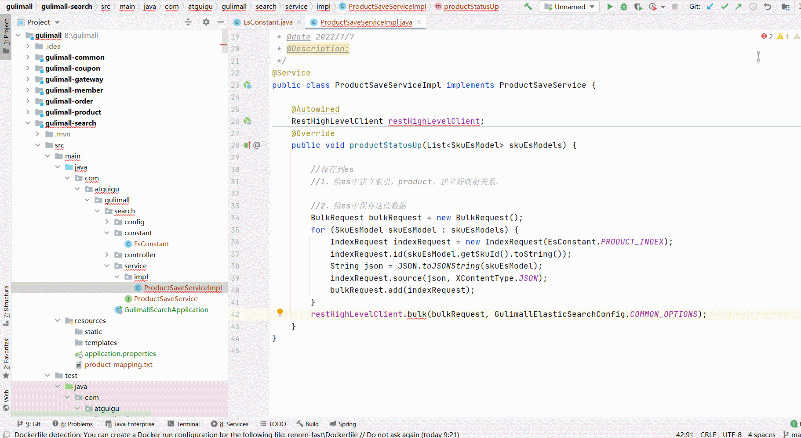

##### 2、修改返回类型

```java
package com.atguigu.gulimall.search.service.impl;

import com.alibaba.fastjson.JSON;
import com.atguigu.common.to.es.SkuEsModel;
import com.atguigu.gulimall.search.config.GulimallElasticSearchConfig;
import com.atguigu.gulimall.search.constant.EsConstant;
import com.atguigu.gulimall.search.service.ProductSaveService;
import lombok.extern.slf4j.Slf4j;
import org.elasticsearch.action.bulk.BulkItemResponse;
import org.elasticsearch.action.bulk.BulkRequest;
import org.elasticsearch.action.bulk.BulkResponse;
import org.elasticsearch.action.index.IndexRequest;
import org.elasticsearch.client.RestHighLevelClient;
import org.elasticsearch.common.xcontent.XContentType;
import org.springframework.beans.factory.annotation.Autowired;
import org.springframework.stereotype.Service;

import java.io.IOException;
import java.util.Arrays;
import java.util.List;
import java.util.stream.Collectors;

/**
 * @author 无名氏
 * @date 2022/7/7
 * @Description:
 */
@Slf4j
@Service
public class ProductSaveServiceImpl implements ProductSaveService {

    @Autowired
    RestHighLevelClient restHighLevelClient;
    @Override
    public void productStatusUp(List<SkuEsModel> skuEsModels) throws IOException {

        //保存到es
        //1、给es中建立索引，product，建立好映射关系。(kibana里已经建立过了)

        //2、给es中保存这些数据
        BulkRequest bulkRequest = new BulkRequest();
        for (SkuEsModel skuEsModel : skuEsModels) {
            IndexRequest indexRequest = new IndexRequest(EsConstant.PRODUCT_INDEX);
            indexRequest.id(skuEsModel.getSkuId().toString());
            String json = JSON.toJSONString(skuEsModel);
            indexRequest.source(json, XContentType.JSON);
            bulkRequest.add(indexRequest);
        }
        BulkResponse bulk = restHighLevelClient.bulk(bulkRequest, GulimallElasticSearchConfig.COMMON_OPTIONS);

        //TODO 如果批量操作有错误
        boolean b = bulk.hasFailures();
        if (b){
            List<String> collect = Arrays.stream(bulk.getItems()).map(BulkItemResponse::getId).collect(Collectors.toList());
            log.error("商品上架错误：{}",collect);
        }
    }
}
```

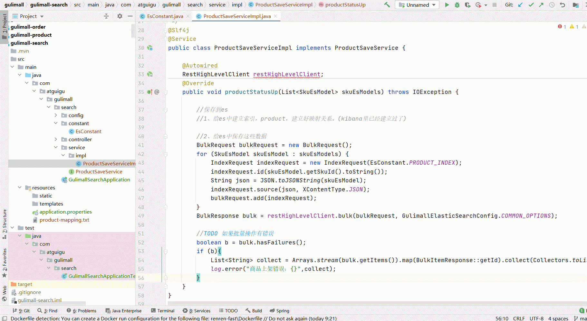

##### 3、完整代码

```java
package com.atguigu.gulimall.search.service.impl;

import com.alibaba.fastjson.JSON;
import com.atguigu.common.to.es.SkuEsModel;
import com.atguigu.gulimall.search.config.GulimallElasticSearchConfig;
import com.atguigu.gulimall.search.constant.EsConstant;
import com.atguigu.gulimall.search.service.ProductSaveService;
import lombok.extern.slf4j.Slf4j;
import org.elasticsearch.action.bulk.BulkItemResponse;
import org.elasticsearch.action.bulk.BulkRequest;
import org.elasticsearch.action.bulk.BulkResponse;
import org.elasticsearch.action.index.IndexRequest;
import org.elasticsearch.client.RestHighLevelClient;
import org.elasticsearch.common.xcontent.XContentType;
import org.springframework.beans.factory.annotation.Autowired;
import org.springframework.stereotype.Service;

import java.io.IOException;
import java.util.Arrays;
import java.util.List;
import java.util.stream.Collectors;

/**
 * @author 无名氏
 * @date 2022/7/7
 * @Description:
 */
@Slf4j
@Service
public class ProductSaveServiceImpl implements ProductSaveService {

    @Autowired
    RestHighLevelClient restHighLevelClient;
    @Override
    public boolean productStatusUp(List<SkuEsModel> skuEsModels) throws IOException {

        //保存到es
        //1、给es中建立索引，product，建立好映射关系。(kibana里已经建立过了)

        //2、给es中保存这些数据
        BulkRequest bulkRequest = new BulkRequest();
        for (SkuEsModel skuEsModel : skuEsModels) {
            IndexRequest indexRequest = new IndexRequest(EsConstant.PRODUCT_INDEX);
            indexRequest.id(skuEsModel.getSkuId().toString());
            String json = JSON.toJSONString(skuEsModel);
            indexRequest.source(json, XContentType.JSON);
            bulkRequest.add(indexRequest);
        }
        BulkResponse bulk = restHighLevelClient.bulk(bulkRequest, GulimallElasticSearchConfig.COMMON_OPTIONS);

        //TODO 如果批量操作有错误
        boolean b = bulk.hasFailures();
        if (b){
            List<String> collect = Arrays.stream(bulk.getItems()).map(BulkItemResponse::getId).collect(Collectors.toList());
            log.error("商品上架错误：{}",collect);
        }
        return b;
    }
}
```

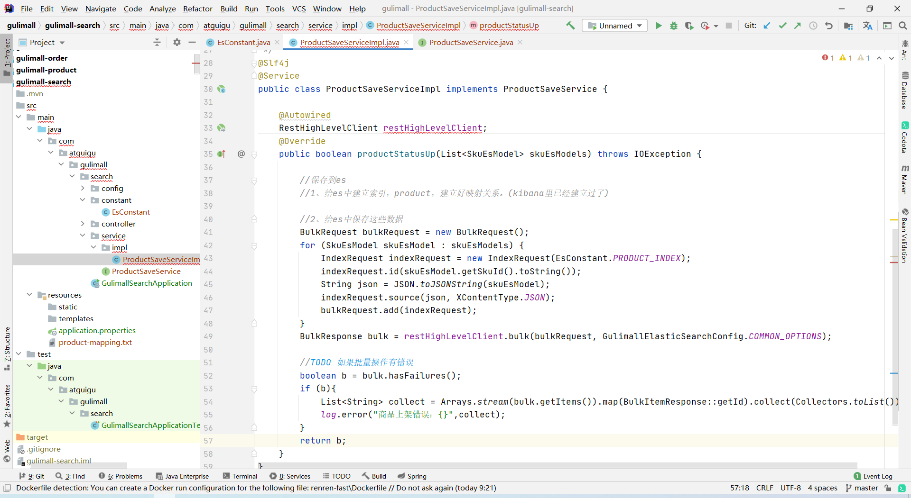

#### 7、修改`严重性`级别(解决`restHighLevelClient`报红)

依次点击`File` -> `Settings` -> `Editor` -> `Inspections` -> `Spring` -> `Spring Core` -> `Autowiring for bean class` 

在右侧 `Severity` 里选择 `Warining`

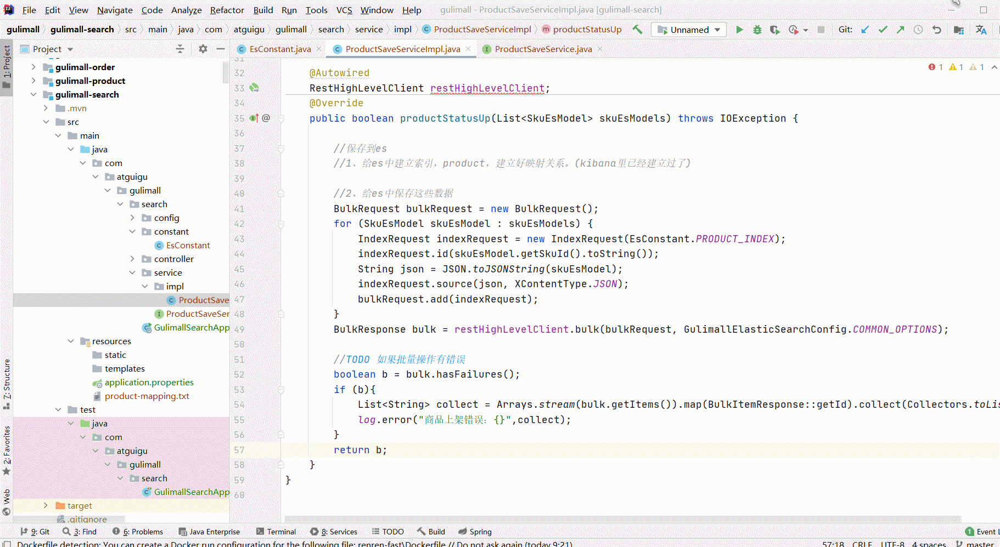

#### 8、在`BizCodeException`枚举类里添加实例

在`gulimall-common`模块的`com.atguigu.common.exception.BizCodeException`枚举类里添加实例

```java
/**
 * 商品上架异常（向ElasticSearch里保存数据出错）
 */
PRODUCT_UP_EXCEPTION(11000,"商品上架异常");
```

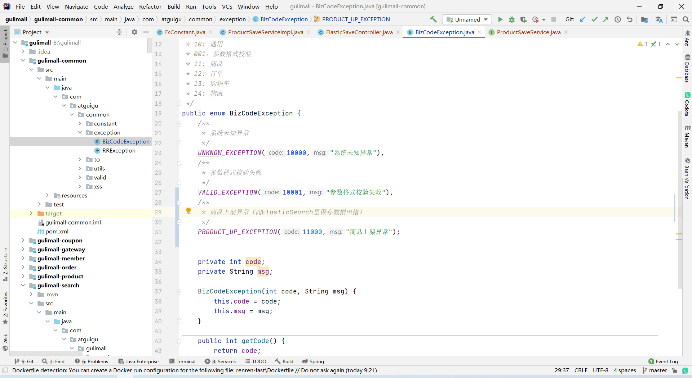

完整代码：

```java
package com.atguigu.common.exception;

/**
 * @author 无名氏
 * @date 2022/5/7
 * @Description:
 * 错误码和错误信息定义类
 * 1. 错误码定义规则为 5 为数字
 * 2. 前两位表示业务场景，最后三位表示错误码。例如：100001。10:通用 001:系统未知异常
 * 3. 维护错误码后需要维护错误描述，将他们定义为枚举形式
 * 错误码列表：
 * 10: 通用
 * 001：参数格式校验
 * 11: 商品
 * 12: 订单
 * 13: 购物车
 * 14: 物流
 */
public enum BizCodeException {
    /**
     * 系统未知异常
     */
    UNKNOW_EXCEPTION(10000,"系统未知异常"),
    /**
     * 参数格式校验失败
     */
    VALID_EXCEPTION(10001,"参数格式校验失败"),
    /**
     * 商品上架异常（向ElasticSearch里保存数据出错）
     */
    PRODUCT_UP_EXCEPTION(11000,"商品上架异常");


    private int code;
    private String msg;

    BizCodeException(int code, String msg) {
        this.code = code;
        this.msg = msg;
    }

    public int getCode() {
        return code;
    }

    public String getMsg() {
        return msg;
    }
}
```

#### 9、修改`productStatusUp`方法

在`gulimall-search`模块的`com.atguigu.gulimall.search.controller.ElasticSaveController`类里修改`productStatusUp`方法

```java
package com.atguigu.gulimall.search.controller;

import com.atguigu.common.exception.BizCodeException;
import com.atguigu.common.to.es.SkuEsModel;
import com.atguigu.common.utils.R;
import com.atguigu.gulimall.search.service.ProductSaveService;
import lombok.extern.slf4j.Slf4j;
import org.springframework.beans.factory.annotation.Autowired;
import org.springframework.web.bind.annotation.PostMapping;
import org.springframework.web.bind.annotation.RequestBody;
import org.springframework.web.bind.annotation.RequestMapping;
import org.springframework.web.bind.annotation.RestController;

import java.util.List;

/**
 * @author 无名氏
 * @date 2022/7/7
 * @Description:
 */
@Slf4j
@RestController
@RequestMapping("/search")
public class ElasticSaveController {

    @Autowired
    ProductSaveService productSaveService;
    /**
     * 上架商品
     */
    @PostMapping("/product")
    public R productStatusUp(@RequestBody List<SkuEsModel> skuEsModels) {
        boolean b = false;
        try {
            b = productSaveService.productStatusUp(skuEsModels);
        }catch (Exception e){
            log.error("ElasticSaveController商品上架错误：{}",e);
            return R.error(BizCodeException.PRODUCT_UP_EXCEPTION);
        }

        if (b){
            return R.ok();
        }else {
            return R.error(BizCodeException.PRODUCT_UP_EXCEPTION);
        }

    }
}
```

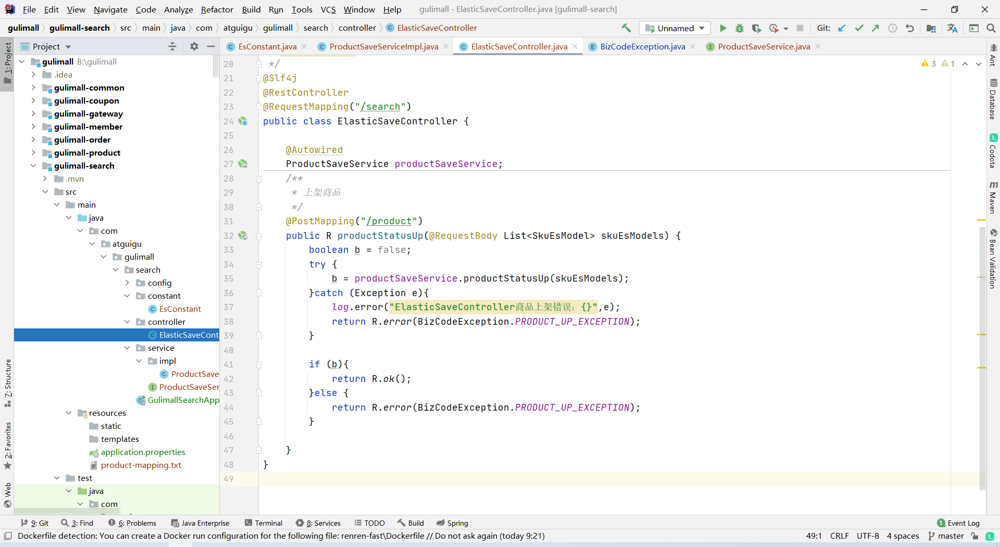

#### 10、修改`@RequestMapping`注解

在`gulimall-search`模块的`com.atguigu.gulimall.search.controller.ElasticSaveController`类上修改`@RequestMapping("/search")`注解

```java
@RequestMapping("/search/save")
```

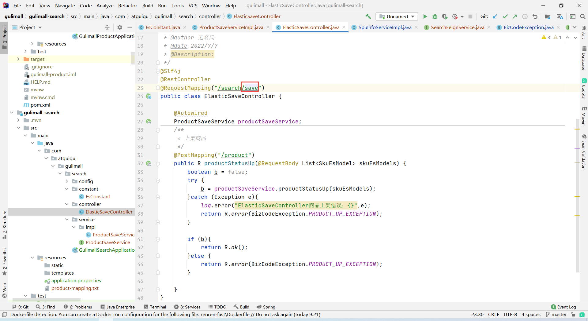

#### 11、修改`productStatusUp`方法的返回值

修改`gulimall-search`模块的`com.atguigu.gulimall.search.service.impl.ProductSaveServiceImpl`类的`productStatusUp`方法的返回值，`bulk.hasFailures()`方法有错误了才返回`true`，而`productStatusUp`方法没有错误了才返回`true`，所以返回值应取反

```java
package com.atguigu.gulimall.search.service.impl;

import com.alibaba.fastjson.JSON;
import com.atguigu.common.to.es.SkuEsModel;
import com.atguigu.gulimall.search.config.GulimallElasticSearchConfig;
import com.atguigu.gulimall.search.constant.EsConstant;
import com.atguigu.gulimall.search.service.ProductSaveService;
import lombok.extern.slf4j.Slf4j;
import org.elasticsearch.action.bulk.BulkItemResponse;
import org.elasticsearch.action.bulk.BulkRequest;
import org.elasticsearch.action.bulk.BulkResponse;
import org.elasticsearch.action.index.IndexRequest;
import org.elasticsearch.client.RestHighLevelClient;
import org.elasticsearch.common.xcontent.XContentType;
import org.springframework.beans.factory.annotation.Autowired;
import org.springframework.stereotype.Service;

import java.io.IOException;
import java.util.Arrays;
import java.util.List;
import java.util.stream.Collectors;

/**
 * @author 无名氏
 * @date 2022/7/7
 * @Description:
 */
@Slf4j
@Service
public class ProductSaveServiceImpl implements ProductSaveService {

    @Autowired
    RestHighLevelClient restHighLevelClient;
    @Override
    public boolean productStatusUp(List<SkuEsModel> skuEsModels) throws IOException {

        //保存到es
        //1、给es中建立索引，product，建立好映射关系。(kibana里已经建立过了)

        //2、给es中保存这些数据
        BulkRequest bulkRequest = new BulkRequest();
        for (SkuEsModel skuEsModel : skuEsModels) {
            IndexRequest indexRequest = new IndexRequest(EsConstant.PRODUCT_INDEX);
            indexRequest.id(skuEsModel.getSkuId().toString());
            String json = JSON.toJSONString(skuEsModel);
            indexRequest.source(json, XContentType.JSON);
            bulkRequest.add(indexRequest);
        }
        BulkResponse bulk = restHighLevelClient.bulk(bulkRequest, GulimallElasticSearchConfig.COMMON_OPTIONS);

        //TODO 如果批量操作有错误
        boolean b = bulk.hasFailures();
        if (b){
            List<String> collect = Arrays.stream(bulk.getItems()).map(BulkItemResponse::getId).collect(Collectors.toList());
            log.error("商品上架错误：{}",collect);
        }
        return !b;
    }
}
```

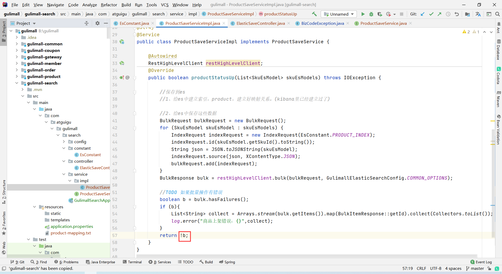

#### 12、新建`SearchFeignService`类

在`gulimall-product`模块的`com.atguigu.gulimall.product.feign`包里新建`SearchFeignService`类，在`SearchFeignService`类里添加`productStatusUp`方法

```java
package com.atguigu.gulimall.product.feign;

import com.atguigu.common.to.es.SkuEsModel;
import com.atguigu.common.utils.R;
import org.springframework.cloud.openfeign.FeignClient;
import org.springframework.web.bind.annotation.PostMapping;

import java.util.List;

/**
 * @author 无名氏
 * @date 2022/7/7
 * @Description:
 */
@FeignClient("gulimall-search")
public interface SearchFeignService {
    @PostMapping("/search/save/product")
    public R productStatusUp(List<SkuEsModel> skuEsModels);
}
```

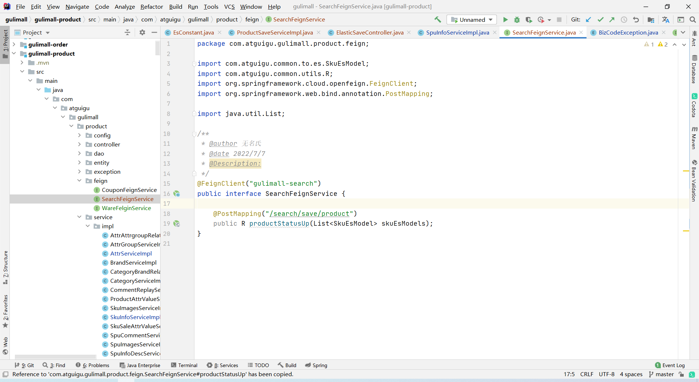

#### 13、新建`StatusEnum`枚举类

在`gulimall-common`模块的`com.atguigu.common.constant.product`包里新建`StatusEnum`枚举类

```java
package com.atguigu.common.constant.product;

/**
 * @author 无名氏
 * @date 2022/5/17
 * @Description: spu的状态
 */
public enum StatusEnum {
    /**
     * 新建商品
     */
    NEW_SPU(0,"新建商品"),
    /**
     * 上架商品
     */
    SPU_UP(1,"上架商品"),
    /**
     * 下架商品
     */
    SPU_DOWN(2,"下架商品");

    private int code;
    private String msg;

    StatusEnum(int code, String msg) {
        this.code = code;
        this.msg = msg;
    }

    public int getCode() {
        return code;
    }

    public String getMsg() {
        return msg;
    }
}
```


#### 14、修改`up`方法

修改`gulimall-product`模块的`com.atguigu.gulimall.product.service.impl.SpuInfoServiceImpl`类的`up`方法

```java
//TODO 5、将数据发送给es进行保存
R r = searchFeignService.productStatusUp(collect);
if (r.getCode()==0){
    //远程调用成功
    //TODO 6、修改当前spu的状态(变为上架状态)
    this.baseMapper.updateSpuStatus(spuId, StatusEnum.SPU_UP.getCode());
}else {
    //远程调用失败
}
```

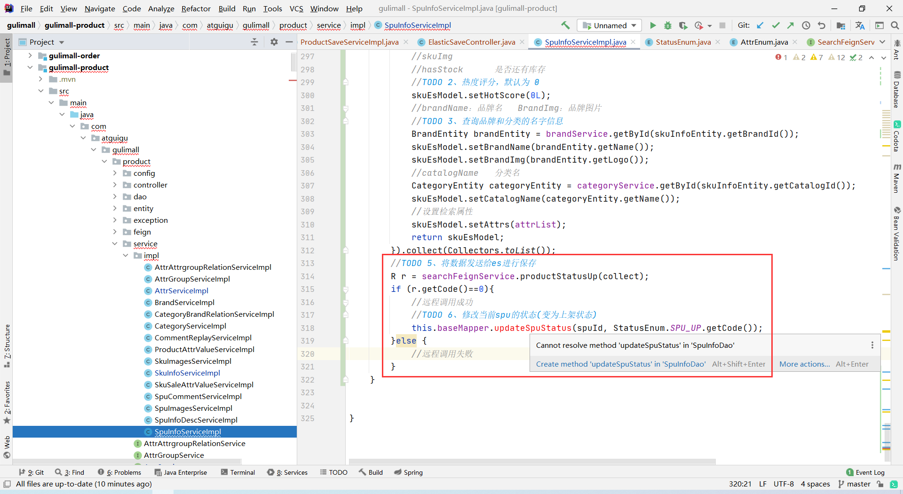

#### 15、添加`updateSpuStatus`

在`gulimall-product`模块的`src/main/resources/mapper/product/SpuInfoDao.xml`文件里添加`updateSpuStatus`

```java
<update id="updateSpuStatus">
    update gulimall_pms.pms_spu_info set publish_status=#{code},update_time = now() where id = #{spuId}
</update>
```

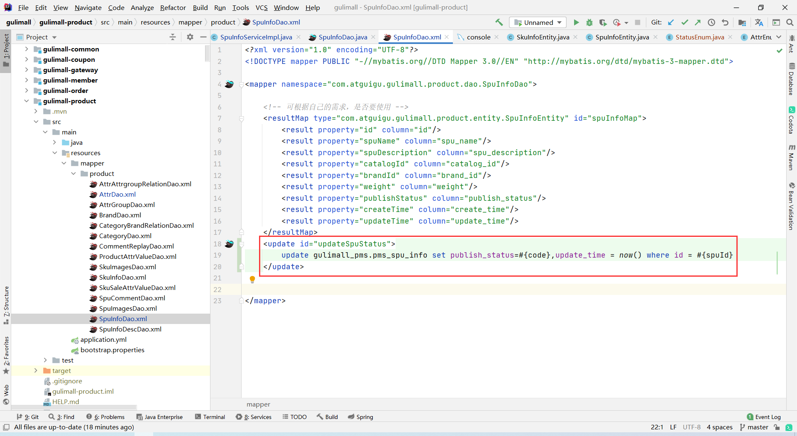

#### 16、完整`SpuInfoServiceImpl`类代码

```java
package com.atguigu.gulimall.product.service.impl;

import com.atguigu.common.constant.product.StatusEnum;
import com.atguigu.common.to.SkuHasStockTo;
import com.atguigu.common.to.SkuReductionTo;
import com.atguigu.common.to.SpuBoundTo;
import com.atguigu.common.to.es.SkuEsModel;
import com.atguigu.common.utils.PageUtils;
import com.atguigu.common.utils.Query;
import com.atguigu.common.utils.R;
import com.atguigu.common.utils.RS;
import com.atguigu.gulimall.product.dao.SpuInfoDao;
import com.atguigu.gulimall.product.entity.*;
import com.atguigu.gulimall.product.feign.CouponFeignService;
import com.atguigu.gulimall.product.feign.SearchFeignService;
import com.atguigu.gulimall.product.feign.WareFelginService;
import com.atguigu.gulimall.product.service.*;
import com.atguigu.gulimall.product.vo.SpuSaveVo;
import com.baomidou.mybatisplus.core.conditions.query.LambdaQueryWrapper;
import com.baomidou.mybatisplus.core.conditions.query.QueryWrapper;
import com.baomidou.mybatisplus.core.metadata.IPage;
import com.baomidou.mybatisplus.extension.service.impl.ServiceImpl;
import org.springframework.beans.BeanUtils;
import org.springframework.beans.factory.annotation.Autowired;
import org.springframework.stereotype.Service;
import org.springframework.transaction.annotation.Transactional;
import org.springframework.util.CollectionUtils;
import org.springframework.util.StringUtils;

import java.math.BigDecimal;
import java.util.*;
import java.util.stream.Collectors;


@Service("spuInfoService")
public class SpuInfoServiceImpl extends ServiceImpl<SpuInfoDao, SpuInfoEntity> implements SpuInfoService {

    @Autowired
    SpuInfoDescService spuInfoDescService;
    @Autowired
    SpuImagesService spuImagesService;
    @Autowired
    AttrService attrService;
    @Autowired
    ProductAttrValueService productAttrValueService;
    @Autowired
    SkuInfoService skuInfoService;
    @Autowired
    SkuImagesService skuImagesService;
    @Autowired
    SkuSaleAttrValueService skuSaleAttrValueService;
    @Autowired
    CouponFeignService couponFeignService;
    @Autowired
    BrandService brandService;
    @Autowired
    CategoryService categoryService;
    @Autowired
    WareFelginService wareFelginService;
    @Autowired
    SearchFeignService searchFeignService;

    @Override
    public PageUtils queryPage(Map<String, Object> params) {
        IPage<SpuInfoEntity> page = this.page(
                new Query<SpuInfoEntity>().getPage(params),
                new QueryWrapper<SpuInfoEntity>()
        );

        return new PageUtils(page);
    }

    @Transactional(rollbackFor = Exception.class)
    @Override
    public void saveSpuInfo(SpuSaveVo spuSaveVo) {
        //1、保存spu基本信息 pms_spu_info
        SpuInfoEntity spuInfoEntity = new SpuInfoEntity();
        BeanUtils.copyProperties(spuSaveVo,spuInfoEntity);
        this.saveBaseSpuInfo(spuInfoEntity);

        //2、保存Spu的描述 pms_spu_info_desc
        List<String> decript = spuSaveVo.getDecript();
        if (decript!=null && decript.size()>0) {
            SpuInfoDescEntity spuInfoDescEntity = new SpuInfoDescEntity();
            spuInfoDescEntity.setSpuId(spuInfoEntity.getId());
            spuInfoDescEntity.setDecript(String.join(",", decript));
            spuInfoDescService.saveSpuInfoDesc(spuInfoDescEntity);
        }

        //3、保存spu的图片集 pms_spu_images
        List<String> images = spuSaveVo.getImages();
        if (images!=null && images.size()>0) {
            spuImagesService.saveImages(spuInfoEntity.getId(), images);
        }

        //4、保存spu的规格参数；pms_product_attr_value
        List<SpuSaveVo.BaseAttrs> baseAttrs = spuSaveVo.getBaseAttrs();
        if (!CollectionUtils.isEmpty(baseAttrs)) {
            List<ProductAttrValueEntity> productAttrValueEntities = baseAttrs.stream().map(attr -> {
                ProductAttrValueEntity productAttrValueEntity = new ProductAttrValueEntity();
                productAttrValueEntity.setSpuId(spuInfoEntity.getId());
                if (attr.getAttrId() != null) {
                    productAttrValueEntity.setAttrId(attr.getAttrId());
                    productAttrValueEntity.setAttrValue(attr.getAttrValues());
                    productAttrValueEntity.setQuickShow(attr.getShowDesc());
                    AttrEntity attrEntity = attrService.getById(attr.getAttrId());
                    if (attrEntity != null) {
                        productAttrValueEntity.setAttrName(attrEntity.getAttrName());
                    }
                }
                return productAttrValueEntity;
            }).collect(Collectors.toList());

            productAttrValueService.saveProductAttr(productAttrValueEntities);
        }

        //5、保存spu的积分信息; gulimall_sms->sms_spu_bounds
        SpuSaveVo.Bounds bounds = spuSaveVo.getBounds();
        SpuBoundTo spuBoundTo = new SpuBoundTo();
        BeanUtils.copyProperties(bounds,spuBoundTo);
        spuBoundTo.setSpuId(spuInfoEntity.getId());
        R r = couponFeignService.saveSpuBounds(spuBoundTo);
        if (r.getCode()!=0){
            log.error("远程保存spu积分信息失败");
        }

        //5、保存当前spu对应的所有sku信息;
        List<SpuSaveVo.Skus> skus = spuSaveVo.getSkus();
        if (!CollectionUtils.isEmpty(skus)){
            //由于spu的id需要与 图片 销售属性 等进行关联，所以不能调用批量保存方法
            skus.forEach(sku->{
                //5.1)、sku的基本信息; pms_sku_info
                SkuInfoEntity skuInfoEntity = new SkuInfoEntity();
                //private String skuName;
                //private BigDecimal price;
                //private String skuTitle;
                //private String skuSubtitle;
                BeanUtils.copyProperties(sku,skuInfoEntity);
                //private Long spuId;
                skuInfoEntity.setSpuId(spuInfoEntity.getId());
                //private String skuDesc;
                //private Long catalogId;
                skuInfoEntity.setCatalogId(spuInfoEntity.getCatalogId());
                //private Long brandId;
                skuInfoEntity.setBrandId(spuInfoEntity.getBrandId());
                //private String skuDefaultImg;
                List<SpuSaveVo.Images> skuImages = sku.getImages();
                Optional<SpuSaveVo.Images> defaultImgOptional = skuImages.stream().filter(item -> item.getDefaultImg() == 1).findFirst();
                defaultImgOptional.ifPresent(defaultImg -> skuInfoEntity.setSkuDefaultImg(defaultImg.getImgUrl()));
                //private Long saleCount;
                skuInfoEntity.setSaleCount(0L);
                skuInfoService.saveSkuInfo(skuInfoEntity);
                //保存sku基本信息后，会返回新增数据生成的id
                Long skuId = skuInfoEntity.getSkuId();

                //5.2)、sku的图片信息; pms_sku_images
                List<SkuImagesEntity> skuImagesEntities = sku.getImages().stream().map(img -> {
                    SkuImagesEntity skuImagesEntity = new SkuImagesEntity();
                    skuImagesEntity.setSkuId(skuId);
                    skuImagesEntity.setImgUrl(img.getImgUrl());
                    skuImagesEntity.setDefaultImg(img.getDefaultImg());
                    return skuImagesEntity;
                }).filter(entry->{
                    //如果图片的url为空，就过滤掉
                    return StringUtils.hasLength(entry.getImgUrl());
                }).collect(Collectors.toList());
                skuImagesService.saveBatch(skuImagesEntities);
                //TODO 没有图片；路径的无需保存
                //5.3)、sku的销售属性信息: pms_sku_sale_attr_value
                List<SpuSaveVo.Attr> attrs = sku.getAttr();
                List<SkuSaleAttrValueEntity> skuSaleAttrValueEntities = attrs.stream().map(attr -> {
                    SkuSaleAttrValueEntity skuSaleAttrValueEntity = new SkuSaleAttrValueEntity();
                    BeanUtils.copyProperties(attr, skuSaleAttrValueEntity);
                    skuSaleAttrValueEntity.setSkuId(skuId);
                    return skuSaleAttrValueEntity;
                }).collect(Collectors.toList());
                skuSaleAttrValueService.saveBatch(skuSaleAttrValueEntities);

                //5.4)、sku的优惠、满减、打折等信息；gulimall_sms->sms_sku_ladder\sms_sku_full_reduction\sms_ member_price
                SkuReductionTo skuReductionTo = new SkuReductionTo();
                BeanUtils.copyProperties(sku,skuReductionTo);
                skuReductionTo.setSkuId(skuId);
                System.out.println(skuReductionTo.getMemberPrice());

                Optional<SpuSaveVo.MemberPrice> firstMemberPrice = sku.getMemberPrice().stream()
                        .filter(memberPrice -> memberPrice.getPrice().compareTo(BigDecimal.ZERO) > 0)
                        .findFirst();

                //满几件打几折、满多少减多少、会员价格，如果有一项有数据才调用远程服务
                if (skuReductionTo.getFullCount()>0
                        || skuReductionTo.getFullPrice().compareTo(BigDecimal.ZERO) > 0
                        || firstMemberPrice.isPresent()){
                    R r1 = couponFeignService.saveSkuReduction(skuReductionTo);
                    if (r1.getCode()!=0){
                        log.error("远程保存sku优惠信息失败");
                    }
                }
            });
        }


    }

    @Override
    public void saveBaseSpuInfo(SpuInfoEntity spuInfoEntity) {
        this.baseMapper.insert(spuInfoEntity);
    }

    /**
     * 根据条件分页查询
     * {
     *    page: 1,//当前页码
     *    limit: 10,//每页记录数
     *    sidx: 'id',//排序字段
     *    order: 'asc/desc',//排序方式
     *    key: '华为',//检索关键字
     *    catelogId: 6,//三级分类id
     *    brandId: 1,//品牌id
     *    status: 0,//商品状态
     * }
     * @param params
     * @return
     */
    @Override
    public PageUtils queryPageByCondition(Map<String, Object> params) {
        LambdaQueryWrapper<SpuInfoEntity> lambdaQueryWrapper = new LambdaQueryWrapper<>();
        //根据"key"，精确匹配商品id 或 模糊查询spu_name
        String key = (String) params.get("key");
        lambdaQueryWrapper.and(StringUtils.hasLength(key) && !"0".equalsIgnoreCase(key),wrapper->{
            wrapper.eq(SpuInfoEntity::getId,key).or().like(SpuInfoEntity::getSpuName,key);
        });
        //根据status精确匹配状态
        String status = (String) params.get("status");
        lambdaQueryWrapper.eq(StringUtils.hasLength(status) && !"0".equalsIgnoreCase(status),SpuInfoEntity::getPublishStatus,status);
        //根据brandId精确匹配品牌id
        String brandId = (String) params.get("brandId");
        lambdaQueryWrapper.eq(StringUtils.hasLength(brandId) && !"0".equalsIgnoreCase(brandId),SpuInfoEntity::getBrandId,brandId);
        //根据catelogId精确匹配所属分类id（注意：前端发来的是catelogId,数据库写的是catalogId）
        String catelogId = (String) params.get("catelogId");
        lambdaQueryWrapper.eq(StringUtils.hasLength(catelogId) && !"0".equalsIgnoreCase(catelogId),SpuInfoEntity::getCatalogId,catelogId);

        IPage<SpuInfoEntity> page = this.page(
                new Query<SpuInfoEntity>().getPage(params),
                lambdaQueryWrapper
        );

        return new PageUtils(page);
    }

    @Override
    public void up(Long spuId) {
        //1、查出当前spuId对应的所有sku信息,包括品牌的名字。
        List<SkuInfoEntity> skuInfoEntities = skuInfoService.getSkusBySpuId(spuId);
        //attrs
        //TODO 4、查询当前sku的所有可以被用来检索的规格属性。
        List<ProductAttrValueEntity> productAttrValueEntities = productAttrValueService.baseAttrlistforspu(spuId);
        List<Long> attrIds = productAttrValueEntities.stream().map(ProductAttrValueEntity::getAttrId).collect(Collectors.toList());
        List<Long> searchAttrIds = attrService.selectSearchAttrIds(attrIds);
        Set<Long> idSet = new HashSet<>(searchAttrIds);

        List<SkuEsModel.Attr> attrList = productAttrValueEntities.stream().filter(item -> {
            return idSet.contains(item.getAttrId());
        }).map(item -> {
            SkuEsModel.Attr attr = new SkuEsModel.Attr();
            BeanUtils.copyProperties(item, attr);
            return attr;
        }).collect(Collectors.toList());

        //TODO 1、发送远程调用，在库存系统中查询是否有库存，并不用知道库存是多少
        //hotScore      热度评分
        Map<Long, Boolean> isSkuStock = null;
        try {
            List<Long> skuIdList = skuInfoEntities.stream().map(SkuInfoEntity::getSkuId).collect(Collectors.toList());
            RS<List<SkuHasStockTo>> skuHasStock = wareFelginService.getSkuHasStock(skuIdList);
            isSkuStock = skuHasStock.getData().stream()
                    .collect(Collectors.toMap(SkuHasStockTo::getSkuId, SkuHasStockTo::getHasStock));
        }catch (Exception e){
            log.error("库存服务查询异常：原因{}",e);
        }

        Map<Long, Boolean> finalIsSkuStock = isSkuStock;
        List<SkuEsModel> collect = skuInfoEntities.stream().map(skuInfoEntity -> {
            //组装需要的数据
            SkuEsModel skuEsModel = new SkuEsModel();
            BeanUtils.copyProperties(skuInfoEntity, skuEsModel);
            //TODO 1、发送远程调用，在库存系统中查询是否有库存，并不用知道库存是多少
            //hotScore      热度评分
            boolean hasStock = false;
            //设置库存信息
            //如果远程调用失败，则默认有库存
            if (finalIsSkuStock ==null || !finalIsSkuStock.containsKey(skuInfoEntity.getSkuId())){
               skuEsModel.setHasStock(true);
            }else {
                skuEsModel.setHasStock(finalIsSkuStock.get(skuInfoEntity.getSkuId()));
            }
            //skuPrice
            //skuImg
            //hasStock      是否还有库存
            //TODO 2、热度评分，默认为 0
            skuEsModel.setHotScore(0L);
            //brandName：品牌名   BrandImg：品牌图片
            //TODO 3、查询品牌和分类的名字信息
            BrandEntity brandEntity = brandService.getById(skuInfoEntity.getBrandId());
            skuEsModel.setBrandName(brandEntity.getName());
            skuEsModel.setBrandImg(brandEntity.getLogo());
            //catalogName   分类名
            CategoryEntity categoryEntity = categoryService.getById(skuInfoEntity.getCatalogId());
            skuEsModel.setCatalogName(categoryEntity.getName());
            //设置检索属性
            skuEsModel.setAttrs(attrList);
            return skuEsModel;
        }).collect(Collectors.toList());
        //TODO 5、将数据发送给es进行保存
        R r = searchFeignService.productStatusUp(collect);
        if (r.getCode()==0){
            //远程调用成功
            //TODO 6、修改当前spu的状态(变为上架状态)
            this.baseMapper.updateSpuStatus(spuId, StatusEnum.SPU_UP.getCode());
        }else {
            //远程调用失败
            //TODO 7、重复调用，接口幂等性，重试机制
        }
    }


}
```

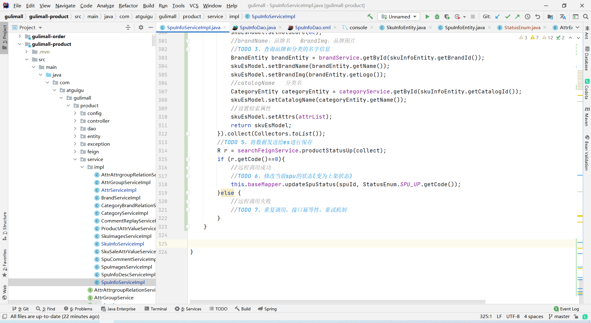

#### 17、设置端口

在`gulimall-search`模块的`src/main/resources`文件夹里新建`application.yml`文件，在`application.yml`配置文件里添加配置

```java
server:
  port: 12000
spring:
  application:
    name: gulimall-search
```

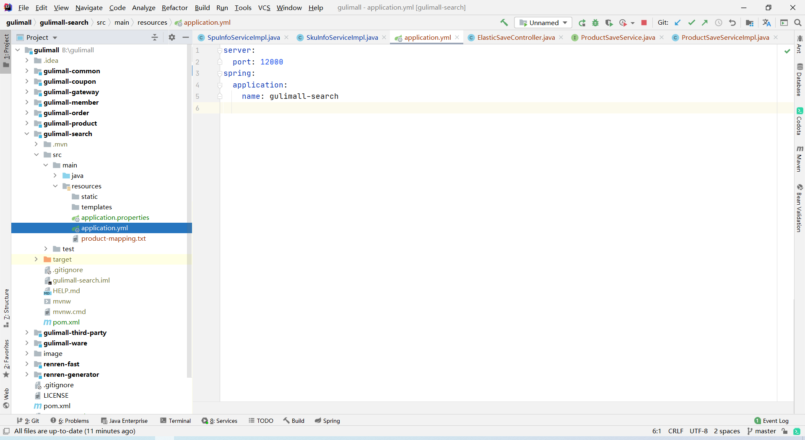

### 5.2.7、测试（1）`Product`服务

#### 1、准备工作

##### 1、添加`GulimallSearchApplication`服务到`Unnamed`

添加`GulimallSearchApplication`服务到`Unnamed`，并指定`GulimallSearchApplication`服务的最大占用为`100m`

```
-Xmx100m
```

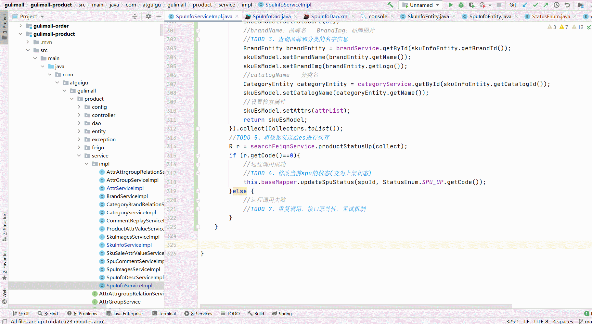

##### 2、启动各个模块

启动`gulimall-coupon` 、`gulimall-gateway` 、`gulimall-member` 、`gulimall-product` 、`gulimall-third-party` 、 `gulimall-ware` 、`renren-fast` 、`gulimall-search`模块

其中`gulimall-product` 、 `gulimall-ware`  、`gulimall-search`模块以`debug`方式启动

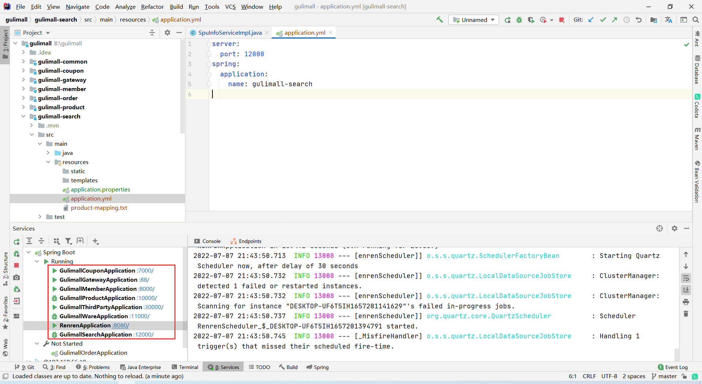

##### 3、在`SpuInfoServiceImpl`类的`up`方法里打断点

在`gulimall-product`模块的`com.atguigu.gulimall.product.service.impl.SpuInfoServiceImpl`类的`up`方法有效的第一行`List<SkuInfoEntity> skuInfoEntities = skuInfoService.getSkusBySpuId(spuId);`上打断点

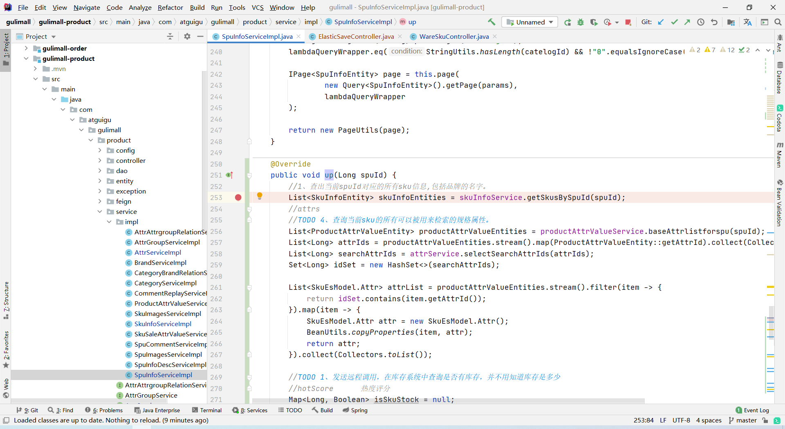

##### 4、在`ElasticSaveController`类的`productStatusUp`方法里打断点

在`gulimall-search`模块的`com.atguigu.gulimall.search.controller.ElasticSaveController`类的`productStatusUp`方法有效的第一行`boolean b = false;`上打断点

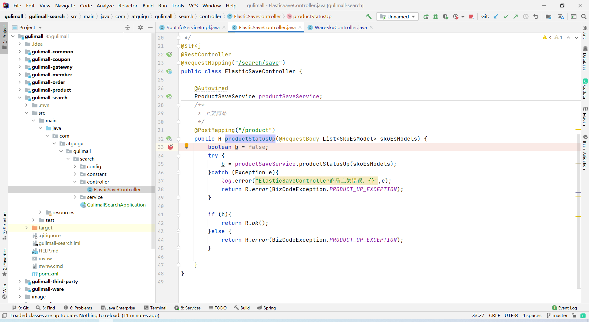

##### 5、在`WareSkuController`类的`getSkuHasStock`方法里打断点

在`gulimall-ware`模块的`com.atguigu.gulimall.ware.controller.WareSkuController`类的`getSkuHasStock`方法有效的第一行`List<SkuHasStockTo> skuHasStocks =  wareSkuService.getSkuHasStock(skuIds);`上打断点

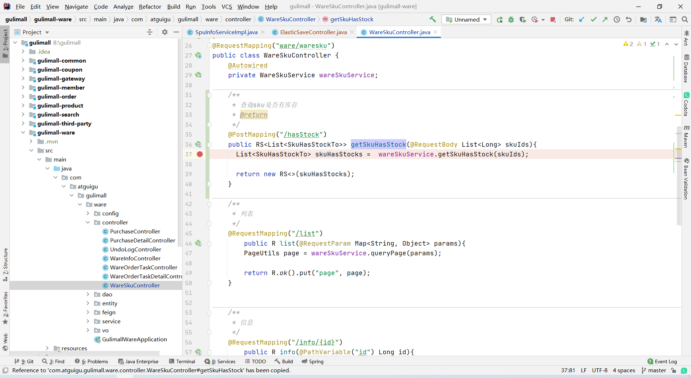

#### 2、进行测试

##### 1、点击上架

运行前端项目，然后在`商品系统/商品维护/spu管理`里的id为`1`的商品里点击右侧`操作`里的`上架`


##### 2、点击`Step Over`

切换到`IDEA`，点击`GulimallProductApplication`服务的`Step Over`(步过)按钮，执行当前方法的下一个语句

可以看到`List<SkuInfoEntity> skuInfoEntities = skuInfoService.getSkusBySpuId(spuId);`这一行只查出了一行数据，应该是有8行数据的

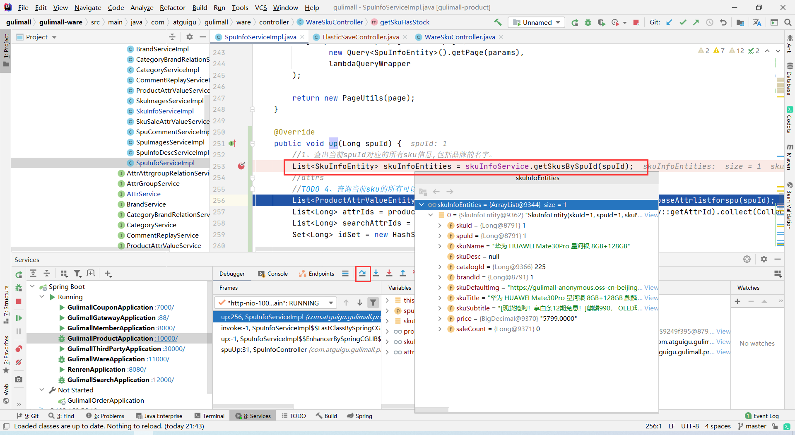

可以看到，`gulimall_pms`数据库的`pms_sku_info`表中的`spu_id`为`1`的有8条数据

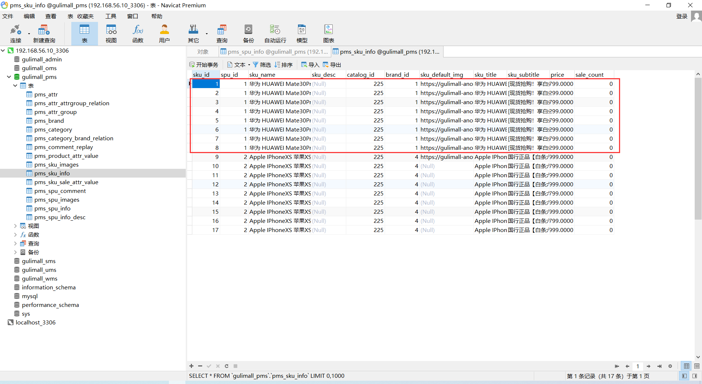

##### 3、修改`getSkusBySpuId`方法

修改`gulimall-product`模块的`com.atguigu.gulimall.product.service.impl.SkuInfoServiceImpl`类的`getSkusBySpuId`方法

这里错把`SkuInfoEntity::getSpuId`写成`SkuInfoEntity::getSkuId`了，改过来就行了

```java
@Override
public List<SkuInfoEntity> getSkusBySpuId(Long spuId) {
    LambdaQueryWrapper<SkuInfoEntity> lambdaQueryWrapper = new LambdaQueryWrapper<>();
    lambdaQueryWrapper.eq(SkuInfoEntity::getSpuId,spuId);
    List<SkuInfoEntity> list = this.list(lambdaQueryWrapper);
    return list;
}
```

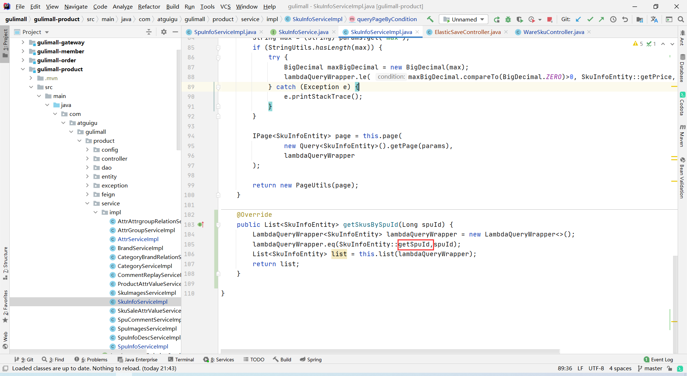

#### 3、重新测试

##### 1、重启`product`服务

重新以debug方式启动`GulimallProductApplication`服务

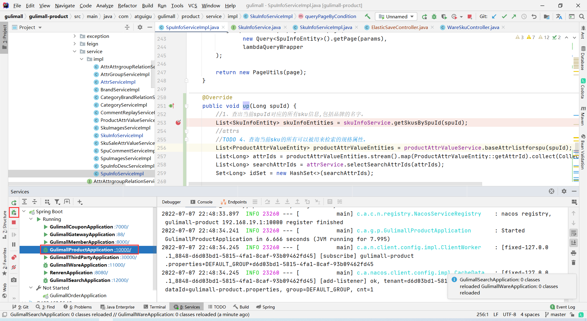

##### 2、再次点击`上架`

刷新前端页面，再次在`商品系统/商品维护/spu管理`里的id为`1`的商品里点击右侧`操作`里的`上架`

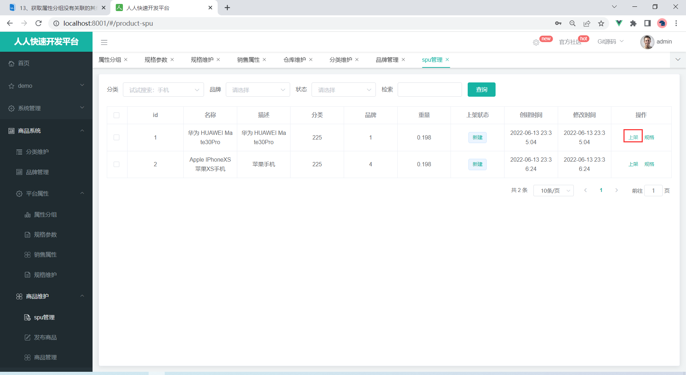

##### 3、根据`spuId`查询所有`sku`

切换到`IDEA`，点击`GulimallProductApplication`服务的`Step Over`(步过)按钮，执行当前方法的下一个语句

`List<SkuInfoEntity> skuInfoEntities = skuInfoService.getSkusBySpuId(spuId);`

根据`spuId`查询所有`sku`数据（共8条），还差品牌的名字没有查出来。

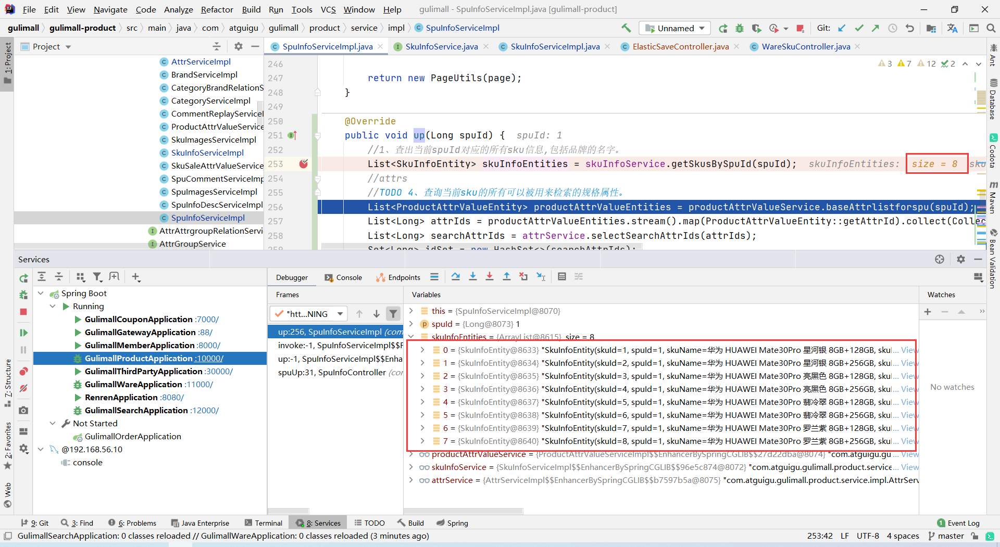

与`gulimall_pms`数据库的`pms_sku_info`表中的`spu_id`为`1`的8条数据相同

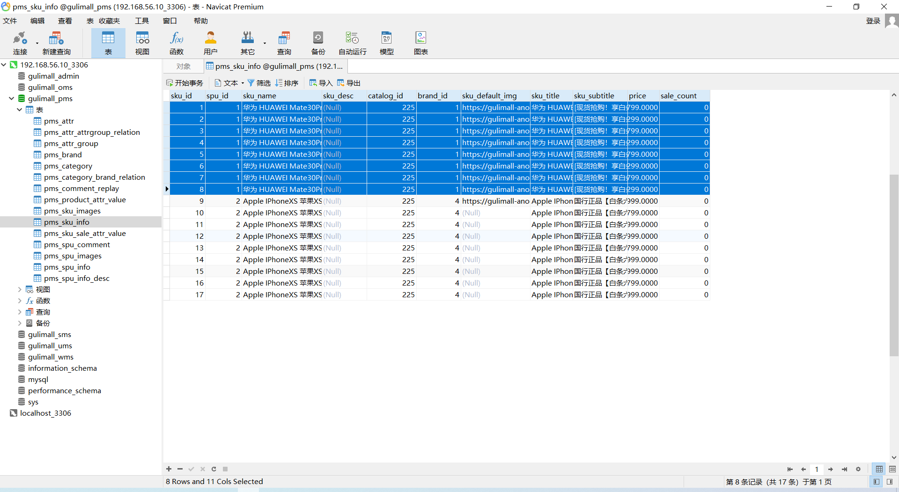

##### 4、查出所有的规格属性

点击`GulimallProductApplication`服务的`Step Over`(步过)按钮，执行当前方法的下一个语句

`List<ProductAttrValueEntity> productAttrValueEntities = productAttrValueService.baseAttrlistforspu(spuId);`

根据`spuId`查询出该该`spu`的所有基础属性

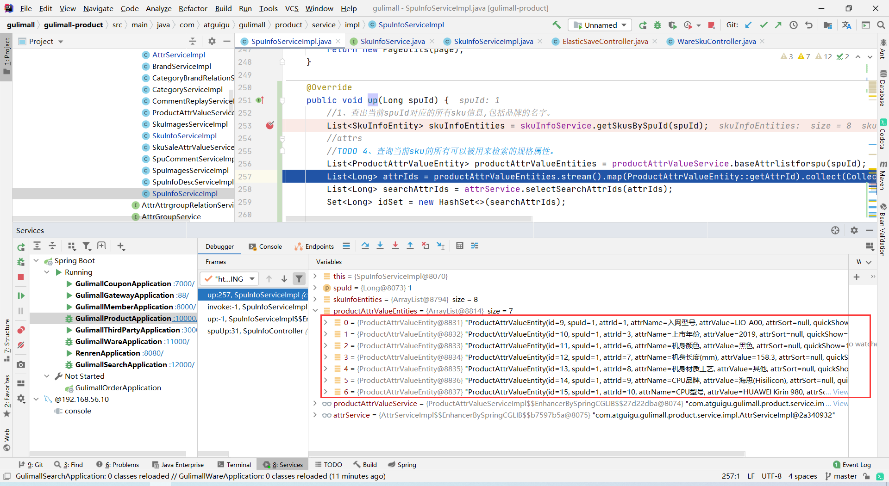

##### 5、获取`attrId`集合

点击`GulimallProductApplication`服务的`Step Over`(步过)按钮，执行当前方法的下一个语句

`List<Long> attrIds = productAttrValueEntities.stream().map(ProductAttrValueEntity::getAttrId).collect(Collectors.toList());`

根据`ProductAttrValueEntity`集合获取`attrId`集合

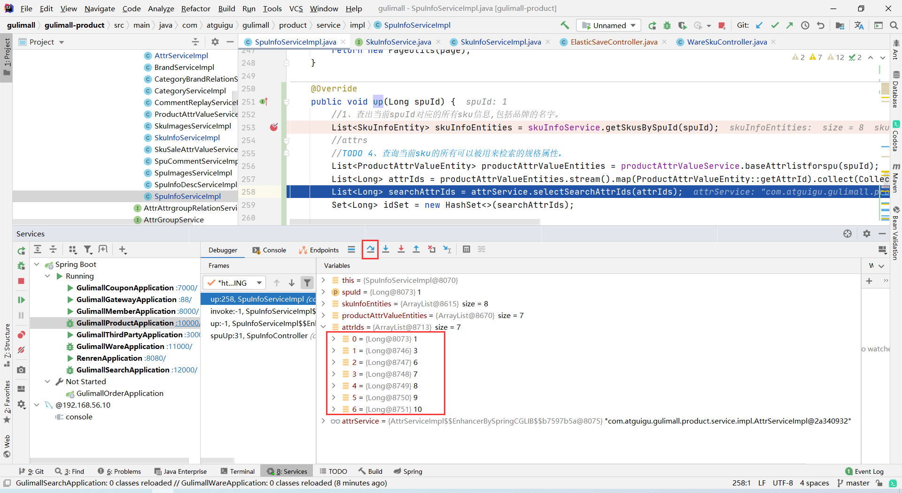

##### 6、筛选出可检索规格属性

点击`GulimallProductApplication`服务的`Step Over`(步过)按钮，执行当前方法的下一个语句

`List<Long> searchAttrIds = attrService.selectSearchAttrIds(attrIds);`

根据`attrIds`(当前`spuId`的所有规格属性的集合)过滤出所有可以被用来检索的规格属性

可以看到查询到了一条`attrId`为`1`的一条数据

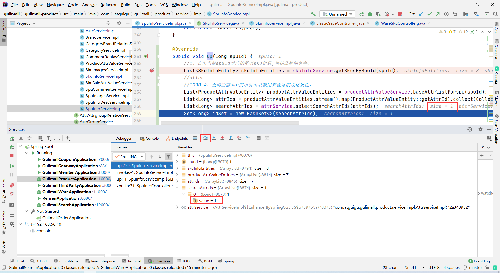

与`gulimall_pms`数据库的`pms_attr`表的指定`attr_id`集合的`search_type`为`1`的数据一致

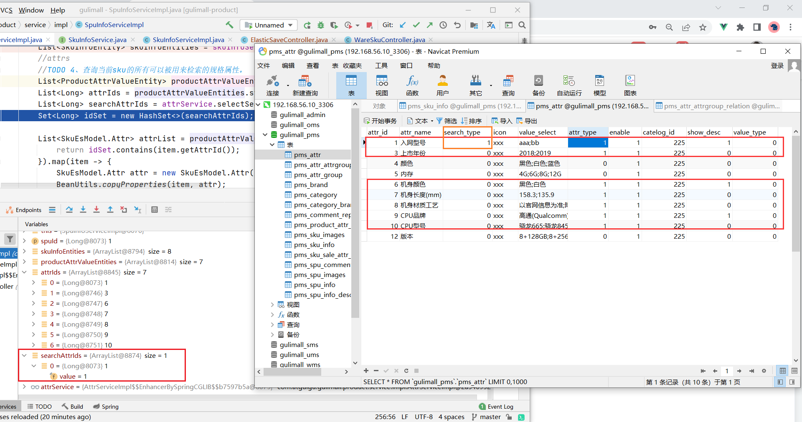

##### 7、把`List<Long>`转为`Set<Long>`

点击`GulimallProductApplication`服务的`Step Over`(步过)按钮，执行当前方法的下一个语句

`Set<Long> idSet = new HashSet<>(searchAttrIds);`

把查出的可检索的规格属性放到了`HashSet`集合里，方便查询(这样查询的效率为`O(1)`)

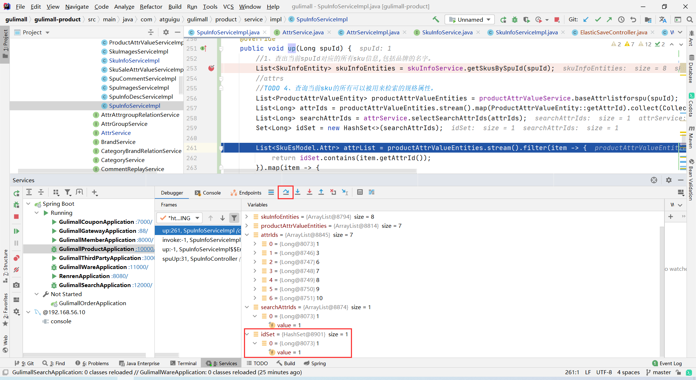

##### 8、打断点

在`SkuEsModel.Attr attr = new SkuEsModel.Attr();`这里打个断点

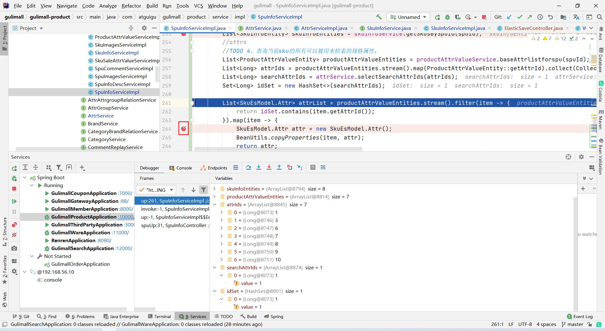

##### 9、点击三次`Step Over`

点击`GulimallProductApplication`服务的`Step Over`(步过)按钮三次，执行当前方法的下三个语句，跳到`SkuEsModel.Attr attr = new SkuEsModel.Attr();`这里，可以看到当前遍历的元素就是一个`规格属性`

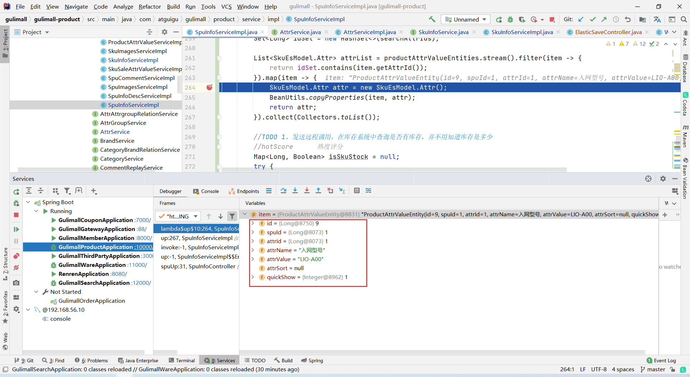

##### 10、点击两次`Step Over`

点击`GulimallProductApplication`服务的`Step Over`(步过)按钮两次，执行当前方法的下两个语句，跳到`return attr;`语句

这时已经把`attrId`、`attrName`、`attrValue`封装到`gulimall-common`模块的`com.atguigu.common.to.es.SkuEsModel.Attr`内部类里了

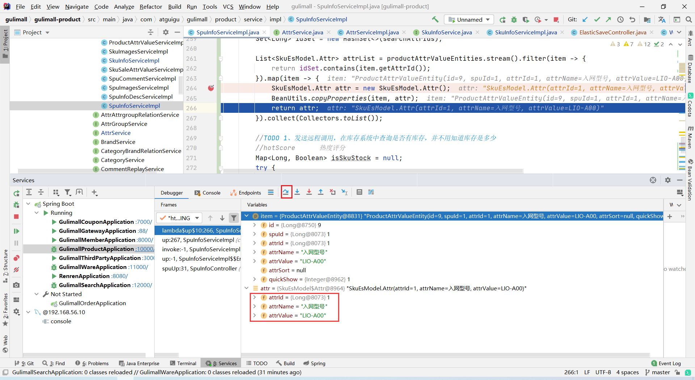

##### 11、执行完该`stream`

一直点击`GulimallProductApplication`项目的`Step Over`(步过)按钮，直到执行完该`stream`，准备执行`Map<Long, Boolean> isSkuStock = null;`语句

这时已经处理完所有`attrId`，并把他们放到`attrList`集合里了

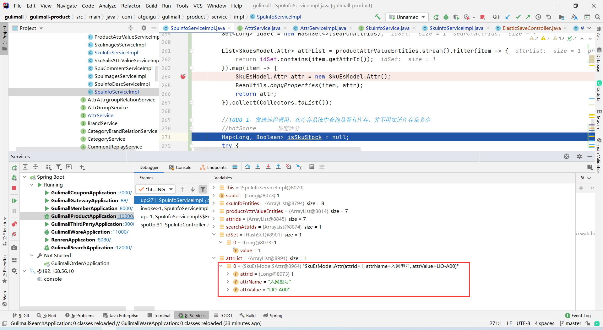

##### 12、打断点

在`Map<Long, Boolean> finalIsSkuStock = isSkuStock;`这里打个断点

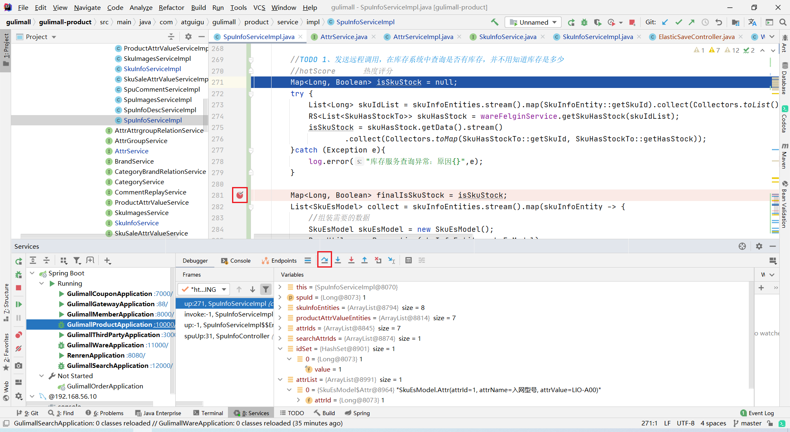

##### 13、准备调用`ware`模块

点击`GulimallProductApplication`服务的`Step Over`(步过)按钮两次，执行当前方法的下两个语句，跳到`RS<List<SkuHasStockTo>> skuHasStock = wareFelginService.getSkuHasStock(skuIdList);`这里

准备远程调用`GulimallWareApplication`服务，在库存系统里查询这些`sku`是否还有库存

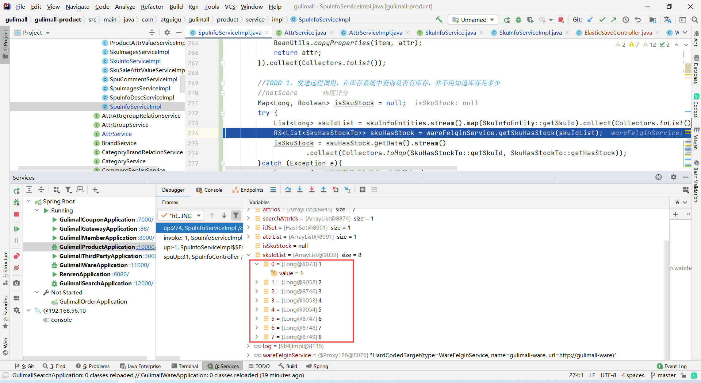

### 5.2.8、测试（2）`Ware`服务

#### 1、准备转到`ware`模块

点击`GulimallProductApplication`服务的`Step Over`(步过)按钮，执行当前方法的下一个语句，准备跳转到`GulimallWareApplication`服务

##### 1、没有跳转到`ware`模块

并没有按预想的跳转到`GulimallWareApplication`服务，而是跳转到了异常里面，可以看到是没有找到`WareFelginService`模块

```
detailMessage = "status 404 reading WareFelginService#getSkuHasStock(List)"
详细信息 = "状态 404 读取 WareFelginService#getSkuHasStock(List)"
```

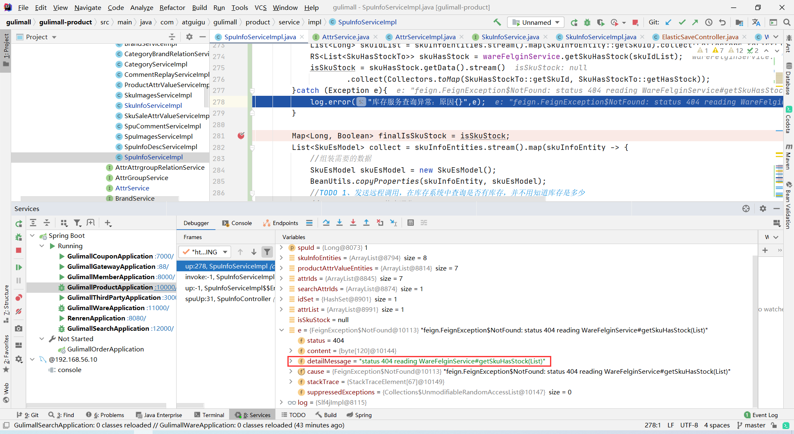

##### 2、修改注解

修改`gulimall-product`模块的`com.atguigu.gulimall.product.feign.WareFelginService`类的`getSkuHasStock`方法

把`@PostMapping("/hasStock")`注解修改成`@PostMapping("/ware/waresku/hasStock")`

```java
@PostMapping("/ware/waresku/hasStock")
```

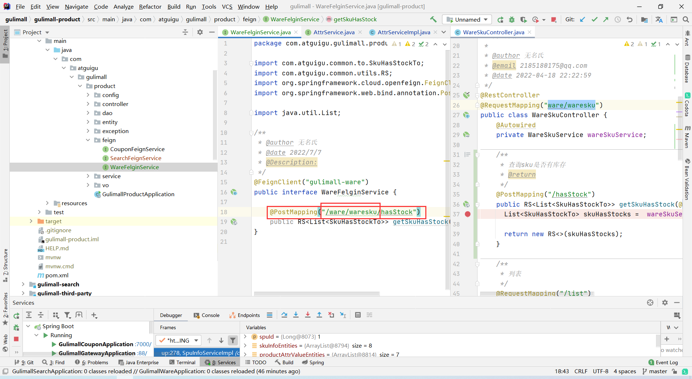

#### 2、再次测试

再次以debug方式启动`GulimallProductApplication`服务

刷新前端页面，再次在`商品系统/商品维护/spu管理`里的id为`1`的商品里点击右侧`操作`里的`上架`

##### 1、跳转到`ware`模块

这次就成功跳转到`GulimallWareApplication`服务了

就来到了`gulimall-ware`模块的`com.atguigu.gulimall.ware.controller.WareSkuController`类的`getSkuHasStock`方法的`List<SkuHasStockTo> skuHasStocks =  wareSkuService.getSkuHasStock(skuIds);`这条语句

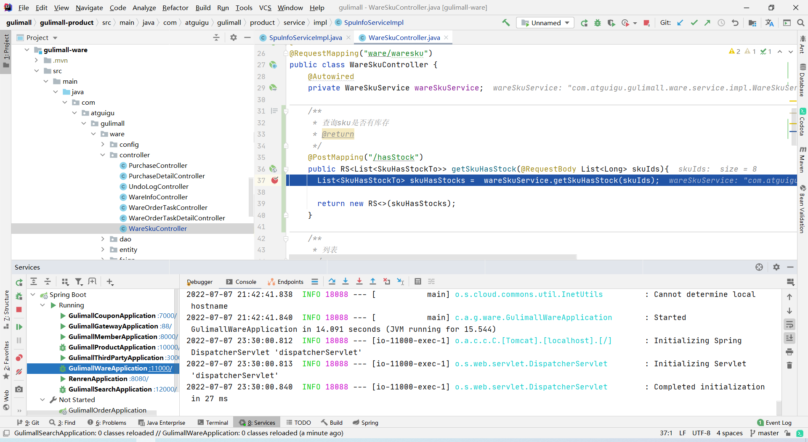

##### 2、跳转到异常了

点击`GulimallWareApplication`服务的`Step Over`(步过)按钮，执行当前方法的下一个语句

`List<SkuHasStockTo> skuHasStocks =  wareSkuService.getSkuHasStock(skuIds);`

这次就到了一个异常类里，很明显这行代码出错了

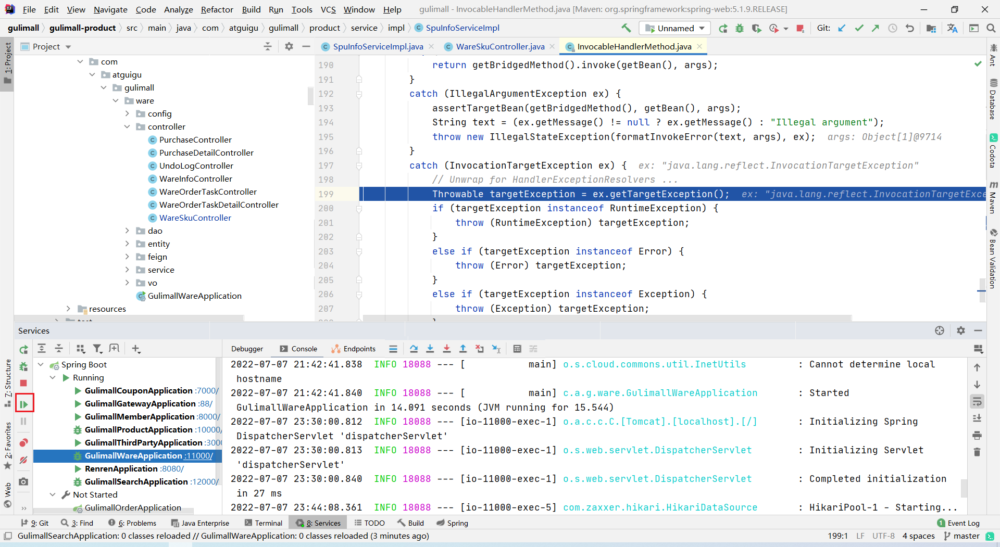

##### 3、试图从具有原始返回类型（long）的方法返回 null

点击`Pause Program`按钮，执行完这些异常处理类

可以看到`ibatis`报错，这应该就是`mybatis`相关的错误了

在`gulimall-ware`模块的`com.atguigu.gulimall.ware.dao.WareSkuDao.getSkuStock`方法应该返回`long`类型，而实际返回`null`

```
org.apache.ibatis.binding.BindingException: Mapper method 'com.atguigu.gulimall.ware.dao.WareSkuDao.getSkuStock attempted to return null from a method with a primitive return type (long).

org.apache.ibatis.binding.BindingException：映射器方法 'com.atguigu.gulimall.ware.dao.WareSkuDao.getSkuStock 试图从具有原始返回类型（long）的方法返回 null。
```


是`gulimall-ware`模块的`src/main/resources/mapper/ware/WareSkuDao.xml`文件的如下代码报错

```java
<select id="getSkuStock" resultType="java.lang.Long">
    select sum(stock-stock_locked) from gulimall_wms.wms_ware_sku where sku_id=#{skuId}
</select>
```

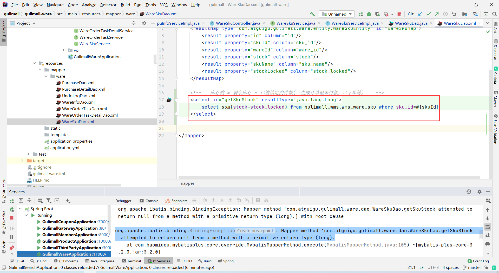

查看`gulimall_wms`数据库的`wms_ware_sku`表，可以看到这里没有`skuId`为`5`的库存信息

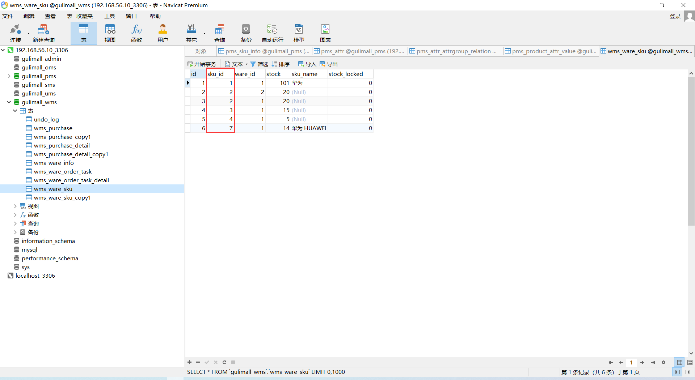

执行如下`sql`语句，由于查不到`skuId`为`5`的库存信息，所以就返回了`null`，而`long`基本类型不能接收`null`

```mysql
select sum(stock-stock_locked) from gulimall_wms.wms_ware_sku where sku_id=5
```

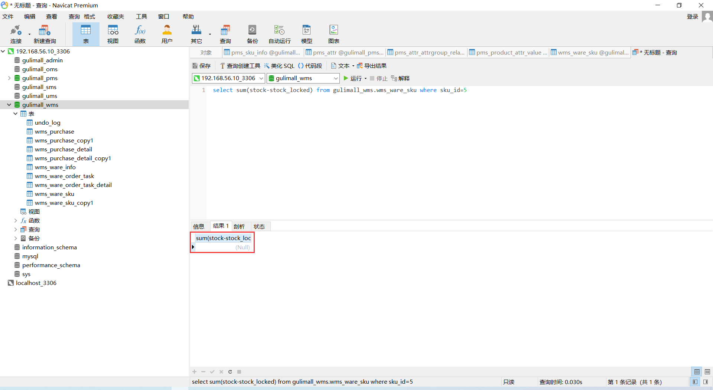

##### 4、换成包装类型

将`gulimall-ware`模块的`com.atguigu.gulimall.ware.service.impl.WareSkuServiceImpl`类的`getSkuHasStock`方法的`long count = this.baseMapper.getSkuStock(skuId);`替换为`Long count = this.baseMapper.getSkuStock(skuId);`

```java
@Override
public List<SkuHasStockTo> getSkuHasStock(List<Long> skuIds) {
    List<SkuHasStockTo> collect = skuIds.stream().map(skuId -> {
        SkuHasStockTo vo = new SkuHasStockTo();
        //SELECT SUM (stock) FROM、 wms ware skui WHERE sku id=1
        Long count = this.baseMapper.getSkuStock(skuId);

        vo.setSkuId(skuId);
        vo.setHasStock(count != null && count > 0);
        return vo;
    }).collect(Collectors.toList());

    return collect;
}
```

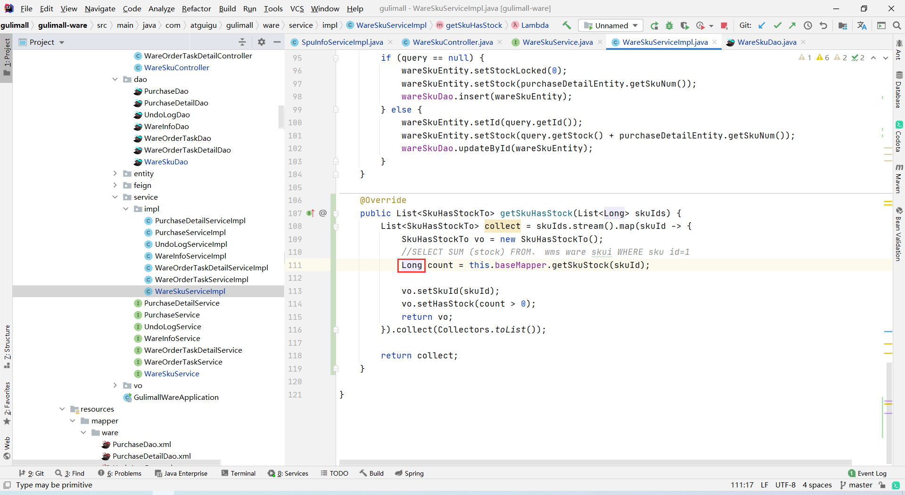

将`gulimall-ware`模块的`com.atguigu.gulimall.ware.dao.WareSkuDao`接口的`getSkuStock`抽象方法的`long getSkuStock(Long skuId);`替换为`Long getSkuStock(Long skuId);`

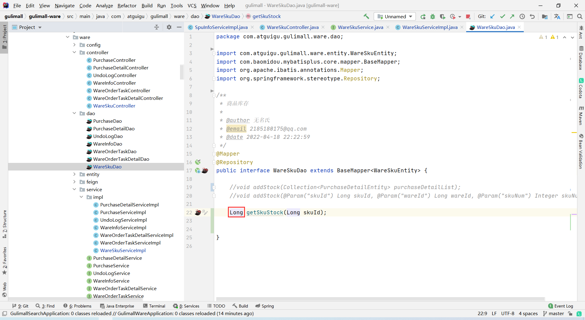

##### 5、超时异常

这时如果点击`GulimallProductApplication`服务，这时 报的是超时异常而不是原本的异常

```
detailMessage = "Read timed out executing POST http://gulimall-ware/ware/waresku/hasStock"
```

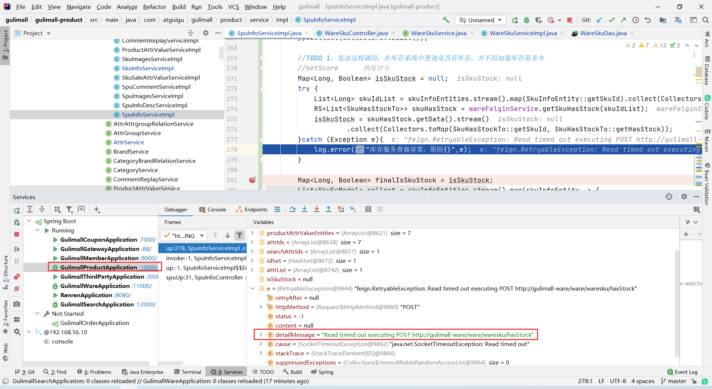

#### 3、再次测试

重新以`debug`方式启动`GulimallProductApplication`商品服务和`GulimallWareApplication`库存服务

刷新前端页面，再次在`商品系统/商品维护/spu管理`里的id为`1`的商品里点击右侧`操作`里的`上架`

##### 1、打断点

取消`gulimall-product`模块的`com.atguigu.gulimall.product.service.impl.SpuInfoServiceImpl`类的`up`方法的`List<Long> skuIdList = skuInfoEntities.stream().map(SkuInfoEntity::getSkuId).collect(Collectors.toList());`前面的断点，并在`List<Long> skuIdList = skuInfoEntities.stream().map(SkuInfoEntity::getSkuId).collect(Collectors.toList());`这里打一个断点

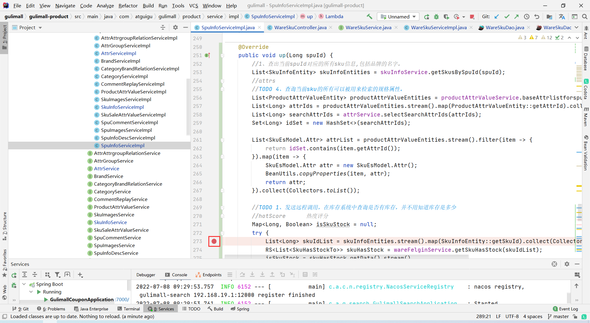

##### 2、点击`Resume Program`

点击`Resume Program`或按`F9`，执行到`List<Long> skuIdList = skuInfoEntities.stream().map(SkuInfoEntity::getSkuId).collect(Collectors.toList());`这个断点

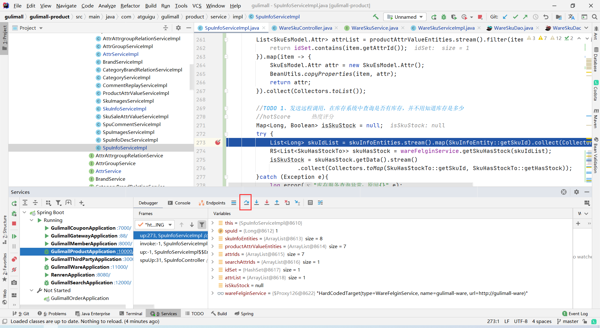

##### 3、点击`Step Over`(步过)按钮

点击`GulimallProductApplication`服务的`Step Over`(步过)按钮，执行当前方法的下一个语句

`List<Long> skuIdList = skuInfoEntities.stream().map(SkuInfoEntity::getSkuId).collect(Collectors.toList());`

把`SkuInfoEntity`集合的`skuId`收集起来，准备发送给远程的`GulimallWareApplication`服务

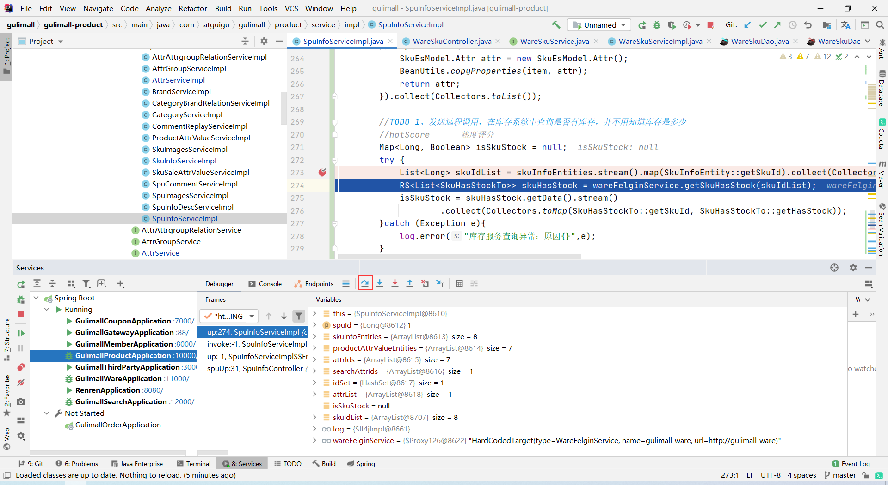

##### 4、跳转到`gulimall-ware`模块

点击`GulimallProductApplication`服务的`Step Over`(步过)按钮，就来到了`gulimall-ware`模块的`com.atguigu.gulimall.ware.controller.WareSkuController`类的`getSkuHasStock`方法的`List<SkuHasStockTo> skuHasStocks =  wareSkuService.getSkuHasStock(skuIds);`这条语句

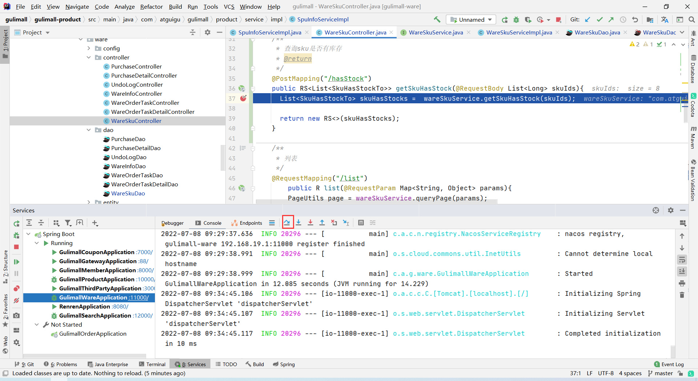

##### 5、又跳转到异常了

点击`GulimallWareApplication`服务的`Step Over`(步过)按钮，执行当前方法的下一个语句，又跳转到异常了

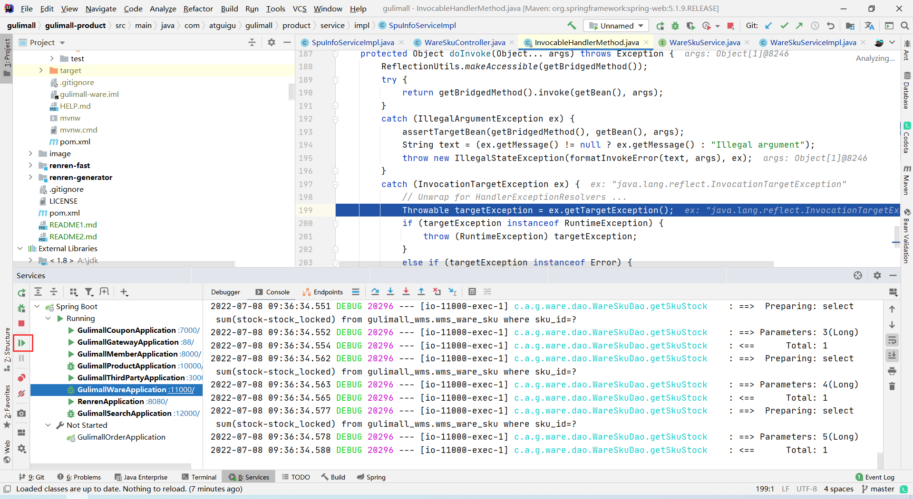

##### 6、空指针异常

再次点点击`Resume Program`或按`F9`放行这些异常处理类，可以看到报了空指针异常

```java
java.lang.NullPointerException: null
	at com.atguigu.gulimall.ware.service.impl.WareSkuServiceImpl.lambda$getSkuHasStock$0(WareSkuServiceImpl.java:114) 
```

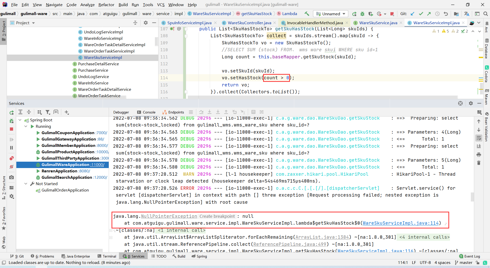

##### 7、修改`getSkuHasStock`方法

在`gulimall-ware`模块的`com.atguigu.gulimall.ware.service.impl.WareSkuServiceImpl`类的`getSkuHasStock`方法里

`vo.setHasStock(count > 0);`这条语句，由于刚刚没有查询到库存信息，所以`null > 0`由于`null`不能和`0`相比，所以就报异常了

修改`vo.setHasStock(count > 0);`为`vo.setHasStock(count != null && count > 0);`即可

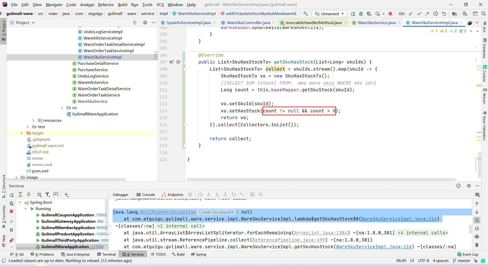

#### 4、重新测试

重新以`debug`方式启动`GulimallProductApplication`商品服务和`GulimallWareApplication`库存服务

刷新前端页面，再次在`商品系统/商品维护/spu管理`里的id为`1`的商品里点击右侧`操作`里的`上架`

##### 1、运行到`getSkuHasStock`方法

不断点击``Resume Program``和`Step Over`按钮，一直运行到`gulimall-ware`模块的`com.atguigu.gulimall.ware.controller.WareSkuController`类的`getSkuHasStock`方法的`List<SkuHasStockTo> skuHasStocks =  wareSkuService.getSkuHasStock(skuIds);`这里

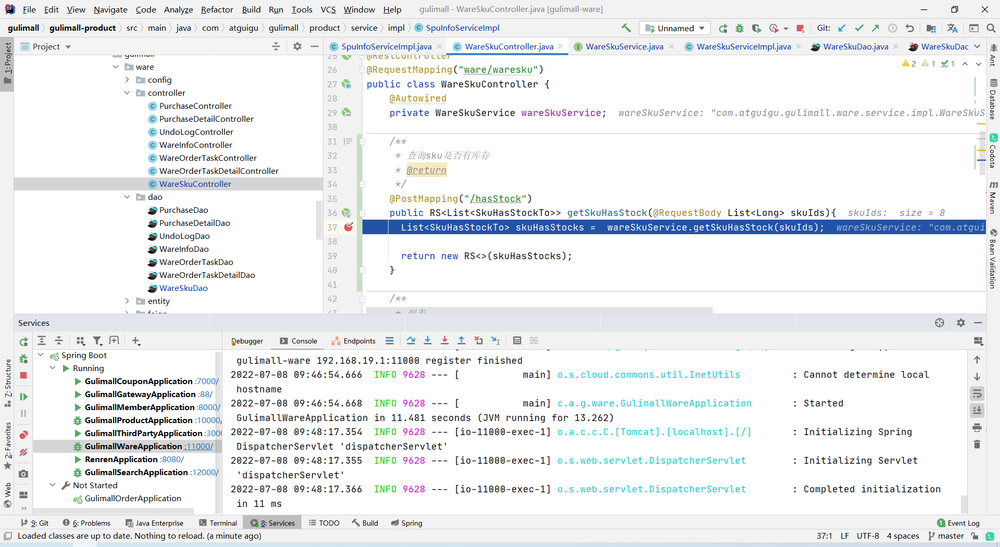

##### 2、打两个断点

在`gulimall-ware`模块的`com.atguigu.gulimall.ware.service.impl.WareSkuServiceImpl`类的`getSkuHasStock`方法的`List<SkuHasStockTo> collect = skuIds.stream().map(skuId -> {`和`vo.setHasStock(count != null && count > 0);`这里共打两个断点

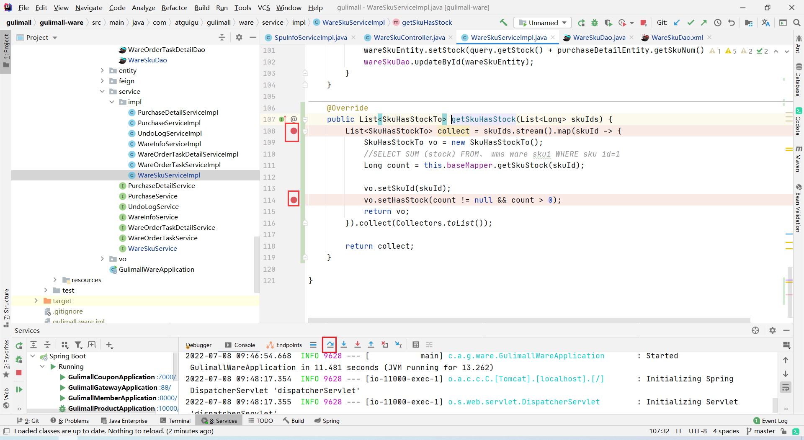

##### 3、点击`Step Over`按钮

点击`GulimallWareApplication`服务的`Step Over`(步过)按钮，执行当前方法的下一个语句

可以看到，已经运行到`gulimall-ware`模块的`com.atguigu.gulimall.ware.service.impl.WareSkuServiceImpl`类的`getSkuHasStock`方法的`List<SkuHasStockTo> collect = skuIds.stream().map(skuId -> {`这里了

`skuIds`的数据也正确传过来了

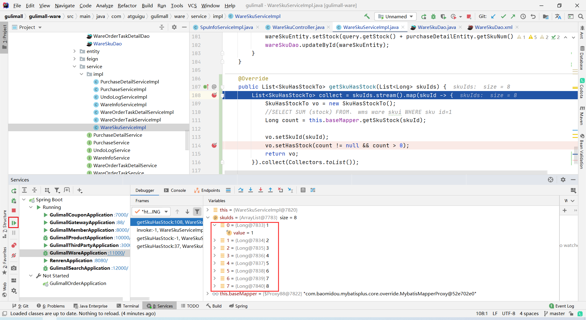

##### 4、点击`Resume Program`

点击`Resume Program`或按`F9`，执行到`vo.setHasStock(count != null && count > 0);`这里

此时`vo`的`skuId`已赋值进去了，`hasStock`还为`null`(这里的`vo`其实应该改名为`to`)

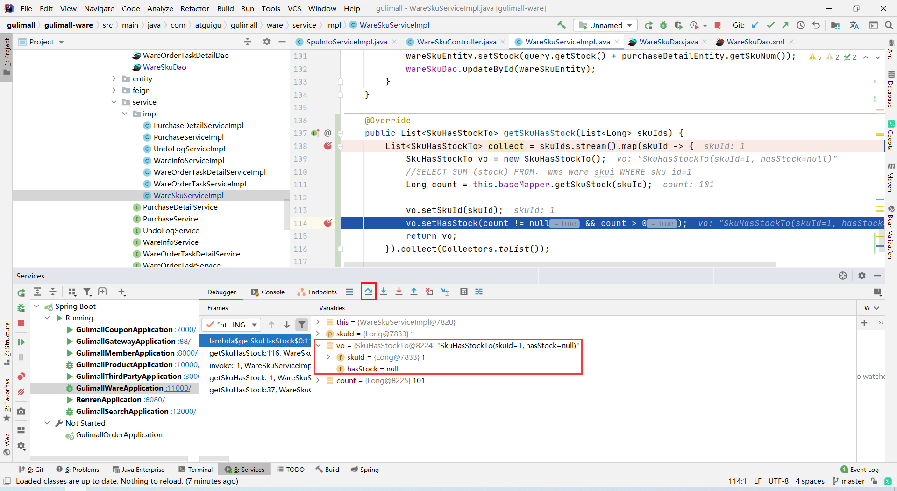

##### 5、点击`Step Over`按钮

点击`GulimallWareApplication`服务的`Step Over`(步过)按钮，执行当前方法的下一个语句

这时`vo`的`hasStock`已经正确赋值了

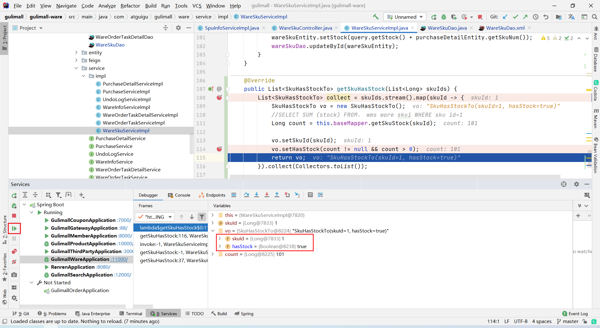

##### 6、点击`Resume Program`

点击`Resume Program`或按`F9`，执行到`skuId`为`2`的`SkuHasStockTo vo = new SkuHasStockTo();`这里

再次点击`Resume Program`或按`F9`，执行到`skuId`为`2`的`vo.setHasStock(count != null && count > 0);`这里


##### 7、点击`Step Over`按钮

点击`GulimallWareApplication`服务的`Step Over`(步过)按钮，执行当前方法的下一个语句

这时`skuId`为`2`的`vo`的`hasStock`已经正确赋值了

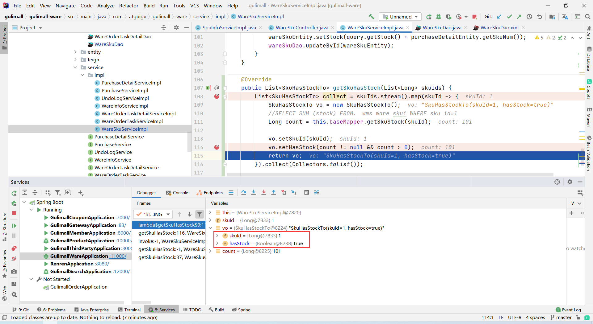

##### 8、取消断点并打新断点

取消`vo.setHasStock(count != null && count > 0);`上的断点，并在`return vo;`上打断点

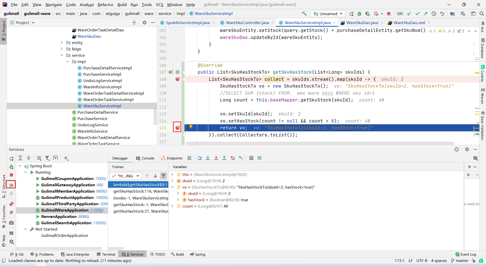

##### 9、点击`Resume Program`

点击`Resume Program`或按`F9`，执行到`skuId`为`3`的`return vo;`这里

这时`skuId`为`3`的`vo`的`skuId`和`hasStock`已经正确赋值了

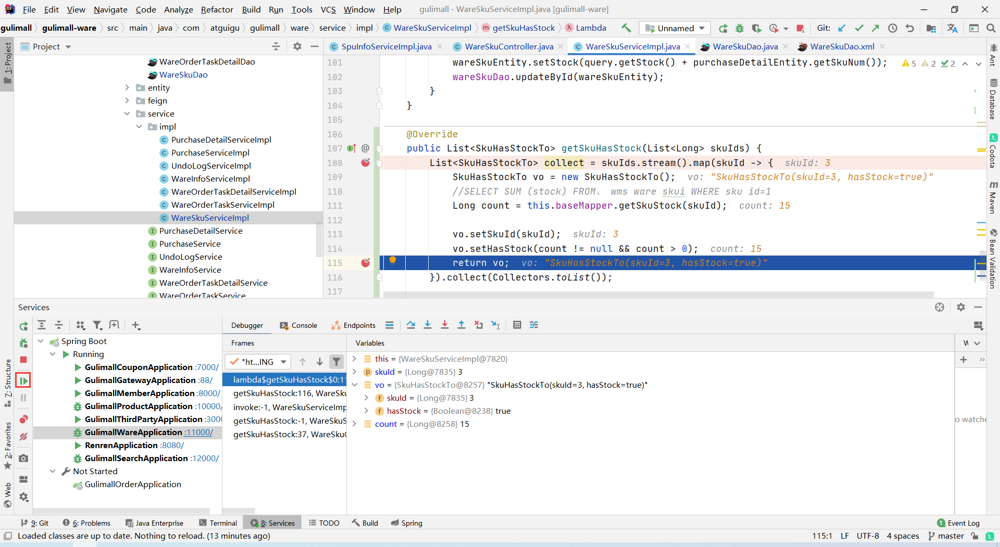

##### 10、点击`Resume Program`

点击`Resume Program`或按`F9`，执行到`skuId`为`4`的`return vo;`这里

这时`skuId`为`4`的`vo`的`skuId`和`hasStock`已经正确赋值了

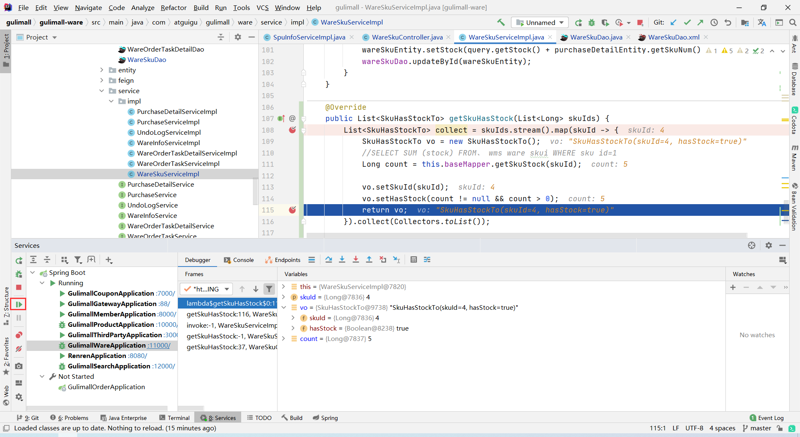

##### 11、点击`Resume Program`

点击`Resume Program`或按`F9`，执行到`skuId`为`4`的`return vo;`这里

这时`skuId`为`4`的`vo`的`skuId`和`hasStock`已经正确赋值了，此时的`hasStock`的值为`false`

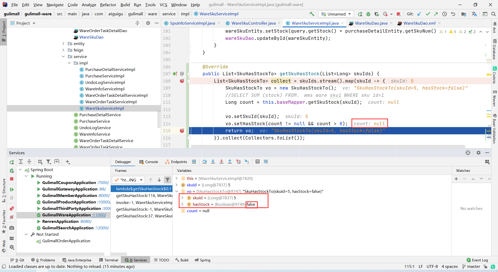

##### 12、取消`WareSkuServiceImpl`类的断点  

取消`gulimall-ware`模块的`com.atguigu.gulimall.ware.service.impl.WareSkuServiceImpl`类的`getSkuHasStock`方法的`return vo;`这个断点

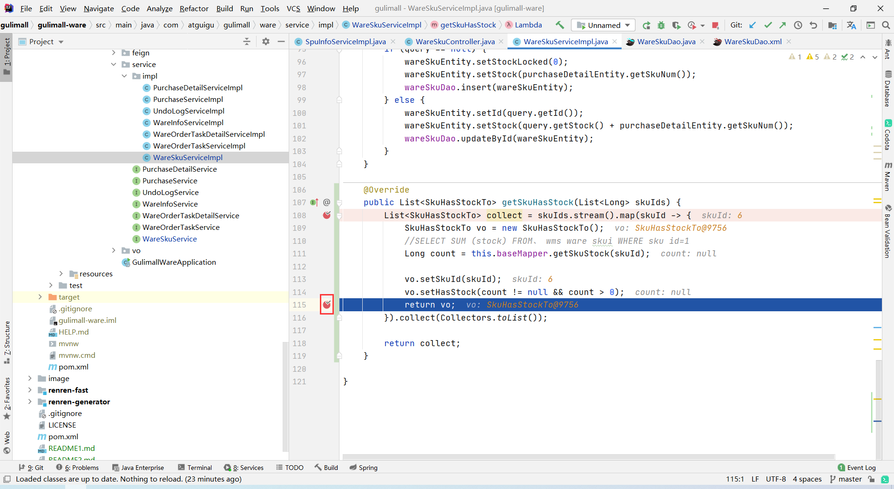

##### 13、在`WareSkuController`类打断点

在`gulimall-ware`模块的`com.atguigu.gulimall.ware.controller.WareSkuController`类的`getSkuHasStock`方法的`return new RS<>(skuHasStocks);`这里打个断点


##### 14、对比数据

点击`Resume Program`或按`F9`，执行到`skuId`为`4`的`return new RS<>(skuHasStocks);`这里

可以看到`skuHasStocks`对象的`elementData`里已经封装了这些数据


这些数据与`gulimall_wms`数据库的`wms_ware_sku`表里数据一致

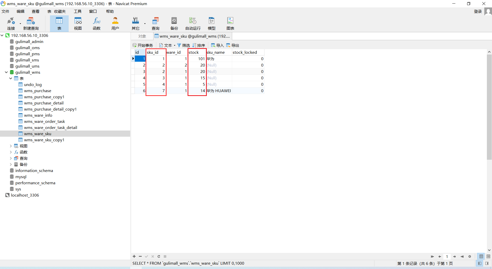

##### 15、点击`Resume Program`

点击`Resume Program`或按`F9`，放行`gulimall-ware`模块的`com.atguigu.gulimall.ware.controller.WareSkuController`类的`getSkuHasStock`方法，准备跳转到`gulimall-product`模块

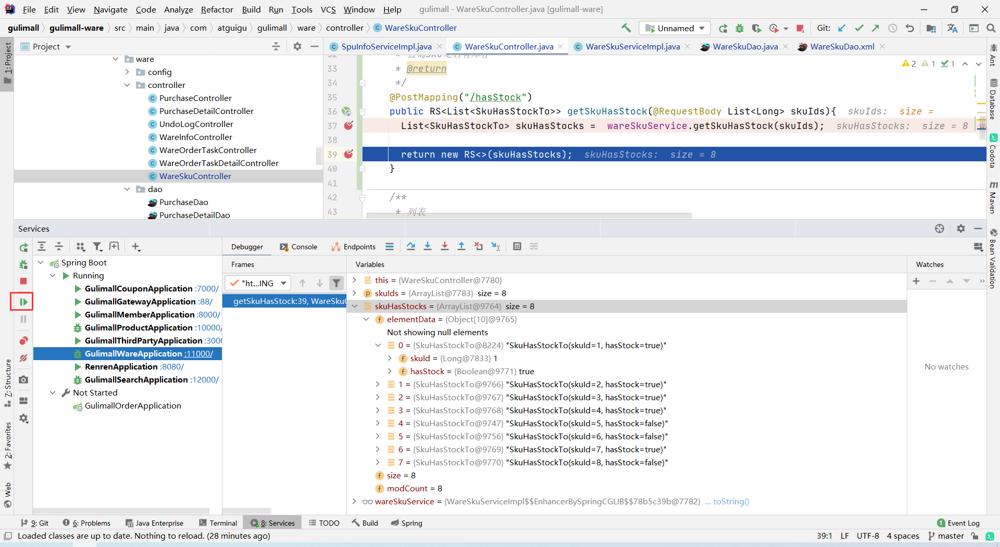

### 5.2.9、测试（3）

#### 1、准备工作

##### 1、超时异常

点击`Services`里的`GulimallProductApplication`服务，这时已经报了超时异常

这是因为刚刚调试用了很多时间，所以出现了超时异常

```
detailMessage ="Read timed out executing POST http://gulimall-ware/ware/waresku/hasStock"
```


##### 2、去掉`ware`模块的所有断点

去掉`gulimall-ware`模块的`com.atguigu.gulimall.ware.controller.WareSkuController`类的`getSkuHasStock`方法上的全部断点

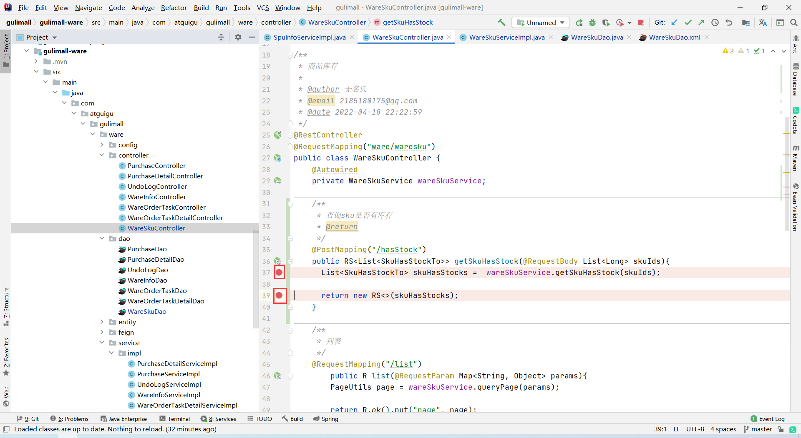

去掉`gulimall-ware`模块的`com.atguigu.gulimall.ware.service.impl.WareSkuServiceImpl`类的`getSkuHasStock`方法的所有断点

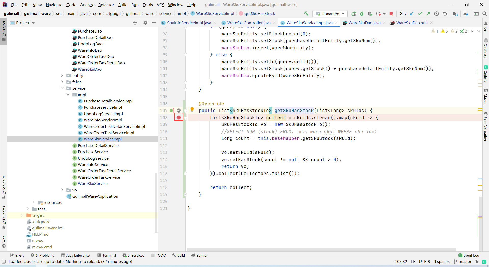

#### 2、再次测试

重新以`debug`方式启动`GulimallProductApplication`商品服务和`GulimallWareApplication`库存服务

刷新前端页面，再次在`商品系统/商品维护/spu管理`里的id为`1`的商品里点击右侧`操作`里的`上架`

##### 1、准备远程调用

这次直接来到了`gulimall-product`模块的`com.atguigu.gulimall.product.service.impl.SpuInfoServiceImpl`类的`up`方法的`List<Long> skuIdList = skuInfoEntities.stream().map(SkuInfoEntity::getSkuId).collect(Collectors.toList());`上

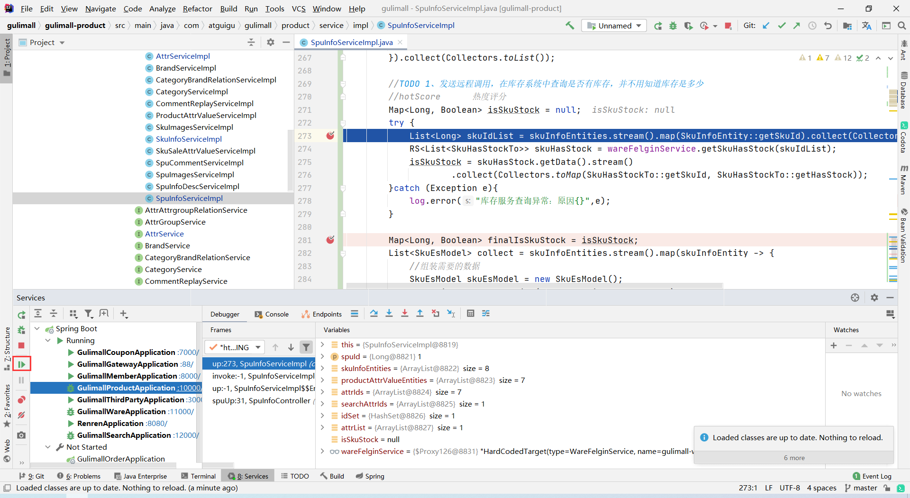

##### 2、`isSkuStock`还是为`null`

点击`Resume Program`或按`F9`，执行完远程调用，来到`Map<Long, Boolean> finalIsSkuStock = isSkuStock;`这里，可以看到`isSkuStock`还是为`null`，很明显写的还是有问题，这里先不管，继续向后执行

在`SkuEsModel skuEsModel = new SkuEsModel();`上打个断点

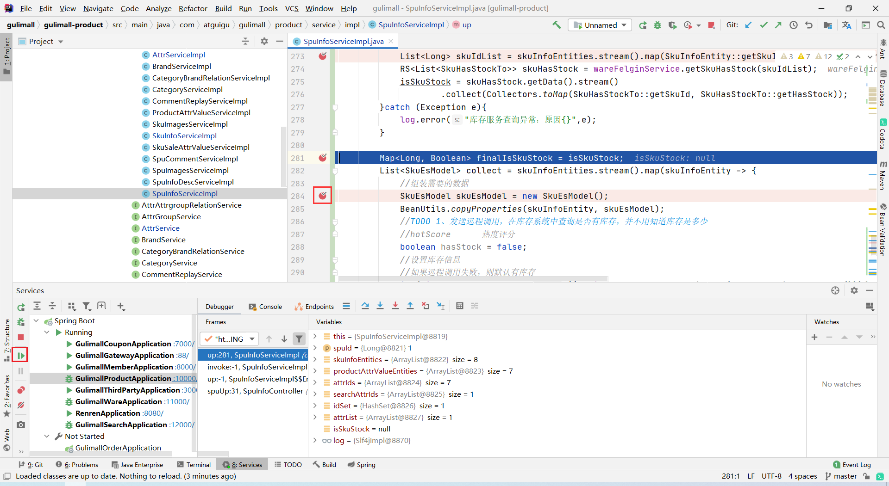

##### 3、打个断点

点击`Resume Program`或按`F9`，来到`SkuEsModel skuEsModel = new SkuEsModel();`这里

在`return skuEsModel;`这行打个断点（不要点击放行）

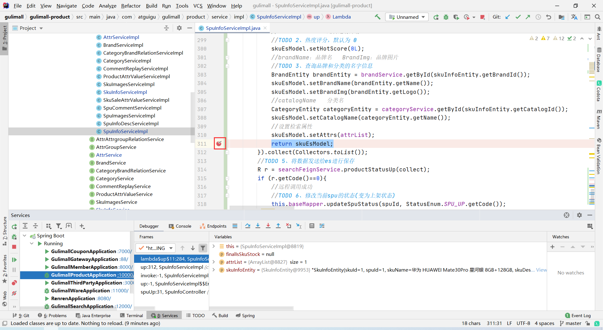

##### 4、点击两次`Step Over`(步过)按钮

点击`GulimallProductApplication`服务的`Step Over`(步过)按钮两次，执行当前方法的下两个语句

来到`boolean hasStock = false;`这里，可以看到`skuInfoEntity`里与`skuEsModel`相同名称的属性已经拷到`skuEsModel`里了

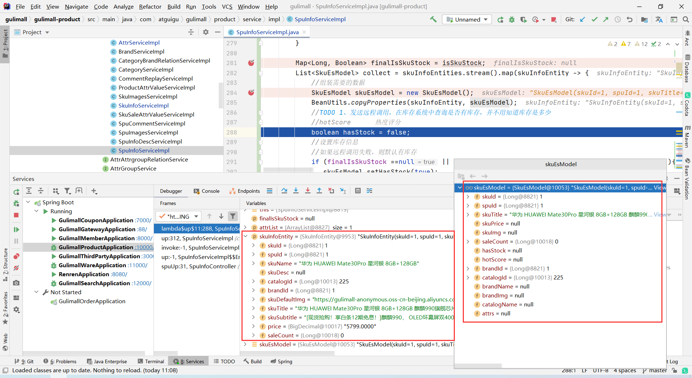

这与`gulimall_pms`数据库的`pms_sku_info`表的`sku_id`为`1`的数据一致

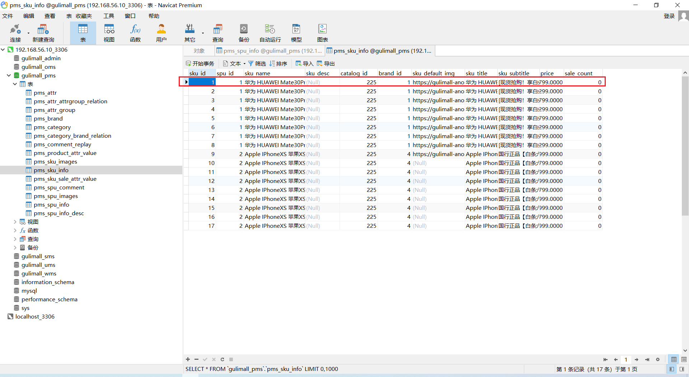

##### 5、`finalIsSkuStock`也为`null`

点击`GulimallProductApplication`服务的`Step Over`(步过)按钮，执行当前方法的下一个语句

由于`isSkuStock`为`null`，所以`finalIsSkuStock`也为`null`，因此`if (finalIsSkuStock ==null || !finalIsSkuStock.containsKey(skuInfoEntity.getSkuId())){`的第一的条件成立，默认被设置成了有库存

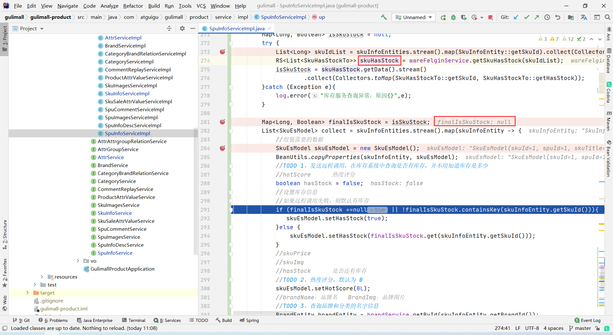

##### 6、`hasStock`属性已修改为`true`

一直点击`GulimallProductApplication`服务的`Step Over`(步过)按钮，执行当前方法的后面语句

执行到`skuEsModel.setHotScore(0L);`这里可以看到，`skuEsModel`的`hasStock`属性已修改为`true`

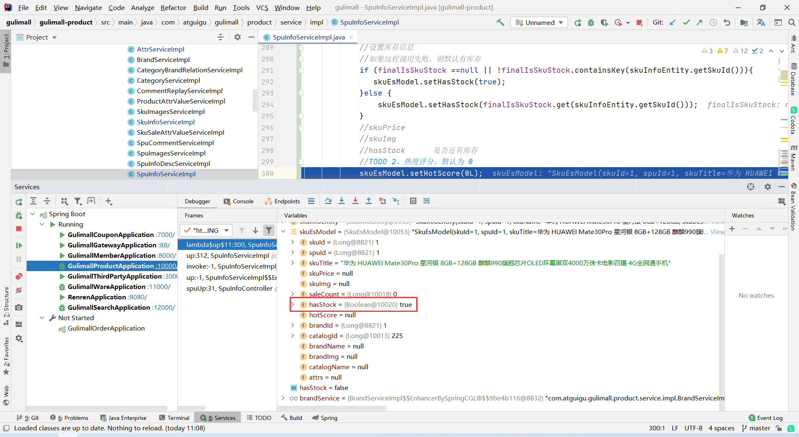

##### 7、点击`Step Over`

一直点击`GulimallProductApplication`服务的`Step Over`(步过)按钮，执行当前方法的后面语句

执行到`CategoryEntity categoryEntity = categoryService.getById(skuInfoEntity.getCatalogId());`这里

可以看到`BrandEntity brandEntity = brandService.getById(skuInfoEntity.getBrandId());`这行语句已经查询出数据了，到这里已经正确把`brandEntity`对象的`name`属性和`logo`属性赋值给`skuEsModel`的`brandName`属性和`brandImg`属性

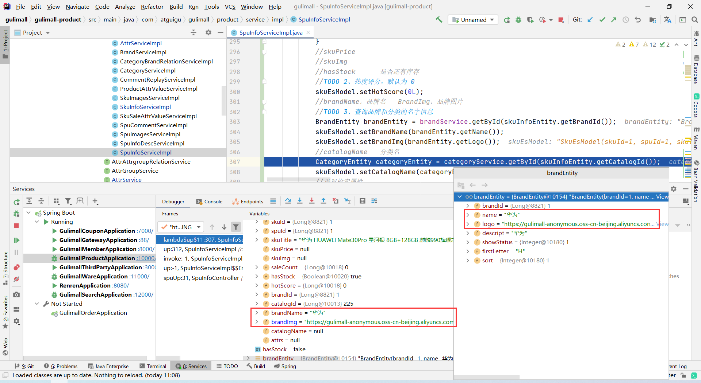

##### 8、点击`Resume Program`

点击`Resume Program`或按`F9`，执行到`return skuEsModel;`这里

可以看到`skuEsModel`对象的`catalogName`属性和`attrs`属性也正确赋值了

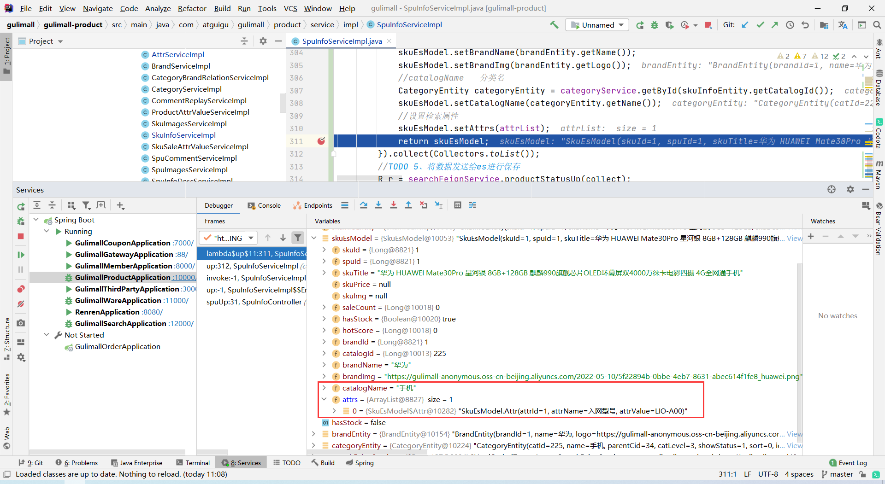

##### 9、重新打断点

取消`SkuEsModel skuEsModel = new SkuEsModel();`这个断点

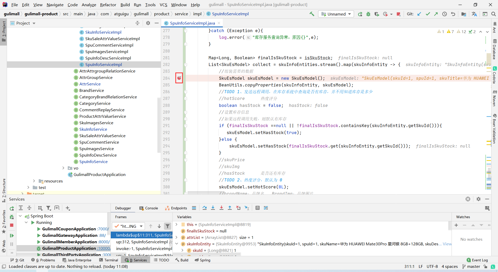

取消`return skuEsModel;`这个断点，并在`R r = searchFeignService.productStatusUp(collect);`这里打上断点

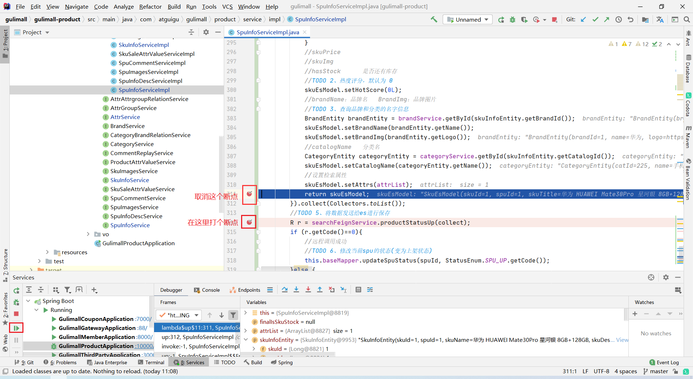

##### 10、点击`Resume Program`

点击`Resume Program`或按`F9`，执行到`R r = searchFeignService.productStatusUp(collect);`这里

可以看到已经把`SkuEsModel`集合收集到`collect`里了

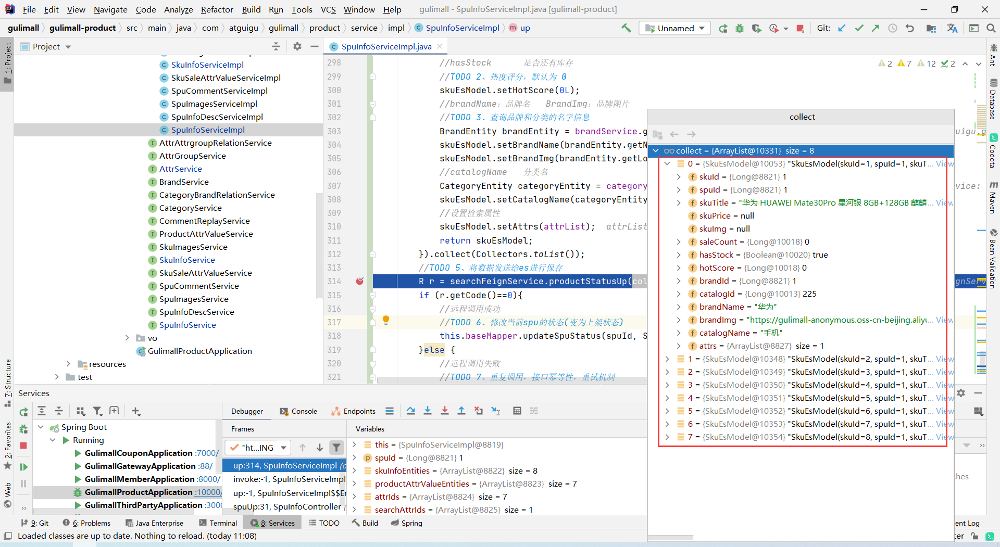

#### 3、进入`feign`源码

##### 1、点击`Step Into`

点击`Step Into`或按` F7`，进入`R r = searchFeignService.productStatusUp(collect);`方法内部，查看`feign`的调用过程

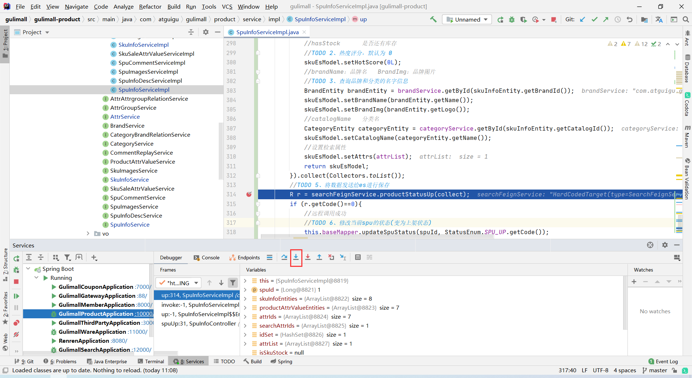

##### 2、判断方法名称

在`feign-core-10.2.3`jar包的`feign.ReflectiveFeign`类里的`invoke`方法里面

首先判断这个方法是不是`equals`、 `hashCode` 、`toString`，如果是这些方法直接调用本类(`feign.ReflectiveFeign`类)的这些方法

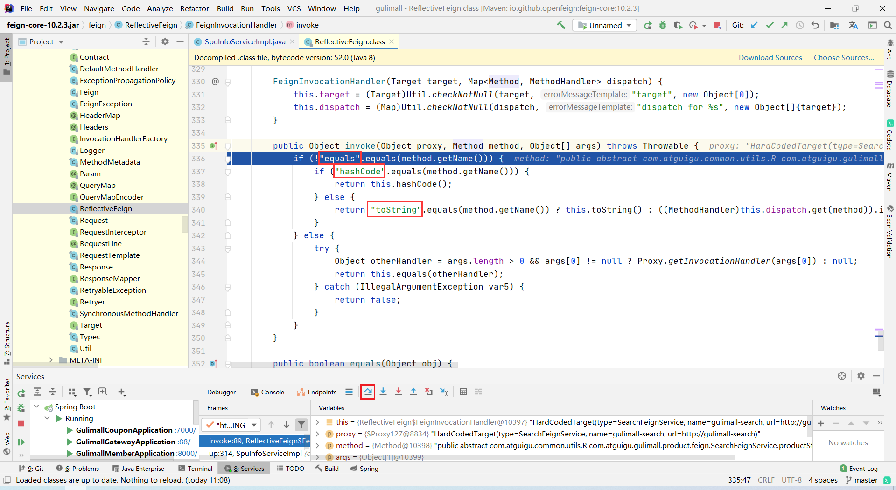

传入的`Method`方法的完整内容如下所示，可以看到`name`属性的值为`productStatusUp`，并不是这些方法

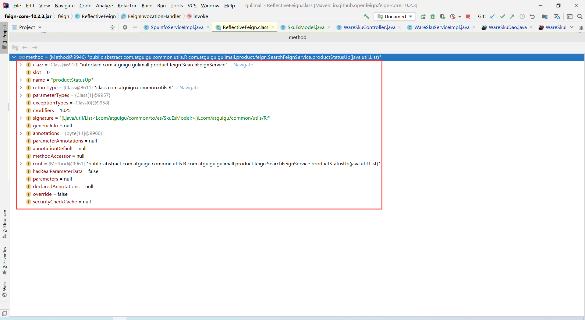

##### 3、准备跳到同步方法处理器

一直点击`Step Over`按钮步过，到`return "toString".equals(method.getName()) ? this.toString() : ((MethodHandler)this.dispatch.get(method)).invoke(args);`这里

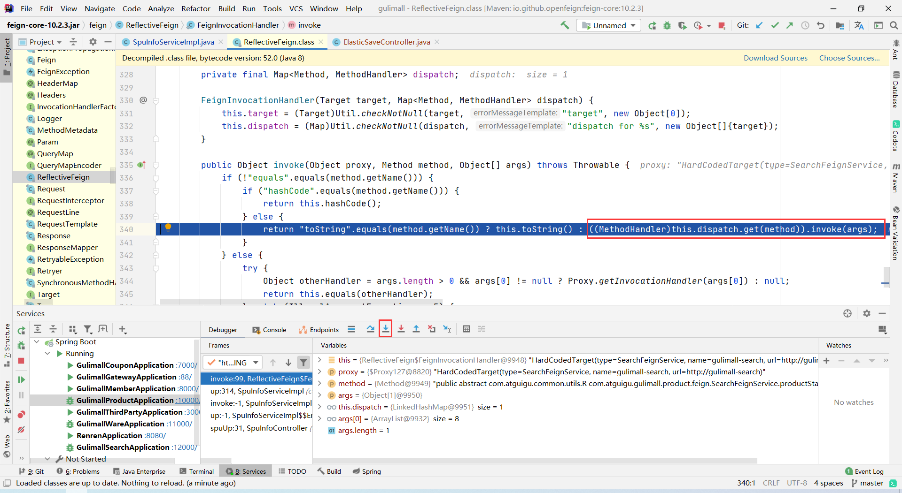

##### 4、跳到同步方法处理器

点击`Step Into`或按` F7`，进入`((MethodHandler)this.dispatch.get(method)).invoke(args);`里面

这是跳到了`SynchronousMethodHandler`类的内部(同步方法处理器)

传入的`Object[] argv`参数的`argv[0]`的数据为远程调用的`collect`

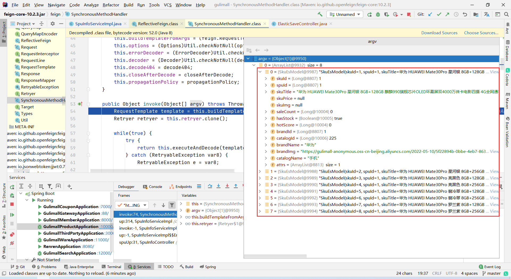

##### 5、构造请求模块

在`feign-core-10.2.3`jar包的`feign.SynchronousMethodHandler`类的`invoke`方法里的

`RequestTemplate template = this.buildTemplateFromArgs.create(argv);`

这里构造了一个请求模板，用于封装发送请求的信息

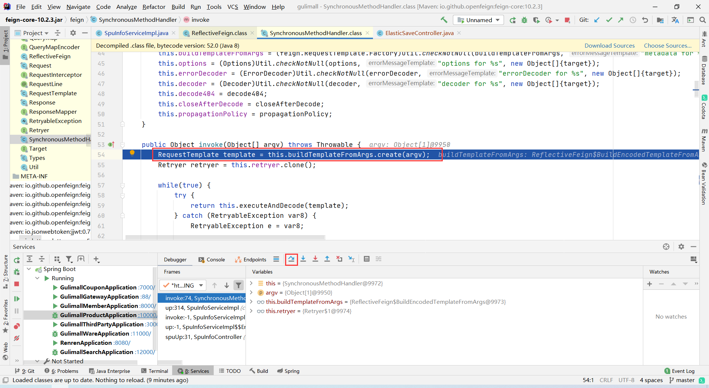

##### 6、`template`对象属性

点击`GulimallWareApplication`服务的`Step Over`(步过)按钮，执行当前方法的下一个语句,跳到`Retryer retryer = this.retryer.clone();`这里

`template`对象含有以下属性

`uriTemplate = "/search/save/product"`	指出要请求的路径

`method = "POST"`	指出请求方式为`POST`

`charset = "UTF-8"` 设置字符编码为`UTF-8` 

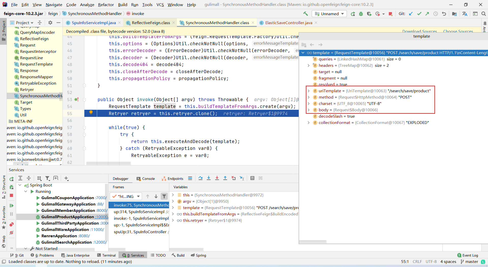

##### 7、查看`template`对象的`data`字段

点击`template` -> `body` -> `data` 右键选择`View as` -> `String`，即可查看`template`对象的`body`属性的`data`字段的数据

可以发现`feign`在底层会将数据转成`json`

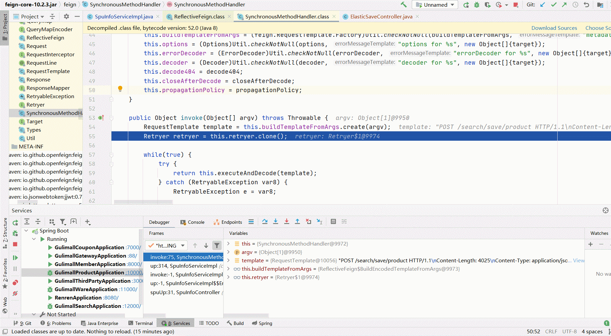

点击`data`属性右侧的`...View`，即可查看详细`json`，以下是这个`json`的详细数据

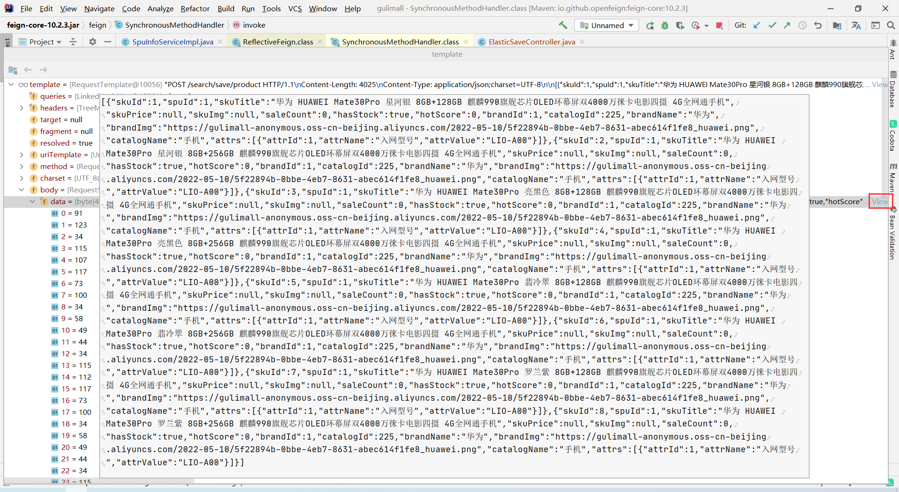

```json
[{"skuId":1,"spuId":1,"skuTitle":"华为 HUAWEI Mate30Pro 星河银 8GB+128GB 麒麟990旗舰芯片OLED环幕屏双4000万徕卡电影四摄 4G全网通手机","skuPrice":null,"skuImg":null,"saleCount":0,"hasStock":true,"hotScore":0,"brandId":1,"catalogId":225,"brandName":"华为","brandImg":"https://gulimall-anonymous.oss-cn-beijing.aliyuncs.com/2022-05-10/5f22894b-0bbe-4eb7-8631-abec614f1fe8_huawei.png","catalogName":"手机","attrs":[{"attrId":1,"attrName":"入网型号","attrValue":"LIO-A00"}]},{"skuId":2,"spuId":1,"skuTitle":"华为 HUAWEI Mate30Pro 星河银 8GB+256GB 麒麟990旗舰芯片OLED环幕屏双4000万徕卡电影四摄 4G全网通手机","skuPrice":null,"skuImg":null,"saleCount":0,"hasStock":true,"hotScore":0,"brandId":1,"catalogId":225,"brandName":"华为","brandImg":"https://gulimall-anonymous.oss-cn-beijing.aliyuncs.com/2022-05-10/5f22894b-0bbe-4eb7-8631-abec614f1fe8_huawei.png","catalogName":"手机","attrs":[{"attrId":1,"attrName":"入网型号","attrValue":"LIO-A00"}]},{"skuId":3,"spuId":1,"skuTitle":"华为 HUAWEI Mate30Pro 亮黑色 8GB+128GB 麒麟990旗舰芯片OLED环幕屏双4000万徕卡电影四摄 4G全网通手机","skuPrice":null,"skuImg":null,"saleCount":0,"hasStock":true,"hotScore":0,"brandId":1,"catalogId":225,"brandName":"华为","brandImg":"https://gulimall-anonymous.oss-cn-beijing.aliyuncs.com/2022-05-10/5f22894b-0bbe-4eb7-8631-abec614f1fe8_huawei.png","catalogName":"手机","attrs":[{"attrId":1,"attrName":"入网型号","attrValue":"LIO-A00"}]},{"skuId":4,"spuId":1,"skuTitle":"华为 HUAWEI Mate30Pro 亮黑色 8GB+256GB 麒麟990旗舰芯片OLED环幕屏双4000万徕卡电影四摄 4G全网通手机","skuPrice":null,"skuImg":null,"saleCount":0,"hasStock":true,"hotScore":0,"brandId":1,"catalogId":225,"brandName":"华为","brandImg":"https://gulimall-anonymous.oss-cn-beijing.aliyuncs.com/2022-05-10/5f22894b-0bbe-4eb7-8631-abec614f1fe8_huawei.png","catalogName":"手机","attrs":[{"attrId":1,"attrName":"入网型号","attrValue":"LIO-A00"}]},{"skuId":5,"spuId":1,"skuTitle":"华为 HUAWEI Mate30Pro 翡冷翠 8GB+128GB 麒麟990旗舰芯片OLED环幕屏双4000万徕卡电影四摄 4G全网通手机","skuPrice":null,"skuImg":null,"saleCount":0,"hasStock":true,"hotScore":0,"brandId":1,"catalogId":225,"brandName":"华为","brandImg":"https://gulimall-anonymous.oss-cn-beijing.aliyuncs.com/2022-05-10/5f22894b-0bbe-4eb7-8631-abec614f1fe8_huawei.png","catalogName":"手机","attrs":[{"attrId":1,"attrName":"入网型号","attrValue":"LIO-A00"}]},{"skuId":6,"spuId":1,"skuTitle":"华为 HUAWEI Mate30Pro 翡冷翠 8GB+256GB 麒麟990旗舰芯片OLED环幕屏双4000万徕卡电影四摄 4G全网通手机","skuPrice":null,"skuImg":null,"saleCount":0,"hasStock":true,"hotScore":0,"brandId":1,"catalogId":225,"brandName":"华为","brandImg":"https://gulimall-anonymous.oss-cn-beijing.aliyuncs.com/2022-05-10/5f22894b-0bbe-4eb7-8631-abec614f1fe8_huawei.png","catalogName":"手机","attrs":[{"attrId":1,"attrName":"入网型号","attrValue":"LIO-A00"}]},{"skuId":7,"spuId":1,"skuTitle":"华为 HUAWEI Mate30Pro 罗兰紫 8GB+128GB 麒麟990旗舰芯片OLED环幕屏双4000万徕卡电影四摄 4G全网通手机","skuPrice":null,"skuImg":null,"saleCount":0,"hasStock":true,"hotScore":0,"brandId":1,"catalogId":225,"brandName":"华为","brandImg":"https://gulimall-anonymous.oss-cn-beijing.aliyuncs.com/2022-05-10/5f22894b-0bbe-4eb7-8631-abec614f1fe8_huawei.png","catalogName":"手机","attrs":[{"attrId":1,"attrName":"入网型号","attrValue":"LIO-A00"}]},{"skuId":8,"spuId":1,"skuTitle":"华为 HUAWEI Mate30Pro 罗兰紫 8GB+256GB 麒麟990旗舰芯片OLED环幕屏双4000万徕卡电影四摄 4G全网通手机","skuPrice":null,"skuImg":null,"saleCount":0,"hasStock":true,"hotScore":0,"brandId":1,"catalogId":225,"brandName":"华为","brandImg":"https://gulimall-anonymous.oss-cn-beijing.aliyuncs.com/2022-05-10/5f22894b-0bbe-4eb7-8631-abec614f1fe8_huawei.png","catalogName":"手机","attrs":[{"attrId":1,"attrName":"入网型号","attrValue":"LIO-A00"}]}]
```

##### 8、拿到重试器 

`Retryer retryer = this.retryer.clone();`这里拿到了一个重试器 

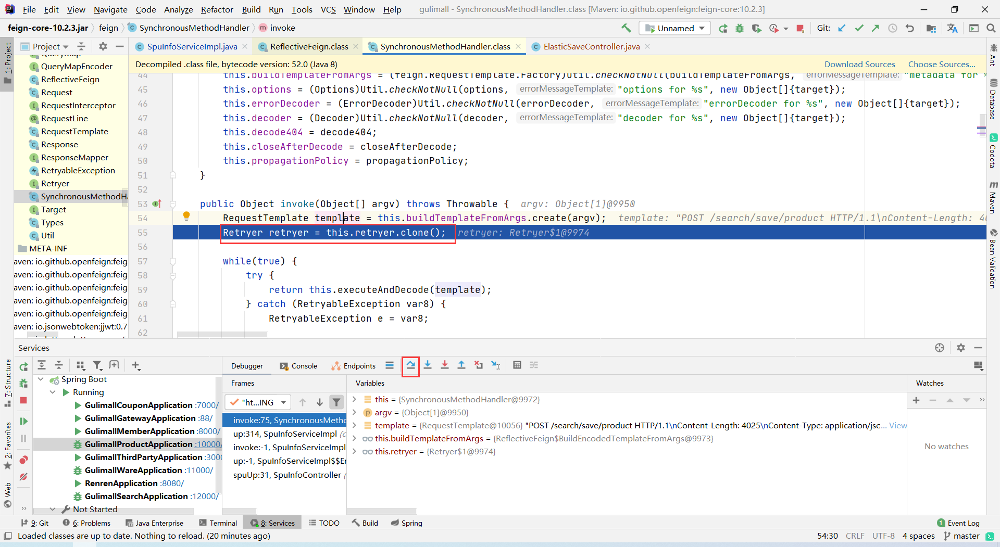

##### 9、准备执行和解码

点击`GulimallProductApplication`服务的`Step Over`(步过)按钮，执行当前方法的下一个语句

`return this.executeAndDecode(template);` 执行和解码

这行代码会远程执行请求，然后将响应拿过来，将响应数据解码

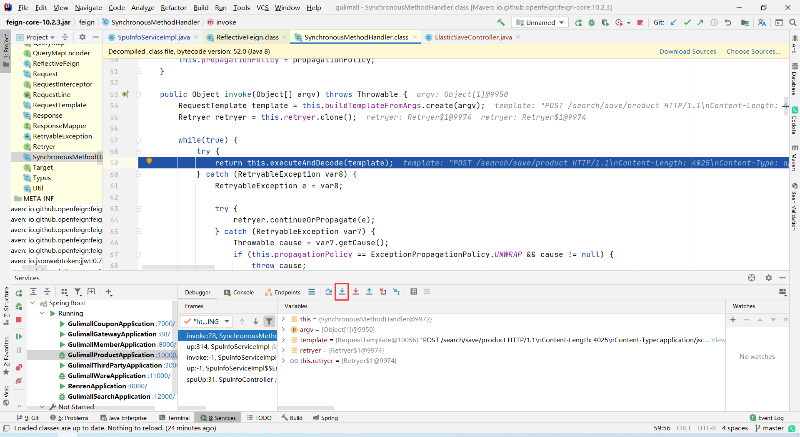

##### 10、点击`Step Into`

点击`Step Into`或按` F7`，进入`return this.executeAndDecode(template);`这个调用的方法内部

`Request request = this.targetRequest(template);`

使用刚刚创建的`template`构造一个目标请求

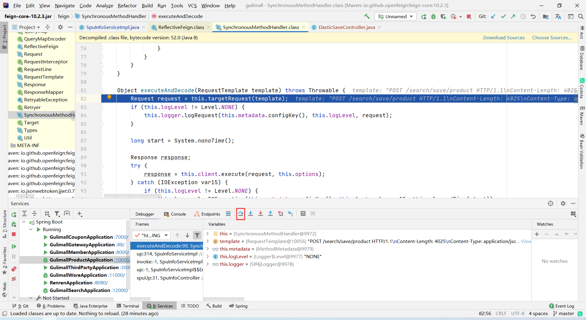

##### 11、有日志时会记录日志

点击`GulimallProductApplication`服务的`Step Over`(步过)按钮，执行当前方法的下一个语句

`if (this.logLevel != Level.NONE) {`

这里如果有日志的话，也会记录日志

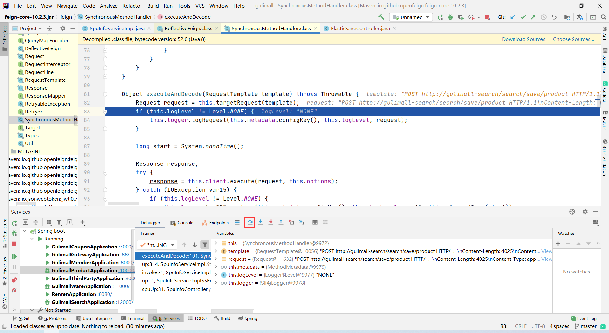

##### 12、点击`Step Over`(步过)按钮

点击`GulimallProductApplication`服务的`Step Over`(步过)按钮，执行当前方法的下一个语句

`long start = System.nanoTime();`

获取开始时间

```
返回正在运行的Java虚拟机的高分辨率时间源的当前值，以纳秒为单位。

此方法只能用于测量经过的时间，并且与系统或挂钟时间的任何其他概念无关。返回的值表示纳秒，因为某些固定的任意原点时间 （可能在将来，因此值可能为负）。

在Java虚拟机的实例中，所有对此方法的调用都使用相同的原点;其他虚拟机实例可能使用不同的来源。 此方法提供纳秒级精度，但不一定是纳秒级分辨率（即，值的变化频率） - 除了分辨率至少与currentTimeMillis（）的分辨率一样好之外，不做任何保证。

连续调用的差异超过大约292年（2^63纳秒）将无法正确计算由于数值溢出而导致的经过时间。 只有在计算在Java虚拟机的同一实例中获得的两个此类值之间的差异时，此方法返回的值才有意义。

例如，要测量某些代码执行所需的时间：

long startTime = System.nanoTime（）; 
// ...正在测量的代码...... 
long estimatedTime = System.nanoTime（） -  startTime; 
比较两个nanoTime值 
long t0 = System.nanoTime（）; ... long t1 = System.nanoTime（）;

一个应该使用t1 - t0 <0，而不是t1 <t0，因为数字溢出的可能性.

Returns：正在运行的Java虚拟机的高分辨率时间源的当前值，以纳秒为单位

从以下版本开始：1.5
```

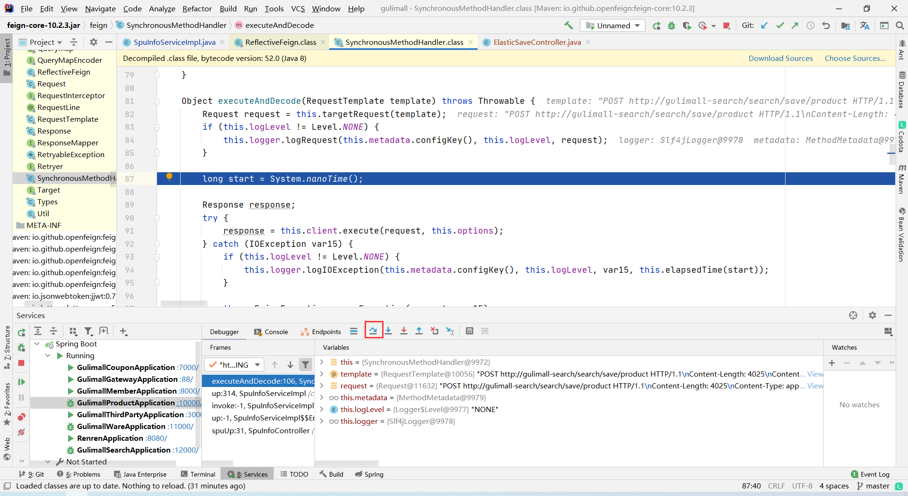

##### 13、负载均衡的`feign`客户端

点击`GulimallProductApplication`服务的`Step Over`(步过)按钮，执行当前方法的下一个语句

`response = this.client.execute(request, this.options);`这里就是正真的执行

`this.client`为`LoadBalancerFeignClient` 负载均衡的`feign`客户端，会正真负载均衡的执行这个请求，该调用哪个服务就调用那个服务

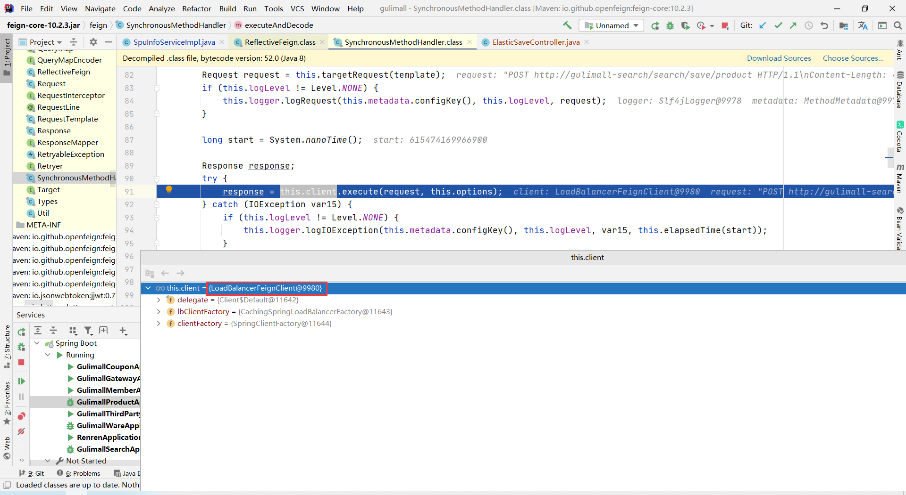

##### 14、发送http请求

这个执行请求的过程就是发送http请求的过程，这里就不看了

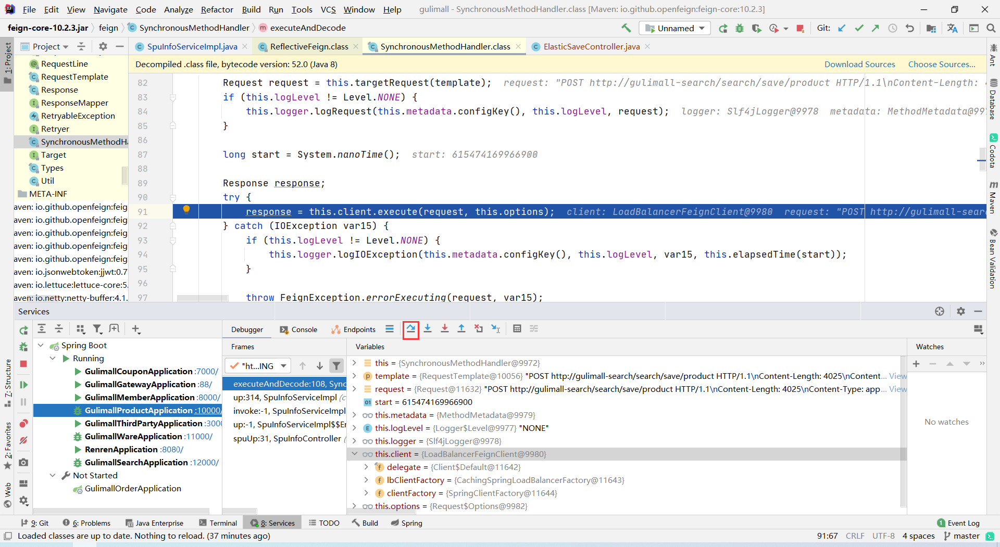

#### 4、来到`search`项目

##### 1、进入`ElasticSaveController`类

直接点击`GulimallProductApplication`服务的`Step Over`(步过)按钮，执行当前方法的下一个语句，由于`response = this.client.execute(request, this.options);`方法会调用`GulimallSearchApplication`服务

所以就来到了`gulimall-search`模块的`com.atguigu.gulimall.search.controller.ElasticSaveController`类的`productStatusUp`方法

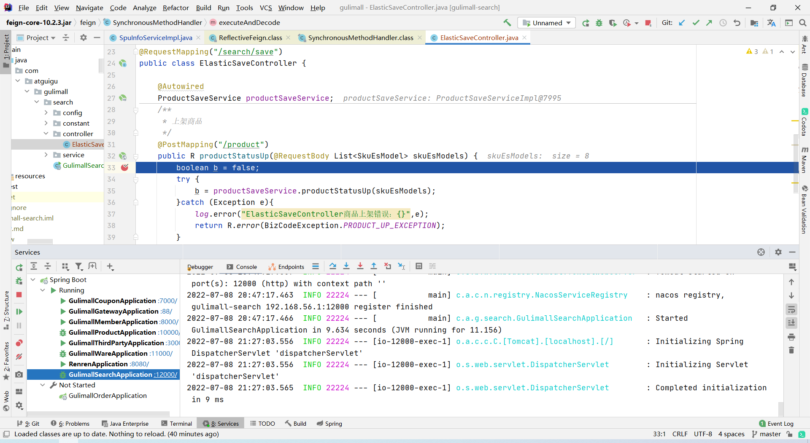

可以看到`skuEsModels`已经封装好了数据，这里封装的数据得益于`Spring MVC`

而发送`htpp`请求时发送的数据得益于`felgn`

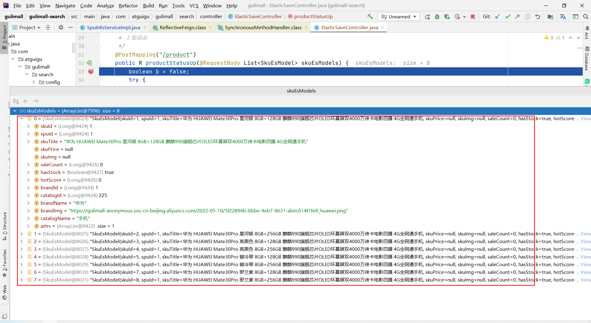

##### 2、打两个断点

在`gulimall-search`模块的`com.atguigu.gulimall.search.service.impl.ProductSaveServiceImpl`类的`productStatusUp`方法的`BulkRequest bulkRequest = new BulkRequest();`和`BulkResponse bulk = restHighLevelClient.bulk(bulkRequest, GulimallElasticSearchConfig.COMMON_OPTIONS);`各打一个断点，共打两个断点

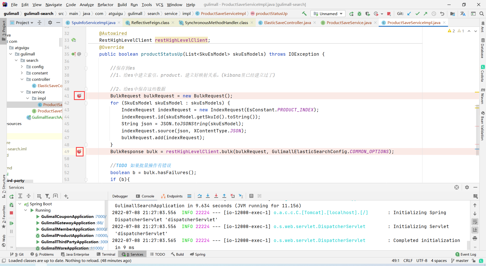

##### 3、点击`Step Over`(步过)按钮

点击`GulimallSearchApplication`服务的`Step Over`(步过)按钮，执行当前方法的下一个语句

`b = productSaveService.productStatusUp(skuEsModels);`

这里准备调用`ProductSaveServiceImpl`类的`productStatusUp`方法

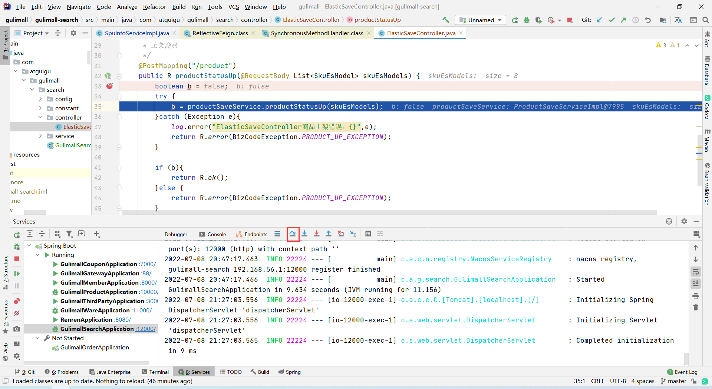

##### 4、点击`Step Into`

点击`Step Into`或按` F7`，进入`b = productSaveService.productStatusUp(skuEsModels);`调用的方法内部

然后就进入`ProductSaveServiceImpl` 类的`productStatusUp`方法，这里比较简单就不看了


##### 5、`productStatusUp`方法里打断点

在`gulimall-search`模块的`com.atguigu.gulimall.search.controller.ElasticSaveController`类的`productStatusUp`方法的`if (b){`这里打个断点

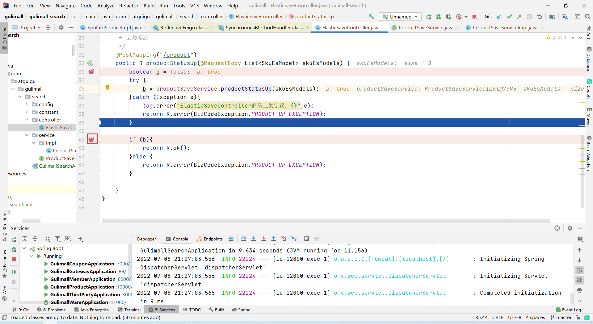

##### 6、点击`Resume Program`

点击`Resume Program`或按`F9`，执行到`if (b){`这里，可以看到此时的`b`的值为`true`，证明执行成功了

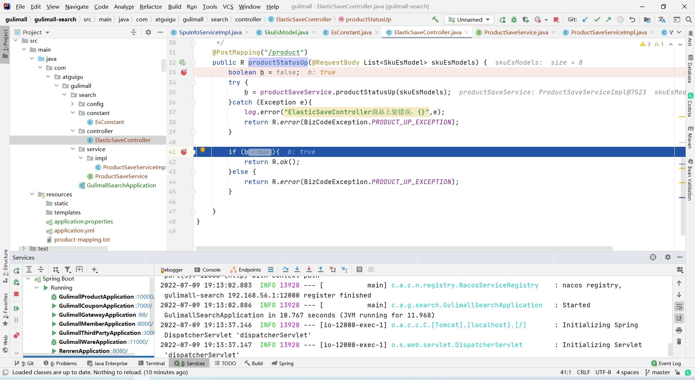

##### 7、`Read timed out`

点击`Resume Program`或按`F9`，切换到`GulimallProductApplication`服务，点击控制台就可以看到抛出了读取超时异常

```
Caused by: java.net.SocketTimeoutException: Read timed out
	at java.net.SocketInputStream.socketRead0(Native Method) ~[na:1.8.0_301]
```

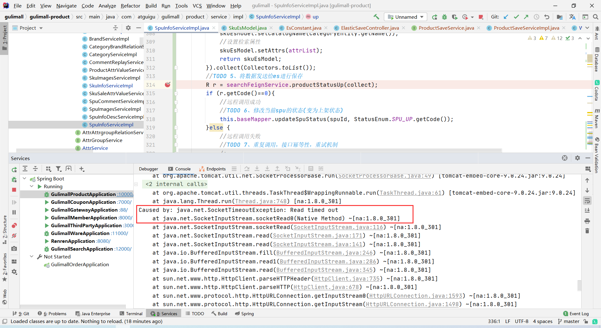

##### 8、总结

```
Feign调用流程
1、构造请求数据，将对象转为json
    RequestTemplate template = buildTemplateFromArgs.create(argv);
2、发送请求进行执行(执行成功会解码响应数据)
    executeAndDecode(template); 
3、执行请求会有重试机制
    while(true){
        try{
            executeAndDecode(template);
        }catch(){
            try{retryer.continueOrPropagate(e);}catch(){throw ex;}
            continue;
        }
    }
```

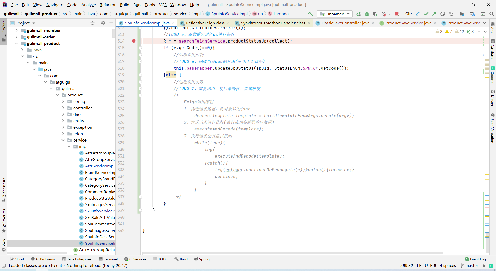

### 5.2.10、解决bug

#### 1、准备工作

##### 1、重新打断点

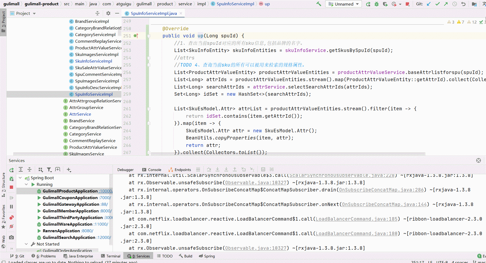

随便右击一个断点，也可以来到断点管理界面

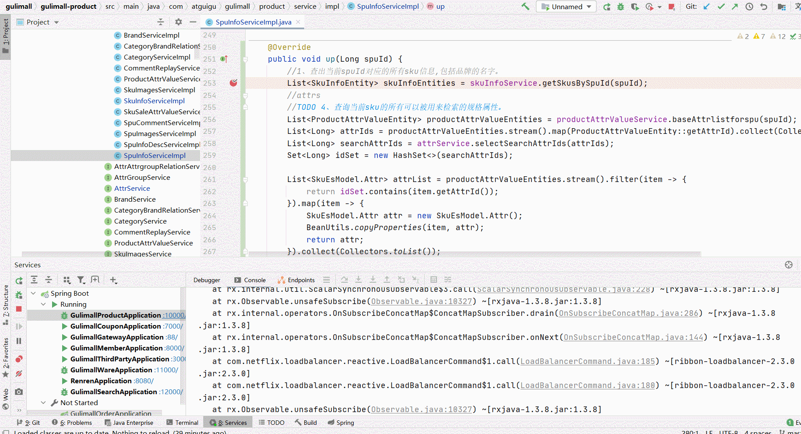

##### 2、点击`上架`

刷新前端项目，然后在`商品系统/商品维护/spu管理`里的id为`2`的商品里点击右侧`操作`里的`上架`

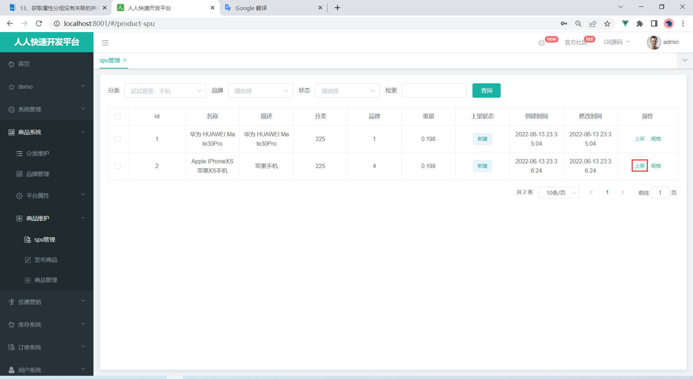

#### 2、开始测试

##### 1、切换到`IDEA`

切换到`IDEA`，来到`gulimall-product`模块的`com.atguigu.gulimall.product.service.impl.SpuInfoServiceImpl`类的`up`方法

`List<SkuInfoEntity> skuInfoEntities = skuInfoService.getSkusBySpuId(spuId);`

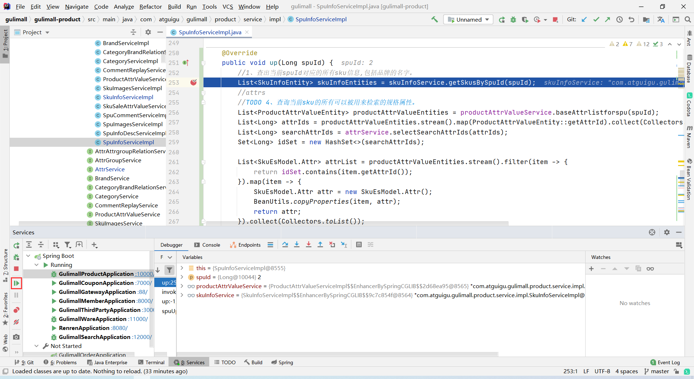

##### 2、点击`Resume Program`

点击`Resume Program`或按`F9`，来到`RS<List<SkuHasStockTo>> skuHasStock = wareFelginService.getSkuHasStock(skuIdList);`这里

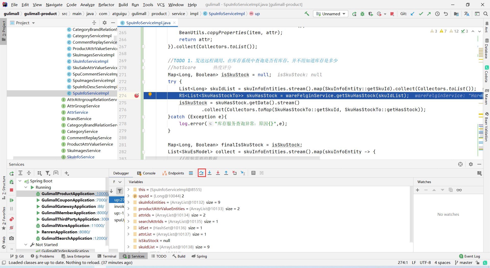

##### 3、点击`Step Over`(步过)按钮

点击`GulimallSearchApplication`服务的`Step Over`(步过)按钮，执行当前方法的下一个语句

可以看到`skuHasStock`的`size = 0`

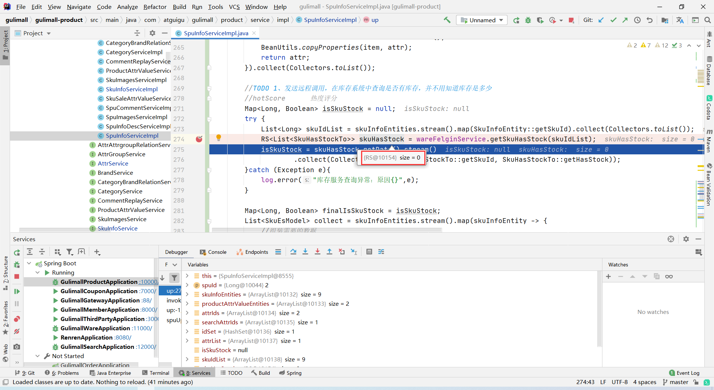

可以看到`skuHasStock`对象的值为`null`

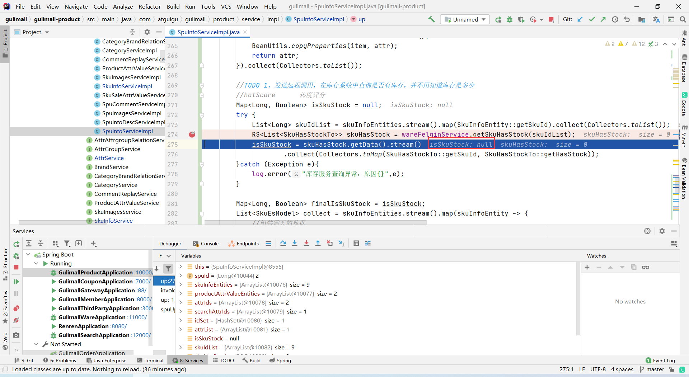

##### 4、打断点

在`gulimall-ware`模块的`com.atguigu.gulimall.ware.controller.WareSkuController`类的`getSkuHasStock`方法的`return new RS<>(skuHasStocks);`这里打上断点

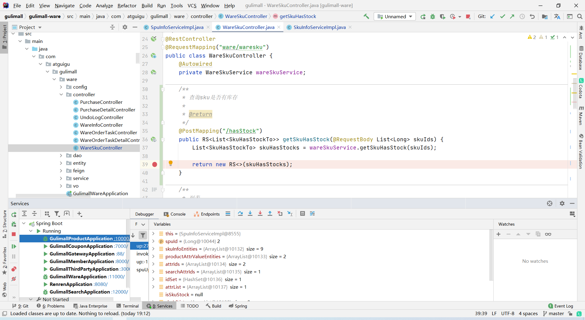

#### 3、重新测试

重新以`debug`方式启动`GulimallProductApplication`商品服务和`GulimallWareApplication`库存服务

刷新前端页面，再次在`商品系统/商品维护/spu管理`里的id为`1`的商品里点击右侧`操作`里的`上架`

##### 1、点击`Resume Program`

点击`Resume Program`或按`F9`，来到`RS<List<SkuHasStockTo>> skuHasStock = wareFelginService.getSkuHasStock(skuIdList);`这里

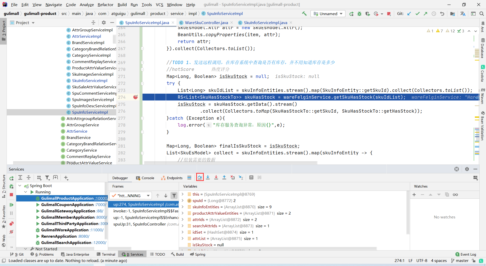

##### 2、点击`Step Over`(步过)按钮

点击`GulimallProductApplication`服务的`Step Over`(步过)按钮，执行当前方法的下一个语句

来到`gulimall-ware`模块的`com.atguigu.gulimall.ware.controller.WareSkuController`类的`getSkuHasStock`方法的`return new RS<>(skuHasStocks);`这里

可以看到`skuHasStocks`已经正确查询出数据

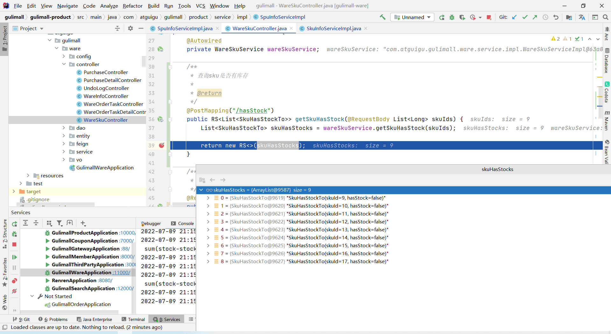

##### 3、点击`Step Into`

点击`Step Into`或按` F7`，进入` return new RS<>(skuHasStocks);`调用的方法内部

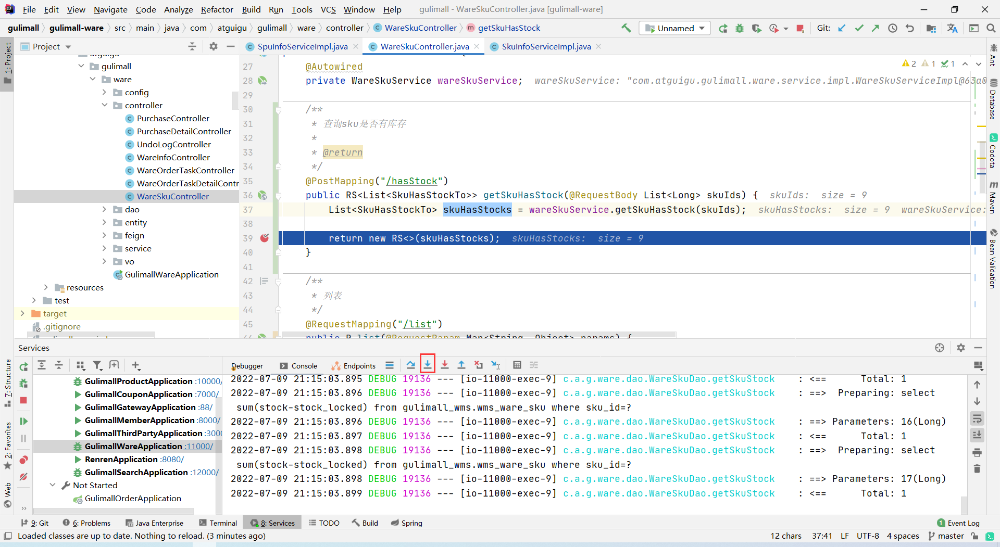

##### 4、来到`RS`类

可以看到来到了`gulimall-common`模块的`com.atguigu.common.utils.RS`类的`public R2(T t) {`这里


##### 5、点击`Step Over`(步过)按钮

点击`GulimallWareApplication`服务的`Step Over`(步过)按钮，执行当前方法的下一个语句，可以看到`this.setData(data);`

这里写错了，应该先调用`ok()`方法，不过这也不影响结果，只是不符合规范，也不会导致获取不到`data`

```java
public R2(T t) {
   this.ok();
   this.setData(data);
}
```

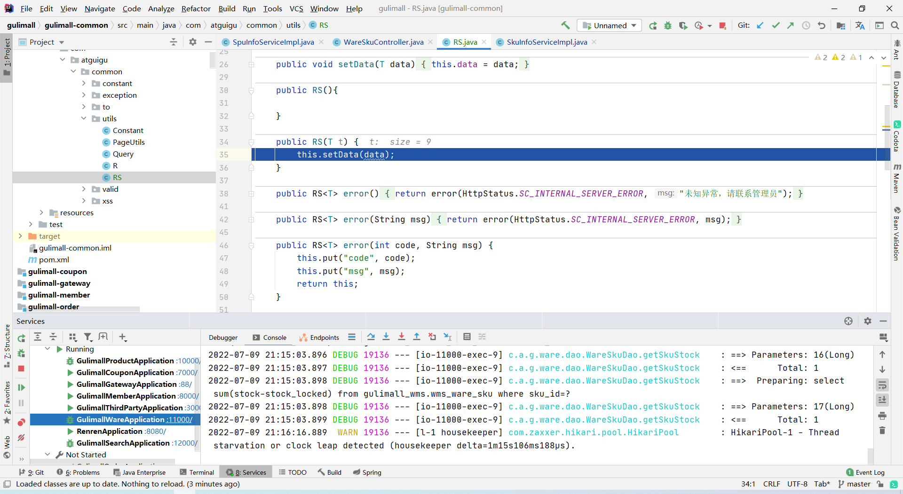

##### 6、点击`Step Over`(步过)按钮

点击`GulimallWareApplication`服务的`Step Over`(步过)按钮，执行当前方法的下一个语句

执行完`public R2(T t) {`这个构造器

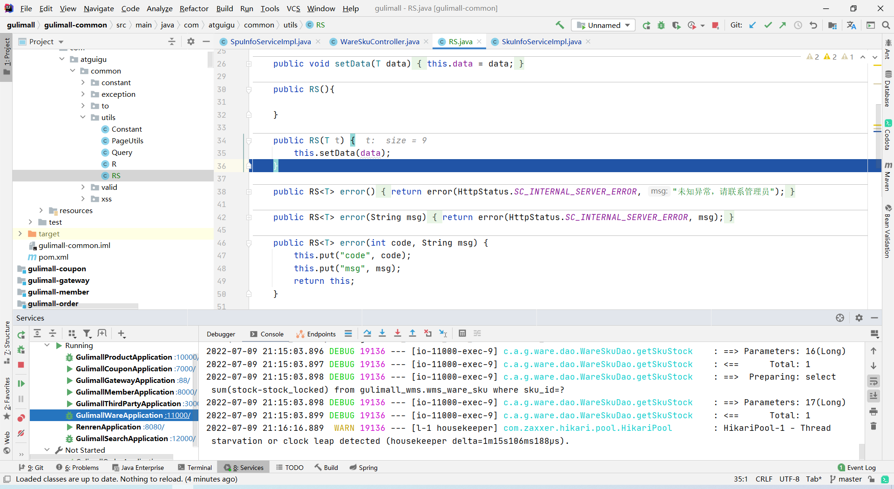

可以看到此时该对象的`size = 0`

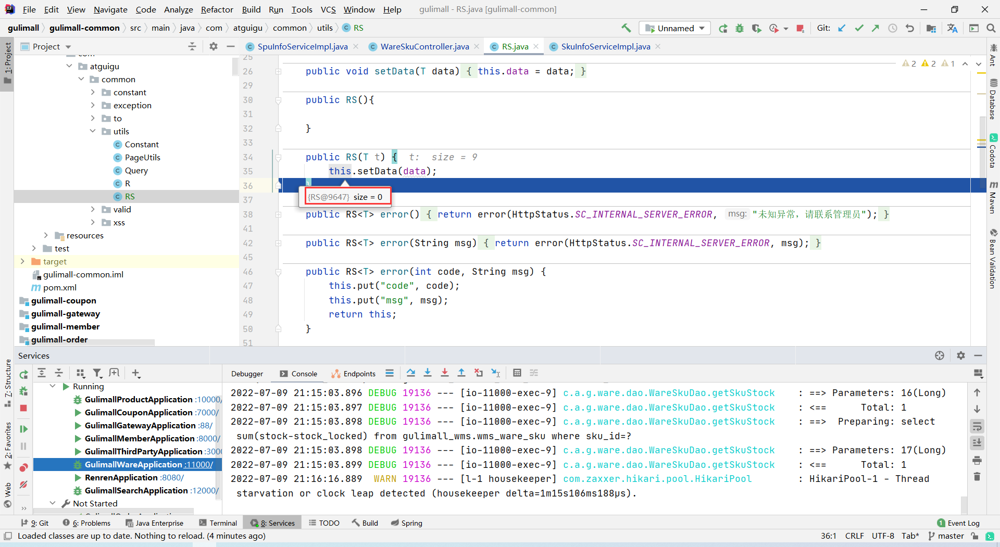

这里没用是因为Jackson对于HashMap类型会有特殊的处理方式，具体来说就是会对类进行向上转型为Map，导致子类的私有属性消失，IDEA以`debug`方式也看不到这些属性的信息

父类实现序列化，子类就不需要实现序列化（也相当于实现了序列化），这里存不进去值是因为R的保存属性是一个复杂类型，这个类型（SkuHasStockTo）没有实现序列化接口

```
类继承于map或者list或者set后，在其他对于这个类的操作时需要特别注意，比如，使用fastjson等工具类进行转换成json时将不会转换map、list、set之外的属性。举例，A类继承list后，又在A类中添加了一个name属性，如果将A类转换成json将不会包含A类的属性，就是json中不包含name属性，只会调用list的中的比如迭代器进行遍历list的方式查询list中的数据。如果A类是自己set属性后自己get属性，那么没有影响。
```

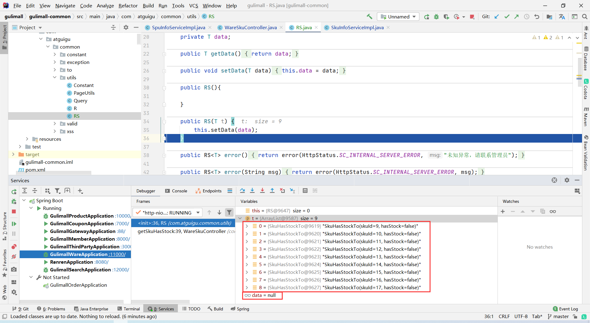

##### 7、修改返回的对象

###### 方法一：不继承HashMap(推荐)

```java
package com.atguigu.common.utils;

import lombok.Data;

@Data
public class RS<T> {
    private static final long serialVersionUID = 1L;

    private int code;

    private String msg;

    private boolean success;

    private T data;


    public RS<T> ok(String msg) {
        return this.ok(0,msg);
    }

    public RS<T> ok() {
        return this.ok(0,"success");
    }

    public RS<T> ok(int code, String msg) {
        this.code = code;
        this.msg = msg;
        this.success = true;
        return this;
    }

    public RS<T> ok(T t) {
        this.data = t;
        return this;
    }

    public RS<T> setData(T data) {
        this.data = data;
        return this;
    }

    public T getData() {
        return data;
    }

    public RS<T> error(int code, String msg) {
        this.code = code;
        this.msg = msg;
        this.success = false;
        return this;
    }


}
```

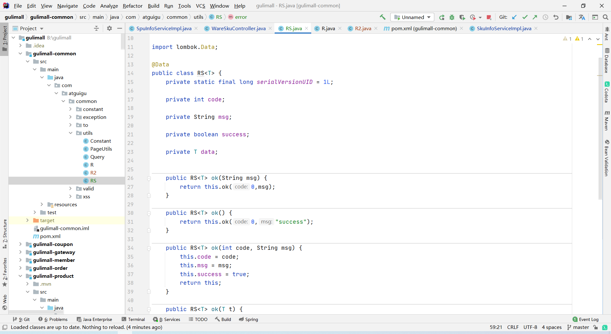

###### 方法二：写`get`和`set`方法

```java
/**
 * Copyright (c) 2016-2019 人人开源 All rights reserved.
 *
 * https://www.renren.io
 *
 * 版权所有，侵权必究！
 */

package com.atguigu.common.utils;

import com.alibaba.fastjson.JSON;
import com.alibaba.fastjson.TypeReference;
import com.atguigu.common.exception.BizCodeException;
import org.apache.http.HttpStatus;

import java.util.HashMap;
import java.util.Map;

public class R2 extends HashMap<String, Object> {
   private static final long serialVersionUID = 1L;

   public <T> T getData(TypeReference<T> tTypeReference) {
      Object data = get("data");
      String s = JSON.toJSONString(data);
      T t = JSON.parseObject(s,tTypeReference);
      return t;
   }

   public R2 setData(Object data) {
      this.put("data",data);
      return this;
   }

   public R2(){

   }

   
   public R2 error() {
      return error(HttpStatus.SC_INTERNAL_SERVER_ERROR, "未知异常，请联系管理员");
   }
   
   public R2 error(String msg) {
      return error(HttpStatus.SC_INTERNAL_SERVER_ERROR, msg);
   }
   
   public R2 error(int code, String msg) {
      this.put("code", code);
      this.put("msg", msg);
      return this;
   }

   public R2 error(BizCodeException bizCodeException){
      return error(bizCodeException.getCode(),bizCodeException.getMsg());
   }

   public R2 ok() {
      this.put("code", 0);
      this.put("msg", "success");
      return this;
   }

   public R2 ok(String msg) {
      this.put("code", 0);
      this.put("msg", msg);
      return this;
   }

   public R2 ok(int code, String msg) {
      this.put("code", code);
      this.put("msg", msg);
      return this;
   }

   public R2 ok(Map<String, Object> map) {
      this.ok();
      this.putAll(map);
      return this;
   }


   @Override
   public R2 put(String key, Object value) {
      super.put(key, value);
      return this;
   }


   public Integer getCode(){
      return (Integer) this.get("code");
   }
}
```

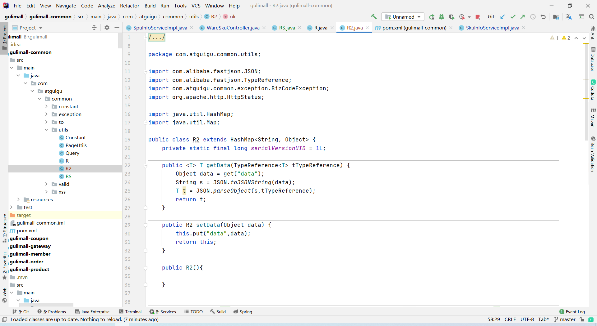

##### 8、修改`getSkuHasStock`方法

修改`gulimall-ware`模块的`com.atguigu.gulimall.ware.controller.WareSkuController`类的`getSkuHasStock`方法

并在`RS<List<SkuHasStockTo>> rs = new RS<List<SkuHasStockTo>>();`打上断点

```java
@PostMapping("/hasStock")
public RS<List<SkuHasStockTo>> getSkuHasStock(@RequestBody List<Long> skuIds) {
    List<SkuHasStockTo> skuHasStocks = wareSkuService.getSkuHasStock(skuIds);

    RS<List<SkuHasStockTo>> rs = new RS<List<SkuHasStockTo>>();
    RS<List<SkuHasStockTo>> ok = rs.ok();
    ok.setData(skuHasStocks);
    return rs;
}
```

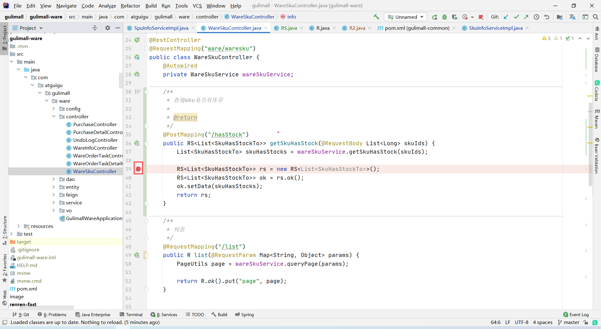

#### 4、重新测试

重新以`debug`方式启动`GulimallProductApplication`商品服务和`GulimallWareApplication`库存服务

刷新前端页面，再次在`商品系统/商品维护/spu管理`里的id为`1`的商品里点击右侧`操作`里的`上架`

##### 1、执行到`WareSkuController`类

不断执行断点，直到执行到`gulimall-ware`模块的`com.atguigu.gulimall.ware.controller.WareSkuController`类的`getSkuHasStock`方法的`return rs;`这里

可以看到已经正确封装对象了

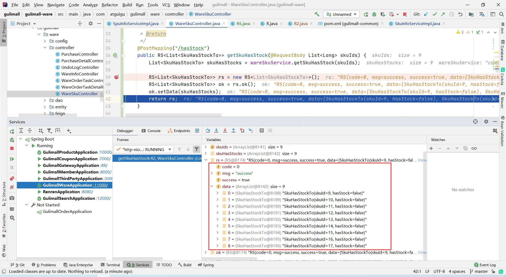

##### 2、超时异常

点击`Services`里的`GulimallProductApplication`服务，这时已经报了超时异常

这是因为刚刚调试用了很多时间，所以出现了超时异常

```
detailMessage ="Read timed out executing POST http://gulimall-ware/ware/waresku/hasStock"
```

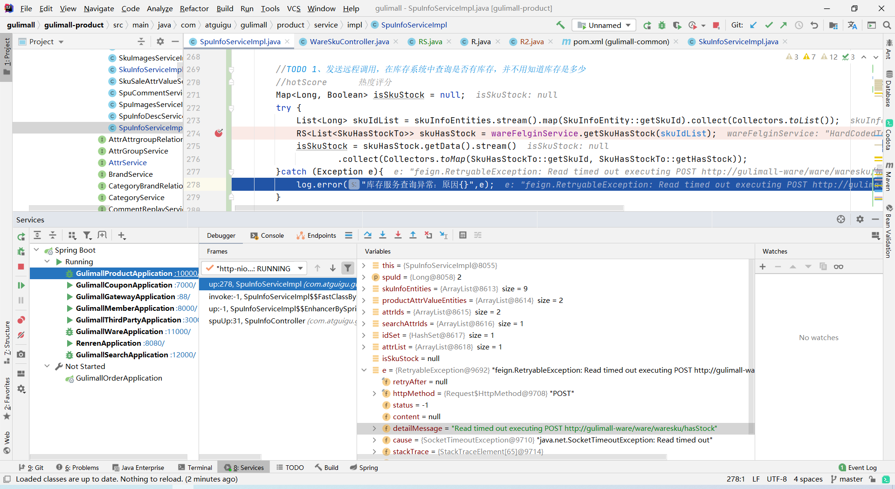

##### 3、取消`ware`模块的断点

取消`RS<List<SkuHasStockTo>> rs = new RS<List<SkuHasStockTo>>();`上的断点

修改`gulimall-ware`模块的`com.atguigu.gulimall.ware.controller.WareSkuController`类的`getSkuHasStock`方法，变为更加精简的方式

```java
@PostMapping("/hasStock")
public RS<List<SkuHasStockTo>> getSkuHasStock(@RequestBody List<Long> skuIds) {
    List<SkuHasStockTo> skuHasStocks = wareSkuService.getSkuHasStock(skuIds);

    RS<List<SkuHasStockTo>> rs = new RS<List<SkuHasStockTo>>();
    return rs.ok().setData(skuHasStocks);
}
```

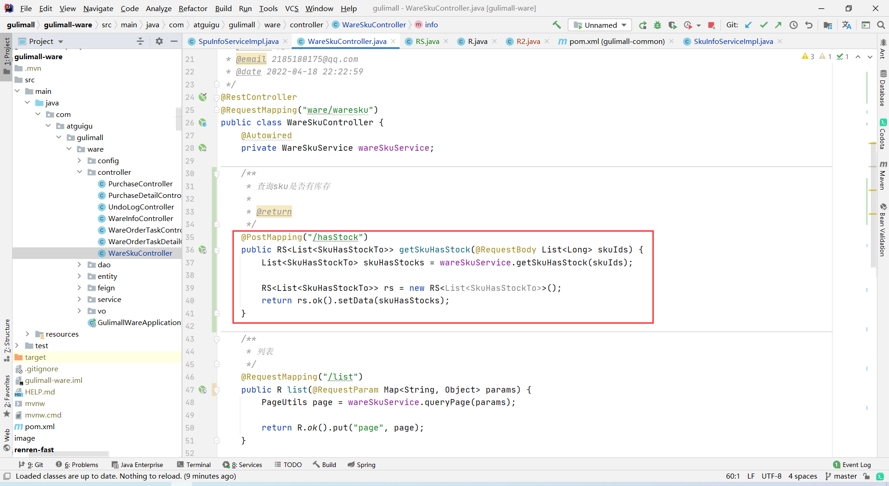

#### 5、再次测试

重新以`debug`方式启动`GulimallProductApplication`商品服务和`GulimallWareApplication`库存服务

刷新前端页面，再次在`商品系统/商品维护/spu管理`里的id为`1`的商品里点击右侧`操作`里的`上架`


在`gulimall-product`模块的`com.atguigu.gulimall.product.service.impl.SpuInfoServiceImpl`类的`up`方法

执行完`RS<List<SkuHasStockTo>> skuHasStock = wareFelginService.getSkuHasStock(skuIdList);`

来到`isSkuStock = skuHasStock.getData().stream().collect(Collectors.toMap(SkuHasStockTo::getSkuId, SkuHasStockTo::getHasStock));`这里可以看到以成功封装数据

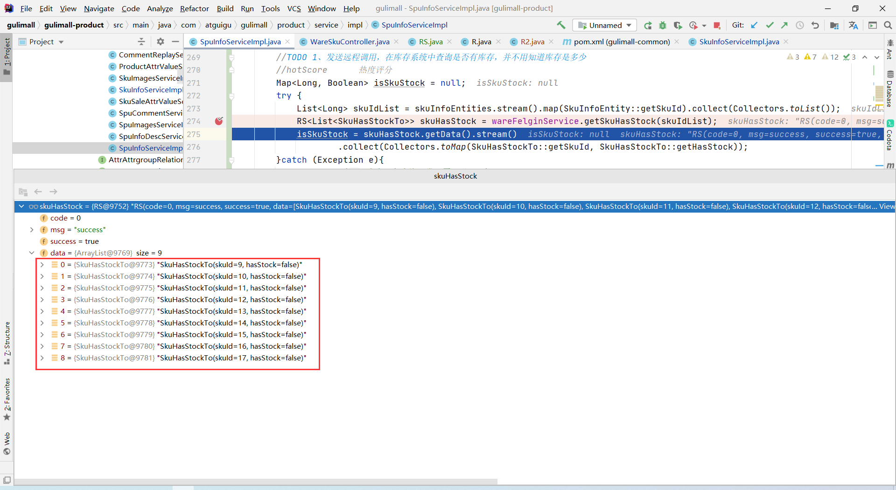

#### 6、 整体测试

重新以`debug`方式启动`GulimallProductApplication`商品服务和`GulimallWareApplication`库存服务

刷新前端项目，然后在`商品系统/商品维护/spu管理`里的id为`2`的商品里点击右侧`操作`里的`上架`

然后不断点击点击`Resume Program`或按`F9`，直到运行结束

切换到前端，可以看到在`商品系统/商品维护/spu管理`里的id为`2`的商品里`上架状`态已变为`已上架`

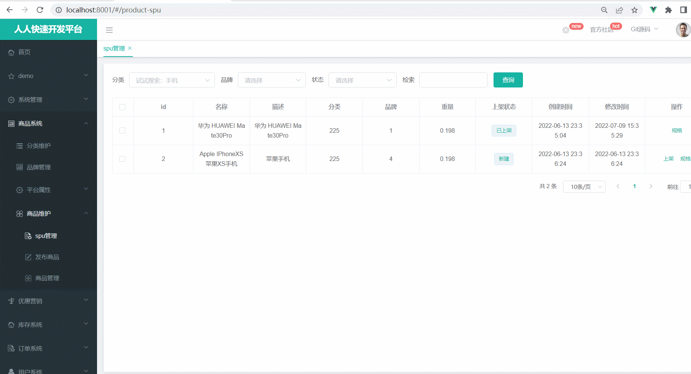

